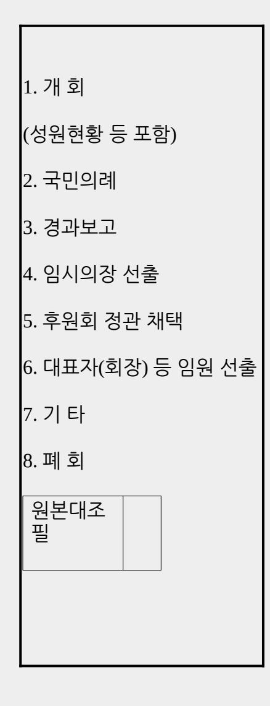

<!-- page: 1 -->

2026. 6. 3. 실시 제9회 전국동시지방선거

후원회 등록 및 정치자금영수증 등에 관한 안내

1

후원회 개요

후원회의 정의

「정치자금법」에 따라 정치자금의 기부를 목적으로 설립·운영되는 단체로서 관할 선거관리위원회에 등록된 단체

후원회의 기능

당해 후원회의 회원 또는 회원이 아닌 자로부터 후원금을 모금하여 당해 후보자(예비후보자)에게 정치자금을 기부하는 역할을 함.

후원회지정권자

❍ 지방자치단체장선거의 후보자 및 예비후보자

❍ 지역구지방의회의원선거의 후보자 및 예비후보자

※ 후원회를 둔 지방의원의 경우는 제외함.

후원회 설립과정

1. (지정신청) 후원회를 설립하고자 하는 후원회설립준비기구는 창립총회에서 정관 또는 규약 채택, 임원선출 등을 마치고 위' 후원회지정권자'에게 서면 또는 구두로 후원회 지정신청

2. (지정서 교부) 후원회 설립을 수락하는 후원회지정권자는 후원회설립준비기구에 대해'후원회지정서'교부

3. (등록신청) 지정 받은 후원회 대표자는 지정 받은 날부터 14일 이내에 후원회 지정서를 첨부하여 동대문구선관위에 후원회 등록 신청

<!-- page: 2 -->

#### 2

후원회 등록신청

후원회 등록신청 방법

1. 등록신청 서식 및 작성예시: [덧붙임1] 서식 1~7

※ 동대문구선거관리위원회(su.nec.go.kr)홈페이지 '선거자료'란에 원고 게시

※ 후원회 등록신청은 예비후보자 또는 후보자 등록 이후 가능

※ 후원회를 둔 지방의회의원이 해당 지방자치단체장(예비)후보자후원회를 두고자 하는 경우, 지방의회의원후원회를 지정신고 하거나, 별도의 지방자치단체장(예비)후보자후원회를 둘 수 있음

2. 등록신청사항

가. 후원회의 명칭·소재지, 정관 또는 규약, 대표자의 성명·주민등록번호·주소, 회인 및 그 대표자 직인의 인영

나. 구비서류

후원회 등록신청서, 정관 또는 규약, 대표자의 취임동의서, 인영서, 후원회지정서, 후원회결성 회의록 사본, 사무소의 소재지 약도

3. 후원회의 명칭·사무소·유급사무직원

가. 명칭 및 약칭

| 구 분               | 명 칭                 | 약 칭        |
|-------------------|---------------------|------------|
| 구청장후보자 (예비후보자)후원회 | 동대문구청장예비후보자○○○후원회   | ○○○후원회     |
|                   | 동대문구청장후보자○○○후원회     | (동대문구청장선거) |
|                   | 서울특별시동대문구제○선거구시의회의원 |            |
| 지역구시의회의원후보자       | 예비후보자○○○후원회         | ○○○후원회     |
| (예비후보자)후원회        | 서울특별시동대문구제○선거구시의회의원 | (서울시의원선거)  |
|                   | 후보자○○○후원회           |            |
|                   | 동대문구○선거구구의회의원       |            |
| 지역구자치구의회의원후보자     | 예비후보자○○○후원회         | ○○○후원회     |
| (예비후보자)후원회        | 동대문구○선거구구의회의원       | (동대문구의원선거) |
|                   | 후보자○○○후원회           |            |

나. 사무소 : 1개소를 설치할 수 있음.

4. 유의사항

다. 유급사무직원 : 후원회의 사무소에 2인 이내에서 둘 수 있음.

가. 후원회 지정서

후원회 지정권자는 후원회가 창립총회를 거쳐 후원회의 정관 또는 규약의 제정, 대표자 선임 등 내부기구가 구성되고 후원회로서 제반 구성요건(등록요건)이 갖추어진 상태에서 후원회 지정을 하여야 함.

나. 정관 또는 규약

❍ 후원회의 정관 또는 규약은 다음 사항을 포함하여야 함.

| 정관 규약으로 정하여야 할 사항 ․        |
|-------------------------------|
| ․ ◦ 명칭 목적 및 소재지            |
| ◦ 회원의 가입과 탈퇴 등 신분에 관한 사항      |
| ◦ 후원금의 모금 및 기부에 관한 사항         |

<!-- page: 3 -->

| ◦ 대표자 및 회계책임자의 선임 및 해임에 관한 사항 |
| ◦ 대표자가 사고가 있을 때의 직무대리에 관한 사항  |
| ◦ 해산에 관한 사항                   |
| ◦ 정관 또는 규약의 변경에 관한 사항         |
| ◦ 후원회의 대의기관 또는 그 수임기관에 관한 사항  |
| ◦ 후원회의 감사기관에 관한 사항            |
| ◦ 그 밖의 후원회 운영에 관한 사항          |

❍ 정관 또는 규약은 후원회결성 회의 시 그 대의기관의 의결에 의하여 결정함.

다. 취임동의서

❍ 후원회의 대표자는 당해 후원회의 회원으로서 후원회결성 회의 시 선출하여야 함.

❍ 후원회 대표자는 당해 후원회 회계책임자를 겸임할 수 없음.

라. 인영서

❍ 회인은 당해 후원회의 명칭(또는 약칭)에'인'자를 붙여 조각하여 날인함.

예 : 동대문구청장․(서울특별시동대문구제○선거구,동대문구○선거구)(시 구․ )의회의원(예비)후보자 ○○○후원회인

❍ 대표자 직인은 후원회 명칭(또는 약칭)에 '대표자인'을 붙여 조각하여 날인함.

예 : 동대문구청장․(서울특별시동대문구제○선거구,동대문구○선거구)(시 구․ )의회의원(예비)후보자 ○○○후원회대표자인

마. 후원회 회의록

❍ 후원회의 성립·소멸과 변경에 관한 중요한 사항은 당해 후원회의 정관이나 규약에서 정한 바에 따라

후원회의 구성원인 회원의 총의를 반영할 수 있는 회의를 개최 결정하여야 함 ․ .

❍ 회의록에는 회의개최일시·장소, 성원상황과 부의 안건처리 등 회의진행상황이 자세히 기록되어야 하며 기록자와 확인자의 서명·날인이 있어야 함.

❍ 회의록 사본을 제출하는 때에는 당해 후원회의 관계자가 원본과 대조하여 틀림이 없음을 확인한 후 원본대조필과 담당자의 인장을 날인함.

바. 후원회의 대표자는 공직선거의 선거운동을 할 수 있는 자 중에서 회계책임자 1인을 선임하여 후원회 등록을 신청하는 때에 동대문구선거관리위원회에 신고하여야 함.

후원회 변경등록신청

1. 사 유 : 후원회 명칭·소재지·정관·규약·회인, 대표자 성명·주민등록번호·주소·직인의 인영 등 변경 시

2. 신청자 : 기 등록된 대표자

3. 서 식 : 후원회 변경등록신청서([덧붙임1] 서식 8)

<!-- page: 4 -->

※ 예비후보자가 후보자로 등록 시 명칭·인영 변경등록신청 불요

- 후보자후원회 명칭의 변경등록은 선거관리위원회 직권으로 함(등록증은 미교부).

- 후보자후원회의 인영을 변경등록 하지 않는 경우 기존 예비후보자후원회의 인영을 새로운 후원회의 인영으로 간주함.

3

후원회 해산신고

해산사유

1. 후원회지정권자가 후원회 지정을 철회한 때

2. 후원회 정관 등에서 정한 해산사유의 발생(법정해산 이외의 사유)으로 당해 후원회가 해산결의한 때

3. 그 밖의 사유로 후원회가 해산한 날

해산신고 기한 : 해산일로부터 14일 이내 ※ 지정권자의 신분상실로 해산되는 경우 제외

해산신고 서류 : 후원회 해산신고서([덧붙임1] 서식 9)

4

회계책임자 및 예금계좌 신고

회계책임자 신고

1. 선임권자 : 후원회의 대표자

2. 회계책임자로 선임될 수 있는 자 :「공직선거법」상 선거운동을 할수 있는 자

3. 신고시기 : 후원회 등록신청시

4. 구비서류 : 회계책임자 선임신고서([덧붙임1] 서식 11), 회계책임자 취임동의서([덧붙임1] 서식 12), 수입·지출용 예금통장 사본

5. 유의사항 : 회계책임자는 1인을 선임하여야 하며, 누구든지 2이상의 회계책임자를 겸할 수 없음

예금계좌 개설신고

1. 개설명의 : 후원회명 또는 회계책임자

※ 회계책임자 변경시 예금계좌 변경신고를 해야 하는 등 번거로움이 있을 수 있으므로 가급적 후원회명 명의로 개설

<!-- page: 5 -->

※ 후원인이 금융거래입금증을 면세 영수증으로 사용하기 위해서는 후원회명의로 개설된 예금계좌이어야 하고, 후원회명으로 예금계좌를 개설하기 위해서는 후원회등록증 등 구비서류를 갖추어 관할세무서로부터 고유번호증을 발급 받아야 함.

2. 개설방법 : 정치자금 수입용과 지출용을 각각 개설하거나, 1개의 예금계좌를 개설하여 수입과 지출 겸용으로 사용 가능

※ 정치자금 수입용과 지출용 계좌를 각각 개설하는 경우에는 수입용 계좌로 입금된 정치자금을 지출용 계좌로 이체한 후 지출하여야 함.

※ 수입용 계좌의 수는 제한이 없으나 지출용 계좌는 반드시 1개만 사용

3. 신고시기 : 회계책임자 선임신고시

4. 구비서류 : 예금계좌 신고서([덧붙임1] 서식 13), 예금통장 사본 각 1부

※ 예금통장 사본을 첨부하여 회계책임자 선임신고를 하는 경우 신고서 생략

회계책임자 변경신고

1. 신고권자 : 선임권자(후원회의 대표자)

2. 신고시기 : 변경이 있는 때부터 14일 이내

3. 구비서류 : 회계책임자 변경신고서([덧붙임1] 서식 11), 취임동의서([덧붙임1] 서식 12), 정치자금의 수입과 지출 인계·인수서([덧붙임1] 서식 14)

5

정치자금영수증 발급·교부

정치자금영수증 개요

후원회가 후원인으로부터 후원금을 기부받은 때에는 중앙위원회가 제작 배부한 정치자금영수증을 ․ 발행하여 후원금을 기부 받은 날부터 30일까지 후원인에게 교부하여야 함.

정치자금영수증 발급방법(1 또는 2 방법으로 발행)

1. 정치후원금센터 사이트를 이용한 정치자금영수증 발급

❍ 발급신청·수령에 따른 불편 해소 및 발급신청 수입인지 비용 미발생되어 주된 정치자금영수증 발급방법임.

❍ 정치후원금센터에서 후원금 내역을 등록하고 영수증을 종이인쇄 또는 PDF방식(전자파일)으로 출력

※ 정치후원금센터 사이트 이용신청서([덧붙임1] 서식 15)

※ 정치후원금센터 사이트 이용방법 : 참고

2. 중앙선관위가 제작한 종이 정치자금영수증 발행

❍ 후원회가 정치자금영수증을 발급받고자 하는 때에는 정치자금영수증의 종류와 발급수량 등을 기재한 신청서를 동대문구선관위에 제출하여야 함.

※ 신청서 서식 : 정치자금영수증 발급신청서([덧붙임1] 서식 16)

❍ 정치자금영수증의 발급을 신청할 때에는 정치자금영수증 제작비용(1매당 40원)에 상당하는 수입인지를 신청서의 뒷면에 첩부하여야 함.

❍ 후원회가 연간 발급받을 수 있는 정액영수증의 액면가액 총액은 모금한도액(당해 선거비용제한액의 100분의 50에 해당하는 금액)을 초과할 수 없음. 이 경우 후원회는 과다한 수량을 반납하지 않도록 적정매수를 발급 신청하여야 함.

※ 후원금 모금 한도액

<!-- page: 6 -->

- 시의원후보자등 : 5천만원(지역구에 후보자로 등록한 시의원후원회:1억원)

- 구의원후보자등 : 3천만원(지역구에 후보자로 등록한 구의원후원회: 6천만원)

- 구청장후보자등 : 선거비용제한액의 100분의 50

정치자금영수증 교부

1. 원 칙

❍ 후원회가 후원인으로부터 후원금을 기부 받은 때에는 기부받은 날로부터 30일 이내에 정치자금영수증을 후원인에게 교부하여야 함.

❍ 1회 1만원 이하의 후원금 기부에 대한 정치자금영수증은 후원회 해산일 현재로 일괄 발행 교부할 ・ 수 있음.

2. 예 외

다음의 어느 하나에 해당되는 경우에는 정치자금영수증을 후원인에게 교부하지 아니하고 후원회가 발행하여 원부와 함께 보관할 수 있음.

❍ 후원인이 정치자금영수증 수령을 원하지 않는 경우

❍ 익명기부, 신용카드 예금계좌 전화 등에 의한 기부로 후원인의 주소 등 연락처를 알 수 없는 경우 ・ ・

❍ 후원인이 연간 1만원 이하의 후원금을 기부한 경우

정치자금영수증 관리

후원회는 정치자금영수증 발행 반납대장 을 비치하여 정치자금영수증의 수령 발행 반납상황을 「 ・ 」 ・ ・ 기재

※ 대장 서식 : 정치자금영수증 발행 반납대장 ・ ([덧붙임1] 서식 17)

※ 정치후원금센터 이용 시 전산으로 관리 가능

정치자금영수증 잔여매수 반납보고 [종이 정치자금영수증만 해당]

1. 시 기 : 등록말소된 후원회 회계보고 시['26. 7. 3.까지]

※ 기한 내에 매수를 보고 또는 반납하지 아니한 경우에는 그 액면금액총액을 기부 받은 것으로 봄.

2. 반납대상 : 발급받아 사용하지 아니한 종이 정치자금영수증 잔량

3. 반 납 처 : 동대문구선거관리위원회

4. 서 식 : 정치자금영수증 잔여매수 반납보고서([덧붙임] 서식 18)

덧붙임 1, 각종 서식 목록 1부.

2. 정치후원금센터 이용 안내 1부.

[덧붙임 1]

<!-- page: 7 -->

#### 각종 서식 목록

| 구 분      | 서 식 명                    |
|----------|--------------------------|
| 서식 1     | 후원회 등록신청서                |
| 서식 2     | 후원회 표준정관                 |
| 서식 3     |                          |
| 서식 4     |                          |
| 서식 5     |                          |
| 서식 6     |                          |
| 서식 7     |                          |
| 서식 8     |                          |
| 서식 9     | 지방자치단체장후보자등 후원회 지정신고서 |
| 서식 10 | 후원회 해산신고서                |

| 후원회를 위와 같이 결성하였기에 정치자금법 제 7조제1항 및 정치자금사무관리 규칙 제 「 」 「 」 | 6조제1 |
|------------------------------------------------------------------------------------|------|
|------------------------------------------------------------------------------------|------|

| 문서번호               |    |                                                                     |         |  |
|--------------------|----|---------------------------------------------------------------------|---------|--|
| 명칭(약칭)             |    | (명칭)서울특별시동대문구제○선거구시의회의원후보자(예비후보자)○○○ 후원회 (약칭) ○○○후원회(서울시의원선거) |         |  |
| 사무소의 소재지           |    |                                                                     | 전 화 번 호 |  |
| 대표자                | 성명 | (한자: )                                                              | 주민등록번호  |  |
|                    | 주소 |                                                                     | 전 화 번 호 |  |
| 정관 또는 규약           |    | 별첨과 같음                                                              |         |  |
| 회인 및 대표자 직인의 인영 |    | 별첨과 같음                                                              |         |  |
|                    |    |                                                                     |         |  |

서식 1

후원회 등록신청서

<!-- page: 8 -->

서식

| 11       | 회계책임자 (선임) (․ 겸임) (‧ 변경) 신고서 |
|----------|------------------------------------|
| 서식 12 | 회계책임자 취임동의서                        |
| 서식 13 | 예금계좌 (신고)·(변경신고)서                  |
| 서식 14 | 정치자금 수입과 지출 인계·인수서                 |
| 서식 15 | 정치후원금센터 사이트 이용신청서                  |
| 서식 16 | 정치자금영수증 발급신청서                      |
| 서식 17 | 정치자금영수증 발행 반납대장 ・            |
| 서식 18 | 정치자금영수증 잔여매수 반납보고서                 |
|          |                                    |

| 항에 따라 후원회의 등록을 신청합니다.                                                                |
|--------------------------------------------------------------------------------------|
| 2026년 월 일                                                                         |
| 서울특별시동대문구제○선거구시의회의원후보자(예비후보자)○○○후원회 대표자 직인                                        |
| 동대문구선거관리위원회 귀중                                                                       |
| ※ 구비서류                                                                               |
| 1. 정관 또는 규약 1부.                                                                      |
| 2. 대표자의 취임동의서 1부.                                                                    |
| 3. 인영서<별지> 1부.                                                                       |
| 4. 후원회지정서 1부.                                                                        |
| 5. 후원회결성 회의록 사본 1부.                                                                  |
| 6. 사무소의 소재지 약도 1부.                                                                   |
| 주 1. 후원회 명칭에 약칭을 사용하는 경우 "명칭(약칭)"란에는 「정치자금사무관리 규칙」 제7조에 따른 후원회의 명칭과 약칭을 함께 기재합니다. |
| 2. 회의록은 기록자·확인자의 서명·날인이 있어야 하며, 사본을 제출하는 때에는 "원본대조필" 표시와 담당자의 날인이 있어야 합니다.        |

서식 2

동대문구청장․(서울특별시동대문구제○선거구,동대문구○선거구)(시,구)의회의원(예비)후보자○○○

후원회 정관

2026년 월 일

동대문구청장․(서울특별시동대문구제○선거구,동대문구○선거구) (시 구․ )의회의원(예비)후보자 ○○○후원회

<!-- page: 9 -->

### 제1장 총 칙

제1조(명칭) 본 회의 명칭은 '동대문구청장․(서울특별시동대문구제○선거구,동대문구○선거구)(시 구․ ) 의회의원(예비)후보자○○○후원회 ', 약칭은 '○○○후원회(동대문구청장 서울시의원 ․ ․ 동대문구의원선거)'라 칭한다. (이하 "후원회"라 한다.)

제2조(목적) 본 후원회는 회원 또는 회원 이외의 자로부터 후원금을 모금하여 후원회지정권자 ○○○ 에게 기부하는 것을 목적으로 한다.

제3조(사무소 소재지) 본 후원회의 주된 사무소는 동대문구에 둔다.

제2장 회 원

제4조(회원) 정치자금 기부제한 자와 정당의 당원이 될 수 없는 자를 제외한 모든 이는 자유의사에 의해 후원회의 회원이 될 수 있다.

제5조(가입과 탈퇴) ①회원이 되고자 하는 자는 후원회 소정의 가입원서를 제출하여야 한다.

②회원이 탈퇴하고자 할 때에는 탈퇴원서를 제출하여야 한다. 탈퇴는 탈퇴원서를 후원회에 제출함으로써 그 효력이 발생한다.

제6조(회원의 제명) ①회원으로서 후원회의 목적에 배치되는 행위 또는 명예나 위신에 손상을 가져오는 행위를 하였을 때에는 제명할 수 있다.

②회원의 제명은 운영위원회의 재적위원 과반수의 찬성으로 의결한다.

제3장 총 회

제7조(구성) 총회는 회원 전원으로 구성한다.

제8조(총회의 기능) ①총회는 후원회의 최고의결기구로서 다음 각호의 기능을 가진다.

1. 후원회의 기본운영에 관한 사항의 심의, 의결

2. 후원회 대표자의 선출 및 해임

3. 정관의 제정 및 개정

4. 사업보고의 승인

5. 후원회의 대의기관 또는 그 수임기관에 관한 사항

6. 후원회의 감시기관에 관한 사항

<!-- page: 10 -->

7. 기타 후원회와 관련된 중요사항의 심의, 의결

②총회의 소집이 어려울 때는 운영위원회가 그 기능을 대신할 수 있다.

③총회는 그 기능을 운영위원회에 위임하는 의결을 할 수 있다.

제9조(총회소집) 총회는 대표자가 필요하다고 인정할 때, 또는 회원 3분의 1이상의 요구가 있을 때 대표자가 이를 소집한다.

제10조(의결정족수) ①총회는 재적회원 과반수의 출석과, 출석회원 과반수의 찬성으로 의결한다. 다만, 부득이한 사정이 있는 회원은 서면으로 권한을 위임할 수 있으며 이 경우에는 출석한 것으로 간주한다.

②가부동수인 때에는 대표자가 결정권을 가진다.

제4장 운 영 위 원 회

제11조(구성) ①총회의 수임기관으로 운영위원회를 둔다.

②운영위원회는 10인 이내의 위원으로 구성한다.

③운영위원회에 위원장을 두되, 위원장은 후원회의 대표자가 된다.

제12조(기능) 운영위원회는 다음의 기능을 가진다.

1. 총회에서 위임된 사항의 심의, 의결

2. 총회에 부의할 사항의 심의

3. 예산 및 결산의 승인

4. 대표자 직무대리자의 선출 및 총무 선임

5. 업무보고의 승인

6. 회원의 제명 결의

7. 기타 중요한 사항의 심의, 의결

<!-- page: 11 -->

제13조(회의소집) ①위원장은 필요한 경우 운영위원회를 소집할 수 있다.

②재적 운영위원 3분의 1이상의 요구가 있을 때에는 위원장은 임시회를 소집하여야 한다.

제14조(의결정족수) ①운영위원회 의결정족수는 제10조의 규정을 준용한다.

②가부동수인 때에는 위원장이 결정권을 가진다.

제5장 임 원

제15조(대표자) ①후원회에 대표자(회장) 1인을 둔다.

②대표자는 총회에서 선출한다.

③대표자는 후원회를 대표하며 회의를 총괄한다.

④대표자의 궐위시 운영위원 중 최연장자가 그 직무를 대행한다.

제16조(총무) ①후원회의 운영을 위하여 총무를 둔다.

②총무는 운영위원회에서 지명하고 대표자를 도와 후원회 사무를 통괄한다.

제17조(회계책임자) ①후원회의 회계책임자는 대표자가 선임 및 해임하며 총무를 겸임할 수 있다.

②회계책임자 사고시에는 정치자금법 에 의한 회계사무보조자가 위임받은 회계지출만을 하여야 「 」

하며, 대표자는 지체없이 새로운 회계책임자를 선임하여야 한다.

제18조(감사) ①후원회의 회계 및 사업의 적정한 운영을 기하기 위하여 2인의 감사를 둔다.

②감사는 운영위원회에서 선출한다.

<!-- page: 12 -->

제6장 후원금 모금 및 기부

제19조(회비) 후원회의 회원은 연간 1만원 또는 그에 상당하는 가액 이상의 후원금을 납입하여야 한다.

제20조(후원금 모금 등) 후원회는 정치자금법 의 규정에 따라 회원 또는 회원이 아닌 자로부터 「 」 후원금을 모금할 수 있다.

제21조(모금의 제한) 본 후원회가 연간 모금할 수 있는 정치자금은 정치자금법 상의 「 」 연간모금한도액을 초과할 수 없다.

제22조(기부) ①후원회는 지정권자에게 정치자금법 의 연간모금한도액 또는 그에 상당하는 「 」 가액까지 기부할 수 있다.

②본 후원회가 후원금을 모금한 때에는 지체 없이 이를 지정권자에게 기부한다. 이 경우 모금에 직접 소요된 경비는 기부할 금액에서 공제할 수 있다.

제7장 해 산

제23조(해산) ①후원회는 다음 사유가 생긴 때에는 해산된다.

1. 후원회지정권자가 지정을 철회한 경우

2. 후원회지정권자가 후원회를 둘 수 있는 자격을 상실한 경우

3. 총회에서 해산결의를 한 경우

4. 기타의 사유발생시 후원회에 관한 법률이 정한 바에 따른다.

제24조(잔여재산 처분) 후원회가 해산된 경우 잔여재산은 정치자금법 제 「 」 21조에 의하여 처분한다.

제8장 정 관 개 정

제25조(개정) 정관개정은 총회에서 재적회원 과반수의 찬성으로 의결한다.

부 칙

제1조(시행일) 이 정관은 총회에서 의결된 날부터 시행한다.

제2조(위임사항) 후원회의 운영에 필요한 사항에 관하여는 운영위원회에서 내규로 정할 수 있다.

<!-- page: 13 -->

서식 3

| 구 분           | 명 칭                 | 약 칭        |  |
|---------------|---------------------|------------|--|
| 구청장후보자(예비후보자) | 동대문구청장예비후보자○○○후원회   | ○○○후원회     |  |
| 후원회           | 동대문구청장후보자○○○후원회     | (동대문구청장선거) |  |
|               | 서울특별시동대문구제○선거구시의회의원 |            |  |
| 지역구시의회의원후보자   | 예비후보자○○○후원회         | ○○○후원회     |  |
| (예비후보자)후원회    | 서울특별시동대문구제○선거구시의회의원 | (서울시의원선거)  |  |
|               | 후보자○○○후원회           |            |  |
|               | 동대문구○선거구구의회의원       |            |  |
| 지역구자치구의회의원후보자 | 예비후보자○○○후원회         | ○○○후원회     |  |
| (예비후보자)후원회    | 동대문구○선거구구의회의원       | (동대문구의원선거) |  |
|               | 후보자○○○후원회           |            |  |

※ [정치자금사무관리규칙 제7조] 후원회 명칭 및 약칭(동대문구 예시)

취 임 동 의 서

| 성 명                                                                                   | (한 자 : ) |       |
|---------------------------------------------------------------------------------------|----------|-------|
| 주 소                                                                                   |          |       |
| 생 년 월 일                                                                            |          |       |
| 전 화 번 호                                                                               | (자택)     | (휴대폰) |
| 본인은 동대문구청장․(서울특별시동대문구제○선거구,동대문구○선거구)(시 구․ )의회의원(예비) 후보자○○○후원회의 대표자로 취임함을 동의합니다. |          |       |
| 2026 년 월 일                                                                         |          |       |
| 성 명 (서명 또는 날인)                                                                        |          |       |
| 동대문구청장․(서울특별시동대문구제○선거구,동대문구○선거구)(시 구․ )의회의원(예비)후보자 ○○○후원회 귀중                    |          |       |
| 주. 이 서식은 동의자가 작성하여 당해 후원회에 제출함.                                                       |          |       |

| 인 영 서   |                                                          |                                          |  |  |
|---------|----------------------------------------------------------|------------------------------------------|--|--|
| 명칭 또는   |                                                          | (명칭) 서울특별시동대문구제○선거구시의회의원후보자(예비후보자)○○○후원회 |  |  |
| 약칭①     | (약칭)○○○후원회(서울시의원선거)                                      |                                          |  |  |
|         | 명칭 사용 시 약칭 사용 시                                          |                                          |  |  |
|         | 서울특별시                                                    |                                          |  |  |
|         | 동대문구제○ 선거구                                            |                                          |  |  |
|         | 시의회의원                                                    |                                          |  |  |
|         | (예비)후보자 ○○○                                           |                                          |  |  |

<!-- page: 14 -->

| 회 인②    | 후원회인                                                     |                                          |  |  |
|         | ○○○후원회                                                   |                                          |  |  |
|         | (서울시의원선거) 인                                           |                                          |  |  |
|         | ※ 인영에 표시된 문자: (명칭) 서울특별시동대문구제○선거구시의회의원(예비)후보자 ○○○후원회인 |                                          |  |  |
|         | (약칭) ○○○후원회(서울시의원선거)인                                    |                                          |  |  |
|         | 명칭 사용 시 약칭 사용 시                                          |                                          |  |  |
|         | 서울특별시                                                    |                                          |  |  |
| 대표자 직인③ | 동대문구제○ 선거구                                            |                                          |  |  |
|         | 시의회의원                                                    |                                          |  |  |
|         | (예비)후보자 ○○○                                           |                                          |  |  |
|         | 후원회대표자인                                                  |                                          |  |  |
|         | ○○○후원회                                                   |                                          |  |  |
|         | (서울시의원선 거)                                            |                                          |  |  |
|         |                                                          |                                          |  |  |

|     | 대표자인       |                                               |
|-----|------------|-----------------------------------------------|
|     | ○○○후원회대표자인 | ※ 인영에 표시된 문자: (명칭) 서울특별시동대문구제○선거구시의회의원(예비)후보자 |
|     |            | (약칭) ○○○후원회(서울시의원선거)대표자인                      |
| 비 고 |            |                                               |

주 1. 후원회의 등록(신고)시 또는 이미 등록(신고)된 회인과 대표자 직인의 변경등록(신고)시 사용합니다.

2."명칭 또는 약칭"란에는 인영에 표시할 「정치자금사무관리 규칙」 제7조의 규정에 따른 명칭 또는 약칭 중 하나를 정해 기재합니다.

3. 인영은 알아보기 쉽게 깨끗하고, 뚜렷하게 붉은색으로 날인합니다.

4. "비고"란에는 등록(신고) 또는 변경등록(신고)의 사유와 일자 등을 담당공무원이 기재합니다.

|   | 작 성 요 령                                                          |
|---|------------------------------------------------------------------|
| ① | 후원회의 명칭 또는 약칭을 적습니다.                                             |
| ② | 후원회 명의의 인영은 위조될 수 없도록 조각한 후 찍습니다.                                |

<!-- page: 15 -->

| ③ | 후원회 대표자 명의의 인영은 위조될 수 없도록 조각한 후 찍습니다. |

서식 5

| ‧ 후원회 (지정) ( 지정철회)서 |                                                                                                                         |        |  |
|------------------------------|-------------------------------------------------------------------------------------------------------------------------|--------|--|
| 문서번호                         |                                                                                                                         |        |  |
| 명칭(약칭)                       | (명칭) 동대문구청장․(서울특별시동대문구제○선거구,동대문구○선거구)(시 구․ ) 의회의원(예비)후보자○○○후원회 (약칭) ○○후원회(동대문구청장 서울시의원 동대문구의원선거 ․ ․ ) |        |  |
| 사무소의 소재지                     |                                                                                                                         | 전화번호   |  |
| 대표자 성 명                   | (한자: )                                                                                                                  | 주민등록번호 |  |

|                                                                                   | 주 소                       |                                                    | 전화번호 |     |  |
|-----------------------------------------------------------------------------------|---------------------------|----------------------------------------------------|------|-----|--|
| 연월일                                                                               | (지정) (‧ 지정철회)          | 년 월 일                                           |      |     |  |
| 「                                                                                 | 정치자금법 」 ㆍ(지정철회)합니다. | 제6조·제7조제3항 및 「정치자금사무관리 규칙」 제5조에 따라 위와 같이 후원회를 (지정) |      |     |  |
|                                                                                   | 2026 년 월 일             |                                                    |      |     |  |
|                                                                                   |                           | 동대문구청장(예비후보자)ㆍ(후보자)                                | ○○○  | (인) |  |
|                                                                                   | (예비후보자)·(후보자)             | 서울특별시동대문구제○선거구시의회의원                                | ○○○  | (인) |  |
|                                                                                   |                           | 동대문구○선거구구의회의원(예비후보자)·(후보자)                         | ○○○  | (인) |  |
| 동대문구청장․(서울특별시동대문구제○선거구,동대문구○선거구)(시 구․ )의회의원(예비)후보자 ○○○후원회 귀중                |                           |                                                    |      |     |  |
| 주: 후원회 명칭에 약칭을 사용하는 경우 "명칭(약칭)"란에는「정치자금사무관리 규칙」 제7조에 따른 후원회의 명칭과 약칭을 함께 기재합니다. |                           |                                                    |      |     |  |

서식 6

동대문구청장․(서울특별시동대문구제○선거구, 동대문구○선거구)(시 구․ )의회의원(예비)후보자 ○○○후원회 결성 회의록

일 시 : 2026년 월 일 00:00

장 소 : ○○컨벤션센터 0층 000호

동대문구청장․(서울특별시동대문구제○선거구,동대문구○선거구)(시 구․ )의회의원

(예비)후보자○○○후원회

기록자 ○○○

확인자 ○○○

<!-- page: 16 -->

# 원본대조

필

<!-- page: 17 -->

동대문구청장․(서울특별시동대문구제○선거구,동대문구○선거구) (시 구․ )의회의원(예비)후보자 ○○○후원회 결성 회의록

1. 개 회

사회자 :먼저 바쁘신데도 불구하고 동대문구청장․(서울특별시동대문구제○선거구,동대문구○선거구) (시 구․ )의회의원(예비)후보자○○○후원회 결성식에 참석해 주신 여러분께 감사의 말씀을 드립니다. 재적회원 총 ○○명중 ○○명이 참석하시어 성원되었음을 보고합니다. 그러면, 지금부터 동대문구청장․(서울특별시동대문구제○선거구,동대문구○선거구)(시 구․ )의회의원(예비)후보자 ○○○후원회의 결성식을 시작하겠습니다.

2. 국민의례

사회자 : 국민의례가 있겠습니다. 모두 자리에서 일어서 전면의 국기를 향하여 주시기 바랍니다.

국기에 대하여 경례! 바로! 모두 자리에 앉아 주시기 바랍니다.

3. 경과보고

사회자 : 다음은 동대문구청장․(서울특별시동대문구제○선거구,동대문구○선거구)(시 구․ )의회의원 (예비)후보자○○○후원회의 결성식을 개최하기까지의 진행경과를 후원회 준비위원인 ○○○ 회원께서 보고드리겠습니다.

○○○ : 경과를 보고드리겠습니다.

우리나라의 정치발전과 동대문구의 한단계 더 높은 도약을 위하여 동대문구청장․ (서울특별시동대문구제○선거구,동대문구○선거구)(시 구․ )의회의원선거에 출마한 ○○○(예비) 후보의 원활한 선거비용조달을 위하여 후원회를 설립하게 되었습니다.

| 원본대조 필 |  |
|-----------|--|
|           |  |

<!-- page: 18 -->

○○○ : 지난 0월 0일 창립준비위원회를 구성하였고, 뜻을 같이하는 00분이 참여하여 오늘 후원회 결성식을 거행하게 되었습니다. 앞으로 회원님들께서 후원회가 잘 될 수 있도록 많이 도와주시기 바랍니다. 고맙습니다.

4. 임시의장 선출

사회자 : 다음은 회의의 원만한 진행을 위하여 임시의장을 선출하도록 하겠습니다. 임시의장 선출 방식은 여러 가지가 있겠으나 신속한 회의 진행을 위해서 후원회 결성에 많은 노력을 하신 ○○○ 회원을 추천하겠습니다. 이의가 없으시면 박수로 동의하여 주시기 바랍니다.

참석자 : 전원 박수로 ○○○을 임시의장으로 선출

5. 후원회 정관 채택

임시의장:그러면 먼저 후원회 정관을 검토하도록 하겠습니다. 기 배부해드린 정관을 검토하고 오셨으리라 보고 정관 내용에 이의가 있거나 수정을 요하는 사항이 있으면 말씀해 주시기 바랍니다.

참 석 자:이의 없습니다.

임시의장:그러면 동대문구청장․(서울특별시동대문구제○선거구,동대문구○선거구)(시 구․ )의회의원 (예비)후보자○○○후원회의 정관이 통과 되었음을 선포합니다.

6. 대표자(회장) 등 임원 선출

임시의장 : 다음은 정관에 따라 본 후원회를 이끌어 나갈 대표자와 감사를 선출하고, 총회의 수임기관인 운영위원회를 구성할 운영위원들을 선출하도록 하겠습니다. 적임자를 추천하여 주시기 바랍니다.

○○○회원 : 대표자에는 지금까지 준비위원회를 구성하는 등 후원회설립을 위해 혼신의 힘을 다하신 ○○○ 회원을 추천하고, 감사에는 ○○○ 회원님과 ○○○ 회원님을 추천합니다. 그리고 ○○○, ○○○, ○○○ 회원을 운영위원으로 추천합니다.

| 원본대조 필 |  |
|-----------|--|
|           |  |

임시의장 : ○○○ 회원님으로부터 추천이 있었습니다. 다른 의견을 가지신 분 있으면 말씀하여 주시기 바랍니다.

참 석 자 : (전원 손을 들면서) 동의합니다.

<!-- page: 19 -->

임시의장 : 그러면 후원회 대표자에는 ○○○ 회원을, 감사에는 ○○○, ○○○ 회원을, 운영위원에는

| 후원회 (변경등록신청) (․ 변경신고)서 |                                   |      |      |
|---------------------------|-----------------------------------|------|------|
| 문서번호                      |                                   |      |      |
| 구분                        | 변 경 내 용                           | 변경일자 | 변경사유 |
| 명칭(약칭)                    | (명칭) 동대문구청장․(서울특별시동대문구제○선거구,동대문구○ |      |      |

서식 8

| 후원회 사무소 소재지 약도 |                                                                      |  |
|----------------|----------------------------------------------------------------------|--|
| 명칭 또는 약칭       | (명칭) 동대문구청장․(서울특별시동대문구제○선거구,동대문구○선거구)(시 구․ ) 의회의원(예비)후보자○○○후원회 |  |
|                | (약칭) ○○○후원회(동대문구청장 서울시의원 동대문구의원선거 ․ ․ )                     |  |
| 사무소주소          |                                                                      |  |
| 전 화 번 호        |                                                                      |  |
| [약 도]          |                                                                      |  |
| [ 약 도 첨 부 ]    |                                                                      |  |

서식 7

원본대조 필

7. 폐 회

사회자:이상으로 동대문구청장․(서울특별시동대문구제○선거구,동대문구○선거구)(시 구․ )의회의원 (예비)후보자○○○후원회 결성식을 모두 마치겠습니다. 참석해 주신 회원여러분들께 진심으로 감사드립니다.

<!-- page: 20 -->

○○○, ○○○, ○○○ 회원이 선출되었음을 선포합니다.

임시의장 : 그러면, 후원회 대표자로 선출되신 ○○○ 회원님의 인사말을 듣도록 하겠습니다.

있도록 후원금 모금 및 후원회 운영에 최선을 다할 것을 약속드립니다. 고맙습니다.

○ ○ ○ : 부족한 저를 대표로 뽑아 주셔서 감사드립니다. 앞으로 ○○○ (예비)후보자가 당선될 수

|                                                                                    |                              | 선거구)(시 구․ )의회의원(예비)후보자○○○후원회    |                                                  |  |  |  |
|------------------------------------------------------------------------------------|------------------------------|------------------------------------|--------------------------------------------------|--|--|--|
|                                                                                    |                              |                                    | (약칭) ○○○후원회(동대문구청장 서울시의원 동대문구의원선거 ․ ․ ) |  |  |  |
| 사무소의 소재지                                                                        |                              |                                    | 전 화 번 호                                          |  |  |  |
| 대표자                                                                                | 성 명                       | (한자: )                             | 주민등록번호                                           |  |  |  |
|                                                                                    | 주 소                       |                                    | 전 화 번 호                                          |  |  |  |
| 정관 또는 규약                                                                        |                              |                                    |                                                  |  |  |  |
| 회인 및 대표자                                                                        |                              |                                    |                                                  |  |  |  |
| 직인의 인영                                                                             |                              |                                    |                                                  |  |  |  |
| 정치자금법 「                                                                         | 」                            | 제7조제4항 및 「 후원회의 변경등록신청을 합니다. | 정치자금사무관리 규칙 제 11조제1항의 규정에 의하여 위와 같이 」   |  |  |  |
| 2026년                                                                              | 월 일                          |                                    |                                                  |  |  |  |
|                                                                                    |                              |                                    | 동대문구청장․(서울특별시동대문구제○선거구,동대문구○선거구)                 |  |  |  |
| (시 구․                                                                              | 직인 )의회의원(예비)후보자○○○후원회 대표자 |                                    |                                                  |  |  |  |
| 동대문구선거관리위원회 귀중                                                                     |                              |                                    |                                                  |  |  |  |
| ※ 구비서류                                                                             |                              |                                    |                                                  |  |  |  |
| 1. 정관 또는 규약 1부.                                                                    |                              |                                    |                                                  |  |  |  |
| 2. 대표자의 취임동의서 1부.                                                                  |                              |                                    |                                                  |  |  |  |
| 3. 인영서 1부.                                                                         |                              |                                    |                                                  |  |  |  |
| 4. 회의록 사본 1부.                                                                      |                              |                                    |                                                  |  |  |  |
| 5. 사무소 소재지 약도 1부.                                                                  |                              |                                    |                                                  |  |  |  |
| 주 1. "변경내용"란에는 기등록사항 중 변경이 있는 사항만 기재하고, 구비서류는 변경내용에 해당될 경우에 한합니다.               |                              |                                    |                                                  |  |  |  |
| 2. 후원회 명칭에 약칭을 사용하는 경우 "명칭(약칭)"란에는 「정치자금사무관리 규칙」 제7조에 따른 후원회의 명칭과 약칭을 함께 기재합니다. |                              |                                    |                                                  |  |  |  |

3. 인영서는 별지 제4호서식의 <별지>에 따라 작성합니다.

<!-- page: 21 -->

4. 회의록 사본은 「정치자금법」 또는 정관(규약)의 규정에 의한 대의기관이나 수임기관의 의결에 따라 후원회 등록사항을 변경하는 경우에 첨부합니다.

5. 회의록에는 기록자·확인자의 서명·날인이 있어야 하며, 사본을 제출하는 때에는 "원본대조필"표시와 담당자의 날인이 있어야 합니다.

서식 9

| 지방자치단체장후보자등 후원회 지정신고서                                                                                    |          |  |  |  |
|----------------------------------------------------------------------------------------------------------|----------|--|--|--|
| 문서번호                                                                                                     |          |  |  |  |
| 지정권자                                                                                                     |          |  |  |  |
| 지정내역                                                                                                     |          |  |  |  |
| 지정연월일                                                                                                    | 년 월 일 |  |  |  |
| 위와 같이 지정하였기에 「정치자금법」제7조제3항 및「정치자금사무관리 규칙」 제10조제1항에 따라 이를 신고합니다.                                       |          |  |  |  |
| 년 월 일                                                                                                 |          |  |  |  |
| 동대문구청장․(서울특별시동대문구제○선거구,동대문구○선거구) 직인                                                                   |          |  |  |  |
| (시 구․ )의회의원(예비)후보자○○○후원회 대표자                                                                          |          |  |  |  |
|                                                                                                          |          |  |  |  |
| 동대문구선거관리위원회 귀중                                                                                           |          |  |  |  |
| ※ 구비서류                                                                                                   |          |  |  |  |
| 1. 후원회지정서 1부                                                                                             |          |  |  |  |
| 2. 인영서 1부                                                                                                |          |  |  |  |
| 주 1. 지정권자는 후원회를 둔 국회의원 대통령예비후보자 ․ ·지방의회의원을 말합니다.                                                   |          |  |  |  |
| 2. 지정내역란은 다음과 같이 기재한다.                                                                                   |          |  |  |  |
| ․ 가."○○시·도의회의원○○○후원회를 (○○시 도지사예비후보자○○○ ․ ) (○○ 시 도지사후보자○○○ ․ ) 후원회로 지정"             |          |  |  |  |
| 나."○○구 시․ ․군의회의원○○○후원회를 (○○구청장 시장 ․ ․군수예비후보자○○○) (○○ ․ ․ ․ 구청장 시장 군수후보자○○○)후원회로 지정" |          |  |  |  |

서식 10

| 후원회 해산신고서                                                                                                               |                                                                      |  |  |  |  |

<!-- page: 22 -->

|-------------------------------------------------------------------------------------------------------------------------|----------------------------------------------------------------------|--|--|--|--|
| 문서번호                                                                                                                    |                                                                      |  |  |  |  |
| 명칭(약칭)                                                                                                                  | (명칭) 동대문구청장․(서울특별시동대문구제○선거구,동대문구○선거구)(시 구․ ) 의회의원(예비)후보자○○○후원회 |  |  |  |  |
|                                                                                                                         | (약칭) ○○○후원회(동대문구청장 서울시의원 동대문구의원선거 ․ ․ )                     |  |  |  |  |
| 해산사유                                                                                                                    | 후원회 정관에 따른 자진해산                                                      |  |  |  |  |
|                                                                                                                         | / 후원회 지정철회에 따른 해산                                                    |  |  |  |  |
| 해산연월일                                                                                                                   |                                                                      |  |  |  |  |
|                                                                                                                         |                                                                      |  |  |  |  |
| 후원회를 위와 같이 해산하였기에 정치자금법 제 19조제3항 본문 및 정치자금사무관리 규칙 제 22 「 」 「 」 조제1항의 규정에 의하여 이를 신고합니다. |                                                                      |  |  |  |  |
| 2026년 월 일                                                                                                            |                                                                      |  |  |  |  |
| 동대문구청장․(서울특별시동대문구제○선거구,동대문구○선거구) (시 구․ )의회의원(예비)후보자 직인 ○○○후원회 대표자                                              |                                                                      |  |  |  |  |
|                                                                                                                         |                                                                      |  |  |  |  |
| 동대문구선거관리위원회 귀중                                                                                                          |                                                                      |  |  |  |  |
| ※ 구비서류                                                                                                                  |                                                                      |  |  |  |  |
|                                                                                                                         | 1. 해산에 관한 회의록 사본 1부(자진해산 시)                                          |  |  |  |  |
|                                                                                                                         | 2. 후원회 지정철회서 1부(후원회 지정철회에 따른 해산 시)                                   |  |  |  |  |
| 주: 후원회가 후원회 명칭에 약칭을 사용한 경우 "명칭(약칭)"란에는 「정치자금사무관리 규칙」 제7 조에 따른 후원회의 명칭과 약칭을 함께 기재합니다.                                 |                                                                      |  |  |  |  |

서식 11

회계책임자(선임)·(겸임)·(변경)신고서

| 문서번호                                                                                                                                                                           |              |         |         |              |   |
|--------------------------------------------------------------------------------------------------------------------------------------------------------------------------------|--------------|---------|---------|--------------|---|
| 회계책임자                                                                                                                                                                          | 성 명          | (한자 : ) | 주민등록번호  |              | - |
|                                                                                                                                                                                | 주 소          |         | 전 화 번 호 |              |   |
| (선임)·(겸임)·(변경)연월일                                                                                                                                                              | 2026년 월 일 |         |         |              |   |
| 겸임하는 회계책임자의 신분                                                                                                                                                                 |              |         |         |              |   |

<!-- page: 23 -->

| 정치자금예금계좌                                                                                                                                                                       | 예금주          | 금융기관명   | 계좌번호    | 비고           |   |
| 수입용                                                                                                                                                                            |              |         |         |              |   |
| 지출용                                                                                                                                                                            |              |         |         |              |   |
| 「정치자금법」 (제34조제1항)·(제35조제1항) 및 「정치자금사무관리 규칙」 제32조제1항의 규정에 의하여 위와 같이 회계책임자를 (선임)·(겸임)·(변경)신고합니다. 2026년 월 일 동대문구청장․(서울특별시동대문구제○선거구,동대문구○선거구)(시 구․ ○○○후원회 대표자 직인 |              |         |         | )의회의원(예비)후보자 |   |
| 동대문구선거관리위원회 귀중                                                                                                                                                                 |              |         |         |              |   |
| ※ 구비서류                                                                                                                                                                         |              |         |         |              |   |
| 1. 회계책임자의 취임동의서 1부                                                                                                                                                             |              |         |         |              |   |
| 2. 정치자금 수입·지출용 예금통장 사본 각 1부(예금계좌 개설 신고시)                                                                                                                                       |              |         |         |              |   |
| 3. 정치자금 수입과 지출 인계·인수서 1부(변경신고시)                                                                                                                                                |              |         |         |              |   |
| 주 1. 정치자금 수입용 예금계좌는 그 수에 제한이 없으며, 정치자금 지출용 예금계좌는 1개만 신고하여야 합니다.                                                                                                             |              |         |         |              |   |

2. 신고인은 회계책임자의 선임권자인 후원회대표자가 됩니다.

서식 12

※ 회계책임자 선임 겸임 변경신고서 첨부서류 ․ ․

「정치자금법」제34조제4항제1호 및 「정치자금사무관리 규칙」제34조제1항에 따라 위와 같이

| 문서번호 |     |     |       |      |    |
|------|-----|-----|-------|------|----|
| 구분   |     | 예금주 | 금융기관명 | 계좌번호 | 비고 |
|      | 수입용 |     |       |      |    |
|      |     |     |       |      |    |
| 변경전  |     |     |       |      |    |
|      |     |     |       |      |    |
|      | 지출용 |     |       |      |    |
|      | 수입용 |     |       |      |    |
|      |     |     |       |      |    |
| 변경후  |     |     |       |      |    |
|      |     |     |       |      |    |
|      | 지출용 |     |       |      |    |

<!-- page: 24 -->

※ 예금통장 사본을 첨부하여 회계책임자 선임신고를 하는 경우 신고서 생략

○○○후원회 대표자 귀하 주 : 이 서식은 동의자가 작성하여 후원회 대표자에게 제출합니다.

2026년 월 일

서식 13

성명 : (서명 또는 날인)

예금계좌 (신고)·(변경신고)서

본인은 동대문구청장․(서울특별시동대문구제○선거구,동대문구○선거구)(시 구․ )의회의원(예비) 후보자○○○후원회의 회계책임자로 취임함을 동의합니다.

동대문구청장․(서울특별시동대문구제○선거구,동대문구○선거구)(시 구․ )의회의원(예비)후보자

| 취 임 동 의 서 |         |        |
|-----------|---------|--------|
| 성 명       | (한자 : ) |        |
| 주 소       |         |        |
| 생년월일      |         |        |
| 전화번호      | (자택)    | (휴대전화) |
|           |         |        |

인계자(직위) 전 회계책임자 ○○○

2026년 월 일

회계책임자가 변경되었기에 「정치자금법」 제35조제2항 및 「정치자금사무관리 규칙」 제32조제3항의 규정에 의하여 정치자금의 수입과 지출에 관하여 위와 같이 인계·인수합니다.

<!-- page: 25 -->

| 정치자금의 수입과 지출 인계·인수서 |              |        |
|---------------------|--------------|--------|
| 인계자                 | 성명           | 주민등록번호 |
| (전 회계책임자)           | 주소           | 전화번호   |
| 인수자                 | 성명           | 주민등록번호 |
| (현 회계책임자)           | 주소           | 전화번호   |
| 인계·인수내역             | 별지 참조        |        |
| 인계·인수연월일            | 2026년 월 일 |        |

※ 회계책임자 변경시 작성

3. 예금계좌 신고시에는 "변경후"란은 작성하지 아니합니다.

2. 신고인은 회계책임자의 선임권자인 후원회대표자가 됩니다.

신고하여야 합니다.

서식 14

주 1. 정치자금 수입용 예금계좌는 그 수에 제한이 없으며, 정치자금 지출용 예금계좌는 1개만

※ 구비서류 : 예금통장 사본 각 1부

동대문구선거관리위원회 귀중

동대문구청장․(서울특별시동대문구제○선거구,동대문구○선거구)(시 구․ )의회의원(예비)후보자 ○○○후원회 대표자 직인

<!-- page: 26 -->

정치자금의 수입·지출용 예금계좌를 (신고)·(변경신고)합니다.

2026년 월 일

※ 인계 인수 사항을 ․ 빠짐없이 기재함.

| 구 분                             |     |                       | 수량 | 금 액(원)    | 비 고     |            |
|---------------------------------|-----|-----------------------|----|-----------|---------|------------|
| 정치자금 수입 지출보고서 출력 ․           |     | 물                     | 1  |           |         |            |
| 정치자금 수입 지출부 출력 ․ 물        |     |                       | 1  |           |         |            |
| 정치자금 회계관리 프로그램 백업파일          |     |                       | 1  |           |         |            |
| 영수증 등 지출증빙서류                    |     |                       |    |           |         | 증빙서류 총매수기재 |
|                                 | 수입용 | OO은행, (123-45-678901) | 1  | 5,000,000 | 통장잔액 기재 |            |
| 신 고 된 예금계좌                      |     |                       |    |           |         |            |
|                                 | 지출용 | OO은행, (123-45-678901) |    |           |         |            |
| 체크카드(OO은행, 9410-3210-0000-0000) |     |                       | 1  |           |         |            |
| 책상                              |     |                       | 4  | 50,000    |         |            |
| 의자                              |     |                       | 2  | 20,000    |         |            |
| 컴퓨터                             |     |                       |    | 500,000   |         |            |
| ⋮                               |     |                       | ⋮  | ⋮         |         |            |

인 계 인 수 내 역 ‧

[별지(예시)]

3. "입회자"란에는 선임권자가 서명·날인합니다.

주 1. 인계·인수서는 회계책임자를 변경한 때마다 3부를 작성하여 인계·인수자가 각각 1부씩 보관하고,

밖의 관계 서류 등으로 하되, 그 내용이 많을 경우 별지로 작성할 수 있습니다.

2. "인계·인수내역"란에는 재산, 정치자금의 사용잔액, 회계장부, 예금통장·신용카드, 후원회인·그 대표자 직인, 구입·지급품의서, 지출결의서, 영수증 등 지출증빙서류 및 정치자금영수증(원부포함) 그

입회자(직위) 동대문구청장․(서울특별시동대문구제○선거구,동대문구○선거구)(시 구․ )의회의원

(예비)후보자○○○후원회 대표자 ○○○

인수자(직위) 현 회계책임자 ○○○

나머지 1부는 회계책임자가 변경신고시 첨부하여야 합니다.

<!-- page: 27 -->

동대문구청장․(서울특별시동대문구제○선거구,동대문구○선거구)(시 구․ )의회의원(예비)후보자○○○ 후원회 대표자

2026년 월 일

중앙선거관리위원회가 운영하는 정치후원금센터 사이트 이용을 위와 같이 신청합니다.

| 정치후원금센터 사이트 이용신청서 |       |       |  |     |  |  |
|-------------------|-------|-------|--|-----|--|--|
| 구 분               | 내 용   | 비 고   |  |     |  |  |
| 후원회명              |       |       |  |     |  |  |
| 정 당 명             |       |       |  |     |  |  |
| 선거구명              |       |       |  |     |  |  |
|                   |       | 성 명   |  |     |  |  |
|                   | 대표자   | 생년월일  |  |     |  |  |
|                   |       | 휴대폰번호 |  |     |  |  |
|                   |       | 성 명   |  |     |  |  |
| 후 원 회             | 회 계   | 생년월일  |  |     |  |  |
|                   | 책임자   | 이메일   |  |     |  |  |
|                   |       | 휴대폰번호 |  |     |  |  |
|                   | 사무실   | 주 소   |  |     |  |  |
|                   |       | 전화번호  |  | 공개용 |  |  |
| 기 부 금             | 은 행 명 |       |  |     |  |  |
| 수령계좌              | 예금주명  |       |  |     |  |  |
|                   | 계좌번호  |       |  |     |  |  |

중앙선거관리위원회는「개인정보보호법」등 관련 법령상의 개인정보보호 규정을 준수하여 후원인 개인정보의 수집·보유 및 처리를 수행하고 있으며, 관련된 자세한 사항은 정치후원금센터 개인정보처리방침 안내 페이지에서 확인하실 수 있습니다.

※ 구비서류 : 개인정보 수집․이용 동의서 1부.

개인정보 수집·이용 동의서

<!-- page: 28 -->

중앙선거관리위원회는「개인정보보호법」제15조제1항제1호에 따라 정치후원금센터 사이트 이용 신청 시 아래와 같이 개인정보를 수집‧이용하고자 귀하의 동의를 얻고자 합니다.

▶ 개인정보 수집‧이용 내역

| 수집․이용 목적                        | 수집 항목                                                                                                            | 보유 및 이용기간 |
|---------------------------------|------------------------------------------------------------------------------------------------------------------|--------------|
| 후원회관계자 (대표자, 회계책임자) 정보 관리 | 후원회명, 신청자(성명, 생년월일), 대표자(성명, 생년월일, 휴대폰번호), 회계책임자(성명, 생년월일, 휴대폰번호, 이메일), 아이디, 비밀번호, 기부금수령계좌(은행명, 예금주, 계좌번호) | 10년          |

※ 위의 개인정보 수집·이용에 대한 동의를 거부할 권리가 있으나, 개인정보 수집 동의 거부 시에는 정치후원금센터 사이트 이용 서비스가 제한될 수 있습니다.

☞ 위와 같이 개인정보를 수집·이용하는데 동의하십니까? □ 동의 □ 미동의

2026년 월 일

회계책임자 성명 인

대 표 자 성명 인

서식 16

정치자금영수증 발급신청서

문서번호 : 동대문구청장․(서울특별시동대문구제○선거구,동대문구○선거구) (시 구․ )의회의원(예비) 후보자○○○후원회 -1

1. 정치자금영수증 발급신청내역 (단위 : 매)

|     | 기 수 령 매 수 |        |     | 후원회의 사용내역 | 발급신청 |     |  |
|-----|-----------|--------|-----|-----------|------|-----|--|
| 구 분 | 전년도 이월    | 금년도 수령 | 소 계 | 발 행       | 미발행  | 매 수 |  |

| 1만원권   |        |  |  |  |  |
|--------|--------|--|--|--|--|
| 5만원권   |        |  |  |  |  |
| 10만원권  |        |  |  |  |  |
| 50만원권  |        |  |  |  |  |
| 100만원권 |        |  |  |  |  |
| 500만원권 |        |  |  |  |  |
| 계      |        |  |  |  |  |
|        | 무정액영수증 |  |  |  |  |

<!-- page: 29 -->

## 2. 신청일 전일까지의 수입 지출총액 ․ (단위 : 원)

| 수 입 |     |     | 지 출 |     |     |     |
|-----|-----|-----|-----|-----|-----|-----|
| 전년도 | 후원금 | 합 계 | 기부금 | 제경비 | 합 계 | 비 고 |
| 이월액 |     |     |     |     |     |     |
|     |     |     |     |     |     |     |

3. 수입인지 : 원 상당

「 」 정치자금법 제17조제6항 및 정치자금사무관리 규칙 제 「 」 21조제3항의 규정에 의하여 정치자금영수증의 발급을 위와 같이 신청합니다.

2026 년 월 일

동대문구청장․(서울특별시동대문구제○선거구,동대문구○선거구) (시 구․ )의회의원(예비)후보자 ○○○후원회 직인

동대문구선거관리위원회 귀중

주 : 「 」 정치자금사무관리 규칙 제21조제4항의 규정에 의하여 중앙선거관리위원회가 공고한 비용에 상당하는 수입인지를 이 신청서의 뒷면에 첩부함.

|   | 정치자금영수증 발급 ․ 반납대장 |          |                  |         |           |          |          |           |           |        |        |           |         |          |          |               |           |
|---|-------------------------|----------|------------------|---------|-----------|----------|----------|-----------|-----------|--------|--------|-----------|---------|----------|----------|---------------|-----------|
|   |                         |          | 수 령(발 행) 또 는 반 납 |         |           |          |          | 잔 고       |           |        |        |           |         |          |          |               |           |
| 년 | 월 적요 일            |          | 구분 무정액영수증     |         | 정 액 영 수 증 |          |          |           |           |        |        | 정 액 영 수 증 |         |          |          |               |           |
|   |                         |          |                  | 1 만원 | 5 만원   | 10 만원 | 50 만원 | 100 만원 | 500 만원 | 소 계 | 무정액영수증 | 1 만원   | 5 만원 | 10 만원 | 50 만원 | 100 만 원 | 500 만원 |
|   |                         | 매수       |                  |         |           |          |          |           |           |        |        |           |         |          |          |               |           |
|   |                         | 일련 번호 |                  |         |           |          |          |           |           |        |        |           |         |          |          |               |           |

<!-- page: 30 -->

|   |                         | 금액       |                  |         |           |          |          |           |           |        |        |           |         |          |          |               |           |
|   |                         | 매수       |                  |         |           |          |          |           |           |        |        |           |         |          |          |               |           |
|   |                         | 일련       |                  |         |           |          |          |           |           |        |        |           |         |          |          |               |           |
|   |                         | 번호       |                  |         |           |          |          |           |           |        |        |           |         |          |          |               |           |
|   |                         | 금액       |                  |         |           |          |          |           |           |        |        |           |         |          |          |               |           |
|   |                         | 매수       |                  |         |           |          |          |           |           |        |        |           |         |          |          |               |           |
|   |                         | 일련 번호 |                  |         |           |          |          |           |           |        |        |           |         |          |          |               |           |
|   |                         | 금액       |                  |         |           |          |          |           |           |        |        |           |         |          |          |               |           |
|   |                         | 매수       |                  |         |           |          |          |           |           |        |        |           |         |          |          |               |           |
|   |                         | 일련 번호 |                  |         |           |          |          |           |           |        |        |           |         |          |          |               |           |
|   |                         | 금액       |                  |         |           |          |          |           |           |        |        |           |         |          |          |               |           |

주:"적요"란에는"선거관리위원회로부터 수령","○○○에게 발행","○○○에게 위임"또는"○○○으로부터 반납"등으로 기재함.

서식 18

정치자금영수증 잔여매수 반납보고서

문서번호

1. 사용기간 : 2026년 월 일 ~ 2026년 월 일

2. 세부내용

| 구분    |        | 전년도 이월 및 |     | 사용     |     | 잔여매수   |     |  |
|-------|--------|----------|-----|--------|-----|--------|-----|--|
|       |        | 금년도 수령매수 |     |        |     |        |     |  |
|       |        | 매수       |     | 매수     |     | 매수     |     |  |
|       |        | (일련번호)   | 금액  | (일련번호) | 금액  | (일련번호) | 금액  |  |
|       |        | 매        |     | 매      |     | 매      |     |  |
|       | 무정액영수증 |          | ( ) |        | ( ) |        | ( ) |  |
|       | 1만원권   | 매        | 원   | 매      | 원   | 매      | 원   |  |
|       |        | ( )      |     | ( )    |     | ( )    |     |  |
|       | 5만원권   | 매        | 원   | 매      | 원   | 매      | 원   |  |
|       |        | ( )      |     | ( )    |     | ( )    |     |  |
|       | 10만원권  | 매        | 원   | 매      | 원   | 매      | 원   |  |
|       |        | ( )      |     | ( )    |     | ( )    |     |  |
| 정액영수증 | 50만원권  | 매        | 원   | 매      | 원   | 매      | 원   |  |
|       |        | ( )      |     | ( )    |     | ( )    |     |  |
|       | 100만원권 | 매        | 원   | 매      | 원   | 매      |     |  |
|       |        | ( )      |     | ( )    |     | ( )    | 원   |  |
|       | 500만원권 | 매        | 원   | 매      | 원   | 매      | 원   |  |
|       |        | ( )      |     | ( )    |     | ( )    |     |  |
|       | 계      | 매        | 원   | 매      | 원   | 매      | 원   |  |

「정치자금법」 제17조제10항 및 「정치자금사무관리 규칙」 제21조제7항의 규정에 의하여 2026년 월 일 현재까지의 정치자금영수증의 잔여매수를 위와 같이 반납합니다.

<!-- page: 31 -->

2026 년 월 일

동대문구청장․(서울특별시동대문구제○선거구,동대문구○선거구) (시 구․ )의회의원(예비) 후보자○○○후원회 대표자 직인

동대문구선거관리위원회 귀중

주 1. 일련번호는 "매수"란 하단 ( )에 기재합니다.

2. 잔여매수의 반납보고는 후원회가 해산하는 때에 합니다.

[덧붙임 2]

정치후원금센터 이용한 영수증 발급 안내

1. 정치후원금센터(http://www.give.go.kr)를 이용하면?

가. 정치후원금센터에서 정치자금영수증을 출력할 수 있어 발급신청·수령에 따른 불편 해소 및 발급신청 수입인지 비용 미발생

나. 다만, 후원회 계좌로 직접 후원금을 받는 방법만 가능하고 정치후원금센터를 이용한 모금은 불가

\* 단기간 운영되는 후원회(후보자·예비후보자 후원회)는 정치후원금센터에서 제공하는 전자결제 (신용카드, 신용카드포인트, 실시간 계좌이체, 휴대폰 결제, 페이코)기능은 이용 불가

2. 정치후원금센터 이용 절차

가. 정치후원금센터 사이트에서 이용 신청하는 방법

❍ 정치후원금센터(http://www.give.go.kr)에 접속하여 후원회 대표자의 공인인증서로 이용 동의 후 정보 입력

❍ 관할 선거관리위원회 담당자가 신청건의 내용 확인

(신청자 및 신청자 생년월일이 후원회 대표자의 정보와 일치하는지 여부 등)

❍ 중앙선관위의 승인완료 후 후원회에 안내

❍ 후원회관리자 홈페이지(http://support.give.go.kr) 접속 후 이용

나. 신청서를 작성·제출하는 방법

❍ '정치후원금센터 사이트 이용 신청서('개인정보 수집·이용 동의서' 포함)'[별지 참조]를 작성하여 후원회 등록신청 시 제출

❍ 후원회 등록신청 수리완료 후 관할 선거관리위원회에서 정보 등록

❍ 중앙선관위의 승인완료 후 후원회에 ID, 비밀번호 등 안내

❍ 후원회관리자 홈페이지(http://support.give.go.kr) 접속 후 이용

<!-- page: 32 -->

3. 유의사항

가. 후원회가 (무)정액영수증을 수기로 발행한 경우 정치후원금센터에서 정치자금영수증 발행 불가 (이중 발행 불가)

나. 후원회 로그인 5회 오류 시 로그인이 제한되며 관할 선관위 담당자가 해제하여야 함.

다. 후원회관리자의 비밀번호 분실 시 관할 선관위 담당자가 비밀번호를 초기화하여 후원회 담당자의 휴대폰번호로 초기화된 비밀번호 전송

라.'26. 7. 3. 이후에는 후보자후원회의 정치후원금센터 로그인이 제한됨.

※ 정치자금영수증 발행 가능기간이 종료된 후에는 추가 입·출력이 불가능하므로 영수증 발급에 참고하시기 바람.

별지 정치후원금센터 사이트 이용신청서 1부.

[별지]

정치후원금센터 사이트 이용신청서

| 구 분   |     |       | 내 용 | 비 고 |
|-------|-----|-------|-----|-----|
| 후원회명  |     |       |     |     |

<!-- page: 33 -->

| 정 당 명 |     |       |     |     |
| 선거구명  |     |       |     |     |
|       |     | 성 명   |     |     |
|       | 대표자 | 생년월일  |     |     |
|       |     | 휴대폰번호 |     |     |
|       |     | 성 명   |     |     |
| 후 원 회 | 회 계 | 생년월일  |     |     |
|       | 책임자 | 이메일   |     |     |
|       |     | 휴대폰번호 |     |     |
|       | 사무실 | 주 소   |     |     |
|       |     | 전화번호  |     | 공개용 |

| 기 부 금 | 은 행 명 |  |  |
|-------|-------|--|--|
| 수령계좌  | 예금주명  |  |  |
|       | 계좌번호  |  |  |

중앙선거관리위원회가 운영하는 정치후원금센터 사이트 이용을 위와 같이 신청합니다.

2026년 월 일

동대문구청장․(서울특별시동대문구제○선거구,동대문구○선거구)(시 구․ )의회의원(예비)후보자○○○ 후원회 대표자

<!-- page: 34 -->

중앙선거관리위원회는「개인정보보호법」등 관련 법령상의 개인정보보호 규정을 준수하여 후원인 개인정보의 수집·보유 및 처리를 수행하고 있으며, 관련된 자세한 사항은 정치후원금센터 개인정보처리방침 안내 페이지에서 확인하실 수 있습니다.

※ 구비서류 : 개인정보 수집․이용 동의서 1부.

개인정보 수집·이용 동의서

직인

중앙선거관리위원회는「개인정보보호법」제15조제1항제1호에 따라 정치후원금센터 사이트 이용 신청 시 아래와 같이 개인정보를 수집‧이용하고자 귀하의 동의를 얻고자 합니다.

▶ 개인정보 수집‧이용 내역

| 수집․이용 목적                        | 수집 항목                                                                                                            | 보유 및 이용기간 |
|---------------------------------|------------------------------------------------------------------------------------------------------------------|--------------|
| 후원회관계자 (대표자, 회계책임자) 정보 관리 | 후원회명, 신청자(성명, 생년월일), 대표자(성명, 생년월일, 휴대폰번호), 회계책임자(성명, 생년월일, 휴대폰번호, 이메일), 아이디, 비밀번호, 기부금수령계좌(은행명, 예금주, 계좌번호) | 10년          |

※ 위의 개인정보 수집·이용에 대한 동의를 거부할 권리가 있으나, 개인정보 수집 동의 거부 시에는 정치후원금센터 사이트 이용 서비스가 제한될 수 있습니다.

☞ 위와 같이 개인정보를 수집·이용하는데 동의하십니까? □ 동의 □ 미동의

2026년 월 일

회계책임자 성명 (인)

<!-- page: 35 -->

대 표 자 성명 (인)