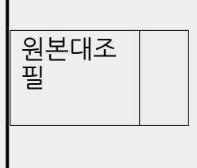

<!-- page: 1 -->

# ※ [정치자금사무관리규칙 제7조] 후원회 명칭 및 약칭(동대문구)

| 구 분         | 번호       | 서 식 명                                 |
|-------------|----------|---------------------------------------|
| 후원회 등록      | 서식 1  | 후원회 등록신청서                             |
|             | 서식 2  | 후원회 표준정관                              |
|             | 서식 3  | 후원회 대표자의 취임동의서                        |
|             | 서식 4  | 인영서                                   |
|             | 서식 5  | 후원회(지정) (․ 지정철회)서                  |
|             | 서식 6  | 후원회 결성 회의록                            |
|             | 서식 7  | 후원회 사무소 소재지 약도                        |
|             | 서식 8  | 정치후원금센터 사이트 이용신청서                     |
|             | 서식 9  | 회계책임자 (선임) (․ 겸임) (‧ 변경) 신고서 |
|             | 서식 10 | 회계책임자 취임동의서                           |
|             | 서식 11 | 예금계좌 (신고)·(변경신고)서                     |
| 후원회 변경등록 | 서식 12 | 후원회 (변경등록신청) (․ 변경신고)서             |
| 후원회 해산      | 서식 13 | 후원회 해산신고서                             |
|             |          |                                       |

2026년 월 일

후원회를 위와 같이 결성하였기에 정치자금법 제 「 」 7조제1항 및 정치자금사무관리 규칙 제 「 」 6조제1 항에 따라 후원회의 등록을 신청합니다.

| 문서번호            |    |                                            |         |  |
|-----------------|----|--------------------------------------------|---------|--|
| 명칭(약칭)          |    | (명칭)○○○(예비)후보자○○○후원회 (약칭) ○○○후원회(○○○선거) |         |  |
| 사무소의 소재지        |    |                                            | 전 화 번 호 |  |
| 대표자             | 성명 | (한자: )                                     | 주민등록번호  |  |
|                 | 주소 |                                            | 전 화 번 호 |  |
| 정관 또는 규약        |    | 별첨과 같음                                     |         |  |
| 회인 및 대표자 직인의 인영 |    | 별첨과 같음                                     |         |  |
|                 |    |                                            |         |  |

서식 1

<!-- page: 2 -->

후원회 등록신청서

| 구 분           | 명 칭                 | 약 칭        |
|---------------|---------------------|------------|
| 구청장후보자(예비후보자) | 동대문구청장예비후보자○○○후원회   | ○○○후원회     |
| 후원회           | 동대문구청장후보자○○○후원회     | (동대문구청장선거) |
|               | 서울특별시동대문구제○선거구시의회의원 |            |
| 지역구시의회의원후보자   | 예비후보자○○○후원회         | ○○○후원회     |
| (예비후보자)후원회    | 서울특별시동대문구제○선거구시의회의원 | (서울시의원선거)  |
|               | 후보자○○○후원회           |            |
|               | 동대문구○선거구구의회의원       |            |
| 지역구자치구의회의원후보자 | 예비후보자○○○후원회         | ○○○후원회     |
| (예비후보자)후원회    | 동대문구○선거구구의회의원       | (동대문구의원선거) |
|               | 후보자○○○후원회           |            |

| ○○○(예비)후보자○○○후원회 대표자 직인                                                              |
|--------------------------------------------------------------------------------------|
| 동대문구선거관리위원회 귀중                                                                       |
| ※ 구비서류                                                                               |
| 1. 정관 또는 규약 1부.                                                                      |
| 2. 대표자의 취임동의서 1부.                                                                    |
| 3. 인영서<별지> 1부.                                                                       |
| 4. 후원회지정서 1부.                                                                        |
| 5. 후원회결성 회의록 사본 1부.                                                                  |
| 6. 사무소의 소재지 약도 1부.                                                                   |
| 주 1. 후원회 명칭에 약칭을 사용하는 경우 "명칭(약칭)"란에는 「정치자금사무관리 규칙」 제7조에 따른 후원회의 명칭과 약칭을 함께 기재합니다. |
| 2. 회의록은 기록자·확인자의 서명·날인이 있어야 하며, 사본을 제출하는 때에는 "원본대조필" 표시와 담당자의 날인이 있어야 합니다.        |

○○○(예비)후보자○○○후원회

정관

2026년 월 일

○○○(예비)후보자○○○후원회

<!-- page: 3 -->

# 제1장 총 칙

제1조(명칭) 본 회의 명칭은 '○○○(예비)후보자○○○후원회 ', 약칭은 '○○○후원회(○○○선거)'라 칭한다. (이하 "후원회"라 한다.)

제2조(목적) 본 후원회는 회원 또는 회원 이외의 자로부터 후원금을 모금하여 후원회지정권자 ○○○ 에게 기부하는 것을 목적으로 한다.

제3조(사무소 소재지) 본 후원회의 주된 사무소는 동대문구에 둔다.

<!-- page: 4 -->

#### 제2장 회 원

제4조(회원) 정치자금 기부제한 자와 정당의 당원이 될 수 없는 자를 제외한 모든 이는 자유의사에 의해 후원회의 회원이 될 수 있다.

제5조(가입과 탈퇴) ①회원이 되고자 하는 자는 후원회 소정의 가입원서를 제출하여야 한다.

②회원이 탈퇴하고자 할 때에는 탈퇴원서를 제출하여야 한다. 탈퇴는 탈퇴원서를 후원회에 제출함으로써 그 효력이 발생한다.

제6조(회원의 제명) ①회원으로서 후원회의 목적에 배치되는 행위 또는 명예나 위신에 손상을 가져오는 행위를 하였을 때에는 제명할 수 있다.

②회원의 제명은 운영위원회의 재적위원 과반수의 찬성으로 의결한다.

제3장 총 회

제7조(구성) 총회는 회원 전원으로 구성한다.

제8조(총회의 기능) ①총회는 후원회의 최고의결기구로서 다음 각호의 기능을 가진다.

1. 후원회의 기본운영에 관한 사항의 심의, 의결

2. 후원회 대표자의 선출 및 해임

### 3. 정관의 제정 및 개정

4. 사업보고의 승인

5. 후원회의 대의기관 또는 그 수임기관에 관한 사항

6. 후원회의 감시기관에 관한 사항

7. 기타 후원회와 관련된 중요사항의 심의, 의결

②총회의 소집이 어려울 때는 운영위원회가 그 기능을 대신할 수 있다.

③총회는 그 기능을 운영위원회에 위임하는 의결을 할 수 있다.

제9조(총회소집) 총회는 대표자가 필요하다고 인정할 때, 또는 회원 3분의 1이상의 요구가 있을 때 대표자가 이를 소집한다.

제10조(의결정족수) ①총회는 재적회원 과반수의 출석과, 출석회원 과반수의 찬성으로 의결한다. 다만, 부득이한 사정이 있는 회원은 서면으로 권한을 위임할 수 있으며 이 경우에는 출석한 것으로 간주한다.

②가부동수인 때에는 대표자가 결정권을 가진다.

제4장 운 영 위 원 회

제11조(구성) ①총회의 수임기관으로 운영위원회를 둔다.

②운영위원회는 10인 이내의 위원으로 구성한다.

③운영위원회에 위원장을 두되, 위원장은 후원회의 대표자가 된다.

제12조(기능) 운영위원회는 다음의 기능을 가진다.

1. 총회에서 위임된 사항의 심의, 의결

2. 총회에 부의할 사항의 심의

3. 예산 및 결산의 승인

4. 대표자 직무대리자의 선출 및 총무 선임

<!-- page: 5 -->

5. 업무보고의 승인

6. 회원의 제명 결의

7. 기타 중요한 사항의 심의, 의결

제13조(회의소집) ①위원장은 필요한 경우 운영위원회를 소집할 수 있다.

②재적 운영위원 3분의 1이상의 요구가 있을 때에는 위원장은 임시회를 소집하여야 한다.

제14조(의결정족수) ①운영위원회 의결정족수는 제10조의 규정을 준용한다.

②가부동수인 때에는 위원장이 결정권을 가진다.

제5장 임 원

제15조(대표자) ①후원회에 대표자(회장) 1인을 둔다.

②대표자는 총회에서 선출한다.

③대표자는 후원회를 대표하며 회의를 총괄한다.

④대표자의 궐위시 운영위원 중 최연장자가 그 직무를 대행한다.

제16조(총무) ①후원회의 운영을 위하여 총무를 둔다.

②총무는 운영위원회에서 지명하고 대표자를 도와 후원회 사무를 통괄한다.

제17조(회계책임자) ①후원회의 회계책임자는 대표자가 선임 및 해임하며 총무를 겸임할 수 있다.

②회계책임자 사고시에는 정치자금법 에 의한 회계사무보조자가 위임받은 회계지출만을 하여야 「 」 하며, 대표자는 지체없이 새로운 회계책임자를 선임하여야 한다.

제18조(감사) ①후원회의 회계 및 사업의 적정한 운영을 기하기 위하여 2인의 감사를 둔다.

②감사는 운영위원회에서 선출한다.

<!-- page: 6 -->

### 제6장 후원금 모금 및 기부

제19조(회비) 후원회의 회원은 연간 1만원 또는 그에 상당하는 가액 이상의 후원금을 납입하여야 한다.

제20조(후원금 모금 등) 후원회는 정치자금법 의 규정에 따라 회원 또는 회원이 아닌 자로부터 「 」 후원금을 모금할 수 있다.

제21조(모금의 제한) 본 후원회가 연간 모금할 수 있는 정치자금은 정치자금법 상의 「 」 연간모금한도액을 초과할 수 없다.

제22조(기부) ①후원회는 지정권자에게 정치자금법 의 연간모금한도액 또는 그에 상당하는 「 」 가액까지 기부할 수 있다.

②본 후원회가 후원금을 모금한 때에는 지체 없이 이를 지정권자에게 기부한다. 이 경우 모금에 직접 소요된 경비는 기부할 금액에서 공제할 수 있다.

### 제7장 해 산

제23조(해산) ①후원회는 다음 사유가 생긴 때에는 해산된다.

1. 후원회지정권자가 지정을 철회한 경우

2. 후원회지정권자가 후원회를 둘 수 있는 자격을 상실한 경우

3. 총회에서 해산결의를 한 경우

4. 기타의 사유발생시 후원회에 관한 법률이 정한 바에 따른다.

제24조(잔여재산 처분) 후원회가 해산된 경우 잔여재산은 정치자금법 제 「 」 21조에 의하여 처분한다.

제8장 정 관 개 정

제25조(개정) 정관개정은 총회에서 재적회원 과반수의 찬성으로 의결한다.

부 칙

제1조(시행일) 이 정관은 총회에서 의결된 날부터 시행한다.

제2조(위임사항) 후원회의 운영에 필요한 사항에 관하여는 운영위원회에서 내규로 정할 수 있다.

| 취 임 동 의 서 |          |
|-----------|----------|
| 성 명       | (한 자 : ) |

| 인 영 서     |                                                                                                                                               |  |  |
|-----------|-----------------------------------------------------------------------------------------------------------------------------------------------|--|--|
| 명칭 또는 약칭① | (명칭) ○○○(예비)후보자○○○후원회 (약칭) ○○○후원회(○○○선거)                                                                                                   |  |  |

<!-- page: 7 -->

| 회 인②      | 명칭 사용 시 약칭 사용 시 ○○○ (예비)후보자 ○○○ 후원회인 ○○○ 후원회 (○○○선거) 인 ※ 인영에 표시된 문자: (명칭) ○○○(예비)후보자○○○후원회인 (약칭) ○○○후원회(○○○선거)인 |  |  |
| 대표자 직인③   | 명칭 사용 시 약칭 사용 시 ○○○                                                                                                                        |  |  |

| 주 소                                    |      |       |
|----------------------------------------|------|-------|
| 생 년 월 일                                |      |       |
| 전 화 번 호                                | (자택) | (휴대폰) |
| 본인은 ○○○(예비)후보자○○○후원회의 대표자로 취임함을 동의합니다. |      |       |
| 2026년 월 일                              |      |       |
| 성 명 (서명 또는 날인)                         |      |       |
| ○○○(예비)후보자○○○후원회 귀중                    |      |       |
| 주. 이 서식은 동의자가 작성하여 당해 후원회에 제출함.        |      |       |

|     | (예비)후보자 ○○○ 후원회대표자인 ○○○ 후원회 (○○○선거) 대표자인 ※ 인영에 표시된 문자: (명칭) ○○○(예비)후보자○○○후원회대표자인 (약칭) ○○○후원회(○○○선거)대표자인 |
|-----|---------------------------------------------------------------------------------------------------------------------------------|
| 비 고 |                                                                                                                                 |

주 1. 후원회의 등록(신고)시 또는 이미 등록(신고)된 회인과 대표자 직인의 변경등록(신고)시 사용합니다.

2."명칭 또는 약칭"란에는 인영에 표시할 「정치자금사무관리 규칙」 제7조의 규정에 따른 명칭 또는 약칭 중 하나를 정해 기재합니다.

3. 인영은 알아보기 쉽게 깨끗하고, 뚜렷하게 붉은색으로 날인합니다.

4. "비고"란에는 등록(신고) 또는 변경등록(신고)의 사유와 일자 등을 담당공무원이 기재합니다.

<!-- page: 8 -->

|   | 작 성 요 령                                                          |
|---|------------------------------------------------------------------|
| ① | 후원회의 명칭 또는 약칭을 적습니다.                                             |
| ② | 후원회 명의의 인영은 위조될 수 없도록 조각한 후 찍습니다.                                |
| ③ | 후원회 대표자 명의의 인영은 위조될 수 없도록 조각한 후 찍습니다. |

서식 5

후원회 (지정) ( ‧ 지정철회)서

| 문서번호                                                                                 |                                          |                      |        |     |     |  |
|--------------------------------------------------------------------------------------|------------------------------------------|----------------------|--------|-----|-----|--|
| 명칭(약칭)                                                                               |                                          | (명칭)○○○(예비)후보자○○○후원회 |        |     |     |  |
|                                                                                      |                                          | (약칭) ○○○후원회(○○○선거)   |        |     |     |  |
| 사무소의 소재지                                                                             |                                          |                      | 전화번호   |     |     |  |
| 대표자                                                                                  | 성 명                                      | (한자: )               | 주민등록번호 |     |     |  |
|                                                                                      | 주 소                                      |                      | 전화번호   |     |     |  |
| (지정) (‧ 지정철회)연월일 년 월 일                                                         |                                          |                      |        |     |     |  |
| 정치자금법 제6조·제7조제3항 및 「정치자금사무관리 규칙」 제5조에 따라 위와 같이 후원회를 (지정) 「 」 ㆍ(지정철회)합니다. |                                          |                      |        |     |     |  |
| 2026 년 월 일                                                                           |                                          |                      |        |     |     |  |
| 동대문구청장(예비후보자)ㆍ(후보자)                                                                  |                                          |                      |        | ○○○ | (인) |  |
|                                                                                      | 서울특별시동대문구제○선거구시의회의원 (예비후보자)·(후보자)     |                      |        | ○○○ | (인) |  |
|                                                                                      | ○○○ 동대문구○선거구구의회의원(예비후보자)·(후보자) (인) |                      |        |     |     |  |
| ○○○(예비)후보자○○○후원회 귀중                                                                  |                                          |                      |        |     |     |  |

<!-- page: 9 -->

|                                                                                      |                                          |                      |        |     |     |  |
| 주: 후원회 명칭에 약칭을 사용하는 경우 "명칭(약칭)"란에는「정치자금사무관리 규칙」 제7조에 따른 후원회의 명칭과 약칭을 함께 기재합니다.    |                                          |                      |        |     |     |  |

○○○(예비)후보자○○○ 후원회 결성 회의록 일 시 : 2026년 월 일 00:00 장 소 : ○○컨벤션센터 0층 000호 ○○○(예비)후보자○○○후원회 기록자 ○○○

3. 경과보고

국기에 대하여 경례! 바로! 모두 자리에 앉아 주시기 바랍니다.

사회자 : 국민의례가 있겠습니다. 모두 자리에서 일어서 전면의 국기를 향하여 주시기 바랍니다.

2. 국민의례

사회자 :먼저 바쁘신데도 불구하고 ○○○(예비)후보자○○○후원회 결성식에 참석해 주신 여러분께 감사의 말씀을 드립니다. 재적회원 총 00명중 00명이 참석하시어 성원되었음을 보고합니다. 그러면, 지금부터 ○○○(예비)후보자○○○후원회의 결성식을 시작하겠습니다.

1. 개 회

○○○(예비)후보자○○○후원회 결성 회의록

| (성원현황 등 포함)        |
|--------------------|
| 2. 국민의례            |
| 3. 경과보고            |
| 4. 임시의장 선출         |
| 5. 후원회 정관 채택       |
| 6. 대표자(회장) 등 임원 선출 |
| 7. 기 타             |
| 8. 폐 회             |
| 원본대조 필          |
|                    |

| 확인자 ○○○ 󰄫 |  |
|-----------|--|
| 원본대조 필 |  |
|           |  |
|           |  |

식 순

<!-- page: 10 -->

1. 개 회

사회자 : 다음은 ○○○(예비)후보자○○○후원회의 결성식을 개최하기까지의 진행경과를 후원회 준비위원인 ○○○ 회원께서 보고드리겠습니다.

○○○ : 경과를 보고드리겠습니다.

우리나라의 정치발전과 동대문구의 한단계 더 높은 도약을 위하여 ○○○선거에 출마한 ○○○(예비) 후보의 원활한 선거비용조달을 위하여 후원회를 설립하게 되었습니다.

○○○ : 지난 00월 00일 창립준비위원회를 구성하였고, 뜻을 같이하는 00분이 참여하여 오늘 후원회 결성식을 거행하게 되었습니다. 앞으로 회원님들께서 후원회가 잘 될 수 있도록 많이 도와주시기 바랍니다. 고맙습니다.

원본대조 필

4. 임시의장 선출

사회자 : 다음은 회의의 원만한 진행을 위하여 임시의장을 선출하도록 하겠습니다. 임시의장 선출 방식은 여러 가지가 있겠으나 신속한 회의 진행을 위해서 후원회 결성에 많은 노력을 하신 ○○○ 회원을 추천하겠습니다. 이의가 없으시면 박수로 동의하여 주시기 바랍니다.

참석자 : 전원 박수로 ○○○을 임시의장으로 선출

5. 후원회 정관 채택

임시의장:그러면 먼저 후원회 정관을 검토하도록 하겠습니다. 기 배부해드린 정관을 검토하고 오셨으리라 보고 정관 내용에 이의가 있거나 수정을 요하는 사항이 있으면 말씀해 주시기 바랍니다.

참 석 자:이의 없습니다.

<!-- page: 11 -->

임시의장:그러면 ○○○(예비)후보자○○○후원회의 정관이 통과 되었음을 선포합니다.

6. 대표자(회장) 등 임원 선출

임시의장 : 다음은 정관에 따라 본 후원회를 이끌어 나갈 대표자와 감사를 선출하고, 총회의 수임기관인 운영위원회를 구성할 운영위원들을 선출하도록 하겠습니다. 적임자를 추천하여 주시기 바랍니다.

○○○회원 : 대표자에는 지금까지 준비위원회를 구성하는 등 후원회설립을 위해 혼신의 힘을 다하신 ○○○ 회원을 추천하고, 감사에는 ○○○ 회원님과 ○○○ 회원님을 추천합니다. 그리고 ○○○, ○○○, ○○○ 회원을 운영위원으로 추천합니다.

임시의장 : ○○○ 회원님으로부터 추천이 있었습니다. 다른 의견을 가지신 분 있으면 말씀하여 주시기 바랍니다.

참 석 자 : (전원 손을 들면서) 동의합니다.

원본대조 필

구 분 내 용 비 고

정치후원금센터 사이트 이용신청서

서식 8

| 후원회 사무소 소재지 약도 |                                            |  |  |
|----------------|--------------------------------------------|--|--|
| 명칭 또는 약칭       | (명칭)○○○(예비)후보자○○○후원회 (약칭) ○○○후원회(○○○선거) |  |  |
| 사무소주소          |                                            |  |  |
| 전 화 번 호        |                                            |  |  |
| [약 도]          |                                            |  |  |
| [ 약 도 첨 부 ]    |                                            |  |  |

서식 7

<!-- page: 12 -->

7. 폐 회

사회자:이상으로 ○○○(예비)후보자○○○후원회 결성식을 모두 마치겠습니다. 참석해 주신 회원여러분들께 진심으로 감사드립니다.

○ ○ ○ : 부족한 저를 대표로 뽑아 주셔서 감사드립니다. 앞으로 ○○○(예비)후보자가 당선될 수

임시의장 : 그러면 후원회 대표자에는 ○○○ 회원을, 감사에는 ○○○, ○○○ 회원을, 운영위원에는 ○○○, ○○○, ○○○ 회원이 선출되었음을 선포합니다.

임시의장 : 그러면, 후원회 대표자로 선출되신 ○○○ 회원님의 인사말을 듣도록 하겠습니다.

있도록 후원금 모금 및 후원회 운영에 최선을 다할 것을 약속드립니다. 고맙습니다.

※ 구비서류 : 개인정보 수집 이용 동의서 ․ 1부.

중앙선거관리위원회는「개인정보보호법」등 관련 법령상의 개인정보보호 규정을 준수하여 후원인 개인정보의 수집·보유 및 처리를 수행하고 있으며, 관련된 자세한 사항은 정치후원금센터 개인정보처리방침 안내 페이지에서 확인하실 수 있습니다.

직인

○○○(예비)후보자○○○후원회 대표자

<!-- page: 13 -->

2026년 월 일

중앙선거관리위원회가 운영하는 정치후원금센터 사이트 이용을 위와 같이 신청합니다.

| 후원회명  |            |       |     |
|-------|------------|-------|-----|
| 정 당 명 |            |       |     |
| 선거구명  |            |       |     |
|       | 대표자        | 성 명   |     |
|       |            | 생년월일  |     |
|       |            | 휴대폰번호 |     |
|       |            | 성 명   |     |
| 후 원 회 | 회 계 책임자 | 생년월일  |     |
|       |            | 이메일   |     |
|       |            | 휴대폰번호 |     |
|       | 사무실        | 주 소   |     |
|       |            | 전화번호  | 공개용 |
| 기 부 금 | 은 행 명      |       |     |
| 수령계좌  | 예금주명       |       |     |
|       | 계좌번호       |       |     |

개인정보 수집·이용 동의서

<!-- page: 14 -->

중앙선거관리위원회는「개인정보보호법」제15조제1항제1호에 따라 정치후원금센터 사이트 이용 신청 시 아래와 같이 개인정보를 수집 이용하고자 귀하의 동의를 ‧ 얻고자 합니다.

▶ 개인정보 수집 이용 내역 ‧

| 수집 이용 목적 ․                   | 수집 항목                                                                                                            | 보유 및 이용기간 |
|---------------------------------|------------------------------------------------------------------------------------------------------------------|--------------|
| 후원회관계자 (대표자, 회계책임자) 정보 관리 | 후원회명, 신청자(성명, 생년월일), 대표자(성명, 생년월일, 휴대폰번호), 회계책임자(성명, 생년월일, 휴대폰번호, 이메일), 아이디, 비밀번호, 기부금수령계좌(은행명, 예금주, 계좌번호) | 10년          |

※ 위의 개인정보 수집·이용에 대한 동의를 거부할 권리가 있으나, 개인정보 수집 동의 거부 시에는 정치후원금센터 사이트 이용 서비스가 제한될 수 있습니다.

☞ 위와 같이 개인정보를 수집·이용하는데 동의하십니까? □ 동의 □ 미동의

2026년 월 일

회계책임자 성명 인

대 표 자 성명 인

| 회계책임자(선임)·(겸임)·(변경)신고서 |           |         |         |      |    |
|------------------------|-----------|---------|---------|------|----|
| 문서번호                   |           |         |         |      |    |
| 회계책임자                  | 성 명       | (한자 : ) | 주민등록번호  |      | -  |
|                        | 주 소       |         | 전 화 번 호 |      |    |
| (선임)·(겸임)·(변경)연월일      | 2026년 월 일 |         |         |      |    |
| 겸임하는 회계책임자의 신분         |           |         |         |      |    |
| 정치자금예금계좌               |           | 예금주     | 금융기관명   | 계좌번호 | 비고 |
| 수입용                    |           |         |         |      |    |
|                        |           |         |         |      |    |

| 성 명             | (한자 : ) |                                          |
|-----------------|---------|------------------------------------------|
| 주 소             |         |                                          |
| 생년월일            |         |                                          |
| 전화번호            | (자택)    | (휴대전화)                                   |
|                 |         | 본인은 ○○○(예비)후보자○○○후원회의 회계책임자로 취임함을 동의합니다. |

<!-- page: 15 -->

| 2026년 월 일       |         |                                          |
| 성명 : (서명 또는 날인) |         |                                          |
|                 |         |                                          |

※ 회계책임자 선임 겸임 변경신고서 첨부서류 ․ ․

지출용

서식 10

취 임 동 의 서

「정치자금법」 (제34조제1항)·(제35조제1항) 및 「정치자금사무관리 규칙」 제32조제1항의 규정에 의하여 위와 같이 회계책임자를 (선임)·(겸임)·(변경)신고합니다. 2026년 월 일 ○○○(예비)후보자○○○후원회 대표자 직인 동대문구선거관리위원회 귀중 ※ 구비서류 1. 회계책임자의 취임동의서 1부 2. 정치자금 수입·지출용 예금통장 사본 각 1부(예금계좌 개설 신고시) 3. 정치자금 수입과 지출 인계·인수서 1부(변경신고시) 주 1. 정치자금 수입용 예금계좌는 그 수에 제한이 없으며, 정치자금 지출용 예금계좌는 1개만 신고하여야 합니다. 2. 신고인은 회계책임자의 선임권자인 후원회대표자가 됩니다.

2. 신고인은 회계책임자의 선임권자인 후원회대표자가 됩니다.

신고하여야 합니다.

주 1. 정치자금 수입용 예금계좌는 그 수에 제한이 없으며, 정치자금 지출용 예금계좌는 1개만

동대문구선거관리위원회 귀중

※ 구비서류 : 예금통장 사본 각 1부

정치자금의 수입·지출용 예금계좌를 (신고)·(변경신고)합니다.

<!-- page: 16 -->

서식 11

예금계좌 (신고)·(변경신고)서

수입용

지출용

지출용

○○○(예비)후보자○○○후원회 대표자

변경후 수입용

2026년 월 일

직인

문서번호

<!-- page: 17 -->

변경전

주 : 이 서식은 동의자가 작성하여 후원회 대표자에게 제출합니다.

※ 예금통장 사본을 첨부하여 회계책임자 선임신고를 하는 경우 신고서 생략

구분 예금주 금융기관명 계좌번호 비고

「정치자금법」제34조제4항제1호 및 「정치자금사무관리 규칙」제34조제1항에 따라 위와 같이

○○○(예비)후보자○○○후원회 대표자 귀하

| 후원회 (변경등록신청) (․ 변경신고)서 문서번호 구분 변 경 내 용 변경일자 변경사유 (명칭)○○○(예비)후보자○○○후원회 명칭(약칭) (약칭) ○○○후원회(○○○선거) 사무소의 소재지 전 화 번 호 성 명 (한자: ) 주민등록번호 대표자 주 소 전 화 번 호 정관 또는 규약 회인 및 대표자 직인의 인영 제7조제4항 및 11조제1항의 규정에 의하여 위와 같이 정치자금법 정치자금사무관리 규칙 제 「 」 「 」 후원회의 변경등록신청을 합니다. 2026년 월 일 ○○○(예비)후보자○○○후원회 대표자 직인 동대문구선거관리위원회 귀중 ※ 구비서류 1. 정관 또는 규약 1부. 2. 대표자의 취임동의서 1부. 3. 인영서 1부. |               |  |  |  |  |  |
|---------------------------------------------------------------------------------------------------------------------------------------------------------------------------------------------------------------------------------------------------------------------------------------------------------------------------------------------------------------------------------------------------------------------------------------------------------------------------------|---------------|--|--|--|--|--|
|                                                                                                                                                                                                                                                                                                                                                                                                                                                                                 |               |  |  |  |  |  |
|                                                                                                                                                                                                                                                                                                                                                                                                                                                                                 |               |  |  |  |  |  |
|                                                                                                                                                                                                                                                                                                                                                                                                                                                                                 |               |  |  |  |  |  |
|                                                                                                                                                                                                                                                                                                                                                                                                                                                                                 |               |  |  |  |  |  |
|                                                                                                                                                                                                                                                                                                                                                                                                                                                                                 |               |  |  |  |  |  |
|                                                                                                                                                                                                                                                                                                                                                                                                                                                                                 |               |  |  |  |  |  |
|                                                                                                                                                                                                                                                                                                                                                                                                                                                                                 |               |  |  |  |  |  |
|                                                                                                                                                                                                                                                                                                                                                                                                                                                                                 |               |  |  |  |  |  |
|                                                                                                                                                                                                                                                                                                                                                                                                                                                                                 |               |  |  |  |  |  |
|                                                                                                                                                                                                                                                                                                                                                                                                                                                                                 |               |  |  |  |  |  |
|                                                                                                                                                                                                                                                                                                                                                                                                                                                                                 |               |  |  |  |  |  |
|                                                                                                                                                                                                                                                                                                                                                                                                                                                                                 |               |  |  |  |  |  |
|                                                                                                                                                                                                                                                                                                                                                                                                                                                                                 |               |  |  |  |  |  |
|                                                                                                                                                                                                                                                                                                                                                                                                                                                                                 |               |  |  |  |  |  |
|                                                                                                                                                                                                                                                                                                                                                                                                                                                                                 |               |  |  |  |  |  |
|                                                                                                                                                                                                                                                                                                                                                                                                                                                                                 |               |  |  |  |  |  |
|                                                                                                                                                                                                                                                                                                                                                                                                                                                                                 |               |  |  |  |  |  |
|                                                                                                                                                                                                                                                                                                                                                                                                                                                                                 |               |  |  |  |  |  |
|                                                                                                                                                                                                                                                                                                                                                                                                                                                                                 | 4. 회의록 사본 1부. |  |  |  |  |  |

3. 예금계좌 신고시에는 "변경후"란은 작성하지 아니합니다.

<!-- page: 18 -->

5. 사무소 소재지 약도 1부.

주 1. "변경내용"란에는 기등록사항 중 변경이 있는 사항만 기재하고, 구비서류는 변경내용에 해당될 경우에 한합니다.

2. 후원회 명칭에 약칭을 사용하는 경우 "명칭(약칭)"란에는 「정치자금사무관리 규칙」 제7조에 따른 후원회의 명칭과 약칭을 함께 기재합니다.

3. 인영서는 별지 제4호서식의 <별지>에 따라 작성합니다.

4. 회의록 사본은 「정치자금법」 또는 정관(규약)의 규정에 의한 대의기관이나 수임기관의 의결에 따라 후원회 등록사항을 변경하는 경우에 첨부합니다.

5. 회의록에는 기록자·확인자의 서명·날인이 있어야 하며, 사본을 제출하는 때에는 "원본대조필"표시와 담당자의 날인이 있어야 합니다.

| 후원회 해산신고서                                                                                                               |                      |
|-------------------------------------------------------------------------------------------------------------------------|----------------------|
| 문서번호                                                                                                                    |                      |
| 명칭(약칭)                                                                                                                  | (명칭)○○○(예비)후보자○○○후원회 |
|                                                                                                                         | (약칭) ○○○후원회(○○○선거)   |
| 해산사유                                                                                                                    | 후원회 정관에 따른 자진해산      |
|                                                                                                                         | / 후원회 지정철회에 따른 해산    |
| 해산연월일                                                                                                                   |                      |
|                                                                                                                         |                      |
| 후원회를 위와 같이 해산하였기에 정치자금법 제 19조제3항 본문 및 정치자금사무관리 규칙 제 22 「 」 「 」 조제1항의 규정에 의하여 이를 신고합니다. |                      |
| 2026년 월 일                                                                                                               |                      |
| ○○○(예비)후보자○○○후원회 대표자 직인                                                                                              |                      |
| 동대문구선거관리위원회 귀중                                                                                                          |                      |
| ※ 구비서류                                                                                                                  |                      |
| 1. 해산에 관한 회의록 사본 1부(자진해산 시)                                                                                             |                      |

<!-- page: 19 -->

주: 후원회가 후원회 명칭에 약칭을 사용한 경우 "명칭(약칭)"란에는 「정치자금사무관리 규칙」 제7 조에 따른 후원회의 명칭과 약칭을 함께 기재합니다.