<!-- page: 1 -->

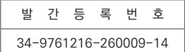

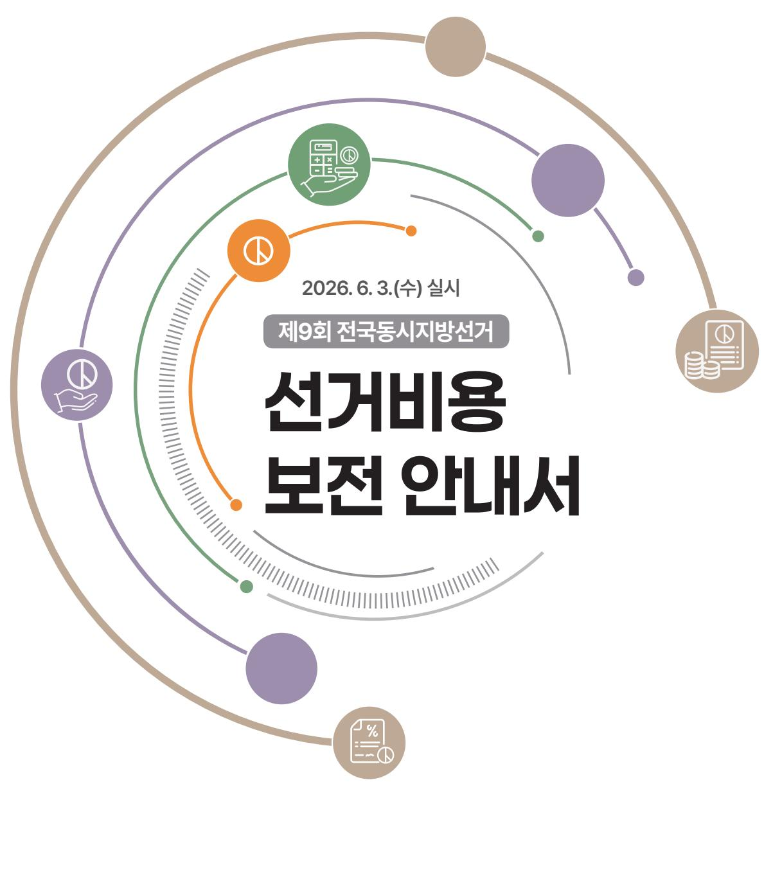

# **일 러 두 기**

- 이 안내서는 2026. 6. 3. 실시하는 제9회 전국동시지방선거에서 각 정당· 후보자 측의 선거비용 보전제도에 대한 이해와, 적법한 선거비용 보전청구에 도움을 드리고자 제작한 것입니다.
- 정당·후보자 또는 회계책임자는 우리 위원회에서 이미 배부해드린 「제9회 전국동시지방선거 정치자금 회계실무」와 관련 법규에 따라 처리하시되, '선거비용'과 '선거비용외 정치자금'의 구분, 보전대상 여부 및 정당·후보자가 제출하여야 할 증빙자료 등에 대한 사항은 이 안내서를 통해 도움을 받으시기 바라며, 의문사항이 있는 경우에는 관할 선거관리위원회에 문의하신 후 처리하시기 바랍니다.
- 2026. 3. 현재의 공직선거법규·정치자금법규 등에 따라 제9회 전국동시지방 선거에 맞게 작성한 것으로, 향후 관련 법규의 개정 등이 있는 경우 내용이 수정·변경될 수 있습니다.

<!-- page: 3 -->

#### 용어의 표기

「공직선거법」 → '「공직선거법」' 또는 '법'으로 표기 「공직선거관리규칙」 → '규칙'으로 표기 '제119조제1항' → '제119조제1항' 또는 '§119①'로 표기 '선거관리위원회' → '선거관리위원회' 또는 '선관위'로 표기

● 본 선거비용 보전안내서 책자 원고는 『중앙선거관리위원회 홈페이지 (www.nec.go.kr) - 자료공간 – 선거/법규/정당 - 자료공간』에서 내려 받아 활용하실 수 있습니다.

**2026. 6. 3.(수) 실시** 제9회 전국동시지방선거

<!-- page: 4 -->

# 선거비용 보전 안내서

## **Ⅰ. 선거비용 보전 및 부담비용 청구**

- 1. 선거비용 보전청구 / 10
- 2. 부담비용 청구 / 18
- 3. 반환기탁금 및 보전비용 인계 / 20

### **Ⅱ. 선거비용 보전제한·유예 및 보전비용 반환**

- 1. 개 요 / 26
- 2. 선거비용 보전제한 / 26
- 3. 선거비용 보전유예 / 28
- 4. 선거비용 보전 후 미보전사유 발견 시 보전비용 반환 / 29
- 5. 당선무효된 자 등의 비용 반환 / 29

### **Ⅲ. 선거비용과 선거비용외 정치자금**

- 1. 선거비용 / 32
- 2. 선거비용외 정치자금 / 35

# **Ⅳ. 보전대상 선거비용과 미보전대상 선거비용**

- 1. 보전대상 선거비용 / 40

<!-- page: 5 -->

- 2. 미보전대상 선거비용 / 41

## **Ⅴ. 주요항목 보전기준 및 산정방식**

- 1. 인쇄물(선거벽보·선거공보, 명함 등) 관련/ 46
- 2. 시설물(선거운동기구 간판·현판·현수막, 거리게시 현수막) 관련 / 46
- 3. 공개장소 연설·대담 관련 / 47
- 4. 방송광고·신문광고·방송연설 관련 / 49
- 5. 전화, 문자메시지 관련 / 50
- 6. 선거사무관계자 수당·실비 관련 / 53

### **Ⅵ. 문답으로 알아보는 선거비용 보전실무**

 1. 선거사무소 간판·현판·현수막 / 58 2. 거리게시용 현수막 / 60 3. 선거사무소·선거연락소 / 61 4. 어깨띠, 윗옷, 모자 등 소품 / 62 5. 공개장소 연설·대담 등 / 66 6. 전화·문자·전자우편·인터넷홈페이지 / 75 7. 선거사무관계자 수당·실비 등 / 79 8. 신문광고, 방송광고, 방송연설, 인터넷광고 / 81 9. 인쇄물(명함, 선거벽보·선거공보 등 법정홍보물) / 82

### **Ⅶ. 보전항목별 증빙자료 작성요령 및 예시**

- 1. 증빙자료 작성 원칙 / 88
- 2. 증빙자료 작성시 유의사항 / 89

### **Ⅷ. 각종 서식 및 작성예시** / 131

#### **부 록**

- 1. 선거비용 및 보전항목 일람표 / 154
- 2. 통상거래가격 결정내역 / 174
- 3. 반환기탁금 및 보전비용의 인계비용 계산프로그램 사용자 매뉴얼 / 189
- 4. 정치자금 회계관리 프로그램정치자금 수입·지출부 출력 방법 / 195
- 5. 선거사무관계자 고용, 산재보험 가입 안내 / 196

<!-- page: 7 -->

# 제9회 전국동시지방선거 주요 회계사무 일정

**선 거 일** 2026. 6. 3.(수)

**선거운동기간** 2026. 5. 21.(목) ~ 6. 2.(화) [13일간]

**후보자등록** 2026. 5. 14.(목) ~ 5. 15.(금)

**회계사무 주요일정**

| 주 요 회 계 사 무                         | 일 정                                    | 담 당 주 체                            |
|-------------------------------------|----------------------------------------|------------------------------------|
| ● 선거비용제한액 결정·공고                     | 2026. 1. 23.(금) 기 공고                   | 관할 선거구선관위                          |
| ● 회계책임자 선임신고 및                      | (예비)후보자 등록신청시                          | (예비)후보자, 시·도당 대표자 (정당선거사무소장) |
| 예금계좌 신고                             | 선거연락소 설치신고시                            | 선거연락소장                             |
|                                     | 정당선거사무소 설치신고시                          | 정당선거사무소장                           |
| ● 정치자금 수입·지출내역의 회계장부 기재 및 영수증 구비 | 수입·지출이 발생한 때마다                         | 회계책임자                              |
| ● 선거비용 보전청구 및 부담비용 청구            | 2026. 6. 15.(월)까지 (선거일 후 10일까지)     | 후보자·정당                             |
| ● 정치자금 수입·지출 회계마감                   | 2026. 6. 23.(화) (선거일 후 20일)         | 회계책임자                              |
| ● 기탁금 반환 및 공제명세서 송부              | 2026. 7. 3.(금)까지 (선거일 후 30일 이내)     | 관할 선거구선관위                          |
| ● 정치자금 회계보고서 제출 ● 선거비용 추가 보전청구   | 2026. 7. 3.(금)까지 (선거일 후 30일 이내)     | 회계책임자                              |
| ● 정치자금 수입·지출내역 실사                   | 별도 일정 통지                               | 관할 선관위                             |
| ● 선거비용 등 보전·지급                      | 2026. 7. 31.(금)까지 (선거일 후 60일 이내)    | 관할 선거구선관위                          |
| ● 후보자의 반환·보전비용의 인계               | 2026. 8. 20.(목)까지 (보전받은 날부터 20일 이내) | 후보자                                |
| ● 후보자의 반환·보전비용의 인계·인수서 제출        | 2026. 8. 31.(월)까지 (보전받은 날부터 30일 이내) | 후보자                                |

<!-- page: 8 -->

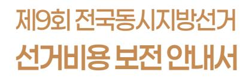

<!-- page: 9 -->

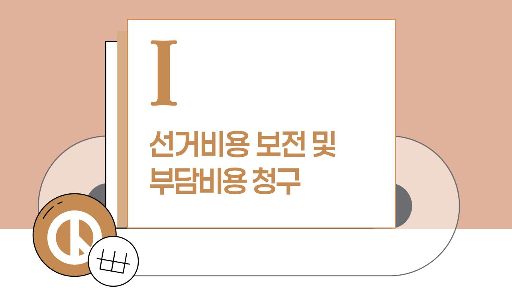

- **1.** 선거비용 보전청구
- **2.** 부담비용 청구
- **3.** 반환기탁금 및 보전비용 인계

# **선거비용 보전 및** I 부담비용 청구

**1 선거비용 보전청구** (법 제122조의2, 규칙 제51조의3)

「선거비용의 보전」이란 「헌법」 제116조제2항에 따른 선거공영제의 일환으로 후보자(비례 대표지방의원선거에서는 그 추천정당을 말함. 이하 같음.)가 「공직선거법」에 따른 적법한 선거운동을 위하여 지출한 선거비용의 전부 또는 일부를 당해 지방자치단체의 부담으로 공고한 선거비용제한액\* 범위 내에서 일정한 기준에 따라 선거일 후 보전하는 것을 말함. \* 선거비용제한액은 선거구마다 다르므로 관할 선관위에 문의 바람. ※ 교육감선거는 시·도지사선거를 준용함(이하 같음).

# **가. 보전요건**

<!-- page: 10 -->

#### 1) 지역구지방의원 및 지방자치단체의 장선거

- • 후보자가 지출한 보전대상 선거비용의 전액 보전
  - 후보자가 당선되거나 사망한 경우
  - 후보자가 유효투표총수의 100분의 15 이상을 득표한 경우
- • 후보자가 지출한 보전대상 선거비용의 100분의 50에 해당하는 금액 보전

- 후보자가 유효투표총수의 100분의 10 이상 100분의 15 미만을 득표한 경우

#### 2) 비례대표지방의원선거

후보자명부에 올라 있는 후보자 중 당선인이 있는 경우, 당해 정당이 지출한 보전대상 선거 비용의 전액 보전

<!-- page: 11 -->

### 나. 보전청구절차

- 1) 청구기한 : 2026. 6. 15.(월)까지
  - ※ 청구내역 중 누락된 사항에 대하여는 회계보고서를 제출하는 때(2026. 7. 3.까지) 추가 보전청구 가능
- 2) 청구권자: 후보자(비례대표지방의원선거에 있어서는 후보자를 추천한 정당)

#### 3) 청구방법

- 가) 선거사무소 : 관할 선거구선거관리위원회에 아래 서류를 작성·제출
  - 「선거비용 보전청구서」(서식 1, 2 참조)
    - ※ 선거연락소가 있는 경우, 선거연락소별 보전청구액을 보전청구 총액에 포함하여 기재
    - 선거사무소의 계정별 선거비용과목의 정치자금 수입·지출부 사본
    - 영수증 등 증빙서류(「공직선거관리규칙」 별표 1의2에 따른 사진 등 객관적 증빙자료 포함) 사본
    - 선거연락소가 있는 경우 선거연락소의 「선거비용 보전청구서」 사본(정치자금 수입· 지출부 및 증빙서류 사본 제외)
    - 정치자금 수입·지출 통장 사본(수령계좌 통장 사본)
- 나) 선거연락소 : 선거연락소를 설치한 지역의 관할 선거관리위원회에 아래 서류를 작성·제출
  - 선거비용 보전청구서(서식 1 참조)
    - 선거연락소의 계정별 선거비용과목의 정치자금 수입·지출부 사본
    - 영수증 등 증빙서류(「공직선거관리규칙」 별표 1의2에 따른 사진 등 객관적 증빙자료 포함) 사본

#### **선거연락소를 설치한 경우 선거비용 보전청구서 제출방법**

<!-- page: 12 -->

#### 시·도지사 선거 – 예)서울특별시장선거

- 선거사무소 : 서울특별시선관위에 제출 ① 「선거비용 보전청구서」(선거연락소별 보전청구액 포함) ② 선거사무소의 계정별 선거비용과목의 정치자금 수입·지출부 사본 ③ 영수증 등 증빙서류 사본 ④ 선거연락소별 「선거비용 보전청구서」사본(정치자금 수입·지출부 및 증빙서류 사본 제외) ⑤ 정치자금 수입·지출 통장 사본(수령계좌 통장 사본) ● 선거연락소 : 관할 구·시·군선관위에 제출 ① 「선거비용 보전청구서」
  - ② 선거연락소의 계정별 선거비용과목의 정치자금 수입·지출부 사본
- ③ 영수증 등 증빙서류 사본

자치구가 아닌 구가 설치된 시의 시장선거 – 예) 성남시장선거

1. 선거사무소를 중원구(선거구위원회)에, 선거연락소를 수정구〮분당구갑〮을(비선거구 위원회)에 각각 설치한 경우

● 선거사무소 : 중원구선거관리위원회에 제출 ① 「선거비용 보전청구서」(선거연락소별 보전청구액 포함) ② 선거사무소의 계정별 선거비용과목의 정치자금 수입·지출부 ③ 영수증 등 증빙서류 사본 ④ 선거연락소별 「선거비용 보전청구서」사본(정치자금 수입·지출부 및 증빙서류 사본 제외) ⑤ 정치자금 수입·지출 통장 사본(수령계좌 통장 사본) ● 선거연락소 : 수정구〮분당구선거관리위원회에 각각 제출 ① 「선거비용 보전청구서」 ② 계정별 선거비용과목의 정치자금 수입·지출부

③ 영수증 등 증빙서류 사본

2. 선거사무소를 분당구갑에, 선거연락소를 중원구〮수정구〮분당구을에 각각 설치한 경우

● 선거사무소 : 중원구선거관리위원회에 제출 ① 「선거비용 보전청구서」(선거연락소별 보전청구액 포함)

제9회 전국동시지방선거

- ② 선거사무소의 계정별 선거비용과목의 정치자금 수입·지출부
- ③ 영수증 등 증빙서류 사본
- ④ 수정구, 분당구을 선거연락소의 「선거비용 보전청구서」 사본(정치자금 수입·지출부 및 증빙서류 사본 제외)
- ⑤ 정치자금 수입·지출 통장 사본(수령계좌 통장 사본)
- 선거연락소 : 중원구·수정구·분당구선거관리위원회에 각각 제출
  - ① 「선거비용 보전청구서」
  - ② 계정별 선거비용과목의 정치자금 수입·지출부
  - ③ 영수증 등 증빙서류 사본
- 하나의 구·시·군에 둘 이상의 국회의원지역구가 있는 구·시·군의 장 선거 - 예) 송파구청장선거
  - 선거사무소 : 송파구선거관리위원회에 제출 ① 「선거비용 보전청구서」(선거연락소별 보전청구액 포함) ② 선거사무소의 계정별 선거비용과목의 정치자금 수입·지출부 ③ 영수증 등 증빙서류 사본 ④ 정치자금 수입·지출 통장 사본(수령계좌 통장 사본)
  - 선거연락소 : 송파구선거관리위원회에 제출 ① 「선거비용 보전청구서」 ② 계정별 선거비용과목의 정치자금 수입·지출부 ③ 영수증 등 증빙서류 사본
- 4) 보전청구서 및 첨부서류 작성 : 「Ⅷ. 각종 서식 및 작성예시」 참조

<!-- page: 13 -->

#### 가) 정치자금 수입·지출부(선거비용과목)

- • 「정치자금 회계관리 프로그램」 ⇒ '보고관리' ⇒ '정치자금 수입·지출부(보전비용)'에서 보전대상 선거비용만 선택하여 계정별로 출력
  - ※ 비례대표지방의원선거의 경우 「정치자금 회계관리 프로그램」 ⇒ '정치자금관리' ⇒ '지출 내역관리' 지출부를 엑셀로 다운받아 활용

• 부득이하게 선거비용 과목의 수입·지출부 전체를 제출하는 경우에는 예비후보자 선거 비용 등 보전대상이 아닌 지출항목은 붉은 펜으로 삭선 처리하고 수입·지출부 총액을 보전청구액으로 수정한 후 회계책임자의 서명·날인으로 마감

<!-- page: 14 -->

#### 나) 영수증 등 증빙서류

- • 대금 등을 지급한 경우
  - 계약서·견적서 등과 적법한 영수증을 첨부하여 청구
    - ※ "적법한 영수증"이라 함은 「부가가치세법」 제32조에 따라 세금계산서를 교부하여야 하는 사업자, 「소득세법」 제163조에 따라 계산서 또는 영수증을 교부하여야 하는 사업자 또는 「법인세법」 제121조에 따라 계산서를 교부하여야 하는 사업자로부터 재화 또는 용역을 공급받고 그 대가를 지출하는 경우 해당 사업자가 발급하여야 하는 세금계산서·계산서 또는 영수증을 말함.(규칙 제51조의2제1항)
    - ※ 전자영수증의 경우, 해당 사업자가 운영하는 인터넷 홈페이지 또는 카드사 홈페이지, 모바일앱 등에서 카드매출전표, 모바일영수증을 출력하거나 캡처한 사진 등을 증빙서류로 첨부할 수 있음.
    - ※ 임차가 불가능하여 선거운동용 차량·장비·물품 등을 구입한 경우 선거비용에 산입하되, 자산가치가 있으므로 보전대상은 아님.
  - 선거사무관계자 수당·실비 지급 시 이체확인증과 선거사무관계자의 날인(서명)이 기재된 수당·실비 지급명세서를 함께 첨부(서식 6 참조)
- • 대금 등을 미지급한 경우
  - 계약서·견적서 등과 그 대금을 청구한 적법한 비용 청구서 등을 첨부하여 청구
  - ※ 세금계산서·계산서 또는 영수증 상에 '청구' 등으로 표기하여 제출함.
  - ※ 정당·후보자 자신이 소유한 장비·물품 등을 사용한 경우 정치자금 수입·지출부에 통상적인 거래가격이나 임차가격을 수입과 동시에 지출로 처리하여 선거비용에 산입하되, 보전대상은 아님.
- • 보전청구 기한까지 지출금액이 확정되지 않은 경우(전화요금, 보험료 등) 정치자금 수입·지출부의 맨 하단에 지출내역과 예상 지출금액을 기재하여 보전 청구
  - 보험료 : 보험관계 성립 및 선거사무관계자의 피보험 자격 취득을 증빙할 수 있는 자료 첨부
  - 전화요금 : 아래 '6) 전화요금 등 보전청구내역서 등 작성'에 따라 청구

#### **사업자별 영수증 구비대상**

<!-- page: 15 -->

#### 사업자별 영수증 구비대상

- 일반과세자 : 세금계산서, 체크카드매출전표, 현금영수증 중 하나
- 간이과세자 : 간이영수증 또는 세금계산서, 체크카드매출전표, 현금영수증 중 하나
- 세금계산서 또는 간이영수증 발급 불능자 : 품명, 가액, 수량, 영수일자, 영수자의 성명·주소· 생년월일·전화번호가 기재되고 날인된 영수증 징구
- 과세사업자 구분방법
  - 국세청 홈택스 인터넷사이트[www.hometax.go.kr 전체메뉴 증명·등록·신청– 사업자등록 신청·정정·휴폐업 – 사업자상태 조회(사업자등록번호)]에서 해당 사업자등록번호를 입력하여 조회

#### 다) 청구인의 기명·날인

- • 선거사무소는 후보자(비례대표지방의원선거의 경우 정당의 대표자)·선거사무장과 회계책임자가 모두 기명하고 날인
  - ※ 정당의 대표자는 비례대표시·도의원선거의 경우 시·도당 대표자를, 비례대표구·시·군의원 선거의 경우 정당선거사무소장을 말함.
- • 선거연락소는 선거연락소장과 회계책임자가 모두 기명하고 날인

#### 5) 선거비용 보전청구 증빙자료 작성

가) 작성대상 : 「공직선거관리규칙」 별표 1의2 '선거비용 보전청구증빙자료'

#### (규칙 제51조의3제1항)

나) 작성방법 : 「Ⅶ. 보전항목별 증빙자료 작성요령 및 예시」 (88쪽 참조)

다) 유의사항

- • 선거운동에사용한것을객관적으로증명할수있도록구체적인사용내역을작성하여 제출
- • 제출대상 증빙서류를 정당한 사유 없이 미제출·누락하거나, 선거관리위원회의 보완 요청에 불응하는 경우 해당 항목 미보전

- • 다만, 사진·파일 등 자료가 멸실·훼손되어 제출이 불가능한 경우라도 정당한 제출 불가 사유가 있음을 입증하거나, 다른 형태·방법으로 선거운동에 실제 사용한 것을 객관적으로 증명한 경우에는 보전 가능
- • 선거비용 보전청구 증빙자료는 '선거운동에 사용 중인 물품'에 대한 것이므로 선거기간 중 구비

<!-- page: 16 -->

#### 6) 전화요금 보전청구내역서 등 작성

※ 전화요금 정산방법 등은 「V. 주요항목 보전기준 및 산정방식」 5. 전화, 문자메시지 관련(50쪽) 참조

#### 가) 청구범위

- • 선거사무소(선거연락소)에 선거운동을 위하여 단기전화를 새로 설치한 경우 : 설치비 및 선거운동기간 중의 기본료·통화료
- • 기존부터 사용하던 일반전화를 이용 선거사무소(선거연락소)에서 선거운동을 한 경우 : 과거 해당 전화에 부과되었던 평균 통화료(직전 3개월 평균)의 초과분
- • 후보자와 그 배우자, 선거사무장, 선거연락소장과 회계책임자가 선거운동기간 중 선거 운동을 위하여 사용한 휴대전화 통화료 중 후보자가 부담하는 통화료

#### 나) 청구절차

| 구 분                                       | 기 한                |
|-------------------------------------------|--------------------|
| 통신회사에 전화요금 정산 청구 (정당 및 후보자 ⇨ 통신회사)     | 통신사 통보기한 감안하여 청구   |
| 전화요금 보전청구내역서를 선관위에 제출 (정당 및 후보자 ⇨ 선관위) | 2026. 6. 15.(월) 까지 |

- • 선거사무소와 각 선거연락소에서 사용한 전화번호내역을 취합·정리하여 후보자측이 통신회사에 「선거운동용 전화요금 정산 청구서」(서식 3 참조) 제출
- • 통신회사로부터 선거운동에 사용한 선거운동용 전화요금 정산 결과 통보서를 교부 받은 후, 「전화요금 보전청구내역서」(서식 5 참조)를 작성하고 그 통보서를 첨부하여 관할 선거관리위원회에 제출

- • 다만, 보전청구기한까지 지출금액이 확정되지 않은 경우
  - 전화비용 예상액을 추산하여 정치자금 수입·지출부의 "지출액"란에 기재 후 영수증 일련번호란에 "미지급"으로 기재하고,
  - 통신회사에 제출한 「선거운동용 전화요금 정산 청구서」(서식 3 참조) 사본을 보전청구 서에 첨부하여 제출

다) 유의사항

• 「전화요금 보전청구내역서」(서식 5 참조)를 제출하지 아니하거나 그 내역서에 기재된 전화번호 이외의 다른 전화에 대한 설치·기본료 및 통화료는 미보전

<!-- page: 17 -->

#### 7) 수령 예금계좌

• 정치자금 수입·지출 예금계좌(후보자 명의의 예금계좌) ※비례대표지방의원선거의 경우 신고된 중앙당 또는 시·도당의 수입용 계좌

#### 8) 보전비용 지급기한

- • 지급기한 : 2026. 7. 31.(금) 예정
- • 지급방법 : 보전청구서에 기재된 예금계좌에 입금

# **2 부담비용 청구** (법 제122조의2제3항, 규칙 제51조의2제4항)

•「부담비용」이란 선거운동 등과 관련하여 정당 또는 후보자를 위하여 선거관리위원회가 업무를 수행하고 이에 소요되는 비용을 국가 또는 지방자치단체가 직접 부담하는 것을 의미함.

※ 부담비용은 「선거비용외 정치자금」과목에서 지출처리

•부담비용 중 점자형 선거공보(저장매체\* 포함), 점자형 선거공약서의 작성비용 및 활동 보조인의 수당·실비 및 산재보험료는 정당 또는 후보자가 우선 부담하고 선거비용 보전 절차에 따라 지급하므로 선거비용 보전과 유사함.

\* '저장매체'란 후보자가 시각장애선거인에게 제공하기 위하여 책자형 선거공보의 내용을 음성·점자 등으로 출력되는 디지털파일로 전환하여 저장한 매체임.

### **가. 부담범위**

- • 「공직선거법」 제62조제4항에 따른 활동보조인의 수당·실비 및 산재보험료
  - ※ 후보자가 예비후보자로서 선임하였던 활동보조인의 수당·실비 및 산재보험료를 포함하여 부담. 단, 예비후보자가 활동보조인을 선임하였으나 후보자등록을 하지 않은 경우, 활동보조인 수당과 실비 등은 부담하지 않음.
  - ※ 활동보조인의 고용보험료는 부담비용에 해당되지 않으며, 「선거비용외 정치자금」으로 처리

#### **활동보조인을 둘 수 있는 (예비)후보자(규칙 제27조의3)**

「장애인복지법」 제32조에 따라 등록된 장애인으로서 「장애인복지법 시행규칙」 별표1에 따른 장애 인의 장애 정도 중 다음에 해당하는 사람

<!-- page: 18 -->

- 청각장애인 및 언어장애인 : 모든 장애인
- 그 밖의 장애인 : 장애의 정도가 심한 장애인
- • 점자형 선거공보 및 점자형 선거공약서의 지대(150g/㎡ 이내의 백상지 기준)·인쇄비 및 제본비
- • 점자형 선거공보 앞면의 선거명·선거구명·후보자 성명, 점자형 선거공약서 앞면의 선거명· 후보자 성명·소속 정당명(무소속 표시 포함) 한글 인쇄료

• 저장매체의 경우 저장매체 제작비용과 책자형 선거공보의 내용을 디지털파일로 전환하는 비용

※ 디지털파일 용량을 감안하여 적정 용량의 저장매체 활용

• 점자형 선거공보 및 저장매체를 선거사무소·선거연락소 또는 선거관리위원회에 제출 하는데 소요된 운반비용 ※ 점자형 선거공약서를 선거사무소·선거연락소로 배송하는데 소요된 비용은 부담대상이 아님.

# **나. 세부 부담기준**

- • 활동보조인에게 식사 또는 교통편의를 제공하는 경우 지급될 실비에서 해당 금액을 감하고 지급(53쪽 참조)
- • 통상적인 인쇄가격 범위 내에서 점자형 선거공보 및 점자형 선거공약서 작성비용을 부담
- • 점자형 선거공보·점자형 선거공약서에 한글로 게재하는 선거명 등은 한글 1도 인쇄료를 지급
- • 점자형 선거공보·점자형 선거공약서 한글 게재사항(선거명 등)을 제외한 문자·그림·사진 등 인쇄비와 기획·도안료는 미지급

<!-- page: 19 -->

#### ※ 점자형 선거공보 등 제출 시 점자해독문 1부를 함께 제출하여야 함.

### **다. 청구절차**

- • 청구권자 : 점자형 선거공보 등을 제출·발송하거나 활동보조인을 선임한 모든 정당 또는 후보자
- • 청구기한 : 2026. 6. 15.(월)까지
- • 청구서식 : 부담비용 지급청구서(서식 7, 작성예시 7 참조)
- • 첨부서류 : 해당 정치자금 수입·지출부 사본, 활동보조인 수당·실비 지급명세서, 영수증 등 증빙서류 사본, 정치자금 수입·지출 통장 사본(수령계좌 통장 사본)

# **라. 부담비용 지급**

- • 지급기한 : 2026. 7. 31.(금)까지
- • 지급방법 : 부담비용 지급청구서에 기재된 예금계좌에 입금

# **3 반환기탁금 및 보전비용 인계** (「정치자금법」 제58조)

•후보자가 후원회의 후원금 또는 정당의 지원금으로 기탁금을 납부하거나 선거비용을 지출하여 반환·보전받은 경우 반환·보전비용에서 후보자 자산으로 지출한 비용을 공제한 잔액을 정당 또는 공익법인 등에 인계하는 것을 말함.

※ 반환기탁금·보전비용의 정당 등 인계비용 계산은 「반환기탁금 및 보전비용의 인계비용 계산프로그램」 활용(부록3 참조)

# **가. 인계대상자**

• 후원회 후원금 또는 정당의 지원금으로 기탁금을 납부하거나 선거비용을 지출하고 이를 반환·보전받은 후보자(이하 '3. 반환기탁금 및 보전비용 인계'에서 같음)

**인계대상 예외 : 국회의원 및 지방의회의원 당선인**

<!-- page: 20 -->

• 후원회를 둔 경우

인계대상 비용을 선거구위원회에 신고된 자신의 정치자금 계좌에 입금(자산계정)하여 정치자금으로 사용 가능

※ 자산계정으로 수입처리하되 "보전 인계비용"임을 표시하고 개인 자산은 아니므로 재산명세서 (현금 및 예금) '비고'란에 해당 내역 및 금액 기재

- → 회계보고(「정치자금법」 제40조제1항제2호)시 사용내역을 포함하여 보고
- 후원회를 두지 아니한 경우

자신의 명의로 개설한 예금계좌에 입금하여 정치자금으로 사용 가능

 → 해당 금액을 모두 지출한 때에는 「정치자금사무관리 규칙」 별지 제51호 서식에 따라 관할 선거구 선관위에 보고 (「정치자금법」 제58조제2항·제3항)

<!-- page: 21 -->

# **나. 인계대상비용**

• 반환기탁금(후원회의 후원금 또는 정당의 지원금으로 기탁금을 납부한 경우 이자 지급분 포함)과 보전비용에서 후보자의 자산(차입금 포함)으로 지출한 기탁금 또는 정치자금 (선거비용 + 선거비용외 정치자금)을 공제한 금액

# **다. 인계·인수대상**

- • 정당추천후보자 : 소속 정당
- • 무소속후보자 : 공익법인(학교법인 포함) 또는 사회복지시설

# **라. 인계시기 및 인계·인수서 제출**

- • 선거비용을 보전받은 날부터 20일 이내에 인계하고, 보전받은 날부터 30일까지 「후보자 반환기탁금 및 보전비용 인계·인수서」(서식 8 참조)를 관할 선거구선관위에 제출 ※ 인계금액이 0인 경우 인계·인수서 미제출
- • 인계·인수서에는 「반환기탁금 및 보전비용 정산서」(서식 9 참조)를 첨부

# **마. 인계·인수 관련 유의사항**

- • 보전받은 날부터 20일 이내에 정당, 공익법인 등에 인계하지 아니한 경우
  - 과태료 부과(「정치자금법」 제51조제3항제5호) : 인계기한을 초과하여 인계한 경우
  - 국고귀속(「정치자금법」 제58조제4항) : 인계기한을 초과하여 선거구선관위에서 인계하 도록 안내하였음에도 인계하지 아니하는 경우
  - 200만원 이하 벌금형 처분(「정치자금법」 제48조제4호) : 정당한 사유 없이 해당 금액을 국 고에 귀속시키지 아니하는 경우

### **반환기탁금 및 보전비용 인계대상비용 계산방법**

<!-- page: 22 -->

#### 1. 정당·공익법인 등에 인계하여야 할 비용 계산예시

● J = A + B - [(C + D) - (E + F + G + H + I)] (단, J≦0인 경우 J=0임) ⇒ 후보자 자산 실제 지출액 : (C + D) - (E + F + G + H +I)

∴ J=0 : 후보자 자산의 실지출액이 반환기탁금 및 보전비용보다 많으므로 인계대상 비용 없음.

∴ J>0 : 후보자 자산의 실지출액이 반환기탁금 및 보전비용보다 적으므로 그 차액을 인계하여야 함.

- A = 선거관리위원회로부터 반환받은 기탁금액(후원회의 후원금 또는 정당의 지원금으로 기탁금을 납부한 경우 발생이자 포함)
- B = 선거관리위원회로부터 보전받은 보전비용
- C = 「후보자 자산계정」의 「선거비용」과목의 지출총액(확정된 미지급채무 포함)
- D = 「후보자 자산계정」의 「선거비용외 정치자금」과목의 지출총액(확정된 미지급채무 포함) ※ 기탁금을 「후보자 자산계정-선거비용」과목에서 착오 지출한 경우와 회계책임자 선임 신고 전 후보자 자산으로 기탁금을 지출하였으나 회계보고서에 기재되지 아니한 경우에도 지출 총액에 그 금액을 합산하여 후보자 자산 지출로 인정
  - ※ 선거연락소는 선거사무소로부터 후보자 자산을 수입·지출하고 그 잔액이 남은 경우 선거 사무소로 다시 반환하여야 하며, 선거사무소는 반환받은 금액을 해당 과목의 지출에서 '-' 처리하여야 함.
  - ※ '자산' 계정으로 수입처리된 '지방의회의원 후원금'은 공제되는 '후보자의 자산(c, d)'에 해당 되지 않음에 유의(후원회를 둔 지방의회의원이 그 직을 가지고 지방자치단체장 선거에 등록한 경우에 해당됨.)
- E = 「후보자 자산계정」의 선거사무소(선거연락소 포함) 임차보증금, 카메라·컴퓨터·노트북 구입비용 등 자산가치가 있는 비용
- F = 「후보자 자산계정」의 점자형 선거공보, 저장매체, 점자형 선거공약서, 활동보조인 수당· 실비 등에 대해 선거관리위원회로부터 받은 부담비용
- G = 「후보자 자산계정」의 위법비용
- H = 「후보자 자산계정」의 후보자의 차량·장비·물품 등을 사용하고 통상적인 거래가격 또는 임차가격을 회계장부의 수입·지출계정에 기재한 경우 등 선거사무소(선거연락소 제외)에서 후보자가 실제로 지출하지 아니한 비용 등의 총액
- I = 정당지원금, 후원회 기부금으로 「후보자 자산계정」의 후보자 재산(차입금 포함)을 변제한 비용

<!-- page: 23 -->

● J = 인계대상비용

- 2. 「후보자 자산계정」에서 E, F, G, H, I를 지출한 경우 이를 공제대상 후보자 자산에 포함하지 않는 이유
  - E = 임차보증금 등 자산가치가 있는 비용은 후보자 자신의 자산으로 남으므로 이를 공제하는 경우 해당 비용만큼 후보자 자산이 이중 공제되기 때문임.
  - F = 점자형 선거공보, 저장매체, 점자형 선거공약서의 작성(구입·제작)비용, 및 활동보조인 수당·실비 등 부담비용은 당락 또는 득표율에 관계없이 통상거래가격 또는 법정 수당· 실비 범위 내에서 국가 등으로부터 반환받으므로 이는 결국 실제 지출이 이루어지지 않은 경우로 볼 수 있어 공제대상에 포함하지 아니함. 다만, 점자형 선거공보, 저장매체, 점자형 선거공약서의 작성비용 등이 국가 등에서 부담하는 비용을 초과하는 경우 그 초과비용은 후보자가 실제 지출한 것이므로 해당 비용을 후보자 자산에서 지출한 비용 으로 인정하여 공제대상에 포함하여야 할 것임.
  - G = 「정치자금법」 제58조는 실제 적법하게 지출한 후보자 자산만 공제하도록 한 규정으로 위법하게 지출한 비용은 공제대상에 포함하지 아니함.
  - H = 실제 비용이 지출되지 아니하고 회계장부상으로만 지출이 이루어진 것이므로 후보자 자산으로 지출한 것으로 인정하지 않기 때문에 공제대상에 포함하지 아니함.
  - I = 후보자 재산(차입금 포함)으로 지출한 비용을 정당지원금, 후원회기부금으로 변제받은 경우 해당 비용은 이미 후보자의 자산으로 귀속되었으므로 공제대상에 포함하지 아니함.

### 3. 「후원회 기부금계정」에서 지출한 선거사무소 임차보증금 등 자산가치가 있는 비용과 점자형 선거공보 인쇄비 등 부담비용 관련 인계비용 산정시 유의사항

- '후원회 기부금계정'에서 지출한 자산가치가 있는 비용·부담비용은 「정치자금법」 제58조에 따른 인계비용에 해당하지 않으므로 「정치자금법」 제21조제2항 잔여재산 처분방법에 준하여 처분하여야 함.
  - 정당추천후보자 : 소속 정당에 인계
- 무소속후보자 : 공익법인(학교법인 포함) 또는 사회복지시설에 인계

<!-- page: 24 -->

<!-- page: 25 -->

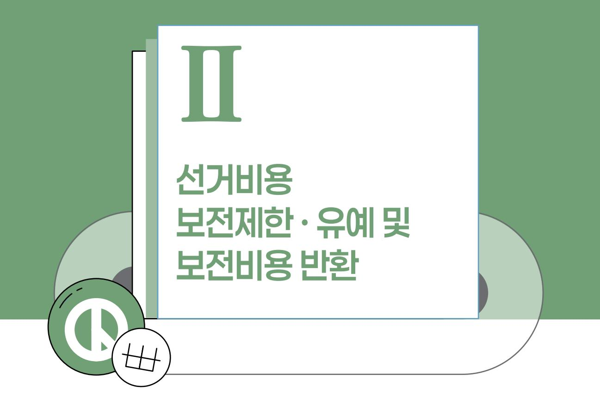

- **1.** 개 요
- **2.** 선거비용 보전제한
- **3.** 선거비용 보전유예
- **4.** 선거비용 보전 후 미보전사유 발견 시 보전비용 반환
- **5.** 당선무효된 자 등의 비용 반환

<!-- page: 26 -->

선거비용 보전대상인 정당·후보자라 할지라도 정당(후보자)·예비후보자·선거사무장·회계 책임자 등과 같이 중요한 역할을 담당하는 자가 위법행위를 하거나 또는 선거비용제한 액을 초과하여 지출한 경우에는 그 보전을 제한·유예하거나 보전된 비용을 반환

# **2 선거비용 보전제한** (법 §135조의2①②③, 규칙 §59조의2)

보전제한이란 보전비용 지급 전에 「공직선거법」 제135조의2제1항부터 제3항까지의 규정에 따라 선거비용 보전액 전부 또는 일부를 보전하지 아니하는 것을 말함.

# **가. 보전제한 대상**

#### 1) 전액 보전제한

선거사무소의 회계책임자가 정당한 사유없이 「정치자금법」 제40조에 따른 회계보고서를 그 제출마감일까지 제출하지 아니한 때에는 보전청구금액 전액 미보전

<!-- page: 27 -->

#### 2) 위법비용의 2배 보전제한

(예비)후보자, 선거사무장, 선거사무소의 회계책임자가 당해 선거와 관련하여 「공직선거법」 또는 「정치자금법」 제49조에 규정된 죄를 범함으로 인하여 유죄의 판결이 확정되거나 선거비용제한액을 초과 지출한 경우 「공직선거법」에 따라 보전할 비용 중 그 위법행위에 소요된 비용 또는 선거비용제한액을 초과하여 지출한 비용의 2배에 해당하는 금액을 미보전

#### 중앙선관위 유권해석

'선거비용제한액을 초과하여 지출한 경우'라 함은 누가 선거비용을 지출했는지 여부를 불문하고 해당 선거구의 선거비용제한액을 초과하여 지출한 경우를 의미함(2001. 9. 6. 회답).

- ※ '유죄의 판결'에는 형의 면제와 선고유예의 판결은 포함되나, 공소기각 판결이나 면소 판결은 포함되지 않음.
- ※ 위법행위에 소요된 비용으로 인해 선거비용제한액을 초과하는 경우 위법비용의 2배만 보전 제한
- ※ 당해 선거와 관련한 선거범죄라 하더라도 (예비)후보자·선거사무장 또는 선거사무소의 회계 책임자로 등록·선임되기 전의 위법행위 및 선거일후 「공직선거법」 제118조(선거일후 답례금지)의 규정에 위반되는 행위로 인한 선거범죄 등은 보전제한·유예대상이 아님.
- ※ 위법비용을 수반하지 않는 예금계좌외 지출, 회계책임자외 지출, 축소·누락보고 등 회계처리상의 위법행위 등은 보전제한·유예대상이 아님.

#### 3) 위법비용의 5배 보전제한

정당, (예비)후보자 및 그 가족, 선거사무장, 선거연락소장, 선거사무원, 회계책임자, 연설원 으로부터 기부를 받은 자가 「공직선거법」 제261조제9항에 따른 과태료를 부과받은 경우 「공직선거법」에 따라 보전할 비용 중 그 기부행위에 사용된 비용의 5배에 해당하는 금액을 미보전

※ 기부행위 제한 등 위반으로 금품 등 이익을 받은 자가 과태료를 부과 받은 경우 기부행위를 한 자에 대해서는 「공직선거법」 제135조의2제2항에도 불구하고 유죄의 판결 확정 여부와 관계없이 과태료 처분의 원인이 된 그 기부행위에 사용된 비용의 5배에 해당하는 금액을 보전하지 않도록 규정한 것임.

# **나. 선거비용 보전 후 위법 보전비용 반환**

<!-- page: 28 -->

- • 선거비용을 보전한 후 「공직선거법」 제135조의2제1항부터 제3항까지의 규정에 따라 보전하지 아니할 사유(위 '가. 1), 2), 3)'을 말함)가 발견되어 선거구선관위로부터 반환명 령을 받은 경우 정당 또는 후보자는 그 반환명령을 받은 날로부터 30일 이내에 반환
- • 반환기한 내에 해당 금액을 반환하지 아니한 때에는 선거구선관위가 당해 지방자치단체장 에게 징수위탁

# **3 선거비용 보전유예** (법 제135조의2제4항, 규칙 제59조의2)

「보전유예」란 보전비용 지급 전에 「공직선거법」 제135조의2제4항에 따라 선거비용 보전액 전부 또는 일부를 보전하지 아니하고 판결이 확정될 때까지 관할 선거구선거관리위원회에서 보관하는 것을 말함.

※ 불기소처분 및 무죄 확정판결이 있을 경우 후보자에게 유예금을 지급함.

(예비)후보자, 선거사무장, 선거사무소의 회계책임자가 당해 선거와 관련하여 「공직선거법」 또는 「정치자금법」 제49조에 규정된 죄를 범함으로 인하여 기소되거나 선거관리위원회에 의 하여 고발된 때에는 판결이 확정될 때까지 그 위법행위에 소요된 비용의 2배에 해당하는 금액의 보전을 유예

※ 고발은 선거관리위원회가 수사기관에 고발한 경우에 한하므로, 제3자가 고발한 경우나 선거관리 위원회가 수사의뢰한 경우에는 적용되지 않음.

<!-- page: 29 -->

# 선거비용 보전 후 미보전사유 발견 시 보전비용 반환

(규칙 §51조의3④⑤)

4

- 선거구선관위는 정당 또는 후보자에게 선거비용을 보전한 후에 「공직선거법」 제122조
   의2제2항에 따라 보전하지 아니할 사유가 발견된 때에는 해당 정당 또는 후보자에게
   그 사실을 통지하고, 보전비용액 중 해당하는 금액의 반환을 명령
- 정당 또는 후보자는 그 반환명령을 받은 날부터 30일 이내에 선거구선관위에 이를 반환 하여야 하며, 반환기한 내에 해당 금액을 반환하지 아니한 때에는 당해 지방자치단체장 에게 징수 위탁
  - ※ 회계보고서 허위 기재로 유죄확정 판결을 받은 경우, 보전제한·유예대상은 아니나, 허위기재로 인해 추가로 보전받은 금액은 반환조치(법 §122조의2②2)

# 5 당선무효된 자 등의 비용 반환 (법 제265조의2, 규칙 제144조의2)

「당선무효된 자 등의 비용반환」은 당락에 불구하고 당선무효에 해당하는 형이 확정된 자가 반환·보전받은 기탁금과 선거비용 보전금액을 반환하도록 하는 규정임. ※ 선거범에 대하여 형사처벌에 추가하여 경제적 제재를 부과하는 의미를 가짐(헌법재판소 2018.1.25. 2015헌마821 결정).

 선거비용을 보전한 후에 「공직선거법」 제263조부터 제265조까지의 규정에 따라 당선이 무효로 된 사람(그 기소 후 확정판결 전에 사직한 사람을 포함)과 당선되지 아니한 사람 으로서 「공직선거법」 제263조부터 제265조까지 규정된 자신 또는 선거사무장 등의 죄로 당선무효에 해당하는 형이 확정된 사람은 제57조와 제122조의2에 따라 반환·보전받은 금액을 반환. 비례대표지방의원선거의 경우 후보자의 당선이 모두 무효로 된 때에 그 추천 정당이 반환함. • 정당·후보자는 반환고지를 받은 날부터 30일 이내에 관할 선거구선관위에 납부

<!-- page: 30 -->

#### **반환대상금액**

선거구선관위로부터 반환받은 기탁금(이자 지급분 포함) 및 보전받은 금액 전액 ※ 반환기탁금 및 보전비용을 정당추천후보자가 소속 정당에, 무소속후보자가 공익법인 또는 사회복지시설에 인계한 경우 인계금액을 제외한 금액 ※ 10원 미만 절사

• 반환기한 내에 해당 금액을 반환하지 아니한 때에는 선거구선관위가 당해 후보자의 주소지 (정당에 있어서는 중앙당의 사무소 소재지를 말함)를 관할하는 세무서장에게 징수 위탁

<!-- page: 31 -->

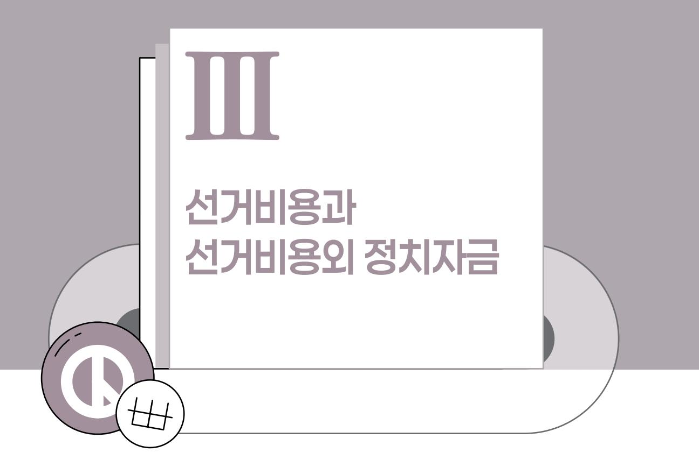

**1.** 선거비용

**2.** 선거비용외 정치자금

<!-- page: 32 -->

- •정치자금은 정치활동을 위하여 정당(중앙당창당준비위원회 포함), 공직선거의 후보자가 되려는 사람, 후보자 또는 당선된 사람, 후원회·정당의 간부 또는 유급사무직원 그 밖에 정치활동을 하는 사람에게 제공되는 금전 등과 그 사람(정당 및 중앙당창당준비위원회 포함)의 정치활동에 소요되는 비용을 말하며, 이는 「정치자금법」 제40조에 의한 회계 보고 대상임.
- •정치자금은 「선거비용인 정치자금」(이하 '선거비용'이라 함)과 「선거비용이 아닌 정치자금」 (이하 '선거비용외 정치자금'이라 함) 2종류로 구분됨.
  - ※ 법 제122조에 의하여 공고된 「선거비용제한액은 '선거비용'의 총액을 제한하는 것으로서, '선거비용외 정치자금'은 포함되지 않음에 유의

# **1 선거비용** (법 제119조)

### **가. 정 의**

당해 선거에서 선거운동을 위하여 소요되는 금전·물품 및 채무 그 밖에 모든 재산상의 가치가 있는 것으로서 당해 후보자(후보자가 되려는 사람을 포함하며, 비례대표지방의원 선거에서는 그 추천정당을 말함.)가 부담하는 비용

※ 선거운동을 위해 소요되는 비용인 이상, 「공직선거법」 제120조(선거비용으로 인정되지 아니하는 비용) 각 호에 해당하지 않는 한 모두 선거비용에 포함되나, 선거와 관련 되더라도 선거운동을 위한 것이 아니라면 선거비용에 해당되지 아니함.

### **나. 유 형**

<!-- page: 33 -->

#### 1) 「공직선거법」에 규정된 선거운동을 위하여 지출한 비용

- • 선거사무소(예비후보자의 선거사무소 포함)나 선거연락소에 설치·게시하는 간판·현판 또는 현수막의 제작 및 설치·철거에 소요되는 비용
- • 선거사무장 등 선거사무관계자에게 지급한 수당·실비 및 고용·산재보험료 ※ 장애인후보자가 선임한 활동보조인의 수당·실비 등은 선거비용외 정치자금
- • 선거벽보·선거공보·선거공약서·후보자 사진의 작성비용
- • 거리게시용 현수막의 제작 및 설치·철거에 소요되는 비용
- • 어깨띠, 표찰·수기 등 선거운동용 소품 등의 구입·제작 등 비용
- • 신문·방송·인터넷광고 및 방송연설에 소요되는 비용
- • 공개장소에서의 연설·대담에 소요되는 비용
- • 선거운동을 위한 전화의 설치비 및 통화료
- • 선거운동용 명함(점자형 포함) 제작 비용
- • 전자우편, 인터넷 홈페이지를 이용한 선거운동에 소요되는 비용
- • 예비후보자의 선거운동에 소요된 비용
- • 그 밖에 「공직선거법」에 위반되지 않는 선거운동을 위하여 지출한 비용

#### 2) 위법한 선거운동(기부행위 포함) 및 후보자 외의 자가 지출한 비용

- • 후보자가 「공직선거법」에 위반되는 선거운동을 위하여 지출한 비용과 기부행위제한 규정을 위반하여 지출한 비용
- • 정당, 정당선거사무소의 소장, 후보자의 배우자 및 직계존비속, 선거사무장·선거연락 소장·회계책임자가 해당 후보자의 선거운동(위법선거운동 포함)을 위하여 지출한 비용과 기부행위제한규정을 위반하여 지출한 비용
- • 선거사무장·선거연락소장·회계책임자로 선임된 사람이 선임·신고되기 전까지 해당 후보자의 선거운동(위법선거운동 포함)을 위하여 지출한 비용과 기부행위제한규정을 위반하여 지출한 비용

• 누구든지 후보자, 정당, 정당선거사무소의 소장, 후보자의 배우자 및 직계존비속, 선거사무장·선거연락소장·회계책임자(선임·신고되기 전의 경우도 포함)와 통모하여 해당 후보자의 선거운동(위법선거운동 포함)을 위하여 지출한 비용과 기부행위제한 규정을 위반하여 지출한 비용

※ 선거비용과 선거비용외 정치자금의 자세한 구분은 부록1. 「선거비용 및 보전항목 일람표」 참조(154쪽)

#### **예외적으로 선거비용으로 보는 경우**

<!-- page: 34 -->

#### 1. 선거운동을 위한 지출이 아님에도 선거비용으로 보는 경우

- 법 제57조의3에 의한 경선운동에 소요되는 비용은 선거비용이 아니지만, 위법한 경선 운동에 소요된 비용은 선거비용으로 봄(법 §57조의3③).
- 후보자가 선거에 관한 여론조사 실시를 위하여 지출한 비용은 선거비용에 해당하지 않으나, 예비후보자등록신청개시일부터 선거일까지 4회를 초과하여 실시하는 선거에 관한 여론조사 비용은 선거비용에 포함됨(법 §120조10호).

#### 2. 기부행위제한규정을 위반한 지출이 아님에도 선거비용으로 보는 경우

- 법 제112조제2항제1호마목에 따른 선거사무소·선거연락소를 방문하는 자에게 통상적인 범위에서 다과류의 음식물을 제공하는 행위는 기부행위에 해당하지 않으나 그에 소요 되는 비용은 선거비용에 포함됨(법 §120조8호).
- 법 제112조제2항제2호사목에 따라 후보자(예비후보자)와 함께 다니는 자에게 통상적인 범위에서 식사류의 음식물을 제공하는 행위는 의례적 행위로서 기부행위에 해당하지 않으나 그에 소요되는 비용은 선거비용에 포함됨(법 §120조8호).

※ 규칙 제50조제6항에 따라 통상적인 범위에서 1명에게 제공할 수 있는 음식물의 금액 범위는 식사류 1만원 이하임.

# **2 선거비용외 정치자금** (법 제120조)

**가. 정 의** 

정치활동에 소요되는 비용 중 '선거비용인 정치자금'이 아닌 정치자금은 모두 '선거비용외 정치자금'에 해당

# **나. 선거비용외 정치자금에 포함되는 비용**

- • 선거권자의 추천을 받는 데 소요된 비용 등 선거운동을 위한 준비행위에 소요되는 비용

<!-- page: 35 -->

- • 정당의 후보자선출대회비용 기타 선거와 관련한 정당활동에 소요되는 정당비용
- • 선거에 관하여 국가·지방자치단체 또는 선거관리위원회에 납부하거나 지급하는 기탁금과 모든 납부금 및 수수료
  - ※ 예비후보자 및 후보자 등록에 필요한 기탁금과 송금수수료, 선거인명부 사본 교부비용 등은 「선거비용」이 아닌 「선거비용외 정치자금」에 해당
- • 개인사무실 등에 선거사무소 또는 선거연락소를 설치한 경우 선거사무소와 선거연락소의 전화료·전기료 및 수도료 기타의 유지비로서 선거기간전부터 정당 또는 후보자가 지출하여 온 경비

#### **중앙선관위 유권해석**

선거사무소와 선거연락소의 전화료·전기료 및 수도료 기타의 유지비로서 선거기간전부터 정당 또는 후보자가 지출하여 온 경비라 함은 선거사무소·선거연락소 설치 이전부터 정당사무소 또는 직업상·직무상의 사무소 등 선거운동과 관련없이 정당활동·직업활동 등 통상적인 사무를 위하여 지출하여 온 경비를 말함(1996. 2. 29. 회답).

• 선거사무소와 선거연락소의 설치 및 유지비용

#### **중앙선관위 유권해석**

선거사무소·선거연락소의 설치 및 유지비는 선거사무소 등의 설치를 위한 임대료·집기구입비 등과 유지를 위한 사무소 등의 개·보수비, 집기수선비, 선거운동을 위한 사무용품외의 일반 사무용품 구입비 등을 말하며, 선거운동을 위한 컴퓨터 등 기계장치 설치·운영비, 선거운동용품 구입비, 선거사무원의 수당·실비 등 선거운동을 위하여 소요되는 비용은 선거비용에 포함(1996. 2. 29. 회답).

• 정당, 후보자, 선거사무장, 선거연락소장, 선거사무원, 회계책임자, 연설원 및 대담·토론자 가 승용하는 자동차(「공직선거법」 제91조제4항에 따른 선거벽보 등 첩부용 자동차·선박 포함)의 운영비용

#### **중앙선관위 유권해석**

법 제91조제4항에 따른 자동차를 운행하는데 소요되는 비용은 정치활동을 위하여 소요되는 비용 으로 볼 수 있으므로 그 후보자의 정치자금에서 지출할 수 있음(2005.1.21. 회답).

법 제91조제4항의 규정에 의한 자동차를 운행하기 위하여 운전기사를 고용하고 그 역무에 대한 정당한 대가로서 인건비를 지급하는 것은 법 제112조제2항제4호마목에 따라 무방할 것이나, 그 역무에 대한 정당한 대가의 범위를 벗어나 금품 기타 이익을 제공하는 것은 사례금 등 명목여하를 불구하고 법 제113조에 위반될 것임(2008.7.3. 회답).

<!-- page: 36 -->

※ 법 제112조제2항제4호마목은 제112조제2항제4호차목으로 개정

- • 제3자가 정당·후보자·선거사무장·선거연락소장 또는 회계책임자와 통모함이 없이 특정 후보자의 선거운동을 위하여 지출한 전신료 등의 비용
  - ※ 제3자가 정당 등과 통모함이 없이 자발적으로 선거운동 하는데 소요되는 비용을 선거비용에 포함시키는 경우에는 선거비용제한액 초과 등 예상치 못한 피해를 줄 수 있기 때문에 정당 등과 사전 통모여부를 고려한 것임.

- • 「공직선거법」 제112조제2항에 따라 기부행위로 보지 아니하는 행위에 소요되는 비용. 다만, 같은 항 제1호마목(정당의 사무소를 방문하는 사람에게 제공하는 경우는 제외) 및 제2호사목(후보자·예비후보자가 아닌 국회의원이 제공하는 경우는 제외)의 행위에 소요되는 비용은 선거비용
- • 선거일 후에 지출원인이 발생한 잔무정리비용
  - ※ 선거일 후에 선거비용 회계보고를 담당하는 회계책임자에게 회계보고에 대한 대가를 지급하는 경우나 선거사무소 등에 설치된 홍보물·집기 등을 철거하기 위하여 그 역무에 대한 대가를 지급하는 경우 등을 말함.
- • 후보자(후보자가 되려는 사람을 포함한다)가 선거에 관한 여론조사의 실시를 위하여 지출한 비용. 다만, 제60조의2제1항에 따른 예비후보자등록신청개시일부터 선거일까지의 기간 동안 4회를 초과하여 실시하는 선거에 관한 여론조사비용은 선거비용
- • 투표참여 권유활동에 소요된 비용
- • 국가 또는 지방자치단체가 부담하는 비용(부담비용)
  - 점자형 선거공보 및 저장매체 작성(구입·제작)·운반비용
  - 점자형 선거공약서 작성비용
  - ※ 점자형 선거공약서의 발송용봉투 제작비와 우편발송 비용은 보전대상 선거비용
  - 활동보조인(후보자가 예비후보자로서 선임하였던 활동보조인을 포함함)의 수당·실비 및 산재보험료
  - ※ 활동보조인의 고용보험료는 부담비용에 해당되지 않으며, 선거비용외 정치자금으로 처리

<!-- page: 37 -->

<!-- page: 38 -->

<!-- page: 39 -->

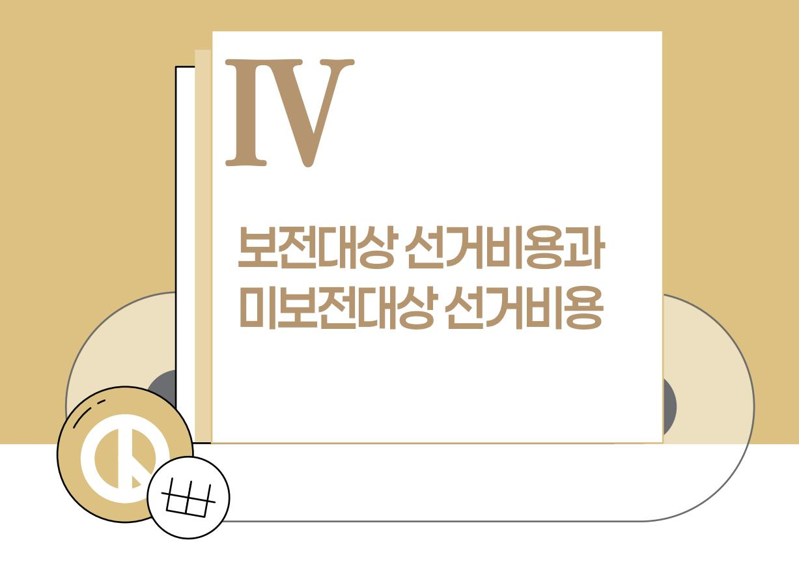

- **1.** 보전대상 선거비용
- **2.** 미보전대상 선거비용

<!-- page: 40 -->

- •선거비용제한액에 포함되는 선거비용이라도 「보전대상인 선거비용」과 「미보전대상인 선거비용」으로 구분됨에 유의
- •보전 및 미보전 대상 선거비용의 자세한 구분은 부록1. 「선거비용 및 보전항목 일람표」참조 (154쪽)

# **1 보전대상 선거비용**

# **가. 인쇄물 작성 관련**

- • 선거벽보, 선거공보, 선거공약서 작성비용
- • 후보자 명함 작성비용 등

# **나. 시설물 등 제작 관련**

- • 거리 현수막 또는 선거사무소·선거연락소 간판·현판·현수막 등의 제작·게시·철거비용
- • 어깨띠, 윗옷·표찰·수기 등 선거운동용 소품 구입·제작비용 등

## **다. 공개장소 연설·대담 관련**

- • 연설·대담차량(발전기 포함) 임차비용, 기사 인건비 및 유류비
- • 연설·대담차량의 연단 제작 및 각종 홍보물 설치·철거비용
- • 연설·대담차량의 확성장치 및 녹화기 임차비용
- • 연설·대담차량의 로고송 제작비용 등

# **라. 선거사무관계자 수당·실비 관련**

- • 선거운동기간 중 선거사무관계자에게 지급한 수당·실비(숙박비 제외) 및 고용·산재보험료
- • 선거운동기간 중 후보자와 함께 다니는 자에게 제공한 식사비용 등

# **마. 광고·방송연설 관련**

<!-- page: 41 -->

- • 후보자 등의 방송연설 관련 소요비용
- • 신문·방송·인터넷광고 관련 소요비용 등

# **바. 기타 선거운동 관련**

- • 선거운동기간 중 전화 통화료 및 문자메시지 발송비용
- • 선거운동기간 중 전자우편 전송 관련 소요비용

# **2 미보전대상 선거비용** (법 제122조의2제2항)

「미보전대상 선거비용」은 선거비용에 해당하여 공고된 선거비용제한액의 범위에는 포함되나, 보전은 되지 아니하는 비용을 말함.

- **가.** 예비후보자의 선거비용
- **나.** 회계보고서에 보고되지 아니하거나 허위로 보고된 비용
- **다.** 「공직선거법」에 위반되는 선거운동을 위하여 또는 기부행위제한 규정을 위반하여 지출된 비용
  - ※ 위법선거운동 등으로 선거법 준수촉구·서면경고·과태료 부과 등 행정조치를 받는 경우, 해당 비용은 「미보전대상 선거비용」에 포함됨에 유의

#### **헌법재판소 결정**

이 사건 법률조항(제122조의2 제2항 제3호 중 '이 법에 위반되는 선거운동을 위하여 지출된 비용'부분)의 입법목적은 비록 형사처벌의 대상으로 될 정도는 아니라서 그보다 상대적으로 경미하다고 볼만한 과태료부과대상이 되는 공직선거법 위반행위 등의 경우에도 그러한 선거 운동에 지출된 비용은 보전해주지 않는다고 명시함으로써 이를 통하여 후보자로 하여금 공직 선거법의 규정을 철저히 준수하도록 유도하는 데 있음(헌법재판소 2012. 2. 23. 2010헌바485).

- **라.** 선거벽보와 선거공보를 관할 선거관리위원회에 제출한 후 그 내용을 정정하거나 삭제하는데 소요되는 비용
- **마.** 「공직선거법」에 따라 제공하는 경우 외에 선거운동과 관련하여 지출된 수당·실비 그 밖의 비용
- **바.** 정당한 사유 없이 지출을 증빙하는 적법한 영수증 그 밖의 지출 증빙서류가 첨부되지 아니한 비용
- **사.** 후보자가 자신의 차량·장비·물품 등을 사용하거나 후보자의 가족·소속 정당 또는 제3자의 차량·장비·물품 등을 무상으로 제공 또는 대여받는 등 정당 또는 후보자가 실제로 지출하지 아니한 비용
- **아.** 청구금액이 「공직선거관리규칙」 제51조의2제2항의 기준에 따라 산정한 통상적인 거래 가격 또는 임차가격과 비교하여 정당한 사유 없이 현저하게 비싸다고 인정되는 경우 그 초과하는 가액의 비용

<!-- page: 42 -->

**통상거래가격 산정기준 (규칙 제51조의2제2항)**

- 1. 정부고시가격 또는 정부의 기준요금(「국가재정법」 제29조제1항에 따른 예산안편성지침의 기준 단가와 요금 포함)
- 2. 「국가를 당사자로 하는 계약에 관한 법률 시행규칙」 제5조에 따른 전문가격조사기관이 조사하여 공표한 가격
- 3. 위 어느 하나의 기준에 따라 계산할 수 없는 가격의 경우에는 「부가가치세법」 제8조에 따라 등록된 해당 업종의 3이상의 사업자가 계산한 견적가격을 평균한 가격 또는 최근 실시한 임기 만료에 따른 선거에서 산정한 가격에 「통계법」 제3조에 따라 국가데이터처장이 고시한 전국 소비자물가변동률을 감안하여 중앙선거관리위원회가 정한 가격

<!-- page: 43 -->

※ 다만, 1과 2에 따라 계산한 가격이 서로 다른 경우에는 그 평균가격 기준

- **자.** 선거운동에 사용하지 아니한 차량·장비·물품 등의 임차·구입·제작비용
  - ※ 예외적으로, 무투표 당선인이 후보자등록마감 전에 이미 선거운동에 필요한 물품을 제작한 경우 그 제작사실을 입증하는 때에는 그 비용은 보전함.
  - ※ 선거운동용 물품을 업체로부터 납품받지 못하였거나 납품이 늦어져 해당 물품을 선거운동에 사용하지 못한 경우 업체에 이미 지급한 비용은 선거비용에 해당되지 않음.

**차.** 휴대전화 통화료와 정보이용요금

- ※ 다만, 후보자와 그 배우자, 선거사무장, 선거연락소장과 회계책임자가 선거운동기간에 선거운동을 위하여 사용한 휴대전화 통화료 중 '후보자가 부담하는 통화료'는 보전대상임.
- **카.** 그 밖에 위 어느 하나에 준하는 비용으로서 「공직선거관리규칙」으로 정하는 비용
  - • 인터넷 홈페이지 또는 그 게시판·대화방 등에 글이나 동영상 등을 게시하는 방법의 선거 운동에 소요되는 비용과 선거운동기간이 아닌 때에 문자메시지·전자우편·전화·명함에 의한 선거운동에 소요된 비용

※ 선거일에 문자메시지를 전송하는 것은 가능하나 그 비용은 보전하지 않음.

<!-- page: 44 -->

• 선거사무소·선거연락소 방문자에게 통상적인 범위에서 제공하는 다과류의 음식물 제공 비용

- • 「공직선거법」 제60조의2제1항에 따른 예비후보자등록신청개시일부터 선거일까지의 기간 동안 4회를 초과하여 실시한 선거에 관한 여론조사 비용 ※ 4회까지의 여론조사 비용은 '선거비용외 정치자금'으로 보전되지 않음.
- • 「정치자금법」에 따라 신고된 예금계좌를 통하지 아니하고 지출한 비용
- • 그 밖에 위의 어느 하나에 준하는 비용으로서 중앙선거관리위원회가 정하는 비용

<!-- page: 45 -->

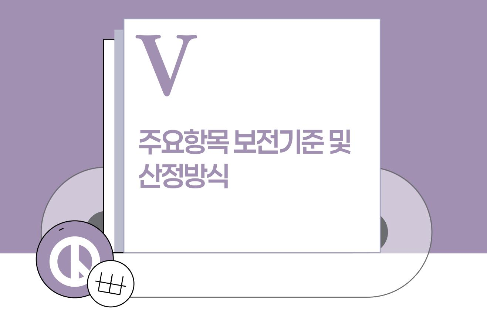

- **1.** 인쇄물(선거벽보·선거공보, 명함 등) 관련
- **2.** 시설물(선거운동기구 간판·현판·현수막, 거리게시 현수막) 관련
- **3.** 공개장소 연설·대담 관련
- **4.** 방송광고·신문광고·방송연설 관련
- **5.** 전화, 문자메시지 관련
- **6.** 선거사무관계자 수당·실비 관련

<!-- page: 46 -->

# **1 인쇄물[선거벽보·선거공보, 명함 등] 관련**

- **가.** 인쇄물의 주요 보전항목은 기획·도안비용, 인쇄비용, 운반비용(상하차 인부임 포함) 등으로 구분되고, 각각 별도의 기준에 따라 보전되기 때문에 기획·도안비용과 인쇄비용, 운반비용 등을 구분하여 보전청구를 하여야 함에 유의
- **나.** 오·훼손된 선거벽보 재첩부를 위해 제3자에게 지급된 통상적인 인부임은 보전대상

# **2 시설물[선거운동기구 간판·현판·현수막, 거리게시 현수막]관련**

- **가.** 간판·현판·현수막(이하 '간판 등'이라 함) 제작비의 통상거래가격에는 설치·철거비용이 포함되어 있으며, 설치·철거하는 때에 특수 장비를 사용한 경우에는 별도 통상거래가격 으로 보전
- **나.** 선거운동을 위하여 거리게시용 현수막을 이동·게시하는데 소요된 통상적인 인건비는 보전 대상

**다.** 예비후보자 신분으로 게시한 간판 등을 선거일 전일까지 계속 사용한 경우에는 해당 게시 기간동안 일할계산하여 선거운동기간동안의 간판 등의 제작비용을 보전

<!-- page: 47 -->

※ 예비후보자 때부터 사용한 간판 등(A)을 선거운동기간 중 새로운 간판 등(B)으로 교체한 경우 A는 선거운동기간 중 게시기간에 대하여 일할계산하여 보전하고, B는 통상거래가격 범위 내에서 전액 보전

#### **현수막 등 시설물 제작비용 보전금액 일할 계산방식**

제작비용 – [통상거래단가 × 면적 × 수량] = A

① A≦0인 경우 보전금액 : 제작비용×(보전일수/게시일수)

- ② A>0인 경우 보전금액 : 통상거래단가×면적×수량×(보전일수/게시일수)
- **라.** 후보자 신분으로 선거운동기간 동안 간판·현수막 등을 게시하는 경우에는 해당 간판· 현수막 등의 통상거래가격 범위 내에서 보전

# **3 공개장소 연설·대담 관련**

**가.** 임차료에 선거운동개시일 전이나 선거일 이후의 공개장소 연설·대담차량 임차비가 포함된 경우 선거운동기간만 일할 계산하여 보전

# **차량·확성장치·발전기·녹화기 등 임차비용 보전금액 계산방식** ① 기준단가 : [청구액 / (대수 × 사용일수)]와 [통상거래단가] 중 적은 금액 ② 공제액 : 청구액 - (기준단가 × 대수 × 보전일수)=A ③ 보전금액 결정 A≦0인 경우 보전금액 : 청구액 A>0인 경우 보전금액 : 기준단가 × 대수 × 보전일수

**나.** 공개장소 연설·대담 관련 보전항목인 차량용 확성장치는 앰프, 스피커, 마이크 등을 포함하며, 앰프의 정격출력을 기준으로 보전(소음기준은 스피커의 정격출력) ※ 「공직선거법」 개정법률(2022. 4. 1.시행)에 따른 소음기준 초과 확성장치 사용 → 위법비용 ※ 확성장치 소음기준(스피커)

<!-- page: 48 -->

| 구 분                                                              |         | 차량용 확성장치 | 휴대용 확성장치 | 비 고 |
|------------------------------------------------------------------|---------|----------|-------------|-----|
|                                                                  | 정격출력    | 음압수준     | 정격출력        |     |
| 시・도지사선거 및 교육감선거 후보자용                                             | 40kw 이하 | 150dB 이하 | 3kw 이하      |     |
| 시・도지사선거 및 교육감선거 선거연락소용, 자치구・시・군의 장선거 후보자용, 지역구시・도의원선거 후보자용 | 3kw 이하  | 127dB 이하 | 30w 이하      |     |
| 지역구자치구・시・군의원선거 후보자용                                              | -       | -        | 30w 이하      |     |

**다.** 「공직선거관리규칙」 제51조의3(선거비용의 보전등) 제1항에 따라 '선거비용 보전청구 증빙 자료'를 제출할 때에는 확성장치, 녹화기(LED 전광판 등)의 종류·수량·규격·용량·해상도를 알 수 있는 사진 첨부

#### **용어해설**

- 픽셀(PIXEL) : 화상 및 영상 등을 표출하는 이미지의 최소 단위
- 피치(PITCH) : 픽셀과 픽셀간의 간격으로 1개의 PIXEL의 중심(CENTER)으로부터 인접된 PIXEL의 중심까지의 거리를 나타냄(피치가 작을수록 보다 정밀하고 상세한 화면 재현이 가능).
- 인치(INCH) : 길이의 단위(1inch = 2.54cm)로 화면크기 측정단위이며 대각선으로 측정함.

**라.** 로고송과 관련하여 저작재산권료는 통상거래가격(사단법인 한국음악저작권협회에서 공시한 금액)에 따라 보전되고, 저작인격권료 등은 실거래가격을 기준으로 보전 ※ 로고송 문의 : 한국음악저작권협회 (TEL. 02-2660-0400, www.komca.or.kr)

#### **용어해설**

• 저작재산권료 : 원래의 곡을 복제하여 사용하고자 할 때 한국음악저작권협회에 지불하는 비용

• 저작인격권료 : 원래의 곡을 개사·편곡하여 사용하고자 할 때 해당 저작권자(작곡·작사자 등) 에게 지불하는 비용

# **4 방송광고·신문광고·방송연설 관련**

- **가.** 방송광고의 경우 광고비용을 산정할 때에는 선거기간중 같은 방송시간대에 광고하는 상업· 문화 기타 각종 광고의 요금 중 최저요금을 적용하여 보전
- **나.** 신문광고의 광고비용을 산정할 때에는 선거기간 중에 같은 지면에 같은 규격으로 게재 하는 상업·문화 기타 각종 광고의 요금 중 최저요금을 적용하여 보전
- **다.** 사전신고 절차를 거치지 않은 방송연설은 「공직선거법」에 위반되는 선거운동을 위하여 지출된 비용에 해당하여 미보전

<!-- page: 49 -->

**| 판례 |** 사전신고 절차를 거치지 않은 방송연설이 법을 위반한 선거운동에 해당하는지 여부

방송연설의 사전신고 절차는 선거관리위원회로 하여금 해당 선거운동이 예정되어 있음을 명확히 인식함으로써 방송연설의 사전·실행 중 또는 사후에 그 적법성과 공정성을 효율적으로관리·통제 할 수 있도록 하기 위하여 마련된 것으로 보이고, 방송연설에서 사전신고는 해당 선거운동 자체의 적법성을 이루는 요소가 된다고 보아야 하므로, 사전신고 절차를 거치지 아니한 방송연설은 법을 위반한 선거운동에 해당하며, 사전신고 없이 한 방송연설에 지출한 선거비용은 '이 법에 위반되는 선거운동을 위하여 지출된 비용'에 해당함(대법원 2010.11.25. 선고 2008두1078 판결).

# **5 전화, 문자메시지 관련**

- **가.** 전화는 선거운동기간 동안 선거운동을 위하여 사용한 비용만 보전대상이므로, 선거운동용 전화와 일반업무용 전화로 구분 설치 필요
- **나.** 선거운동을 위하여 선거사무소 및 선거연락소에 설치된 임시(단기)전화는 설치료‧기본 료를 포함한 통화료를 보전
- **다.** 휴대전화 통화료와 임차비용은 미보전 선거비용임. 다만, 후보자 및 그 배우자, 선거사무장· 선거연락소장·회계책임자가 선거운동기간 동안 선거운동을 위하여 사용한 휴대전화 통화료 중 후보자가 부담하는 비용은 보전대상 선거비용

**임시 (휴대)전화가 아닌 기존 (휴대)전화의 통화요금 보전금액 산정방식**

통신회사로부터 통보받은 해당 전화의 선거운동기간 중의 통화료 - [해당 전화의 직전 3개월간의 통화료 ÷ 90일 × 선거운동기간 일수]

※ 보전청구내역서에 직전 3개월간의 일반전화요금 청구서 등 증빙자료를 첨부하여야 함.

#### **전화요금 정산처리 절차**

1. 정산기간 : 2026. 5. 21.(목) ~ 6. 2.(화) [선거운동기간]

<!-- page: 50 -->

#### 2. 정산대상

- 가. 선거운동을 위하여 선거사무소 또는 선거연락소(이하 '선거사무소 등'이라 함)에 설치한 유선·인터넷 전화
  - 단기전화의 설치료·기본료 및 통화료
  - 선거사무소 등에 이미 설치된 전화(이하 '일반전화'라 함)를 선거운동에 이용했을 경우에는 그 통화료

※ 선거사무소 등에 설치한 전화기 중 선거운동용으로 사용된 전화에 한함.

- 나. 선거운동을 위하여 사용한 휴대전화
  - 후보자의 휴대전화 통화료
  - 후보자의 배우자, 선거사무장, 선거연락소장 및 회계책임자의 휴대전화 통화료 중 '후보자가 부담하는 통화료'
  - ※ '후보자가 부담하는 통화료'란 선거운동기간 중 후보자의 배우자, 선거사무장, 선거연락소장 및 회계 책임자가 선거운동을 위하여 사용한 휴대전화 통화료를 후보자가 부담하는 경우를 말하며, 이 경우 에도 그 비용은 정치자금이므로 신고된 정치자금 지출용 계좌에서 지출되어야 함.
  - ※ 선거사무장 등이 선거운동기간 중 교체된 경우, 선임 근무기간(정산기간)을 특정하여 정산 청구

<!-- page: 51 -->

#### 3. 정산청구내용

- 가. 유선·인터넷 전화
  - 단기전화 : 설치비·기본료, 통화료·문자메시지발송료 및 통화연결음(컬러링) 이용료 ※ 통화료에 수신자부담전화, 데이터통화료는 제외(이하 같음)
    - ※ 정보이용료는 제외(이하 같음)
    - ※ 통화연결음(컬러링) 이용료는 통화연결음으로 후보자의 로고송을 사용하는 등 선거운동의 수단으로 활용한 경우에 한하며, 정액이용요금을 말함(이하 같음).
  - 일반전화 : 통화료·문자메시지발송료 및 통화연결음(컬러링) 이용료
- 나. 휴대전화 : 통화료 및 문자메시지발송료·통화연결음(컬러링) 이용료 ※ 통화료에는 음성통화료와 영상통화료를 포함

#### 4. 정산청구방법

#### 가. 유선·인터넷 전화

● KT : 각 지역 KT plaza에 방문접수

※ 「www.kt.com → 고객지원 → 매장찾기」에서 해당지역 KT plaza 검색

- SK브로드밴드, LG유플러스 : 각 사 콜센터를 통해 정산 청구 의뢰 ※ SK브로드밴드 106, LG유플러스 101
- SK텔레콤 : 전국 SKT 지점 방문 접수
  - ※ 「T월드 고객센터(www.tworld.co.kr) → 고객지원 → 매장찾기」, 「SK텔레콤 휴대폰에서 114 +☏ 또는 1599-0011로 해당지역 SKT지점 문의」

#### 나. 휴대전화

● KT : 각 지역 KT plaza에 방문접수 ※ 「www.kt.com → 고객지원 → 매장찾기」에서 해당지역 KT plaza 검색

- LG유플러스 : 콜센터를 통해 정산 청구 의뢰(정산청구서는 FAX송부) ※ 휴대폰에서 114 + ☏로 문의
- SK텔레콤 : 전국 SKT 지점 방문 접수 ※ T월드 고객센터(www.tworld.co.kr) → 고객지원 → 매장찾기 ※ 휴대폰에서 114 + ☏로 문의 또는 1599-0011로 해당지역 SKT지점 문의

<!-- page: 52 -->

#### 5. 정산절차

- 가. 통신회사에 전화요금 정산 청구(후보자 ⇨ 통신회사) : 통신사 통보기한 감안하여 청구
- 나. 전화요금 정산결과의 후보자등 통보(통신회사 ⇨ 후보자)
- 다. 전화요금 보전청구내역서의 선관위 제출(후보자 ⇨ 선관위) : 2026. 6. 15.(월)까지 ※ 정산결과를 기한 내 통보받지 못한 경우 전화요금 정산 청구서 사본을 보전청구서에 첨부하되, 회계보고 시 추가로 보전청구내역서 제출

#### 선거사무관계자 수당·실비 관련 6

<!-- page: 53 -->

# 가. 선거사무관계자 수당·실비 지급기준

(단위 : 원)

| 선거운동 기구별                   |           | 구분 4           | 수당      | 실 비         |             |             |             |               |            |
|----------------------------|-----------|----------------|---------|-------------|-------------|-------------|-------------|---------------|------------|
|                            |           |                |         | 일비 (1일당) | 식비 (1일당) | 철도 운임    | 선박 운임    | 다 아 아 아 | 자동차 운 임 |
| 시·도지사 (교육감)             | 선거 사무소 | 선거 사무장      | 140,000 | 25,000      | 25,000      | 실비 (특실)  | 실비 (1등급) | 실비            | 실비         |
|                            | 선거 연락소 | 선거 연락소장     | 100,000 | 25,000      | 25,000      | 실비 (일반실) | 실비 (2등급) | 실비            | 실비         |
| 시·군의                       | 선거 사무소 | 선거 사무장      | 100,000 | 25,000      | 25,000      | 실비 (일반실) | 실비 (2등급) | 실비            | 실비         |
|                            | 선거 연락소 | 선거 연락소장     | 100,000 | 25,000      | 25,000      | 실비 (일반실) | 실비 (2등급) | 실비            | 실비         |
| 지역구 시 선거 선거             |           | 선 거 사무장     | 100,000 | 25,000      | 25,000      | 실비 (일반실) | 실비 (2등급) | 실비            | 실비         |
| 비례디 시·도의원 선거사        | 원선거       | 선 거 사무장     | 140,000 | 25,000      | 25,000      | 실비 (특실)  | 실비 (1등급) | 실비            | 실비         |
| 지역구 구 의원선 선거사        | <u> </u>  | 선 거 사무장     | 100,000 | 25,000      | 25,000      | 실비 (일반실) | 실비 (2등급) | 실비            | 실비         |
| 비례대표 구·시·군의원선거 선거사무소 |           | 선 거 사무장     | 100,000 | 25,000      | 25,000      | 실비 (일반실) | 실비 (2등급) | 실비            | 실비         |
| 공                          | 통         | 선거사무원 활동보조인 | 60,000  | 25,000      | 25,000      | 실비 (일반실) | 실비 (2등급) | 실비            | 실비         |

※ 회계책임자 수당·실비는 당해 회계책임자가 소속한 선거사무소 또는 선거연락소의 선거사무장 또는 선거연락 소장에 대한 수당·실비와 같은 금액을 지급함.

※ 한 사람이 회계책임자·선거사무장·선거연락소장 또는 선거사무원·활동보조인을 함께 맡은 때에는 지급기준이

많은 금액에 해당하는 1인의 수당·실비만 지급함.

※ 숙박비는 지급할 수 없음.

**나.** 선거사무관계자의 수당·실비는 선거운동기간 중 실제 활동한 경우에만 보전되며, 실제 선거운동 또는 선거사무처리를 하지 아니한 경우에는 해당 일자만큼의 수당 및 실비는 지급 불가

※ 감액하지 않고 지급한 경우 미보전 대상이며, 「공직선거법」 제230조 위반 소지

- **다.** 「공직선거법」 제135조제1항 단서에 따라 정당(정당선거사무소 포함)의 유급사무직원, 국회의원과 그 보좌관·선임비서관·비서관 또는 지방의원이 후보자의 선거사무관계자를 겸한 때에는 이들에게 수당을 지급할 수 없으므로 실비만 보전대상
  - ※ 정당의 유급사무직원, 국회의원과 그 보좌관**·**선임비서관**·**비서관 또는 지방의원이 예비후보자의 선거사무장 등으로 선임된 때에는 그 선거사무원수에 산입하고 수당과 실비를 지급할 수 있음. (미보전 선거비용)
- **라.** 선거사무관계자에게 식사 또는 출·퇴근 교통편의를 제공한 경우에는 해당 실비에서 감액하고 지급
  - ※ 선거사무관계자에게 선거운동 중 선거운동장소 이동을 위한 교통편의를 제공하는 경우에는 공제 대상이 아님.

**선거사무원 수당·실비 계산방식 (1.~3. 선거사무원이 1일을 온전히 근무한 경우)**

<!-- page: 54 -->

#### 1. 후보자와 함께 다닌 선거사무원에게 1만원 상당의 식사 1식을 제공한 경우

- 수당·실비 지급액 : 수당 6만원, 식비 16,660원(2식×8,330원), 일비 2만5천원

#### 2. 후보자와 함께 다닌 선거사무원에게 3,500원 상당의 식사 2식을 제공한 경우

- 수당·실비 지급액 : 수당 6만원, 식비 8,330원(1식), 일비 2만5천원

#### 3. 선거사무원에게 6,000원 상당의 식사 1식과 출퇴근 교통편의를 제공한 경우

- 수당·실비 지급액 : 수당 6만원, 식비 16,660원(2식×8,330원), 출퇴근 교통편의 제공에 소요된 비용을 제외한 일비

※ 선거운동 중 선거운동 장소 이동을 위한 교통편의를 제공한 경우는 일비를 공제하지 아니함 ※ 선거사무원에게 12,000원 상당의 식사 1식을 제공한 경우, 식비에서 12,000원 공제 후 13,000원 지급

- 4. A선거사무원을 오전 11시에 B선거사무원으로 교체하였으나 교체 전까지 선거운동을 한 경우 수당·실비 지급액
  - 수당 : 6만원(교체 전·후 선거사무원에게 각각 지급 가능)
  - 식비 : A선거사무원-8,330원(1식), B선거사무원-16,660원(2식)
  - 일비 : 1일분을 실제 선거운동에 종사한 시간에 따라 나누어 지급 ※ 보전되는 선거사무원 수당·실비는 1명분에 한함.
- 5. A선거사무원을 오후 4시에 B선거사무원으로 교체하였으나 교체 전까지 선거운동을 한 경우 수당·실비 지급액
  - 수당 : 6만원(교체 전·후 선거사무원에게 각각 지급 가능)
  - 식비 : A선거사무원-16,660원(2식), B선거사무원-8,330원(1식)

<!-- page: 55 -->

  - 일비 : 1일분을 실제 선거운동에 종사한 시간에 따라 나누어 지급 ※ 보전되는 선거사무원 수당·실비는 1명분에 한함.

## **마. 선거사무관계자의 고용·산재보험료 지급방법**

고용·산재보험료 납부 시, 근로자(선거사무관계자)가 부담하는 보험료는 선거사무 관계자 수당에서 공제하고, 사업자(후보자)가 부담하는 보험료와 함께 선거비용으로 지출

| 구 분    | 고용보험                | 산재보험                               |                 |
|--------|---------------------|------------------------------------|-----------------|
|        | 근로자 부담 (선거사무관계자) | 사업자 부담 (후보자)                    | 사업자 부담 (후보자) |
| 보험료 부담 | (실업급여) 1/2 부담       | • (실업급여) 1/2 부담 • (고용안정등) 전액 부담 | 전액 부담           |
| 지출 과목  | 선거비용 (수당에 포함)    | 선거비용                               |                 |

※ 선거사무관계자 수당·실비 및 보험료는 보전대상 선거비용(활동보조인의 수당, 실비 및 산재보험료는 선거비용외 정치자금)

※ 산재보험 가입시 「임금채권보장법」 및 「석면피해구제법」에 따라 함께 징수되는 기타부담금은 보전대상에서 제외

※ 보험가입시 보수총액을 '수당+실비'로 신고하더라도, 보전비용은 '수당'에 대한 보험요율을 적용하여 산출한 금 액만 보전

※ 선임 당시 65세 이상인 선거사무관계자의 경우 고용보험 중 고용안정·직업능력개발사업만 적용(실업급여 제외) ※ 고용·산재보험 요율 및 신고·납부방법은 근로복지공단(TEL.1588-0075, www.comwel.or.kr)으로 문의

# 제9회 전국동시지방선거 **선거비용 보전 안내서**

<!-- page: 56 -->

<!-- page: 57 -->

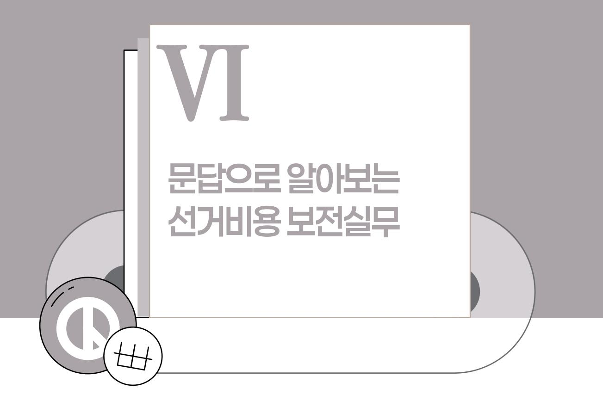

- **1.** 선거사무소 간판·현판·현수막
- **2.** 거리게시용 현수막
- **3.** 선거사무소·선거연락소
- **4.** 어깨띠, 윗옷, 모자 등 소품
- **5.** 공개장소 연설·대담 등
- **6.** 전화·문자·전자우편·인터넷홈페이지
- **7.** 선거사무관계자 수당·실비 등
- **8.** 신문광고, 방송광고, 방송연설, 인터넷광고
- **9.** 인쇄물(명함, 선거벽보·선거공보 등 법정홍보물)

<!-- page: 58 -->

**| 예비후보자 |** 선거비용제한액에 포함되는 선거비용이라도 보전되지 않음.

**| 후 보 자 |** 선거비용은 선거비용제한액 범위에서 보전대상임.

# **1 선거사무소 간판·현판·현수막** (법 제60조의3, 제61조) **| 예비후보자 | | 후 보 자 |**

### **가. 제작·설치**

### 1) 예비후보자 선거사무소에 현수막을 제작·설치한 후 선거종료시까지 현수막을 계속 사용한 경우 보전이 되나요?

현수막 총 게시일수 중 선거운동기간에 대해 일할 계산하여 보전됩니다.

- 2) 선거사무소 현수막을 예비후보자때 설치하여 계속 사용한 경우, 크레인 임차비용도 보전이 되나요?
  - 현수막 설치를 위한 크레인 임차비용은 「선거비용」으로 현수막 제작비용과 동일하게 일할 계산하여 보전됩니다.
- 3) A선거구 예비후보자 사퇴 후 B선거구 후보자로 등록하여 A선거구 예비후보자 때 사용 하던 외벽현수막을 재활용할 경우 보전이 되나요?
  - 후보자 본인이 소유하고 있던 현수막을 선거운동에 사용하는 것으로 보아 「미보전 대상 선거비용」입니다. 다만, 현수막을 일부 수정하여 게시한 경우 수정에 소요된 비용은 「보전대상 선거비용」입니다.

- 4) 예비후보자가 공약발표 기자회견을 할 때 배경으로 사용할 백드롭(또는 현수막 등) 제작비는 보전이 되나요?

<!-- page: 59 -->

  - 기자회견에서 사용하는 백드롭은 「선거비용외 정치자금」에 해당되어 보전대상이 아닙니다.
- 5) 선거사무소 현수막 제작·설치에 소요된 재료비, 인건비의 경우 「선거비용외 정치자금」 인가요?
  - 선거사무소 현수막 제작·설치·철거비(현수막 게시를 위해 필요적으로 소요된 재료비 및 인건비가 포함된 비용)는 「선거비용」이며, 통상거래가격으로 보전됩니다. 다만, 선거사무소 내부현수막은 선거비용외 정치자금에 해당되어 보전대상이 아닙니다.
- 6) 강풍 등 자연재해로 인해 선거사무소 현수막이 훼손되어 교체 게시한 경우 기존 현수막 제작·설치비와 재제작한 현수막 제작·설치비 모두 「선거비용」으로 보아야 하나요?

「공직선거법」상 모두 「선거비용」에 해당합니다.

7) 후보자로 등록한 이후 선거기간개시일 전에 선거연락소를 관할 선관위에 설치·신고 하고 그 선거연락소에 현수막을 설치하여 선거일 후에 철거한 경우, 보전은 어떻게 되나요?

통상거래가격 범위 내에서 보전됩니다.

### **나. 게시장소 사용**

1) 선거사무소에 현수막을 게시하기 위해 같은 건물 외벽에 게시되어 있던 다른 업체 현수막을 줄이거나 이동에 소요되는 비용도 「선거비용」인가요?

「선거비용외 정치자금」입니다.

- 2) 선거사무소 현수막 게시를 위해 건물주에게 사용료를 지급하는 경우 「선거비용」인가요?
  - 후보자의 선거사무소에 현수막 게시를 위해 지급된 정당한 사용료는 「선거비용」으로 보전됩니다.

3) 선거사무소 현수막 게시로 인해 주변 상가의 영업행위에 지장을 초래하여 통상의 손해배상을 하는 경우 「선거비용」인가요?

통상의 손해배상 비용은 「선거비용외 정치자금」으로 보전대상이 아닙니다.

<!-- page: 60 -->

### **다. 기타**

### 1) 선거사무소의 간판·현판·현수막을 비추기 위한 별도의 조명시설을 설치했을 경우 그 제작·설치비용은 「선거비용」인가요?

 선거사무소 외벽이나 간판·현판·현수막을 비추기 위해 별도 설치한 조명시설 설치 비용은 「선거비용외 정치자금」으로 보전대상이 아닙니다.

2) 선거사무소 외벽에 붙이는 선거벽보 코팅비도 보전대상인가요?

보전대상입니다.

# **2 거리게시용 현수막** (법 제67조) **| 후 보 자 |**

1) 선거운동을 위하여 거리게시용 현수막을 이동게시한 경우 보전이 되나요?

보전대상입니다.

- 2) 거리게시용 현수막 양면을 같은 내용으로 제작하여 1장의 현수막으로 제작할 경우 2면에 대한 가격으로 보전하나요?

<!-- page: 61 -->

  - 현수막이 2면이더라도 1장의 현수막이므로 보전기준은 단면으로 게시한 현수막과 동일합니다.
- 3) 거리게시용 현수막을 후보자측 과실 또는 변심으로 실제 사용하지 않았다면 그 제작 비용은 「선거비용」인가요?

「미보전대상 선거비용」에 해당합니다.

# **3 선거사무소·선거연락소** (법 제60조의3, 제61조) **| 예비후보자 |**

**| 후 보 자 |** 

1) 선거사무소 개소식과 관련하여 다과 제공을 위한 쟁반, 접시, 일회용 젓가락·숟가락 등의 구입비는 「선거비용외 정치자금」인가요?

「선거비용외 정치자금」입니다.

2) 선거사무소 개소식에 앰프를 임차한 경우 앰프 임차비는 「선거비용」인가요?

선거운동을 위해 지출한 비용이 아니므로 「선거비용외 정치자금」에 해당됩니다.

- 3) 후보자가 자신의 개인 사무실에 선거사무소를 설치한 경우 관리비 등은 「선거비용」 인가요?
  - 선거사무소 관리비는 「선거비용외 정치자금」입니다. 또한 전기료·수도료 기타의 유지비로서 선거사무소 설치전부터 통상적으로 지출하여 온 경비도 「선거비용외 정치자금」이나 그 금액을 초과하는 비용은 「선거비용」입니다.
    - ※ 관리비에 전기료·수도료가 포함되어 있는 경우 관리비 중 해당되는 금액(통상적으로 지급하여 오던 금액 초과비용)만큼만 선거비용으로 지출 처리
- 4) 지지자·지인 등이 선거사무소를 방문하면서 의례적으로 음료나 다과 등을 후보자측에 제공할 수 있나요?
  - 선거사무소를 인사차 방문하는 지지자가 일상적인 예를 갖추는데 필요한 정도로, 현장에서 소비될 것으로 예상되는 음료 등의 물품을 제공한 경우에는 「정치자금법」 상 제한되지 않습니다. 다만 제공의 상대방, 수량, 가액, 목적, 활용양태 등을 종합적 으로 고려할 때 의례적인 범위를 넘어 선거사무소 운영 등에 소요될 음료 등을 제공하거나, 선거운동과 관련하여 제공하는 경우에는 행위 양태에 따라 「공직선거법」 제135조 및 「정치자금법」 제2조·제45조에 위반됩니다.

5) 선거사무소에서 사용할 정수기를 임차하면서 생수만 해당 업체로부터 구입하고 정수기 임차료는 별도로 지급하지 않는 경우 정수기도 회계처리 대상인가요?

 업체가 통상적인 영업행위 일환으로 정수기를 서비스로 제공한 경우에는 회계처리 대상이 아닙니다.

# **4 어깨띠, 윗옷, 모자 등 소품** (법 제60조의3, 제68조) **| 예비후보자 | | 후 보 자 |**

### **가. 어깨띠**

<!-- page: 62 -->

#### 1) 예비후보자가 사용한 어깨띠, 표지물의 구입비용은 「선거비용」인가요?

 법 제60조의3제1항제5호에 따라 예비후보자가 선거운동을 위하여 사용한 어깨띠, 표지물의 구입비용은 「미보전대상 선거비용」이나, 법 제68조에 따라 후보자가 선거 운동을 위하여 사용하는 어깨띠, 윗옷, 그 밖의 소품은 「보전대상 선거비용」입니다.

※ 예비후보자가 선거운동에 사용한 어깨띠, 소품 등을 후보자 때에도 계속 사용한 경우, 선거운동기간 중 사용한 일수만큼 일할계산하여 보전

#### 2) 후보자가 사용한 발광소재의 어깨띠 제작비용은 별도로 보전이 되나요?

 선거운동에 사용하는 어깨띠를 특수재질로 만든 경우 별도로 해당 제품의 통상적인 가격 범위 내에서 보전됩니다.

3) 후보자가 어깨띠 등의 소품을 제작하여 업체로부터 택배 등을 통해 받았을 경우 택배 비는 보전대상이 되는 「선거비용」인가요?

「선거비용외 정치자금」으로 보전되지 않습니다.

4) 후보자 어깨띠를 에어아바타에 메어 사용한 경우 보전은 어떻게 되나요?

귀문의 경우 소품으로 보아 통상거래가격 범위 내에서 보전됩니다.

- 5) 후보자 어깨띠 및 후보자·선거사무장등(예비후보자의 선거사무장 등 제외) 윗옷, 모자 디자인을 각각 했을 경우 각각 보전이 되나요?
  - 어깨띠의 디자인 비용은 제작비용에 포함하여 통상거래가격 범위 내에서 보전되고 윗옷 및 모자의 디자인 비용은 해당 항목의 '기호 등 인쇄비'에 각각 포함하여 통상 거래가격 범위 내에서 보전됩니다.

# **나. 윗옷, 모자**

<!-- page: 63 -->

- 1) 예비후보자때 표지물로 사용한 선거운동용 윗옷을 후보자 때에도 계속 착용한다면 보전대상이 되나요?
  - 후보자가 6만원 이내의 윗옷을 착용한 경우에 한하여 선거운동기간에 대해 일할 계산 하여 보전됩니다.
- 2) 선거운동용 윗옷에 형광소재를 사용하여 기호 등을 인쇄한 경우 인쇄비와 디자인비는 보전이 되나요?
  - 특수재질이 사용된 사실을 입증하는 경우 별도 보전되나 디자인 비용은 '기호 등 인쇄비'의 통상거래가격 범위 내에서 보전됩니다.
- 3) 선거운동용 윗옷을 교체 사용하기 위하여 여러 벌을 제작하여 실제 사용한 경우 모두 보전되나요?

선거운동에 실제 사용한 경우에는 모두 보전됩니다.

- 4) 선거운동용 윗옷을 63,000원에 구입한 경우 보전이 되나요?
  - 「공직선거법」 제68조에 위반되는 선거운동에 소요된 비용이므로 전체 금액인 63,000원이 위법비용으로 전액 보전되지 않습니다.
- 5) 선거운동용 윗옷을 63,000원으로 구입하고 별도 기호 등 인쇄비 3천원을 청구한 경우에 윗옷과 인쇄비를 별개로 보아 기호 등 인쇄비 3천원에 대해서는 보전이 가능 한가요?

기호 등 인쇄비만 보전이 가능할 것입니다.

- 6) 선거운동용 윗옷은 6만원이나 구입한 윗옷에 기호, 정당명, 사진 등 홍보문구를 게재 하여 6만원이 초과되는 경우 홍보문구 등 인쇄비용은 윗옷 구입비용과 별도로 보전이 가능한가요?
  - 홍보문구 게재 등 표시물은 윗옷 구입비용과는 별도로 통상거래가격 범위 내에서 보전됩니다.
- 7) 선거운동을 하다가 윗옷의 일부가 찢어져 그 부위를 "후보자 이름 또는 기호"가 인쇄된 A4 크기의 천으로 덧붙일 경우 수선비와 인쇄비는 「보전대상 선거비용」인가요?
  - 선거운동용 윗옷에 후보자의 이름, 기호가 인쇄된 천(표시물)을 붙이는데 소요된 비용은 「보전대상 선거비용」입니다.
- 8) 선거사무원이 자비로 구입하여 소유하고 있는 당 유니폼에 후보자가 후보자 홍보 문구만 인쇄하여 주었을 경우 해당 비용을 「선거비용」으로 보아야 하나요?

<!-- page: 64 -->

후보자가 부담한 인쇄비용은 「선거비용」입니다.

9) 일회용 비옷에 기호·후보자 성명 등 홍보에 필요한 사항을 기재하면 「선거비용」으로 보전대상인가요?

선거운동을 위한 소품으로 사용한 일회용 비옷은 「선거비용」으로 보전됩니다.

### **다. 소품**

- 1) 넥타이나 기타 고가의 선거운동용 소품 등을 선거일후 회수하지 않으면 기부행위로 볼 수도 있나요?
  - 선거운동용 소품은 선거운동기간에 일시적으로 사용·소비되는 점을 감안하여 제작하여야 할 것입니다. 또한 1회성 선거운동용품으로 볼 수 없는 고가의 물품을 구입하여 소품으로 제공하는 것은 「공직선거법」상 제한되는 기부행위에 해당될 수 있고, 기부행위에는 해당되지 않더라도 선거 후에도 자산가치가 있게 되는 경우에는 보전대상에 해당되지 않습니다.

- 2) 후보자가 50만원 정도 가격의 캐릭터 옷을 제작한 경우 임차를 하지 않고 자산가치가 있는 것을 구입했으므로 보전되지 않나요?
  - 소품을 별도로 제작한 경우 해당 소품이 선거일 후에도 자산가치가 있다고 인정되는 경우에는 해당 소품의 제작비용은 보전되지 않습니다.
- 3) 후보자가 피켓 상단에 야간에도 잘 보이도록 조명을 설치한 비용은 「선거비용」인가요? 「보전대상 선거비용」에 해당합니다.
- 4) 후보자가 선거운동을 위하여 홍보물을 부착한 백팩을 소품으로 사용하는 경우 그 구입비용이 「보전대상 선거비용」에 해당하나요?
  - 선거운동을 위하여 백팩을 소품으로 사용하는 경우 그 구입비용은 「보전대상 선거 비용」에 해당하나, 선거 후에도 자산가치가 있는 경우에는 보전대상에 해당되지 않습니다.

<!-- page: 65 -->

#### 5) 선거사무원이 선거운동을 할 때 사용하는 장갑과 토시도 「보전대상 선거비용」인가요?

 장갑과 토시에 기호 등을 새겨 선거운동용 소품으로 사용하는 경우에만 「보전대상 선거비용」이며, 단순히 햇볕에 피부가 노출되는 것을 예방하기 위한 용도 등으로 착용한 장갑과 토시는 「선거비용외 정치자금」에 해당할 것입니다.

#### 6) 선거운동에 사용한 장갑의 경우 기호 등 인쇄비와 구입비는 보전이 되나요?

「선거비용」에 해당되며, 통상거래가격 범위내에서 보전됩니다.

7) 후보자가 선거사무관계자에게 선거운동 과정에서 코로나 감염을 예방할 수 있도록 단순히 마스크를 구입하여 사용하는 것도 보전이 되나요?

 「선거비용외 정치자금」에 해당되고 보전되지 않습니다. 다만, 마스크에 기호 등을 새겨 선거운동용 소품으로 사용하는 경우에는 「보전대상 선거비용」입니다.

### 8) 후보자가 선거사무관계자가 아닌 자원봉사자에게 선거운동에 필요한 소품 등을 제작 하여 준 경우에도 보전되나요?

위법비용으로 선거비용에 합산하되, 보전되지 않습니다.

# **5 공개장소 연설·대담 등** (법 제79조) **| 후 보 자 |**

# **가. 연설·대담차량**

- 1) 후보자가 선거운동기간동안 공개장소 연설·대담에 자기소유 차량을 사용한 경우 「보전대상 선거비용」인가요?
  - 후보자가 자신의 소유 차량을 공개장소 연설·대담차량으로 사용한 경우 그에 소요 되는 비용은 「선거비용」이나 보전대상은 아닙니다. 이 경우 「선거비용」으로 계상할 금액은 통상거래가격(공개장소 연설·대담차량 임차비)에 해당하는 금액입니다.

### 2) 공개장소 연설·대담차량을 선거운동기간 개시일 2·3일전에 임차하여 선거운동기간 중 사용하였다면 「선거비용」을 보전받을 수 있는 기간은 언제부터인가요?

 선거운동기간 개시일부터 선거일 전일까지의 공개장소 연설·대담차량 임차비는 「보전대상 선거비용」이며, 전체 임차료에 선거운동기간 개시일 전이나 선거일 이후의 공개장소 연설·대담차량 임차비가 포함된 경우에는 선거운동기간만 일할 계산하여 보전됩니다.

### 3) 후보자가 대표로 있는 법인이 소유하고 있는 차량을 공개장소 연설·대담차량으로 사용 가능한가요, 가능할 경우 보전대상에 해당 하나요?

<!-- page: 66 -->

 무상으로 대여하는 것이 아니라 통상적인 가격으로 임차하는 것이라면 「정치자금법」 상으로는 제한되지 않을 것이며, 그 임차비는 보전됩니다.

### 4) 공개장소 연설·대담차량 임차 시 트럭이 아닌 버스를 임차하여 사용할 경우 보전이 되나요?

 「공직선거관리규칙」 제51조의2제2항에 따라 통상적인 차량 임차료 범위 내에서 보전됩니다.

- 5) 공개장소 연설·대담차량으로 1.5톤형 트럭을 사용한 경우 보전기준은 어떻게 되나요?
  - 트럭의 경우 적재용량인 톤으로, 버스의 경우 탑승인원인 인승으로 구분하여 보전 됩니다. 다만, 통상거래가 결정내역의 항목에 규격이 없는 트럭의 경우 인접한 규격의 통상거래가격이 적용됩니다.

※ 1.2톤형·1.5톤형 ⇒ 1톤형, 4.5톤형 ⇒ 5톤형

6) 선거운동 기간에 사용하려고 공개장소 연설·대담차량을 계약했다가 파기하여 위약금을 물고 실제 선거운동에 사용하지 않은 경우 어떻게 처리해야 하나요?

계약 파기에 따른 위약금은 「선거비용외 정치자금」입니다.

- 7) 당원이 정당선거사무소에 차량, 장비, 물품 등을 제공 또는 대여할 수 있는데 정당 선거사무소가 당원으로부터 제공 또는 대여받은 차량을 후보자의 공개장소 연설· 대담차량으로 제공한 경우 보전이 되나요?
  - 정당선거사무소가 당비처리 해야 하며, 후보자는 통상거래가격에 해당하는 금액을 '공개장소 연설·대담차량 임차비'로 「선거비용」에 계상하되, 후보자가 실제 지출하지 아니한 비용이므로 「미보전대상 선거비용」입니다.
- 8) 선거운동기간 개시일에 공개장소 연설·대담차량이 고장나 다른 업체에서 연설·대담 차량을 새로 임차한 경우 고장난 차량에 설치된 연단 등 철거에 2일이 소요되어 지급한 차량 임차비도 「선거비용」인가요?
  - 공개장소 연설·대담 차량 고장으로 다른 차량을 새로 임차하여 선거운동을 한 경우 고장난 차량의 연단 철거 등을 위해 지급한 2일분의 차량 임차비는 「선거비용외 정치자금」입니다. 다만, 교체 당일 공개장소 연설·대담차량을 이용하여 각각 선거 운동을 한 경우 교체 당일 지급한 차량 임차비는 모두 「선거비용」이나 보전은 1일 1대분의 임차비용만 통상거래가격 범위 안에서 보전됩니다.

<!-- page: 67 -->

#### 9) 업체로부터 연설·대담차량을 받기 위한 탁송비는 「보전대상 선거비용」인가요?

 연설·대담차량 인도에 소요되는 비용은 「선거비용외 정치자금」에 해당합니다. 차량 기사가 차량을 직접 받으러 가는 경우에 소요되는 비용(역무제공에 상응하는 통상적 인건비)도 「선거비용외 정치자금」에 해당합니다.

- 10) 후보자가 지인에게 비사업용 화물차를 유상으로 임차하여 연설대담용 차량으로 사용할 경우 「보전대상 선거비용」인가요?
  - 후보자가 지인에게 비사업용 화물차를 유상으로 임차하여 연설대담용 차량으로 사용한 경우 보전 대상이지만 임대인인 지인의 행위는 「화물자동차 운수사업법」 제56조 및 제67조 등에 위반될 수 있음을 참고하시기 바랍니다.

### **나. 연단·래핑 등 설비**

1) 공개장소 연설·대담차량 래핑비에 디자인비(기획·도안료)가 포함되어 있나요?

차량 래핑비 통상거래가격에는 기획·도안료가 포함되어 있습니다.

- 2) 공개장소 연설·대담차량의 디자인을 변경하거나 찢어져서 부득이하게 다시 래핑을 바꾸어야 할 경우 횟수에 상관없이 전부 보전되나요?
  - 실제 선거운동에 사용한 경우라면 재래핑에 소요된 비용도 「보전대상 선거비용」에 해당합니다.
- 3) 공개장소 연설·대담차량 래핑을 위해 차량을 개조하게 될 경우 그에 소요된 비용은 보전대상인가요?

「보전대상 선거비용」입니다.

4) 공개장소 연설·대담차량의 조명 설치·철거비용과 공개장소 연설·대담차량의 간판 설치·철거비용이 「선거비용」인가요?

<!-- page: 68 -->

「선거비용」이며 보전대상입니다.

5) 공개장소 연설·대담차량은 1톤인데, 무대연단을 2.5톤에 상응하는 크기로 제작하는 경우 보전처리 기준은 어떻게 되나요?

무대연단 1톤형으로 보전됩니다.

6) 공개장소 연설·대담차량 무대연단의 통상거래가격에 철거비가 포함되어 있나요?

 공개장소 연설·대담차량의 무대연단 통상거래가격에는 제작 및 설치·철거비가 포함되어 있습니다.

- 7) 공개장소 연설·대담차량의 무대연단과 관련하여 "연단"이라는 것이 차량의 연설하기 위한 바닥, 프레임, 지붕 등 조립한 세트 전체를 말하나요?
  - 무대연단은 공개장소 연설·대담을 위하여 차량에 설치한 연단바닥, 기둥, 난간, 지붕 등 정형화된 철골 구조물을 의미하며 통상거래가격범위 내에서 보전됩니다.
- 8) 확성장치를 고정하는 구조물을 설치한 경우, 보전되나요?

<!-- page: 69 -->

확성장치 고정 구조물 설치비용은 무대연단 통상거래가격 범위 내에서 보전됩니다.

### **다. 기사인부임·유류비**

- 1) 공개장소 연설·대담차량 기사에게 숙박비 지급이 가능하나요?
  - 공개장소 연설·대담차량 기사인부임 외에 별도의 숙박비와 식대를 지급할 수 없으며, 지급한 숙박비와 식대는 위법비용에 해당하고 보전되지 않습니다.

### 2) 선거사무관계자가 공개장소 연설·대담차량의 기사를 겸하는 경우 수당 또는 인부임 등은 어떠한 신분을 기준으로 지급할 수 있나요?

- 선거사무관계자가 공개장소 연설·대담차량의 기사를 겸하는 경우 공개장소 연설· 대담차량의 기사인부임과 선거사무관계자의 수당·실비 중 큰 금액을 지급할 수 있습니다.
- 3) 공개장소 연설·대담차량 운전기사가 하루에 운행거리가 너무 길어 보조기사를 두고 운행을 나누어 한 경우 수당을 두 사람 모두에게 지불할 수 있나요?
  - 2인의 운전기사를 고용한 후 교대로 공개장소 연설·대담차량을 운행하게 하고 그 역무에 대한 정당한 대가로 인부임을 지급하는 것은 무방하며, 2인에게 지급한 인부임은 모두 「선거비용」에 해당되고, 보전대상은 1인(1일 기준)에 대한 운전기사 인부임(통상거래금액 범위 내)만 해당됩니다.
- 4) 공개장소 연설·대담차량 기사의 운전자 보험료를 정치자금으로 지출할 수 있나요?

선거비용외 정치자금」으로 운전자 보험료를 지출할 수 있습니다.

5) 선거운동에 사용되는 공개장소 연설·대담차량 이외에 「공직선거법」 제91조제4항에 따른 선거벽보 등 부착 차량의 유류비는 「보전대상 선거비용」인가요?

<!-- page: 70 -->

 「공직선거법」 제91조에 따른 선거벽보 등 부착 차량의 유류비는 「선거비용외 정치 자금」에 해당합니다.

### **라. 확성장치·녹화기·로고송 등**

- 1) 후보자가 임차한 녹화기 규격에 대한 통상거래가격이 없을 때 어떻게 보전 되나요?
  - 녹화기의 실제 규격(해당 인치)을 확인하여 규격별로 산정된 통상거래가격 사이에서 합리적으로 결정한 금액이 보전됩니다.
- 2) 공개장소 연설·대담차량과 관련하여 규격이 초과된 녹화기를 임차하였으나 초과된 부분을 가려 실제 표출되는 화면이 규격범위 내라면 보전이 가능한가요?
  - 실제 표출되는 화면이 「공직선거관리규칙」 제43조에 따른 규격범위 내라면 가능할 것이며, 보전은 실제 표출되는 화면 규격의 통상적인 임차가격으로 보전됩니다.
- 3) 공개장소 연설·대담차량용 확성장치 임차료에 믹스기 등이 포함되어 있다면 시중 업체의 통상거래가격으로 보전이 가능한가요?
  - 차량용 확성장치 임차료의 통상거래가격은 규격품을 기준으로 한 것입니다. 따라서 확성장치에 믹스기가 포함되어 있는 경우에도 차량용 확성장치 임차료의 통상거래 가격 범위 내에서 보전됩니다.
- 4) 공개장소 연설·대담차량 확성장치의 앰프는 900w고, 스피커는 1000W라면 어느 기준 으로 보전되나요?

앰프를 기준으로 보전됩니다.

<!-- page: 71 -->

5) 지역구 시·도의원선거 후보자가 공개장소 연설·대담차량 확성장치에 4kw스피커를 사용하는 경우 보전이 되나요?

 지역구 시·도의원의 차량용 확성장치(스피커)는 3kw까지 사용할 수 있고, 이를 초과할 시 위법비용으로 「미보전대상 선거비용」입니다.

- 6) 지역구 구·시·군의원선거 후보자가 40w 휴대용 확성장치를 사용하는 경우 보전이 되나요?
  - 휴대용 확성장치는 30w까지 사용할 수 있고, 이를 초과할 시 위법비용으로 「미보전 대상 선거비용」입니다.
- 7) 공개장소 연설·대담차량에 확성장치로 예비용 스피커와 앰프를 설치하여 사용했을 경우 보전이 되나요?
  - 공개장소에서의 연설·대담차량에 스피커와 앰프 2세트를 동시에 사용한 경우에는 위법한 선거운동에 해당하므로 모두「미보전 대상 선거비용」에 해당할 것이나, 단순히 예비용으로 스피커와 앰프 1세트를 갖고 다닌 경우에는 1세트분에 대한 임차료는 「보전대상 선거비용」에, 나머지 1세트분은 「미보전대상 선거비용」에 해당 됩니다.
- 8) 선거운동기간에 사용할 로고송 제작을 위해 선거운동기간 전 예비후보자 때 선금을 지출하는 경우 보전대상이 되나요?
  - 후보자의 선거운동을 위한 로고송 제작비를 예비후보자 때 지출하더라도 보전대상에 해당합니다.
- 9) 저작권료, 저작권 대행 수수료, 로고송 제작비로 구분되어 청구되었을 때 저작권 대행 업무에 따른 비용도 보전대상인가요?

저작권 대행 수수료도 보전대상입니다.

- 10) 후보자가 로고송을 제작하면서 업체나 기획사를 통하지 않고 음악활동을 하는 사업 자가 아닌 개인(관련 전문가)에게 의뢰할 경우 증빙서류를 어떻게 구비해야 합니까?
  - 후보자가 「정치자금사무관리 규칙」 제39조제1항제1호에 해당하는 사업자가 아닌 개인에게 로고송 제작을 의뢰하는 경우에도 당사자 간 계약서를 작성하도록 하고, 같은 항 제2호에 따른 영수증(금액과 그 내역, 영수일자 및 수령인의 성명·생년월일· 주소 등 기재)을 발급받아야 합니다.

<!-- page: 72 -->

#### 11) 로고송 저작재산권료와 저작인격권료에 대한 부가가치세도 보전이 되나요?

 저작재산권료의 통상적인 거래가격은 후보자와 한국음악저작권협회 간의 직접 거래를 전제로 한 것으로 한국음악저작권협회는 비영리법인이기 때문에 부가가치세 납부대상이 아닙니다(외국곡은 제외). 또한 저작인격권료 역시 개인 간의 거래가 전제이기 때문에 부가가치세 납부대상이 아닙니다. 다만, 로고송 제작업체가 로고송 복제뿐만 아니라 저작인격권, 저작재산권 납부를 대행하고 이에 대해 부가가치세를 포함하여 총괄적인 세금계산서로 로고송 제작비를 청구한 경우 저작재산권료와 저작인격권료의 대행에 대한 부가가치세를 포함한 전액은 보전대상입니다.

#### 12) 로고송과 로고송 동영상을 각각 만든 경우 보전대상이 되나요?

- 실제 사용한 선거운동방법에 따라 보전여부가 달라집니다. 예를 들면 전자우편 전송용, 인터넷광고, 공개장소 연설·대담용 등으로 활용한 경우라면 보전대상에 해당할 것이나 「공직선거법」 제59조제3호에 따른 인터넷 홈페이지 또는 그 게시판· 대화방 등에 동영상을 게시한 경우에는 「미보전대상 선거비용」입니다.
- 13) 로고송을 USB에 담아 확성장치와 연결하고 재생하는 경우, USB 구입비용은 보전 되나요?

로고송을 틀기 위하여 구입한 USB는 「보전대상 선거비용」에 해당됩니다.

14) 녹화물을 3편(5분, 7분, 10분) 제작하면서 10분 동영상은 새로운 내용으로 제작한 것이 아니고 나머지 동영상 2편(5분, 7분)의 내용 일부분을 편집하였을 경우 해당 편집비용도 보전되나요?

10분 동영상의 경우 실제 발생한 편집비용만 보전대상에 해당합니다.

15) 후보자가 공개장소 연설·대담차량에 사용할 목적으로 녹화물을 제작하여 공개장소 연설·대담차량에도 사용하고 선거운동기간 인터넷 홈페이지에도 게시한 경우 보전 대상이 되나요?

공개장소 연설·대담용 녹화물로 보아 보전대상에 해당합니다.

- 16) 공개장소 연설·대담 시 사용할 동영상을 후보자가 업체 등에 의뢰하지 않고, 본인이 직접 제작하여 활용할 경우 비용은 어떻게 처리하나요?
  - 후보자가 동영상을 제작하는데 실제로 소요된 비용이 있다면 그 비용을 「선거비용」 으로 지출 처리할 수 있을 것입니다.
- 17) 동영상을 제작하여 선거사무소 개소식에도 사용하고 공개장소 연설·대담차량의 녹화물로도 사용한 경우 보전대상인가요?
  - 공개장소 연설·대담차량의 녹화물로 실제 선거운동에 사용하였다면 보전대상 입니다.
- 18) 녹화기로 상영되는 동영상에 후보자의 캐리커처를 별도의 업체를 통하여 제작했을 경우 그 캐리커처 디자인 비용은 보전이 되나요?

녹화물 제작비의 통상거래가격을 초과하지 않는 범위 내에서 보전됩니다.

<!-- page: 73 -->

- 19) 6분짜리 메들리 노래의 배경 동영상을 제작하였는데, 약 3분 분량의 동영상이 반복 되는 경우 녹화물 제작비는 총시간 6분이 아니라 반복되는 3분만 보전받을 수 있나요?
  - 3분 분량의 동일한 녹화물이 계속적으로 반복되는 경우 그 녹화물 방영시간에 상관없이 3분 분량의 녹화물 제작비용을 통상거래가격 범위 내에서 보전됩니다.
- 20) 업체가 전문성우의 음성으로 후보자의 공약·경력 등을 안내·설명하는 방법으로 제작한 녹음물을 「공직선거법」 제79조제10항에 따라 녹음기·녹화기를 사용하여 방송하거나, 그 녹음기·녹화기를 연결한 공개장소 연설·대담용 확성장치를 사용하여 방송하는 경우 녹음에 소요되는 제작비는 보전대상인가요?
  - 전문성우의 역무제공에 대한 통상적 인건비, 녹음실 사용료 등 녹음에 소요되는 제작비는 「보전대상 선거비용」입니다.

# **마. 기타**

1) 공개장소 연설·대담차량에 LED 전광판 외에 동영상 표출기능이 없는 문자홍보판을 따로 설치하여 사용한 경우 보전받을 수 있나요?

보전대상입니다.

2) 선거운동기간 매일 아침 미용전문가에게 메이크업을 받은 경우 그에 소요된 비용을 「선거비용」이라고 볼 수 있나요?

「선거비용외 정치자금」에 해당합니다.

<!-- page: 74 -->

- 3) 공개장소 연설·대담을 한 연설원에게 지급한 수당은 「보전대상 선거비용」인가요?
  - 선거사무관계자 외의 자에게 선거운동과 관련한 금품 등을 제공한 행위는 위법비용에 해당하며 보전대상이 아닙니다.
- 4) 공개장소 연설·대담차량 운전자의 과실로 가벼운 접촉사고가 발생하여 보험처리 없이 상대방 차량을 수리해 줄 경우, 이 때 소요되는 차량수리비는 「보전대상 선거비용」 인가요?

정당한 손해배상책임에 근거한 차량 수리비는 「선거비용외 정치자금」에 해당합니다.

5) 후보자가 공개장소 연설·대담차량을 이용하여 연설을 할 때, 유권자들의 주의를 끌기 위하여 드럼을 임차·설치하여 사용하였을 경우 드럼 임차비용은 보전이 되나요?

선거운동에 사용한 드럼 임차비는 보전대상입니다.

- 6) 통상거래가격 결정내역에 없는 연설·대담용 장비도 보전청구가 가능한가요?
  - 「선거비용 보전안내서」에 통상거래가격이 결정되어 있지 않더라도 보전대상에 해당 하는 「선거비용」은 보전청구 할 수 있습니다.

<!-- page: 75 -->

# **전화·문자·전자우편·인터넷홈페이지 6** (법 제59조, 제60조의3) **| 예비후보자 | | 후 보 자 |**

## **가. 전화·문자메시지**

- 1) 예비후보자가 선거운동을 위하여 휴대전화를 사용할 경우 통화료가 「선거비용」에 포함되나요?
  - 예비후보자가 선거운동에 사용한 휴대전화 통화료는 「미보전 대상 선거비용」에 해당 합니다.
- 2) 예비후보자가 임시전화를 설치하여 후보자 등록 이후에도 계속 사용하였을 경우 임시전화 설치비는 어떤 방식으로 보전되나요?
  - 임시전화를 선거운동용으로 계속 사용하는 경우에는 임시전화 설치비는 선거운동 기간에 대해 일할 계산하여 보전됩니다.
- 3) 선거사무소에서 선거사무원이 임차 휴대전화를 이용하여 선거운동용 문자를 발송한 경우, 문자 발송 비용은 보전되나요?
  - 후보자와 그 배우자, 선거사무장, 선거연락소장 및 회계책임자가 선거운동기간 중 선거운동을 위하여 사용한 휴대전화 통화료(문자발송료 포함) 중 후보자가 부담하는 통화료는 보전대상에 해당되나 선거사무원이 사용한 휴대전화 통화료는 「미보전 대상 선거비용」에 해당합니다.
- 4) 자동전화걸기시스템이 설치된 전화를 이용하여 선거운동을 하는 경우 「선거비용」에 해당하나요?
  - '자동걸기시스템'을 설치한 전화는 법 제59조제4호에서 제외하고 있는 '컴퓨터를 이용한 자동 송신장치를 설치한 전화'에 해당하므로 위법비용에 해당하고, 보전되지 않습니다.
    - ※ '자동걸기시스템(Auto Dial)'이란 전화번호를 사전에 입력해 두면 기계가 자동으로 전 화를 걸어주는 장비로, 녹음된 음성을 송출하는 것은 아님.

- 5) 선거운동용 인터넷전화 설치(2년 약정 계약) 후 해지 위약금은 어떻게 처리하나요? 해지 위약금은 「선거비용외 정치자금」입니다.
- 6) 후보자가 선거운동용 전화기를 구입하여 선거운동기간중 선거운동용으로 사용했을 경우 설치료, 통화료 및 전화기 구입비도 보전이 되나요?

<!-- page: 76 -->

  - 선거운동기간 중 선거운동에 소요된 전화통화료 등은 「보전대상 선거비용」에 해당 되나, 전화기 구입비는 보전대상이 아닙니다.
- 7) 후보자가 전화 선거운동방법 중 수신자의 수신거부 서비스를 이용하기 위한 가입비는 보전대상인가요? 또한 예비후보자 등록 후 선거운동기간까지 계속 사용하는 경우도 보전되나요?
  - 수신거부 서비스 가입비용은 「보전대상 선거비용」이며, 예비후보자 때 가입하여 선거 운동기간중 계속하여 사용한다면 선거운동기간중에만 일할 계산하여 보전됩니다.

### 8) 후보자가 전화선거운동을 위하여 사용한 컴퓨터의 임차료는 「선거비용」으로 보전 대상인데 선거운동용 외로 사무용으로 임차한 컴퓨터도 「선거비용」인가요?

선거운동용이 아닌 사무용으로 임차한 경우에는 「선거비용외 정치자금」입니다.

9) 후보자가 선거운동기간 때 선거운동을 위하여 2대의 휴대전화를 사용한 경우 모두 보전해 주나요?

실제 선거운동에 정당하게 사용된 것이라면 보전됩니다.

- 10) 후보자가 개인통장에서 선거운동용 문자메시지 발송비용을 지출하고 회계책임자가 정치자금 통장에서 해당비용 만큼 후보자에게 즉시 입금시켜 준 경우 보전대상인가요? 신고된 정치자금 예금계좌외 지출로 보전되지 않습니다.
- 11) 후보자가 전화요금 및 문자메시지 발송비에 대한 세금계산서를 제출하지 않고, 입금 내역과 거래내역 및 요금에 대한 선거운동기간 중의 정산서만 제출한 경우 보전대상이 되나요?
  - 「공직선거법」 제122조의2제2항제6호에 따라 정당한 사유 없이 적법한 영수증을 첨부 하지 아니한 경우에는 「미보전 대상 선거비용」입니다.

<!-- page: 77 -->

# **나. 전자우편·인터넷 홈페이지 등**

- 1) 입후보예정자가 예비후보자등록 1~2년 전에 또는 예비후보자등록 1~6개월 전에 선거운동을 위해 홈페이지 및 모바일 애플리케이션 제작을 업체에 의뢰하여 제작하였을 시 제작비 전체금액을 「선거비용」에 포함시켜 회계보고를 해야 하나요?
  - 후보자가 되려는 사람이 특정 선거의 선거운동을 위하여 인터넷 홈페이지(애플리 케이션 포함)를 제작하거나 업데이트한 비용은 해당 선거의 「선거비용」에 포함하여 「정치자금법」 제40조에 따라 회계보고를 하여야 합니다.
- 2) 예비후보자등록 전에 선거운동이 아닌 일반적인 활동, 동정에 관한 개인 인터넷 홈페 이지를 제작한 후 예비후보자등록 이후 일반적인 활동, 동정을 알리는 목적이 아닌 특정 선거의 선거운동을 위한 내용으로 수정 업데이트하여 사용했을 시 인터넷 홈페 이지 제작 시점에 지불한 전체 금액을 「선거비용」에 포함시켜 회계보고를 해야 하나요, 아니면 인터넷 홈페이지 내용을 변경한 업데이트 비용만 「선거비용」에 포함시켜 회계 보고를 해야 하나요?
  - 선거운동이 아닌 일반적인 활동 등을 위한 인터넷 홈페이지 제작비용은 「선거비용」에 해당되지 아니할 것이나, 예비후보자등록 이후 선거운동을 위하여 이를 업데이트한 비용은 해당 선거의 「선거비용」에 포함하여 「정치자금법」 제40조에 따라 회계보고를 하여야 합니다.
- 3) 후보자가 증강현실 기술을 이용하여 모바일 메신저 전송용 등에 활용할 목적으로 제작한 동영상은 보전대상인가요?
  - 후보자가 선거운동기간에 증강현실을 이용한 영상을 모바일 메신저(카카오톡) 등 전자우편으로 전송하는 경우에는 그 동영상 제작비는 「보전대상 선거비용」에 해당 합니다.
    - ※ 단, 법 제82조의8①에 따라 인공지능 기술 등을 이용하여 만든 실제와 구분하기 어려운 가상의 영상 등을 제작하여 선거운동에 사용한 경우 위법비용으로 미보전

- 4) (예비)후보자가 선거운동을 위한 카카오톡 채널 유료서비스는 「선거비용」에 해당 하나요?
  - 카카오톡 채널 유료서비스를 이용하여 선거운동정보를 전송하는 경우, 전자우편을 전송대행업체에 위탁하여 전송하는 행위에 해당하므로 이에 소요되는 비용은 「선거비용」에 해당하며 선거운동기간 중 이용한 비용은 보전대상입니다.
- 5) 인터넷 홈페이지 또는 블로그에 게시하기 위해 제작하는 동영상 제작비도 보전이 되나요?

「미보전대상 선거비용」입니다.

6) 후보자가 유튜브 영상 제작비용을 정치자금으로 지출하는 경우, 회계관리 프로그램 입력 항목은 무엇이며 보전이 되는 건가요?

<!-- page: 78 -->

 유튜브는 인터넷 홈페이지로 보아 정치자금 회계관리 프로그램에서 '그밖의 선거운동-인터넷홈페이지·모바일앱'로 분류되며, 「미보전대상 선거비용」에 해당합니다.

- 7) (예비)후보자등록 전 본인의 지지도를 알아보기 위해 여론조사를 실시하는 경우에도 「선거비용」에 해당하나요?
  - 후보자(후보자가 되려는 사람을 포함)가 선거에 관한 여론조사의 실시를 위하여 지출한 비용은 「선거비용외 정치자금」에 해당합니다. 다만, 「공직선거법」 제60조 의2 제1항에 따른 예비후보자등록신청개시일부터 선거일까지의 기간 동안 4회를 초과하여 실시하는 선거에 관한 여론조사비용은 「미보전 대상 선거비용」에 해당 합니다.

# **7 선거사무관계자 수당·실비 등** (법 제62조, 제135조) **| 예비후보자 |**

**| 후 보 자 |** 

# **가. 수당·실비 지급기준**

- 1) 예비후보자로 등록하기 이전에 예비후보자등록을 위한 준비 등 업무에 도움을 준 자에게 수당을 지급할 수 있는지요?
  - 선거운동의 목적이 아닌 선거 준비를 위한 사무소를 설치하고, 그 사무소 직원에게 선거준비행위에 대한 정당한 대가를 제공하는 것은 가능하나(선거비용외 정치자금), 선거운동과 관련하여 금품 기타 이익을 제공하는 경우에는 법 제135조에 위반될 것 입니다.

<!-- page: 79 -->

#### 2) 후보자의 배우자나 직계 존·비속에게도 숙박비 제공이 가능한가요?

 후보자의 배우자나 직계 존·비속이 선거운동을 위해 숙박이 필요한 경우 개인자산 으로 처리하거나 후보자의 숙박비와 마찬가지로 「선거비용외 정치자금」에서 지출 할 수 있을 것입니다.

#### 3) 선거운동목적으로 선거사무장 등에게 숙박비를 제공할 수 있나요?

 선거사무관계자는 「공직선거법」 제135조 및 「공직선거관리규칙」 제59조에 따라 수당·실비 이외에 선거운동과 관련하여 대가(숙박비 포함)를 제공받을 수 없습니다. (후보자, 후보자의 배우자와 달리 「선거비용외 정치자금」에서도 지출 불가)

#### 4) 국회의원 보좌관이 선거사무원을 겸임할 경우 수당·실비 지급기준은 어떻게 되나요?

 국회의원 보좌관이 선거사무장 등 선거사무관계자로 선임되는 경우 「공직선거법」 제135조제1항 단서에 따라 실비만 지급할 수 있습니다.

### 5) 동시선거에 있어서 「공직선거법」 제205조에 따라 같은 정당의 추천을 받은 2인 이상의 후보자가 선거사무원을 공동으로 선임하는 경우 수당 및 실비 지급방법은 어떻게 되나요?

 해당 후보자간의 약정에 따라 각 후보자의 분담분을 지급하되 1후보자의 선거사무원에 대한 수당과 실비금액만을 지급하여야 합니다.

**답 으**

**거 용** 

# **나. 지급방법 및 증빙서류**

1) 선거사무원이 신용불량자일 경우 수당 및 실비를 선거사무원이 지정하는 가족 등 계좌에 입금해도 되나요?

무방합니다.(관련 증빙자료는 보전청구서 제출시 함께 제출)

- 2) 「공직선거법」 제112조2항2호사목에 따라 후보자와 함께 다니는 자에게 식사 제공시 그 비용은 보전이 되는데, 보전청구서 제출 시 식사자 명단을 첨부하지 않았을 경우에도 보전은 되나요?
  - 후보자와 함께 다니는 자에게 식사를 제공 한 경우 식사자 명단을 제출한 경우에 한하여 보전대상이 됩니다.
- 3) 정당선거사무소등 유급사무직원의 인건비에 대한 지출증빙서류는 어떻게 구비하여야 하나요?
  - 인건비 입금증 이외에 「정치자금사무관리 규칙」 제39조제1항제2호에 따라 ①금액, ②내역(예시: 정당선거사무소장 급여), ③영수일자, ④수령인의 성명·생년월일· 주소·전화번호 등을 기재하고 날인한 영수증을 첨부하여야 합니다.
- 4) 선거사무관계자 수당·실비를 계좌로 이체하였을 경우도 수당·실비 지급 명세서상의 수령인 서명·날인이 필수인가요?
  - 계좌이체를 하였더라도 「선거사무관계자 수당·실비 지급명세서」에 수령인의 서명· 날인을 반드시 받아야 합니다.

### **다. 기타**

<!-- page: 80 -->

#### 1) 선거사무원 율동 강습을 위해 강사를 고용할 때 「선거비용외 정치자금」에 해당하나요?

 선거운동 율동을 강습하는 강사에게 지급하는 인건비는 선거운동 준비행위에 소요된 경비로 보아 「선거비용외 정치자금」에 해당합니다.

<!-- page: 81 -->

# 신문광고, 방송광고, 방송연설, 인터넷광고

|후 보 자|

(법 제69조~71조, 제82조의7)

# 가. 신문·방송·인터넷광고

8

- 라디오광고 녹음비용과 별개로 라디오광고의 기획·도안료를 지출한 경우 보전되나요?
   ♥ 라디오광고 녹음비용과 기획·도안료는 별개로 보전됩니다.
- 2) 인터넷광고의 동영상 통상거래가격이 5초품에서 7분품 10가지로 한정되어 있는데, 만약 7분품을 초과한 동영상을 제작할 경우 통상거래가격을 어떻게 적용해야 하나요?

「공직선거관리규칙」제51조의2제2항에 따라 별도의 통상거래가격을 산정하여 보전 됩니다.

3) 후보자가 업체와 거래하여 인터넷 광고 도안 5종을 납품받고 비용을 지급하였으나 실제로 인터넷 광고에 사용된 도안이 3종이라면 나머지 2종의 비용도 보전이 되나요?

♥ 선거운동에 실제 사용된 인터넷 광고 도안만 보전대상입니다.

- 4) 인터넷 광고 중 모바일 배너 제작비도 보전이 되나요?
  - ♥ 인터넷언론사의 홈페이지(모바일 포함)에 선거운동을 위한 광고를 한 경우에는 보전 대상입니다.
- 5) 인터넷 배너광고 제작비는 1편당 통상거래가격은 486,000원인데, 롤링보드 형식으로 배너이미지 3장이 돌아가면서 나타나는 경우 1편으로 볼 수 있나요?

♥ 1편으로 보되, 별도의 통상거래가격을 산정하여 보전합니다.

- 6) 인터넷 광고와 관련하여 제작비 외에 인터넷 게시비(광고료)도 보전 대상인가요?
  - 인터넷광고 게시비(광고료)는 제작비와 별도로 보전하며, 게시비(광고료)는 통상거래 가격이 없으므로 별도 산정하여 보전합니다.

### **나. 방송연설**

<!-- page: 82 -->

#### 1) 후보자의 방송연설을 재방송한 경우도 보전이 되나요?

- 후보자의 방송연설을 재방송하는 경우 방송연설 횟수에 포함되므로, 방송시설이용료 등은 보전됩니다.
- 2) 방송연설을 위하여 전문분장업체에 분장비를 지불할 경우 전문분장업체의 기준은 무엇이며, 보전되는지?
  - 분장을 해주고 그 대가를 지급받는 것을 업으로 하는 경우에는 개인이든 미용실이든 전문분장업체로 볼 수 있으므로, 분장비는 「보전대상 선거비용」입니다.

# **9 인쇄물** (명함, 선거벽보·선거공보 등 법정홍보물)

#### **가. 명함**(법 제60조의3, 제93조) **| 예비후보자 | | 후 보 자 |**

1) 예비후보자때 사용하고 남은 명함을 후보자로 등록한 후에도 사용한 경우 보전대상이 되나요?

 예비후보자 때 사용하고 남은 명함을 후보자의 신분으로 선거운동에 사용하였다면 명함 총 제작비 중에서 후보자 때 사용한 수량에 해당하는 금액은 보전대상입니다.

2) 후보자가 점자형 명함을 사용할 경우 「보전대상 선거비용」인가요 아니면 「부담대상 선거비용외 정치자금」인가요?

<!-- page: 83 -->

점자형 명함은 「보전대상 선거비용」입니다.

※ 점자형 선거공보 등 작성비용에 점자형 명함은 포함되지 않음.

- 3) 명함 제작시 선거공보나 선거벽보처럼 별도의 기획·도안료를 지출한 경우 보전해야 하나요?
  - 통상적인 명함 제작의 경우 제작비에는 기획·도안료가 포함되어 있어 별도로 보전 하지 않습니다.

- 4) 예비후보자때 촬영한 사진을 예비후보자 등록 및 명함, 외벽현수막, 거리현수막, 선거 벽보, 선거공보 등에 사용하였을 경우, 사진촬영 비용을 「보전대상 선거비용」으로 보아도 되는 것인가요?
  - 예비후보자 등록에 사용한 사진촬영비용은 보전이 되지 않으나 해당 사진을 후보자의 현수막, 선거벽보, 선거공보 등에 활용하였다면 해당 홍보물 중 하나의 기획·도안료에 합산하여 통상거래가격의 범위 내에서 보전 가능합니다.
- 5) 전자명함 제작과 관련해서 특수재질(수입지 아르떼 200g, NFC칩)이 사용된 경우 어떻게 보전되나요?
  - 「공직선거관리규칙」 제51조의2제2항에 따라 별도의 통상거래가격을 산정하여 보전 됩니다.
- 6) 후보자가 선거운동을 위하여 모바일 명함을 제작하는 경우 그 제작비용은 「선거비용」 인가요?

<!-- page: 84 -->

모바일 명함 제작비용은 「선거비용」에 해당됩니다.

- 7) 「공직선거법」 제59조제5호에 의하여 선거일 전 180일부터 예비후보자 등록신청전까지 입후보예정자가 사용한 명함도 「선거비용」인가요?
  - 법 제59조제5호에 의해 입후보예정자가 사용한 명함 제작비용은 「미보전대상 선거 비용」입니다.
- **나. 선거벽보**(법 §64)**, 선거공보**(법 §65)**, 선거공약서**(법 §66) **| 후 보 자 |** 
  - 1) 후보자가 자신의 캐리커처를 만들거나 홍보내용을 만화형식으로 만들어서 선거공보에 게재할 경우 각각의 기획·도안료는 보전대상인가요?
    - 캐리커처 및 만화의 기획·도안료는 선거공보의 기획·도안료에 포함되어 있으므로 별도 보전되지 않습니다.

- 2) 각종 인쇄물 등을 제작하는 기획사에서 선거기획 및 컨설팅 비용을 청구할 경우 「보 전대상 선거비용」인가요?
  - 정책·공약개발, 여론조사 기획 등 선거운동 준비행위에 소요된 컨설팅 비용은 「선거 비용외 정치자금」에 해당하나, 선거공보 등 인쇄물 기획·도안, 방송연설 원고작성 등 선거운동과 관련된 비용이라면 「보전대상 선거비용」에 포함됩니다.
- 3) 선거벽보·선거공보를 관할 선거관리위원회에 제출하기 전에 타 후보자가 이의를 제기하여 그 내용을 정정 또는 삭제하였다면 그에 소요되는 비용은 「미보전 대상 선거비용」인가요?
  - 선거관리위원회에 제출하기 전에 그 내용을 정정하거나 삭제하는 비용은 「선거비용」 이며, 정정·삭제하는 비용을 포함하여 선거벽보·선거공보 제작비의 통상거래가격 범위안에서 보전합니다. (제출 후 정정·삭제 비용은 미보전 선거비용)
- 4) 인쇄소에서 선거공보 발송작업 또는 포장작업에 소요된 비용도 보전이 되나요?
  - 인쇄비에 포함하여 보전되므로, 발송작업 또는 포장작업에 소요된 비용은 별도로 보전하지 않습니다.
- 5) 매세대 발송용 책자형 선거공보 전체에 인쇄물 접근성 바코드를 표시하여 제작한 경우 보전이 되나요?
  - 책자형 선거공보 제작에 사용된 전체비용(인쇄물 접근성 바코드 표시비용 포함)은 「선거비용」으로 보전됩니다.

<!-- page: 85 -->

#### **다. 점자형 선거공보**(법 제65조) **| 후 보 자 |**

- 1) 점자형 선거공보의 점자점역비, 점자제판료, 지대, 점자인쇄료, 제본료 외에 기획 및 원고작성비도 포함하여 청구하였는데 기획 및 원고작성 비용도 「부담비용」 인가요?
  - 점자형 선거공보의 점자점역비는 기획 및 원고 작성 비용이 포함된 금액이므로, 점자점역비의 통상거래가격을 적용하여 산정한 가격 범위 안에서 부담합니다.

- 2) 점자형 선거공보 제출수량 범위 내에서 책자형 선거공보에 음성·점자 등으로 출력되는 인쇄물 접근성 바코드를 표시하여 제작한 경우, 그 비용은 어떻게 처리하나요?
  - 점자형 선거공보 제출수량 범위 내에서 책자형 선거공보를 추가 제작하고 이에 인쇄물 접근성 바코드를 표시하는데 소요된 비용은 「부담비용(선거비용외 정치자금)」에 해당합니다. 바코드의 경우 중앙선거관리위원회 홈페이지(자료공간)에 '시각장애 선거인을 위한 인쇄물접근성 바코드 생성프로그램(선거공보 작성용) - 보이스아이'가 게시되어 있으므로 별도의 비용이 소요되지 않을 것이나, 별도의 비용이 지출된 경우 증빙서류를 첨부하여 부담비용을 청구할 수 있습니다.
- 3) 시각장애인 선거인에게 제공하기 위하여 책자형 선거공보의 내용을 음성·점자 등으로 출력되는 디지털파일로 전환하여 저장한 저장매체도 보전이 되나요?
  - 시각장애인 선거인에게 제공하기 위하여 제출하는 저장매체의 경우 구입·제작 및 운송비용은 「부담비용」에 해당합니다.

<!-- page: 86 -->

<!-- page: 87 -->

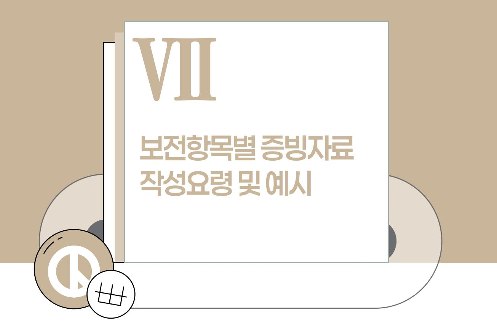

- **1.** 증빙자료 작성 원칙
- **2.** 증빙자료 작성시 유의사항

<!-- page: 88 -->

# **1 증빙자료 작성 원칙**

**가.** 정당 또는 후보자는 보전청구항목이 선거운동기간에 선거운동현장에서 실제로 사용 되었음을 증명해야 하므로, 보전청구서 제출시 작성·제출하는 사진 등 증빙자료에 사용 (설치·철거·교체)날짜, 일시 및 장소가 나타나도록 구비

※ 사진 및 동영상의 경우 날짜·장소 표시 기능이 있는 휴대전화 어플리케이션 등을 활용하여 선거 운동 현장에서 촬영

- **나.** 품목, 재질, 규격·용량, 수량·대수 등 보전대상 여부 판단 및 보전금액 산정에 필요한 구체 적인 내용이 포함되어야 하며, 보전청구 내역(보전청구서, 영수증·계약서·비용청구서 등 증빙 서류)과 일치해야 함에 유의
  - ※ 하나의 사진 등에 모든 내용을 포함하기 어려운 경우 여러 장으로 촬영(원거리 전체사진 및 세부 근접촬영 등)
- **다.** 자료형태는 사진·동영상, 파일, 신문 등 스크랩 외에 객관적 증빙이 가능한 다른 형태로도 제출 가능

# **2 증빙자료 작성시 유의사항**

**가.** 증빙자료는 '실제 선거운동에 사용여부'를 객관적으로 확인하기 위한 것이므로 보전청구 시 「공직선거관리규칙」 제51조의3(선거비용의 보전 등)에 따라 영수증·계약서·비용청구 서와 별도로 「공직선거관리규칙」 별표 1의2에 따른 증빙자료를 작성·제출

**공개장소 연설·대담차량 유류비 보전시 제출해야 하는 증빙자료(예시)**

<!-- page: 89 -->

(유류차·전기차) 카드전표 등 유류비(충전비) 영수증 (유류차·전기차) 최초 및 최종 차량운행일 당시의 주행거리가 현출된 계기판 사진 (전기차) 카드전표 등 충전비 영수증 외 충전요금 결제알림 문자, 충전일시 등이 표시된 충전기 화면 사진 등 충전일시·금액·충전량 등을 확인 할 수 있는 증빙자료 추가 제출

**나.** 증빙자료는 '실제 선거운동에 사용중인 물품'에 대하여 작성하는 것으로 선거종료 후에는 반환·철거 등의 사유로 증빙자료 작성이 불가능할 수 있으므로 선거운동기간 중 증빙 자료를 작성·구비

※ 사진 및 동영상은 선거운동기간 중에 실제 선거운동에 사용중인 모습을 촬영하여야 함.

- **다.** 다만, 예비후보자가 제작·설치하였으나 선거운동기간 개시일부터 선거일 전일까지 계속 사용한 선거운동물품(선거사무소 등 간판·현판·현수막, 명함 등)에 대해서는 보전대상여부 결정 및 보전금액 산정을 위해 예비후보자 및 후보자별 사용기간 등을 별도 구분하여 증빙자료를 작성·구비
- **라.** 증빙자료 서식은 예시이므로 필요에 따라 수정·작성 가능

<!-- page: 90 -->

# 보전항목별 증빙자료 작성요령 및 예시

#### 「공직선거관리규칙」 제51조3제1항 관련 [별표 1의2]

| 항목구분                                    |                            | 제출자료           |                                                                                                                    |    |  |
|-----------------------------------------|----------------------------|----------------|--------------------------------------------------------------------------------------------------------------------|----|--|
| 항목명                                     | 세부구분                       | 자료형태           | 포함내용                                                                                                               | 비고 |  |
| ①선거사무소 등 간판·현판·현수막 (법 제61조) 설거·교체 |                            | 사진             | <ul> <li>간판·현판·현수막 설치·철거·교체 장소, 규격, 재질, 내용</li> <li>스테인리스, 합판, 철골 등 보조구조물</li> <li>특수장비(크레인 등) 사용</li> </ul>   |    |  |
| ②거리게시용 현수막 (법 제67조)               | 설치·철거· 교체 및 이동게시     | 사진             | <ul> <li>현수막 설치·철거·교체 장소, 규격, 재질, 내용</li> <li>오·훼손에 따른 교체</li> <li>특수장비(크레인 등) 사용</li> <li>이동게시 내역 및 장소</li> </ul> |    |  |
|                                         | ③어깨띠 등 소품 (법 제68조)      |                | • 어깨띠·윗옷·모자·마스코트·표찰·수기, 그 밖의 소품의 종류, 수량, 규격, 재질                                                                 |    |  |
|                                         | ④신문광고 (법 제69조)          |                | • 게재 신문사, 내용 및 횟수                                                                                                  |    |  |
| ⑤방송광고 (법 제70조)                       |                            | 파일 (영상)     | • 방송광고 내용                                                                                                          |    |  |
|                                         | 연설· 대담차량                | 사진             | • 차종, 차량번호, 연단·조명·래핑 등 각종 홍보·설치물 • 발전기 종류, 용량 • 최초 및 최종 차량운행일 당시의 주행거리(계기판)                                  |    |  |
| ⑥공개장소 연설·대담 (법 제79조)              | 확성장치, 녹화기(LED 전광판) 등 | 사진             | •확성장치 종류, 수량, 규격, 용량 •녹화기(LED 전광판 등) 종류, 수량, 규격, 해상도                                                            |    |  |
|                                         | 로고송 및 녹화물               | 파일 (음원·영상)  | • 로고송 수량, 종류, 내용 • 녹화물 수량, 종류, 내용                                                                               |    |  |
| ⑦전화 (법 제59조)                         |                            | 사진             | • 선거운동용 임차전화 설치장소, 대수 • 전화홍보시스템(일반전화홍보시스템, 서버운영시스템 등) 운영장비                                                   |    |  |

<!-- page: 91 -->

| ⑧전자우편 및 문자메시지 (법 제82조의5)             |                            | 사진 또는 화면스크랩 | • 전자우편 및 문자메시지 발송일시, 횟수, 통수, 내용                                                                                    |    |  |
| ⑨인터넷 광고 (법 제82조의7)                   |                            | 파일 또는 화면스크랩 | •광고(동영상·팝업 등)의 종류 및 규격                                                                                             |    |  |
| ⑩명함 (법 제93조)                         |                            | 사진 또는 실물    | •명함의 종류 및 규격                                                                                                       |    |  |

1. 자료형태는 사진, 신문스크랩, 파일 외에 객관적으로 증빙 가능한 다른 형태의 자료도 제출할 수 있습니다.

2. 그 밖의 선거운동에 사용한 항목에 대하여 보전을 받고자 하는 때에는 선거운동에 사용한 것을 증명할 수 있는 사진 등 객관적 증빙자료를 제출하여야 합니다.

| Ⅶ |  |
|---|--|
|   |  |
|   |  |
|   |  |
| 보 |  |
|   |  |
| 전 |  |
|   |  |
| 항 |  |
|   |  |
| 목 |  |
|   |  |
| 별 |  |
|   |  |
| 증 |  |
|   |  |
| 빙 |  |
|   |  |
| 자 |  |
|   |  |
| 료 |  |
|   |  |
|   |  |
| 작 |  |
|   |  |
| 성 |  |
|   |  |
| 요 |  |
|   |  |
| 령 |  |
|   |  |
|   |  |
| 및 |  |
|   |  |
| 예 |  |
|   |  |
| 시 |  |
|   |  |

| 1 선거사무소 등 간판·현판·현수막 (법 제61조) |                                           |                                                                                                                                                                                                   |                                                                                       |         |              |  |
|---------------------------------|-------------------------------------------|---------------------------------------------------------------------------------------------------------------------------------------------------------------------------------------------------|---------------------------------------------------------------------------------------|---------|--------------|--|
|                                 |                                           |                                                                                                                                                                                                   |                                                                                       |         |              |  |
|                                 | 구 분                                    | □ 설치 □ 철거 □ 교체 □ 이동 □ 보수                                                                                                                                                                          |                                                                                       |         |              |  |
|                                 | 종 류                                    | □ 간판 □ 현판 □ 현수막 □ 기타( )                                                                                                                                                                        |                                                                                       |         |              |  |
|                                 | 설치 등 장소                                   |                                                                                                                                                                                                   | 경기도 과천시 홍촌말로 12 ※ 선거사무소(선거연락소 포함)의 주소 기재                                              |         |              |  |
|                                 | 거래업체 현황                                   |                                                                                                                                                                                                   |                                                                                       |         |              |  |
| 업 체 명                           |                                           | ○○○                                                                                                                                                                                               |                                                                                       | 사업자등록번호 | 138-08-***** |  |
| 대 표 자 명                         |                                           | ○○○                                                                                                                                                                                               |                                                                                       | 전화번호    | 02-***-****  |  |
|                                 | 사업장 소재지                                   | 경기도 과천시 홍촌말로 44                                                                                                                                                                                   |                                                                                       |         |              |  |

<!-- page: 92 -->

|                                 |                                           |                                                                                                                                                                                                   | 거래 내역                                                                                 |         |              |  |
| 규 격(㎡) (가로×세로)               |                                           | 60㎡(10m×6m) 30㎡(5m×6m)                                                                                                                                                                         |                                                                                       | 재 질     | 천            |  |
|                                 | 수 량(매)                                    | 2매                                                                                                                                                                                                |                                                                                       |         |              |  |
| 게시기간(일수)                        |                                           | ○○○○.○.○. ~ ○○○○.○.○.(○일)                                                                                                                                                                         |                                                                                       |         |              |  |
| 게재내용                            |                                           | □ □                                                                                                                                                                                            |                                                                                       |         |              |  |
|                                 | 제작비용(가)                                   | 1,350,000원                                                                                                                                                                                        |                                                                                       |         |              |  |
|                                 | 장비임차료(나)                                  | 485,000원                                                                                                                                                                                          | □ 해당없음 □ 크레인(5톤형, 작업시간 ○:○ ~ ○:○) □ 로프 (작업인원 : ○명, 작업시간 : ○:○ ~ ○:○) □ 기타( ) |         |              |  |
| 항목                              | 기타비용(다)                                   | 250,000원                                                                                                                                                                                          | □ 없음 □ 구조물(스테인리스, 철골, 기타) □ 사용료                                                       |         |              |  |
| 구분                              |                                           | 1. 구조물 설치비 : ○○○원 ※ 선거사무소 외벽에 현수막 등 설치공간이 없어 건물 옥상에 구조물 (스테인리스, 합판, 철골 등 보조구조물)을 설치하여 현수막 등을 게시한 경우 그 설치비 등 기재)                                                                             |                                                                                       |         |              |  |
|                                 |                                           | 2. 사용료 : ○○○원 ※ 선거사무소 건물 외벽면에 현수막 등 설치를 위해 지급된 정당한 사용료 등 기재                                                                                                                                    |                                                                                       |         |              |  |
|                                 | 보전청구액 2,085,000원 (부가가치세 포함) (가+나+다) |                                                                                                                                                                                                   |                                                                                       |         |              |  |
| 기타 소명사항                         |                                           | ※ 사진 등 자료가 멸실·훼손되어 자료제출이 불가능할 경우 선거운동에 실제 사용여부 등을 객관적으로 증빙할 수 있는 정당한 사유 등 기재                                                                                                                   |                                                                                       |         |              |  |
| 첨부자료                            |                                           | 1. 계약서·견적서, 영수증 등 사본 ○부 2. 사진 또는 동영상 등 ○부 ※ 날짜 표출 필수                                                                                                                                        |                                                                                       |         |              |  |
|                                 |                                           | [작성요령] ॰ 간판·현판·현수막을 종류별로 설치한 경우에는 각각 작성 ॰ 크레인 및 로프 이용시 장비 규격(고소작업차 톤수 등) 및 작업인원 및 작업시간 (시작 과 종료 시각 등)이 구체적으로 나오도록 작성 ॰ 선거사무소 외벽에 현수막게시용 구조물을 설치하였을 경우 구조물의 구체적인 규격·형태가 확인 가능하도록 작성 |                                                                                       |         |              |  |

# **1 선거사무소 등 간판·현판·현수막** (법 제61조)

91

### 별첨 \_ 선거사무소 등 간판·현판·현수막 \_ 증빙자료

| 자료형태 : 사진            |                   |
|----------------------|-------------------|

<!-- page: 93 -->

|                      | 일련번호              |
|                      | 1                 |
|                      | 구 분               |
|                      | 선거사무소 외벽현수막    |
| ※ 날짜 및 시간이 표출된 사진 첨부 | 설치·철거·교체 일 자   |
|                      | ○○○○. ○. ○.       |
|                      | 설치·철거·교체 장 소   |
|                      | 선거사무소 또는 선거연락소 |
|                      | 규 격               |
|                      | 60㎡ (10m × 6m) |
|                      | 일련번호              |
|                      | 2                 |
|                      | 구 분               |
|                      | 선거사무소 외벽현수막    |

※ 날짜 및 시간이 표출된 사진 첨부 외벽현수막 설치·철거·교체 일 자 ○○○○. ○. ○. 설치·철거·교체 장 소 선거사무소 또는 선거연락소 규 격 30㎡ (5m × 6m)

※ 사진이 여러 장일 경우 아래에 서식을 추가하여 사용

93

#### ※ 동영상은 별도 파일로 제출

<!-- page: 94 -->

#### **자료형태 : 동영상**

| ※ 날짜 및 시간이 표출된 사진 첨부 | ○○○○. ○. ○.       |
|----------------------|-------------------|
|                      | 작업장소              |
|                      | 선거사무소 또는 선거연락소 |
|                      | 작업시간              |
|                      | 09:00~12:00       |
|                      | 일련번호              |
|                      | 4                 |
|                      | 구 분               |
|                      | 크레인 사용            |
|                      | 작업일자              |
| ※ 날짜 및 시간이 표출된 사진 첨부 | ○○○○. ○. ○.       |
|                      | 작업장소              |
|                      | 선거사무소 또는 선거연락소 |
|                      | 작업시간              |
|                      | 09:00~12:00       |
|                      |                   |

| 자료형태 : 사진            |                             |
|----------------------|-----------------------------|
|                      | 일련번호                        |
|                      | 3                           |
|                      | 구 분                         |
|                      | 크레인 사용                      |
|                      | 작업일자 ○○○○. ○. ○. 작업장소 |
| ※ 날짜 및 시간이 표출된 사진 첨부 |                             |
|                      |                             |
|                      | 선거사무소 또는 선거연락소           |
|                      | 작업시간                        |
|                      | 09:00~12:00                 |

<!-- page: 95 -->

# **2 거리게시용 현수막** (법 제67조)

|                                                            | 구 분                                                                                     | □ 설치 □ 철거 □ 교체 □ 이동 □ 보수                                                                                                                               |                                           |              |  |  |
|------------------------------------------------------------|--------------------------------------------------------------------------------------------|--------------------------------------------------------------------------------------------------------------------------------------------------------------------|-------------------------------------------|--------------|--|--|
|                                                            | 설치장소                                                                                       | 증빙자료 설명 참조                                                                                                                                                         |                                           |              |  |  |
| 거래업체 현황                                                    |                                                                                            |                                                                                                                                                                    |                                           |              |  |  |
|                                                            | 업 체 명                                                                                      | ○○○                                                                                                                                                                | 사업자등록번호                                   | 138-08-***** |  |  |
| 대표자명                                                       |                                                                                            | ○○○                                                                                                                                                                | 전화번호                                      | 02-***-****  |  |  |
|                                                            | 사업장 소재지                                                                                    | 경기도 과천시 홍촌말로 44                                                                                                                                                    |                                           |              |  |  |
| 거래 내역                                                      |                                                                                            |                                                                                                                                                                    |                                           |              |  |  |
| 규 격(㎡) (가로×세로)                                          |                                                                                            | 8㎡ (10m × 0.8m)                                                                                                                                                 | 재 질                                       | 천            |  |  |
| 수 량(매)                                                     |                                                                                            | 21매                                                                                                                                                                | 제작단가(매당)                                  | 96,000원      |  |  |
|                                                            | 증빙자료로 갈음 게재내용                                                                           |                                                                                                                                                                    |                                           |              |  |  |
|                                                            | 제작비용(가)                                                                                    | 2,016,000원                                                                                                                                                         |                                           |              |  |  |
| 항목 구분                                                   | 장비임차료(나)                                                                                   |                                                                                                                                                                    | □ 해당없음 □ 크레인 □ 로프( 명) □ 기타( ) |              |  |  |
|                                                            | 이동게시비(다)                                                                                   | 170,000원 □ 있음(횟수 : 2회) □없음                                                                                                                                   |                                           |              |  |  |

<!-- page: 96 -->

|                                                            | 보전청구액 2,186,000원 (부가가치세 포함) (가+나+다)                                                  |                                                                                                                                                                    |                                           |              |  |  |
|                                                            | ※ 사진 등 자료가 멸실·훼손되어 자료제출이 불가능할 경우 선거운동의 실제 사용여부 기타 소명사항 등을 객관적으로 증빙할 수 있는 정당한 사유 등 기재 |                                                                                                                                                                    |                                           |              |  |  |
| 1. 계약서·견적서, 영수증 등 사본 ○부 2. 사진 또는 동영상 등 ○부 ※ 날짜 표출 필수 |                                                                                            |                                                                                                                                                                    |                                           |              |  |  |
| 첨부자료                                                       |                                                                                            | [작성요령] ॰ 설치·교체·이동(내용 변경없이 장소만 변경된 경우를 말함)순으로 증빙자료 작성 ॰ 이동게시의 경우 1일, 1인 기준으로 보전하므로 날짜 및 작업 인원이 구체적으로 나오도록 작성 ॰ 크레인, 로프 이용시에 장비·규격 및 작업인원이 구체적으로 나오도록 작성 |                                           |              |  |  |

### 별첨 \_ 거리게시용 현수막 \_ 증빙자료

**자료형태 : 사진**

**□ 현수막 설치**

| 일련번호                 | 1 | 설치장소 | ○○ 1동○○역 사거리         | 설치일자 | ○○○○. ○. ○. |  |
|----------------------|---|------|----------------------|------|-------------|--|
| ※ 날짜 및 시간이 표출된 사진 첨부 |   |      |                      |      |             |  |
| 일련번호                 | 2 | 설치장소 | ○○ 1동○○역 사거리         | 설치일자 | ○○○○. ○. ○. |  |
|                      |   |      | ※ 날짜 및 시간이 표출된 사진 첨부 |      |             |  |

<!-- page: 97 -->

| 일련번호                 | 3 | 설치장소 | ○○ 1동○○역 사거리         | 설치일자 | ○○○○. ○. ○. |  |
| ※ 날짜 및 시간이 표출된 사진 첨부 |   |      |                      |      |             |  |

#### **□ 현수막 설치**

| 교체 현수막 번호            | 1     | 설치장소 |  | ○○ 1○○역 사거리 | 교체일자 | ○○○○. ○. ○.          |  |  |  |
|----------------------|-------|------|--|-------------|------|----------------------|--|--|--|
|                      | 교 체 전 |      |  |             |      | 교 체 후                |  |  |  |
| ※ 날짜 및 시간이 표출된 사진 첨부 |       |      |  |             |      | ※ 날짜 및 시간이 표출된 사진 첨부 |  |  |  |

#### **□ 현수막 이동**

| 이동 현수막 번호            | 1 | 설치장소        | ○○ 1○○역 사거리 |      | 작업인원         | 1인                   |  |
|----------------------|---|-------------|-------------|------|--------------|----------------------|--|
| 이동 전                 |   | ○○ 1동 ○○은행앞 |             | 이동 후 | ○○ 1동 ○○은행 앞 |                      |  |
| ※ 날짜 및 시간이 표출된 사진 첨부 |   |             |             |      |              | ※ 날짜 및 시간이 표출된 사진 첨부 |  |

| 3 | 어깨띠 등 소품 (법 제68조) |
|---|-------------------|
|   |                   |

| 거래업체 현황   |       |                                                                                                                                                                                                                  |            |         |        |              |            |
|-----------|-------|------------------------------------------------------------------------------------------------------------------------------------------------------------------------------------------------------------------|------------|---------|--------|--------------|------------|
| 업 체 명     |       | ○○○                                                                                                                                                                                                              |            | 사업자등록번호 |        | 138-08-***** |            |
| 대표자명      |       | ○○○                                                                                                                                                                                                              |            | 전화번호    |        | 02-***-****  |            |
| 사업장 소재지   |       | 경기도 과천시 홍촌말로 44                                                                                                                                                                                                  |            |         |        |              |            |
|           | 거래 내역 |                                                                                                                                                                                                                  |            |         |        |              |            |
| 구 분       |       | 수량                                                                                                                                                                                                               | 규격         | 재질      | 단가     |              | 금 액        |
|           | 어깨띠   | 50                                                                                                                                                                                                               | 240cm*20cm | 부직포     |        | 7,000원       | 350,000원   |
|           | 구입비   | 50                                                                                                                                                                                                               |            |         |        | 60,000원      | 3,000,000원 |
| 윗 옷       | 기호인쇄비 | 50                                                                                                                                                                                                               |            |         |        | 3,000원       | 150,000원   |
|           | 구입비   | 50                                                                                                                                                                                                               | 일반형        |         |        | 6,000원       | 300,000원   |
| 모 자       | 기호인쇄비 | 50                                                                                                                                                                                                               |            |         | 1,000원 |              | 50,000원    |
|           | 구입비   | 50                                                                                                                                                                                                               | 방역마스크      |         | 600원   |              | 30,000원    |
| 마스크       | 기호인쇄비 | 50                                                                                                                                                                                                               |            |         | 400원   |              | 20,000원    |
|           | 구입비   | 50                                                                                                                                                                                                               | 면장갑        |         | 1,200원 |              | 60,000원    |
| 장 갑       | 기호인쇄비 | 50                                                                                                                                                                                                               |            |         | 700원   |              | 35,000원    |
|           | 피켓    | 10                                                                                                                                                                                                               | 100cm*50cm | 폼보드     |        | 40,000원      | 400,000원   |
| 기 타( ) |       |                                                                                                                                                                                                                  |            |         |        |              |            |
| 보전청구액     |       | 4,395,000원 (부가가치세 포함)                                                                                                                                                                                            |            |         |        |              |            |
| 기타 특이사항   |       | □ 있음(내용 : 전자발광소재) 어깨띠 특수재질·특수인쇄 □ 없음                                                                                                                                                                       |            |         |        |              |            |
| 첨부자료      |       | 1. 계약서·견적서, 영수증 등 사본 ○부 2. 사진 또는 동영상 등 ○부 ※ 날짜 표출 필수                                                                                                                                                       |            |         |        |              |            |
|           |       | [작성요령] ॰ 실제 사용여부, 규격, 재질 등 확인이 가능하도록 「공직선거법」 제68조제1항에 규정된 자가 착용(사용)하고 있는 사진 제출 ॰ 어깨띠에 특수재질·특수인쇄 등을 사용한 경우 재질 등 구분이 가능하도록 근접 촬영(또는 실물 제출) ※ 야간에 잘 보이도록 발광소재를 사용한 경우 발광 기능이 육안으로 확인 가능하도록 야간에 촬영 |            |         |        |              |            |

### 별첨 \_ 어깨띠 등 소품 \_ 증빙자료

| 자료형태 : 사진            |             |
|----------------------|-------------|
|                      | 일련번호        |
|                      | 1           |
|                      | 종 류         |
| ※ 날짜 및 시간이 표출된 사진 첨부 | 어깨띠(앞면)     |
|                      | 사용일자        |
|                      | ○○○○. ○. ○. |

<!-- page: 98 -->

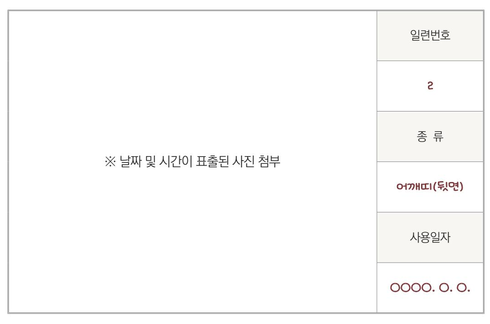

<!-- page: 99 -->

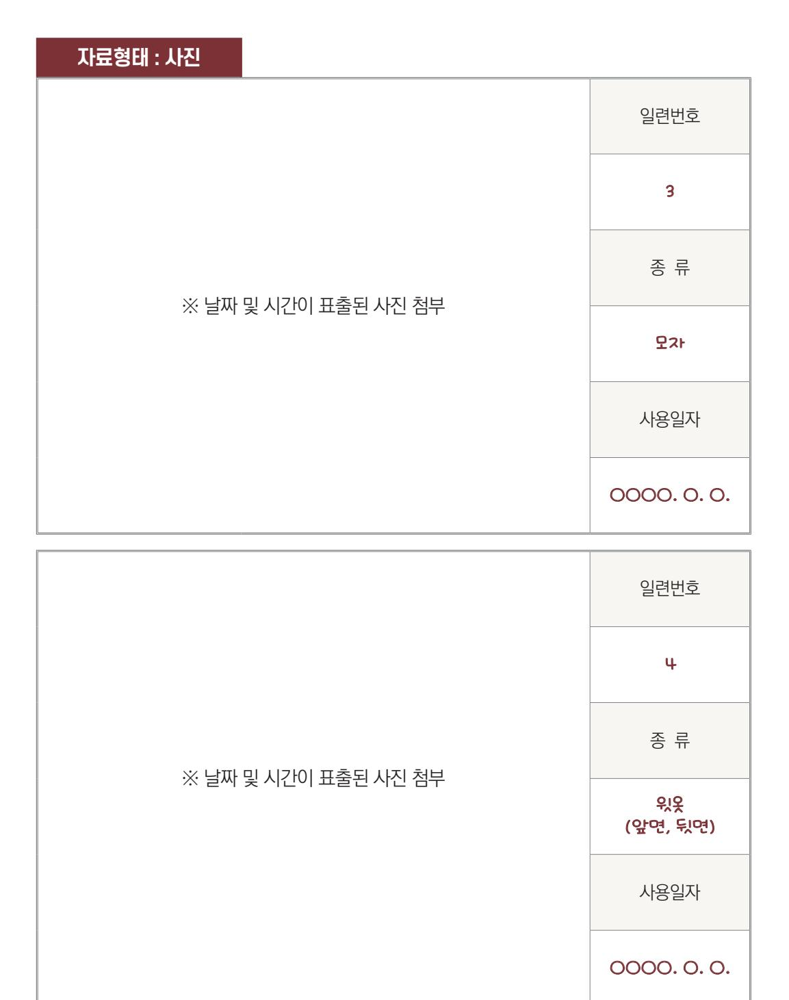

<!-- page: 100 -->

#### 100

#### ※ 동영상은 별도 파일로 제출

#### **자료형태 : 동영상**

|                      | ○○○○. ○. ○.      |
|----------------------|------------------|
| ※ 날짜 및 시간이 표출된 사진 첨부 | 일련번호             |
|                      | 6                |
|                      | 종 류              |
|                      | 그 밖의 소품 (마스크) |
|                      | 사용일자             |
|                      | ○○○○. ○. ○.      |

<!-- page: 101 -->

| 자료형태 : 사진            |             |
|----------------------|-------------|
| ※ 날짜 및 시간이 표출된 사진 첨부 | 일련번호        |
|                      | 5           |
|                      | 종 류         |
|                      | 피켓          |
|                      | 사용일자        |
|                      | ○○○○. ○. ○. |

# **4 신문광고** (법 제69조)

| 거래업체 현황 및 거래 내역 |               |                                                                                                         |                                                             |  |                            |              |
|-----------------|---------------|---------------------------------------------------------------------------------------------------------|-------------------------------------------------------------|--|----------------------------|--------------|
| 기획·도안           | 업 체 명         |                                                                                                         | ○○○○                                                        |  | 사업자등록번호                    | 138-08-***** |
|                 | 대표자명          |                                                                                                         | ○○○                                                         |  | 전화번호                       | 02-***-****  |
|                 | 사업장 소재지       |                                                                                                         | 경기도 과천시 홍촌말로 44                                             |  |                            |              |
|                 | 규 격           |                                                                                                         | 전면, 12컬럼 5단, 7컬럼 9단 ※ 컬럼(세로)은 약 3㎝, 단(높이)은 약 3.4㎝를 의미    |  |                            |              |
|                 | 기획·도안료 (가) |                                                                                                         | 1,000,000원                                                  |  |                            |              |
| 광고              | 신문사명          |                                                                                                         | ○○일보                                                        |  | ○○일보                       |              |
|                 | 광고횟수          |                                                                                                         | 2회                                                          |  | 3회                         |              |
|                 | 전화번호          |                                                                                                         | 02-***-****                                                 |  | 02-***-****                |              |
|                 | 광고일자          |                                                                                                         | ○○○○. ○. ○. ○○○○. ○. ○.                                  |  | ○○○○. ○. ○. ○○○○. ○. ○. |              |
|                 | 광고료           | 지급액                                                                                                     | 2,500,000원                                                  |  | 3,000,000원                 |              |
|                 |               | 합계 (나)                                                                                               | 5,500,000원                                                  |  |                            |              |
| 보전청구액 (가+나)  |               |                                                                                                         | 6,500,000원 (부가가치세 포함)                                       |  |                            |              |
|                 |               |                                                                                                         | 1. 계약서·견적서, 영수증 등 사본 ○부 2. 사진, 신문 스크랩 등 ○부 ※ 날짜 표출 필수 |  |                            |              |
| 첨부자료            |               | [작성요령] ॰ 신문광고 기획·도안료의 경우 규격(전면, 12컬럼 5단, 7컬럼 9단 등)에 따라 보전금액이 상이하므로 규격 확인이 가능하도록 작성 ॰ 광고내용별로 작성 |                                                             |  |                            |              |

### 별첨 \_ 신문광고 \_ 증빙자료

<!-- page: 102 -->

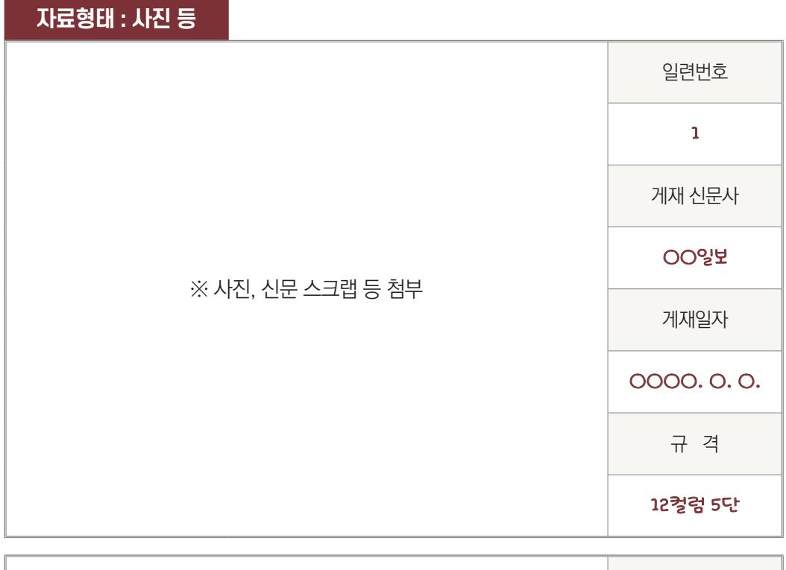

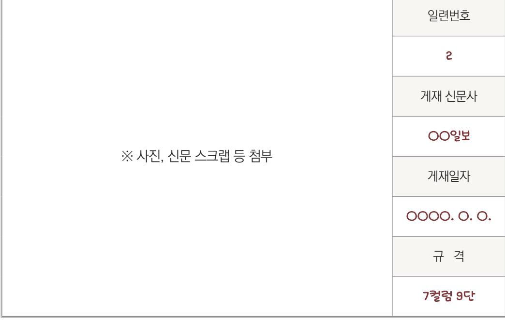

| 5                | 방송광고 (법 제70조)   |                                                                                         |                            |                                           |              |  |  |  |
|------------------|-----------------|-----------------------------------------------------------------------------------------|----------------------------|-------------------------------------------|--------------|--|--|--|
|                  |                 |                                                                                         |                            |                                           |              |  |  |  |
|                  | 구 분             |                                                                                         | □ TV □ 라디오 규격(광고시간)     |                                           | 1분           |  |  |  |
|                  | 거래업체 현황 및 거래 내역 |                                                                                         |                            |                                           |              |  |  |  |
| 기획               | 업 체 명           |                                                                                         | ○○○○                       | 사업자등록번호                                   | 138-08-***** |  |  |  |
|                  |                 | 대표자명                                                                                    | ○○○ 전화번호                |                                           | 02-***-****  |  |  |  |

<!-- page: 103 -->

|                  |                 | 사업장 소재지                                                                                 | 경기도 과천시 홍촌말로 44            |                                           |              |  |  |  |
|                  |                 | 기획료(가)                                                                                  | 3,500,000원                 |                                           |              |  |  |  |
|                  | 업 체 명           |                                                                                         | ○○○○                       | 사업자등록번호                                   | 138-08-***** |  |  |  |
|                  |                 | 대표자명                                                                                    | ○○○                        | 02-***-**** 전화번호                       |              |  |  |  |
| 제작               |                 | 사업장 소재지                                                                                 | 경기도 과천시 홍촌말로 44            |                                           |              |  |  |  |
|                  |                 | 제작비용(나)                                                                                 | 5,500,000원                 |                                           |              |  |  |  |
|                  |                 | 방송사명                                                                                    | ○○방송                       | ○○방송                                      |              |  |  |  |
| 방송               |                 | 방송횟수                                                                                    | 2회                         | 3회                                        |              |  |  |  |
|                  | 방송일자            |                                                                                         | ○○○○. ○. ○. ○○○○. ○. ○. | ○○○○. ○. ○. ○○○○. ○. ○. ○○○○. ○. ○. |              |  |  |  |
|                  |                 | 전화번호                                                                                    | 02-***-****                | 02-***-****                               |              |  |  |  |
|                  |                 | 지급액                                                                                     | 2,500,000원                 | 3,000,000원                                |              |  |  |  |
|                  | 광고료             | 합계(다)                                                                                   | 5,500,000원                 |                                           |              |  |  |  |
| 보전청구액 (가+나+다) |                 |                                                                                         | 11,500,000원 (부가가치세 포함)     |                                           |              |  |  |  |
| 첨부자료             |                 | 1. 계약서·견적서, 영수증 등 사본 ○부 2. 동영상 또는 음원 파일 등 ○부                                         |                            |                                           |              |  |  |  |
|                  |                 | [작성요령] ॰ TV 방송광고와 라디오 방송광고를 구분하여 기재하고, 광고내용을 확인할 수 있는 동영상 또는 음원 파일을 이메일 등으로 별도 제출 |                            |                                           |              |  |  |  |

### 별첨 \_ 방송광고 \_ 증빙자료

| 자료형태 : 동영상 또는 음원 |                                 |
|------------------|---------------------------------|
| ※ 동영상은 별도 파일로 제출 | 구 분                          |
|                  | TV 방송광고                         |
|                  | 일련번호                            |
|                  | 1                               |
|                  | 방송사명                            |
|                  | ○○○                             |
|                  | 방송일자 (방송시간)                  |
|                  | ○○○○. ○. ○. (○ : ○ ~ ○ : ○ ) |
|                  |                                 |

<!-- page: 104 -->

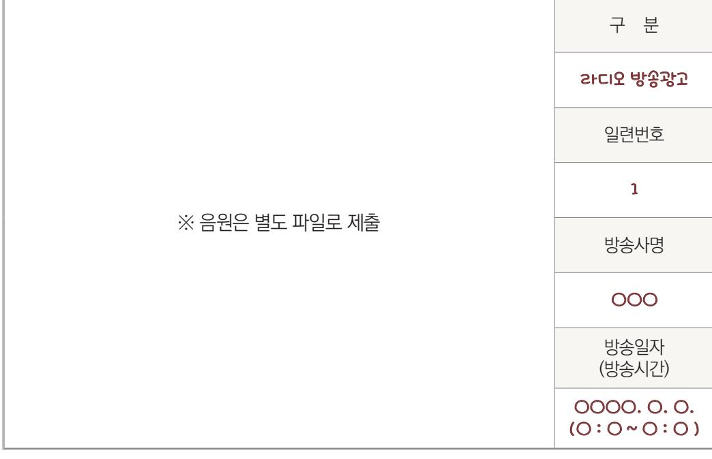

# **6-1 공개장소 연설·대담차량** (법 제79조)

| 거래업체 현황                                   |                |                                                                                                                                                                                                                                                                                                                                    |                           |         |                       |            |               |  |
|-------------------------------------------|----------------|------------------------------------------------------------------------------------------------------------------------------------------------------------------------------------------------------------------------------------------------------------------------------------------------------------------------------------|---------------------------|---------|-----------------------|------------|---------------|--|
|                                           | 업 체 명          | ○○○○                                                                                                                                                                                                                                                                                                                               |                           |         |                       | 사업자등록번호    | 138-08-*****  |  |
|                                           | 대표자명           | ○○○                                                                                                                                                                                                                                                                                                                                |                           |         |                       | 전화번호       | 02-***-****   |  |
|                                           | 사업장 소재지        |                                                                                                                                                                                                                                                                                                                                    | 경기도 과천시 홍촌말로 44           |         |                       |            |               |  |

<!-- page: 105 -->

|                                           | 거래 내역          |                                                                                                                                                                                                                                                                                                                                    |                           |         |                       |            |               |  |
| ○○○○.○.○. ~ ○○○○.○.○.(○일) 사용기간(일수)     |                |                                                                                                                                                                                                                                                                                                                                    |                           |         |                       |            |               |  |
|                                           | 차 종         |                                                                                                                                                                                                                                                                                                                                    |                           | 기아 봉고 Ⅲ |                       | 차량번호       | ○○사 ○○○○      |  |
|                                           | 기사인부임          |                                                                                                                                                                                                                                                                                                                                    | □ 일괄계약 □ 별도지급             |         |                       | 유류비(충전비)   | □ 일괄계약 □ 별도지급 |  |
|                                           |                |                                                                                                                                                                                                                                                                                                                                    |                           | 차량규격    |                       | 수량(대수)     | 지급액(가)        |  |
|                                           | 연설대담 차 량 | □ 유류차 □ 전기차                                                                                                                                                                                                                                                                                                                     |                           |         | 1톤형                   | 1대         |               |  |
|                                           | 임 차 비          |                                                                                                                                                                                                                                                                                                                                    |                           |         | 총 주행거리(최종-최초) : 650km |            | 2,832,000원    |  |
| 항목                                        |                | 최초                                                                                                                                                                                                                                                                                                                                 | 33,041km                  |         | 최종                    | 33,691km   |               |  |
| 구분                                        | 유류비            | 유종                                                                                                                                                                                                                                                                                                                                 |                           |         |                       | 1일 평균 운행거리 | 지급액(나)        |  |
|                                           | (충전비)          | □ 경유 □ 휘발유 □ 전기                                                                                                                                                                                                                                                                                                                    |                           |         |                       | 30km       | 200,000원      |  |
|                                           |                | 지급기간(일수)                                                                                                                                                                                                                                                                                                                           |                           |         |                       | 지급액        | 합 계(다)        |  |
|                                           | 기사 인부임      | ○○.○○.○○. ~ ○○.○○.○○.(○일)                                                                                                                                                                                                                                                                                                          |                           |         |                       | 678,000원   | 1,469,000원    |  |
|                                           |                |                                                                                                                                                                                                                                                                                                                                    | ○○.○○.○○. ~ ○○.○○.○○.(○일) |         |                       | 791,000원   |               |  |
| 보전청구액 4,501,000원 (부가가치세 포함) (가+나+다) |                |                                                                                                                                                                                                                                                                                                                                    |                           |         |                       |            |               |  |
|                                           | 첨부자료           | 1. 계약서·견적서, 영수증 등 사본 ○부 2. 사진 또는 동영상 등 ○부 3. 차량등록증 ※ 날짜 표출 필수 [작성요령] ॰ 차량 전경(앞, 뒤, 옆모습)이 구체적으로 보이도록 촬영 ॰ 차량 계기판의 주행거리 촬영(최초 및 최종 선거운동 사용일에 각각 1장씩 촬영) ※ 유류비(충전비) 보전을 위한 것이므로 주행거리가 명확하게 나타나도록 촬영 ॰ 전기차의 경우 카드전표 등 충전비 영수증 외 충전요금 결제알림 문자, 충전일시 등이 표시된 충전기 화면 사진 등 충전일시·금액·충전량 등을 확인할 수 있는 증빙자료 추가 제출 |                           |         |                       |            |               |  |

# **6-2 공개장소 연설·대담** (확성장치, 발전기, 녹화기 등)

| 거래업체 현황 |                |                                                                                                                                                                                    |                             |     |                     |               |                                   |             |              |            |
|---------|----------------|------------------------------------------------------------------------------------------------------------------------------------------------------------------------------------|-----------------------------|-----|---------------------|---------------|-----------------------------------|-------------|--------------|------------|
| 업 체 명   |                | ○○○○                                                                                                                                                                               |                             |     |                     | 사업자등록번호       |                                   |             | 138-08-***** |            |
| 대표자명    |                | ○○○                                                                                                                                                                                |                             |     |                     | 전화번호          |                                   | 02-***-**** |              |            |
|         | 사업장 소재지        |                                                                                                                                                                                    | 경기도 과천시 홍촌말로 44             |     |                     |               |                                   |             |              |            |
| 거래 내역   |                |                                                                                                                                                                                    |                             |     |                     |               |                                   |             |              |            |
| 설치구분    |                |                                                                                                                                                                                    | □ 확성장치 □ 발전기 □ 인버터 □ 녹화기 |     |                     |               |                                   |             |              |            |

<!-- page: 106 -->

|         | 계약기간           |                                                                                                                                                                                    | ○○○○.○.○. ~ ○○○○.○.○.(○일)   |     |                     |               |                                   |             |              |            |
|         |                |                                                                                                                                                                                    | 종류(기종)                      | 규 격 |                     |               |                                   |             |              |            |
|         |                | 스피커                                                                                                                                                                                |                             |     | 정격출력                | 음압수준          | 수 량                               | 임차기간        |              | 임 차 료(가)   |
| 확성      | 차량용            |                                                                                                                                                                                    |                             |     | 3kW                 | 127dB         | 1                                 |             |              |            |
| 장치      |                | 앰 프                                                                                                                                                                                | 종류(기종)                      |     |                     | 규 격 (정격출력) |                                   | 13          |              | 3,000,000원 |
|         |                |                                                                                                                                                                                    |                             |     |                     | 3kW           | 1                                 |             |              |            |
|         |                | 휴대용                                                                                                                                                                                |                             |     |                     | 30W           | 1                                 | 13          |              | 300,000원   |
|         | 발전기            |                                                                                                                                                                                    | HONDA EU30is (휘발유)       |     |                     | 3kW           | 1                                 | 13          |              | 1,000,000원 |
|         | 인버터            |                                                                                                                                                                                    |                             |     |                     |               |                                   |             |              |            |
|         |                |                                                                                                                                                                                    | 종 류                      |     |                     | LED전광판        | 수 량                            |             |              | 1개         |
|         | 녹화기            |                                                                                                                                                                                    | 규 격                      |     | 3㎡ (200cm×150cm) |               | 해 상 도 (LED Pitch : 전구사이 간격) |             |              | 10㎜        |
|         |                |                                                                                                                                                                                    |                             |     |                     | 임 차 료(나)      |                                   |             | 4,000,000원   |            |
|         | 보전청구액 (가+나) |                                                                                                                                                                                    | 8,300,000원 (부가가치세 포함)       |     |                     |               |                                   |             |              |            |
| 첨부자료    |                | 1. 계약서·견적서, 영수증 등 사본 ○부 2. 사진 또는 동영상 등 ○부 ※ 날짜 표출 필수                                                                                                                         |                             |     |                     |               |                                   |             |              |            |
|         |                | [작성요령] ॰ 선거운동 현장에서 선거운동기간중 실제 사용하는 장면을 촬영 ॰ 확성장치, 녹화기 종류(일반형 또는 리프트)·규격 등이 모두 나오도록 촬영 ॰ 확성장치는 차량용과 휴대용으로 구분하되, 기종·규격(kW)이 식별되도록 촬영 ※ 허용 소음수준을 초과한 확성장치를 사용할 경우 미보전(위법) |                             |     |                     |               |                                   |             |              |            |

# **6-3 공개장소 연설·대담** (무대연단, 홍보물설치비 등)

| 거래업체 현황              |                                                                                    |               |         |          |                                |  |  |
|----------------------|------------------------------------------------------------------------------------|---------------|---------|----------|--------------------------------|--|--|
| 업 체 명                | ○○○○                                                                               |               | 사업자등록번호 |          | 138-08-*****                   |  |  |
| 대표자명                 | ○○○                                                                                |               | 전화번호    |          | 02-***-****                    |  |  |
| 사업장 소재지              | 경기도 과천시 홍촌말로 44                                                                    |               |         |          |                                |  |  |
|                      | 거래 내역                                                                              |               |         |          |                                |  |  |
| 설치구분                 | □ 무대연단 □ 홍보물 설치비 □ 문자 LED 전광판 □ 차량래핑비 □ 기타                                         |               |         |          |                                |  |  |
| 계약기간                 | ○○○○.○.○. ~ ○○○○.○.○.(○일)                                                          |               |         |          |                                |  |  |
| 무대연단                 | 형 태                                                                             | □ 일반형 □ 리프트형  |         | 차량종류     | □ 1톤형 □ 2.5톤형 □ 3.5톤형 □ 5톤형 |  |  |
|                      | 규 격                                                                             | 4m×2m×2.4m    |         | 제작비(가)   | 4,500,000원                     |  |  |

<!-- page: 107 -->

| 홍보물 제작·설치            | 형 태                                                                             | 천, 플렉스, 포맥스   |         | 제작·설치 비용 | 1,000,000원                     |  |  |
|                      | 규 격                                                                             | 8㎡(4m×2m)     |         | (나)      |                                |  |  |
| 문자LED전광판             | 규 격                                                                             | 2㎡ (2m×1m) |         | 설치 비용(다) | 1,000,000원                     |  |  |
|                      | 면 적                                                                             | 15㎡           |         |          | 1,000,000원                     |  |  |
| 차량래핑                 | 재 질                                                                             |               |         | 래핑 비용(라) |                                |  |  |
| 기타비용(마)              |                                                                                    |               |         |          |                                |  |  |
| 보전청구액 (가+나+다+라+마) | 7,500,000원 (부가가치세 포함)                                                              |               |         |          |                                |  |  |
|                      | 1. 계약서·견적서, 영수증 등 사본 ○부 2. 사진 또는 동영상 등 ○부 ※ 날짜 표출 필수                         |               |         |          |                                |  |  |
| 첨부자료                 | [작성요령] ॰ 선거운동 현장에서 선거운동기간중 실제 사용하는 장면을 촬영 ॰ 차량연단 정면 및 홍보물, 전광판 등이 모두 나오도록 촬영 |               |         |          |                                |  |  |

## 별첨 \_ 공개장소 연설·대담 차량 \_ 증빙자료

| 차량   | 차종(규격)   | 봉고Ⅲ(1톤)       |               |  |  |  |
|------|----------|---------------|---------------|--|--|--|
|      | 차량번호     | ○○사 ○○○○      |               |  |  |  |
| 운전기사 | 성명       | 홍길동           | 1970. 10. 30. |  |  |  |
|      | 연락처(핸드폰) | 010-****-**** |               |  |  |  |

<!-- page: 108 -->

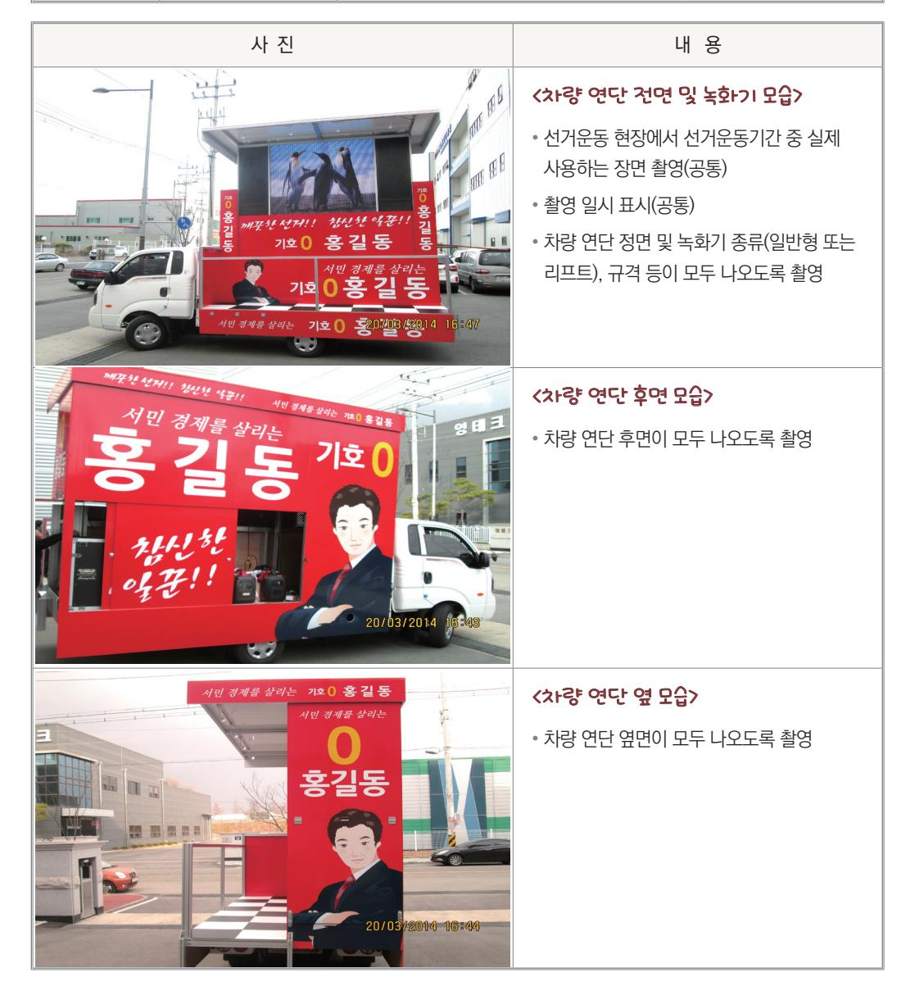

<!-- page: 109 -->

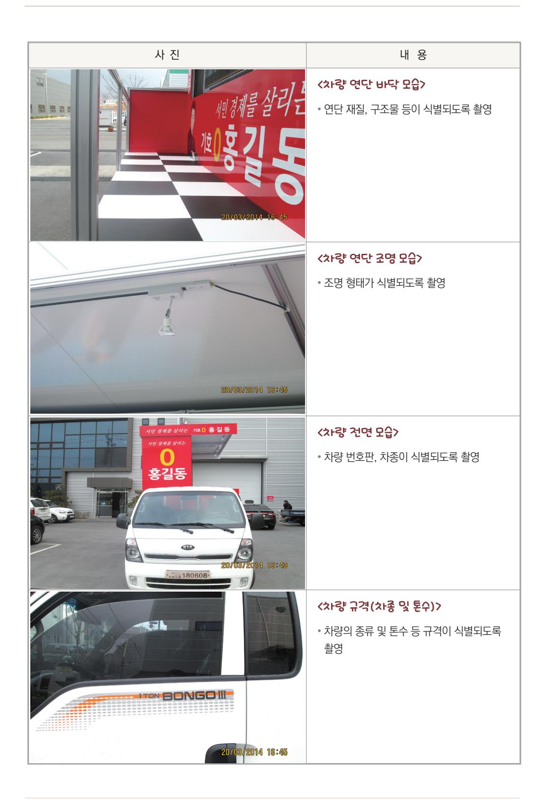

<!-- page: 110 -->

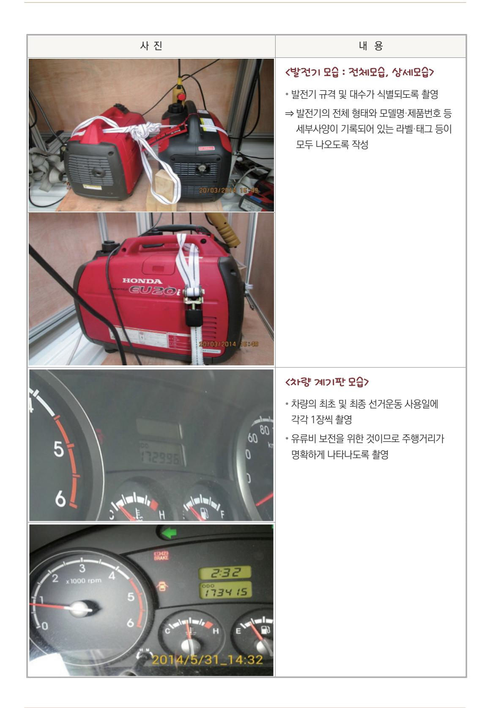

<!-- page: 111 -->

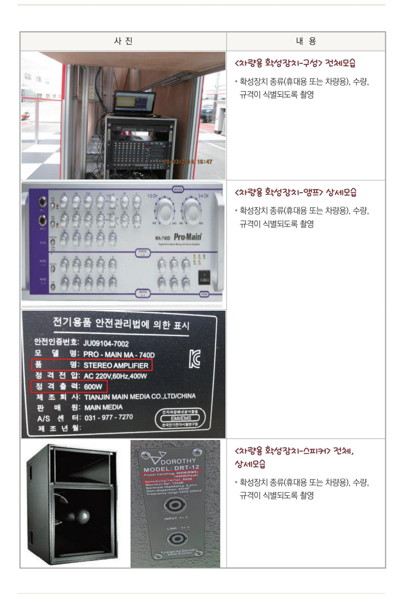

<!-- page: 112 -->

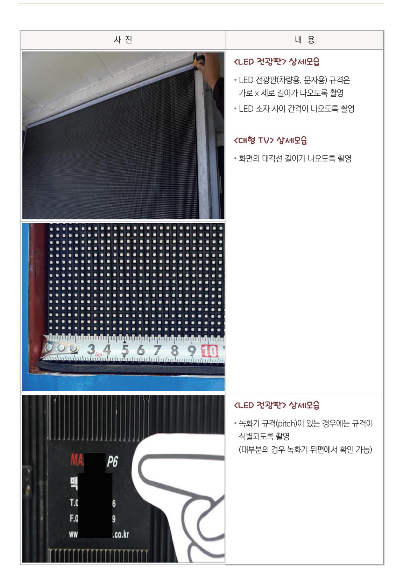

| 거래업체 현황        |                                                                                                                                       |                           |                          |            |              |  |  |
|----------------|---------------------------------------------------------------------------------------------------------------------------------------|---------------------------|--------------------------|------------|--------------|--|--|
| 업 체 명          | ○○○○                                                                                                                                  |                           | 사업자등록번호                  |            | 138-08-***** |  |  |
| 대표자명           | ○○○                                                                                                                                   |                           | 전화번호                     |            | 02-***-****  |  |  |

<!-- page: 113 -->

| 사업장 소재지        |                                                                                                                                       | 경기도 과천시 홍촌말로 44           |                          |            |              |  |  |
|                | 거래 내역                                                                                                                                 |                           |                          |            |              |  |  |
| 항목구분           | □ 로고송 □ 녹화물                                                                                                                           |                           |                          |            |              |  |  |
| 사용기간(일수)       |                                                                                                                                       | ○○○○.○.○. ~ ○○○○.○.○.(○일) |                          |            |              |  |  |
|                | 곡 명                                                                                                                                   | 저작재산권료                    | 저작인격권료                   | 제작비용       | 총 합계         |  |  |
|                | 반짝반짝                                                                                                                                  | 2,000,000원                | 1,000,000원               | 1,000,000원 | 4,000,000원   |  |  |
|                | 무 조 건                                                                                                                                 | 2,000,000원                | 1,000,000원               | 1,000,000원 | 4,000,000원   |  |  |
| 로고송(가)         |                                                                                                                                       |                           |                          |            |              |  |  |
|                |                                                                                                                                       |                           |                          |            |              |  |  |
|                | 소 계                                                                                                                                   | 2곡                        |                          | 8,000,000원 |              |  |  |
| 녹화물(나)         | 총 편수                                                                                                                                  | 2편                        | 상영시간 3분품, 5분품 (편당) |            |              |  |  |
|                |                                                                                                                                       | 녹화물 제작비                   | 10,000,000원              |            |              |  |  |
| 보전청구액 (가+나) | 18,000,000원 (부가가치세 포함)                                                                                                                |                           |                          |            |              |  |  |
|                | 1. 계약서·견적서, 영수증 등 사본 ○부 2. 음원 또는 동영상 파일 ○부 3. 한국음악저작권협회 등 관련 단체가 발행한 사용승인서 ○부                                                   |                           |                          |            |              |  |  |
| 첨부자료           | [작성요령] ॰ 로고송 및 녹화물의 종류, 수량 및 내용을 확인할 수 있는 동영상 또는 음원 파일을 이메일 등으로 별도 제출 ॰ 녹화물을 선거운동 현장에서 공개장소 연설·대담차량을 통해 실제 방영하고 있는 장면을 촬영 |                           |                          |            |              |  |  |

# **6-4 공개장소 연설·대담** (로고송 및 녹화물)

113

# 별첨 \_ 공개장소 연설·대담차량(로고송 및 녹화물) \_ 증빙자료

<!-- page: 114 -->

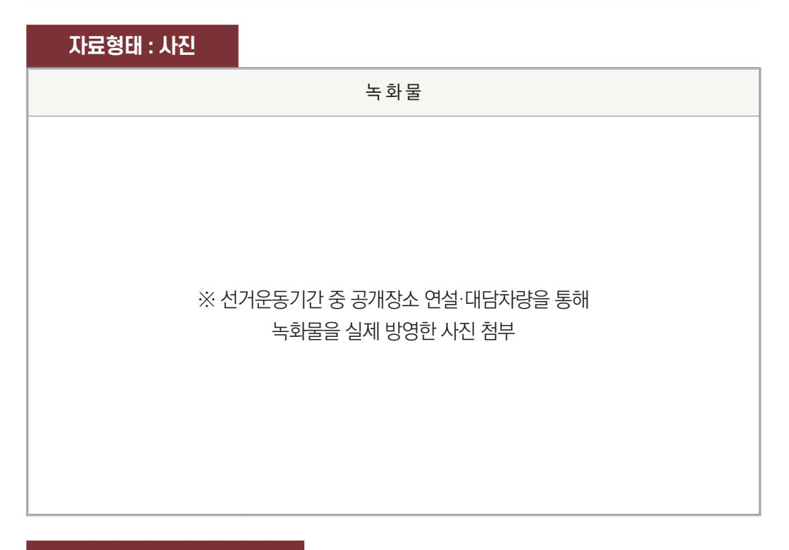

| 자료형태 : 음원 또는 동영상      |
|-----------------------|
| 로 고 송, 녹 화 물          |
| ※ 음원 또는 동영상은 별도파일로 제출 |

<!-- page: 115 -->

**7 전화** (법 제59조)

| 거래업체 현황 및 거래 내역 |                |                                                                                                                                                                                      |         |              |  |  |  |  |
|-----------------|----------------|--------------------------------------------------------------------------------------------------------------------------------------------------------------------------------------|---------|--------------|--|--|--|--|
|                 | 업 체 명          | ○○○○                                                                                                                                                                                 | 사업자등록번호 | 138-08-***** |  |  |  |  |
|                 | 대표자명           | ○○○ 전화번호                                                                                                                                                                          |         | 02-***-****  |  |  |  |  |
|                 | 사업장 소재지        | 경기도 과천시 홍촌말로 44                                                                                                                                                                      |         |              |  |  |  |  |
|                 | 전화번호           | 증빙서류(영수증) 참조                                                                                                                                                                         |         |              |  |  |  |  |
| 전화              | 임차기간(일수)       | ○○○○.○.○. ~ ○○○○.○.○.(○일)                                                                                                                                                            |         |              |  |  |  |  |
|                 | 설치장소           |                                                                                                                                                                                      |         |              |  |  |  |  |
|                 | 임차수량(대)        | 10대                                                                                                                                                                                  | 임차단가    | 10,000원      |  |  |  |  |
|                 | 임 차 료 (가)   | 100,000원                                                                                                                                                                             |         |              |  |  |  |  |
|                 | 업 체 명          | ○○○○                                                                                                                                                                                 | 사업자등록번호 | 138-08-***** |  |  |  |  |
|                 | 대표자명           | ○○○                                                                                                                                                                                  | 전화번호    | 02-***-****  |  |  |  |  |
| 전화              | 모 델 명          |                                                                                                                                                                                      | 제품번호    |              |  |  |  |  |
| 홍보              | 설치대수           | 10대                                                                                                                                                                                  | 임차단가    | 550,000원     |  |  |  |  |
|                 | 임 차 료 (나)   | 5,500,000원                                                                                                                                                                           |         |              |  |  |  |  |
|                 | 보전청구액 (가+나) | 5,600,000원 (부가가치세 포함)                                                                                                                                                                |         |              |  |  |  |  |
|                 |                | 1. 계약서·견적서, 영수증 등 사본 ○부 2. 사진 또는 동영상 등 ○부 ※ 날짜 표출 필수                                                                                                                           |         |              |  |  |  |  |
|                 | 첨부자료           | [작성요령] ॰ 선거운동용 임차전화 설치장소와 대수가 보이게 촬영 ॰ 전화홍보시스템 운영장비의 경우 시스템 전체 형태와 모델명·제품번호 등 세부사양이 기록되어 있는 라벨·태그 등이 모두 나오도록 촬영(여러 장 촬영 가능) ※컴퓨터를 이용한 자동 송신장치를 설치한 전화를 이용한 경우 미보전(위법) |         |              |  |  |  |  |

### 별첨 \_ 전화 \_ 증빙자료

| 자료형태 : 사진            |                |
|----------------------|----------------|
|                      | 일련번호           |

<!-- page: 116 -->

| ※ 날짜 및 시간이 표출된 사진 첨부 | 1              |
|                      | 설치장소           |
|                      | 선거사무소          |
|                      | 설치대수 (근무인원) |
|                      | 10대            |
|                      |                |

|                      | 일련번호  |
|----------------------|-------|
|                      | 2     |
| ※ 날짜 및 시간이 표출된 사진 첨부 | 모 델 명 |

<!-- page: 117 -->

|                      |       |
|                      | 제품번호  |
|                      |       |

**자료형태 : 동영상**

|                                              |                                                        | 거래업체 현황 및 거래 내역 |                |                |              |  |
|----------------------------------------------|--------------------------------------------------------|-----------------|----------------|----------------|--------------|--|
| 업 체 명                                        | ○○○○                                                   |                 | 사업자등록번호        |                | 138-08-***** |  |
| 대표자명                                         | ○○○                                                    |                 | 전화번호           |                | 02-***-****  |  |
| 사업장 소재지                                      | 경기도 과천시 홍촌말로 44                                        |                 | 총 발송통수         |                | 80,000통      |  |
| 발송일자 및 통수 (선거운동기간 중)                      | 1회                                                     | 2회              | 3회             | 4회             |              |  |
|                                              | ○○○○. ○. ○.                                         | ○○○○. ○. ○.  | ○○○○. ○. ○. | ○○○○. ○. ○. |              |  |
|                                              | 20,000통                                                | 20,000통         | 20,000통        | 20,000통        |              |  |
| 발송내용                                         | 증빙자료 참조                                                |                 |                |                |              |  |
| 발 송 료                                        | 400,000원                                               |                 |                |                |              |  |
| 보전청구액                                        | 400,000원 (부가가치세 포함)                                    |                 |                |                |              |  |
| 1. 계약서·견적서, 영수증 등 사본 ○부 2. 화면 캡처, 사진 등 ○부 |                                                        |                 |                |                |              |  |
| 첨부자료                                         | [작성요령] ॰ 전자우편 발송내용 및 일시가 현출될 수 있도록 화면 캡처(사진 촬영도 가능) |                 |                |                |              |  |

**8-1 전자우편** (법 제82조의5)

<!-- page: 118 -->

## 별첨 \_ 전자우편 \_ 증빙자료

| 자료형태 : 사진 등                       |                      |
|-----------------------------------|----------------------|
| ※ 전자우편 발송내용 및 일시가 보이게 캡처된 파일 등 첨부 | 회 차                  |
|                                   | 1                    |
|                                   | 발송일시                 |
|                                   | ○○○○. ○. ○. ○○:○○ |
|                                   | 발송통수                 |
|                                   | 20,000통              |

<!-- page: 119 -->

|                                   | 회 차                  |
|-----------------------------------|----------------------|
| ※ 전자우편 발송내용 및 일시가 보이게 캡처된 파일 등 첨부 | 2                    |
|                                   | 발송일시                 |
|                                   | ○○○○. ○. ○. ○○:○○ |
|                                   | 발송통수                 |
|                                   | 20,000통              |

| 8-2                     | 문자메시지 (법 제82조의5) |                 |                |                |                |    |              |    |  |
|-------------------------|------------------|-----------------|----------------|----------------|----------------|----|--------------|----|--|
|                         |                  |                 |                |                |                |    |              |    |  |
|                         |                  |                 |                | 거래업체 현황        |                |    |              |    |  |
| 업 체 명                   |                  | ○○○○            |                |                | 사업자등록번호        |    | 138-08-***** |    |  |
| 대표자명                    | ○○○              |                 |                |                | 전화번호           |    | 02-***-****  |    |  |
| 사업장 소재지                 |                  | 경기도 과천시 홍촌말로 44 |                |                |                |    |              |    |  |
|                         |                  |                 |                | 거래 내역          |                |    |              |    |  |
| 발송횟수                    | 5회               |                 |                |                | 총 발송통수         |    | 10,000건      |    |  |
|                         | 1회               | 2회              | 3회             | 4회             | 5회             | 6회 | 7회           | 8회 |  |
| 발송일자 및 통수 (선거운동기간 중) | ○○○○. ○. ○.   | ○○○○. ○. ○.  | ○○○○. ○. ○. | ○○○○. ○. ○. | ○○○○. ○. ○. |    |              |    |  |
|                         | 2,000건           | 2,000건          | 2,000건         | 2,000건         | 2,000건         |    |              |    |  |
| 전송용 전화번호                |                  | 02-***-****     |                |                |                |    |              |    |  |
| 발송내용                    | 증빙자료 참조          |                 |                |                |                |    |              |    |  |
| 발 송 료                   | 400,000원         |                 |                |                |                |    |              |    |  |

| 발송횟수                    | 5회                                                          |                |                |                | 총 발송통수         |    | 10,000건 |    |  |
|-------------------------|-------------------------------------------------------------|----------------|----------------|----------------|----------------|----|---------|----|--|
|                         | 1회                                                          | 2회             | 3회             | 4회             | 5회             | 6회 | 7회      | 8회 |  |
| 발송일자 및 통수 (선거운동기간 중) | ○○○○. ○. ○.                                              | ○○○○. ○. ○. | ○○○○. ○. ○. | ○○○○. ○. ○. | ○○○○. ○. ○. |    |         |    |  |
|                         | 2,000건                                                      | 2,000건         | 2,000건         | 2,000건         | 2,000건         |    |         |    |  |
| 전송용 전화번호                | 02-***-****                                                 |                |                |                |                |    |         |    |  |
| 발송내용                    | 증빙자료 참조                                                     |                |                |                |                |    |         |    |  |
| 발 송 료                   | 400,000원                                                    |                |                |                |                |    |         |    |  |
| 보전청구액                   | 400,000원 (부가가치세 포함)                                         |                |                |                |                |    |         |    |  |
|                         | 1. 계약서·견적서, 영수증 등 사본 ○부 2. 화면 캡처, 사진 등 ○부                |                |                |                |                |    |         |    |  |
| 첨부자료                    | [작성요령] ॰ 문자메시지 발송내용 및 일시가 현출될 수 있도록 화면 캡처 (사진 촬영도 가능) |                |                |                |                |    |         |    |  |

### 별첨 \_ 문자메시지 \_ 증빙자료

<!-- page: 120 -->

| 자료형태 : 사진 등                        |                      |
|------------------------------------|----------------------|
|                                    | 회 차                  |
|                                    | 1                    |
|                                    | 발송일시                 |
| ※ 문자메시지 발송내용 및 일시가 보이게 캡처된 파일 등 첨부 | ○○○○. ○. ○. ○○:○○ |
|                                    | 발송통수                 |
|                                    | 2,000통               |

|                                    | 회 차                  |

<!-- page: 121 -->

|------------------------------------|----------------------|
|                                    | 2                    |
|                                    | 발송일시                 |
| ※ 문자메시지 발송내용 및 일시가 보이게 캡처된 파일 등 첨부 | ○○○○. ○. ○. ○○:○○ |
|                                    | 발송통수                 |
|                                    | 2,000통               |

**9 인터넷 광고** (법 제82조의7)

| 거래업체 현황 및 거래 내역  |              |                                                                                                                                                  |             |                     |  |  |
|------------------|--------------|--------------------------------------------------------------------------------------------------------------------------------------------------|-------------|---------------------|--|--|
|                  | 업 체 명        | ○○○○                                                                                                                                             | 사업자 등록번호 | 138-08-*****        |  |  |
| 제작 (기획 포함) | 대표자명         | ○○○                                                                                                                                              | 전화번호        | 02-***-****         |  |  |
|                  | 사업장 소재지      | 경기도 과천시 홍촌말로 44                                                                                                                                  | 종 류      | □ 팝업창 □ 배너 □ 동영상 |  |  |
|                  | 규 격       | 60초품                                                                                                                                             | 제작편수        | 1편                  |  |  |
|                  | 제 작 비 (가) | 320,000원                                                                                                                                         |             |                     |  |  |
| 광고               | 업 체 명        | ○○○○                                                                                                                                             | 사업자 등록번호 | 138-08-*****        |  |  |
|                  | 대표자명         | ○○○                                                                                                                                              | 전화번호        | 02-***-****         |  |  |
|                  | 광 고 료 (나) | 5,000,000원                                                                                                                                       |             |                     |  |  |
| 보전청구액 (가+나)   |              | 5,320,000원 (부가가치세 포함)                                                                                                                            |             |                     |  |  |
| 첨부자료             |              | 1. 계약서·견적서, 영수증 등 사본 ○부 2. 화면 캡처, 파일 등 ○부                                                                                                     |             |                     |  |  |
|                  |              | [작성요령] ॰ 인터넷언론사 홈페이지에 게재된 사실을 확인할 수 있도록 언론사명, 광고내용 및 일시가 현출될 수 있도록 화면 캡처(사진촬영도 가능) ※ 광고 종류, 제작편수별로 각각 작성 ॰ 동영상의 경우 파일을 이메일 등으로 별도 제출 |             |                     |  |  |

<!-- page: 122 -->

### 별첨 \_ 인터넷광고 \_ 증빙자료

# **자료형태 : 사진 등** ※ 인터넷언론사 홈페이지 게재사실 등을 확인할 수 있도록 캡처된 파일 등 첨부 일련번호 1 광고일시 ○○○○. ○. ○. ○○:○○ 광고종류 배너 규 격 420 × 120 픽셀

| 자료형태 : 동영상      |                      |
|-----------------|----------------------|
|                 | 일련번호                 |
|                 | 2                    |
|                 | 광고일시                 |
| ※ 동영상은 별도파일로 제출 | ○○○○. ○. ○. ○○:○○ |
|                 | 광고종류                 |

<!-- page: 123 -->

|                 | 동영상                  |
|                 | 규 격                  |
|                 | 10초품                 |

|             | 10 명함 (법 제93조)                   |                  |                                                                           |         |               |              |          |
|-------------|-------------------------------------|------------------|---------------------------------------------------------------------------|---------|---------------|--------------|----------|
|             |                                     |                  | 거래업체 현황                                                                   |         |               |              |          |
|             | 업 체 명                               | ○○○○ 사업자 등록번호 |                                                                           |         |               | 138-08-***** |          |
| ○○○ 대표자명 |                                     |                  | 전화번호                                                                      |         |               | 02-***-****  |          |
|             | 경기도 과천시 홍촌말로 44 사업장 소재지          |                  |                                                                           |         |               |              |          |
|             |                                     |                  | 거래 내역                                                                     |         |               |              |          |
|             | 구 분                                 |                  |                                                                           |         | 2차            | 3차           | 합계       |
|             | 제작수량(A)                             |                  | 10,000매                                                                   |         | 10,000매       |              | 20,000매  |
|             | 규 격                              |                  | 9cm×5cm                                                                   |         | 9cm×5cm       |              |          |
| 제 작      | 재 질                              |                  | 아트지200 g/㎡                                                             |         | 아트지200 g/㎡ |              |          |
| 내 역      | 제작비용(B)                             |                  | 300,000원                                                                  |         | 400,000원      |              | 700,000원 |
|             | 제작단가(C=B/A)                         |                  | 30원                                                                       |         | 40원           |              |          |
|             | 납품일자                                |                  | ○○○○. ○. ○.                                                               |         | ○○○○. ○. ○.   |              |          |
| 배           | 선거일전 180일부터 선거운동기간 개시일 전일까지 배부수량 |                  | 6,000매                                                                    |         | 5,000매        |              |          |
| 부 내      | 선거운동기간 중 배부수량(D)                    |                  | 3,000매                                                                    |         | 3,000매        |              |          |
| 역           | 잔여수량                                |                  | 1,000매                                                                    |         | 2,000매        |              |          |
|             | 보전청구액(E=C×D)                        |                  |                                                                           | 90,000원 | 120,000원      |              | 210,000원 |
| 기타 특이사항     |                                     |                  | 옵셋인쇄, 4도 양면                                                               |         |               |              |          |
| 첨부자료        |                                     |                  | 1. 계약서·견적서, 영수증 등 사본 ○부 2. 사진 또는 실물 명함 ○매                              |         |               |              |          |
|             |                                     |                  | [작성요령] ॰ 선거일전 180일부터 선거운동기간 개시일 전일까지 배부한 수량과 선거운동기간 중 배부한 수량을 구분 기재 |         |               |              |          |

123

### 별첨 \_ 명함 \_ 증빙자료

| 자료형태 : 사진 등       |                 |
|-------------------|-----------------|
| ※ 사진 또는 실물 첩부(앞면) | 회 차             |
|                   | 1               |
|                   | 납품일자            |

<!-- page: 124 -->

|                   | ○○○○. ○. ○.     |
| ※ 사진 또는 실물 첩부(뒷면) | 제작수량            |
|                   | 10,000매         |
|                   | 선거운동기간중 배부수량 |
|                   | 3.000매          |

| ※ 사진 또는 실물 첩부(앞면) | 회 차             |
|-------------------|-----------------|
|                   | 2               |
|                   | 납품일자            |
|                   | ○○○○. ○. ○.     |
| ※ 사진 또는 실물 첩부(뒷면) | 제작수량            |
|                   | 10,000매         |

<!-- page: 125 -->

|                   | 선거운동기간중 배부수량 |
|                   | 3.000매          |

11 선거벽보·선거공보 (법 제64조, 제65조)

### 별첨 \_ 선거벽보·선거공보 \_ 증빙자료

### **자료형태 : 사진 또는 실물**

※ 벽보·공보 사진 첨부 또는 실물 제출

방송연설 실시내역 구 분 □ TV □ 라디오 방송사명 ○○방송 방송시간 10분 방송횟수 1회 방송일자 ○○○○. ○. ○. 거래업체 현황 및 거래 내역 기 획 업체명 ○○○○ 사업자등록번호 138-08-\*\*\*\*\*\* 대표자명 ○○○ 전화번호 02-\*\*\*-\*\*\*\* 사업장소재지 경기도 과천시 홍촌말로 44 기획료(가) 1,500,000원 제 작 업체명 ○○○○ 사업자등록번호 138-08-\*\*\*\*\*\* 대표자명 ○○○ 전화번호 02-\*\*\*-\*\*\*\* 사업장소재지 경기도 과천시 홍촌말로 44 제작비용(나) 2,500,000원 방 송 방송사명 ○○○○ 사업자등록번호 138-08-\*\*\*\*\*\* 대표자명 ○○○ 전화번호 02-\*\*\*-\*\*\*\* 사업장소재지 경기도 과천시 홍촌말로 44 방송료(다) 1,000,000원 기타비용(라) 500,000원 □ 전문분장비용 □ 기타( ) 전문분장비용 ○○○원 보전청구액 (가+나+다+라) 5,500,000원 (부가가치세 포함) 첨부자료 1. 계약서·견적서, 영수증 등 사본 ○부 2. 동영상 또는 음원 파일 등 ○부 [작성요령] ॰ 연설내용을 확인할 수 있는 동영상 또는 음원 파일을 이메일 등으로 별도 제출

<!-- page: 126 -->

**12 방송연설** (법 제71조)

<!-- page: 127 -->

### 별첨 \_ 방송연설 \_ 증빙자료

| 자료형태 : 동영상 또는 음원 |                                 |
|------------------|---------------------------------|
| ※ 동영상은 별도 파일로 제출 | 구 분                          |
|                  | TV 방송연설                         |
|                  | 일련번호                            |
|                  | 1                               |
|                  | 방송사명                            |
|                  | ○○○                             |
|                  | 방송일자 (방송시간)                  |
|                  | ○○○○. ○. ○. (○ : ○ ~ ○ : ○ ) |
|                  | 구 분                          |
|                  | 라디오 방송연설                        |
|                  |                                 |

| ※ 음원은 별도 파일로 제출 | 구 분                          |
|-----------------|---------------------------------|
|                 | 라디오 방송연설                        |
|                 | 일련번호                            |
|                 | 1                               |
|                 | 방송사명                            |
|                 | ○○○                             |

<!-- page: 128 -->

|                 | 방송일자 (방송시간)                  |
|                 | ○○○○. ○. ○. (○ : ○ ~ ○ : ○ ) |

| 선거벽보 코팅비 / 전자우편 전송용 이미지·동영상 제작 등 구 분 ※ 보전청구 대상 중 1 ~ 12. 이외의 항목에 대해 작성 |                                                                                 |                                                                         |              |  |  |
|---------------------------------------------------------------------------------|---------------------------------------------------------------------------------|-------------------------------------------------------------------------|--------------|--|--|
| 거래업체 현황                                                                         |                                                                                 |                                                                         |              |  |  |
| 업 체 명                                                                           | ○○○                                                                             | 사업자등록번호                                                                 | 138-08-***** |  |  |
| 대표자명                                                                            | ○○○                                                                             | 전화번호                                                                    | 02-***-****  |  |  |
| 사업장 소재지                                                                         | 경기도 과천시 홍촌말로 44                                                                 |                                                                         |              |  |  |
| 거래 내역                                                                           |                                                                                 |                                                                         |              |  |  |
| 내 용                                                                          | 선거사무소 외벽 첩부용 선거벽보 코팅(30매) ※ 선거운동에 사용된 것임을 알수있도록 구체적으로 작성                     |                                                                         |              |  |  |
| 거래비용                                                                            | 30매 × 1,000원                                                                    |                                                                         |              |  |  |
| 보전청구액                                                                           | 30,000원 (부가가치세 포함)                                                              |                                                                         |              |  |  |

<!-- page: 129 -->

| 기타 소명사항                                                                         | ※ 사진 등 자료가 멸실·훼손되어 자료제출이 불가능할 경우 선거운동의 실제 사용여부 등을 객관적으로 증빙할 수 있는 정당한 사유 등 기재 |                                                                         |              |  |  |
|                                                                                 | 1. 계약서·견적서, 영수증 등 사본 ○부 2. 사진 등 ○부 ※ 날짜 표출 필수                             |                                                                         |              |  |  |
| 첨부자료                                                                            | [작성요령]                                                                          | ॰ 코팅한 선거벽보를 선거사무소 외벽에 붙인 사진 등 실제 선거운동에 사용된 것임을 확인할 수 있도록 촬영한 사진 등 첨부 |              |  |  |

**13 기타**

# 별첨 \_ 기타 \_ 증빙자료

# **자료형태 : 사진 등** ※ 실제 선거운동에 사용된 것임을 확인할 수 있도록 촬영한 사진 등 첨부 구 분 선거벽보 코팅 내 용 선거사무소 외벽 부착용

| 자료형태 : 동영상      |     |
|-----------------|-----|
| ※ 동영상은 별도파일로 제출 | 구 분 |
|                 |     |
|                 |     |
|                 |     |

<!-- page: 130 -->

|                 |     |
|                 | 내 용 |
|                 |     |
|                 |     |
|                 |     |
|                 |     |

<!-- page: 131 -->

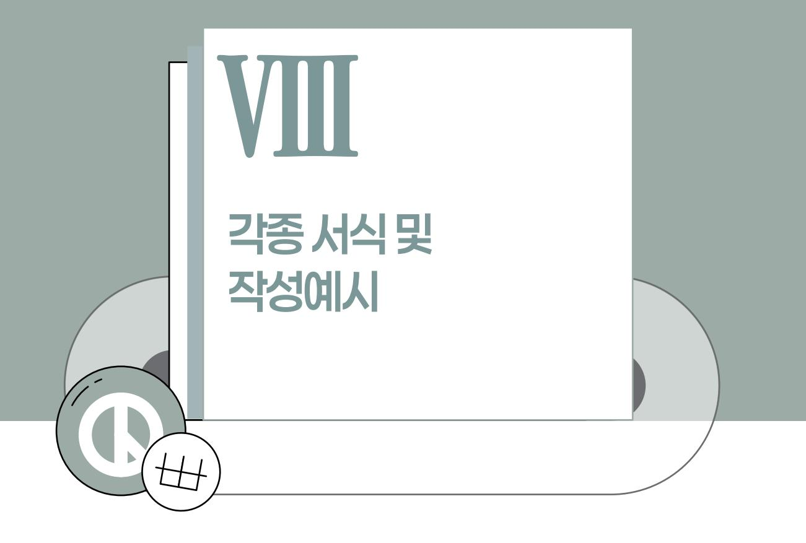

<!-- page: 132 -->

# 각종 서식 및 작성예시 목록

| 구 분    | 내 용                                | 쪽 수 |
|--------|------------------------------------|-----|
| 서식 1   | 선거비용 보전청구서(지역구지방의원 및 지방자치단체의 장선거용) | 133 |
| 서식 2   | 선거비용 보전청구서(비례대표지방의원선거용)            | 135 |
| 서식 3   | 선거운동용 전화요금 정산 청구서                  | 136 |
| 서식 4   | 선거사무장 등 전화요금 정산 관련 위임장             | 137 |
| 서식 5   | 전화요금 보전청구내역서                       | 138 |
| 서식 6   | 선거사무관계자 수당·실비 지급명세서                | 139 |
| 서식 7   | 점자형 선거공보 등 부담비용 지급청구서              | 140 |
| 서식 8   | 후보자 반환기탁금 및 보전비용 인계·인수서            | 142 |
| 서식 9   | 반환기탁금 및 보전비용 정산서                   | 143 |
| 작성예시 1 | 선거비용 보전청구서(지역구지방의원 및 지방자치단체의 장선거용) | 144 |
| 작성예시 2 | 선거비용 보전청구서(비례대표지방의원선거용)            | 145 |
| 작성예시 3 | 선거운동용 전화요금 정산 청구서                  | 146 |
| 작성예시 4 | 선거사무장 등 전화요금 정산 관련 위임장             | 147 |
| 작성예시 5 | 전화요금 보전청구내역서                       | 148 |
| 작성예시 6 | 선거사무관계자 수당·실비 지급명세서                | 149 |
| 작성예시 7 | 점자형 선거공보 등 부담비용 지급청구서              | 150 |
| 작성예시 8 | 후보자 반환기탁금 및 보전비용 인계·인수서            | 151 |
| 작성예시 9 | 반환기탁금 및 보전비용 정산서                   | 152 |

# 선거비용 보전청구서

(지역구지방의원 및 지방자치단체의 장 선거용)

- 1. 선 거 명 :
- 2. 소속정당명 :
- 3. 선거구명 :

<!-- page: 133 -->

- 4. 후보자명 :
- 5. 청구내역

|         | 청 구 액  |     |        |      |    |   |  |  |
|---------|--------|-----|--------|------|----|---|--|--|
| 구 분     | ᆕᆑᅿᅿᆁᄮ | 후원회 | 정당의지원금 |      | 하게 | 비 |  |  |
|         | 후보자자산  | 기부금 | 보조금    | 보조금외 | 합계 |   |  |  |
| 선거사무소   |        |     |        |      |    |   |  |  |
| ○○선거연락소 |        |     |        |      |    |   |  |  |
|         |        |     |        |      |    |   |  |  |
| ○○선거연락소 |        |     |        |      |    |   |  |  |
| 합 계     |        |     |        |      |    |   |  |  |

6. 보전청구 총액 : 금

7. 수령계좌

| 예금주 | 금융기관명 | 계좌번호 | 비고 |
|-----|-------|------|----|
|     |       |      |    |

)

2026년 6월 3일 실시한 제9회 전국동시지방선거에서 선거비용의 보전을 위와 같이 청구합니다.

<!-- page: 134 -->

- 붙임 1. 정치자금 수입·지출부(선거비용과목) 사본 1부.
  - 2. 영수증 등 증빙서류(「공직선거관리규칙」 별표1의2에 따른 사진 등 객관적 증빙자료 포함) 사본 1부.
  - 3. 선거연락소별 선거비용 보전청구서(선거연락소가 있는 경우에 한함) 사본 1부.
  - 4. 정치자금 수입·지출 통장(수령계좌 통장) 사본 1부.

원(₩

#### 2026년 월 일

<!-- page: 135 -->

|     | 후     | 보    | 자  | ହ | ٦ |
|-----|-------|------|----|---|---|
| 청구인 | - 선 기 | 에사 뒤 | 루장 | ହ | - |
|     | 회기    |      |    | ହ |   |

○○선거관리위원회 귀중

- 주 1. 청구인란에는 선거사무소의 경우 후보자와 선거사무장 및 회계책임자가 모두 기명하고 날인을, 선거연락소의 경우 선거연락소장 및 회계책임자가 모두 기명하고 날인을 하여야 함.
  - 2. 선거사무소는 선거구선거관리위원회에 당해 선거사무소의 보전청구 세부내역 및 증빙서류 사본을 첨부하여 청구하여야 함.
  - 3. 선거연락소는 선거연락소에 대응하는 선거관리위원회에 당해 선거연락소의 보전청구 세부내역 및 증빙서류 사본을 첨부하여 청구하여야 함.
  - 4. 선거연락소가 있는 경우 선거사무소는 위 "5. 청구내역"에 각 선거연락소의 보전청구금액을 함께 기재하고 선거 연락소별 선거비용 보전청구서 사본을 함께 제출하여야 함(선거연락소 보전청구내역이 많은 경우 별지로 작성할 수 있음).
  - 5. 선거연락소는 위 "5. 청구내역"에 해당 선거연락소분만 기재하며, "7. 수령계좌"는 미기재함.
  - 6. 보전청구기한 후 추가 보전청구 시 '선거비용 보전청구서(추가)'라고 개서하여 활용하되, 청구내역에 추가청구 내역을 작성하고 보전청구 총액은 기청구금액을 포함하여 총액을 기재함.
  - 7. 정치자금 수입·지출 통장(수령계좌 통장) 사본은 정치자금 수입 통장 또는 후보자 명의의 통장 등 보전금을 지급 받을 계좌의 사본을 첨부함.

# 선거비용 보전청구서

(비례대표지방의원선거용)

- 1. 선 거 명 :
- 2. 정 당 명 :
- 3. 청구내역

| 구분 | 계 | 보조금외 | 경상 보조금 | 선거 보조금 | 여청추천 보조금 | 장애인추천 보조금 | 청년추천 보조금 | 비 고 |
|----|---|------|-----------|-----------|-------------|--------------|-------------|-----|
| 총계 |   |      |           |           |             |              |             |     |

4. 청구금액 : 금 원(₩ )

5. 수령계좌

| 예금주 | 금융기관명 | 계좌번호 | 비 고 |
|-----|-------|------|-----|
|     |       |      |     |

2026년 6월 3일 실시한 제9회 전국동시지방선거에서 선거비용의 보전을 위와 같이 청구합니다.

- 붙임 1. 정당의 지출부(선거비용과목) 사본 1부.
  - 2. 영수증 등 증빙서류(공직선거관리규칙 별표1의2에 따른 사진 등 객관적 증빙자료 포함) 사본 1부.
  - 3. 신고된 정치자금 수입 통장(수령계좌 통장) 사본 1부.

<!-- page: 136 -->

#### 2026년 월 일

|     | ○○당 대표자   | 직인 |  |
|-----|-----------|----|--|
| 청구인 | 선 거 사 무 장 |   |  |

<!-- page: 137 -->

|     | 회 계 책 임 자 |   |  |

<!-- page: 138 -->

### ○○선거관리위원회 귀중

- 주 1. 청구인란에는 비례대표시·도의원선거의 경우 시·도당 대표자와 선거사무장 및 회계책임자가 모두 기명하고 날인을, 비례대표구·시·군의원선거의 경우 정당선거사무소장과 선거사무장 및 회계책임자가 모두 기명하고 날인을 하여야 함.
  - 2. 수령계좌는 중앙당 또는 시·도당이 선거관리위원회에 신고한 정당의 수입용 계좌를 기재하며 그 통장 사본을 제출함.
  - 3. 보전청구기한 후 추가 보전청구 시 '선거비용 보전청구서(추가)'라고 개서하여 활용하되, 청구내역에 추가 청구 내역을 작성하고 청구금액은 기청구금액을 포함하여 총액을 기재함.

# 선거운동용 전화요금 정산 청구서

1. 인 적 사 항

| 선 거 명     |    | 후보자명 |             | 소속정당명 |  |
|-----------|----|------|-------------|-------|--|
|           | 성명 |      | 「공직선거법」상 신분 |       |  |
| 청구인 주소 |    |      | 연락처         |       |  |

2. 정 산 대 상

가. 유선·인터넷전화

|              |   | 명 의 인 |    |        |      |      |
|--------------|---|-------|----|--------|------|------|
| 설치장소         | 주 | 소     | 성명 | 주민등록번호 | 전화번호 | 설치구분 |
| (선거사무소)      |   |       |    |        |      |      |
| · (선거연락소) |   |       |    | 합계     | 대    |      |

나. 휴대전화

|     | 정 산 대 상 전 화 |             |      |                 |  |
|-----|-------------|-------------|------|-----------------|--|
| 명의인 | 주민등록번호      | 「공직선거법」상 신분 | 전화번호 | 비 고             |  |
|     |             |             |      |                 |  |
|     |             |             |      | ※ 후보자가 요금을 부담하는 |  |
| 합계  |             |             | 대    | 휴대전화만 기재함.      |  |

2026년 6월 3일 실시한 제9회 전국동시지방선거에 있어 선거운동기간중(2026. 5. 21.~ 6. 2.) 선거운동에 사용한 전화요금의 정산을 청구하오니 정산내역서(전화번호별 통화료 정산내역 포함)를 발급하여 주시기 바랍니다.

#### 2026년 월 일

| 청구인 | ○○당 대표자 (후 보 자) 회 계 책 임 자 | 직인   |
|-----|---------------------------------------|--------------|
|     | 연 락 처 : 주 소 :                   |              |

구비서류 1. 명의인의 신분증 사본 1부.

2. 선거사무장 등 전화요금 정산 관련 위임장 1부.(후보자 등의 일괄 정산 청구에 한함)

#### ○○통신회사 귀중

주 1. "2. 정산대상" 전화가 많은 경우 별지로 작성할 수 있음.

2. 선거사무장 등도 개별적으로 전화요금 정산시 청구인 명의를 수정하여 사용 가능함.

3. 후보자 또는 회계책임자가 선거사무장 등의 통화료를 일괄 정산 청구시 위임장 첨부(별지 참조)

# 선거사무장 등 전화요금 정산 관련 위임장

- 1. 선 거 명 :
- 2. 소속정당명 :
- 3. 후 보 자 명 :
- 4. 위 임 내 역

| 위 임 을 받 은 자                                |          | 주민등록 번 호 |               |  |  |  |
|-----------------------------------------------|----------|----------------|---------------|--|--|--|
| 주 소                                        |          |                |               |  |  |  |
| 사용용도                                          | 통신회사 제출용 |                |               |  |  |  |
| 관 계                                        |          | 위임사유           | 선거운동용 전화요금 정산 |  |  |  |
| 본인은 선거운동용 전화요금 정산과 관련하여 일체의 권한을 위 사람에게 위임합니다. |          |                |               |  |  |  |
| 2026년 월 일                               |          |                |               |  |  |  |
| 위 임 자                                         |         | 주민등록번호         |               |  |  |  |
| 주 소                                        |          |                |               |  |  |  |

구비서류 1. 인감증명서 1부.

2. 위임자의 신분증 사본 1부.

# 전화요금 보전청구내역서

- 1.선거명:
- 2. 소속정당명 :
- 3. 후보자명 :
- 4. 정산대상기간 :
- 5. 전화번호별 전화통화료 보전청구 내역

(단위 : 원)

| 정 산 대 상 |     |               |     | 청 구 금 액 |     |     |     |            |            |
|---------|-----|---------------|-----|---------|-----|-----|-----|------------|------------|
| 전화번호    | 성 명 | 설치장소 또는 신분 | 구 분 | 계       | 설치비 | 기본료 | 통화료 | 통 화 연결음 | 문 자 메시지 |
|         |     |               |     |         |     |     |     |            |            |
|         |     |               |     |         |     |     |     |            |            |
|         | 합 계 | ^             | 대   |         |     |     |     |            |            |

6. 기존 사용 전화번호별 전화통화료 보전청구 세부내역

(단위 : 원)

| 전화번호 | 통신회사 요금 정산액 (A) | 직전 3개월간의 평균통화료(B) | 청구액(C=A−B) | 비고 |
|------|-----------------|-------------------|------------|----|
|      |                 |                   |            |    |
|      |                 |                   |            |    |

7. 전화요금 보전청구총액 : 금

원(₩ )

2026년 월 일

붙임: 1. 통신회사에서 통보받은 선거운동용 전화요금 정산 결과 통보서 각 1부. 2. 기존 사용 전화번호별 직전 3개월간의 통화요금고지서 사본 각 1부.

|     | _ 〇〇당 대표자                       | 직인 |
|-----|---------------------------------|----|
|     | (후 보 자)                         | ୧୦ |
| 청구인 | _ ○○당 대표자 (후 보 자) - 선거사무장 | ୧୦ |
|     | 회계책임자                           | ୧  |

### ○○선거관리위원회 귀중

주 1. 청구인란에는 정당의 대표자 또는 후보자와 선거사무장 및 회계책임자가 모두 기명하고 날인을 하여야 함.

2. 위 5, 6 서식은 별지로 작성할 수 있음.

<!-- page: 139 -->

3. 직전 3개월간의 합산통화료는 통화료, 문자메시지발송료, 통화연결음(컬러링)을 합한 금액임.

선거사무관계자 수당·실비 지급명세서

지급일: 2026.

실비 ① 근로자 지급 지급 실수령액 입금증 수령인 금액 생년 전화 수당 부담 교 직위 성명 주 소 기가 일련 서명 웤잌 번호 보험료  $(\overline{\mathbf{n}})$ Ē 일비 식비 통 (일수) 번호 날인 (C)-(2) (()+()) (E) 비 계

주 1. 선거사무관계자가 지정한 예금계좌에 입금·지급하고 그 입금증 사본을 지급명세서와 함께 제출함.

2. 선거사무관계자의 수당·실비 수령 여부 확인을 위해 "수령인 서명날인"란에 서명·날인을 반드시 받음.

- 3. "수당①"에는 선거사무관계자가 부담하는 고용보험료를 포함한 금액을 기재함.
- 4. 일비는 선거사무소·선거연락소의 사무소 소재지 관할구역 내에서 활동하는데 소요되는 경비이며, 교통비는 철도, 선박, 항공 등을 이용한 경우에 한하여 실비지급기준 이내의 금액을 지급할 수 있음.
- 5. 선거사무관계자에게 교통편의를 제공한 경우 회계책임자는 해당 금액을 공제한 금액을 지급하고, 공제액은 "일비" 란의 ( )안에 기재함.

\*단, 선거운동 중 선거운동장소 이동을 위한 교통편의를 제공할 경우 공제대상이 아님.

- 6. 식비는 당일 별도의 식사를 제공한 경우에는 제공된 식수만큼을 공제(1식 기준금액인 8,330원을 초과하여 제공한 경우 실제 제공한 식비를 공제)하고 지급하고, 공제액을 "식비"란의 ( )안에 기재함
- 7. "근로자 부담 보험료@"는 "신고한 보수총액× 0.9%" 이나, 보전대상 "근로자 부담 보험료"는 "수당① × 0.9%" 임을 유의(※ '실비©'는 제외)

(단위 : 원)

# 점자형 선거공보 등 부담비용 지급청구서

1.선 거 명:

2. 소속정당명 :

3. 후보자명 :

4. 점자형 선거공보 등 작성·제출수량

|                | 점자형 선거공보 점자형 선거공약서 |                |                |               |                | 저장매체        |
|----------------|--------------------|----------------|----------------|---------------|----------------|-------------|
| 작성·제출 부수(A) | 1부당 매수 (B)      | 총매수 (C=A×B) | 작성·발송 부수(A) | 1부당 매수 (B) | 총매수 (C=A×B) | 지성배세 (개) |
|                |                    |                |                |               |                |             |

<!-- page: 140 -->

#### 5. 청구금액

(단위:원)

| 구 분           | 계 | 제작비 (한글인쇄료 포함) | 저장매체 디지털파일 전환비 | 운반비 | 수당·실비 ·산재보험료 |
|---------------|---|-------------------|-------------------|-----|-----------------|
| 점자형 선거공보      |   |                   |                   |     |                 |
| 점자형 선거공약서     |   |                   |                   |     |                 |
| 저장매체          |   |                   |                   |     |                 |
| 활동보조인 수당·실비 등 |   |                   |                   |     |                 |
| 계             |   |                   |                   |     |                 |

※ 점자형선거공약서 발송용 봉투제작비와 우편발송비용은 보전대상 선거비용

6. 수령계좌

| 예금주 | 금융기관명 | 계좌번호 | 비고 |
|-----|-------|------|----|
|     |       |      |    |

2026년 6월 3일 실시한 제9회 전국동시지방선거에서 (점자형 선거공보)·(저장매체)·(점자형 선거공약서)·(활동보조인 수당·실비 및 산재보험료)에 대한 부담비용을 위와 같이 청구합니다.

붙임 1. 정치자금 수입·지출부 사본 1부.

2. 활동보조인 수당·실비 지급 명세서 1부

3. 영수증 등 증빙서류 사본 1부.

4. 정치자금 수입·지출 통장(수령계좌 통장) 사본 1부.

2026년 월 일

○○당 대표자 직인 (후 보 자) ୧ ୧୦ 청구인 - 선거사무장 └ 회계책임자 ହା

○○선거관리위원회 귀중

- 주 1. 청구인란에는 정당의 대표자 또는 후보자와 선거사무장 및 회계책임자가 모두 기명하고 날인을 하여야 함.

<!-- page: 141 -->

  - 2. 점자형 선거공보 제출수량 범위 내에서 책자형 선거공보를 추가 제작하고 이에 인쇄물 접근성 바코드를 표시하는 방식으로 작성 시, 그 제작비용은 '제작비(한글인쇄료 포함)'란에 기재함.
  - 3. 수당·실비 등은 활동보조인의 수당과 실비, 산재보험료를 말함(고용보험료는 해당되지 않음).
  - 4. 정치자금 수입·지출 통장(수령계좌 통장) 사본은 정치자금 수입 통장 또는 후보자 명의의 통장 등 부담비용을 지급 받을 계좌의 사본을 첨부함.

# 후보자 반환기탁금 및 보전비용 인계·인수서

1. 인계자

| 직 위 | 성 명 | 주민등록번호 | 주 소 | 전화번호 |
|-----|-----|--------|--------|------|
|     |     |        |        |      |

<!-- page: 142 -->

#### 2. 인수자(정당, 공익법인, 사회복지시설)

| 기 관 명 | 직 위 | 성 명 | 주민등록번호 | 주 소 | 전화번호 |
|-------|-----|-----|--------|-----|------|
|       |     |     |        |     |      |

3. 인계·인수사항

| 인계·인수금액 | 인계·인수방법 |  |  |
|---------|---------|--|--|
|         |         |  |  |

「정치자금법」 제58조제1항 및 「정치자금사무관리 규칙」 제48조제1항의 규정에 의하여 후보자가 후원회의 후원금 또는 정당의 지원금으로 기탁금을 납부하거나 선거비용을 지출하여 반환·보전받은 비용 중 후보자 자산을 공제한 금액을 위와 같이 인계·인수합니다.

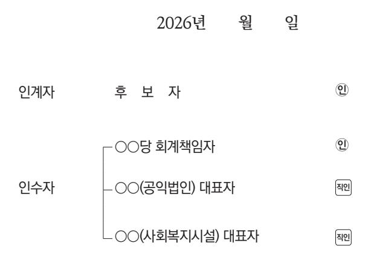

주 1. 인계·인수서는 3부를 작성하여 인계·인수자가 각각 1부씩 보관하고 1부를 선거관리위원회에 제출하여야 합니다.

2. 인계금액은 계좌이체 또는 수표발행 등 실명이 확인되는 방법으로 인계하여야 합니다.

# 반환기탁금 및 보전비용 정산서

| 내 용                                                                                                                                           | 금 액(원) |
|--------------------------------------------------------------------------------------------------------------------------------------------------|--------|
| A. 반환기탁금(후원회의 후원금 또는 정당의 지원금으로 기탁금을 납부한 경우 발생이자 포함)                                                                                           |        |
| B. 보전비용                                                                                                                                          |        |
| C. 「후보자 자산계정」의 선거비용과목 지출총액 - 확정된 미지급 채무 포함                                                                                                    |        |
| D. 「후보자 자산계정」의 선거비용외 정치자금과목 지출총액 - 확정된 미지급 채무 포함 - 선거관리위원회에 납부한 기탁금 지출금액 포함                                                                |        |
| E. 「후보자 자산계정」의 선거사무소·연락소 임차보증금 등 자산가치가 있는 비용                                                                                                  |        |
| F. 「후보자 자산계정」의 점자형 선거공보(통상거래가격 범위 내 금액), 저장매체, 점자형 선거공약서, 활동보조인 수당·실비(법정 수당·실비 범위 내 금액) 등 선거관리위원회로부터 받은 부담비용                               |        |
| G. 「후보자 자산계정」의 위법비용                                                                                                                              |        |
| H. 「후보자 자산계정」에 후보자 자신(제3자 제외)의 차량·장비·물품 등을 사용하고 통상적인 거래가격 또는 임차가격을 회계장부의 수입·지출계정에 기재한 경우 등 선거사무소(선거연락소 제외)에서 후보자가 실제로 지출하지 아니한 비용 등의 총액 |        |
| I = 정당지원금, 후원회기부금으로 「후보자 자산계정」의 차입금을 변제한 비용                                                                                                   |        |
| J = 인계대상 비용 [A+B-(C+D-E-F-G-H-I)]                                                                                                                |        |

# 선거비용 보전청구서

(지역구지방의원 및 지방자치단체의 장 선거용)

- 1. 선 거 명 : OO시장선거
- 2. 소속정당명 :
- 3. 선거구명 :
- 4. 후보자명 : 000
- 5. 청구내역

|         | 청 구 액      |           |     |      |            |        |
|---------|------------|-----------|-----|------|------------|--------|
| 구 분     | 으모사사사      | 후원회       | 정당의 | 지원금  | 합계         | 비 고 |
|         |            | 기부금       | 보조금 | 보조금외 |            |        |
| 선거사무소   | 10,000,000 | 5,000,000 | 0   | 0    | 15,000,000 |        |
| ○○선거연락소 | 5,000,000  | 0         | 0   | 0    | 5,000,000  |        |
|         | 2,500,000  | 0         | 0   | 0    | 2,500,000  |        |

<!-- page: 143 -->

| ○○선거연락소 | 3,000,000  | 0         | 0   | 0    | 3,000,000  |        |
| 합계      | 20,500,000 | 5,000,000 | 0   | 0    | 25,500,000 |        |

6. 보전청구 총액 : 금이천오백오십만원(₩25,500,000)

7. 수령계좌

| 예금주 | 금융기관명 | 계좌번호        | 비고 |
|-----|-------|-------------|----|
| 000 | OO은행  | 123-45-5678 |    |

2026년 6월 3일 실시한 제9회 전국동시지방선거에서 선거비용의 보전을 위와 같이 청구합니다.

- 붙임 1. 정치자금 수입·지출부(선거비용과목) 사본 1부.
  - 2. 영수증 등 증빙서류(「공직선거관리규칙」 별표1의2에 따른 사진 등 객관적 증빙자료 포함) 사본 1부.
  - 3. 선거연락소별 선거비용 보전청구서(선거연락소가 있는 경우에 한함) 사본 1부.
  - 4. 정치자금 수입·지출 통장(수령계좌 통장) 사본 1부.

#### 2026년 월 일

청구인 후 보 자 □□□ ① - 선거사무장 ◇◇◇ ① 회계책임자 ■■■ ①

○○선거관리위원회 귀중

<!-- page: 144 -->

# 선거비용 보전청구서

(비례대표지방의원선거용)

- 1. 선 거 명 : 비례대표○○시의원선거
- 2. 정 당 명 : ○○당
- 3. 청구내역

| 구분 | 계          | 보조금외       | 경상 보조금    | 선거 보조금    | 비 고 |
|----|------------|------------|-----------|-----------|-----|
| 총계 | 22,500,000 | 10,000,000 | 7,500,000 | 5,000,000 |     |

4. 청구금액 : 금이천이백오십만원(₩22,500,000)

5. 수령계좌

| 예금주 | 금융기관명 | 계좌번호         | 비 고 |
|-----|-------|--------------|-----|
| ○○당 | △△은행  | 123-34-25678 |     |

2026년 6월 3일 실시한 제9회 전국동시지방선거에서 선거비용의 보전을 위와 같이 청구합니다.

붙임 1. 정당의 지출부(선거비용과목) 사본 1부.

- 2. 영수증 등 증빙서류(공직선거관리규칙 별표1의2에 따른 사진 등 객관적 증빙자료 포함) 사본 1부.
- 3. 신고된 정치자금 수입 통장(수령계좌 통장) 사본 1부.

<!-- page: 145 -->

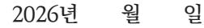

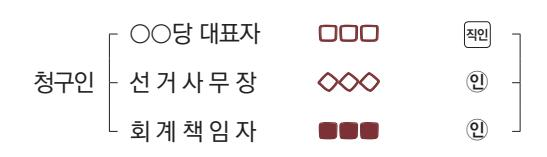

○○선거관리위원회 귀중

# 선거운동용 전화요금 정산 청구서

1. 인적사항

| 선 거 | 명  | 공명시장            | <b>시·강</b> 후보자명 <b>홍깅동</b> 소속정 |  | 소속정당명         | 000당 |
|-----|----|-----------------|--------------------------------|--|---------------|------|
| 처구이 | 성명 | 홍길동             | 「공직선거법」상 신분                    |  | 후보ᠵᢣ          |      |
| 성구인 | 주소 | 경기도 과천시 홍촌말로 44 | 연락처                            |  | 010-1234-4567 |      |

2. 정산대상

가. 유선·인터넷전화

| 설치장소     | 주 소       | 명 의 인 |                | 전화번호          | 설치구분      |
|----------|-----------|-------|----------------|---------------|-----------|
| 실시경조     | T T       | 성명    | 주민등록번호         | 신외신오          | 글시구군      |
|          |           | 000   | 123456-7890123 | 02-123-1234   | 유선(기존 사용) |
| 선거사무요 홍촌 | 경기도 과천시   |       | 123450-7850125 | 02-123-1235   | 유선(단기)    |
|          | 홍촌말로 44   |       | 123456-7890124 | 070-1234-5678 | 인터넷(기존사용) |
|          | (중앙동 2-3) |       | 123430-7030124 | 070-1234-5679 | 인터넷(단기)   |
|          |           | 합계    |                | Чсн           |           |

나. 휴대전화

|     | 정              | 비고          |               |                               |  |  |
|-----|----------------|-------------|---------------|-------------------------------|--|--|
| 명의인 | 주민등록번호         | 「공직선거법」상 신분 | 전화번호          |                               |  |  |
| 000 | 123456-7890123 | 후보자         | 010-1234-5678 | 까 준비지지 이것이 바다테니               |  |  |
|     | 123456-7890125 | 회계책임자       | 010-1234-5679 | ※ 후보자가 요금을 부담하는 휴대전화만 기재함. |  |  |
| 합계  |                |             | 2CH           | ㅠ네근죄근 기세금.                    |  |  |

2026년 6월 3일 실시한 제9회 전국동시지방선거에 있어 선거운동기간중(2026. 5. 21.~ 6. 2.) 선거운동에 사용한 전화요금의 정산을 청구하오니 정산내역서(전화번호별 통화료 정산내역 포함)를 발급하여 주시기 바랍니다.

<!-- page: 146 -->

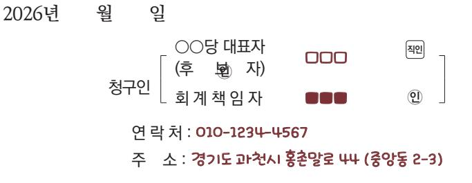

구비서류 1. 명의인의 신분증 사본 1부.

2. 선거사무장 등 전화요금 정산 관련 위임장 1부.(후보자 등의 일괄 정산 청구에 한함)

○○통신회사 귀중

# 선거사무장 등 전화요금 정산 관련 위임장

- 1. 선 거 명 : OO시장선거
- 2. 소속정당명 : **OO당**
- 3. 후보자명: 000
- 4. 위 임 내 역

| 위 임 을 받 은 자                                | 홍길동                                   | 주민등록 번 호 | 123456-7890124 |  |  |  |
|-----------------------------------------------|---------------------------------------|-------------|----------------|--|--|--|
| 주 소                                           | 경기도 과천시 홍촌말로 44 (중앙동 2-3)             |             |                |  |  |  |
| 사용용도                                          | 통신회사 제출용                              |             | 선거운동용 전화요금 정산  |  |  |  |
| 관 계                                           | ษ๚우วษ                                 | 위임사유        | 인지군승승 인외츠ם 성인  |  |  |  |
| 본인은 선거운동용 전화요금 정산과 관련하여 일체의 권한을 위 사람에게 위임합니다. |                                       |             |                |  |  |  |
| 2026년 월 일                                     |                                       |             |                |  |  |  |
| 위 임 자                                         | OOO ① 주민등록번호 123456-789012 |             |                |  |  |  |
| 주 소                                           | 경기도 과천시 홍촌말로 44 (중앙동 2-3)             |             |                |  |  |  |

구비서류 1. 인감증명서 1부.

2. 위임자의 신분증 사본 1부.

○○선거관리위원회 귀중

이 이 당 대표자 청구인 [ (후 보 자) 회 계 책 임 자 직인 ହ (P) 

청 구 금 액

통화료

56,670

71,120

500,000

200,000

263,890

100,000

청구액(C=A-B)

56,670

1,191,680

<!-- page: 147 -->

기본료

10,000

10,000

20,000

2. 기존 사용 전화번호별 직전 3개월간의 통화요금고지서 사본 각 1부.

붙임: 1. 통신회사에서 통보받은 선거운동용 전화요금 정산 결과 통보서 각 1부.

웤 잌 2026년

7. 전화요금 보전청구총액 : 금일백삼십만일천육백팔십원(₩1,301,680)

100,000 (200,000/90일)×13일=28,880 71,120 070-1234-5678 010-1234-5678 300,000 (250,000/90일)×13일=36,110 263,890

| 6. 기존 사용 전화번호별 전화통화료 보전청구 세부내역 |  |
|--------------------------------|--|
|--------------------------------|--|

통신회사 요금 정산액 (A)

<!-- page: 148 -->

100,000

| (단위     | : | 원) |
|---------|---|----|
| · — · · |   |    |

비고

10원 미만은

걸사함

| 5. 전화번호별 전화통화료 보전청구 내역        |
|-------------------------------|
| フ, セイセエュ セイ 0 イエ エ し 0 1 11 イ |

2. 소속정당명 : OO당

성 명

000

000

 $\Delta\Delta\Delta$ 

 $\Delta\Delta\Delta$ 

000

합 계

3. 후보자명 : 000

전화번호

02-123-1234

02-123-1235

070-1234-5678

070-2345-5679

010-1234-5678

010-1234-5679

전화번호

02-123-1234

- 4. 정산대상기간 : 2026. 5. 21. ~ 2026. 6. 2.

정 산 대 상

설치장소

또는 신분

선거사무오

66

66

66

후보자

회계책임자

구 분

유선(기존사용)

유선(단기)

인터넷(기존사용)

인터넷(단기)

기존 사용

임차

6CH

(단위:원)

문 자

메시지

8,000

8,000

8,000

24,000

통 화

연결음

2,000

2,000

2,000

6,000

전화요금 보전청구내역서 1. 선 거 명 : OO시장선거

계

56,670

550,000

71,120

250,000

263,890

<!-- page: 149 -->

110,000

1,301,680

설치비

30,000

30,000

60,000

직전 3개월간의 평균통화료(B)

(300,000/90일)×13일=43,330

작성에시 5

선거비용 보전 안내서

(단위:원)

작성예시 6

선거사무관계자 수당·실비 지급명세서

지급일: 2026.

|           |     |                         |          |              |           |         | 실비 🕒    |             | -1-7                              | 지급               | 근로자              | 시스러아          |                 |                 |
|-----------|-----|-------------------------|----------|--------------|-----------|---------|---------|-------------|-----------------------------------|------------------|------------------|---------------|-----------------|-----------------|
| 직위        | 성명  | 주 소                     | 생년 월일 | 전화 번호     | 수당 つ   | 일비      | 식비      | 교 통 비 | 지급 기간 (일수)                  | 금액 ⓒ (ㅋ+ⓒ) | 부담 보험료 (2) | 실수령액 (ⓒ-ⓒ) | 입금증 일련 번호 | 수령인 서명 날인 |
| 선거 사무장 | 홍길동 | 이어도 이어시 이어로 76 | 55.1.2.  | 123- 4567 | 1,300,000 | 325,000 | 325,000 |             | 5.21.~6.2. (13 0 2) | 1,950,000        | 11,700           | 1,938,300     | 1               | 홍긷동             |
| 회계 책임자 | 김이동 | 00도 00시 00로 11 | 67.2.3.  | 123- 5678 | 1,300,000 | 325,000 | 325,000 |             | 5.21.~6.2. (13 0 2) | 1,950,000        | 11,700           | 1,938,300     | 2               | 김이동             |
| 선거 사무원 | 김삼동 | 이어도 이어시 이어로 15 | 80.3.3.  | 123- 1234 | 780,000   | 325,000 | 325,000 |             | 5.21.~6.2. (13 0 2) | 1,430,000        | 7,020            | 1,422,980     | 3               | 김상동             |
| ત્રા      | 3명  |                         |          |              | 3,380,000 | 975,000 | 975,000 |             |                                   | 5,330,000        | 30,420           | 5,299,580     |                 |                 |

주 1. 선거사무관계자가 지정한 예금계좌에 입금·지급하고 그 입금증 사본을 지급명세서와 함께 제출함.

2. 선거사무관계자의 수당·실비 수령 여부 확인을 위해 "수령인 서명날인"란에 서명·날인을 반드시 받음.

- 3. "수당⑦" 에는 선거사무관계자가 부담하는 고용보험료를 포함한 금액을 기재
- 4. 일비는 선거사무소·선거연락소의 사무소 소재지 관할구역 내에서 활동하는데 소요되는 경비이며, 교통비는 철도, 선박, 항공 등을 이용한 경우에 한하여 실비지급기준 이내의 금액을 지급할 수 있음.
- 5. 선거사무관계자에게 교통편의를 제공한 경우 회계책임자는 해당 금액을 공제한 금액을 지급하고, 공제액은 "일비"란의 ( )안에 기재함.

\*단, 선거운동 중 선거운동장소 이동을 위한 교통편의를 제공할 경우 공제대상이 아님.

- 6. 식비는 당일 별도의 식사를 제공한 경우에는 제공된 식수만큼을 공제(1식 기준금액인 8,330원을 초과하여 제공한 경우 실제 제공한 식비를 공제)하고 지급하고, 공제액을 "식비"란의 ( )안에 기재함
- 7. "근로자 부담 보험료@"는 "신고한 보수총액× 0.9%" 이나, 보전대상 "근로자 부담 보험료"는 "수당 × 0.9%" 임을 유의(※ '실비©'는 제외)

# 점자형 선거공보 등 부담비용 지급청구서

- 1. 선 거 명 : OO시장선거
- 2. 소속정당명 : OO당
- 3. 후보자명 : 000
- 4. 점자형 선거공보 등 작성·제출수량

|                | 점자형 선거공보      |                | 7              | 거자메레          |                |             |  |
|----------------|---------------|----------------|----------------|---------------|----------------|-------------|--|
| 작성·제출 부수(A) | 1부당 매수 (B) | 총매수 (C=A×B) | 작성·발송 부수(A) | 1부당 매수 (B) | 총매수 (C=A×B) | 저장매체 (개) |  |
| 100            | 10            | 1,000          | 100            | 10            | 1,000          | 100         |  |

<!-- page: 150 -->

5. 청구금액

(단위 : 원)

| 구 분           | 계         | 제작비 (한글인쇄료 포함) | 저장매체 디지털파일 전환비 | 운반비     | 수당·실비 ·산재보험료 |
|---------------|-----------|-------------------|-------------------|---------|-----------------|
| 점자형 선거공보      | 1,200,000 | 900,000           | 200,000           | 100,000 |                 |
| 점자형 선거공약서     | 1,100,000 | 900,000           | 200,000           |         |                 |
| 저장매체          | 630,000   | 200,000           | 400,000           | 30,000  |                 |
| 활동보조인 수당·실비 등 | 700,000   |                   |                   |         | 700,000         |
| 계             | 3,630,000 | 2,000,000         | 800,000           | 130,000 | 700,000         |

6. 수령계좌

| 예금주 | 금융기관명 | 관명 계좌번호     | 비고 |  |
|-----|-------|-------------|----|--|
| 000 | OO은행  | 123-45-5678 |    |  |

2026년 6월 3일 실시한 제9회 전국동시지방선거에서 (점자형 선거공보)·(저장매체)·(점자형 선거공약서)·(활동보조인 수당·실비 및 산재보험료)에 대한 부담비용을 위와 같이 청구합니다.

붙임 1. 정치자금 수입·지출부 사본 1부.

2. 활동보조인 수당·실비 지급 명세서 1부

- 3. 영수증 등 증빙서류 사본 1부.
- 4. 정치자금 수입·지출 통장(수령계좌 통장) 사본 1부.

2026년 월 일

| ○○당 대표자 (후 보 자) 청구인 - 선 거 사 무 장 | 000                                | ম্ থি |
|---------------------------------------|------------------------------------|----------|
| 청구인 - 선거사무장                           | $\diamond\diamond\diamond\diamond$ | ହା -     |
| _ 회계책임자                               | 000                                | ହା _     |

○○선거관리위원회 귀중

# 후보자 반환기탁금 및 보전비용 인계·인수서

1. 인계자

| 직 위 | 성 명 | 주민등록번호         | 주 소        | 전화번호         |
|-----|-----|----------------|---------------|--------------|
| 후보자 | ○○○ | 123456-7890123 | ○○시 ○○구 ○○로 1 | 02-1234-5678 |

2. 인수자(정당, 공익법인, 사회복지시설)

| 기 관 명  | 직 위 | 성 명 | 주민등록번호         | 주 소           | 전화번호         |
|--------|-----|-----|----------------|---------------|--------------|
| ○○공익법인 | 대표자 | ○○○ | 789012-3456789 | ○○시 ○○구 ○○로 2 | 02-5678-1234 |

3. 인계·인수사항

| 인계·인수금액    | 인계·인수방법                 |
|------------|-------------------------|
| 30,000,000 | ○○은행 123-45-56789로 계좌입금 |

「정치자금법」 제58조제1항 및 「정치자금사무관리 규칙」 제48조제1항의 규정에 의하여 후보자가 후원회의 후원금 또는 정당의 지원금으로 기탁금을 납부하거나 선거비용을 지출하여 반환·보전받은 비용 중 후보자 자산을 공제한 금액을 위와 같이 인계·인수합니다.

<!-- page: 151 -->

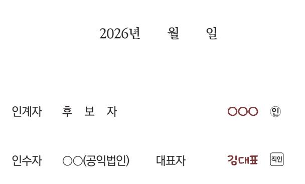

주 1. 인계·인수서는 3부를 작성하여 인계·인수자가 각각 1부씩 보관하고 1부를 선거관리위원회에 제출하여야 합니다.

2. 인계금액은 계좌이체 또는 수표발행 등 실명이 확인되는 방법으로 인계하여야 합니다.

# 반환기탁금 및 보전비용 정산서

| 내 용                                                                                                                                           | 금 액(원)      |
|--------------------------------------------------------------------------------------------------------------------------------------------------|-------------|
| A. 반환기탁금(후원회의 후원금 또는 정당의 지원금으로 기탁금을 납부한 경우 발생이자 포함)                                                                                           | 50,000,000  |
| B. 보전비용                                                                                                                                          | 100,000,000 |
| C. 「후보자 자산계정」의 선거비용과목 지출총액 - 확정된 미지급 채무 포함                                                                                                    | 70,000,000  |
| D. 「후보자 자산계정」의 선거비용외 정치자금과목 지출총액 - 확정된 미지급 채무 포함 - 선거관리위원회에 납부한 기탁금 지출금액 포함                                                                | 75,500,000  |
| E. 「후보자 자산계정」의 선거사무소·연락소 임차보증금 등 자산가치가 있는 비용                                                                                                  | 5,000,000   |

<!-- page: 152 -->

| F. 「후보자 자산계정」의 점자형 선거공보(통상거래가격 범위 내 금액), 저장매체, 점자형 선거공약서, 활동보조인 수당·실비(법정 수당·실비 범위 내 금액) 등 선거관리위원회로부터 받은 부담비용                               | 15,000,000  |
| G. 「후보자 자산계정」의 위법비용                                                                                                                              | 500,000     |
| H. 「후보자 자산계정」에 후보자 자신(제3자 제외)의 차량·장비·물품 등을 사용하고 통상적인 거래가격 또는 임차가격을 회계장부의 수입·지출계정에 기재한 경우 등 선거사무소(선거연락소 제외)에서 후보자가 실제로 지출하지 아니한 비용 등의 총액 | 5,000,000   |
| I = 정당지원금, 후원회기부금으로 「후보자 자산계정」의 차입금을 변제한 비용                                                                                                   | 0           |
| J = 인계대상 비용 [A+B-(C+D-E-F-G-H-I)]                                                                                                                | 30,000,000  |

※ 점자형선거공약서 발송용 봉투제작비와 우편발송비용은 보전대상 선거비용

| 구분     |        |             |             |            |             |    |    |
|--------|--------|-------------|-------------|------------|-------------|----|----|
|        |        | 수입          | 선거비용        | 선거비용외      | 소계          | 잔액 | 비고 |
|        | 후보자 자산 | 145,500,000 | 70,000,000  | 75,500,000 | 145,500,000 | 0  |    |
| 후원회기부금 |        | 65,000,000  | 50,000,000  | 15,000,000 | 65,000,000  | 0  |    |
| 정당의    | 보조금    | 0           | 0           | 0          | 0           | 0  |    |
| 지원금    | 보조금외   | 0           | 0           | 0          | 0           | 0  |    |
| 합계     |        | 210,500,000 | 120,000,000 | 90,500,000 | 210,500,000 | 0  |    |

<!-- page: 153 -->

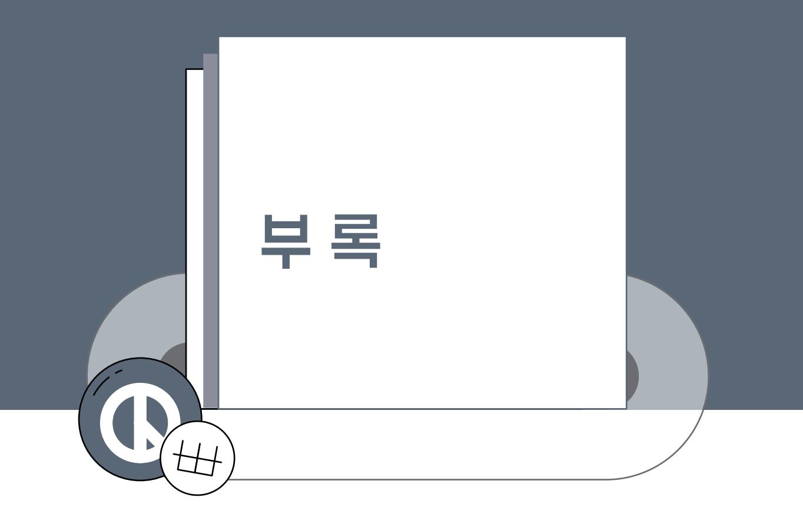

- **1.** 선거비용 및 보전항목 일람표
- **2.** 통상거래가격 결정내역

<!-- page: 154 -->

- **3.** 반환기탁금 및 보전비용의 인계비용 계산프로그램 사용자 매뉴얼
- **4.** 정치자금 회계관리 프로그램정치자금 수입·지출부 출력 방법
- **5.** 선거사무관계자 고용, 산재보험 가입 안내

# **부록1 선거비용 및 보전항목 일람표**

이 예시는 회계책임자 등의 선거비용에 대한 이해를 돕기 위한 참고자료로 작성한 것으로, 법규개정이나 선례변경 등에 따라 내용이 변경될 수 있음.

| 공직선거법         |                                                                                                                                                                                |    | 선거비용 |           | 비용으로      |
|---------------|--------------------------------------------------------------------------------------------------------------------------------------------------------------------------------|----|------|-----------|-----------|
| 조 항           | 지 출 항 목                                                                                                                                                                        | 보전 | 미보전  | 선거 비용외 | 계산할 대상 |
| 제56조          | 후보자 기탁금                                                                                                                                                                        |    |      |           |           |
| (기탁금)         | 기탁금 납부비용                                                                                                                                                                       |    |      | ○         |           |
| 제57조의3        | 당내경선운동                                                                                                                                                                         |    |      |           |           |
| (당내경선 운동)  | 정당이 당원과 당원이 아닌 자에게 투표권을 부여하여 실시하는 당내경선에 있어서 위법경선운동에 소요된 비용                                                                                                                  |    | ○    |           |           |
|               | 예비후보자등록 후 실시하는 당내경선을 위하여 지출하는 경선 운동비용                                                                                                                                       |    |      | ○         |           |
| 제59조          | 인터넷 홈페이지·명함                                                                                                                                                                    |    |      |           |           |
| (선거운동 기간)  | 인터넷 홈페이지 또는 그 게시판·대화방 등에 글이나 동영상 등을 게시하는 방법의 선거운동에 소요된 비용                                                                                                                   |    | ○    |           |           |
|               | 선거운동을 위한 인터넷 홈페이지(모바일 앱 포함) 제작·관리· 업데이트 비용                                                                                                                                  |    | ○    |           |           |
|               | 예비후보자가 개설한 홈페이지에 글 등을 게시하기 위한 스마트 폰 구입비                                                                                                                                     |    | ○    |           |           |
|               | 모바일 웹 또는 모바일 앱으로 연결할 때 선거운동정보를 보여주는 페이지 제작·관리비용, 모바일 앱 연결을 위한 스마트폰 애플리케이션 제작·관리비용, 기존의 후보자 홈페이지를 모바일 웹 또는 모바일 앱으로 보여주는 시스템 제작비용, 홈페이지 게시를 목적으로 사용하는 통신기록 통계화 사용 비용 |    | ○    |           |           |

<!-- page: 155 -->

|               | 선거사무소 등에 자원봉사자인 인터넷 홈페이지 관리자를 상주 시키고 그에게 지급한 인건비 ⇒ 위법비용                                                                                                                  |    | ○    |           |           |
|               | (예비)후보자등록 전에 입후보예정자로서 선거일전 180일부터 제작·배부한 선거운동용 명함 제작비                                                                                                                       |    | ○    |           |           |
| 제60조의2        | 예비후보자 기탁금                                                                                                                                                                      |    |      |           |           |
| (예비후보자 등록) | 기탁금 납부비용                                                                                                                                                                       |    |      | ○         |           |

| 공직선거법                 | 지 출 항 목                                                                                                                 |  | 선거비용 |           | 비용으로      |
|-----------------------|-------------------------------------------------------------------------------------------------------------------------|--|------|-----------|-----------|
| 조 항                   |                                                                                                                         |  | 미보전  | 선거 비용외 | 계산할 대상 |
| 제60조의3                | 예비후보자의 선거사무소 설치                                                                                                         |  |      |           |           |
| (예비후보자 등의 선거운동) | 개인 사무실 등에 선거사무소를 설치한 경우, 전기료·수도료 기타 유지비로서 선거사무소 설치 전에 통상적으로 지급하여 오던 금액을 초과하는 비용 ※ 통상적으로 지급하여 오던 비용은 선거비용외 정치자금 |  | ○    |           |           |
|                       | 신규로 개설한 선거사무소의 전기료·수도료 기타 유지비                                                                                           |  | ○    |           |           |
|                       | 통상적인 범위 내에서 선거사무소를 방문하는 사람에게 제공한 다과류 구입비                                                                             |  | ○    |           |           |
|                       | 선거사무소를 방문하는 사람에게 제공하기 위한 컵라면, 국수, 치킨, 담배, 주류 구입비 ⇒ 위법비용                                                           |  | ○    |           |           |
|                       | 선거사무소를 방문하는 사람에게 제공하기 위한 안마의자, 어린이 놀이시설(놀이기구) 구입비 ⇒ 위법비용                                                          |  | ○    |           |           |
|                       | 선거사무소 외의 유사기관 (전화홍보를 위한 별도의 사무소 등) 임차·설치·유지비 ⇒ 위법비용                                                               |  | ○    |           |           |
|                       | 예비후보자 선거사무관계자의 수당·실비                                                                                                    |  | ○    |           |           |
|                       | 예비후보자 활동보조인의 수당·실비 ※ 후보자가 예비후보자로서 선임하였던 활동보조인 수당·실비는 「부담 비용」에 포함됨.                                                |  |      | ○         |           |
|                       | 선거사무소의 임차료, 선거사무소 등을 천막 등으로 설치한 경우 설치료                                                                               |  |      | ○         |           |
|                       | 선거사무소의 커튼 구입비, 차광용 또는 외부차단용 선팅비, 화분 구입 등 인테리어비                                                                       |  |      | ○         |           |
|                       | 책상과 의자 등 OA구입·설치비                                                                                                       |  |      | ○         |           |
|                       | 칸막이 등 내부구조물 설치 및 철거비 등 내부 수리비                                                                                           |  |      | ○         |           |
|                       | TV, 복사기, 전화기, 프린터, 정수기, 냉·난방장치 등 설치·유지· 구입·임차비                                                                       |  |      | ○         |           |
|                       | 선거구역 현황판 등 각종 게시판 제작비                                                                                                   |  |      | ○         |           |
|                       | 각종 인영·고무인 등 제작비                                                                                                         |  |      | ○         |           |
|                       | 선거사무소에 사용하는 사무용 문구류 구입비                                                                                                 |  |      | ○         |           |
|                       | 선거사무소의 생수·휴지·쓰레기봉투 구입비                                                                                                  |  |      | ○         |           |

<!-- page: 156 -->

| 공직선거법       | 지 출 항 목                                                                               | 선거비용 |     | 선거  | 비용으로      |
|-------------|---------------------------------------------------------------------------------------|------|-----|-----|-----------|
| 조 항         |                                                                                       | 보전   | 미보전 | 비용외 | 계산할 대상 |
| 제60조의3      | 선거사무소에서 사용할 침구류 구입비                                                                   |      |     | ○   |           |
| (예비후보자      | 선거운동과 관련한 도서 구입비                                                                      |      |     | ○   |           |
| 등의 선거운동) | 선거사무소의 냉·난방용 연료비                                                                      |      |     | ○   |           |
|             | 선거사무소 내부 선거홍보물 제작·첩부·게시비                                                              |      |     | ○   |           |
|             | 선거사무소의 신문·잡지 등 구독료                                                                    |      |     | ○   |           |
|             | 선거사무소 내 선거방송 모니터용 종합유선방송의 설치·유지비                                                      |      |     | ○   |           |
|             | 선거사무소 이전비                                                                             |      |     | ○   |           |
|             | 개소식에 참석할 수 있는 정당의 간부·당원 또는 선거사무관계자 들에게 개소식시 통상적인 범위 내에서 선거사무소 등 안에서 제공한 개소식 다과비 |      |     | ○   |           |
|             | 선거사무소에서 선거운동과 관련 없는 단순 잡무처리(차 대접, 청소 등)를 담당한 노무자에게 지급한 인부임                         |      |     | ○   |           |
|             | 예비후보자 법정 간판·현판·현수막 (간판 등이라 함)                                                      |      |     |     |           |
|             | 선거사무소의 간판 등 제작·설치·철거비                                                                 |      | ○   |     |           |
|             | 건물 외벽 면에 현수막 설치를 위해 지급된 정당한 사용료                                                       |      | ○   |     |           |
|             | 과거 선거 시 사용했던 간판 등을 재사용하는 경우 그 통상적인 제작·설치비                                          |      | ○   |     |           |
|             | 간판 등을 교체·보완하는 경우 제작·설치비                                                               |      | ○   |     |           |
|             | 예비후보자 명함(길이 9cm 너비 5cm 이내)                                                            |      |     |     |           |
|             | 명함(점자형 포함) 제작비                                                                        |      | ○   |     |           |
|             | 허위사실이 게재된 명함을 제작하여 일부만 배부하고 중지한 경우 명함 전체 제작비용 ⇒ 위법비용                            |      | ○   |     |           |
|             | 예비후보자 전자우편·전화·문자메시지                                                                   |      |     |     |           |
|             | 인터넷 설치·유지비                                                                            |      | ○   |     |           |
|             | 대량 전자우편발송용 소프트웨어 구입비                                                                  |      | ○   |     |           |
|             | 전자우편 디자인 및 편집비용                                                                       |      | ○   |     |           |
|             | 홈 허브 장비 임대료 등 데이터 사용요금                                                                |      | ○   |     |           |

<!-- page: 157 -->

|             | 예비후보자의 모바일 메신저(카카오톡 등) 전송용 동영상 제작비용                                                   |      | ○   |     |           |
|             | 전화 설치비                                                                                |      |     |     |           |
|             | - 임시전화 설치·기본료                                                                         |      | ○   |     |           |

| 공직선거법        | 지 출 항 목                                                                                                                           |  | 선거비용 |           | 비용으로      |
|--------------|-----------------------------------------------------------------------------------------------------------------------------------|--|------|-----------|-----------|
| 조 항          |                                                                                                                                   |  | 미보전  | 선거 비용외 | 계산할 대상 |
| 제60조의3       | - 임시전화기 임차료                                                                                                                       |  | ○    |           |           |
| (예비후보자 등의 | 전화 통화료(선거운동용 전화기는 임시전화 사용을 원칙으로 함)                                                                                                |  |      |           |           |
| 선거운동)        | - 송·수화자 간 직접 통화하는 방식으로 전화 선거운동을 하는데 소요된 전화(휴대전화 포함) 통화료                                                                        |  | ○    |           |           |
|              | 문자메시지 전송                                                                                                                          |  |      |           |           |
|              | - 문자메시지 전송에 소요된 비용                                                                                                                |  | ○    |           |           |
|              | - 예비후보자가 자동 동보통신의 방법으로 전송하는 문자메시지를 법정횟수 8회 이내에서 전송한 경우 그 전송에 소요된 비용                                                            |  | ○    |           |           |
|              | - 자동 동보통신의 방법으로 전송하는 문자메시지를 법정횟수 8회를 초과하여 전송한 경우 그 초과 전송에 소요된 비용 ⇒ 위법비용 ※ 예비후보자로서 법정횟수 8회를 모두 전송한 경우 후보자로서는 전송할 수 없음. |  | ○    |           |           |
|              | - 정당한 이유 없이 신고한 전화번호가 아닌 전화번호를 사용하여 자동 동보통신의 방법으로 문자메시지를 전송하는데 소요된 비용 ⇒ 위법비용                                             |  | ○    |           |           |
|              | 예비후보자홍보물(세대수의 10/100 이내)                                                                                                          |  |      |           |           |
|              | 예비후보자홍보물 제작비(기획·도안료, 인쇄료)                                                                                                         |  | ○    |           |           |
|              | 홍보물 봉투 제작비, 발송 소모품비, 발송 우편요금, 반송된 경우의 재발송 우편요금                                                                                 |  | ○    |           |           |
|              | 예비후보자홍보물 발송을 전문업체와 계약하고 지불한 홍보물 발송비                                                                                            |  | ○    |           |           |
|              | 예비후보자홍보물 발송을 위한 라벨첩부, 봉투 봉함 작업 등에 종사한 인부에게 지급한 역무제공에 상응하는 통상적인 인건비                                                             |  | ○    |           |           |
|              | 예비후보자홍보물 발송을 위한 세대주명단 교부비                                                                                                         |  |      | ○         |           |
|              | 예비후보자 어깨띠 및 표지물                                                                                                                   |  |      |           |           |
|              | 예비후보자의 어깨띠·표지물 제작비 - 어깨띠 : 길이 240㎝ 너비 20㎝ 이내 - 표지물 : 길이 100㎝ 너비 100㎝ 이내 ※ 후보자 때에도 계속 사용한 경우 선거운동기간에 대해 일할계산하여 보전      |  | ○    |           |           |

<!-- page: 158 -->

| 공직선거법          | 지 출 항 목                                                                                                                 | 선거비용 |     | 선거  | 비용으로      |
|----------------|-------------------------------------------------------------------------------------------------------------------------|------|-----|-----|-----------|
| 조 항            |                                                                                                                         | 보전   | 미보전 | 비용외 | 계산할 대상 |
| 제60조의4         | 예비후보자공약집                                                                                                                |      |     |     |           |
| (예비후보자 공약집) | 예비후보자공약집 발간비용                                                                                                           |      |     | ○   |           |
| 제61조 (선거운동  | 후보자의 선거사무소 (선거연락소 포함, 이하 '선거사무소 등'이라 함)                                                                              |      |     |     |           |
| 기구의 설치)        | 개인 사무실 등에 선거사무소를 설치한 경우, 전기료·수도료 기타 유지비로서 선거사무소 설치 전에 통상적으로 지급하여 오던 금액을 초과하는 비용 ※ 통상적으로 지급하여 오던 비용은 선거비용외 정치자금 | ○    |     |     |           |
|                | 신규로 개설한 선거사무소 등의 전기료·수도료 기타 유지비                                                                                         | ○    |     |     |           |
|                | 통상적인 범위 내에서 선거사무소 등을 방문하는 사람에게 제공한 다과류 구입비                                                                           |      | ○   |     |           |
|                | 선거사무소 등을 방문하는 사람에게 제공하기 위한 컵라면, 국수, 치킨, 담배, 주류 구입비 ⇒ 위법비용                                                         |      | ○   |     |           |
|                | 선거사무소 등을 방문하는 사람에게 제공하기 위한 안마의자, 어린이 놀이시설(놀이기구) 구입비 ⇒ 위법비용                                                        |      | ○   |     |           |
|                | 선거사무소·선거연락소 외의 유사기관(전화홍보를 위한 별도의 사무소 등) 임차·설치·유지비 ⇒ 위법비용                                                          |      | ○   |     |           |
|                | 선거사무소 등의 임차료, 선거사무소 등을 천막 등으로 설치한 경우 설치료                                                                             |      |     | ○   |           |
|                | 선거사무소 등의 커튼 구입비, 차광용 또는 외부차단용 선팅비, 화분 구입 등 인테리어 비용                                                                   |      |     | ○   |           |
|                | 책상과 의자 등 OA 임차·구입·설치비                                                                                                   |      |     | ○   |           |
|                | 선거사무소 등의 칸막이 등 내부 구조물 설치 및 철거 등 내부 수리비                                                                               |      |     | ○   |           |
|                | 선거사무소 등의 선거운동용 전화 키폰 공사비                                                                                                |      |     | ○   |           |
|                | 선거사무소 등에 전화이용 선거운동을 위하여 설비한 칸막이 설치비                                                                                  |      |     | ○   |           |
|                | 선거사무소 등의 TV, 복사기, 프린터, 냉·난방장치, 정수기 등 설치·유지·구입·임차비                                                                    |      |     | ○   |           |
|                | 선거구역 현황판 등 각종 게시판 제작비                                                                                                   |      |     | ○   |           |

| 공직선거법 조 항     |                                                                                                                                             | 선거비용 |     |           | 비용으로      |

<!-- page: 159 -->

|------------------|---------------------------------------------------------------------------------------------------------------------------------------------|------|-----|-----------|-----------|
|                  | 지 출 항 목                                                                                                                                     | 보전   | 미보전 | 선거 비용외 | 계산할 대상 |
| 제61조             | 선거사무소 등의 각종 인영·고무인 등 제작비                                                                                                                    |      |     | ○         |           |
| (선거운동 기구의 설치) | 선거사무소 등에 사용하는 사무용 문구류, 생수·휴지·쓰레기봉투· 침구류 구입비                                                                                              |      |     | ○         |           |
|                  | 선거운동과 관련된 도서 구입비                                                                                                                            |      |     | ○         |           |
|                  | 선거사무소 등의 냉·난방용 연료비                                                                                                                          |      |     | ○         |           |
|                  | 선거사무소 등의 내부 선거홍보물 제작·첩부·철거비                                                                                                                 |      |     | ○         |           |
|                  | 선거사무소 등의 신문·잡지 등 구독료                                                                                                                        |      |     | ○         |           |
|                  | 선거사무소 등의 선거방송 모니터용 종합유선방송의 설치·유지비                                                                                                           |      |     | ○         |           |
|                  | 선거사무소 등의 이전비                                                                                                                                |      |     | ○         |           |
|                  | 선거사무소 등을 방문하는 사람에게 제공하기 위한 커피 자동 판매기 임차비용                                                                                                |      |     | ○         |           |
|                  | 개소식에 참석할 수 있는 정당의 간부·당원들이나 선거사무관계자 들에게 개소식시 통상적인 범위 내에서 선거사무소 안에서 제공한 개소식 다과비                                                         |      |     | ○         |           |
|                  | 개소식 다과 제공을 위한 준비도구(쟁반, 접시, 일회용 젓가락, 숟가락 등)의 구입비                                                                                          |      |     | ○         |           |
|                  | 선거사무소 등에서 선거운동과 관련 없이 단순 잡무처리(차 대접, 청소 등)를 담당한 노무자에게 지급한 인부임 ※ 선거운동과 관련하여 선거사무관계자 외의 자에게 지급한 수당·실비 등은 명목 여하를 불문하고 위법비용으로서 선거비용에 해당 |      |     | ○         |           |
|                  | 선거사무소 등의 사설경비·보안장치 설치비                                                                                                                      |      |     | ○         |           |
|                  | 선거사무소 등의 간판·현판·현수막 (이하 '간판 등' 이라 함)                                                                                                      |      |     |           |           |
|                  | 간판 등의 제작·설치·철거비                                                                                                                             | ○    |     |           |           |
|                  | LED(동영상 표출은 제외)를 이용한 간판 등의 설치시 그 제작비용                                                                                                       | ○    |     |           |           |
|                  | 고층건물에 간판 등 설치·철거에 따른 특수 장비(크레인 등) 임차비용                                                                                                   | ○    |     |           |           |
|                  | 선거사무소 등 외벽에 간판 등의 설치공간이 없어 건물 옥상에 구조물을 설치하여 간판 등을 게시한 경우 그 구조물 설치비용                                                                      | ○    |     |           |           |
|                  | 현수막의 기획·도안과 현수막 제작을 별개의 업체와 계약한 경우 현수막 기획·도안료(제작비 통상거래가격 범위 내에서 보전)                                                                      | ○    |     |           |           |
|                  | 당초 설치계약에 철거비용이 포함되지 않은 경우 선거일 후에 선거사무소 간판 등의 철거에 소요된 비용(제작비 통상거래가격 범위 내에서 보전)                                                         | ○    |     |           |           |

| 공직선거법                                               |                                                                                                                                                                                                                                                 | 선거비용 | 선거  | 비용으로 |                  |
|-----------------------------------------------------|-------------------------------------------------------------------------------------------------------------------------------------------------------------------------------------------------------------------------------------------------|------|-----|------|------------------|
| 조 항                                                 | 지 출 항 목                                                                                                                                                                                                                                         | 보전   | 미보전 | 비용외  | 계산할 대상        |
| 제61조 (선거운동 기구의 설치)                            | 예비후보자 등록 후 제작·설치한 간판 등을 후보자 등록 후 계속 사용한 경우 간판 등의 제작·설치비 • 선거비용 : 간판 등의 제작·설치비 총액 • 보전대상 : 선거운동기간에 대해 일할 계산한 금액 ※ 예비후보자 때부터 사용한 간판 등(A)을 선거 운동기간 중 새로운 간판 등(B)으로 교체한 경우 A는 선거운동기간 중 게시기간동안 일할계산하여 보전하고, B는 통상거래가격 범위 내에서 전액 보전 | ○    |     |      | 제작· 설치비 총액 |

<!-- page: 160 -->

|                                                     | 선거운동기간에 간판 등을 교체·보완하여 실제 선거운동에 사용한 경우 그 교체·보완된 간판 등의 제작·설치·철거비                                                                                                                                                                               | ○    |     |      |                  |
|                                                     | 선거사무소 등 건물 외벽 면에 현수막 설치를 위해 지급된 정당한 사용료                                                                                                                                                                                                      | ○    |     |      |                  |
|                                                     | 선거사무소 등 내부현수막을 외부현수막으로 대체하여 게시하는 경우 그 현수막 게시비용                                                                                                                                                                                               | ○    |     |      |                  |
|                                                     | 선거사무소 등 외벽에 붙이는 선거벽보 코팅비                                                                                                                                                                                                                        | ○    |     |      |                  |
|                                                     | 통상거래가격에 포함된 현수막의 기획·도안료 외에 별도의 기획· 도안료                                                                                                                                                                                                       |      | ○   |      |                  |
|                                                     | 과거 선거 시 사용하였던 간판 등을 재사용하는 경우 그 통상적인 제작비                                                                                                                                                                                                      |      | ○   |      |                  |
|                                                     | 선거사무소와 선거연락소 외벽에 첩부하는 선거벽보에 별도의 형광설비를 하는데 소요된 비용                                                                                                                                                                                             |      | ○   |      |                  |
|                                                     | 법정 수량을 초과하여 첩부한 선거벽보·선거 공보·선거공약서의 설치·철거비 ⇒ 위법비용                                                                                                                                                                                           |      | ○   |      |                  |
|                                                     | 야간에 선거사무소 외벽을 비추기 위해 설치한 조명 설치비용                                                                                                                                                                                                                |      |     | ○    |                  |
|                                                     | 선거사무소 등의 간판 등을 비추기 위해 별도로 설치한 조명시설 설치비용                                                                                                                                                                                                      |      |     | ○    |                  |
|                                                     | 선거사무소 등 현수막 설치 시 원래 있던 다른 가게의 현수막 등을 이동 게시 및 원상회복 하는데 소요된 비용                                                                                                                                                                                 |      |     | ○    |                  |
|                                                     | 선거사무소 등 현수막 게시로 인해 주변 상가의 영업행위에 지장을 초래하여 통상의 손해배상 차원에서 정당하게 요구된 비용 ※ 「공직선거법」상 기부행위에 이르는 행위는 불가                                                                                                                                            |      |     | ○    |                  |
| 제64조 (선거벽보) 제65조 (선거공보) 제66조 (선거공약서) | 선거벽보, 선거공보, 선거공약서                                                                                                                                                                                                                               |      |     |      |                  |
|                                                     | 선거벽보·선거공보·선거공약서의 기획·도안료, 인쇄료                                                                                                                                                                                                                    | ○    |     |      |                  |
|                                                     | 선거벽보·선거공보·선거공약서를 통상거래가격보다 현저히 저가로 제작한 경우 ⇒ 실거래 가격을 보전함                                                                                                                                                                                    | ○    |     |      | 통상 거래 가격   |

| 공직선거법                              |                                                                                                                       | 선거비용 | 선거  | 비용으로      |                |
|------------------------------------|-----------------------------------------------------------------------------------------------------------------------|------|-----|-----------|----------------|
| 조 항                                | 지 출 항 목                                                                                                               | 보전   | 미보전 | 비용외       | 계산할 대상      |
| 제64조 (선거벽보) 제65조             | 선거벽보·선거공보·선거공약서를 통상거래가격보다 현저히 고가로 제작한 경우 ⇒ 통상거래가격을 보전함                                                          | ○    |     |           | 실거래 가격      |
| (선거공보) 제66조                     | 선거벽보·선거공보·선거공약서의 제작과 관련한 교정비용(기획· 도안료에 포함)                                                                         | ○    |     |           |                |
| (선거공약서)                            | 선거벽보·선거공보를 선거사무소·선거연락소 또는 각급 선거관리 위원회에 제출하는데 소요된 택배비 등 운반비 ※ 선거공약서를 선거사무소·선거연락소로 제출하는데 소요된 운반비는 '선거비용외 정치자금' | ○    |     |           |                |
|                                    | 내용이 완전하게 같지 않은 선거벽보·선거공보·선거공약서의 각 기획·도안료                                                                           | ○    |     |           |                |
|                                    | 오·훼손된 선거벽보의 재첩부를 위해 제3자에게 지급한 노무 제공에 상응하는 통상적인 인부임                                                                 | ○    |     |           |                |

<!-- page: 161 -->

|                                    | 선거공보·선거공약서에 게재하기 위한 항공사진 촬영비용                                                                                         | ○    |     |           |                |
|                                    | 선거벽보·선거공보를 선거관리위원회에 제출한 후 그 내용을 정정하거나 삭제하는데 소요되는 비용                                                                |      | ○   |           |                |
|                                    | 선거벽보·선거공보·선거공약서 제작업체가 일반과세사업자임에도 간이세금계산서를 발부받은 경우                                                                  |      | ○   |           |                |
|                                    | 후보자 측 잘못으로 선거벽보·선거공보를 재제작한 경우 잘못 제작된 선거벽보·선거공보 원고 기획·도안료, 인쇄료                                                      |      | ○   |           |                |
|                                    | 과거에 찍어둔 사진 또는 사진원판(필름)을 사용하여 선거벽보 게재용 사진을 제작한 경우 그 촬영비                                                             |      | ○   |           | 통상 거래 가격 |
|                                    | 후보자 또는 입후보예정자가 자필폰트를 제작하여 홍보물 디자인에 사용하는 등 선거운동을 위해 사용하는 경우 그 제작비용                                                  |      | ○   |           |                |
|                                    | 선거벽보·선거공보·선거공약서 제작매수를 초과하여 인쇄한 경우 그 초과 인쇄비                                                                         |      | ○   |           |                |
|                                    | 선거운동 준비행위인 정책·공약개발, 여론조사 기획 등에 소요된 컨설팅 비용 ※ 준비행위를 벗어난 각종 선거운동 관련 기획 비용은 선거비용에 해당                                |      |     | ○         |                |
| 제65조 (선거공보) 제66조 (선거 공약서) | 점자형 선거공보·점자형 선거공약서                                                                                                    |      |     |           |                |
|                                    | 점자형 선거공보·저장매체·점자형 선거공약서 작성(구입·제작) 비용                                                                               |      |     | ○ (부담) |                |
|                                    | 점자형 선거공보 및 저장매체를 선거사무소·선거연락소 또는 각급 선거관리위원회에 제출하는데 소요된 택배비 등 운반비                                                    |      |     | ○ (부담) |                |

| 공직선거법 조 항          |                                                                                     | 선거비용 | 선거비용 선거 | 선거         | 비용으로 계산할 대상 |
|-----------------------|-------------------------------------------------------------------------------------|------|---------|------------|-------------------|
|                       | 지 출 항 목                                                                             | 보전   | 미보전     | 비용외        |                   |
| 제65조 (선거공보)        | 점자형 선거공보에 선거명, 선거구명, 후보자성명 외에 선거공보의 내용 또는 그림 등이 들어간 경우 그 기획·도안료, 인쇄료             |      |         | 〇 (미부담) |                   |
| 제66조 (선거 공약서)      | 후보자 측 잘못으로 점자형 선거공보를 재제작한 경우 잘못 제작된 점자형 선거공보 원고 기획·도안료, 인쇄료                      |      |         | 〇 (미부담) |                   |
|                       | 점자형 선거공약서의 발송용 봉투 제작비와 우편발송비용                                                       | 0    |         |            |                   |
|                       | 점자형 선거공약서의 선거사무소 등으로의 배송비                                                           |      |         | 〇 (미부담) |                   |
| 제67조                  | 거리게시용 현수막                                                                           |      |         |            |                   |
| (현수막)                 | 현수막 제작·설치·철거비                                                                       | 0    |         |            |                   |
|                       | 통상적인 제작가격보다 현저히 저가로 제작한 경우 ⇒실거래가격 보전                                             | 0    |         |            | 통상 거래 가격    |
|                       | 통상적인 제작가격보다 현저히 고가로 제작한 경우 ⇒통상거래가격 보전                                            | 0    |         |            | 실거래 가격         |
|                       | 선거운동기간에 현수막을 교체하여 실제 선거운동에 사용한 경우 그 교체된 현수막의 제작·설치·철거비                           | 0    |         |            |                   |
|                       | 선거운동을 위하여 현수막을 이동 게시한 경우 현수막 제작계약에 포함되지 않은 별도의 이동게시에 소요된 통상적인 인건비                | 0    |         |            |                   |
|                       | 거리에 현수막을 게시할 수 있는 장소가 없어 부득이 개인소유 건물에 현수막을 설치하고 지급한 사용료                          | 0    |         |            |                   |
|                       | 현수막을 제작하였으나 후보자 측의 과실 또는 변심으로 실제 사용하지 않은 경우 그 제작비용                               |      | 0       |            |                   |
|                       | 선거사무관계자에게 수당·실비 외에 별도 지급한 현수막 이동비용 ⇒ 위법비용                                        |      | 0       |            |                   |

<!-- page: 162 -->

|                       | 투표참여 권유 현수막 제작·설치·철거비                                                               |      |         | 0          |                   |
| 제68조 (어깨띠 등 소품) | 어깨띠, 윗옷·모자 등 소품                                                                     |      |         |            |                   |
|                       | 「공직선거법」 제68조제1항에 규정된 선거사무관계자등이 사용한 어깨띠, 윗옷·모자 등 소품(이하에서 '어깨띠 등 소품' 이라고 함) 제작비 | 0    |         |            |                   |
|                       | 선거운동용 윗옷을 교체 사용하기 위해 여러 종류로 제작하여 선거운동에 실제 사용한 경우 그 제작비용                          | 0    |         |            |                   |
|                       | 선거운동기간에 어깨띠 등 소품을 교체하여 실제 선거운동에 사용한 경우 그 교체된 어깨띠 등 소품의 제작비                       | 0    |         |            |                   |

| 공직선거법          |                                                                                           | 선거비용 | 선거  | 비용으로 |           |
|----------------|-------------------------------------------------------------------------------------------|------|-----|------|-----------|
| 조 항            | 지 출 항 목                                                                                   | 보전   | 미보전 | 비용외  | 계산할 대상 |

<!-- page: 163 -->

| 제68조 (어깨띠 등 | 여러 종류로 제작한 어깨띠 등 소품 제작비(실제 착용 가능한 수 범위 내로 제작하여 사용한 경우)                                 | ○    |     |      |           |
| 소품)            | 선거운동 기간에 선거사무원이 한 손으로 지닐 수 있는 정도의 LED 네온 보드의 임차비용                                      | ○    |     |      |           |
|                | 근거리통신망(NFC) 기반의 홍보솔루션을 이용한 NFC 태그 및 디지털선거운동원증 제작비용                                     | ○    |     |      |           |
|                | LED 화면 부착 배낭 또는 허리띠 임차비용                                                                  | ○    |     |      |           |
|                | 선거운동기간 중 선거사무원이 사용하는 방수천 소재 공기주입식 마스코트(마스코트에 기호, 정당명, 성명, 구호 등 게재)의 제작 또는 임차비용      | ○    |     |      |           |
|                | 마스크에 기호 등을 새겨 선거운동용 소품으로 사용하는 경우 ※ 단순히 코로나 감염증 등 예방을 위하여 구입하여 사용하는 경우는 '선거비용외 정치자금' | ○    |     |      |           |
|                | 「공직선거법」 제68조제1항에 규정된 선거사무관계자 등이 아닌 자원봉사자가 사용할 소품을 무상으로 제공한 경우 그 제작·구입비 ⇒ 위법비용       |      | ○   |      |           |
|                | 스탠드형태의 스크린 풍선을 이용한 선거운동에 소요된 비용 ⇒ 위법비용                                                 |      | ○   |      |           |
|                | 어깨띠 등 소품을 제작하여 업체로부터 택배 등을 통하여 받은 경우 그 운반비용                                            |      |     | ○    |           |
| 제69조           | 신문광고                                                                                      |      |     |      |           |
| (신문광고)         | 신문광고 원고 기획·도안료                                                                            | ○    |     |      |           |
|                | 신문광고료(최저요금)                                                                               | ○    |     |      |           |
|                | 신문광고 대행사에 지급한 대행 수수료                                                                      | ○    |     |      |           |
| 제70조 (방송광고) | 방송광고                                                                                      |      |     |      |           |
|                | 방송광고 기획료(기획사에 의뢰하여 통상거래가격의 범위 내에서 지출한 기획비용)                                            | ○    |     |      |           |
|                | 방송광고의 제작비                                                                                 | ○    |     |      |           |
|                | 방송광고료(최저요금)                                                                               | ○    |     |      |           |
|                | 청각장애선거인을 위한 (한국수어)수화·자막 방영에 소요되는 비용                                                       | ○    |     |      |           |
|                | 방송광고 계약금을 지급한 후 실시하지 아니한 경우 계약금                                                           |      | ○   |      |           |

| 공직선거법                   |                                                                                                                  | 선거비용 | 선거  |     | 비용으로      |
|-------------------------|------------------------------------------------------------------------------------------------------------------|------|-----|-----|-----------|
| 조 항                     | 지 출 항 목                                                                                                          | 보전   | 미보전 | 비용외 | 계산할 대상 |
| 제71조 (후보자등의 방송연설) | 방송연설                                                                                                             |      |     |     |           |
|                         | 방송연설 기획료(기획사에 의뢰하여 통상거래가격의 범위 내에서 지출한 기획비용)                                                                   | ○    |     |     |           |
|                         | 방송연설의 제작비                                                                                                        | ○    |     |     |           |

<!-- page: 164 -->

|                         | 방송연설 방송료(최저요금)                                                                                                   | ○    |     |     |           |
|                         | 청각장애선거인을 위한 (한국수어)수화·자막 방영에 소요되는 비용                                                                              | ○    |     |     |           |
|                         | 전문가에게 지급한 방송연설 원고료                                                                                               | ○    |     |     |           |
|                         | 선거사무관계자에게 수당·실비 외에 별도 지급한 방송연설 원고료 ⇒ 위법비용                                                                     |      | ○   |     |           |
|                         | 방송연설을 위하여 전문분장업체에 지급한 분장비                                                                                        | ○    |     |     |           |
|                         | 방송사와 방송연설계약 체결 시 계약서에 포함된 후보자 분장 비용                                                                              | ○    |     |     |           |
|                         | 방송연설 계약금을 지급한 후 실시하지 아니한 경우 그 계약금                                                                                |      | ○   |     |           |
|                         | 신고하지 않고 실시한 방송연설 비용 ⇒ 위법비용                                                                                    |      | ○   |     |           |
|                         | 방송연설의 시연에 소요된 비용                                                                                                 |      |     | ○   |           |
|                         | 후보자가 방송연설을 위하여 웅변학원, 교습소 등에 지급한 비용                                                                               |      |     | ○   |           |
|                         | 후보자 자신이 직접 한 분장의 재료 구입비, 분장 보조자 사례금, 이발·미용료 등 분장비                                                             |      |     | ○   |           |
| 제79조                    | 공개장소에서의 연설·대담                                                                                                    |      |     |     |           |
| (공개장소 에서의            | 선거운동기간개시일부터 선거일 전일까지의 공개장소 연설·대담 차량 임차비                                                                       | ○    |     |     |           |
| 연설·대담)                  | 공개장소 연설·대담차량의 각종 홍보물 설치·철거비                                                                                      | ○    |     |     |           |
|                         | 공개장소 연설·대담차량의 홍보물 설치와 관련한 기획·도안료 (제작비 통상거래가격 범위 내에서 보전)                                                       | ○    |     |     |           |
|                         | 공개장소 연설·대담용 차량 래핑비                                                                                               | ○    |     |     |           |
|                         | 공개장소 연설·대담차량 기사인부임                                                                                               | ○    |     |     |           |
|                         | 공개장소 연설·대담용 차량의 고장으로 다른 차량을 임차하면서 홍보물을 교체하기 위해 1일2대를 동시에 임차한 경우의 임차비 ※ 같은 날 교체 전·후로 2대를 모두 사용하였더라도 1대분만 보전 | ○    |     |     |           |
|                         | 공개장소 연설·대담용 연단 제작비                                                                                               | ○    |     |     |           |
|                         | 공개장소 연설·대담의 운영을 위하여 임차한 발전기 임차비                                                                                  | ○    |     |     |           |
|                         | 유료주차장을 공개장소 연설·대담장소로 사용한 경우 그 사용료                                                                                | ○    |     |     |           |

| 공직선거법 조 항  |                                                                                             | 선거비용 | 선거  | 비용으로 |           |
|---------------|---------------------------------------------------------------------------------------------|------|-----|------|-----------|
|               | 지 출 항 목                                                                                     | 보전   | 미보전 | 비용외  | 계산할 대상 |
| 제79조 (공개장소 | 공개장소 연설·대담차량의 유류비, 유료 통행료, 섬 지역에 도선 하였을 경우 도선료                                           | ○    |     |      |           |

<!-- page: 165 -->

| 에서의           | 업체로부터 연설·대담용 차량을 받기 위한 탁송비                                                                  |      |     | ○    |           |
| 연설·대담)        | 녹화기 임차비                                                                                     |      |     |      |           |
|               | - 무선마이크, 앰프, 오디오 장치 등 각종 확성장치                                                               | ○    |     |      |           |
|               | - 멀티큐브, 멀티비전, 점보트론, 액정 빔 프로젝션 확성장치 등 각종 녹화기                                              | ○    |     |      |           |
|               | - 녹화기 운반용 차량                                                                                | ○    |     |      |           |
|               | - 인공위성을 이용한 녹화기의 영상물 방영에 소요되는 비용인 위성채널 위성중계·영상촬영 차량의 운영비와 인건비, 위성 수신 장치 설비비용          | ○    |     |      |           |
|               | 로고송 제작비                                                                                     |      |     |      |           |
|               | - 로고송 사용에 필요한 저작재산권료, 저작인격권료                                                                | ○    |     |      |           |
|               | - 로고송 제작업체가 한국음악저작권 협회에 직접 저작재산권료를 지급함에 따라 발생한 부가가치세                                     | ○    |     |      |           |
|               | - 로고송 제작에 소요되는 스튜디오 사용료, CD 제작비                                                             | ○    |     |      |           |
|               | 공개장소 연설·대담 시 사용하는 녹화기용 영상 홍보물의 CF· 애니메이션 등 기획·도안료, 제작비                                   | ○    |     |      |           |
|               | 전문가에게 지급한 공개장소 연설 원고료                                                                       | ○    |     |      |           |
|               | 예비용 확성장치를 실제 사용한 경우 그 임차비                                                                   | ○    |     |      |           |
|               | 공개장소 연설·대담차량에 설치된 녹화기를 통하여 방영하는 홍보물에 수화통역을 함께 방영하는 경우 수화통역자에게 지급한 역무제공에 상응하는 통상적인 인건비 | ○    |     |      |           |
|               | 공개장소에서 연설·대담을 하는 때에 수화통역자가 함께 차량에 탑승하여 수화통역을 한 경우 수화통역자에게 지급한 역무제공에 상응하는 통상적인 인건비     | ○    |     |      |           |
|               | 전문성우의 음성으로 후보자의 공약·경력 등을 안내·설명하는 방법으로 제작한 녹음물의 경우 전문성우의 인건비와 녹음에 소요되는 비용              | ○    |     |      |           |
|               | 래핑을 위하여 차량을 개조하게 될 경우 그에 소요된 비용(구조물 설치비 포함)                                              | ○    |     |      |           |
|               | 공개장소 연설·대담차량의 유세로봇, 홍보마네킹 설치비                                                               | ○    |     |      |           |
|               | 연설·대담차량의 LCD 영상상영을 위한 노트북 임차비용                                                              | ○    |     |      |           |

| 공직선거법         |                                                                                                                   |    | 선거비용 | 선거  |                | 비용으로 |
|---------------|-------------------------------------------------------------------------------------------------------------------|----|------|-----|----------------|------|
| 조 항           | 지 출 항 목                                                                                                           | 보전 | 미보전  | 비용외 | 계산할 대상      |      |
| 제79조 (공개장소 | 후보자의 배우자를 연설·대담차량 기사로 고용하고 지급한 기사 인부임                                                                          | ○  |      |     |                |      |
| 에서의           | 공개장소 연설·대담차량 녹음기의 배터리 교체비용                                                                                        | ○  |      |     |                |      |
| 연설·대담)        | 후보자가 자신의 차량을 사용하거나 배우자·소속 정당의 차량을 무상으로 제공 또는 대여받아 공개장소 연설·대담차량으로 사용한 경우                                     |    | ○    |     | 통상 거래 가격 |      |
|               | 선거운동을 위하여 공개장소 연설·대담용 차량을 도색한 경우 그 도색비                                                                         |    | ○    |     |                |      |

<!-- page: 166 -->

|               | 중앙당이 확성장치가 설치된 차량을 선거사무소·선거연락소에 지원한 경우 그 차량임차료                                                                 |    | ○    |     | 통상 거래 가격 |      |
|               | 공개장소 연설·대담차량 기사인부임 외에 별도 지급한 기사 식대, 숙박비 ⇒ 위법비용                                                              |    | ○    |     |                |      |
|               | 선거사무관계자에게 수당·실비 외에 별도 지급한 공개장소 연설 원고료 ⇒ 위법비용                                                                |    | ○    |     |                |      |
|               | 법정 소음기준을 초과한 확성장치 임차료 ⇒ 위법비용 ※ 소음기준은 48쪽 참조                                                                 |    | ○    |     |                |      |
|               | 공개장소의 연설·대담을 한 사람에게 지급하는 사례금 (연설 전문가를 고용하여 연설·대담을 하게 한 경우와 일반인이 후보자 등의 지정을 받아 연설·대담을 한 경우를 모두 포함) ⇒ 위법비용 |    | ○    |     |                |      |
|               | 전체 임차료에 선거운동 기간개시일 전이나 선거일 이후의 공개 장소 연설·대담차량 임차비가 포함된 경우 해당 기간의 임차료 ※ 선거운동기간 임차료는 보전대상 선거비용(일할계산)           |    |      | ○   |                |      |
|               | 공개장소 연설·대담용 차량의 범퍼, 타이어, 라이닝, 유리, 각종 오일 교환 등 수리·정비비                                                            |    |      | ○   |                |      |
|               | 공개장소 연설·대담차량 보호용 덮개 구입비                                                                                           |    |      | ○   |                |      |
|               | 선거운동기간에 임차하여 사용한 공개장소 연설·대담용 차량의 보험료                                                                           |    |      | ○   |                |      |
|               | 확성장치·녹화기 수리비                                                                                                      |    |      |     |                |      |
|               | - 무선마이크, 앰프, 오디오 장치 등 각종 확성장치                                                                                     |    |      | ○   |                |      |
|               | - 멀티큐브, 멀티비전, 점보트론, 액정 빔 프로젝션 등 각종 녹화기                                                                         |    |      | ○   |                |      |

| 공직선거법         |                                                                                                                               |    | 선거비용 | 선거  | 비용으로               |
|---------------|-------------------------------------------------------------------------------------------------------------------------------|----|------|-----|--------------------|
| 조 항           | 지 출 항 목                                                                                                                       | 보전 | 미보전  | 비용외 | 계산할 대상          |
| 제79조 (공개장소 | 후보자가 공개장소 연설능력 향상을 위하여 웅변학원, 교습소 등에 지급한 비용                                                                                 |    |      | ○   |                    |
| 에서의           | 연설문 코팅비                                                                                                                       |    |      | ○   |                    |
| 연설·대담)        | 선거운동기간 매일 아침 전문가에게 메이크업을 받은 경우 그에 소요된 비용                                                                                   |    |      | ○   |                    |
|               | 가벼운 접촉사고 발생 시 정당한 손해배상에 근거한 차량 수리비                                                                                            |    |      | ○   |                    |
|               | 주차위반 과태료, 교통 관련 법규위반에 따른 범칙금                                                                                                  |    |      |     | 정치자금 지출대상 아님 |
| 제59조          | 전자우편, 전화, 문자메시지 등                                                                                                             |    |      |     |                    |
| (선거운동         | 전송대행업체에 위탁하여 전자우편을 전송하는데 소요된 비용                                                                                               | ○  |      |     |                    |

<!-- page: 167 -->

| 기간) 제82조의5 | 전자우편 디자인 및 편집비용                                                                                                               | ○  |      |     |                    |
| (선거운동 정보의  | 선거운동기간에 전자우편 선거운동을 위한 인터넷 설치비 및 이용료                                                                                        | ○  |      |     |                    |
| 전송제한)         | 홈 허브 장비 임대료 및 와이브로 데이터 사용요금                                                                                                   | ○  |      |     |                    |
|               | 후보자의 모바일 메신저(카카오톡 등) 전송용 동영상 제작비용                                                                                             | ○  |      |     |                    |
|               | 카카오톡 채널메시지, 알림톡을 이용하여 선거운동정보를 전송 할 때 소요되는 비용                                                                               | ○  |      |     |                    |
|               | 전화 설치비                                                                                                                        |    |      |     |                    |
|               | - 임시전화 설치·기본료                                                                                                                 | ○  |      |     |                    |
|               | - 임시전화기 임차료                                                                                                                   | ○  |      |     |                    |
|               | 전화 통화료(선거운동용 전화기는 임시전화사용을 원칙으로 함)                                                                                             |    |      |     |                    |
|               | - 송·수화자 간 직접 통화하는 방식으로 전화 선거운동을 하는데 소요된 비용(이하에서 '통화료' 라고 함)                                                                | ○  |      |     |                    |
|               | - 후보자와 그 배우자, 선거사무장, 선거연락소장 및 회계책임자가 선거운동 기간에 선거운동을 위하여 사용한 휴대전화 통화료 (휴대전화 이용 문자메시지 전송비 포함. 이하에서 같음) 중 후보자가 부담하는 통화료 | ○  |      |     |                    |
|               | 전화를 이용한 직접 통화의 방법으로 선거운동을 하면서 사용한 컴퓨터, CTI 전용전화기, 네트워크 장비, 소프트웨어 임차료 ※ 자동걸기시스템(Auto Dial)은 위법비용으로 미보전                   | ○  |      |     |                    |
|               | 선거운동기간에 사용한 선거운동에 이르는 내용의 통화연결음 제작비용                                                                                       | ○  |      |     |                    |

| 공직선거법                  |                                                                                                            |    | 선거비용 |           | 비용으로      |
|------------------------|------------------------------------------------------------------------------------------------------------|----|------|-----------|-----------|
| 조 항                    | 지 출 항 목                                                                                                    | 보전 | 미보전  | 선거 비용외 | 계산할 대상 |
| 제59조 (선거운동          | 선거사무소를 정당선거사무소에 설치하여 전화를 공동으로 사용한 경우 선거운동용으로 사용한 전화의 선거운동기간 중 통화료                                       | ○  |      |           |           |
| 기간) 제82조의5 (선거운동 | 수신자가 수신 거부 의사표시를 쉽게 할 수 있는 조치 및 방법에 관한 사항에 소요되는 비용 (후보자 부담, 080 서비스)                                    | ○  |      |           |           |
| 정보의                    | 문자메시지 전송                                                                                                   |    |      |           |           |
| 전송제한)                  | - 문자메시지 전송에 소요된 비용                                                                                         | ○  |      |           |           |
|                        | - 후보자가 선거운동 기간에 법정 횟수 8회(예비후보자로서 행한 경우는 횟수에 산입하되 보전하지 아니함) 이내에서 자동 동보통신의 방법으로 문자메시지를 전송하는데 소요된 비용 | ○  |      |           |           |
|                        | - 비즈메시징서비스를 이용하여 문자메시지를 발송한 선거 사무소 유선전화의 서비스 이용요금                                                       | ○  |      |           |           |
|                        | - 자동 동보통신의 방법으로 전송하는 문자메시지를 법정횟수 8회(예비후보자로서 행한 횟수를 포함)를 초과하여 전송한 경우 그 초과 전송에 소요된 비용 ⇒ 위법비용        |    | ○    |           |           |
|                        | - 정당한 이유 없이 신고한 전화번호가 아닌 전화번호를 사용 하여 자동 동보통신의 방법으로 문자메시지를 전송하는데 소요된 비용 ⇒ 위법비용                     |    | ○    |           |           |
|                        | 후보자가 부담하는 적법한 통화료 외의 휴대전화 통화료와 정보 이용요금                                                                  |    | ○    |           |           |
|                        | 선거운동용 전화기 구입 비용                                                                                            |    | ○    |           |           |
|                        | 휴대전화 임차료                                                                                                   |    | ○    |           |           |
|                        | 제3자가 정당, 정당선거사무소의 소장, 후보자의 배우자 및 직계 존비속, 선거사무장·선거연락소장·회계책임자와 통모하여 해당 후보자의 전화 선거운동을 위하여 지출한 전화통화료     |    | ○    |           |           |

<!-- page: 168 -->

|                        | 선거운동기간이 아닌 때에 문자메시지·전자우편 전송에 의한 선거운동에 소요된 비용                                                            |    | ○    |           |           |
|                        | 대량 전자우편발송용 소프트웨어 구입비                                                                                       |    | ○    |           |           |
|                        | 전화 선거운동을 위한 텔레마케팅 전문강사 초빙 비용                                                                               |    |      | ○         |           |
|                        | 일반사무용 또는 정당사무용으로만 사용한 전화 통화료                                                                               |    |      | ○         |           |

| 공직선거법 조 항           | 지 출 항 목                                                 | 보전 | 선거비용 미보전 | 선거 비용외 | 비용으로 계산할 대상 |
|------------------------|---------------------------------------------------------|----|-------------|-----------|-------------------|
| 제59조 (선거운동          | 투표참여 권유를 위해 소요된 전화회선 설치 등 비용                            |    |             | ○         |                   |
| 기간) 제82조의5 (선거운동 | 선거사무관계자가 사용한 무전기 가입비·임차비 사용료                            |    |             | ○         |                   |
| 정보의 전송제한)           | 선거운동용이 아니라 사무용으로 임차한 컴퓨터 임차료                            |    |             | ○         |                   |
| 제82조의7                 | 인터넷 광고                                                  |    |             |           |                   |
| (인터넷 광고)               | 인터넷 광고 기획·도안료                                           | ○  |             |           |                   |
|                        | 인터넷 광고용 배너·팝업 등 제작비                                     | ○  |             |           |                   |
|                        | 인터넷 광고료                                                 | ○  |             |           |                   |
|                        | 인터넷 광고 대행사에 지급한 대행 수수료                                  | ○  |             |           |                   |
|                        | 인터넷 광고를 할 수 없는 사업자 등에게 지급한 광고비 ⇒ 위법비용                |    | ○           |           |                   |
|                        | 인터넷 언론사의 인터넷홈페이지가 아닌 페이스북에 선거운동을 위한 광고비 지불 ⇒ 위법비용 |    | ○           |           |                   |
| 제91조                   | 확성장치와 자동차                                               |    |             |           |                   |
| (확성장치와 자동차 등의       | 표지를 부착하여 사용하는 자동차에 선거벽보·선거공보·선거 공약서 첩부·철거비           | ○  |             |           |                   |
| 사용제한)                  | 표지를 부착하여 사용하는 자동차에 첩부하는 선거벽보 코팅비                        | ○  |             |           |                   |
|                        | 표지를 부착하여 사용하는 자동차에 첩부하는 선거벽보에 별도의 형광설비를 하는데 소요된 비용   |    | ○           |           |                   |
|                        | 표지를 부착하여 사용하는 자동차에 대해 지급한 임차료 외의 사례금 ⇒ 위법비용       |    | ○           |           |                   |

<!-- page: 169 -->

|                        | 선거운동관계자가 소유한 자동차의 보험료 대납비용 ⇒ 위법비용                    |    | ○           |           |                   |
|                        | 표지를 부착하여 사용하는 자동차의 임차비·유류비·기사인건비· 수리비 등 운행하는데 소요된 비용 |    |             | ○         |                   |
|                        | 표지를 부착하여 사용하는 자동차에 선거벽보 첩부·철거에 따른 차량훼손 수리비           |    |             | ○         |                   |
|                        | 표지를 부착하여 사용하는 자동차의 도서 지역 이동 시 도선비                       |    |             | ○         |                   |
|                        | 자석을 이용하여 선거벽보 등 부착시 자석구입비                               | ○  |             |           |                   |

| 공직선거법                                    |                                                                                                                              | 선거비용 보전 미보전 | 선거 | 비용으로 |           |
|------------------------------------------|------------------------------------------------------------------------------------------------------------------------------|-------------------|----|------|-----------|
| 조 항                                      | 지 출 항 목                                                                                                                      |                   |    | 비용외  | 계산할 대상 |
| 제104조 (연설회장 에서의 소란 행위 등의 금지) | 공개장소 연설                                                                                                                      |                   |    |      |           |
|                                          | 공개장소 연설·대담장 연단 주변에 조명을 사용하는 경우 그 임차비· 설치비                                                                                 | ○                 |    |      |           |
| 제105조                                    | 행 렬                                                                                                                          |                   |    |      |           |
| (행렬 등의 금지)                            | 선거운동을 위하여 자전거를 이용하여 「공직선거법」 제105조 (행렬 등의 금지)를 위반하여 행진하는 행위를 한 경우 통상적인 자전거 임차비용 ⇒ 위법비용                               |                   | ○  |      |           |
| 제108조                                    | 여론조사                                                                                                                         |                   |    |      |           |
| (여론조사의 결과공표 금지등)                   | 위법한 여론조사비 ⇒ 위법비용                                                                                                          |                   | ○  |      |           |
|                                          | 후보자(후보자가 되려는 사람을 포함)가 선거에 관한 여론조사의 실시를 위하여 지출한 비용                                                                         |                   |    | ○    |           |
|                                          | - 예비후보자등록신청개시일부터 선거일까지의 기간 동안 4회를 초과하여 실시한 선거에 관한 여론조사비용                                                                  |                   | ○  |      |           |
| 제112조                                    | 기부행위                                                                                                                         |                   |    |      |           |
| (기부행위의 정의 등) 제2항제2호 사목          | 선거운동을 위하여 관할 구역을 방문할 때 후보자와 함께 다니는 자에게 제공하는 통상적인 범위의 식사비 ※ '후보자와 함께 다니는 자'의 범위와 '통상적인 범위의 식사비'는 규칙 제50조제2항·제6항에 따름. | ○                 |    |      |           |
|                                          | 후보자가 혼자 또는 가족과 함께 다니면서 지출한 식비                                                                                                | ○                 |    |      |           |
|                                          | 예비후보자가 혼자 또는 가족과 함께 다니면서 지출한 식비                                                                                              |                   | ○  |      |           |
| 제118조                                    | 선거일 후 답례                                                                                                                     |                   |    |      |           |
| (선거일후 답례금지)                           | 선거일 후 공개장소 연설·대담차량을 이용하여 당선사례 또는 낙선사례 가두방송을 하는 데 소요되는 비용                                                                  |                   |    | ○    |           |
|                                          | 선거일 후 당선 또는 낙선에 따른 인사서신 발송비용                                                                                                 |                   |    | ○    |           |
| 제135조                                    | 선거사무관계자에 대한 수당과 실비보상                                                                                                         |                   |    |      |           |
| (선거사무 관계자에 대한 수당과 실비보상)         | 선거사무장·선거연락소장·선거사무원·회계책임자에게 지급되는 수당·실비(숙박비 제외)                                                                             | ○                 |    |      |           |
|                                          | 선거사무관계자 고용·산재보험료                                                                                                             |                   |    |      |           |

<!-- page: 170 -->

| 공직선거법           |                                                                                                                                                              | 선거비용 선거 |     |     | 비용으로      |
|-----------------|--------------------------------------------------------------------------------------------------------------------------------------------------------------|------------|-----|-----|-----------|
| 조 항             | 지 출 항 목                                                                                                                                                      | 보전         | 미보전 | 비용외 | 계산할 대상 |
| 제135조 (선거사무  | - 선거사무원 등 선거사무관계자(근로자) 부담분 ※ 수당에서 해당 부담분 공제하여 납부                                                                                                          | ○          |     |     |           |
| 관계자에            | - 후보자(사업자) 부담분                                                                                                                                               | ○          |     |     |           |
| 대한 수당과 실비보상) | 선거사무원을 근무일을 달리하여 교체 선임·신고한 경우 교체 전·후의 각 선거사무원에게 지급된 수당·실비                                                                                                 | ○          |     |     |           |
|                 | 근무일이 중복되도록 선거사무원을 교체 선임·신고한 경우 법정 교체 가능 인원 범위 내에서 교체 전·후의 각 선거사무원에게 지급된 수당·실비(실비는 1일분을 실제 선거운동에 종사한 시간 등에 따라 나누어 지급) ※ 보전하는 선거사무원 수당·실비는 1명분에 한함 | ○          |     |     |           |
|                 | 후보자의 가족을 선거사무원으로 선임·신고하고 지급한 수당· 실비                                                                                                                       | ○          |     |     |           |
|                 | 선거사무관계자가 「공직선거법」 제112조제2항제2호사목에 따라 후보자와 함께 다니면서 식사를 제공받은 경우 그 식사제공 비용                                                                                  | ○          |     |     |           |
|                 | 선거운동기간에 후보자 또는 배우자가 운영하는 식당에서 후보자와 함께 다니는 자가 식사를 하였을 경우의 식사비(카드결제 등 증빙서류 구비)                                                                           | ○          |     |     |           |
|                 | 선거사무관계자에게 제공하는 식사의 취사비(단, 취사비 항목 총액이 선거사무 관계자 식대 총액을 초과할 수 없으며 그 초과 금액은 위법비용으로 미보전)                                                                    |            |     |     |           |
|                 | - 취사인부임                                                                                                                                                      | ○          |     |     |           |
|                 | - 취사도구·주방기구 임차비·구입비는 미보전                                                                                                                                     | ○          |     |     |           |
|                 | - 주식 및 부식 구입비                                                                                                                                                | ○          |     |     |           |
|                 | - 가스 등 연료비                                                                                                                                                   | ○          |     |     |           |
|                 | 후보자와 선거사무원의 도선료                                                                                                                                              | ○          |     |     |           |
|                 | 후보자 가족(배우자, 직계존비속)의 도선료                                                                                                                                      |            | ○   |     |           |
|                 | 선거사무관계자로 선임·신고하지 아니한 후보자의 가족에게 선거사무소에서 식사를 제공한 경우 그 식사비(다만, 후보자와 함께 다니는 자인 경우에는 보전대상 선거비용에 해당함)                                                        |            | ○   |     |           |
|                 | 후보자로 등록한 자가 「공직선거법」 제62조제3항에 따라 예비 후보자의 신분으로 별도 신고한 선거사무장 등에게 선거기간 개시일 전일까지 지급한 수당·실비                                                                  |            | ○   |     |           |

| 공직선거법                     |                                                                                                                   | 선거비용 |     | 선거        | 비용으로               |
|---------------------------|-------------------------------------------------------------------------------------------------------------------|------|-----|-----------|--------------------|
| 조 항                       | 지 출 항 목                                                                                                           | 보전   | 미보전 | 비용외       | 계산할 대상          |
| 제135조 (선거사무 관계자에    | 선거사무관계자에게 지급한 수당·실비 외의 숙박비·활동비·격려금· 회식 등 명목 여하를 불문한 이익 ⇒ 위법비용                                               |      | ○   |           |                    |
| 대한 수당과 실비보상)           | 선거사무관계자 외의 자원봉사자 등에게 선거운동과 관련하여 지급한 활동비·격려금·식대·회식비·교통비·선물 등 명목 여하를 불문한 이익 ⇒ 위법비용                         |      | ○   |           |                    |

<!-- page: 171 -->

|                           | 제3자가 후보자, 정당, 정당선거사무소의 소장, 후보자의 배우자 및 직계존비속, 선거사무장·선거연락소장·회계책임자와 통모하여 선거사무관계자·자원봉사자에게 제공한 회식비, 식대 ⇒ 위법비용 |      | ○   |           |                    |
|                           | 전화를 이용하여 선거운동을 한 자원봉사자에게 지급한 인부임 ⇒ 위법비용                                                                        |      | ○   |           |                    |
|                           | 회계사무보조자 수당·실비 기타 이익 제공 등 ⇒ 위법비용                                                                                |      | ○   |           |                    |
|                           | 후보자 숙박비                                                                                                           |      |     | ○         |                    |
|                           | 후보자의 배우자나 가족의 숙박비                                                                                                 |      |     | ○         |                    |
|                           | 우천시에 선거사무원에게 지급한 일회용 비옷 구입비용                                                                                      |      |     | ○         |                    |
|                           | 후보자가 승용하는 자동차(「공직선거법」 제91조제4항에 따른 자동차를 포함)의 운영비용(임차료 및 기사 인부임 등)                                               |      |     | ○         |                    |
|                           | 배우자가 후보자의 선거운동을 위해 승용하는 자동차의 운행에 소요되는 비용                                                                       |      |     | ○         |                    |
|                           | 장애인 후보자가 그의 활동보조인(활동보조인은 1명만 둘 수 있음) 에게 지급한 수당·실비 및 산재보험료 ※ 고용보험료는 부담비용에 해당되지 않으며, 「선거비용외 정치자금」으로 처리     |      |     | ○ (부담) |                    |
| 제261조 (과태료의 부과·징수등) | 과태료                                                                                                               |      |     |           |                    |
|                           | 과태료 납부자가 부담해야 할 과태료를 후보자가 대납한 경우 그 비용 ⇒ 위법비용                                                                |      | ○   |           |                    |
|                           | 「공직선거법」 위반에 따른 과태료 (예시) 선방위 초청대상 대담·토론회 후보자 불참                                                                 |      |     |           | 정치자금 지출대상 아님 |

| 공직선거법                        |                                                                                                                     | 선거비용 |     | 선거  | 비용으로      |
|------------------------------|---------------------------------------------------------------------------------------------------------------------|------|-----|-----|-----------|
| 조 항                          | 지 출 항 목                                                                                                             | 보전   | 미보전 | 비용외 | 계산할 대상 |
| 제271조                        | 대집행                                                                                                                 |      |     |     |           |
| (불법시설물등 에 대한 조치 및 대집행) | 대집행비용납부자가 부담해야 할 대집행 비용을 후보자가 대납 하는 경우 그 비용 ⇒ 위법비용                                                            |      | ○   |     |           |
|                              | 그 밖의 사항                                                                                                             |      |     |     |           |
|                              | 업체로부터 물품을 납품받지 못하거나 납품이 지연되어 선거운동에 사용하지 아니한 경우 그 물품의 구입비용 ※ 제 때에 납품받았으나 실제 선거운동에 사용하지 않은 물품 구입비용은 미보전 선거비용 |      |     | ○   |           |
|                              | 선거권자 추천장 인쇄비용                                                                                                       |      |     | ○   |           |
|                              | 후보자 본인의 정당 활동 사진을 선거기간에 각 언론기관에 보도용 으로 제공한 비용                                                                    |      |     | ○   |           |
|                              | 선거관리위원회 제출용 서류에 첨부되는 후보자 사진 작성비용                                                                                    |      |     | ○   |           |
|                              | 선거사무관계자 신분증 코팅비                                                                                                     |      |     | ○   |           |
|                              | 선거비용의 계좌입금·송금에 따른 수수료 및 선거비용 지출을 위한 수표발행 수수료                                                                     |      |     | ○   |           |

<!-- page: 172 -->

|                              | 정치자금 예금계좌 개설을 위한 비용                                                                                                 |      |     | ○   |           |
|                              | 당선축하용 꽃다발 구입비                                                                                                       |      |     | ○   |           |
|                              | 기자회견 장소 사용료(현수막, 확성장치 임대료 포함)                                                                                       |      |     | ○   |           |
|                              | 당내경선 시 정당에 지출하는 기탁금 등                                                                                               |      |     | ○   |           |
|                              | 선거인명부 사본교부비용과 인쇄비용                                                                                                  |      |     | ○   |           |
|                              | 「공직선거법」 제89조제1항에 따른 선거대책기구에서 상근하는 자가 업무를 수행하는 데 필요한 명함 제작비용                                                      |      |     | ○   |           |

# **부록2 통상거래가격 결정내역**

# **1 선거사무소 외벽게시용 간판 등**

# **가. 간판·현수막 등**

| 구 분         | 규격 | 재 질 | 산정액(원)  | 비 고                   |
|----------------|----|-----|---------|-----------------------|
|                |    | 플렉스 | 154,000 | ㎡당 단가,                |
|                |    | 포맥스 | 88,000  | 기획・도안료,               |
| 간판 제작비         | ㎡  | 시트지 | 60,000  | 설치・철거비 포함 (플렉스의 경우 |
|                |    | 폼보드 | 71,000  | 조명설치비 포함)             |
| 문자 LED 전광판 임차료 | ㎡  | -   | 713,000 | ㎡당 단가, 설치・철거비 포함   |
|                | ㎡  | 천   | 19,000  | ㎡당 단가,                |
| 현수막 제작비        |    | 솔벤트 | 34,000  | 기획・도안료,               |

<!-- page: 173 -->

| 출입문등 래핑        | ㎡  | 시트지 | 47,000  | 설치・철거비 포함             |

# **나. 간판·현수막 등 설치·철거 장비 임차료**

| 구 분   | 규 격    | 1회1)    | 반일      | 1일      | 추가비용2)  | 비 고 |
|-------|--------|---------|---------|---------|---------|-----|
| 고소작업차 | 1톤형    | 248,000 | 378,000 | 607,000 | 122,000 |     |
|       | 2톤형    | 258,000 | 385,000 | 612,000 | 127,000 |     |
|       | 2.5톤형  | 260,000 | 389,000 | 618,000 | 128,000 |     |
|       | 3.5톤형  | 275,000 | 416,000 | 632,000 | 137,000 |     |
|       | 5톤형    | 367,000 | 525,000 | 741,000 | 178,000 |     |
| 로프이용료 | 1일, 1인 |         |         |         |         |     |

1) 1회 : 고소작업차 임차 시 기본작업시간

2) 추가비용 : 1회·반일 작업시간 초과 시 시간당 추가비용

| 2 거리게시용 현수막 |       |        |     |         |                                 |  |  |  |
|----------------|-------|--------|-----|---------|---------------------------------|--|--|--|
|                | 구 분   | 규 격    | 재 질 | 산정액(원)  | 비 고                             |  |  |  |
| 현수막            | 제작비   | ㎡      | 천   | 16,000  | ㎡당 단가, 기획・도안료 및 설치・철거비 포함 |  |  |  |
|                | 이동게시비 | 1일, 1인 | -   | 172,068 | 대한건설협회 시중노임단가                |  |  |  |

<!-- page: 174 -->

# **3 어깨띠 등 소품**

| 구 분 | 규 격                | 재 질          | 산정액(원)                          | 비 고    |  |
|-----|--------------------|--------------|---------------------------------|--------|--|
| 어깨띠 | 240㎝×20㎝ 이내 부직포 |              | 8,000                           | 개당 단가  |  |
|     |                    | 폼보드          | 43,000                          |        |  |
| 피켓  | ㎡                  | 우드락          | 41,000                          | ㎡당 단가  |  |
|     |                    | 포맥스          | 55,000                          |        |  |
| 윗옷  | 구입비                | 60,000 이내 | 선거사무원 수당 기준 금액 이내 (벌당 단가) |        |  |
|     |                    | 기호 등 인쇄비     | 6,000                           | 벌당 단가  |  |
|     |                    | 구입비          | 7,500                           |        |  |
| 모자  |                    | 기호 등 인쇄비     | 2,300                           | 개당 단가  |  |
|     |                    | 구입비          | 800                             |        |  |
| 마스크 |                    | 기호 등 인쇄비     | 600                             | 개당 단가  |  |
|     |                    | 구입비          | 1,400                           |        |  |
| 장갑  |                    | 기호 등 인쇄비     | 700                             | 켤레당 단가 |  |
| 팔토시 |                    | 구입비          | 1,600                           |        |  |
|     |                    | 기호 등 인쇄비     | 700                             | 개당 단가  |  |

**역**

# **4 공개장소 연설·대담**

<!-- page: 175 -->

# **가. 차량임차료 및 기사인부임**

| 구 분    | 규 격                               |     | 산정액(원)  | 비 고            |  |  |  |
|--------|-----------------------------------|-----|---------|----------------|--|--|--|
|        | 0.5톤형                             | 유류차 | 194,000 |                |  |  |  |
|        |                                   | LPG | 224,000 |                |  |  |  |
|        | 1톤형                               | 전기차 | 251,000 |                |  |  |  |
|        |                                   | 유류차 | 193,000 |                |  |  |  |
|        | 2.5톤형                             | 유류차 | 294,000 |                |  |  |  |
|        | 3.5톤형                             | 유류차 | 341,000 |                |  |  |  |
| 차량 임차료 | 5톤형                               | 유류차 | 393,000 | 기사인부임・유류비(충전비) |  |  |  |
| (1일)   | 승합차 (10인 이하)                   | 유류차 | 193,000 | 미포함            |  |  |  |
|        | 승합차 (11인 이상) 소형버스 (25인승) | 유류차 | 224,000 |                |  |  |  |
|        |                                   | 유류차 | 269,000 |                |  |  |  |
|        | 대형버스 (45인승)                    | 유류차 | 383,000 |                |  |  |  |
| 기사인부임  | 1인, 1일                            |     | 238,936 | 대한건설협회 시중노임단가  |  |  |  |

# **나. 무대연단 및 홍보물**

| 구 분                  | 규 격  |       | 산정액(원)    | 비 고                  |  |  |
|----------------------|------|-------|-----------|----------------------|--|--|
| 차량래핑비                |      | ㎡     | 76,000    | 기획・도안료, 설치・철거비 포함 |  |  |
| 차량용 문자LED 전광판 임차료 | ㎡    |       | 275,000   | 설치・철거비 포함            |  |  |
|                      |      | 천     | 56,000    | 기획・도안료,              |  |  |

<!-- page: 176 -->

| 홍보물 제작비              | ㎡    | 플렉스   | 229,000   | 설치・철거비 및             |  |  |
|                      |      | 포맥스   | 109,000   | 조명설치비 포함             |  |  |
|                      | 일반형  | 1톤형   | 1,414,000 |                      |  |  |
|                      |      | 2.5톤형 | 2,770,000 |                      |  |  |
|                      |      | 3.5톤형 | 2,979,000 |                      |  |  |
|                      |      | 5톤형   | 3,544,000 | 기획・도안료,              |  |  |
| 무대연단                 | 리프트형 | 1톤형   | 2,181,000 | 설치・철거비 포함            |  |  |
|                      |      | 2.5톤형 | 3,709,000 |                      |  |  |
|                      |      | 3.5톤형 | 4,145,000 |                      |  |  |
|                      |      | 5톤형   | 4,519,000 |                      |  |  |

# **다. 확성장치**

| 구 분                              | 정격출력                          |      | 산정액(원)  | 비 고                                   |  |  |
|----------------------------------|-------------------------------|------|---------|---------------------------------------|--|--|

<!-- page: 177 -->

|                                  |                               | 10W  | 12,000  | 지역구국회의원・지방의회의원 및                      |  |  |
|                                  | 30W이하*                        | 20W  | 13,000  | 자치구・시・군의 장 선거의 후보자용, 시・도지사(교육감)선거의 |  |  |
|                                  |                               | 30W  | 20,000  | 구・시・군연락소용 등                           |  |  |
|                                  |                               | 40W  | 30,000  |                                       |  |  |
|                                  |                               | 50W  | 35,000  |                                       |  |  |
| 휴대용 확성장치                         |                               | 100W | 51,000  |                                       |  |  |
| 임차료                              | 시・도지사                         | 200W | 55,000  |                                       |  |  |
| (1일)                             | (교육감)                         | 300W | 68,000  | 시・도지사(교육감)선거의 후보자용                    |  |  |
|                                  | 선거의 후보자용                   | 400W | 84,000  | (3KW이하*)                              |  |  |
|                                  | [3KW* 이하]                     | 500W | 88,000  |                                       |  |  |
|                                  |                               | 700W | 112,000 |                                       |  |  |
|                                  |                               | 1KW  | 152,000 |                                       |  |  |
|                                  |                               | 3KW  | 161,000 |                                       |  |  |
|                                  | 3KW*이하                        | 100W | 64,000  |                                       |  |  |
|                                  |                               | 300W | 80,000  |                                       |  |  |
|                                  |                               | 500W | 104,000 |                                       |  |  |
| 차량용 확성장치 세트 임차료 (1일) |                               | 700W | 139,000 |                                       |  |  |

<!-- page: 178 -->

|                                  |                               | 1KW  | 181,000 |                                       |  |  |
|                                  |                               | 2KW  | 220,000 | 앰프, 스피커, 마이크, 인버터 포함                  |  |  |
|                                  |                               | 3KW  | 261,000 | 위법행위 판단기준은 스피커                        |  |  |
|                                  |                               | 4KW  | 317,000 | 정격출력이나, 선거비용 보전기준은 앰프의 정격출력임       |  |  |
|                                  | 시・도지사 (교육감) 선거의 후보자용 | 5KW  | 374,000 |                                       |  |  |
|                                  |                               | 6KW  | 453,000 |                                       |  |  |
|                                  |                               | 7KW  | 533,000 |                                       |  |  |
|                                  | [40KW* 이하]                    | 8KW  | 590,000 |                                       |  |  |
|                                  |                               | 9KW  | 647,000 |                                       |  |  |

\* 「공직선거법」 제79조 개정(2022. 4. 1. 시행)으로 확성장치 소음기준 규정

|                   |    | 산정액(원)                            |                               |         |         |                               |         |                     |         |                                                                                |
|-------------------|----|-----------------------------------|-------------------------------|---------|---------|-------------------------------|---------|---------------------|---------|--------------------------------------------------------------------------------|
| 구분                | 규격 |                                   | Pitch(전구사이 간격)                |         |         |                               |         |                     |         | 비 고                                                                            |
|                   |    | 3㎜                                | 4㎜                            | 5㎜      | 6㎜      | 7㎜                            | 8㎜      | 9㎜                  | 10㎜     |                                                                                |
|                   | 3㎡ |                                   | 1,185,000 1,030,000           | 859,000 | 678,000 | 625,000                       | 574,000 | 455,000             | 445,000 | 지역구지방의회 의원선거 후보자용 등 (3㎡ 이내)                                           |
| 차량용 LED 전광판 | 5㎡ |                                   | 1,507,000 1,294,000 1,096,000 |         | 860,000 | 806,000                       | 765,000 | 708,000             | 621,000 | 지역구국회의원 및 자치구・시・군의 장 선거 후보자용, 시・도지사(교육감) 선거 구・시・군연락소용 등 (5㎡ 이내) |
| 임차료 (1일)       | 7㎡ |                                   | 1,850,000 1,627,000 1,460,000 |         |         | 1,176,000 1,072,000 1,065,000 |         | 934,000             | 737,000 |                                                                                |
|                   |    | 10㎡ 2,272,000 1,990,000 1,968,000 |                               |         |         | 1,457,000 1,325,000           |         | 1,173,000 1,092,000 | 926,000 | 시・도지사(교육감)선거 후보자용 등 (10㎡ 이내)                                             |

# **라. 녹화기**

| 구 분              | 규 격   | 산정액(원) | 비 고   |
|------------------|-------|--------|-------|
| 대형TV 임차료 (1일) | 75인치  | 50,000 |       |
|                  | 85인치  | 65,000 | 3㎡ 이내 |

<!-- page: 179 -->

|                  | 100인치 | 88,000 |       |

# **마. 녹화물 등**

| 구 분            | 규 격                          |         | 산정액(원)    | 비 고    |
|----------------|------------------------------|---------|-----------|--------|
|                | 일반영상 (기획・촬영・편집)           | 1분품 이내  | 3,484,000 | 기획료 포함 |
|                |                              | 3분품 이내  | 4,629,000 |        |
|                |                              | 5분품 이내  | 5,821,000 |        |
|                |                              | 7분품 이내  | 7,275,000 |        |
|                |                              | 10분품 이내 | 8,914,000 |        |
| 녹화물 제작비        | 슬라이드 영상 (기존 사진・ 영상 편집) | 1분품 이내  | 1,363,000 |        |
|                |                              | 3분품 이내  | 2,328,000 | 기획료 포함 |
|                |                              | 5분품 이내  | 2,915,000 |        |
|                |                              | 7분품 이내  | 3,647,000 |        |
|                |                              | 10분품 이내 | 4,717,000 |        |
|                | 시・도지사                        |         | 1,000,000 |        |
| 로고송 저작 재산권료 | 국회의원, 교육감, 자치구・시・군의 장        |         | 500,000   |        |
|                | 시・도의원, 교육의원                  |         | 250,000   |        |
|                | 자치구・시・군의원                    |         | 125,000   |        |

# **바. 발전기·인버터**

| 구 분             | 규 격  | 산정액(원)  | 비 고                       |

<!-- page: 180 -->

|-----------------|------|---------|---------------------------|
|                 | 1KW  | 35,000  |                           |
|                 | 2KW  | 41,000  |                           |
|                 | 3KW  | 48,000  |                           |
|                 | 4KW  | 59,000  |                           |
|                 | 5KW  | 66,000  |                           |
|                 | 6KW  | 76,000  |                           |
| 발전기 임차료 (1일) | 7KW  | 85,000  | 유류비 미포함 발전 최대출력(KW) 기준 |
|                 | 8KW  | 94,000  |                           |
|                 | 9KW  | 118,000 |                           |
|                 | 10KW | 139,000 |                           |
|                 | 15KW | 155,000 |                           |
|                 | 20KW | 181,000 |                           |

<!-- page: 181 -->

|                 | 25KW | 194,000 |                           |
|                 | 1KW  | 46,000  |                           |
|                 | 2KW  | 54,000  |                           |
| 인버터 임차료 (1일) | 3KW  | 56,000  |                           |
|                 | 4KW  | 58,000  |                           |
|                 | 5KW  | 61,000  |                           |
|                 | 7KW  | 74,000  |                           |

**5 신문광고**

| 구 분    | 규 격     | 산정액(원)    | 비 고 |
|--------|---------|-----------|-----|
| 기획・도안료 | 전면      | 2,586,000 |     |
|        | 12컬럼 5단 | 1,903,000 |     |
|        | 7컬럼 9단  | 1,698,000 |     |

<!-- page: 182 -->

| 구 분 | 규 격   | 산정액(원)    | 비 고       |
|-----|-------|-----------|-----------|
| 기획료 | TV광고  | 4,476,000 | 1회, 1분 이내 |
|     | 라디오광고 | 1,917,000 |           |

# **7 방송연설**

| 구 분 | 규 격     | 산정액(원)    | 비 고    |
|-----|---------|-----------|--------|
| 기획료 | TV방송연설  | 5,521,000 | 10분 이내 |
|     | 라디오방송연설 | 2,083,000 |        |

# **8 인터넷 광고**

| 구 분              |    | 규 격     | 산정액(원)    | 비 고    |
|------------------|----|---------|-----------|--------|
| 동영상 제작비 팝업 |    | 5초품 이내  | 1,364,000 |        |

<!-- page: 183 -->

|                  |    | 10초품 이내 | 1,670,000 |        |
|                  |    | 15초품 이내 | 2,039,000 |        |
|                  |    | 20초품 이내 | 2,456,000 |        |
|                  |    | 30초품 이내 | 3,053,000 | 기획료 포함 |
|                  |    | 1분품 이내  | 4,106,000 |        |
|                  |    | 2분품 이내  | 4,681,000 |        |
|                  |    | 3분품 이내  | 5,536,000 |        |
|                  |    | 5분품 이내  | 6,603,000 |        |
|                  |    | 7분품 이내  | 7,847,000 |        |
|                  |    | 1편      | 484,000   |        |
|                  | 배너 | 1편      | 486,000   |        |

| 9 SNS 홍보영상 등 |      |         |           |        |
|-----------------|------|---------|-----------|--------|
|                 | 구 분  | 규 격     | 산정액(원)    | 비 고    |
|                 | 동영상  | 10초품 이내 | 1,447,000 |        |
|                 |      | 30초품 이내 | 2,173,000 |        |
|                 |      | 1분품 이내  | 2,990,000 |        |
|                 |      | 3분품 이내  | 4,396,000 |        |
| 제작비             |      | 5분품 이내  | 5,666,000 | 기획료 포함 |
|                 |      | 7분품 이내  | 7,193,000 |        |
|                 |      | 10분품 이내 | 8,959,000 |        |
|                 | 카드뉴스 | 1종      | 455,000   |        |

<!-- page: 184 -->

# **10 전화홍보시스템**

| 구 분       | 산정액(원)  | 비 고                        |
|--------------|---------|----------------------------|
| 전화홍보시스템(1세트) | 737,000 | 노트북 pc, 전화단말기, 솔루션, 설치비 포함 |

# **11 선거벽보**

# **가. 기획도안료**

| 구 분   | 규 격     | 산정액(원)  | 비 고 |
|-------|---------|---------|-----|
| 기획도안료 | 53㎝×38㎝ | 644,000 |     |

# **나. 인쇄비** (53㎝×38㎝, 4도, 옵셋, 단면, 아트 100g/㎡ 기준)

<!-- page: 185 -->

| 인쇄수량       |                 |        |       |
|------------|-----------------|--------|-------|
| 구 분        | 적용구간            | 산정액(원) | 비 고   |
| 40매 이하     | ~40매            | 2,649  |       |
| 60매 이하     | 41~60매          | 1,903  |       |
| 80매 이하     | 61~80매          | 1,526  |       |
| 100매 이하    | 81~100매         | 1,299  |       |
| 200매 이하    | 101~200매        | 845    |       |
| 300매 이하    | 201~300매        | 689    | 매당 단가 |
| 400매 이하    | 301~400매 608 |        |       |
| 600매 이하    | 401~600매        | 530    |       |
| 800매 이하    | 601~800매        | 349    |       |
| 1,000매 이하  | 801~1,000매      | 328    |       |
| 2,000매 이하  | 1,001~2,000매    | 248    |       |
| 4,000매 이하  | 2,001~4,000매    | 222    |       |
| 6,000매 이하  | 4,001~6,000매    | 201    |       |
| 8,000매 이하  | 6,001~8,000매    | 184    |       |
| 10,000매 이하 | 8,001~10,000매   | 184    |       |
| 10,000매 초과 | 10,001매~        | 128    |       |

※ 인쇄용지 등을 달리 제작하는 경우 산정액이 달라질 수 있음.

# **12 선거공보·선거공약서**

# **가. 기획도안료**

| 구 분   |                            | 규 격     | 산정액(원)  | 비 고 |
|-------|----------------------------|---------|---------|-----|
| 선거공보  | 국회의원 및 지방자치단체장 (12면 이내) | 27㎝×19㎝ | 172,000 |     |
|       | 지방의회의원 (8면 이내)          | 27㎝×19㎝ | 166,000 |     |
| 선거공약서 | 시・도지사(교육감) (16면 이내)     | 27㎝×19㎝ | 177,000 |     |
|       | 자치구・시・군의 장 (12면 이내)     | 27㎝×19㎝ | 172,000 |     |

### **나. 인쇄비** (27㎝×19㎝, 중철, 4도, 옵셋, 12면, 스노우 120g/㎡ 기준)

| 인쇄수량        |                  |        |       |
|-------------|------------------|--------|-------|

<!-- page: 186 -->

| 구 분         | 적용구간             | 산정액(원) | 비 고   |
| 5,000매 이하   | ~5,000매          | 493    |       |
| 10,000매 이하  | 5,001~10,000매    | 377    |       |
| 15,000매 이하  | 10,001~15,000매   | 318    |       |
| 20,000매 이하  | 15,001~20,000매   | 264    |       |
| 25,000매 이하  | 20,001~25,000매   | 224    |       |
| 30,000매 이하  | 25,001~30,000매   | 224    |       |
| 35,000매 이하  | 30,001~35,000매   | 202    | 매당 단가 |
| 40,000매 이하  | 35,001~40,000매   | 202    |       |
| 45,000매 이하  | 40,001~45,000매   | 198    |       |
| 50,000매 이하  | 45,001~50,000매   | 198    |       |
| 100,000매 이하 | 50,001~100,000매  | 196    |       |
| 200,000매 이하 | 100,001~200,000매 | 194    |       |
| 200,000매 초과 | 200,001매~        | 190    |       |

※ 규격, 인쇄용지, 면수 등을 달리 제작하는 경우 산정액이 달라질 수 있음.

# **13 명함** (9㎝×5㎝, 4도, 옵셋, 양면, 스노우 250g 기준)

| 인쇄수량        |                 |        |       |
|-------------|-----------------|--------|-------|
| 구 분         | 적용구간            | 산정액(원) | 비 고   |
| 2,000매 이하   | ~2,000매         | 86     |       |
| 4,000매 이하   | 2,001~4,000매    | 51     |       |
| 6,000매 이하   | 4,001~6,000매    | 42     |       |
| 8,000매 이하   | 6,001~8,000매    | 36     |       |
| 10,000매 이하  | 8,001~10,000매   | 32     |       |
| 15,000매 이하  | 10,001~15,000매  | 27     |       |
| 20,000매 이하  | 15,001~20,000매  | 24     | 매당 단가 |
| 25,000매 이하  | 20,001~25,000매  | 23     |       |
| 30,000매 이하  | 25,001~30,000매  | 21     |       |
| 50,000매 이하  | 30,001~50,000매  | 19     |       |
| 70,000매 이하  | 50,001~70,000매  | 18     |       |

<!-- page: 187 -->

| 100,000매 이하 | 70,001~100,000매 | 17     |       |
| 100,000매 초과 | 100,001매~       | 17     |       |

※ 인쇄용지 등을 달리 제작하는 경우 산정액이 달라질 수 있음.

# **14 점자형 선거공보 등 제작비(천공방식)** [부담비용]

• 1,000매 이하 제작의 경우: 매당 990원(양면)

※ 점자점역비, 제판료, 지대, 인쇄료, 제본료, 한글인쇄비 등이 포함된 금액임.

• 1,000매 초과 인쇄의 경우: 아래 기준에 의하여 산출한 금액(최저금액 990,000원 적용)

(단위 : 원)

| 점자점역비(조판비)(면당) | 44,000 |                                |            |        |
|----------------|--------|--------------------------------|------------|--------|
| 점자제판료(양면 1판)   | 27,000 |                                | 판당내쇄력      | 1,300매 |
| 지대(매당)         | 23     |                                |            |        |
| 점자인쇄료          |        | 점자제본료 [앞면 한글인쇄비(스티커부착비) 포함] |            |        |
| 기준매수           | 양면1매당  |                                | 기준부수       | 부 당    |
| 10,000매 초과     | 250    |                                | 10,000부 초과 | 290    |
| 5,000매 초과      | 260    |                                | 10,000부 이하 | 320    |
| 1,000매 초과      | 270    |                                | 5,000부 이하  | 350    |
|                |        |                                | 1,000부 이하  | 370    |
|                |        |                                | 500부 이하    | 390    |

<!-- page: 188 -->

※ 후보자가 점자형 선거공보를 관할 선거관리위원회에 제출하는 때에는 점역**•**교정사(국가공인민간자격)의 점자해독 문을 함께 제출하여야 함.

# **15 저장매체** [부담비용]

(단위 : 원)

| 구 분       | 규 격       | 산정액    | 비 고  |
|-----------|-----------|--------|------|
| 제작비       | 2,000개 초과 | 5,000  | 개당단가 |
|           | 2,000개 이하 | 6,000  |      |
| 디지털파일 전환비 | -         | 45,000 | 면당단가 |

※ 제작비 : UBS 구입비, 데이터 삽입비 및 각인비 포함

### **반환기탁금 및 보전비용의 인계비용 계산프로그램 사용자 매뉴얼 부록3**

# **1 프로그램 알아보기**

# **가. 프로그램 특징**

• 후보자의 반환기탁금·보전비용 인계시 발생하는 인계비용을 자동 계산하고 반환 기탁금 및 보전비용 인계·인수서를 출력하는 등 사용자가 일련의 작업을 쉽고 간편하게 처리할 수 있도록 엑셀 및 VBA(Visual Basic for Applications)를 이용하여 개발한 서식입니다.

※ 프로그램 게시 : 홈페이지(www.nec.go.kr)→자료공간→선거/법규/정당→자료공간

# **나. 사용시 유의사항**

• 서식에는 매크로가 포함되어 있으므로 시작시 매크로를 사용할 수 있도록 설정하셔야 합니다.

※ 보안 경고는 엑셀 버전에 따라 다를 수 있습니다.

• 엑셀 실행시 보안경고 창이 표시되면 [옵션] 버튼을 누르고 '이 컨텐츠 사용(E)'을 선택 합니다.

<!-- page: 189 -->

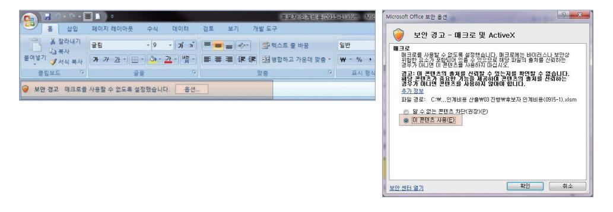

• 또는 아래의 '보안 알림' 창이 표시 되면 [매크로 포함] 버튼을 누릅니다.

<!-- page: 190 -->

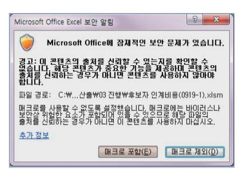

# **다. 설치방법**

- • 별도 설치작업 없이 본 서식 파일만 있으면 되므로 특정 폴더에 복사한 후 사용 하시면 됩니다.
- • 서식 파일이 있는 위치에 '반환기탁금 및 보전비용 인계·인수서'가 후보자별로 만들어 지므로 폴더를 만드신 후 사용하시는 것을 권장합니다.

# **2 정산서 및 인계·인수서 작성**

# **가. 정산서 작성(총 9단계로 구성)**

1) 단계 : '[정산서] 입력' 버튼 누름

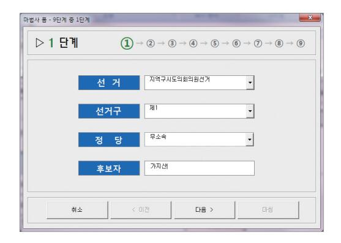

- • 선거 콤보박스를 눌러 선거종류를 선택합니다.
- • '국회의원선거', '시도의회의원선거', '구시군의회의원선거'를 선택하면 선거구 콤보박스가 활성화 됩니다.

※ '국회의원선거'를 선택할 경우 선거구는 직접 입력해야 합니다.

• 정당과 관련 없는 '교육감선거'를 선택하면 정당 콤보박스가 비활성화 됩니다.

2) 단계

| 법사 품 - 9단계 중 2단계 <b>오 단계</b>                            | $(1) \rightarrow (2) \rightarrow (3) \rightarrow (4) \rightarrow (5)$ | ightarrow (6) $ ightarrow$ (7) $ ightarrow$ (8) $ ightarrow$ (9) |

<!-- page: 191 -->

|------------------------------------------------------------|-----------------------------------------------------------------------|------------------------------------------------------------------|
| 질문1 후원회                                                    | 치를 두고 있습니까?                                                           | 88 <b>-</b>                                                      |
|                                                            | 의 "지원금" 또는 후원회의 "기부금"으 금을 납부하고 반환받은 사실이 있습니                        |                                                                  |
|                                                            | 의 "지원금" 또는 후원회 "기부금"으로 비용을 지출하여 보전받은 사실이 있습                        |                                                                  |
| 기탁금액 선거관리위원회로부터 반환받은 [기탁금액] 을 15,000,000 원 입력하세요        |                                                                       |                                                                  |
| <b>보전비용</b> 선거관리위원회로부터 보전받은 [보전비용] 을 91,377,310 원 입력하세요 |                                                                       |                                                                  |
| 취소                                                         | < 이전 다음 >                                                             | 마침                                                               |

• [질문2]와 [질문3] 모두 '없음'으로 선택한 경우 인계대상 비용을 산출할 필요가 없으므로 '마침' 버튼이 활성화 됩니다.

→ '마침' 버튼을 눌러 인계서를 작성합니다(인계금액이 0인 경우 인계·인수서 미제출).

- • '기탁금액' 및 '보전비용' 금액은 숫자만 입력 가능하며 최대 11자리(백억 단위)까지 입력할 수 있습니다.
- • 금액을 입력하지 않고 '다음' 버튼을 누르면 다음과 같이 확인 창이 표시됩니다. 금액을 입력하지 않고 다음 단계로 진행하려면 확인창에서 '예'를 누르세요.

| 입력 값 확인                        | X                           |
|--------------------------------|-----------------------------|
| 선거관리위원회로부터 [반환 계속 진행하시겠습니까? | 화받은 기탁금액]이 0원 입니다.          |
|                                | 예( <u>)</u> 아니요( <u>N</u> ) |

<!-- page: 192 -->

#### 3) 단계 ~ 9) 단계

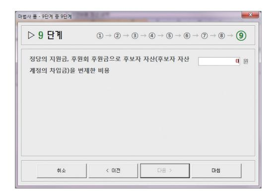

- • 각 단계별 금액 입력은 숫자만 가능하며 최대 11자리(백억 단위)까지 입력할 수 있습니다.
- • 각 단계별 금액을 입력하지 않고 '다음' 또는 '마침' 버튼을 누르면 확인 창이 표시됩니다. 금액을 입력하지 않고 다음 단계로 진행하려면 확인 창에서 '예'를 누르세요.

| 입력 값 확인                                                             | ×                   |
|---------------------------------------------------------------------|---------------------|
| [후보자 자신]계정 - [선거비용 및 선거비용외 정 자산을 변제한 비용이 0원 입니다. 계속 진행하시켰습니까? | 치자금]과목에서 후보자        |
|                                                                     | 예 <u>(M)</u> 아니요(M) |

- • '마침' 버튼을 누르면 마지막 시트 뒤에 정산서 시트가 작성됩니다.
  - → 시트명 : '선거명(선거구명)-후보자명'
- • 정산서 시트 작성 후 자동으로 인계대상 비용을 산출하고 총괄표에 해당 내역을 추가 합니다.

※ 총괄표 및 정산서 시트를 정렬하고 싶으면 [총괄] 시트에서 '[총괄표] 재작성' 버튼을 누르세요.

• 인계대상 비용의 계산 방법은 다음과 같습니다.

| 기탁금        | 보전비용       | 계 산 수 식                            |  |  |  |  |  |

<!-- page: 193 -->

|------------|------------|------------------------------------|--|--|--|--|--|
| 반환여부 있음 | 보전여부 있음 | 기탁금액+보전비용 - [(C+D) - (E+F+G+H+I)]  |  |  |  |  |  |
|            |            |                                    |  |  |  |  |  |
| 있음         | 없음         | 기탁금액 - [(C+D) - (E+F+G+H+I)]       |  |  |  |  |  |
| 없음         | 있음         | 기탁금액+보전비용 - [(C+D) - (E+F+G+H+I)]  |  |  |  |  |  |
|            |            | ※ '계산수식'의 편의성을 위해 기탁금액을 삭제 안했음을 유의 |  |  |  |  |  |
| 없음         | 없음         | -                                  |  |  |  |  |  |

※ 산출된 금액은 정산서 시트 상태메시지 밑에(N7셀) 표시됩니다.

- • 산출된 금액이 0보다 작거나 같으면(J≤0) 인계대상 비용은 0원이 됩니다.
- • '정산서 시트'가 만들어진 이후에는 필요에 따라 금액 등을 변경할 수 있습니다. 다만, 이 경우에는 반드시 '다시 계산' 버튼을 눌러 수동으로 다시 계산해야 합니다. ※ 시트 내에는 엑셀 함수 등 수식을 이용하지 않아 자동 계산이 안됩니다.
- • 정산서 시트의 셀, 행, 열 등을 추가하여 금액 등 항목의 위치가 변경되면 정상적으로 작동하지 않으니 위치가 변경되지 않도록 주의하시기 바랍니다.

## **나. 인계·인수서 작성**

• 정산서 시트의 '[인계·인수서] 출력' 버튼을 눌러 인계·인수서를 작성합니다.

|     | 선거명          | 지멱구시도의회의원선거         | 선거구명         | মা।    |    | 다시 계산    | [총괄]로 이동             | [인계·인수서] |
|-----|--------------|---------------------|--------------|--------|----|----------|----------------------|----------|
| 침당명 |              | 무소속                 | 후보자명         | 가지산    |    | [칭산서] 입력 | [정산서] 삭제             | 출력       |
| 정당  | t의 지원금 또는 후원 | l회의 기부금으로 기탁금을 납부하고 | 반환받은 사실이 있습니 | 니까? 있음 | 상태 |          |                      | _        |
| 저도  | 의 지원금 또는 후원  | 회 기부금으로 선거비용을 지출하여  | 보전받은 사실이 있습니 | 니까? 있음 |    | ※ 산1     | 출된 금액 : 8,597,770원 : | *        |

• 인계·인수서는 별도 엑셀 파일로 생성됩니다.

→ 생성위치 : 본 프로그램이 있는 위치

<!-- page: 194 -->

→ 파 일 명 : '(인계인수서)-선거명(선거구명)-후보자명.xlsx'

| <u> </u> | 홍 삽입 1                        | 페이지 레이아웃    | 수식 데이터           | 검토 보기                    | 개발 도구     |          |                                         |
|----------|-------------------------------|-------------|------------------|--------------------------|-----------|----------|-----------------------------------------|
| ľ        | - 대교복사                        | 굴림          | *9 * <b>JÎ x</b> | ===*                     | • 📑 텍스트 줄 | 바꿈       | 일반                                      |
| 붙여 -  | 넣기 🥩 서식 복사                    | 가 가 간 - 🖽   | - 🙆 - 그는 - 배종 -  | ≡≡≡¢                     | 部 병합하고    | 가운데 맞춤 * | ş - ₩ - %                               |
|          | 클립보드 명                        | 글3          |                  |                          | 맞춤        | G        | (1) (1) (1) (1) (1) (1) (1) (1) (1) (1) |
| × A      | R9                            | DEF         | ▼ (? ∬∡ G H   | I J                      | K L       | M        | N O                                     |
| Ŧ        |                               |             |                  |                          |           |          |                                         |
|          | 후보지                           | ト 반환기       | 탁금 및             | 보전비용                     | 롱 인계·     | 인수서      | 서                                       |
|          |                               |             |                  |                          |           | r        | 사유자 화이 🗙                                |
|          | 1. 인계자                        |             |                  |                          |           |          | 사용자 확인                                  |
|          | 직위                            | 성명          | 주민등록번호           | 주소                       |           | 전화번호     |                                         |
| ł        |                               |             |                  |                          | -         |          | [인계인수서]를 새로 만들었습니다.                     |
|          | 후보자                           | 가지산         |                  | 00시 00 00로 1          |           | 111-1111 | 1 인계자 및 인수자 등 자료를 입력하신 후 출력하시기 바랍니다.    |
|          |                               |             |                  |                          |           |          | -                                       |
| T        | <ol> <li>인수자(정당, 공</li> </ol> | 공익법인, 사회복   | 지시설)             |                          |           |          |                                         |
|          | 기관명                           | 직위          | 성명               | 주민등록번호                   | 주소        | 전화       | 확인                                      |
| T        | 00공익법인                        | 대표자         | 000              |                          | 00시 00구   | 222-22   |                                         |
|          | 이야하지말한                        | 내표시         | 000              | -                        | 00로 1     | 222-22   |                                         |
|          |                               |             |                  |                          |           |          |                                         |
|          | 3. 인계·인수사항                    |             |                  |                          |           |          |                                         |
| 3        |                               | 인계·인수금액     |                  | 인계·인수방법                  |           |          |                                         |
|          |                               | 8,597,770 원 |                  | ○○은행 123-45-56789로 계좌 입금 |           |          |                                         |
| 5        |                               |             |                  |                          |           |          |                                         |
|          | ▶ ▶ (인계인수서)                   | -지역광역(제1)-  | 가지산 😓            |                          |           |          |                                         |

- • 인계·인수서가 작성되면 '후보자 성명', '인계·인수금액'을 제외한 항목을 입력한 후에 저장합니다.
- • 인계·인수서 작성 후 파일을 삭제한 경우 '[인계·인수서] 출력' 버튼을 누르면 다시 작성할 수 있습니다.
  - ※ 인계·인수서 파일이 존재하면 해당 파일을 불러오고 존재하지 않는 경우 새로 작성합니다.
  - ※ 인계·인수서 시트의 셀, 행, 열 등을 추가하여 후보자 성명, 인계·인수금액 위치가 변경되면 정상적으로 작동하지 않으니 위치가 변경되지 않도록 주의하시기 바랍니다.

<!-- page: 195 -->

• 비례대표지방의회의원 : 「정치자금 회계관리 프로그램」 ⇒ '정치자금관리' ⇒ '지출내역관리'에서 지출부를 엑셀로 다운받아 활용(선거비용 과목 선택 후 조회

| √ [저장] | 보전여부를 체크한 후 [저장]을 클릭하면 해당 화면을 종료하거나 로그아웃한 이후에도 보전여부를 체크한 사항이 저장됨 |
|--------|---------------------------------------------------------------------|
| √ [엑셀] | 보전청구 명세서를 엑셀파일로 다운로드 가능                                             |

• 기능 더 알아보기

| ➊조회조건 입력 | 별도 수정이 필요 없으며, 필요 시에 조건 변경하여 사용                     |
|----------|-----------------------------------------------------|
| ➋[조회]    | 기본 설정 조건에서 조회하면 총괄(전체)계정의 선거비용 과목 지출내역이 조회화면에 표출 |
| ➌[보전]    | 보전 대상인 경우 콤보박스 체크 또는 전체선택한 후 콤보박스 해제                |
| ➍[출력]    | 미리보기가 가능하며, 보전청구 명세서 출력 가능                          |

• 선거비용 보전청구 명세서 출력 방법

| ➋ ➍ ➊ |  |  |  |  |  |  |  |  |  |  |
|-------------|--|--|--|--|--|--|--|--|--|--|
|             |  |  |  |  |  |  |  |  |  |  |
| 별도수정 필요없음   |  |  |  |  |  |  |  |  |  |  |
| (필요시 조건 변경) |  |  |  |  |  |  |  |  |  |  |
|             |  |  |  |  |  |  |  |  |  |  |
| ➌           |  |  |  |  |  |  |  |  |  |  |
|             |  |  |  |  |  |  |  |  |  |  |
|             |  |  |  |  |  |  |  |  |  |  |
|             |  |  |  |  |  |  |  |  |  |  |
|             |  |  |  |  |  |  |  |  |  |  |
|             |  |  |  |  |  |  |  |  |  |  |
|             |  |  |  |  |  |  |  |  |  |  |

<!-- page: 196 -->

• 지방자치단체의장 및 지역구지방의회의원 : 「정치자금 회계관리 프로그램」 ⇒ '보고관리' ⇒ '정치 자금 수입·지출부(보전비용)'에서 보전대상 선거비용만 선택하여 계정별로 출력

# **「정치자금회계관리 프로그램」 정치자금 수입·지출부(보전비용) 출력 방법 부록4**

# **부록5 선거사무관계자 고용, 산재보험 가입 안내**

**1. 고용·산재보험 관련 담당기관 :** 근로복지공단 (상담전화 ☎1588-0075)

# **2. 고용·산재보험 관계법**

- 「고용보험법」 제8조(적용 범위) 및 같은 법 시행령 제2조(적용 범위)
- 「산업재해보상보험법」 제6조(적용 범위) 및 같은 법 시행령 제2조(법의 적용 제외 사업)
- 「고용보험 및 산업재해보상보험의 보험료징수 등에 관한 법률」제11조(보험관계의 신고)

<!-- page: 197 -->

# **3. 고용·산재보험 가입 안내**

• 가입대상 : 근로자를 사용하는 모든 사업 또는 사업장

| 구 분      | 고용보험                                                                                       | 산재보험 |
|----------|--------------------------------------------------------------------------------------------|------|
| 신고 방법 | ▶ 4대 사회보험은 사업장과 가까운 기관 중 한 곳 또는 인터넷(www.4insure.or.kr)으로 신고할 수 있습니다.                    |      |
|          | ◎ 근로자를 최초로 사용한 날로부터 14일 이내에 「보험관계 성립신고서」 제출                                                |      |
|          | - 성립한 날부터 14일 이내에 종료되는 사업은 사업이 종료되는 날의 전날까지 신고                                             |      |
|          | ※ 선거사무소는 선거사무관계자 선임기간(2026.5.21.~6.2.)에 따라, 2026.6.1.(월)까지 성립신고서를 제출하여야 함               |      |
|          | ◎ 사업주는 근로자를 새로 고용한 경우 고용한 날이 속하는 달의 다음 달 15일까지 「고용・산재보험 자격취득(고용)신고서」 제출                 |      |
|          | ※ 「보험관계 성립신고서」와 함께 제출 권장                                                                   |      |
|          | ◎ 사업주는 근로자와 고용관계를 종료한 때에는 근로자의 고용관계가 종료한 날이 속하는 달의 다음 달 15일까지 「고용・산재보험 자격상실(고용종료)신고서」제출 |      |
|          | ◎ 사업의 폐업・종료 등으로 인하여 보험관계가 소멸한 경우에는 사유 발생일로부터 14일 이내에 「보험관계 소멸신고서」 및 「보수총액신고서」를 제출       |      |

| 구 분        | 고용보험                                                                                                                                                                                                                           | 산재보험                                                                                                                                                                                                                                                                |
|------------|--------------------------------------------------------------------------------------------------------------------------------------------------------------------------------------------------------------------------------|---------------------------------------------------------------------------------------------------------------------------------------------------------------------------------------------------------------------------------------------------------------------|
| 보험료 부 담 | ○ 고용보험료율 : 2.05% - 실업급여 보험료율 : 1.8% (사업주와 근로자가 각 1/2씩 부담) - 고용안정・직업능력개발 보험료율 : 0.25%*(사업주 전액 부담) * 규모별 보험료율 상이 0.25% ~ 0.85%, 근로자 150명 미만은 0.25% 적용 ※ 사업종류는 '정치단체'로 구분                                    | ○ 산재보험료율 : 9.56/1,000 (사업주 전액 부담) - 사업종류 보험료율 : 8/1,000 - 출퇴근재해 보험료율 : 0.6/1,000 - 임금채권부담비율 : 0.9/1,000 - 석면적용요율* : 0.06/1,000 * 근로자 20명 이상 사업장 해당 ※ '26년도 사업종류별 산재보험료율 및 사업종류 예시에 따라 사업종류 '각급사무소'의 예시로, 가입시점 및 사업종류에 따라 요율이 상이할 수 있음 |
| 납부 방법   | 월납 ※ 매월 15일까지 처리된 신고내용으로 월별로 보험료를 산정하여 부과하며, 건강보험공단에서 매월 22일경 고지서 발송(납부기한은 매 익월 10일) - 선거운동기간 중 선거사무소 등에 두는 선거사무관계자 선임일이 2026.5.21.이므로 5월 보험료로 산정되지 못하며, 6.15.까지 관련 신고가 처리될 경우 6월 보험료로 산정・부과(납부기한 2026. 7. 10.) |                                                                                                                                                                                                                                                                     |
| 납부 의무자  | 사업주                                                                                                                                                                                                                            |                                                                                                                                                                                                                                                                     |

- • 고용·산재보험 보험관계성립신고를 하지 아니하거나 거짓 신고를 하는 경우에는 「고용보험 및 산업재해보상보험의 보험료징수 등에 관한 법률」 제50조에 따라 300만 원 이하의 과태료가 부과될 수 있으며, 보험가입신고를 게을리한 기간 중 재해가 발생하는 경우 산재보험급여액이 징수(단, 가입신고를 게을리 한 기간 중에 납부하여야 할 보험료의 최대 5배) 될 수 있습니다.
- • 사무대행기관 이용 안내
  - 서면 : 가까운 보험사무대행기관을 방문하여 보험사무 위탁계약 체결
  - 온라인 : 고용산재보험 토탈서비스(total.comwel.or.kr)에서 사무대행기관을 선택하여 보험 사무 위탁신청서 제출(공인인증서 로그인 필수)
  - 보험사무대행기관 검색 방법 : 근로복지공단 홈페이지 → 국민소통 → 민원/조회 → 보험사무대행기관 찾기

디자인·인쇄\_ 렛츠디자인

발행처\_ 중앙선거관리위원회 정치자금조사과 경기도 과천시 홍촌말로 44

발 행\_ 2026년 3월

# **선거비용 보전 안내서**

<!-- page: 198 -->

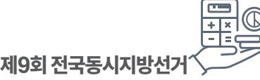

<!-- page: 199 -->

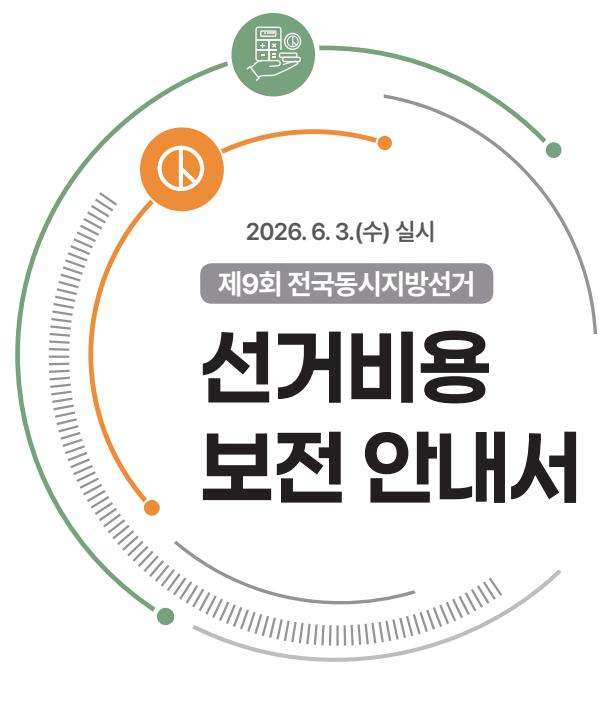

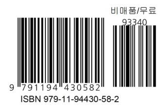