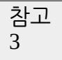
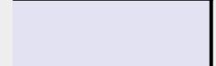
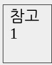
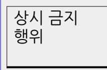
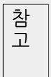
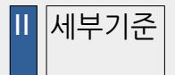

<!-- page: 1 -->

2026. 6. 3. 실시 제9회 전국동시지방선거

정치관계법 사례예시집

2026. 1.

◆이 사례집은 제9회 전국동시지방선거를 공정하고 깨끗하게 치르기 위하여 현행「공직선거법」, 「정치자금법」,「정당법」을 기준으로 현장에서 자주 발생하는 사례 위주로 작성하였습니다. 따라서 발간 이후 관련 법규의 개정이나 헌법재판소 법원의 판결 또는 중앙선거관리위원회의 유권해석에 따라 ․ 일부 내용이 달라질 수 있습니다.

◆이 사례집에 열거하지 아니하였더라도「공직선거법」,「정치자금법」,「정당법」에서 제한 금지하는 ․ 행위는 허용되지 아니하며, 할 수 있는 사례로 제시된 경우라도 그 행위의 주체 시기 목적 내용 방법 ․ ․ ․ ․ ․ 대상 범위 등 구체적인 양태에 따라 관련법에 위반될 수 있습니다 ․ .

◆따라서 특정 행위의 위법여부에 대한 판단이 어려운 경우에는 전국 어디서나 선거콜센터 1390 번으로 문의하시면 선거관리위원회의 안내를 받으실 수 있습니다.

◆ 용어의 표기

❍'후보자'는 선거관리위원회에 후보자등록을 마친 사람, '예비후보자'는 선거관리위원회에 예비후보자로 등록을 마친 사람을 말합니다.

❍'후보자가 되고자 하는 자', '입후보예정자' ⇒ '후보자가 되려는 사람'으로 표기

❍'「공직선거법」' ⇒ '선거법' 또는 '법'으로 표기

❍'「공직선거관리규칙」' ⇒ '규칙'으로 표기

❍'「지방교육자치에 관한 법률」' ⇒ '교자법'으로 표기

❍'제58조제1항' ⇒ '제58조제1항' 또는 '§58 ' ① 로 표기

❍ '선거관리위원회' ⇒ '선관위'로 표기

◆교육감선거와 관련하여 '제7장 교육감선거 관련 특별 제한ㆍ금지사례'에 게재되지 않은 각종 선거운동방법 및 제한·금지 사항은 시·도지사선거의 경우를 참고하시기 바랍니다.

일 러 두 기

◇ 법정 일자 및 기간 ◇

| 구분           | 제9회 전국동시지방선거                        |
|--------------|-------------------------------------|
| 선거일          | 2026. 6. 3.(수)                      |
| 예비후보자등록      |  시·도지사 및 교육감: 2026. 2. 3.(화)       |
| 신청개시일        |  시·도의원/구·시의원 및 장 : 2026. 2. 20.(금) |
|              |  군의원 및 장 : 2026. 3. 22.(일)         |
| 후보자등록 신청기간   | 2026. 5. 14.(목) ~ 5. 15.(금)         |
| 선거기간개시일      | 2026. 5. 21.(목)                     |
| 선거기간         | 2026. 5. 21.(목) ~ 6. 3.(수)          |
| (선거운동기간+선거일) |                                     |
| 선거운동기간       | 2026. 5. 21.(목) ~ 6. 2.(화)          |
| 사전투표기간       | 2026. 5. 29.(금) ~ 5. 30.(토)         |

◇ 주요 선거일정 ◇

| 선거일정       | 일 자             |
|------------|-----------------|
| 선거일 전 180일 | 2025. 12. 5.(금) |
| 선거일 전 150일 | 2026. 1. 4.(일)  |
| 선거일 전 120일 | 2026. 2. 3.(화)  |
| 선거일 전 90일  | 2026. 3. 5.(목)  |
| 선거일 전 60일  | 2026. 4. 4.(토)  |
| 선거일 전 30일  | 2026. 5. 4.(월)  |
| 선거일 후 60일  | 2026. 8. 2.(일)  |

<!-- page: 2 -->

# 목 차

<!-- page: 3 -->

# 참고 예비후보자공약집·선거공약서 비교

참고 2 예비후보자인 경선후보자의 경선운동 방법 54

53

예비후보자와 후보자가 되려는 사람의 차이

1

참고

6. 예비후보자공약집 51

5. 어깨띠 및 표지물 이용 49

4. 예비후보자홍보물 발송 46

3. 명함 배부 42

2. 선거사무관계자 39

1. 선거사무소 설치 및 현수막 등 게시 34

제3장 예비후보자의 선거운동

32

참 고 ARS 이용 관련 사례

3. 인터넷홈페이지 및 전자우편 등 이용 선거운동 28

2. 문자메시지 이용 선거운동 25

1. 말(言) 또는 전화 이용 선거운동 21

제2장 평상시 가능한 선거운동

2 18세 유권자의 선거운동 19

1

18 참고

참고 후보자가 되려는 사람의 여론수렴 현장방문

1. 선거운동의 정의 8 2. 선거운동기간 11

3. 선거운동을 할 수 없는 사람 14

3 55

제4장 선거기간 전에 자주 발생하는 사례

- 1. 선거에 영향을 미치는 현수막 등의 설치 57
- 2. 선거에 관한 인쇄물 및 기사 배부 61
- 3. 후보자 등 명의를 나타내는 광고 66
- 4. 출판기념회 개최 69
- 5. 선거에 관한 여론조사결과 공표ㆍ보도 73
- 6. 호별방문 및 서명ㆍ날인운동 82
- 7. 의정활동보고 86
- 제5장 선거기간 중에 자주 발생하는 사례
- 1. 후보자의 명함 선거벽보 선거공보 선거공약서 ․ ․ ․ 94
- 2. 선거사무소 및 거리게시 현수막 106
- 3. 선거사무관계자 110
- 4. 어깨띠 및 점퍼 등 소품 113
- 5. 공개장소 연설ㆍ대담 117
- 6. 인터넷광고 122
- 7. 선거에 영향을 미치는 집회 124
- 8. 허위사실공표 및 후보자 비방 등 127
- 9. 선거의 자유를 방해하는 행위 134
- 10. 투표참여 권유활동 137
- 11. (사전)투표소 내 외에서의 소란언동 금지 등 ‧ 140
- 12. (사전)투표소 및 개표소의 출입제한 142

참고 1 선거별 선거운동방법

<!-- page: 4 -->

#### 144

147

제6장 선거법상 제한 · 금지사례

제1절 금품ㆍ음식물 등 기부행위

1. 정당의 후보자추천 관련 금품수수 금지 149

2. 기부행위 제한ㆍ금지 151

3. 선거운동 관련 대가 제공ㆍ수령 금지 168

4. 선거일 후 답례행위 제한 170

제2절 공무원 등의 선거관여 행위

1. 공무원 등의 선거중립의무 172

2. 공무원 등의 선거관여 등 금지 174

3. 지방자치단체장의 선거에 영향을 미치는 행위 제한 180

183

제3절 단체의 선거운동 등

<!-- page: 5 -->

1. 단체의 선거운동 금지 184

2. 낙천 낙선운동 ․ 192

3. 사조직 및 유사기관 설치 194

4. 후보자의 팬클럽 등 활동 199

제4절 당내경선운동 및 정당활동

1. 당내경선운동 204

2. 정당선거사무소 및 당원협의회 211

3. 통상적인 정당활동 214

4. 당원집회 217

5. 선거기간 중 정당활동 제한 221

참 후보 단일화 및 선거운동

고

<!-- page: 6 -->

#### 229

제7장 교육감선거 관련 특별 제한ㆍ금지사례

1. 정당의 선거관여행위 금지 231

2. 교육감선거 후보자의 정당표방행위 금지 233

3. 교육감선거 관련 주요 특례규정 235

제8장 「정치자금법」상 제한 · 금지사례

1. 정치자금의 정의 및 기본원칙 239

2. 정치자금 수입·지출 243

3. 법인ㆍ단체 관련 자금의 정치자금 기부 금지 247

4. 특정행위와 관련한 정치자금 기부의 제한 249

5. 기부의 알선에 관한 제한 250

6. 유튜브 등 소셜미디어와 정치자금 252

참고 1 (예비)후보자 등록 전 정치자금 회계처리

255

참고 2 정치자금 공개차입(펀드 등)

256

부 록

1. 2026. 6. 3.(수) 실시 제9회 전국동시지방선거 주요 일정 258

<!-- page: 7 -->

2. 시기별 주요 제한ㆍ금지사항 259

3. 금품ㆍ음식물 등을 제공받은 자에 대한 과태료 부과 264

4. 선거범죄 신고 포상금 지급 및 신고자 신원보호 266

5. 선거범죄 자수자에 대한 형의 감경 면제 ․ 268

6. 개인정보 보호 관련 준수사항 269

7. 후보자가 되려는 사람과 관련된 포럼 활동에 관한 법규운용기준 272

8. '딥페이크영상등' 이용 선거운동 관련 법규운용기준 277

제1장

선거운동 개관

1. 선거운동의 정의

2. 선거운동기간

3. 선거운동을 할 수 없는 사람

참고 1

후보자가 되려는 사람의 여론수렴 현장방문

참고 2

18세 유권자의 선거운동

<!-- page: 8 -->

1. 선거운동의 정의

법규 요약(법 §58)

❍ '선거운동'이란 당선되거나 되게 하거나 되지 못하게 하기 위한 행위를 말함.

❍ 다만, 다음의 행위는 선거운동으로 보지 아니함.

선거에 관한 단순한 의견개진 및 의사표시

입후보와 선거운동을 위한 준비행위

정당의 후보자 추천에 관한 단순한 지지 반대의 의 ․ 견개진 및 의사표시

통상적인 정당활동

 설날ㆍ추석 등 명절 및 석가탄신일ㆍ기독탄신일 등에 하는 의례적인 인사말을 문자메시지(그림말· 음성·화상·동영상 등을 포함)로 전송하는 행위

주요 판례

◈ 선거운동의 개념

특정 선거에서 특정 후보자의 당선 또는 낙선을 도모한다는 목적의사가 객관적으로 인정될 수 있는 행위를 말하는 것으로, 구체적으로 어떠한 행위가 선거운동에 해당하는지 여부를 판단함에 있어서는 외부에 표시된 행위를 대상으로 선거인의 관점에서 그 행위 당시의 구체적인 상황에 기초하여 객관적으로 판단하여야 함(대법원 2016. 8. 26. 선고 2015도11812 판결).

◈ '후보자가 되려는 사람'의 의미

선거에 출마할 예정인 사람으로서 정당에 공천신청을 하거나 일반 선거권자로부터 후보자 추천을 받기 위한 활동을 벌이는 등 입후보의사가 확정적으로 외부에 표출된 사람뿐만 아니라 그 신분․ 접촉대상 언행 등에 비추어 선거에 입후보할 의사를 가 ․ 진 것을 객관적으로 인식할 수 있을 정도에 이른 사람도 포함됨(대법원 2011. 3. 10. 선고 2011도168 판결).

사례 예시

할 수 있는 사례

❍ 후보자가 되려는 사람이 통상적인 출마 기자회견을 하면서 선거공약을 발표하는 행위

➩ 다만, 다수의 선거구민에게 기자회견 사실을 알려 참석하게 한 후 선거구민에게 후보자가 되려는 사람을 홍보·선전하는 등 선거운동에 이르는 행위는 위반

❍ 단체가 정당의 공천반대자 명단 또는 낙선대상자 명단을 기자회견의 방법으로 단순히 공표하는 행위

➩ 기자회견 장소에 다수의 선거구민을 모이게 하거나 기자회견 장소에서 선거에 영향을 미치게 하는 시설물·인쇄물 등을 이용하거나, 특정 후보자에 관한 허위사실 공표 또는 비방하는 행위는 위반

❍ 법회․ ․ 강론 설교 등 종교집회에서 통상의 방법으로 소속 신도들의 동정을 알리거나, 주보 회보 등 ․ 종교단체 소식지의 동정 란에 통상의 방법으로 단순히 소속 신도의 입후보사실을 알리는 행위

➩ 종교집회를 진행하는 사람이 집회시간에 특정 후보자를 지지하는 내용으로 설교하는 행위는 위반

❍ 무소속후보자가 되려는 사람이 선거권자의 추천을 받기 위하여 가정집을 방문하는 경우 추천에 필요한 범위에서 단순히 자신의 경력․공적이나 입후보 이유 등을 구두로 소개하는 행위

➩ 선거권자의 추천을 받기 위하여 호별방문을 하는 경우 말(言)로 선거운동을 하거나, 선거운동용 명함 및 소개장·소책자 등 인쇄물을 배부하는 행위는 위반

❍ 명절 등에 의례적인 인사말을 문자메시지(그림말·음성·화상·동영상 포함)로 전송(자동 동보통신 방법으로 전송 포함)하는 행위

<!-- page: 9 -->

➩ 선거운동에 이르는 내용이 포함된 문자메시지를 발송하는 경우 법 §59에 따라 자동 동보통신이 아닌 방법으로 전송하여야 함.[예비후보자와 후보자(후보자의 경우 예비후보자로서 전송한 횟수 포함) 는 총 8회 이내에서 자동 동보통신 방법으로 문자메시지를 전송할 수 있으며, 법 §59제2호 및 §82의5를 준수하여야 함.]

의례적인 인사말을 문자메시지로 전송할 수 있는 '명절 등'의 범위에 정월대보름 등 세시풍속, 연말연시, 농번기, 성년의 날, 각종 기념일 등은 포함되나, 선거구민 개인의 애경사(생일, 결혼, 장례 등), 동창회ㆍ동호회 등 개인들의 사적모임이나 행사 등은 포함되지 아니함.

❍ 인터넷 홈페이지(카페․블로그 등 포함) 또는 그 게시판 대화방 등에 연말연시 인사말 ․ (선거운동을 할 수 있는 사람은 선거운동 내용 포함)이나 동영상 등의 정보를 게시하는 행위

❍ 정당이 선거기간이 아닌 때에 특정 정당이나 공직선거의 후보자 (후보자가 되려는 사람 포함)를 지지·추천하거나 반대함이 없이 지역 현안문제에 대한 자당의 입장을 알리는 캠페인을 개최하는 행위

➩ 선거가 임박한 시기에 특별한 정치적 현안 없이 지역을 순회하면서 선거구민을 대상으로 계속적· 반복적으로 캠페인을 개최하는 등 선거운동에 이르는 행위는 위반

❍ 통상적으로 사용하는 업무용 명함에 자신의 학력(비정규학력 제외)이나 경력(수상내역 포함)을 게재하거나 열차시간표, 무형문화재 소개, 지역 관공서 전화번호 등을 부수적으로 게재하여 통상적인 수교방법으로 교부하는 행위

❍ 특정 선거구역을 주된 배부지역으로 하는 신문사가 후보자가 되고자 하는 자가 집필하는 법률상담기사를 그의 직·성명, 사진 등을 게재하여 연재하는 행위

➩ 법 §8의3에 따른 선거기사의 공정여부는 별론으로 함.

❍ 후원회가 후원금 기부에 대한 감사의 인사장에 후원회 지정권자인 (예비)후보자의 사진을 게재하여 후원인에게 발송하는 행위

할 수 없는 사례

❍ 체육대회의 명칭이나 우승기에 후보자가 되려는 사람의 성명을 표기하는 행위

❍ 특별한 계기 없이 다수인이 왕래하는 도로의 교차로에서 자신의 성명 등이 게재된 어깨띠를 착용하거나 피켓을 들고 선거구민을 대상으로 인사를 하는 행위

2. 선거운동기간

법규 요약(법 §59)

❍ 선거운동기간 : 2026. 5. 21. ~ 6. 2.

➩ 선거기간개시일부터 선거일(2026. 6. 3.) 전일까지

❍ 사전선거운동 금지 예외(법 §59)

예비후보자 등이 법 §60의3 ① 및 ②에 따라 선거운동을 하는 경우

➩ 자세한 사항은 제3장 예비후보자의 선거운동 참조

 선거운동을 할 수 있는 사람이 문자메시지를 전송하거나 인터넷 홈페이지 등에 글․동영상 등을 게시하거나 전자우편을 전송하는 방법으로 선거운동을 하는 경우

<!-- page: 10 -->

➩ 다만, 자동 동보통신의 방법(동시수신대상자가 20명을 초과하거나 그 대상자가 20명 이하인 경우에도 프로그램을 이용하여 수신자를 자동으로 선택하여 전송하는 방식을 말함. 이하 같음)으로 문자메시지를 전송하거나 전송대행업체에 위탁하여 전자우편을 전송할 수 있는 사람은 후보자와 예비후보자에 한하며, 자동 동보통신의 방법으로 문자메시지를 전송할 수 있는 횟수는 8회(후보자의 경우 예비후보자로서 전송한 횟수 포함)를 넘을 수 없으며, 신고한 1개의 전화번호만 사용하여야 함.

 선거운동을 할 수 있는 사람이 선거일이 아닌 때에 전화(송 수화자 간 직 ․ 접 통화하는 방식에 한정하며, 컴퓨터를 이용한 자동 송신장치를 설치한 전화는 제외)를 이용하거나 말(확성장치를 사용하거나 옥외집회에서 다중을 대상으로 하는 경우를 제외)로 선거운동을 하는 경우

➩ 다만, 오후 11시부터 다음날 오전 6시까지 전화를 이용한 선거운동 불가

➩ 자세한 사항은 제2장 평상시 가능한 선거운동 참조

후보자가 되려는 사람이 선거일 전 180일부터 해당 선거의 예비후보자 등록신청 전까지 법 §60의

3①제2호의 방법으로 자신의 명함을 직접 주는 경우

➩ 다만, 선박․ ․ ․ ․ ․ ․ 정기여객자동차 열차 전동차 항공기의 안과 그 터미널 역 공항의 개찰구 안, 병원․ 주요판례 종교시설․극장의 옥내(대관 등으로 해당 시설이 본래의 용도 외의 용도로 이용되는 경우는 제외)에서

◈ '선거운동기간' 제한의 취지

기간의 제한 없이 선거운동을 무한정 허용할 경우에는 후보자 간의 지나친 경쟁이 선거관리의 곤란으로 이어져 부정행위의 발생을 막기 어렵게 됨. 또한 후보자 간의 무리한 경쟁의 장기화는 경비와 노력이 지나치게 들어 사회경제적으로 많은 손실을 가져올 뿐만 아니라 후보자 간의 경제력 차이에 따른 불공평이 생기게 되고, 아울러 막대한 선거비용을 마련할 수 없는 젊고 유능한 신참 후보자의 입후보의 기회를 빼앗는 결과를 가져올 수 있음(헌법재판소 2013. 12. 26. 결정 2011헌바153).

사례 예시

할 수 있는 사례

❍ 후보자를 추천하지 아니한 정당이 기자회견·당원집회 등 선거법에서 제한·금지되지 아니한 방법으로 다른 정당의 후보자를 지지선언 하는 행위

할 수 없는 사례

❍ 입후보예정자가 구청 각 과 사무실(민원실 등 일반적·통상적으로 민원인을 위하여 개방된 장소나 공간 제외) 등을 방문하여 그곳에 근무하던 공무원 등과 일일이 악수하면서 지지를 부탁하는 행위

❍ 입후보예정자가 자신의 직 성명 등이 게재된 ‧ 윗옷 또는 의례적인 문구의 어깨띠를 착용하고 말로 선거운동을 하거나 선거운동용 명함을 배부하는 행위

❍ 선거운동기간 전 옥내집회에 참석한 주민들에게 확성장치를 사용하여 후보자가 되려는 특정인을 선거에서 심판하자는 등 선거운동에 이르는 연설을 하는 행위

➩ 다만, 확성장치를 사용하지 아니하고 말로 선거운동을 하는 것은 가능

❍ 특정단체가 선거운동기간 전에 후보자가 되려는 사람을 위하여 강연을 듣는 자리를 마련하고 후보자가 되려는 사람은 자신에 대한 지지를 호소하는 행위(부산고법 2014. 10. 22. 선고 2014노475 판결)

❍ 선거일에 투표소가 설치된 ○○초등학교의 담장에 후보자의 성명·기호·사진·선거구호가 기재된 현수막을 게시하는 행위(서울서부지법 2020. 8. 19. 선고 2020고합143 판결)

<!-- page: 11 -->

3. 선거운동을 할 수 없는 사람

법규 요약(법 §58 §60) ․

❍ 선거법 또는 다른 법률에 의하여 선거운동이 제한 금지되는 사람은 선거운동을 할 수 없음 ․ .

❍ 선거법에 의하여 선거운동을 할 수 없는 사람

① 대한민국 국민이 아닌 자

➩ 다만 지방선거의 경우 법 §15②제3호에 따른 외국인은 선거운동을 할 수 있음.

② 미성년자 (18세 미만의 자를 말함. 이하 같음.)

➩ 선거운동 행위 당시를 기준

③ 선거권이 없는 자

④ 국가공무원과 지방공무원

➩ 다만, 정당의 당원이 될 수 있는 공무원(국회의원과 지방의원 외의 정무직공무원은 제외)은 선거운동을 할 수 있음.

⑤ 각급 선관위 위원, 다른 법령의 규정에 의하여 공무원의 신분을 가진 사람, 정부가 50% 이상의 지분을 가지고 있는 기관(한국은행 포함)의 상근 임원, 농협 수협 ․ ․ ․ 산림조합 엽연초생산조합의 상근 임․직원과 이들 조합의 중앙회장, 지방공사와 지방공단의 상근 임원, 정당의 당원이 될 수 없는 사립학교 교원

⑥ 예비군 중대장급 이상의 간부

⑦ 통 리 반의 장 및 주 ․ ․ 민자치위원회 위원

➩「지방자치분권 및 지역균형발전에 관한 특별법」§40에 따라 설치 운영하는 '주 ․ 민자치회' 및 그 위원은 선거법상 '주민자치위원회' 및 그 위원에 관한 규정이 적용

⑧ 바르게살기운동협의회ㆍ새마을운동협의회ㆍ한국자유총연맹의 상근 임ㆍ직원 및 이들 단체 등 (시 도 조직 및 구 시 군 조직 포함 ․ ․ ․ )의 대표자

⑨ 선상투표신고를 한 선원이 승선하고 있는 선박의 선장

※ 다만, ①에 해당하는 사람이 예비후보자 후보자의 배우자인 경우와 위 ․ ④ 내지 ⑧의 지위나 신분을 가진 사람이 예비후보자 후보자의 배우자이거나 후보자의 직계 ․ 존·비속인 경우에는 그 직을 가지고 선거운동을 할 수 있음.

※ 각급 선관위 위원, 예비군 중대장급 이상 간부, 주민자치위원회 위원, 통 리 반의 장이 ⋅ ⋅ 선거사무장, 선거연락소장, 선거사무원, 활동보조인, 회계책임자, 연설원, 대담ㆍ토론자, 투표참관인ㆍ사전투표참관인이 되고자 하는 때에는 선거일전 90일(2026.3.5.)까지 그 직을 그만두어야 하며, 선거일 후 6월 이내(주민자치위원회위원은 선거일까지)에는 종전의 직에 복직될 수 없음.

주요판례

◈ 공무원의 선거운동을 금지하는 이유

공무원이 그 직을 그대로 유지한 채 선거운동을 할 수 있는 경우 자신들의 지위와 권한을 특정 개인을 위한 선거운동에 남용할 소지가 많게 되고, 자신의 선거운동에 유리한 방향으로 편파적으로 직무를 집행하거나 관련 법규를 적용할 가능성도 있는 등 그로 인한 부작용과 폐해가 선거결과에 지대한 영향을 미치게 될 것이기 때문임(헌법재판소 2008. 4. 24. 결정 2004헌바47).

사례 예시

<!-- page: 12 -->

# 할 수 있는 사례

❍ 지방자치단체장 등 정치적 중립의무가 있는 공무원이 후보자가 되려는 사람으로부터 출판기념회에 따른 축사 요청을 받고 선거와 무관하게 그의 출판기념회를 축하하는 의례적인 내용의 축사를 하거나 영상축사․ ․ 축전을 제공하여 그 행사 장소에서 상영 낭독하게 하는 행위

➩ 다만, 지방자치단체장은 지방선거의 선거일 전 180일(2025.12.5.)부터 선거일까지 근무시간 중 출판기념회에 참석할 수 없음.

❍ 선거운동을 할 수 없는 사람이 정당의 내부적인 선거사무에 자원봉사활동(대외적 선거운동이 아닌 선거대책기구 회의에 참석하거나 단순한 의견개진 행위 등)을 하는 행위

➩ 다만, 공무원 등 법령에 따라 정치적 중립을 지켜야 하는 사람이 선거에 영향을 미치는 행위를 하는 때에는 법 §9, §85, §86에 위반될 수 있음.

❍ 선거운동을 할 수 없는 사람이 선거법에 의한 연설 대담 토론회에 내 ⋅ ⋅ 빈으로 초청되어 단순히 참관하거나 후보자 등의 소개에 응하는 행위

➩ 다만, 단순한 참관 또는 소개에 응하는 범위를 벗어나 선거운동에 이르는 행위를 하는 때에는 위반

할 수 없는 사례

선고 95고합415 판결)

❍ 공무원 등 선거운동을 할 수 없는 사람이 페이스북이나 카카오톡 등 SNS를 이용하여 특정 후보자 지지를 호소하는 글을 전송하는 행위

❍ 국회의원이 선거운동을 할 수 없는 국무위원 겸직 중에 선거운동을 하는 행위

❍ 지방자치단체장이 특정 후보자의 선거사무소 개소식에 참석하여 다수의 참석자를 상대로 선거에서의 승리를 기원하거나 업적을 홍보하는 내용의 축사를 하는 행위

➩ 지방자치단체장은 선거일 전 60일(2026.4.4.)부터 선거일까지 근무시간인지 여부와 상관없이 선거대책기구, 선거사무소, 선거연락소에 방문하는 행위가 제한됨. 다만 지방자치단체장 본인이 예비후보자 또는 후보자가 된 경우에는 가능

➩ 지방자치단체장은 당해 지방자치단체의 장의 선거의 선거일 전 180일(2025.12.5.)부터 선거일까지

근무시간중에 공공기관이 아닌 단체 등이 주최하는 행사(선거사무소 개소식 포함)에 참석할 수 없음.

❍ A시 주민자치위원이 선거일 전 90일까지 사직하지 아니하고 B군에서 행하여지는 선거의 선거사무장이 되는 행위

❍ 후보자가 미성년자인 자신의 아들로 하여금 "우리 아빠는 컴퓨터도 잘하며, 동생과 제가 존경하는 분입니다. 우리 아빠를 도와 주세요"라는 등 수회에 걸쳐 연설을 하게 한 행위(창원지법 1996. 5. 9.

❍ 지방의회의원이 새마을운동중앙회의 시(市)조직인 ◯◯시새마을회 대표자 직을 겸직하고 선거운동을 하는 행위(대법원 2010. 5. 13. 선고 2009도327 판결)

❍ 주민자치위원회위원이 후보자와 동행하여 후보자가 선거권자들에게 "○○입니다. 잘 부탁합니다"라고 인사하는 동안 선거권자들과 손을 잡거나 목례를 하면서 "잘 부탁한다"라며 후보자를 위한 선거운동을 한 행위(서울고법 2004. 10. 19. 선고 2004노1844 판결)

❍ 지방공무원이 후보자로 출마한 형(兄)을 위해 '선거법 위반 혐의로 고발된 ○○시장 후보자 지지자들에 대한 경찰 수사 착수'라는 내용의 문자메시지를 소속 직원 등에게 발송하는 행위(수원지법 평택지원 2020. 10. 16. 선고 2020고합127 판결)

| 참고 |  |

<!-- page: 13 -->

|----|--|
| 1  |  |
|    |  |

후보자가 되려는 사람의 여론수렴 현장방문

할 수 있는 사례

❍ 기관 단체 시설이나 ․ ․ 민생현장에서 민원사항을 청취하고, 민원과 관련한 소속정당의 정책이나 자신의 견해 정․ 책적 대안을 단순히 밝히는 행위

❍ 시장, 산업현장, 사회복지시설 등을 방문하여 통상적인 체험활동을 하고 민의를 수렴하는 행위

❍ 정책공약의 준비를 위하여 관계기관 단체 시설 등을 방문하여 관계자 ․ ․ 들과 의견을 나누거나 간담회를 갖는 행위(단, 식사 제공 등 기부행위는 위반)

❍ 지역의 환경문제 등의 현안에 대하여 관계전문가 등 이해관계자들을 대상으로 선거와 무관하게 정책세미나를 개최하는 행위

❍ 초청받은 행사에 참석하여 의례적인 인사말을 하거나 행사 주제와 관련된 사항에 대하여 자신의 견해를 밝히는 행위

❍ 후보자가 되려는 사람이 선거구 안에서 개최되는 각종 행사에서 의례적인 축사를 하는 행위

❍ 후보자가 되려는 사람이 각종 행사에 참석하여 참석자들과 의례적인 악수· 인사를 하면서 말(言) 로 선거운동을 하는 행위

할 수 없는 사례

❍ 단체의 강연회에 초청받아 확성장치를 사용하거나 옥외집회에서 다중을 대상으로 지지호소․ 선거공약 발표 등 선거운동에 이르는 발언을 하는 행위

❍ 선거공약 개발을 위한 주민간담회를 개최하면서 실질적으로는 선거운동을 목적으로 하거나, 선거운동을 목적으로 하는 집회가 아니라 하더라도 그 본래의 목적 범위에서 벗어나 선거운동 내용이 중심이 되는 등 집회의 방법으로 선거운동을 하는 행위

제2장

❍ 카카오톡을 이용하거나 투표용지 모형을 사용하여 (예비)후보자의 지지도를 조사하는 행위

❍ 기표소 안에서 투표지를 촬영하거나 투표소 내에서 인증샷을 촬영하는 행위

❍ 동아리 명칭 또는 동아리 대표(회장) 명칭을 사용하여 선거운동 하는 행위

❍ 선거기간에 학교 방송시설을 이용하여 선거운동을 하는 행위

<!-- page: 14 -->

❍ 선거기간에 교실에서 녹음기를 사용하여 선거운동을 하는 행위

❍ 선거일 전 120일부터 선거일까지 학교 내에 특정 정당·후보자의 명칭·성명이 게재된 현수막· 포스터·대자보를 게시·첩부하는 행위

❍ 학교 내 2곳 이상의 교실을 돌아다니면서 (예비)후보자의 선거운동을 하는 행위

❍ 선거운동 하는 시점에 18세 미만인 학생이 선거운동을 하거나 하게 하는 행위

할 수 없는 사례

❍ 18세인 학생이 기호를 나타내는 인증샷(엄지손가락, V자 표시 등)을 촬영하여 카카오톡, 페이스북, 인스타그램에 올려 친구들과 공유하는 행위

❍ 18세인 학생이 선거일이 아닌 때에 전화(송 수화자 간 직 ․ 접 통화하는 방식)를 이용하거나 말 (확성장치를 사용하거나 옥외집회에서 다중을 대상으로 하는 경우 제외)로 선거운동 하는 경우

❍ 18세인 학생이 문자메시지를 전송(자동 동보통신 제외)하거나, 페이스북, 카카오톡, 유튜브를 이용하여 선거운동(선거일 포함)하는 행위

❍ 18세인 학생이 (예비)후보자의 선거사무원으로 선임되어 학교 밖에서 (예비)후보자와 함께 (예비) 후보자의 명함을 주거나 투표해달라고 권유하는 행위

➩ 정당 가입 시 16세인 학생이 정당 활동을 하며, 당비를 납부하는 행위

❍ 선거운동 하는 시점에 18세인 학생이 선거운동을 하는 행위

할 수 있는 사례

18세 유권자의 선거운동

참고 2

평상시 가능한 선거운동

1. 말(言) 또는 전화 이용 선거운동

2. 문자메시지 이용 선거운동

3. 인터넷홈페이지 및 전자우편 등 이용 선거운동

참 고

<!-- page: 15 -->

ARS 이용 관련 사례

1. 말(言) 또는 전화 이용 선거운동

법규 요약(법 §59제4호, §60의3①제2호, §109 ) ②

1. 말(言)

❍ 주 체: 선거운동을 할 수 있는 사람

❍ 기 간: 선거일을 제외하고 언제든지

❍ 방 법: 말(言)로 선거운동을 하는 행위

❍ 유의사항

확성장치를 사용하는 행위 금지

옥외집회에서 다중을 대상으로 하는 행위 금지

누구든지 선거운동을 목적으로 집회를 개최하여 다중을 대상으로 하는 행위 금지

 누구든지 선거운동기간 전에 선박·정기여객자동차·열차·전동차·항공기의 안과 그 터미널·역· 공항의 개찰구 안, 병원·종교시설·극장의 옥내(대관 등으로 해당 시설이 본래의 용도 외의 용도로 이용되는 경우 제외)에서 말(言)로 하는 선거운동 금지

2. 전 화

❍ 주 체: 선거운동을 할 수 있는 사람

❍ 기 간: 선거일을 제외하고 언제든지

❍ 방 법: 전화를 이용하여 선거운동을 하는 행위

❍ 유의사항

송 수화자 간 직 ․ 접 통화하는 방식에 한정

컴퓨터를 이용한 자동 송신장치를 설치한 전화는 사용금지

<!-- page: 16 -->

오후 11시부터 다음날 오전 6시까지 전화를 이용한 선거운동 금지

사례 예시

할 수 있는 사례

※법 §59제4호에 따라 허용된 방법에 한함

❍ 선거운동을 할 수 있는 사람이 옥내집회에서 개별적으로 지지호소를 하거나 확성장치를 사용하지 않고 연설 형태로 선거운동 하는 행위

❍ 선거운동을 할 수 있는 사람이 옥외집회에서 참석한 사람들과 개별적으로 대면하면서 말(言)로 선거운동 하는 행위

❍ 선거운동을 할 수 있는 사람이 각종 행사장에서 참석자들과 일일이 악수·인사를 하면서 말(言)로 선거운동 하는 행위

❍ 선거운동을 할 수 있는 사람이 도로변·광장·공터·주민회관·시장·점포 등 다수인이 왕래하는 공개장소를 방문하여 개별적으로 말(言)로 선거운동 하는 행위

❍ 선거운동을 할 수 있는 사람이 선거일이 아닌 때에 동호회 식사 모임 중에 자리에서 일어나 자신이 지지하는 후보자에 대한 지지를 호소하면서 건배사를 하거나, 학회의 토론회 참석자들과 개별적으로 인사를 나누면서 특정 후보자에게 투표할 것을 당부하는 행위

➩ 다만, 선거운동 목적이 아닌 다른 명목으로 집회를 개최하면서 실질적으로는 선거운동을 목적으로 하거나, 선거운동을 목적으로 하는 집회가 아니라 하더라도 그 본래 목적 범위에서 벗어나 선거운동 내용이 중심이 되는 등 집회의 방법으로 하는 선거운동에 이르는 경우에는 위반

❍ 무소속후보자가 되려는 사람이 거리, 공개장소 등 호별방문에 이르지 않는 범위에서 선거권자의 추천을 받으면서 말(言)로 선거운동 하는 행위

❍ 선거운동을 할 수 있는 사람이 선거기간이 아닌 때에 정당의 계획에 따라 통상적인 내용의 입당원서를 배부하면서 말(言)로 선거운동을 하는 행위

❍ 선거운동을 할 수 있는 사람이 당내경선 선거인에게 말(言)로 경선운동 하는 행위

❍ 선거운동을 할 수 있는 사람이 (예비)후보자 선거사무소에 설치된 전화를 이용하여 송 수화자 간 ․ 직접 통화하는 방식으로 선거운동 하는 행위

➩ 다만, 선거운동을 위한 사조직 설립 설치 ․ , 선거사무소 외에 후보자 또는 후보자가 되려는 사람을 위한 유사기관의 설립 설치 ․ , 자원봉사자에게 선거운동과 관련하여 금품 기타 이익 제공하는 경우 위반

할 수 없는 사례

❍ 교육적·종교적·직업적인 기관·단체 등의 조직 내 직무상 행위를 이용하여 구성원에 대하여 말(言)로 선거운동 하는 행위

➩ 학교운영위원회위원장이 운영위원회 회원 등과 학교 건의사항 청취 등을 위해 만난 자리에서 특정인에 대한 지지를 호소한 행위는 교육적 조직 내에서 직무상 행위를 이용하여 선거운동을 한 것임 (대전고등법원 2019. 5. 9. 선고 2019노62 판결).

❍ 지방자치단체가 개최하는 행사에 후보자가 되려는 사람을 초청하여 지지호소 발언을 하게 하는 행위

❍ 선거공약이 게재된 피켓을 들거나 인쇄물을 배부하면서 말(言)로 선거운동 하는 행위

➩ 선거운동을 할 수 있는 사람이 선거운동기간 중 길이·높이·너비 각 25cm 규격 이내의 소형의 소품 등을 본인의 부담으로 제작 또는 구입하여 몸에 붙이거나 지니고 선거운동을 하는 행위는 가능

<!-- page: 17 -->

❍ 선거운동을 할 수 있는 사람이 호별 방문하여 말(言)로 선거운동 하는 행위

❍ 누구든지 옥외에서 개최되는 각종 집회에 참석하여 다수의 참석자들을 대상으로 말(言)로 선거운동 하는 행위

➩ 다만, 선거운동을 할 수 있는 사람이 옥외집회에 참석하여 참석한 사람들과 개별적으로 대면하면서 말(言)로 선거운동을 하는 행위는 가능

❍ 누구든지 제3자에게 말(言)로 선거운동을 하게 하고 그 대가를 제공하는 행위

❍ 자동전화걸기시스템(Auto Dial)을 이용하여 송·수화자간 직접 통화하는 방법으로 선거운동 하는 행위

❍ 예비후보자가 상대방의 동의 없이 자신의 육성을 녹음하여 전화를 받은 상대방에게 들려주는 방법으로 선거운동 하는 행위

❍ 선거운동을 위한 집회(옥내·외 불문)를 개최하여 말(言)로 선거운동 하는 행위

❍ 의정보고서 또는 정당의 정책홍보물을 배부하면서 말(言)로 후보자가 되려는 해당 국회의원 등에 대한 선거운동을 하는 행위

2. 문자메시지 이용 선거운동

법규 요약(법 §59제2호, §82의5)

❍ 주 체: 선거운동을 할 수 있는 사람 단체 ․

➩ 선거운동을 할 수 있는 단체는 그 단체 또는 대표의 명의로 문자메시지를 이용하여 선거운동을 할 수 있음.

❍ 기 간: 언제든지

❍ 방 법: 문자메시지를 이용하여 선거운동정보를 전송하는 행위

※ 문자 외의 그림말 음성 화상 동영상 등도 전송 가능 ․ ․ ․

➩ 예비후보자 또는 후보자가 아닌 사람은 자동 동보통신의 방법으로 전송할 수 없으며, 후보자와 예비후보자가 자동 동보통신의 방법으로 전송할 수 있는 횟수는 예비후보자와 후보자를 합하여 8 회를 초과할 수 없음(이 경우 규칙에 따라 관할 선거구선관위에 신고한 1개의 전화번호만을 사용하여야 함).

➩ 예비후보자 또는 후보자가 자동 동보통신의 방법으로 문자메시지를 전송하는 경우 다음 사항을

준수하여야 함.

제목이 시작되는 부분에 "선거운동정보"라 표시

예비후보자 또는 후보자의 전화번호 명시

<!-- page: 18 -->

불법수집정보 신고 전화번호 명시

수신거부의 의사표시를 쉽게 할 수 있는 조치 및 방법에 관한 사항 명시

[예시] 선거운동정보, ◇◇의회의원선거 기호 번 (예비)후보자를 지지해 주세요. 수신거부 1541(또는 080서비스번호 등) + 예비후보자 후보자의 전화번호 ․ , 불법수집정보 신고 전화번호

➩ (예비)후보자가 문자메시지를 이용하여 선거운동정보를 전송하는 경우 반드시「개인정보보호법」을 준수하여 전송(부록 6. 개인정보 보호 관련 준수사항 참조)

❍ 선거운동정보를 전송하는 경우 유의사항(아래 '3. 인터넷홈페이지 및 전자우편 등 이용 선거운동'도 같음)

정보수신자의 명시적인 수신거부 의사에 반하여 선거운동 목적의 정보를 전송할 수 없음.

 선거운동정보를 전송하는 자는 수신자의 수신거부를 회피하거나 방해할 목적으로 기술적 조치를 할 수 없음.

 선거운동정보를 전송하는 자는 수신자가 수신거부를 할 때 발생하는 전화요금 기타 금전적 비용을 수신자가 부담하지 아니하도록 필요한 조치를 취하여야 함.

 누구든지 숫자 부호 또는 문자를 조합하여 전화번호 전자우편주소 등 수신자의 연 ․ ․ 락처를 자동으로 생성하는 프로그램 그 밖의 기술적 장치를 이용하여 선거운동정보를 전송할 수 없음.

주요판례

◈ 자동 동보통신 이용 문자메시지 발송을 제한하는 이유

전기통신의 방법은 일방적·편면적 행위로서 이를 전면 허용할 경우 서신·전기통신의 대량 또는 무차별 송·수신으로 이어져 선거홍보물이 범람하고 선거운동의 과열과 혼탁을 초래할 위험성이 많으므로 이를 방지하고자 하는 데에 있다(대법원 2005. 3. 11. 선고 2004도5446 판결).

사례 예시

할 수 있는 사례

❍ 선거운동을 할 수 있는 사람이 언제든지 특정 단체가 공표한 낙천 낙선대상자 명단을 문자메시지 ․ , 인터넷 홈페이지 또는 전자우편을 이용하여 게시 전송하는 행위 ․

❍ 정당이 선거기간이 아닌 때에 정당의 계획과 경비로 당원모집 목적으로 문자메시지를 자동 동보통신의 방법으로 당원들에게 전송하는 행위

➩ 다만, 특정 후보자를 지지·추천하거나 반대하는 내용이 포함될 경우 자동 동보통신의 방법으로는 발송할 수 없음.

❍ 정당이 선거기간이 아닌 때에 특정 정당이나 공직선거의 후보자(후보자가 되려는 사람 포함)를 지지 ·추천하거나 반대하는 내용이 포함된 당원모집 독려 문자메시지를 자동 동보통신이 아닌 방법으로 전송하는 행위

<!-- page: 19 -->

➩ 다만, 자동 동보통신의 방법으로는 전송 불가

할 수 없는 사례

❍ 예비후보자 또는 후보자 이외의 자가 자동 동보통신에 의한 방법으로 선거운동용 문자메시지를 전송하는 행위

❍ 선거운동을 할 수 없는 공무원이 문자메시지를 전송하는 방법으로 선거운동을 하는 행위

❍ 누구든지 당선이나 낙선을 목적으로 문자메시지, 인터넷 홈페이지 또는 전자우편에 후보자를 사칭하는 등 성명 명․ ․ ․ 칭 신분을 허위로 표시하여 게시 전송하는 행위

❍ 법 §135에 따라 수당·실비 기타 이익을 제공할 수 있는 선거사무관계자 외의 자에게 선거에 영향을 미치게 하기 위하여 문자·음성·화상·동영상 등을 인터넷 홈페이지의 게시판·대화방 등에 게시하거나 전자우편·문자메시지로 전송하게 하고 그 대가로 금품 등을 제공하는 행위

❍ 인터넷전화기 프로그램을 이용하여 문자발송 버튼을 한번만 눌러 자동으로 동시에 20명씩 계속 문자메시지를 전송하는 행위

➩ 다만, 휴대전화기 자체 프로그램의 주소록에서 20인 이하의 그룹을 미리 설정하여 그룹별로 문자메시지를 전송하는 것은 프로그램을 이용하는 방식에 해당하지 아니함.

❍ 사적 모임의 대표자가 단체의 명의로 회원들에게 컴퓨터를 이용한 자동 동보통신의 방법으로 선거운동 문자메시지를 발송한 행위(서울고법 2013. 2. 1. 선고 2012노4009 판결)

❍ (예비)후보자가 자신의 선거운동이 아닌 다른 선거 (예비)후보자의 선거운동을 위하여 자동 동보통신의 방법으로 문자메시지를 전송하는 행위

3. 인터넷홈페이지 및 전자우편 등 이용 선거운동

법규 요약(법 §59제3호ㆍ§82의5)

1. 인터넷 홈페이지

❍ 주 체: 선거운동을 할 수 있는 사람 단체 ․

➩ 선거운동을 할 수 있는 단체는 그 단체 또는 대표의 명의로 인터넷 홈페이지를 이용하여 선거운동을 할 수 있음.

❍ 기 간: 언제든지

❍ 방 법: 인터넷 홈페이지(카페, 블로그 등 포함) 또는 그 게시판 대화방 등에 ․ 글이나 동영상 등 정보를 게시하는 방법으로 선거운동을 하는 행위

2. 전자우편

❍ 주 체: 선거운동을 할 수 있는 사람 단체 ․

➩ 선거운동을 할 수 있는 단체는 그 단체 또는 대표의 명의로 전자우편을 이용하여 선거운동을 할 수 있음.

<!-- page: 20 -->

❍ 기 간: 언제든지

❍ 방 법: 전자우편을 이용하여 문자 음성 화상 동영상 기타 정보 전송 ․ ․ ․

❍ 전송횟수: 제한 없음

❍ 유의사항

(예비)후보자가 전송대행업체에 위탁하여 전송하는 경우 '선거운동정보' 등을 반드시 표기하여야 함. ('2. 문자메시지 이용 선거운동' 유의사항 참조)

[예시] 선거운동정보, ◇◇의회의원선거 기호 번 (예비)후보자를 지지해 주세요. 수신거부(Email 주소 등) 불법수집정보 신고 전화번호

➩ 예비후보자와 후보자 외에는 전송대행업체에 위탁하여 전자우편을 전송할 수 없음.

➩ 카카오톡 채널메시지, 알림톡을 이용하여 선거운동을 전송하는 행위는 전송대행업체에 위탁하여 전자우편을 전송하는 방법에 해당함.

주요판례

◈ 정보통신망을 이용한 선거운동의 확대 이유

정치적 공론의 과정에서 기존 매체를 통한 일방적인 정보 전달을 넘어 인터넷을 통한 정치과정 참여의 기회와 범위가 넓어질수록 더 충실한 공론의 형성을 기대할 수 있을 것이므로, 실질적 민주주의의 구현을 위하여 인터넷상 일반 유권자의 정치적 표현의 자유가 적극 장려되어야 하는 측면을 고려한 것임(헌법재판소 2011. 12. 29. 결정 2007헌마1001).

사례 예시

할 수 있는 사례

❍ 선거운동을 할 수 있는 사람이 언제든지 인터넷 홈페이지에 특정 정당 후보자가 되려는 사람 ․ [(예비) 후보자 포함)]에 대한 지지 반대를 표현한 영상물 ․ (광고 제외)을 게시하는 행위

❍ 선거운동을 할 수 있는 사람이 예비후보자홍보물, 선거운동용 명함, 선거공보를 스캔하여 인터넷 홈페이지의 게시판에 게시하거나 전자우편(SNS, 모바일메신저 포함)을 이용하여 전송 또는 전달하는 행위

❍ 후보자가 되려는 사람[(예비)후보자 포함)]이 자신의 팟캐스트에 선거운동을 할 수 있는 사람 (선거구민, 유명인 등)을 출연시키고 그 출연내용을 MP3 파일 또는 녹화물로 제작하여 팟캐스트에 게시하는 행위

❍ 후보자가 되려는 사람[(예비)후보자 포함)]이 거리에서 만난 선거운동을 할 수 있는 주민들과의 대화내용(각종 애로사항 또는 지지발언 등)을 동영상으로 제작하여 SNS나 유튜브 등에 게시하는 행위 ❍ 선거운동을 할 수 있는 단체가 언제든지 특정 정당 후보자 ․ (후보자가 되려는 사람 포함)에 대한 지지․ 반대의 의사표시를 그 단체의 홈페이지에 게시하는 행위

❍ 선거운동을 할 수 있는 사람이 포털 또는 일반사이트에서 댓글을 통하여 언제든지 후보자(후보자가 되려는 사람 포함) 홈페이지 URL을 게시하는 행위

❍ 후보자가 되려는 사람[(예비)후보자 포함)]이 자신의 관심, 취미, 개인사 등을 주제로 한 일반유권자와의 대담내용을 인터넷사이트에서 생방송으로 송출하는 행위

❍ 선거운동을 할 수 있는 사람이 자신의 개인 블로그에 소속 정당의 정당명 로고로 구성된 통상적인 ․ 배너를 게시하거나 링크시키는 행위

❍ 예비후보자 또는 후보자가 카카오톡 채널을 이용하여 선거구민에게 선거운동정보를 전송하는 행위

<!-- page: 21 -->

➩ 다만, 전자우편을 전송대행업체에 위탁하여 전송하는 행위에 해당되므로 법 §82의5에 따른 선거운동정보의 전송제한 사항을 준수하여야 함.

❍ 선거운동을 할 수 있는 사람이 아프리카TV의 인터넷 홈페이지를 이용하여 선거운동을 하는 행위

할 수 없는 사례

❍ 누구든지(법 §82의7에 따라 후보자 및 정당이 인터넷광고를 하는 행위 제외) 선거운동을 위하여 인터넷 홈페이지에 광고를 하는 행위

❍ 정치인 팬카페나 동창회가 그 명의 또는 대표자 명의로 SNS 등을 이용하거나 인터넷 홈페이지 게시판 등에 후보자가 되려는 사람[(예비)후보자 포함)]을 지지 호소하는 ․ 글을 게시하는 행위

❍ 후보자가 되려는 사람[(예비)후보자 포함)]이 자신의 홈페이지에 유가로 판매되는 자신의 저서 전체를 파일로 게시하여 선거구민들로 하여금 볼 수 있도록 하는 행위

❍ 당선되지 못하게 할 목적으로 컴퓨터통신망의 공개게시판에 글을 게시하는 방법으로 공연히 사실을 적시하여 후보자를 비방하는 행위

❍ 누구든지 숫자 부호 또는 문자를 조합하여 전화번호 전자우편 ․ ․ (E-Mail) 주소 등 수신자의 연락처를 자동으로 생성하는 프로그램 그 밖의 기술적 장치를 이용하여 선거운동정보를 전송하는 행위

❍ 허위사실이나 후보자 비방에 이르는 내용을 게시하거나 전송하는 행위

❍ 후보자가 성을 매수하였다는 등의 허위사실이 포함된 내용으로 다른 사람이 작성하여 트위터에 게시한 글을 자신의 트위터 계정에 리트윗하는 행위(대전고등법원 2013. 7. 24.선고 2013노1, 2013노 1209판결)

# 참 고

ARS 이용 관련 사례

할 수 있는 사례

❍ 선거일이 아닌 때에 송수화자 간 직접 통화중에 상대방의 동의를 얻어 자신의 음성으로 녹음된 홍보내용을 들려주는 행위

❍ 후보자의 휴대전화, 선거사무소의 일반전화 대기음 또는 통화 연결음을 이용하여 선거운동을 하는 행위

❍ (예비)후보자 선거사무소에 걸려온 전화에 후보자의 육성 또는 성우 녹음 등으로 "안녕하세요 ○○○ ◊◊◊선거 (예비)후보 선거사무소입니다. 직원과의 통화를 원하시면 1번, 수신거부 등록은 2 번, 후보자의 정책(공약)을 듣고 싶으시면 3번을 눌러주세요"와 같이 ARS 자동응답시스템을 설치하는 행위

❍ 후보자가 그의 명의를 밝혀 육성으로 녹음한 투표참여 권유 메시지를 ARS전화를 이용하여 전송하는 행위

➩ 후보자나 정당의 기호를 나타내어 ARS전화를 이용하여 전송하는 행위는 위반

할 수 없는 사례

<!-- page: 22 -->

❍ 예비후보자가 일반 선거구민을 대상으로 자신의 육성으로 녹음된 ARS전화를 이용하여 당내경선 참여 안내 및 자신에 대한 지지·호소를 하는 행위

❍ 선거사무소에서 선거인에게 전화를 걸어 직접 통화 없이 녹음된 음성으로 수신동의여부를 확인한 후 수신에 동의한 사람에게 후보자의 공약을 설명하는 녹음된 음성을 들려주거나, 상담원이 단순히 음성메시지를 연결하는 역할만 하는 행위

❍ 송·수화자 간 직접 통화중에 상대방의 동의 없이 후보자의 육성 메시지나 로고송을 배경음악의 형태로 들려주는 행위

❍ 보좌관, 자원봉사자 등이 선거구민의 동의를 얻어 의정활동을 요약하여 설명하는 내용이 녹음된 ARS전화를 이용하여 의정활동을 보고하는 행위

제3장

예비후보자의 선거운동

1. 선거사무소 설치 및 현수막 등 게시

2. 선거사무관계자

- 3. 명함 배부
- 4. 예비후보자홍보물 발송

5. 어깨띠 및 표지물 이용

6. 예비후보자공약집

참고 1

예비후보자와 후보자가 되려는 사람의 차이

참고 2

예비후보자인 경선후보자의 경선운동 방법

<!-- page: 23 -->

예비후보자공약집·선거공약서 비교

1. 선거사무소 설치 및 현수막 등 게시

법규 요약 (법 §60의3①ㆍ§61①⑤⑥⑦ㆍ§63①ㆍ§112 ) ②

1. 선거사무소 설치

❍ 설치개수: 선거운동 그 밖의 선거에 관한 사무를 처리하기 위하여 1개를 설치할 수 있음.

➩ 예비후보자는 선거연락소를 설치할 수 없음.

❍ 설치장소: 고정된 장소 시설에 두어 ․ 야 하며, 「식품위생법」에 의한 식품접객업소 또는 「공중위생관리법」에 의한 공중위생영업소 안에는 둘 수 없음.

❍ 예비후보자가 선거사무소를 설치ㆍ변경한 때에는 지체 없이 관할 선거구선관위에 서면으로 신고하여야 함.

➩ 선거사무소가 같은 건물의 다른 층에 걸쳐 있거나 같은 층에 분리되어 설치되어 있더라도 하나의 선거사무소의 일부로 운영되고 이를 선관위에 사전신고한 때에는 하나의 선거사무소로 봄.

❍ 예비후보자가 그 신분을 상실한 때에는 선거사무소를 폐쇄하여야 함.

2. 선거사무소 외벽 간판ㆍ현판ㆍ현수막 설치ㆍ게시

❍ 수량ㆍ규격의 제한이 없으므로 자유로이 설치 게시 ․

❍ 선거사무소가 있는 건물이나 그 담장을 벗어난 장소에 설치 불가

❍ 애드벌룬을 이용한 방법으로 설치ㆍ게시할 수 없으나, 네온사인ㆍ형광 기타 전광에 의한 표시의 방법으로 설치ㆍ게시할 수 있음.

❍ 기호가 결정되기 전이라도 자신의 기호를 알 수 있는 때에는 게재할 수 있음.

<!-- page: 24 -->

#### 3. 선거사무소 개소식

❍ 선거사무소의 개소식ㆍ간판게시식ㆍ현판식에 참여한 정당의 간부ㆍ당원들이나 선거사무관계자들에게 해당 선거사무소 안에서 통상적인 범위에서 3천원 이하의 다과류의 음식물 (주류 제외)을 제공할 수 있음.

➩ 또한, 통상적인 범위에서 선거사무소를 방문하는 자에게 3천원 이하 다과류의 음식물(주류 제외) 을 제공할 수 있음.

사례 예시

가. 선거사무소 설치

할 수 있는 사례

❍ 동시 선거에 있어 같은 정당 소속 예비후보자 간에 선거구가 서로 겹치는 구역안에서 선거사무소를 공동으로 설치하는 행위

➩ 이 경우, 예비후보자들은 법 §63①의 규정에 따라 각각 선거사무소를 설치신고 하여야 하며, 선거사무소 임대료, 전화비 등 사무소 공동사용에 소요되는 운영비용은 당사자 간의 사전 약정에 의하여 사용정도에 따라 분담하여야 함.

❍ 정당 소속 예비후보자 선거사무소를 그에 대응하는 정당의 사무소에 설치하는 행위

❍ 천막․컨테이너박스 등을 이동하지 않도록 고정시킨 상태로 선거사무소를 설치하는 행위

할 수 없는 사례

❍ 선거사무소 사무공간 또는 응접공간에 설치한 안마의자 어․ 린이 놀이시설 및 놀이기구를 무상 또는 통상의 금액보다 싼 값의 비용을 받고 선거사무관계자 자원봉사자 방문 ․ ․ 객 등이 이용하도록 하는 행위

❍ 예비후보자가 선거사무소에서 기자회견을 하는 경우 다수의 선거구민을 기자회견장에 모이게 하거나 계속적 반․ 복적으로 공약발표회를 개최하는 행위

❍ 특정 후보자를 위한 자원봉사자들의 교육장소를 선거사무소와 별도로 설치한 행위(대법원 1997. 3. 11. 선고 96도3220 판결)

❍ 선거사무소가 아닌 동창회 사무실에 후보자의 고등학교 동창들이 모여 선거벽보를 부착하고 후보자 명의의 전화를 추가로 가설하여 선거운동대책 등을 논의한 행위(대법원 1999. 5. 25. 선고 99도675 판결)

나. 선거사무소 외벽 간판ㆍ현판ㆍ현수막 설치ㆍ게시

할 수 있는 사례

❍ 예비후보자가 해당 정당의 당헌 당규에 따라 정당추천 후보자로 ․ 확정된 경우 선거사무소 현수막에 "○○○당 후보자 △△△"라고 게재하는 행위

➩ 선거사무소 개소식은 해당 선거사무소 안에서만 개최하여야 함.

<!-- page: 25 -->

# 할 수 없는 사례

❍ 예비후보자를 사퇴한 후 다른 선거의 예비후보자로 등록한 경우 선거사무소 개소식을 다시 개최하는 행위

❍ 선거사무소가 설치된 건물의 다른 장소나 옥상, 주차장 등에서 개소식을 개최하는 행위

❍ 선거사무소 개소식에 국회의원ㆍ정당의 대표자 등이 참석하여 의례적인 인사말을 하는 행위

❍ 선거사무소 개소식에 정당의 간부 가․ ․ 족 친지 및 평소 친교가 있는 제한된 범위의 의례적인 인사를 초청하는 행위

# 할 수 있는 사례

할 수 없는 사례

행위

다. 선거사무소 개소식

선거운동을 하는 행위

➩ 실제 함께 활동했더라도 원본 사진이 아닌 합성사진을 게재하는 경우 위반

❍ 선거사무소 외벽 현수막에 실재하지 않는 직함을 게재하는 행위

❍ 선거사무소 외벽 현수막에 유력인사와 함께 찍은 사진을 합성하는 방법으로 게재하는 행위

❍ 선거사무소의 외벽면에 영상장치를 이용하여 후보자의 이미지, 선거구호 등을 표출하는 방법으로

❍ 예비후보자가 자신의 선거사무소 현수막에 해당 지역을 선거구로 하는 다른 선거 후보자가 되려는 사람의 직 성명을 게재하거나 자신의 사 ․ 진과 다른 선거 후보자가 되려는 사람의 사진을 나란히 게재하는 경우

➩ 다만, 그 후보자가 되려는 사람을 부각하거나 지지 추천 또는 반대하는 내용을 게재하는 경우 위반 ‧

현수막에 발광소재를 사용하는 행위 ❍ 선거사무소 현수막에 자신에게 기표한 '투표용지 모형' 및 '자원봉사자 모집공고 내용'을 게재하는

❍ LED전광판(동영상 표출 제외)으로 선거사무소 간판을 설치하거나 선거사무소에 설치 게시하는 ․

❍ 예비후보자 선거사무소 현수막에 허위사실에 이르지 않는 범위에서 의정보고서 내용의 일부를 발췌하여 게재하는 행위

❍ 예비후보자의 선거사무소 현수막ㆍ명함 등에 미성년자를 직업적 또는 단순한 모델로 촬영한 사진이나, 예비후보자가 과거 미성년자와 함께 찍은 활동사진을 게재하는 행위

<!-- page: 26 -->

❍ 예비후보자의 선거사무소 현수막에 "○○○대통령 또는 ○○○대표님을 도와 묵묵히

일하겠습니다. ○○와 함께 △△당을 되살리겠습니다"라는 문구를 게재하는 행위

❍ 선거사무소 개소식을 이미 개최하였음에도 불구하고 반복적으로 개최하는 행위

❍ 선거사무소 개소식에 지역별 대상별로 일시를 달리하는 등의 방법으로 다수의 선거구 ․ 민을 초청하여 음식물을 제공하는 행위

❍ 선거사무소 개소식에서 후보자의 경력, 인사말과 같이 의례적인 소개를 위한 내용 외에 선거슬로건 등 후보자를 지지 선전하는 내용이 포함된 동영상을 상영하는 행위 ・

❍ 선거사무소 개소식을 개최하면서 의례적인 초청문구를 넘어 시장 재직 시의 치적사항, 지지호소 등의 내용이 포함된 초청장을 발송하는 행위(대법원 2009. 6. 23. 선고 2009도2903 판결)

❍ 선거사무소의 수용인원을 현저히 초과하여 다수의 선거구민에게 선거사무소 개소식 초청장을 발송하는 행위(대법원 2017. 6. 19. 선고 2017도4493 판결)

❍ 예비후보자의 사진이 포함된 선거사무소 개소식 초청장 이미지를 지역신문에 광고하는 행위 (대전고법 2019. 1. 7. 선고 2018노420 판결)

❍ 예비후보자의 선거사무소 개소식 초청장에 예비후보자 선전구호를 게재하여 발송하는 행위(대법원 2019. 6. 13. 선고 2019도4312 판결)

2. 선거사무관계자

법규요약(법 §62ㆍ§63ㆍ§135)

❏ 선거사무관계자 선임(법 §62 ) ①③④⑥⑦⑧

❍ 예비후보자는 선거운동을 할 수 있는 사람 중에서 선거사무장을 포함한 선거사무원을 둘 수 있음.

➩ 시 도지사선거 및 교육감선거는 ‧ 5명 이내, 자치구 시 군의 장선거는 ‧ ‧ 3명 이내, 지역구지방의회의원선거는 2명 이내

➩ 선거사무장을 두지 아니한 경우 예비후보자가 선거사무장을 겸한 것으로 보며, 이 경우에도 선거사무원 선임수에 포함됨.

❍ 장애인 예비후보자는 선거운동을 할 수 있는 사람 중에서 1명의 활동보조인을 둘 수 있음.

➩ 이 경우 활동보조인은 선거사무원수에 산입하지 아니함.

➩ 선거사무장 선거사무원 활동보조인은 표지를 ․ ․ 패용하고 예비후보자와 함께 다니며 예비후보자의 명함을 직접 주거나 예비후보자에 대한 지지를 호소할 수 있음.

➩ 장애인 예비후보자란「장애인복지법」제32조에 따라 등록된 장애인으로서 「장애인복지법 시행규 칙」 별표 1에 따른 장애 정도 중 다음 각 호의 어느 하나에 해당하는 사람을 말함.

▶ 청각장애인 및 언어장애인: 모든 장애인

<!-- page: 27 -->

▶ 그 밖의 장애인: 장애의 정도가 심한 장애인

❍ 같은 선거에 있어 2이상 예비후보자가 동일인을 함께 선거사무장 또는 선거사무원으로 선임할 수 없음.

➩ 예비후보자는 선거법에 규정된 선거운동방법(예비후보자홍보물, 선거사무소 현수막 등)으로

할 수 있는 사례

사례 예시

➩ 같은 사람이 회계책임자ㆍ선거사무장 또는 선거사무원ㆍ활동보조인을 겸임하는 때에는 지급기준이 많은 금액에 해당하는 1인의 수당ㆍ실비만 지급

| 구 분     |                                    |         | 실 비    |        |       |       |     |     |
|---------|------------------------------------|---------|--------|--------|-------|-------|-----|-----|
|         |                                    | 수 당     | 일 비    | 식 비    | 철 도   | 선 박   | 항 공 | 자동차 |
|         |                                    |         | (1일당)  | (1일당)  | 운 임   | 운 임   | 운 임 | 운 임 |
|         | 시 도지사선거 ‧                       | 140,000 | 25,000 | 25,000 | 실비    | 실비    | 실비  | 실비  |
| 선거사무장   | 교육감선거                              |         |        |        | (특실)  | (1등급) |     |     |
| (회계책임자) | 자치구 시 군의 장선거 ‧ ‧ , 지역구 | 100,000 | 25,000 | 25,000 | 실비    | 실비    | 실비  | 실비  |
|         | 지방의원선거                             |         |        |        | (일반실) | (2등급) |     |     |
| 선거사무원,  |                                    | 60,000  | 25,000 | 25,000 | 실비    | 실비    | 실비  | 실비  |
| 활동보조인   |                                    |         |        |        | (일반실) | (2등급) |     |     |

➩ 후보자등록신청개시일부터 선거기간개시일 전일(2026. 5. 14. ~ 5. 20.)까지는 후보자로서 신고한 선거사무장 등에게 수당과 실비를 지급할 수 없음.

➩ 표지를 분실한 때에는 분실일시와 장소, 분실사유 등을 적고 분실한 사람과 그 선임권자가 함께 서명 또는 날인하여 재교부신청을 할 수 있음.

❍ 예비후보자의 선거사무관계자에게 수당과 실비(숙박료는 지급할 수 없음)를 지급할 수 있음.

❏ 선거사무관계자에 대한 수당ㆍ실비 보상(법 §135 , ①② 규칙 §59 ) ①

없음.

❍ 예비후보자의 배우자(배우자가 없는 경우 예비후보자가 지정한 1인)․직계존비속 및 선거사무장․ 선거사무원 활동보조인 회계 ․ ․ 책임자는 해당선관위가 교부하는 표지를 패용하고 선거운동을 하여야

➩ 교체 선임할 수 있는 선거사무원수는 최초의 선임을 포함하여 선거사무원수의 2배수를 넘을 수

❍ 예비후보자는 선거사무장 선거사무원 또는 활동보조인을 선 ․ ․ ․ 임 해임 교체한 때에 지체 없이 관할

선거운동을 하는 사람(선거사무관계자, 선거운동 자원봉사자)을 모집할 수 있음.

❏ 선거사무관계자 선임ㆍ해임ㆍ교체 신고(법 §63 ) ①②

선거구선관위에 서면으로 신고해야 함.

함.

❍ 선거운동 자원봉사자 모집문구를 예비후보자나 정당의 인터넷 홈페이지 팝업창에 게시하는 행위 ➩ 다만, 선거운동 자원봉사자를 모집하면서 가입신청서 등을 배부․징구하는 때에는 위법

할 수 없는 사례

❍ 예비후보자의 선거사무장, 선거사무원, 활동보조인이 단독으로 예비후보자의 명함을 배부하는 행위

➩ 선거사무장, 선거사무원, 활동보조인은 예비후보자·후보자와 함께 다니는 경우에만 명함배부 가능

❍ 선거사무소를 설치하지 아니하고 선거사무장을 선임하는 행위

➩ 다만, 선거사무소 설치는 예비후보자의 의무가 아니므로 선거사무소를 설치하지 아니하여도 무방

3. 명함 배부

법규 요약 (법 §60의3 ) ①②

1. 작성방법

<!-- page: 28 -->

❍ 배부시기: 예비후보자등록 이후부터

➩ 후보자가 되려는 사람도 선거일 전 180일(2025. 12. 5.)부터 해당 선거의 예비후보자등록신청 전까지 법 §60의3①제2호의 예비후보자의 명함배부 방법에 준하여 자신의 명함을 직접 줄 수 있음.

❍ 명함규격: 길이 9㎝ 너비 5㎝ 이내

➩ 지질 종수에 대한 제한이 없으 ․ 므로 여러 종류 제작 가능

➩ 명함은 규격 범위 안에서 하트형, 원형 등 다양한 형태 또는 접이식 형태로도 작성할 수 있으나 펼쳤을 때 법정규격 범위 이내이어야 함.

❍ 게재사항: 예비후보자 성명 사․ ․ ․ ․ 진 전화번호 학력 경력 기타 홍보에 필요한 사항

➩ 예비후보자를 '후보자'라고 게재할 수는 없음. 다만, 예비후보자가 해당 정당의 당헌 당규에 따라 ․ 정당추천 후보자로 확정된 경우는 '후보자'로 게재 가능하며, 기호가 결정되기 전이라도 기호를 알 수 있는 때에는 게재 가능

➩ '학력'의 경우, 정규학력과 이에 준하는 외국의 교육과정을 이수한 학력을 말하고, 국내 정규학력에 준하는 외국의 교육기관에서 이수한 학력을 기재하는 경우에는 각각의 그 교육과정명과 수학기간 및 학위를 취득한 때의 취득학위명을 기재하여야 함.

2. 배부방법

❍ 예비후보자, 예비후보자의 배우자(배우자가 없는 경우 예비후보자가 지정한 1인)와 직계존·비속, 예비후보자와 함께 다니는 선거사무장 선거사무원 활동보조인 ․ ․ , 예비후보자가 그와 함께 다니는 사람 중에서 지정한 1명은 예비후보자의 명함을 직접 주거나 지지를 호소할 수 있음.

➩ 예비후보자의 명함을 배부할 수 있는 배우자(배우자가 없는 경우 예비후보자가 지정한 1인) 및 직계존·비속은 선관위에 신고해야 하나, 예비후보자가 그와 함께 다니는 사람 중에서 지정한 1명은 신고를 하지 않음.

➩ '배우자가 없는 경우'란, 미혼·사실혼 등 법적으로 배우자가 존재하지 않는 경우를 말함.

❍ 선박․ ․ ․ ․ 정기여객자동차 열차 전동차 항공기의 안과 그 터미널·역·공항의 개찰구 안, 병원 종교시설 ․ ․ 극장의 옥내(대관 등으로 해당 시설이 본래의 용도 외의 용도로 이용되는 경우는 제외)에서는 배부하거나 지지를 호소하는 행위 금지

➩ 다만, 상기 명함을 배부할 수 있는 사람이 선거운동기간 중에 배부하는 경우에는 호별방문에 이르지 아니하는 한 배부장소에 대한 제한은 없음.

주요판례

◈ 명함 배부 주체를 제한한 이유

예비후보자 외에 독자적으로 명함을 교부할 수 있는 주체를 예비후보자와 동일시 할 수 있는 배우자와 직계존·비속으로 제한한 것은, 명함 본래의 기능에 충실한 방법으로 명함교부 및 지지호소라는 선거운동의 자유를 보장하면서도 선거의 조기과열을 예방하고 예비후보자간의 정치·경제력 차이에 따른 기회불균등을 방지하기 위한 것임(헌법재판소 2011. 8. 30. 결정 2010헌마259).

사례 예시

할 수 있는 사례

<!-- page: 29 -->

❍ 종이(백상지, 아트지, 재생용지 등), PET재질, 비닐 등 통상 명함으로 사용되는 재질로 명함을 제작하여 사용하는 행위

➩ 다만, 스웨이드(안경닦이), 반사지(거울) 등 다른 용도로 사용할 수 있도록 제작·배부하는 것은 기부행위에 해당될 수 있어 불가

❍ 선거법 및 「정치자금법」에 따라 선임․ ․ ․ 신고한 선거사무장 선거사무원 회계책임자의 명함에 예비후보자 성명을 부각되지 아니하게 게재하여 통상적인 수교의 방법으로 주고받는 행위

➩ 다만, 통상적인 수교의 방법을 벗어나 불특정 다수의 일반 선거구민에게 배부하는 행위는 위반

❍ 예비후보자가 호별방문에 이르지 아니하는 마트, 시장, 찜질방, 백화점, 공원 등에서 명함을 배부하는 행위

➩ 다만, 명함을 배부할 수 있는 장소의 경우에도 그 소유·관리자의 의사에 반하여 사유재산권 또는 관리권을 침해하는 방법까지 선거법에서 보장하는 것은 아님.

❍ 예비후보자가 관공서ㆍ공공기관의 민원실에서 명함을 배부하거나 지지를 호소하는 행위

➩ 일반적·통상적으로 민원인을 위하여 개방된 민원실이 아닌 국·과 등 일반 사무실 또는 학교 교무실‧ 교실마다 방문하여 명함을 배부하거나 지지를 호소하는 행위는 호별방문에 해당되어 위반

❍ 명함에 일반인(할머니 어․ ․ ․ 린이 학생 청년 등)과 함께 찍은 사진을 게재하는 행위

#### ❍ 누구나 자유로이 출입할 수 있는 카페 등 장소에 예비후보자가 어깨띠와 표지물을 착용하고 방문하여 그 업소 본래의 용도로 단순히 이용하거나 명함을 직접 주거나 지지를 호소하는 행위

❍ 예비후보자가 선거운동용 명함에 후원금 모금을 안내하는 내용을 게재하는 행위

❍ 배우자가 없는 경우 예비후보자가 배우자를 대신하여 지정(신고)한 자가 명함을 직접 배부하면서 지지를 호소하는 행위

할 수 없는 사례

❍ 예비후보자가 명함에 정규학력(정규학력에 준하는 외국의 교육과정을 이수한 학력 포함) 이외의 유사학력을 게재 배부 하는 행위 ․ (예비후보자 홍보물에서도 같음)

❍ 종교시설의 옥내에서 예비후보자의 명함을 배부하는 행위

➩ 대관 등으로 해당 시설이 본래의 용도 외의 용도로 이용되는 경우는 제외

❍ 명함을 거리 사무소 식당 등에 ․ ․ ․ 살포 비치, 호별투입 자동차에 ․ 삽입, 아파트 세대별 우편함에 넣어 두거나 아파트 출입문 틈새 사이로 투입하는 행위

➩ 위 행위를 (예비)후보자 본인이 투입하였다 하더라도 명함을 「직접」 준 것으로 볼 수 없으므로 위반

❍ 예비후보자가 지하철 안에서 자신의 선거운동용 명함을 주거나 선거운동을 하는 행위

<!-- page: 30 -->

❍ 예비후보자가 선거운동기간 전에 개찰구가 없는 기차역의 '운임구역'(운임경계선 안쪽 또는 운임경계선이 없는 역의 열차 타는 곳) 안에서 명함을 배부하거나 지지를 호소하는 행위

➩ 후보자 등 명함을 배부할 수 있는 사람이 선거운동기간 중에 배부하는 경우에는 호별 방문에 이르지 않는 한 배부장소에 제한이 없음.

❍ 선거사무원이 예비후보자와 동행하지 않고 인근 상가를 돌아다니며 예비후보자의 명함을 배부하는 행위

❍ 예비후보자로 등록하지 않았음에도 '예비후보'라고 적힌 선거운동용 명함을 배부하면서 지지를 호소하는 행위(광주고법 2014. 12. 11. 선고 2014노419 판결)

❍ 정당소속 예비후보자가 탈당하지 않았음에도 '무소속'이라 기재된 명함을 선거구내 호별 우편함에 투입한 행위(대법원 2015. 3. 27. 선고 2015도2426 판결)

❍ 예비후보자 명함을 여러 종류로 제작하여 서로 다른 종류의 명함을 동시에 배부하는 행위

4. 예비후보자홍보물 발송

법규 요약(법 §60의3①제4호)

1. 작성방법

❍ 종 수: 1종

❍ 수 량: 선거구 안의 세대수의 100분의 10에 해당하는 수 이내

❍ 규 격: 길이 27cm 너비 19cm 이내

❍ 면 수: 8면 이내

❍ 게재사항

 앞 면: 명칭('예비후보자홍보물'), 선거명, 선거구명, 예비후보자의 성명, 소속 정당명(정당의 당원이 아닌 사람은 '무소속'으로 표기)

 맨뒷면: 작성근거('이 예비후보자홍보물은 「공직선거법」제60조의3제1항제4호에 따라 제작한 것입니다.'), 인쇄사의 명칭․ ․ 주소 전화번호

➡ 지방자치단체장선거의 예비후보자는 표지를 포함한 전체면수의 100분의 50 이상 면수에 선거공약 및 이에 대한 추진계획으로 각 사업의 목표·우선순위·이행절차·이행기한·재원조달방안을 게재하여야 하며, 이를 게재한 면에는 다른 정당이나 후보자가 되려는 사람에 관한 사항을 게재할 수 없음.

<!-- page: 31 -->

#### 2. 발송방법

❍ 기 간: 선거기간개시일 전 3일(2026. 5. 18.)까지

❍ 횟 수: 제한 없음

➩ 발송일 전 2일까지 예비후보자홍보물 2부 또는 그 전자적 파일을 붙여 관할 선거구 선관위에 신고하여야 함. 수회 발송할 경우에는 최초 신고 시에 일괄 신고할 수 있음.

❍ 방 법: 규칙 별지 제15호의3서식의(가)에 따른 발송용 봉투를 사용하여야 하며, 요금별납 방법으로 우편발송

주요판례

◈ 예비후보자홍보물 발송수량 제한 입법취지

모든 예비후보자들이 예비후보자등록개시일부터 모든 세대에 예비후보자홍보물을 작성·발송한다면, 선거의 조기과열 및 사회·경제적 손실을 초래할 수 있고, 예비후보자들 간의 경제력 차이에 따라 자신을 알릴 수 있는 기회를 불균등하게 할 수 있으므로 그 수량을 세대수의 100분의 10 이내로 제한하는 것임(헌법재판소 2009. 7. 30. 결정 2008헌마180).

사례 예시

할 수 있는 사례

❍ 예비후보자홍보물의 내용은 1종으로 같으나 발송용 봉투 뒷면에 지역마다 다른 내용을 홍보하는 문안을 게재하는 행위

❍ 예비후보자홍보물을 선거법에서 정해진 규격과 면수 이내에서 사각형이 아닌 원형 등 형태로 제작하는 행위

❍ 예비후보자홍보물 발송용 봉투 뒷면에 자신의 홍보에 필요한 사항으로 정당대표자와 예비후보자가 함께 한 사진(서류를 함께 열람하는 사진 등)을 게재하는 행위

➩ 교육감선거 예비후보자는 특정 정당 또는 그 소속 후보자로부터 지지·추천받음을 표방하는 행위 금지

❍ 예비후보자홍보물을 선거구내 지역방송ㆍ신문사, 시민단체, 미용실ㆍ공인중개사 사무실, 기타 상가 등에 발송하는 행위

❍ 선거운동을 할 수 있는 사람이 예비후보자홍보물에 지지 추천하는 ․ 글을 게재하는 행위

할 수 없는 사례

❍ 예비후보자홍보물을 선거구내의 읍ㆍ면ㆍ동별로 내용을 달리 제작하여 우편발송하는 행위

❍ 예비후보자홍보물을 아파트 우편함에 직접 투입하거나 거리에서 배부 또는 선거사무소에 비치하여 방문객에게 배부하는 행위

❍ 예비후보자 발송용 봉투 앞면에 선거구호를 기재하여 발송하는 행위

<!-- page: 32 -->

➩ 앞면에 소속정당의 심벌․ ․ ․ ․ 정당명 선거명 선거구명 기호(기호를 알 수 있는 때), 인터넷 홈페이지 주소는 게재 가능

❍ 우편 수취함에 꽂혀있는 예비후보자홍보물을 수거하여 휴지통과 재활용처리장에 버린 행위 (인천지법 2014. 10. 31. 선고 2014고합208 판결)

➩ 기호가 결정되기 전이라도 자신의 기호를 알 수 있는 때에는 그 기호를 게재할 수 있음.

※ '소지하여 내보이는 행위'란 '물건을 지니고 있는 상태(신체접촉이 유지되는 상태)'를 말함.

❍ 방 법: 어깨띠·표지물을 착용하거나 소지하여 내보이는 방법으로 하여야 함.

5. 어깨띠 및 표지물 이용

법규 요약(법 §60의3①제5호)

❍ 주 체: 예비후보자

❍ 규 격

어깨띠: 길이 240cm 너비 20cm 이내

표지물: 길이 100cm 너비 100cm 이내

❍ 게재사항: 기호 성명 등 선거운동에 ․ 필요한 사항 게재 가능

사례 예시

할 수 있는 사례

<!-- page: 33 -->

❍ 어깨띠를 마라톤 등번호 같이 가슴과 등에 부착되는 형태(길이 240cm, 너비 20cm 이내)로 제작· 사용하는 행위

❍ 예비후보자가 상의(점퍼나 유니폼)에 표지물 규격 범위에서 표지물 대신 글귀를 새겨서 입고 선거운동을 하는 행위

❍ 예비후보자가 여러 개의 어깨띠(또는 어깨띠와 표지물을 함께 사용)를 착용하고 선거운동을 하는 행위

❍ 예비후보자가 어깨띠를 착용한 후 누구나 자유로이 출입할 수 있는 카페 등을 방문하여 명함을 직접 주거나 지지를 호소하는 행위

➩ 다만, 확성장치를 이용한 지지호소 등 선거법상 각종 제한 금지규정을 위반하지 않아 ․ 야 하며, 그 업소의 소유 관리자의 의사에 반하는 방법으로 선거운동을 하는 ․ 것까지 보장하는 것은 아님.

❍ 예비후보자가 'Free Hug(프리허그)'라는 문구가 표기된 어깨띠나 표지물을 착용한 후 선거구민들과 길거리에서 포옹하는 행위

❍ LED 등의 발광장치를 이용하여 어깨띠나 표지물에 게재된 문자나 기호 등이 야간에도 잘 보이게 제작ㆍ사용하는 행위

➩ 3D LED 화면이 부착된 배낭을 예비후보자임을 나타내는 표지물로 사용할 수 있음.

➩ LED 사용시 동영상을 표출하는 등 녹화기 사용에 이르지 않도록 유의

❍ 예비후보자가 어깨띠나 표지물을 착용한 채 자전거를 타고 이동하는 행위

➩ 다만, 자전거에는 홍보시설물을 부착할 수 없음.

❍ 보조기구 없이는 이동이 불가능한 중증장애인 예비후보자의 경우 사실상 신체의 일부와 같은 역할을 하는 보조기구(전동휠체어 또는 수동 휠체어)에 표지물을 부착하는 행위

❍ 예비후보자가 자신의 홍보에 필요한 내용이 게재된 표지물(피켓)을 손에 들거나 잡고 지지를 호소한 행위

할 수 없는 사례

❍ 어깨띠에 휴대용 확성장치나 스피커가 내장된 개인용 마이크폰을 부착하여 사용하는 행위

<!-- page: 34 -->

❍ 예비후보자 외에 제3자가 어깨띠나 표지물을 착용하는 행위

❍ 예비후보자가 표지물(피켓)을 노상의 보행자 보호설치대에 세워두고 그 옆에서 지지를 호소한 행위 (대법원 2015. 3. 31. 자 2015도159 결정)

6. 예비후보자공약집

법규요약(법 §60의4)

❍ 예비후보자공약집에 선거운동을 할 수 있는 사람이 지지 추천의 ․ 글을 게재하는 행위

❍ 서적 등을 판매할 수 있도록 사업자등록을 한 사람이 다른 서적의 판매방법과 동일하게 서점ㆍ인터넷사이트를 통하여 판매하는 행위

행위

❍ 예비후보자(저자)가 개설한 홈페이지에 자신의 공약집 내용을 그대로 게시(PDF파일 게시)하는

할 수 있는 사례

사례 예시

➩ 방문판매의 방법으로 판매할 수 없음.

❍ 배부방법: 반드시 통상적인 방법으로 판매하여야 함.

❍ 제 출: 발간 즉시 관할 선거구선관위에 2권을 제출

❏ 제출 및 배부

❍ 의무 게재사항

 맨뒷면: 작성근거('이 예비후보자공약집은 「공직선거법」 제60조의4제1항에 따라 제작한 것입니다.'), 판매가격, 출판사(출판사를 이용하지 아니하고 발간한 경우 그 인쇄사를 말함)의 명칭․ 주소 전화번호 ․

 앞 면: 명칭('예비후보자공약집'), 선거명, 예비후보자의 성명, 소속 정당명(정당의 당원이 아닌 사람은 '무소속'으로 표기)

➩ 예비후보자가 자신의 기호를 알 수 있는 때에는 그 기호를 게재할 수 있음. 다른 정당이나 후보자가 되려는 사람에 관한 사항은 게재할 수 없음.

<!-- page: 35 -->

 선거공약 및 그 추진계획에 관한 사항 외에 자신의 사진․ ․ 성명 학력(정규학력과 이에 준하는 외국의 교육과정을 이수한 학력을 말함)․경력, 그 밖에 홍보에 필요한 사항을 게재하는 경우 그 게재면수는 표지를 포함한 전체면수의 100분의 10을 넘을 수 없음.

선거공약 및 이에 대한 추진계획(각 사업의 목표 우선 ․ ․ ․ ․ 순위 이행절차 이행기한 재원조달방안)

❍ 게재사항

❍ 규 격: 제한은 없으나, 도서의 형태로 작성하여야 함.

❏ 작성주체: 지방자치단체의 장선거의 예비후보자

❏ 작성방법

❍ 종 수: 1종

❍ 수량 및 면수: 제한 없음

❍ 예비후보자공약집을 선거구민을 대상으로 일간지 등 언론매체에 광고하는 행위

❍ 1인이 예비후보자공약집을 다량 구입하여 선거구민에게 무상으로 배부하는 행위

❍ 예비후보자공약집을 배달하여 줄 것을 요청한 선거구민에게 예비후보자가 우편으로 발송하거나 직접 방문하여 배달하는 행위

➩ 다만, 서적 등을 판매할 수 있도록 사업자등록을 한 사람은 통상적인 우편발송의 방법으로 판매할 수 있음.

❍ 서적 등을 판매할 수 있도록 사업자등록을 한 자 외의 자가 자신의 홈페이지 등에 예비후보자공약집의 주문이 가능한 배너를 게시하는 방법으로 판매하는 행위

참고 1

예비후보자와 후보자가 되려는 사람의 차이

<!-- page: 36 -->

| 구 분           | 예비후보자                                                                                           | 예비후보자 아닌 후보자가 되려는 사람 |  |
|---------------|-------------------------------------------------------------------------------------------------|-------------------------|--|
| 선거사무소 설치   | 관할선거구위원회에 신고하고 선거사무소 1 개소 설치 가능 ※ 선거사무소에 1개의 선거대책기구 설치 가능                                 | 선거사무소를 설치할 수 없음.     |  |
| 선거사무소 간판등  | 간판 현판 현수막 게시 가능 ․ ․ ※ 규격 매․ 수(수량) 제한 없음. 자신을 홍보하는 내용 그 밖에 선거 운동에 이르는 내용 게시 가능 | 할 수 없음.                 |  |
| 유급선거사무원 선임 | 관할선거구위원회에 신고하고 선거사무장을 포함하여 선임가능인원 범위 안에서 선거사무원을 선임하고 수당 실비지급 가능 ․                      | 둘 수 없음.                 |  |
| 인터넷 홈페이지   | 인터넷 홈페이지를 이용한 선거운동 가능                                                                           | 좌 동                     |  |
| 전화 말․         |                                                                                                 | 좌 동                     |  |

할 수 있는 사례

(당원·비당원을 대상으로 하는 당내경선을 말함)

예비후보자인 경선후보자의 경선운동 방법

참고 2

|                    | 방식으로 전화를 하거나 말(확성장치 사용이나 옥외집회에서 다중 대상 제외)로 선거운동 가능                                                                                  |                                                               |
|--------------------|----------------------------------------------------------------------------------------------------------------------------------------|---------------------------------------------------------------|
| 전자우편               | 선거운동에 해당하는 내용(그림말 음성 화상 ․ ․ ․ 동영상 등 포함) 전송 가능                                                                              | 선거운동에 해당하는 내용 (그림말 음성 화상 동영상 등 ․ ․ ․ 포함) 전송 가능 |
|                    | 위의 내용을 전송대행업체에 위탁하여 전송 가능 ※ 법 §82의5 규정 준수                                                                                           | 위의 내용을 전송대행업체에 위탁하여 전송 불가                               |
| 문자메시지              | 문자메시지(음성 화상 동영상 등 포함 ․ ․ ) 전송 가능                                                                                           | 문자메시지(음성 화상 ․ ․ 동영상 등 포함) 전송 가능                      |
| 전송                 | 자동 동보통신의 방법으로는 8회까지 가능 ※ 법 §82의5 규정 준수                                                                                              | 자동 동보통신의 방법으로는 불가                                          |
| 명함 배부              | 자신을 홍보하는 내용(학력의 경우 정규학력과 이에 준하는 외국의 교육과정을 이수한 학력)을 게재한 명함을 직접 주거나 지지 호소 가능 ․ 시장 거리 등 공개장소를 방문하여 명함을 주거나 인사 지지권유 가능 ․ | 선거일 전 180일부터 예비후보자 등록 전까지 배부 가능 (법 §60의3①제2호 준용)     |
| 예비후보자홍보 물 발송 | 선거구안의 세대수의 10/100에 해당하는 수 이내에서 신고 후 요금별납의 방법으로 발송 가능                                                                             | 할 수 없음.                                                       |
| 어깨띠 및 표지물       | 선거운동을 위하여 어깨띠 또는 예비후보자임을 나타내는 표지물을 착용하거나 소지하여 내보이는 행위 가능                                                                         | 할 수 없음.                                                       |
|                    |                                                                                                                                        |                                                               |

선거일을 제외하고 송 수화자 간 직 ․ 접 통화하는

| 구 분 | 예비후보자공약집(법 §60의4)  | 선거공약서(법 §66)          |
|-----|--------------------|-----------------------|
| 주 체 | 지방자치단체의 장선거의 예비후보자 | 지방자치단체의 장선거의 후보자      |
| 면 수 | 면수·규격 제한없음         | 시 도지사선거 ‧ 16면이내 |

예비후보자공약집·선거공약서 비교

참고 3

소품을 사용하여 경선운동을 하는 것은 가능

<!-- page: 37 -->

제공하는 행위

❍ 경선운동의 기획․ ․ 전략수집 공약개발 등 경선운동과 관계된 업무에 종사하는 자에게 대가를

수 있는 사람이 법§57의3 3. ① 의 합동연설회에 참석한 당원 또는 비당원인 경선선거인을 대상으로

⇨ 다만, 당내경선에서 해당 정당이 정한 바에 따라 경선후보자나 경선운동관계자 등 경선운동을 할

❍ 예비후보자가 어깨띠 또는 표지물을 착용하여 경선운동을 하는 행위

❍ 예비후보자의 배우자, 직계존·비속 등이 경선선거인에게 명함을 배부하는 행위

할 수 없는 사례

❍ 예비후보자인 경선후보자가 전화를 이용하여 송 수화자 간 직 ․ 접 통화하는 방식으로 당내경선운동을 하는 행위 ⇨ 예비후보자로 등록하지 않은 현직 지방자치단체장은 불가

⇨ 자동 동보통신의 방법으로 전송한 경우 최대 발송 가능 횟수(8회)에 포함됨.

❍ 예비후보자인 경선후보자가 선거운동용 문자메시지를 자동 동보통신의 방법으로 전송하거나 전자우편 전송대행업체에 위탁하여 전자우편을 전송하여 당내경선운동을 하는 행위

설치 게시하는 행위 ․ ⇨ 당내경선선거사무소와 예비후보자 선거사무소를 다른 장소에 각각 설치하거나 같은 장소에 공동으로 설치하는 행위 가능

❍ 예비후보자 선거사무소 외 추가로 당내경선선거사무소를 설치하고 간판 현판 또는 현수막을 ․

⇨ 당내경선의 선거일 투표개시시각부터 투표마감시각까지는 이를 할 수 없음.

❍ 예비후보자인 경선후보자가 경선선거인에게 자신의 명함을 직접 주거나 지지를 호소하는 행위

<!-- page: 38 -->

# 선거기간 전에 자주 발생하는 사례

제4장

\* "후보자의 가족"은 후보자(후보자가 되고자 하는 자 포함), 후보자의 배우자와 후보자 또는 그 배우자의 직계 존·비속과 형제자매나 후보자의 직계비속 및 형제자매의 배우자를 말함.

|           | 도서형태로 발간                                          |                                             |
|-----------|---------------------------------------------------|---------------------------------------------|
|           |                                                   | ‧ ‧ 자치구 시 군의 장선거 12면이내             |
|           | (전자책 형태도 가능)                                      |                                             |
|           |                                                   | 해당 선거구 안에 있는 세대수의                           |
| 배부수량      | 제한없음                                              | 10/100이내                                    |
|           |                                                   | -후보자와 그 가족*, 선거사무관계자,                       |
|           | 통상적인 방법 판매                                        | 활동보조인                                       |
| 배부방법      | (방문판매 금지)                                         | -우편발송 호별방문 ․ ․살포금지                    |
|           |                                                   | ※ 점자형 선거공약서는 우편발송가능                         |
|           |                                                   |                                             |
| 홍보에       |                                                   |                                             |
| 필요한 사항 | 표지포함 전체면수의 10/100 이내                              | 1면 이내                                       |
|           |                                                   |                                             |
|           |                                                   | -배부일 전일까지 관할선거구선관위에 2 부 첨부하여 서면신고        |
|           | 관할선거구선관위에                                         |                                             |
| 신고·제출     | 발간즉시 2권 제출                                        | (미신고시 200만원 이하 과태료)                         |
|           | (미제출시 100만원 이하 과태료)                               | -배부 전까지 배부할 지역을 관할하는 구시군선관위에 2부 제출       |
|           |                                                   |                                             |
|           |                                                   | (미제출시 100만원 이하 과태료)                         |
| 필수        | -․앞 면 : '예비후보자 공약집', 선거명, 예비후보자 성명, 소속정당명(무소속) | -앞 면 : '선거공약서', 선거명, 후보자 성명, 소속 정당명(무소속) |
| 기재사항      | -맨뒷면 : 작성근거, 판매가격, 출판사(인쇄소)의                      | -맨뒷면 : 작성근거, 인쇄소의 명칭, 주소,                   |
|           | 명칭, 주소, 전화번호                                      | 전화번호                                        |
| 선거비용      |                                                   |                                             |
| 여 부       | 선거비용에 해당하지 않음                                     | 선거비용에 해당함                                   |
| (보전여부)    | (미보전)                                             | (보전)                                        |
|           |                                                   |                                             |
| 금지행위      | ․ (후보자가 되려는 사람 포함)에 관한 사항 게재 불가 다른 정당 후보자   |                                             |
|           |                                                   |                                             |

주요판례

선거기간이 아닌 때에 행하는「정당법」§37②에 따른 통상적인 정당활동

없이 이를 철거하지 아니한 때에는 선거에 영향을 미치게 하기 위한 것으로 봄.

표찰 및 그 밖의 표시물을 착용 또는 배부하는 행위

❍ 선거에 영향을 미치는 행위로 보지 아니하는 행위

정당(창당준비위원회 포함)의 명칭이나 후보자(후보자가 되려는 사람 포함)의 성명ㆍ사진 또는 그 명칭ㆍ성명을 유추할 수 있는 내용을 명시한 것은 선거에 영향을 미치게 하기 위한 것으로 봄.

의례적이거나 직무상 업무상의 행위 또는 통상적인 정당활동으로서 규칙으로 정하는 행위 ‧

➩ 집회나 행사의 안내 등을 위하여 시설물 등을 설치 게시한 경우 동 집회나 행사의 종료 후 지체 ‧

 화환 풍‧ ‧ ‧ ‧ ‧ ‧ ‧ 선 간판 현수막 애드벌룬 기구류 또는 선전탑 그 밖의 광고물이나 광고시설을 설치 진열 게시 배부 행위 ‧

후보자(후보자가 되려는 사람 포함)를 상징하는 인형 마‧ ‧ 스코트 등의 상징물을 제작 판매하는 행위

❍ 금지내용: 선거에 영향을 미치게 하기 위하여 선거법에 의한 것을 제외하고 아래와 같은 행위를 하는 것

❍ 금지기간: 2026. 2. 3. ~ 6. 3.(선거일전 120일부터 선거일까지)

<!-- page: 39 -->

❍ 주 체: 누구든지

법규 요약(법 §90)

1. 선거에 영향을 미치는 현수막 등의 설치

5. 선거에 관한 여론조사 공표·보도

7. 의정활동 보고

4. 출판기념회 개최

6. 호별방문 및 서명·날인운동

3. 후보자 등 명의를 나타내는 광고

2. 선거에 관한 인쇄물 및 기사 배부

1. 선거에 영향을 미치는 현수막 등의 설치

◈ 선거에 영향을 미치는 현수막 등을 제한하는 입법 취지

선거의 부당한 과열경쟁으로 인한 사회경제적 손실을 막고 후보자 간의 실질적인 기회균등을 보장함과 동시에 탈법적인 선거운동으로 인하여 선거의 공정과 평온이 침해되는 것을 방지하고자 일정 범위의 선거운동방법에 대하여는 그 주체, 시간, 태양을 불문하고 일률적으로 이를 금지하는 것임 (헌법재판소 2001. 12. 20. 결정 2000헌바96 2001 ‧ 헌바57(병합)).

사례 예시

할 수 있는 사례

<!-- page: 40 -->

❍ 정당(창당준비위원회 포함)이 정강ㆍ정책구호 기타 정당의 홍보에 필요한 사항과 해당 정당명 및 그 대표자 성명을 게재한 간판ㆍ현판 또는 현수막을 중앙당과 시ㆍ도당 당사의 건물이나 담장에 설치ㆍ게시하는 행위

➩ 후보자·후보자가 되려는 사람의 사진이나 후보자·후보자가 되려는 사람을 지지 추천 반대하는 ․ ․ 내용을 게재하는 행위는 위반

❍ 정당이 소속 당원만을 대상으로 당원집회를 개최하는 때에 동 집회장소임을 알리는 현수막을 주최 당부명의로 설치ㆍ게시하는 행위

❍ 정당이 정강ㆍ정책의 설명회ㆍ토론회ㆍ강연회(선거기간 중에는 선거법에 규정된 방법에 한함)를 개최하면서 현판ㆍ현수막을 주최 당부명의로 개최장소에 설치ㆍ게시하는 행위

❍ 정당이 자연보호활동 또는 대민봉사활동 등을 하면서 그 행사장소에 정당명과 행사명을 게재한 현수막을 설치ㆍ게시하는 행위

❍ 정당이 선거기간이 아닌 때에 시내버스 및 지하철 광고를 이용하여 자당의 정책이나 정치적 현안에 대한 입장을 홍보하는 행위

❍ 정당이 선거기간이 아닌 때에 정책으로 추진하여 국회에서 의결된 법률안을 현수막을 이용하여 홍보하는 행위

❍ 정당이 선거기간이 아닌 때에 그 명의로 현수막 등을 이용하여 당원모집 홍보를 하는 행위

❍ 직업상의 사무소나 업소에 그 대표자의 성명이 표시된 간판을 설치 게시하는 행위 ・

❍ 국회의원이 지역사무소 외벽에 주최자인 국회의원 명의의 정책토론회 안내 또는 의정활동 결과물인 '경찰서 신설 예산확보' 내용이 게재된 현수막을 게시하는 행위

❍ 국회의원이 지역사무소 외벽에 녹화기가 아닌 단순 글자만 지나가는 LED 간판에 법률 개정안 발의 사실을 표시하는 행위

❍ 정당 후보자 일반인이 법 제 ‧ ‧ 68조 제2항에 따른 소형의 소품등(규격 범위는 길이·너비·높이 각 25cm 이내)을 선거운동을 할 수 있는 자에게 편의점 등에서 통상적인 방법으로 판매하는 행위

➩ 다만, 거리에서 광고물 또는 광고시설물 등을 설치하여 판매하는 등 실질적으로 선거에 영향을 미치기 위한 시설물 게시에 이르거나 정당 후보자의 명의를 나타내는 물품의 광고에 이르는 경우 위반 ‧

할 수 없는 사례

❍ 선거일 전 120일부터 선거일까지 후보자가 되려는 사람의 명의로 명절 인사 또는 정치적 현안에 대한 입장 등이 게재된 현수막을 거리에 게시하는 행위

❍ 정당이 소속당원을 대상으로 판매한 정당의 명칭·로고·홈페이지 주소 등이 표시된 기념품(에코백, 우산, 티셔츠)을 구입한 당원이 선거일 전 120일부터 선거일까지 일반 선거구민이 볼 수 있도록 게시 또는 착용하는 행위

<!-- page: 41 -->

➩ 다만, 선거운동을 할 수 있는 사람이 선거운동기간 중 법 제68조 제2항에 따른 소형의 소품등(규격 범위는 길이·너비·높이 각 25cm 이내)을 몸에 붙이거나 지니고 선거운동을 할 수 있음.

❍ 선거일전 120일부터 선거일까지 단체가 개최하는 시국현안 관련 집회장소에 정당의 명칭이나 후보자가 되고자 하는 자의 성명 사‧ ‧ 진 또는 그 명칭 성명을 유추할 수 있는 내용의 현수막 등 선전물을 게시하는 행위

❍ 선거일 전 120일부터 선거일까지 후보자가 되려는 사람에 대한 채무이행을 촉구하는 시설물을 설치하는 행위

❍ 후보자가 되려는 사람이 선거일 전 120일부터 선거일까지 직업상의 사무실이 아닌 입후보예정지역의 현안 연구를 위한 개인 사무실에 자신의 성명이나 사진이 포함된 간판을 게시하는 행위

❍ 선거사무소의 외벽면에 영상장치를 이용하여 후보자의 이미지, 선거구호 등을 표출하는 행위

❍ 지역사안과 관련하여 지역단체 혹은 개인이 후보자가 되려는 사람(현역 의원 및 지방자치단체장 포함)에 관한 감사 현수막을 게시하는 행위

❍ 선거기간이 임박한 시기에 기자회견을 개최하면서 '○○범죄의혹 ○○○(후보자 성명 기재) 고발 기자회견, 주최 : ( △△△ 단체명 기재) '라는 문구가 기재된 현수막을 자신들의 몸 앞쪽으로 세워놓고 성명불상의 자들이 함께 양 끝을 붙잡고 서 있는 방식으로 게시한 행위(대법원 2022. 1. 14. 선고 2021 도14539 판결)

❍ 선거운동을 할 수 있는 사람이 선거일 전 120일부터 선거운동기간 전까지 후보자 성명·사진이 포함된 표시물이 부착된 옷이나 소품을 일반선거구민이 볼 수 있도록 착용 또는 게시하는 행위

2. 선거에 관한 인쇄물 및 기사 배부

법규 요약(법 §93 , §95 ) ① ①

1. 선거에 관한 인쇄물 배부(법 §93 ) ①

❍ 주 체: 누구든지

❍ 금지기간: 2026. 2. 3. ~ 6. 3.(선거일전 120일부터 선거일까지)

❍ 금지내용

선거에 영향을 미치게 하기 위하여 선거법의 규정에 의하지 아니하고는 정당(창당준비위원회와 정당의 정강․정책 포함) 또는 후보자(후보자가 되려는 사람 포함)를 지지 추천ㆍ반대하는 내용이 ․ 포함되어 있거나 정당의 명칭 또는 후보자의 성명을 나타내는 광고, 인사장, 벽보, 사진, 문서 도화 ․ , 인쇄물이나 녹음․ ․ ․ ․ 녹화테이프 기타 이와 유사한 것을 배부 첩부 살포 상영 또는 게시하는 행위

❍ 허용행위

선거운동기간 중 후보자, 후보자의 배우자(배우자가 없는 경우 후보자가 지정한 1명)와 직계존·

비속, 후보자와 함께 다니는 선거사무장 선거연 ․ ․ ․ 락소장 선거사무원 활동보조인, 후보자가 그와 함께 다니는 사람 중에서 지정한 1명이 후보자의 명함을 직접 주는 행위

선거기간이 아닌 때에 행하는「정당법」§37②에 따른 통상적인 정당활동

2. 선거에 관한 기사 배부(법 §95 ) ①

❍ 주 체: 누구든지

❍ 금지기간: 상시

❍ 금지행위

<!-- page: 42 -->

선거법의 규정에 의한 경우를 제외하고 선거에 관한 기사를 게재한 신문ㆍ통신ㆍ잡지 또는 기관ㆍ단체ㆍ시설의 기관지 기타 간행물을 통상방법 외의 방법으로 배부․ ․ ․ 살포 게시 첩부하거나 그 기사를 복사하여 배부ㆍ살포ㆍ게시ㆍ첩부하는 행위

주요판례

◈ '선거에 영향을 미치게 할 목적'의 판단 기준

법 §93①에서 ʻ선거에 영향을 미치게 하기 위하여'라는 전제 아래 그에 정한 행위를 제한하고 있는 것은 고의 이외에 초과주관적 요소로서 ʻ선거에 영향을 미치게 할 목적'을 범죄성립요건으로 하는 목적범으로 규정한 것이라 할 것인바, 그 목적에 대하여는 적극적 의욕이나 확정적 인식을 필요로 하는 것이 아니라 미필적 인식만으로도 족하고, 그 목적이 있었는지 여부는 피고인의 사회적 지위, 피고인과 후보자·경쟁 후보자 또는 정당과의 관계, 행위의 동기 및 경위와 수단 및 방법, 행위의 내용과 태양, 행위 당시의 사회상황 등 여러 사정을 종합하여 사회통념에 비추어 합리적으로 판단하여야 할 것임 (대법원 2009. 5. 28. 선고 2008도11857 판결).

사례 예시

할 수 있는 사례

❍ 후보자가 되려는 사람이 운영하는 회사 등이 영업활동에 필요한 안내서를 그 명의(그의 성명이 포함된 상호 포함)로 발행하여 제한된 범위 안의 거래처, 유관기관ㆍ단체 등에 배부하는 행위

➩ 다만, 후보자가 되려는 사람의 사진을 게재하여 선거일 전 120일부터 선거일까지 배부하는 것은 위법

❍ 정당의 대표자가 의례적인 내용의 연하장 또는 생일축전을 소속 당원에게 발송하는 행위

❍ 정당이 공직선거 후보자를 추천하기 위하여 당원과 당원이 아닌 자에게 투표권을 부여하여 실시하는 당내경선의 선거인단 모집기간 중에 거리에 벽보를 첩부하거나 인쇄물을 배부하는 등의 방법으로 경선 선거인단을 모집하는 행위

❍ 후보자가 되려는 변호사의 현직 및 사진, 사무소 주소, 전화번호 등이 게재된 명함을 법무법인 사무소를 방문하는 손님, 의뢰인, 지인, 유관기관 관계자와 변호사가 영업상 접촉하는 사람들에게 배부하는 행위

❍ 정당의 선거대책기구에서 상근하는 자가 '정당로고, 정당명칭, 선거대책기구에서의 지위'가 명시된

명함을 제작하여 의례적인 방법으로 수교하는 행위

❍ 잡지 등 정기간행물에 후보자가 되려는 사람의 '인터뷰 기사'를 게재하여 통상적인 방법으로 판매· 배부하는 행위

➩ 다만, 후보자가 되려는 사람에 관한 허위사실 또는 지지호소 등이 포함되어 있는 경우 위반

❍ 후보자가 되려는 사람이 연말연시를 맞아 평소 지면이나 친교가 있는 사람에게 자신 또는 가족의 사진이 게재된 의례적인 내용의 연하장을 발송하는 행위

➩ 다만, 선거일 전 120일부터 선거일까지 불특정 다수의 선거구민에게 의례적인 명절 인사말이 게재된 연하장을 발송하는 경우 위반

<!-- page: 43 -->

❍ 지방자치단체가 성년의 날에 즈음하여 성년이 되는 지역주민에게 해당 지방자치단체장의 직명・ 성명을 표시하여 단순히 성년 됨을 축하하는 내용의 서한문을 발송하는 행위

❍ 지방자치단체가 특정사업을 추진하기 위하여 이해관계 있는 자나 관계주민의 동의를 얻기 위하여 발송하는 서한문에 지방자치단체장의 직명 성명을 게재하는 행위 ・

❍ 후보자(후보자가 되려는 사람 포함)의 이름이 표기된 팬클럽의 명칭을 게재한 그 대표자의 명함을 통상적인 수교방법으로 해당 명함을 교부하는 행위

➩ 다만, 일반 선거구민을 대상으로 살포(특정장소에 비치하는 방법 포함)하는 등 통상적인 수교방법이 아닌 방법으로 배부하는 때에는 위반됨.

❍ 구인·구직 사이트(알바몬 등)의 무료서비스를 이용하여 선거사무원 등 선거운동을 하는 사람을 모집하는 행위

➩ 다만, 공고형태(배너 등)·노출위치·특수효과 등을 선택할 수 있는 유료서비스를 이용하여 모집하는 행위는 위반

할 수 없는 사례

❍ 선거일 전 120일부터 선거일까지 후보자가 되려는 사람이 정치적 현안에 대한 입장을 나타내기 위해 페이스북 및 라디오 광고를 하는 행위

❍ 선거운동기간전에 특정 예비후보자의 향후 선거운동을 위하여 거리에서 일반 선거구민을 대상으로 연고자 추천서를 배부하여 작성하게 하거나 선거사무관계자나 자원봉사자가 작성하는 행위

❍ 후보자 초청 대담 토론내용을 게재한 인쇄물을 일반 선거구 ․ 민에게 배부하는 행위

❍ 선거가 임박한 시기에 후보자(후보자가 되고자 하는 자 포함)가 추진하는 정책에 관한 서명운동 홍보인쇄물을 선거구민을 대상으로 가두 및 호별로 광범위하게 배부하는 행위

❍ 특정 후보자에게 불리한 내용의 신문을 발행하여 평소 배부처가 아닌 곳에 배부하고, 종전부터 배부하여 오던 곳에도 평소보다 많은 양을 배부한 행위(대법원 2000. 12. 8. 선고 2000도4600 판결)

❍ 후보자가 되려는 사람이 자신의 성명과 지지를 호소하는 내용이 포함된 연하장을 군민회 회원들에게 발송한 행위(대법원 2007. 2. 9. 선고 2006도7417 판결)

❍ 걷기대회에서 지방자치단체장을 홍보하는 기사가 게재된 유료 잡지 1,500부를 기념품 명목으로 시민들에게 무료 배부한 행위(대법원 2008. 8. 11. 선고 2008도4492 판결)

❍ 후보자에 대한 홍보·지지를 표하는 글을 게재한 기관지 수십 부를 주택·상가 등의 우편함에 투입하고, 주차차량의 전면 유리창에 끼워 넣는 등의 방법으로 배부한 행위(전주지법 2008. 7. 10. 선고 2008고합14 판결)

❍ 후보자에게 불리한 기사가 게재되어 있는 주간지 2면과 3면을 2만부 가량 복사하여 신문에 끼워 넣어 2만여 가구에 배부한 행위(수원지법 2010. 4. 30. 선고 2010고합117 판결)

❍ 특정 후보자에게 불리한 신문기사를 복사하여 임의로 구청 민원봉사과 명의의 봉투에 넣어 선거구민에게 발송한 행위(대구고법 2016. 11. 17. 선고 2016노527 판결)

❍ 후보자에 대한 부정적 이미지의 영상을 선거구민의 통행이 빈번한 장소에서 수차례 상영한 행위 (부산고법 2016. 12. 14. 선고 2016노611 판결)

❍ 선거사무소 개소식에서 예비후보자의 경력‧인사말과 같이 의례적인 소개를 위한 내용 외에 선거슬로건 등 예비후보자를 지지 선전하는 내용이 포함된 동영상을 상영하는 행위 ‧

<!-- page: 44 -->

3. 후보자 등 명의를 나타내는 광고

법규 요약(법 §93 ) ②

❍ 주 체: 누구든지

❍ 금지기간: 2026. 3. 5. ~ 6. 3.(선거일 전 90일부터 선거일까지)

❍ 금지행위

 정당(창당준비위원회와 정당의 정강ㆍ정책 포함) 또는 후보자(후보자가 되려는 사람 포함)의 명의를 나타내는 저술ㆍ연예ㆍ연극ㆍ영화ㆍ사진 그 밖의 물품을 선거법에 규정되지 아니한 방법으로 광고하는 행위

후보자(후보자가 되려는 사람 포함)가 방송ㆍ신문ㆍ잡지 기타의 광고에 출연하는 행위

➩ 다만, 선거기간이 아닌 때에 「신문 등의 진흥에 관한 법률」제2조제1호에 따른 신문 또는「잡지 등 정기간행물의 진흥에 관한 법률」제2조에 따른 정기간행물의 판매를 위하여 통상적인 방법으로 광고 (서적광고는 제외)하는 행위는 무방

주요판례

◈ 출마하려고 하는 지역의 여러 일간지에 반복적으로 광고

후보자가 되려는 사람에 관한 책을 선거가 임박한 시기에 출마하려고 하는 지역의 여러 일간지에만 반복적으로 광고한 사안에서 서적의 광고는 책이 출판됨과 동시에 또는 그 이후에 하는 것이 일반적인데 아직 편집 중에 있는 책을 출판도 되기도 전에 광고하기로 결정하였으며, 출판비용 이외에 상당한 금액의 광고비용까지 부담하면서 광고한 것 등은 선거에 영향을 미치는 광고에 해당한다 (대법원 2005. 5. 26. 선고 2005도1684 판결).

사례 예시

할 수 있는 사례

❍ 후보자가 되려는 사람이 대표로 있는 기업체가 선거와 무관하게 통상적인 상업광고를 하는 행위

❍ 출판사가 선거일 전 90일 전에 선거에 영향을 미치게 하기 위한 목적 없이 후보자(후보자가 되려는 사람 포함)와 관련 있는 저서 등의 판매를 위한 영업활동의 일환으로 인터넷 배너광고 또는 키워드 광고를 하는 행위

➩ 다만, 선거일 전 120일부터 선거구민이 주로 이용하는 버스나 지하철(스크린도어 등)에 광고하는 행위는 위반

할 수 없는 사례

❍ 선거일 전 90일부터 선거일까지 후보자가 되려는 사람의 신앙간증 건강강 ․ 연 포스터 광고 시 후보자의 사진을 광고하는 행위

❍ 선거일 전 90일부터 후보자의 명의를 나타내는 저술을 일간신문이나 인터넷 언론사 홈페이지 등에 광고하는 행위

<!-- page: 45 -->

❍ 출판사가 선거가 임박한 시기에 후보자가 되려는 사람의 저서에 관한 독후감 이벤트를 선거구민인 학생을 포함하여 실시하는 행위

➩ 독후감 이벤트 광고는 후보자가 되려는 사람의 명의를 나타내는 저술의 광고이므로 선거일 전 90 일부터 선거일까지는 할 수 없음.

❍ 선거일 전 90일부터 선거일까지 후보자가 되려는 정당의 대표자가 라디오 광고에 육성 출연하는 행위

❍ 선거일 전 90일부터 선거일까지 후보자가 선거구민과 연고가 없는 지역을 주된 방송권역으로 하는 지역케이블 TV에 지방업체의 상품방송광고에 출연하는 행위

❍ 폰트 제작회사가 선거일 전 90일부터 선거일까지 후보자의 명의를 나타내는 물품(자필폰트)을 회사의 인터넷 홈페이지 또는 SNS를 이용하여 광고하는 행위

➩ 선거일 전 90일 전이라도 선거에 영향을 미치게 하기 위하여 광고하는 때에는 위반

❍ 저서광고가 금지된 시기에 출판사 사장이 도서를 광고하면서 후보자가 되려는 사람의 사진과 우호적인 문안 등이 게재된 광고를 일간신문 등에 게재한 행위(의정부지법 고양지원 2012. 9. 7. 선고 2012고합243 판결)

4. 출판기념회 개최

법규 요약(법 §103 ) ⑤

❍ 주 체: 누구든지

❍ 금지기간: 2026. 3. 5. ~ 6. 3.(선거일 전 90일부터 선거일까지)

❍ 금지행위: 후보자(후보자가 되려는 사람 포함)와 관련 있는 저서의 출판기념회를 개최하는 행위

 다른 사람이 저술한 것이라도 후보자와 관련이 있는 출판기념회는 본 조의 규정이 적용되나 후보자의 가족이 후보자와 무관하게 자신의 출판기념회를 개최하는 것까지 금지하는 것은 아님. 출판기념회 개최금지기간에는 개최대상 장소를 ․ 불문하고 출판기념회를 개최할 수 없음. 출판기념회 개최장소에 게시ㆍ설치하는 현수막이나 시설물의 규격 또는 수량에 대하여는 제한하고 있지 아니하나, 후보자를 홍보ㆍ선전하는 내용은 제한됨.

주요판례

◈ 자율적 책값 지불은 기부행위에 해당

출판기념회에 참석한 사람들이 지불한 책값이 1만원에서 10만원까지 제각각인 점, 책 판매 대금함에 돈을 넣은 사람들도 그 돈이 책값이라기보다는 마을 주민으로서 후보자가 되려는 사람에 대한 후원금쯤으로 인식하였던 것으로 보이는 점 등을 종합하면, 후보자가 되려는 사람이 책을 철저하게 판매하려고 하였다기보다는 명목상 책값의 지불 여부 또는 지불할 책값을 순전히 책을 가져가는 사람의 의사에 맡기기로 하였다고 보이므로 책을 무료로 또는 정가 이하에 가져가는 사람들에 대해서는 책값 내지 책값과 실제 지불된 책값 사이의 차액을 기부하였다고 보아야 하고 출판기념회라고 하여 책값을 철저히 받는 것이 현실적으로 불가능하다거나 기대가능성이 없는 행위라고 볼 수 없다(대법원 2014.11.13. 선고 2014도10949 판결).

<!-- page: 46 -->

사례 예시

할 수 있는 사례

❍ 서적의 표지에 후보자가 되려는 저자의 성명과 사진을 게재하여 서적을 출간하거나 판매업자가 서점이나 인터넷을 이용하여 통상적으로 판매해 오던 방법으로 서적을 판매하는 행위

❍ 출판기념회 개최

 출판기념회에 참석한 사람에게 통상적인 범위에서 1천원 이하의 차ㆍ커피 등 음료(다과류 및 주류 제외)를 제공하는 행위

 유명인사 및 가수, 연예인 등이 후보자가 되려는 사람의 출판기념회에서 단순히 사회나 행사 진행을 하는 행위

 출판기념회에서 선거와 무관하게 저서 내용에 포함된 저자의 약력ㆍ소개글 또는 저서의 주요내용을 동영상으로 상영하는 행위

출판기념회에서 전문연예인 등이 아닌 자가 단순히 한 두 곡 정도의 축가를 부르는 행위

➩ 전문연예인 등이 아닌 자가 축가를 부른 경우 그들에게 역무에 대한 정당한 대가로 교통비, 오찬 및 다과를 제공할 수 있음.

❍ 현수막ㆍ포스터 등 게시 범위

 출판기념회 주최자명ㆍ일시ㆍ장소 등 통상적인 행사고지에 필요한 사항을 게재한 현수막이나 벽보 등을 개최장소에 게시하는 행위

후보자가 되려는 사람이 자신의 저서 출판기념회를 개최하면서 전화․초청장 등 통상적인 방법으로

사회통념상 의례적인 범위의 인사를 초청하는 행위

<!-- page: 47 -->

 서점 등이 선거일 전 90일 전에 일반적으로 행하여지고 있는 신간서적 안내 포스터를 자신의 영업장소에 부착하는 행위

❍ 출판기념회 초청장에 주최자명 일시 장소 및 후보자가 되려는 ․ ․ 저자의 사진을 게재하여 사회통념상 의례적인 범위 안의 인사에게 발송하는 행위

➩ 다만, 경력 등 후보자가 되려는 자를 홍보 선전하는 내용을 게재하거나 선거일 전 ‧ 120일부터 선거일까지 다수의 선거구민에게 발송하는 경우 위반

❍ 초대장 이미지 파일을 자신이 개설한 인터넷 홈페이지나 블로그에 게시하는 행위

❍ 출판기념회에 초청된 인사가 행사 성격에 맞는 의례적인 내용의 축사ㆍ격려사를 하는 행위

➩ 다만, 확성장치를 이용하여 후보자가 되려는 사람을 지지ㆍ선전하는 등 선거운동에 이르는 행위를 하는 경우 위반

❍ 선거기간이 아닌 때에 출판기념회에 이르지 아니하는 방법으로 통상적인 일반 저서의 '사인회'를 개최하는 행위

할 수 없는 사례

❍ 선거사무소에서 예비후보자 또는 후보자의 저서를 판매하는 행위

❍ 출판기념회를 개최하면서 저서의 내용과 무관한 후보자가 되려는 사람의 업적을 홍보하거나 선전하는 내용의 영상물을 상영하는 행위

❍ 후보자가 되려는 사람이 자신의 출판기념회에 참석한 선거구민에게 음식물을 제공하는 행위

❍ 후보자가 되려는 사람이 출판기념회를 개최하면서 참석한 선거구민에게 무료 또는 싼 값으로 저서를 제공하는 행위

❍ 출판기념회를 개최하면서 가수나 전문합창단의 축가, 전문가 수준의 마술공연, 전문 예술인 초청공연을 하는 행위

❍ 선거일 전 120일부터 선거일까지 후보자가 되려는 사람인 저자의 성명이나 사진이 게재된 출판기념회 안내 현수막을 입후보하려는 지역의 거리에 게시하는 행위

❍ 공무원들이 공무용 PC를 이용하여 예비후보자의 출판기념회 홍보 문자메시지를 기관 단체장, 사회단체장, 직원 등에게 대량으로 발송한 행위(대구지법 안동지원 2014. 10. 2. 선고 2014고합45 판결)

<!-- page: 48 -->

5. 선거에 관한 여론조사결과 공표ㆍ보도

법규 요약(법 §8의8, §96, §108, §120)

1. 선거에 관한 여론조사 결과 공표 금지기간(법 §108 ) ①

누구든지 선거일 전 6일(2026. 5. 28.)부터 선거일의 투표마감시각까지 선거에 관하여 정당에 대한

지지도나 당선인을 예상하게 하는 여론조사(모의투표나 인기투표에 의한 경우 포함)의 경위와 그 결과를 공표하거나 인용하여 보도할 수 없음.

➩ 다만, 텔레비전방송국, 라디오방송국, 일간신문사는 선거 결과를 예상하기 위하여 선거일에 투표소로부터 50미터 밖에서 투표의 비밀이 침해되지 않는 방법으로 선거인을 대상으로 질문할 수 있으며, 이 경우 투표마감시각까지 그 경위와 결과를 공표할 수 없음.(법 §167 ② 단서)

※ 선거일 출구조사가 가능한 텔레비전 라디 ‧ 오방송국 및 일간신문사의 경우에도 사전투표기간에는 출구조사 불가

2. 투표용지 유사모형 등에 의한 여론조사 금지(법 §108 ) ②

누구든지 선거일 전 60일(2026. 4. 4.)부터 선거일까지 선거에 관한 여론조사를 투표용지와 유사한 모형에 의한 방법을 사용하거나 후보자(후보자가 되려는 사람 포함)․정당(창당준비위원회 포함)의 명의로 선거에 관한 여론조사를 할 수 없음.

➩ 다만, 법 §57의2②에 따른 여론조사(당내경선 후보자로 등재된 자를 대상으로 정당의 당헌 당규 ․ 또는 경선후보자간의 서면합의에 따라 실시한 당내경선을 대체하는 여론조사 포함)는 그러하지 아니함.

3. 여론조사실시 사전신고(법 §108 ) ③

누구든지 선거에 관한 여론조사를 실시하려면 여론조사의 목적, 표본의 크기, 조사지역․ ․ 일시 방법, 전체 설문내용 등 중앙선관위규칙으로 정하는 사항을 여론조사 개시일 전 2일까지 관할 선거여론조사심의위원회에 서면으로 신고하여야 함.

➩ 선거여론조사심의위원회의 관할 여론조사(법 §8의8 ) ⑨

∘ 중앙선거여론조사심의위원회 : 전국 또는 2 이상 시ㆍ도의 선거구민을 대상으로 하는 여론조사

∘ 시ㆍ도선거여론조사심의위원회 : 해당 시ㆍ도의 선거구민을 대상으로 하는 여론조사

➩ 다만, 아래에 해당하는 자는 신고대상에서 제외됨.

∘ 제3자로부터 여론조사를 의뢰받은 여론조사 기관 단체 ․ (제3자의 의뢰 없이 직접 하는 경우 해당 여론조사기관 단체가 신고 ․ )

∘ 정당(창당준비위원회와「정당법」제38조에 따른 정책연구소 포함)

∘ 방송사업자, 전국 또는 시ㆍ도를 보급지역으로 하는 신문사업자·정기간행물사업자, 뉴스통신사업자 및 이들이 관리ㆍ운영하는 인터넷언론사

∘ 전년도 말 기준 직전 3개월간의 일일 평균 이용자 수가 10만명 이상인 인터넷언론사

4. 여론조사 관련 준수사항(법 §108 ) ⑤⑩

❍ 누구든지 선거에 관한 여론조사를 하는 경우 피조사자에게 질문하기 전에 여론조사기관 단체의 ․ 명칭과 전화번호를 밝혀야 하고, 당해 조사대상의 전 계층을 대표할 수 있도록 피조사자를 선정하여야 함.

❍ 특정 정당(창당준비위원회 포함) 또는 후보자(후보자가 되려는 사람 포함)에게 편향된 어휘나 문장을 사용하여 질문할 수 없음.

<!-- page: 49 -->

❍ 피조사자에게 응답을 강요하거나 조사자의 의도에 따라 응답을 유도하는 방법으로 질문하거나,

피조사자의 의사를 왜곡할 수 없음.

❍ 오락 기타 사행성을 조장할 수 있는 방법으로 조사하거나 법 §108⑬에 따라 제공할 수 있는 전화요금 할인 혜택을 초과하여 제공할 수 없음.

❍ 피조사자의 성명이나 성명을 유추할 수 있는 내용을 공개할 수 없음.

❍ 누구든지 야간(오후 10시부터 다음날 오전 7시까지를 말함)에는 전화를 이용하여 선거에 관한 여론조사를 실시할 수 없음.

5. 최초 공표·보도 예정일시 선거여론조사기관 사전통보(법 §108 ) ⑦

❍ 선거여론조사 결과를 공표·보도하려는 때에는 그 결과의 공표·보도 전에 해당 여론조사를 실시한 선거여론조사기관이 기준으로 정한 사항을 중앙선거여론조사심의위원회 홈페이지에 등록하여야 함.

❍ 선거여론조사기관이 제3자로부터 의뢰를 받아 여론조사를 실시한 때에는 해당 여론조사를 의뢰한 자는 선거여론조사기관에 해당 여론조사 결과의 공표·보도 예정일시를 통보하여야 하며, 선거여론조사기관은 통보받은 공표·보도 예정일시 전에 해당사항을 등록하여야 함.

6. 거짓응답 및 착신전환 등 이용 중복응답 금지(법 §108 ) ⑪

❍ 당내경선을 위한 여론조사 결과에 영향을 미치게 하기 위하여 다수의 선거구민을 대상으로 성별․ 연령 등을 거짓으로 응답하도록 지시 권유 유도하는 행위 ․ ․

❍ 선거에 관한 여론조사 결과에 영향을 미치게 하기 위하여 둘 이상의 전화번호를 착신 전환 등의 조치를 하여 같은 사람이 두 차례 이상 응답하거나 이를 지시 권유 유도하는 행위 ․ ․

7. 선거여론조사 결과 공표 보도 금지 ․ (법 §96 , §108 ) ① ⑧⑫

❍ 선거에 관한 여론조사결과를 왜곡하여 공표 또는 보도하는 행위

❍ 중앙선거여론조사심의위원회 홈페이지에 등록되지 아니한 선거에 관한 여론조사결과를 공표 또는 보도하는 행위

❍ 선거여론조사기준을 따르지 아니하고 공표 또는 보도를 목적으로 선거에 관한 여론조사를 하거나 그 결과를 공표 또는 보도하는 행위

❍ 다음의 선거여론조사 결과는 해당 선거일의 투표마감시각까지 공표 또는 보도할 수 없음.

<!-- page: 50 -->

 해당 선거에 관한 정당(창당준비위원회 포함) 또는 후보자(후보자가 되려는 사람 포함)가 실시한 여론조사

 선거여론조사심의위원회로부터 고발되거나 이 법에 따른 여론조사에 관한 범죄로 기소된 선거여론조사기관이 실시한 여론조사

선거여론조사기관이 아닌 여론조사기관 단체가 실시한 선거에 관한 여론조사 ․

《Tip》

◈ 선거에 관한 여론조사로 보지 않는 경우(법 §8조의8 ) ⑧

1. 정당이 그 대표자 등 당직자를 선출하기 위하여 실시하는 여론조사

2. 후보자(후보자가 되려는 사람 포함)의 성명이나 정당(창당준비위원회 포함)의 명칭을 나타내지 아니하고 정책․공약개발을 위하여 실시하는 여론조사

3. 국회의원 및 지방의회의원이 의정활동과 관련하여 실시하는 여론조사. 다만, 법 §60의2①에 따른 해당 선거의 예비후보자등록신청개시일부터 선거일까지 실시하는 여론조사는 제외함.

4. 정치, 선거 등 분야에서 순수한 학술․연구 목적으로 실시하는 여론조사

5. 단체 등이 의사결정을 위하여 그 구성원만을 대상으로 실시하는 여론조사

8. 여론조사 비용의 선거비용 산입(법 §120제10호)

후보자(후보자가 되려는 사람 포함)가 법 §60의2①에 따른 예비후보자등록신청개시일부터 선거일까지의 기간 동안 4회를 초과하여 실시하는 선거에 관한 여론조사비용은 선거비용으로 봄.

※ 선거여론조사비용은 보전하지 않음.(법 §122의2②제11호, 규칙 §51의2 2 ③ 의2)

주요판례

◈ 여론조사결과의 공표에 해당하는 사례

「 」 공표 라 함은 그 수단이나 방법의 여하를 불문하고 불특정 또는 다수인에게 알리는 것을 의미하므로 구체적인 수치를 적시하여야만 '공표'에 해당한다고 볼 수는 없고, '우세, 경합, 추격' 등 선거 판세에 관한 공표라고 하더라도 여론조사결과를 원용하여 공표한 경우에는 여론조사결과의 공표에 해당한다 (서울남부지법 2019. 6. 3. 선고 2018과40 판결, 서울남부지법 2020. 10. 5. 선고 2019라159 판결, 대법원 2021. 1. 14. 선고 2020마7446 판결).

◈ '선거에 관한 여론조사결과를 왜곡'의 의미

여론조사결과를 왜곡하는 행위에는 이미 존재하는 여론조사결과를 인위적으로 조작・변경하거나 실시 중인 여론조사에 인위적인 조작을 가하여 그릇된 여론조사결과를 만들어 내는 경우뿐만 아니라 실제 여론조사가 실시되지 않았음에도 마치 실시된 것처럼 결과를 만들어 내는 행위도 포함된다고 보는 것이 타당함(대법원 2018. 11. 29 선고 2017도8822 판결).

사례 예시

가. 선거여론조사 실시

<!-- page: 51 -->

할 수 있는 사례

❍ 정당이 공직선거후보자 선출에 참고하기 위하여 또는 당내경선의 일환으로 당원 전체를 대상으로 정당 추천 후보자가 되려는 사람의 적합도 및 지지도를 측정하기 위한 여론조사를 직접 또는 여론조사기관에 의뢰하여 공동명의로 실시하는 행위

➩ 법 §57의2②에 따른 여론조사 외에는 선거일 전 60일부터 선거일까지 후보자(후보자가 되려는 사람 포함) 또는 정당의 명의로 선거에 관한 여론조사를 할 수 없음.

❍ 정당의 후보자 추천을 위하여 필요한 범위에서 특정 정당 소속 후보자만을 대상으로 여론조사를

❍ 법 §57의2②에 규정된 '정당의 당헌 당규 또는 경선후보자간 서면합의에 따라 당내경선을 대체하는 ․ 여론조사'를 정당 명의로 실시하는 행위

❍ 일반 단체가 교육청이나 학교 또는 교원의 참여없이 학생 모집을 스스로 하는 등 자체계획과 경비로 행하는 모의투표(실제 정당 후보자에 대한 ‧ 모의투표를 말함)를 학교에서 법 제108조를 준수하여 실시하는 행위

➩ 다만, 선거가 임박한 시기에 교원이 교육청의 계획 하에 학생(선거권이 없는 학생 포함)을 대상으로 모의투표(실제 정당·후보자에 대한 모의투표를 말함)를 실시하는 행위는 위반

할 수 없는 사례

❍ 특정 후보자만의 공약을 대상으로 그 지지도·선호도 등을 조사하는 행위

❍ 자신의 인지도를 높일 목적으로 유력 후보자와 자신만을 대상으로 한 여론조사를 반복적으로 실시하는 행위

❍ 여론조사를 필요이상으로 자주 또는 통상의 조사범위를 벗어나 광범위한 선거구민을 대상으로 실시하거나 후보자가 되려는 사람의 업적을 홍보하는 등 선거구민에게 자신을 선전하거나 지지를 유도하는 방법 또는 내용으로 실시하는 행위

❍ 후보자가 되려는 사람이 조사원을 고용하여 호별방문의 방법으로 선거와 관련한 여론조사를 하는 행위

❍ 후보자가 되려는 사람이 선거가 임박한 시기에 선거구민을 대상으로 자신의 육성으로 선거와 관련된 여론조사를 하는 행위

❍ 선거에 관한 여론조사의 표본이 될 대상자를 모집하면서 참여자에게 추첨에 의하여 경품을 제공한다는 의사를 표시하여 모집하는 행위

❍ 당내경선과정에서 여론조사결과에 유리한 영향을 미치기 위하여 ARS전화가 걸려오면 지지정당에 관하여 거짓으로 답변하도록 유도하는 행위(대법원 2017. 6. 19. 선고 2017도4354 판결)

❍ 설문사항에 A의 이름을 다른 후보자가 되려는 사람의 이름보다 많이 나오게 함으로써 A의 인지도를 높이고, "A는 변호사입니다. 전문직능인이 국회에 진출하는 것에 대하여 어떻게 생각하십니까?"라는 설문사항을 넣어 A의 장점을 부각시키는 설문조사를 한 행위(대법원 1998. 6. 9. 선고 97도856 판결)

❍ 후보자 경선을 불과 1 2∼ 주일 남긴 시점에서 단기간에 반복적으로 후보자가 되려는 사람인 A를 위한 인지도 조사를 실시하고, 2 3∼ 차 조사의 경우 A의 경력을 특별히 부각시키는 설문내용으로 실시한 행위 (대법원 2011. 5. 26. 선고 2011도3897 판결)

❍ 착신 전환 후 걸려온 여론조사에 연령대 성별을 바 ․ 꿔가면서 허위로 중복 응답함으로써 여론조사 기관의 공정한 여론조사 업무와 정당의 공정한 경선관리 업무를 위계로써 방해한 행위(대법원 2015. 10. 15. 선고 2015도1571 판결)

❍ 특정 입후보예정자가 당내경선에서 당선되게 하기 위하여 실제 선거구민이 아님에도 휴대전화 요금청구지 주소를 변경한 후 당내경선 여론조사 ARS 투표 전화를 수신하여 선거구민인 것처럼 행사하면서 특정 입후보예정자에 대한 지지 응답을 한 행위(전주지법 남원지원 2023. 1. 19. 선고 2022 고합38 판결)

나. 선거여론조사결과 공표

<!-- page: 52 -->

# 할 수 있는 사례

❍ 여론조사결과 공표금지기간 전에 공표된 여론조사결과를 인용보도하거나 금지기간 전에 조사한 것임을 명시하여 공표금지기간 중에 그 결과를 공표하는 행위

❍ 후보자들이 후보단일화를 위해 선거구민을 대상으로 여론조사를 실시하고 그 결과를 외부로 공표하지 않고 단일화를 위한 내부자료로 활용하는 행위

할 수 없는 사례

❍ 정당이 실시한 후보 단일화 여론조사 결과(후보자별 순위 및 득표율)를 공표 보도하는 행위 ․

➩ 다만, 지지율 수치 등 구체적 내용없이 단일화 결과만을 공표하는 것은 가능(예 : "단일화 여론조사 결과 ○○○후보로 단일화하기로 결정 되었다.")

❍ 중앙선거여론조사심의위원회 홈페이지에 등록되지 아니한 정당 자체 여론조사결과를 두고 "상대편 유력 후보자보다 10% 이상 압도적인 지지율이 나오고 있다. 우리당 후보가 상대당 후보를 앞서는 것으로 나왔다" 등의 표현으로 언론기자를 상대로 공표하는 행위(서울남부지법 2019. 6. 3. 선고 2018 과40 판결, 서울남부지법 2020. 10. 5. 선고 2019라159 판결, 대법원 2021. 1. 14. 선고 2020마7446 판결)

❍ 정당 또는 후보자가 실시한 선거여론조사의 결과를 '선거판세 분석' 등의 명목으로 언론 보도 등을 통하여 인용·공표하는 행위

❍ 중앙선거여론조사심의위원회 홈페이지에 등록되지 아니한 여론조사결과를 팬카페 홈페이지에 게시하거나 SNS로 전송하는 행위

❍ 후보자, 선거사무관계자, 선거구민, 언론사 등이 선거여론조사결과를 인용하여 공표(선거홍보물, 카드뉴스, 문자메시지‧SNS‧인터넷, 언론기사 등)하면서 '함께 공표하여야 할 사항'을 누락하는 행위

➩ 선거여론조사결과 인용 공표 시 함께 공표하여야 할 사항: ①조사의뢰자 ②선거여론조사기관 ③ 조사일자 ④조사방법 ⑤그 밖의 사항은 중앙선거여론조사심의위원회 홈페이지 참조

❍ ARS 여론조사에서 답변문안을 찬성2개, 반대1개로 구성하여 여론조사응답을 유도하였고, '모르겠다'를 무응답으로 '보통 정도'를 긍정적 답변으로 평가하여 여론조사 결과를 왜곡·보도한 행위 (광주고법 2015. 2. 5. 선고 2014노391 판결)

❍ 응답이 완료된 표본만을 유효한 표본수로 산정하여야 하나, 중도이탈 응답자를 포함하고, 남녀 인구비율 가중치 부여 시 국가 인구 통계에 의한 성별 가중치를 부여하지 않고 일괄처리방식이 아닌 순차적 보정으로 임의로 가중치를 부여하여 실제보다 지지율 격차를 줄여 발표하는 등 선거여론조사 결과를 왜곡하여 공표한 행위(대법원 2016. 8. 26. 선고 2016도8451 판결)

❍ 여론조사에서 지지율 2위를 하였음에도 1위가 불출마 선언을 하자 '각종 여론조사에서 검증된 지지율 1위'라는 내용의 문자메시지를 발송한 행위(대법원 2017. 5. 26. 선고 2017도4598 판결)

❍ 타인이 여론조사결과를 왜곡한 사정을 알면서 제3자로부터 그대로 전달받아 공표하는 행위(대법원 2018. 11. 29. 선고 2017도8822 판결)

❍ 후보자가 실시한 해당 선거에 관한 여론조사 결과를 공표할 수 없음에도 불구하고 '최근 양자대결 시 배 차이로 이기는 것으로 나왔다'라고 문자메시지·기자간담회·페이스북 게시 등의 방법으로

공표하는 행위(대전지법 공주지원 2020. 7. 6. 선고 2020고합13 판결)

❍ 선거일 전 6일 이후에 실시한 정당 또는 후보자 지지도 여론조사 결과의 구체적인 수치를 밝히지 않더라도, 이를 원용하여 '우세 열세 ‧ , 경합‧박빙, 추격, 압도' 등의 표현으로 선거 판세에 관하여 공표· 보도하는 행위

6. 호별방문 및 서명ㆍ날인운동

법규 요약(법 §106ㆍ§107)

1. 호별방문의 제한(법 §106)

❍ 주 체: 누구든지

❍ 금지기간: 상시

<!-- page: 53 -->

❍ 금지행위

선거운동을 위하여 호별로 방문하는 행위(상시 금지)

선거기간 중 입당의 권유를 위하여 호별로 방문하는 행위

선거기간 중 공개장소에서의 연설ㆍ대담의 통지를 위하여 호별로 방문하는 행위

Tip: 호별방문의 성립요건

 호별방문죄는 연속적으로 두 집 이상을 방문함으로써 성립하고, 반드시 그 거택 등에 들어가야 하는 것은 아니므로 방문한 세대수가 3세대에 불과하다거나 출입문 안으로 들어가지 아니한 채 대문 밖에 서서 인사를 하였다 하더라도 위법성이 있음.(대법원 2000. 2. 25. 선고 99도4330 판결).

 호별방문죄는 타인을 면담하기 위하여 방문하였으나 피방문자가 부재중이어서 들어가지 못한 경우에도 성립함.(대법원 2007. 3. 15. 선고 2006도9042 판결)

2. 서명ㆍ날인운동의 금지(법 §107)

❍ 주 체: 누구든지

❍ 금지기간: 상시

❍ 금지행위: 선거운동을 위하여 선거구민에 대하여 서명이나 날인을 받는 행위

주요판례

◈ '호'의 의미, 다수인이 왕래하는 공개된 장소인지 여부의 판단 기준

일상생활을 영위하는 거택은 물론이고 널리 주거나 업무 등을 위한 장소 혹은 그에 부속하는 장소라면 법 §106①의 ʻ호'에 해당하나, 다만 ʻ호'에 해당하더라도 일반인의 자유로운 출입이 가능하여 다수인이 왕래하는 공개된 장소라면 §106②에 따라 선거운동 등을 위하여 방문할 수 있다. 그리고 일반인의

자유로운 출입이 가능하도록 공개된 장소인지는 장소의 구조, 사용관계와 공개성 및 접근성 여부, 그에 대한 선거권자의 구체적인 지배 관리형태 등 여러 사정을 종합적으로 고려하여 판단하여 ・ 야 한다 (대법원 2015. 9. 10. 선고 2014도17290 판결).

사례 예시

가. 호별방문의 제한

<!-- page: 54 -->

할 수 있는 사례

❍ 선거운동을 할 수 있는 자가 다수인이 자유로이 출입하여 왕래하는 공개된 장소에서 선거일이 아닌 때에 정당 또는 후보자에 대한 지지를 호소하는 행위

➩ 다만, 소유·관리자의 의사에 반하여 선거운동을 하는 것까지 법적으로 보장하고 있는 것은 아님.

❍ 당원협의회의 대표자나 소속 당직자, 입당을 추천한 소속 당원이 선거기간이 아닌 때에 신규 당원의 거주지를 방문하여 당원증과 의례적인 내용의 입당축하편지를 당원에게 전달하는 행위

➩ 다만, 후보자가 되려는 사람이 계속적으로 다수 당원을 호별방문하거나, 전달과정에서 후보자가 되려는 사람을 지지 선전하는 등 선거운동에 이르는 행위가 부가되는 경우 위반 ・

할 수 없는 사례

❍ 아파트 다수의 세대를 연속적으로 돌아다니면서 인터폰 상으로 또는 인터폰을 통하여 밖으로 나오게 한 후 특정 후보자에 대한 지지를 부탁한 행위(서울북부지원 2002. 8. 30. 선고 2002고합308 판결)

❍ 후보자의 배우자가 선거구 내 아파트 다수의 세대를 아파트관리인과 함께 방문하여 아파트관리인이 후보자의 배우자를 소개하고 후보자의 배우자는 "잘 부탁드립니다"라고 인사하며 지지를 호소한 행위 (광주지법 장흥지원 2010. 11. 9. 선고 2010고합35 판결)

❍ 선거운동을 위해 병원 입원실을 방문하여 출마사실을 알리며 인사한 행위(대구고법 2007. 3. 15. 선고 2007노38 판결)

❍ 예비후보자가 학교 및 관공서 사무실, 지방법원장 부속실과 지방검찰청 지청장 부속실 등 다수의 사무실을 방문하여 명함을 돌리고 지지를 호소한 행위(대법원 2015. 9. 10. 선고 2014도17290 판결)

나. 서명·날인운동의 금지

할 수 있는 사례

❍ 선거와 무관하게 시(市)승격, 군부대이전 등 지역현안이나 지역숙원사업 해결을 위한 활동의 일환으로 주민서명을 받는 행위

❍ 국회의원이 선거와 무관하게 사회단체와 공동으로 대학등록금 결제관행의 개선방안을 찾고 앞으로 정부가 이를 해결하도록 촉구하는 서명운동을 전개하는 행위

❍ 선거와 무관하게 국회의원의 불구속수사 촉구 또는 재판탄원이나 특정인의 사면・복권을 요구하기 위한 서명운동을 전개하는 행위

## ❍ 국회의원과 소속 정당의 당원협의회 관계자들이 선거기간 전에 선거운동의 목적 없이 해당 지역의 주요 현안을 추진하기 위하여 서명운동 안내문구가 게재된 어깨띠를 착용하는 행위

<!-- page: 55 -->

## 할 수 없는 사례

❍ 누구든지 선거운동을 위하여 선거구민에게 서명ㆍ날인을 받거나 서명을 받는 과정에서 후보자가 되려는 사람을 선전하는 행위

❍ ◯◯시민단체가 발표한 낙선운동대상 후보에 대하여 "나는 ◯◯시민단체가 선정하는 낙선후보를 찍지 않습니다."라는 문구가 기재된 서명용지에 서명을 받은 행위(대법원 2001. 1. 16. 선고 2000도 4576 판결)

❍ 노조위원장이 선거와 관련하여 ʻ선거 시 갑(甲)후보를 지지합니다.'라는 제목의 명부 양식을 비치하고 생산부 소속 직원 19명에게 성명, 주소, 휴대전화번호 등을 기재하게 하여 서명을 받은 행위 (전주지법 2010. 6. 29. 선고 2010고합68 판결)

❍ 예비후보자에 대한 공천반대를 위하여 ◯◯시민 1,000명 서명운동을 한 행위(수원지법 2012. 12. 18. 선고 2012고합768 판결)

❍ 후보자의 선거운동을 위하여 선거구민으로부터 '지인파악' 및 '지인명부' 등 서명용지에 성명, 연락처, 주소 등을 기재하도록 하고 후보자를 지지하는 취지의 서명을 받은 행위(광주지법 2012. 6. 20. 선고 2012고합430 판결)

7. 의정활동보고

법규 요약(법 §111)

❍ 주 체: 국회의원, 지방의원

❍ 금지기간: 2026. 3. 5. ~ 6. 3.(선거일 전 90일부터 선거일까지)

❍ 금지행위

직무상 행위 기타 명목 여하를 불문하고 보고회 등 집회 보고서 ․ (인쇄물, 녹음․녹화물 및 전산자료 복사본 포함), 또는 축사 인사말 ․ (게재하는 경우 포함)을 통하여 의정활동(선거구활동 일정고지 ․ , 그 밖의 업적 홍보에 필요한 사항 포함)을 선거구민에게 보고하는 행위

➩ 다만, 인터넷 홈페이지 또는 그 게시판ㆍ대화방 등에 게시하거나 전자우편ㆍ문자메시지로 전송하는 방법(자동 동보통신의 방법 포함)으로 의정활동을 보고하는 것은 언제든지 가능함.

사례 예시

가. 보고주체 대상 ․

할 수 있는 사례

❍ 해설자가 단순히 의정활동 내용을 설명하는 형식의 의정보고 녹화영상물을 제작ㆍ배부하는 행위

❍ 주최자의 허락 하에 주부대학․ ․ ․ 교양강좌 등 다른 목적을 가진 선거구민의 행사 집회 모임 등이

하는 행위

나. 보고기간 장소 ․

할 수 있는 사례

❍ 국회의원이나 지방의원이 거리 시장에 행사용 천막 등 ․ 임시 시설물을 설치하여 의정보고서를

❍ 자신의 인터넷 홈페이지 뿐만 아니라 인터넷언론사 및 정당의 홈페이지 등 누구든지 자유롭게

❍ 카카오톡 모․ ․ ․ 바일메신저 트위터 페이스북 등 SNS를 이용하여 의정활동내용을 상시 전송하는 행위

의견을 개진할 수 있는 인터넷사이트의 게시판 토론방 등에 의정보고서를 게시하는 행위 ・

배부하거나 의정보고에 관심이 있어 행사용 천막에 들어온 지역주민에게 의정보고에 대한 응답을

<!-- page: 56 -->

할 수 없는 사례

❍ 국회의원이나 지방의원이 참석하지 아니하고 제3자가 의정보고 녹화물을 상영하는 행위

❍ 정당이 기관지에 소속 국회의원들의 의정활동내용을 게재하여 배부하는 행위

홈페이지의 대용량 메일 발송 기능을 이용하여 선거구민에게 전송하는 행위

❍ 의정보고 녹화물을 수령한 자가 다른 선거구민을 대상으로 상영하는 행위

❍ 의정보고서를 3인칭 소설처럼 기술하여 배부하는 행위

❍ 자신이 선출된 선거구가 아닌 입후보예정지역 선거구민을 대상으로 의정활동을 보고 하는 행위

❍ 지방의회가 순회 의정활동 보고회를 개최하거나 의정활동내용을 소식지로 만들어 지방의회

❍ 선거구가 변경된 경우 자신을 선출한 선거구역이 포함된 새로운 선거구의 선거구민에게 의정활동을 보고하는 행위

❍ 국회의원이 의정보고회를 개최하면서 자신의 유튜브 채널 또는 「공직선거법」제8조(언론기관의 공정보도의무)의 언론기관이 아닌 제3자가 운영하는 유튜브 방송채널을 통하여 생중계하거나 의정보고회 동영상을 게시하는 행위

❍ 선거구가 중첩되는 국회의원과 지방의원이 서로에 대한 언급 없이 면을 달리하는 방법으로 의정보고서를 공동으로 작성하여 선거구가 중첩되는 지역에 배부하거나, 선거구가 중첩된 지역에서 서로 지지 선전 없이 공동으로 의정보고회를 개최하는 행위 ․

❍ 지방의회가 의회홈페이지의 일부에 소속의원별 홈페이지를 구축하여 해당 의원이 이를 통해 의정활동 내용을 전송하는 행위

떠나는 행위 ❍ 자원봉사자 등이 공개된 장소 또는 의정보고회 장소에서 의정보고서를 배부하는 행위

제작하는 행위를 하여서는 아니됨.

❍ 국회의원이 의정보고용 녹화물을 상영하는 중에 부득이한 사유로 일시적으로 의정보고회장을

➩ 다만, 해설자가 누구인지 알 수 있는 방법으로 의정활동을 보고하거나 지지 추천하는 내용으로 ․

개최되는 장소에서 의정보고회를 개최하는 행위

❍ 호별방문에 이르지 아니하는 범위 안에서 일반 가정집에서 의정보고회를 개최하는 행위

➩ 다만, 일반 가정집에서 개최하는 경우 의정보고회 장소임을 알리는 표지를 첩부하여야 하며 참석을 원하는 선거구민의 출입을 제한하여서는 아니 됨.

❍ 읍․ ․ 면 동 주민자치센터에서 의정보고회를 개최하는 행위

<!-- page: 57 -->

할 수 없는 사례

❍ 선거일 전 90일 전에 의정보고서를 발송하였으나 의정활동보고 금지기간 중 선거구민에게 의정보고서가 도착하도록 발송하는 행위

➩ 의정활동보고서를 우편으로 발송하는 경우 금지되는 기간은 발송시점이 아닌 도달시점을 기준으로 판단함.

❍ 의정활동보고 금지기간에 그 지역주민에게 의정보고서를 배부하지 못한 이유를 설명하는 서신을 발송하는 행위

❍ 의정활동보고 금지기간 중 국회의원이 자신이 행한 입법활동과 관련된 제도를 홍보하기 위한 설명회 또는 토론회를 개최하는 행위

❍ 다수인이 왕래하는 장소 또는 의정보고회에 참석하지 아니한 일반 선거구민이 의정보고회 개최상황을 보거나 들을 수 있는 장소에서 의정보고회를 개최하는 행위

❍ 의정활동보고 금지기간 중 선거운동 자원봉사자들을 대상으로 선거운동을 위한 교육을 하면서 의정보고서를 보여주고 의원으로서의 활동실적을 설명한 행위(대법원 1996. 9. 10. 선고 96도1469 판결)

다. 보고내용·방법

할 수 있는 사례

❍ 국회의원·지방의원 또는 선거운동을 할 수 있는 사람이 선거일이 아닌 때에 말 또는 송·수화자 간 직접 통화방식의 전화를 이용하여 선거운동을 하면서 의정활동을 보고 또는 홍보하는 행위

❍ 의정보고서에 자신의 의정활동에 대하여 보도된 신문 칼럼을 그대로 게재하는 행위

❍ 해외연수를 다녀와서 그 연수와 관련된 내용을 수록하여 제작한 책자 형태의 유인물을 의정보고서로 발송하는 행위

❍ 이ㆍ미용실, 식당 등에 의정보고서를 비치하여 두고 선거구민 스스로의 의사에 따라 이를 보거나 가져가도록 하는 행위

❍ 의정보고회장에서 배부, 우편배달, 우편함 투입, 신문삽입 배포, 현관문에 부착, 공공기관 마을회관 ․ ․ 종교시설 등에 비치하는 행위

❍ 의정보고서 배부봉투에 보고자의 소속정당명ㆍ성명ㆍ사진 등을 게재하는 행위

➩ 소속 정당의 선전구호나 선거구호 등을 게재하는 행위는 위반

❍ 의정보고회 시 참석자 중 내빈을 통상적인 범위에서 소개시키거나 후보자가 되려는 당직자 등을 의례적으로 인사시키는 행위

❍ 의원사무소를 방문한 자에게 단순히 의정활동 영상을 보여주는 행위

➩ 의정활동 영상의 상영장소와 시간을 선거구민에게 알리는 등 집회에 의한 의정활동 보고에 이르는 경우 당해 의원이 참석하여야 함.

<!-- page: 58 -->

❍ 의정활동 내용이 게재된 의정보고서를 통상의 명함 크기로 작성하여 선거일 전 90일 전에 선거구민에게 배부하는 행위

❍ 의정보고회장에서 동료의원·후원회장이 단순히 의례적인 내용의 축사·격려사를 하는 행위

❍ 국회의원이 선거일이 아닌 때 자신의 의정활동 내용을 소개하는 음성을 자신의 휴대전화 통화연결음으로 사용하는 행위

❍ 국회의원 의정보고서에 제3자가 해당 국회의원의 의정활동을 응원하는 내용의 의례적인 발언을 선거일 전 120일 전에 부수적으로 게재하는 행위

➩ 다만, 선거일 전 120일부터 선거일까지 게재하거나, 의례적인 범위를 벗어나 해당 국회의원을 지지· 선전하는 등 후보자가 되고자 하는 국회의원의 당선을 도모하는 행위임을 선거인이 명백히 인식할만한 객관적인 사정이 있는 경우 위반

할 수 없는 사례

❍ 의정보고회에 참석한 선거구민에게 음식물이나 재산적 가치가 있는 선물을 제공하는 행위

➩ 의정보고회 참석자에게 1천원 이하의 음료(주류 제외)를 제공하는 행위는 무방

❍ 재임하기 전에 이미 확정된 사업을 자신의 의정활동사항으로 보고하는 행위

❍ 의정보고서에 정규학력이 아닌 '○○대학교 경영대학원 최고경영자 과정 총동창회 부회장'이라고 기재한 행위

❍ 페이스북 페이지 유료광고나 지하철·버스광고로 의정활동을 홍보하는 행위

❍ 의정보고서를 도로변․ ․ 점포 골목길 등에서 살포하거나 호별방문의 방법으로 배부하는 행위

❍ 종합유선방송사가 의정보고회 전체내용을 녹화 방영하는 행위

❍ 의정활동과 무관한 대통령선거의 후보자가 되려는 사람의 사진을 부각하거나 당내경선결과 또는 해당 정당이 추천한 자의 성명과 사진을 게재하는 행위

❍ 아파트 엘리베이터 내에 설치된 영상 홍보 매체를 이용하여 의정활동 보고용 녹화물을 상영하는 행위

❍ 의정활동과 관련 없는 특정 정당의 정책홍보 내용을 게재하여 선거구민에게 배부하는 행위

❍ 자신에 대한 검찰수사와 관련하여 검찰수사가 표적수사라는 지적이 있다는 신문기사와 자신의 학력과 경력 등을 좋게 평가하여 소개한 신문기사 등의 복사본 및 피고인의 학력・ ・ 경력 민주화 투쟁경력을 상세히 나열한 '의정보고서 부록'을 배부하는 행위

❍ 보고장소 현수막에 후보자가 되려는 사람을 선전하기 위한 공약성 구호를 게재하는 행위

❍ 임기가 만료될 무렵 의정보고서에 다음 임기에 다루어질 구체적인 사안에 대한 공약을 게재 배부한 ․ 행위(대법원 2000. 4. 25. 선고 98도4490 판결)

❍ 국회의원 또는 지방의회의원이 후보자가 되고자 하는 선거의 선거일 전 120일부터 자신이 행한 의정활동 내용이 게재된 현수막을 거리에 게시하는 행위

<!-- page: 59 -->

제5장

선거기간 중에 자주 발생하는 사례

1. 후보자의 명함ㆍ선거벽보ㆍ선거공보ㆍ선거공약서

- 2. 선거사무소 및 거리게시 현수막
- 3. 선거사무관계자
- 4. 어깨띠 및 점퍼 등 소품
- 5. 공개장소 연설ㆍ대담
- 6. 인터넷광고
- 7. 선거에 영향을 미치는 집회
- 8. 허위사실공표 및 후보자 비방 등

- 9. 선거의 자유를 방해하는 행위
- 10. 투표참여 권유활동
- 11. (사전)투표소 내 외에서의 소란언동 금지 등 ‧

12. (사전)투표소 및 개표소의 출입제한

참고 1

선거운동 방법별 선거운동 제한시간

참고 2

자원봉사자가 할 수 있는 선거운동 방법

- 1. 후보자의 명함 선거벽보 선거공보 선거공약서 ․ ․ ․
- 법규 요약(법 §60의3, §64, §65, §66, §93 ) ①

1. 명함(법 §60의3, §93 ) ①

❍ 작성방법 및 배부주체 등에 관한 사항은 '제3장 예비후보자의 선거운동, 3. 명함 배부' 참조

❍ 배부가능 장소 : 호별방문의 방법을 제외하고 배부장소에 제한이 없음.

<!-- page: 60 -->

⇨ 후보자로 등록한 자는 선거기간 개시일 전일까지 예비후보자를 겸하는 것으로 보고 선거운동은 예비후보자의 예에 따르므로 후보자로 등록하였더라도 선거운동기간 전에는 법 §60의3①제2호 단서에 규정된 장소에서는 배부할 수 없음.

2. 선거벽보(법 §64)

❍ 게재내용

후보자의 사진․ ․ 성명 기호, 소속 정당명(무소속후보자는 '무소속')․경력․ ․ 정견 및 소속 정당의 정강 정책, 그 밖의 홍보에 필요한 사항(후보자가 아닌 다른 사람의 인물사진은 제외)

❍ 금지행위

관할선거구선관위에서 공고한 선거벽보의 수량을 초과 인쇄하여 제공하는 경우

 선거벽보 제출마감시각 후 제출하거나 선거벽보의 일부 미제출에 따른 신고 의무를 해태하는 경우

정당한 사유 없이 선거벽보의 작성 게시 ・ ・ ・ 첩부 또는 설치를 방해하거나 훼손 철거하는 경우

법 §64①의 규정에 의하지 않은 방법으로 학력을 게재하는 경우

 후보자의 경력 학력 학 ‧ ‧ ‧ 위 상벌에 관한 거짓 사실을 게재하거나 선거법에 위반되는 내용을 게재하는 경우

 다른 후보자, 그의 배우자 또는 직계존‧비속이나 형제자매의 사생활에 대한 사실을 적시하여 비방한 내용이 선거법에 위반되는 경우

❑ 학력표시 방법

❍ 선거운동을 위한 각종 홍보물에 학력을 게재하는 경우 법 §64①에 의한 방법으로 게재하지 아니하면 법 §250①에 따라 처벌될 수 있음.

❍ 따라서 정규학력과 이에 준하는 외국의 교육과정을 이수한 학력만을 게재할 수 있음.

 정규학력은 「유아교육법」,「초․중등교육법」,「고등교육법」에 의한 학교 즉 유치원, 초등학교, 공민학교, 중학교, 고등공민학교, 고등학교, 고등기술학교, 특수학교, 대학, 산업대학, 교육대학, 전문대학, 방송통신대학, 기술대학, 대학원, 각종 학교를 졸업, 중퇴, 수료, 수학하거나 재학 중인 이력만을 말하며, 졸업 또는 수료 당시의 학교명(중퇴한 경우 수학기간 포함)을 기재하여야 함.

 정규학력에 준하는 외국의 교육과정을 이수한 학력은 그 교육과정명과 수학기간 및 학위를 취득한 때의 취득학위명을 기재하여야 함.

❍ 학력증명서의 제출이 요구되는 경우

예비후보자홍보물·예비후보자공약집·선거벽보·선거공보(후보자정보공개자료 포함)·선거공약서· 후보자가 운영하는 인터넷홈페이지에 게재하는 학력

❍ 제출해야 하는 증명서

국내 정규학력 : 게재하고자 하는 학력의 최종학력증명서

정규학력에 준하는 외국이수 학력 : 게재하고자 하는 모든 학력증명서

➩ 외국의 교육기관에서 이수한 학력에 관한 증명서 제출 시에는 전문 번역기관이 번역한 한글번역문을 함께 제출

3. 선거공보(법 §65)

❍ 작성 제출자 ․ : 후보자(비례대표지방의원선거의 경우 그 추천 정당)

❍ 규격ㆍ종수 등

규격ㆍ종수: 길이 27cm 너비 19cm 이내, 1종

면수 : 12면 이내(지방자치단체장 교육감선거 ‧ ), 8면 이내(지방의회의원선거)

<!-- page: 61 -->

❍ 게재내용

앞면에 명칭('책자형 선거공보')․선거명 선거구명 게재 ․

후보자 홍보 등 선거운동을 위하여 필요한 사항 게재

❍ 후보자정보공개자료의 작성(비례대표지방의회의원선거 제외)

선거공보의 둘째 면에는 후보자정보공개자료와 그 소명자료만을 게재하여야 함.

 재산상황 : 후보자, 후보자의 배우자 및 직계존비속(혼인한 딸과 외조부모 및 외손자녀 제외)의 각 재산총액

 병역사항 : 후보자 및 후보자의 배우자(신고의무자와의 혼인기간 중에 현역 복무를 마친 사람 등 대통령령으로 정하는 사람), 직계비속의 군별 계급 ․ ․ ․ ․ 복무기간 복무분야 병역처분사항 및 병역처분사유(질병명, 심신장애내용의 비공개를 요구하는 경우 이를 제외)

최근 5년간 소득세 재․ ․ 산세 종합부동산세 납부 및 체납실적 :

후보자, 후보자의 배우자 및 직계존비속(혼인한 딸과 외조부모 및 외손자녀 제외)의 연도별 납부액, 연도별 체납액(10만원 이하 또는 3월 이내의 체납은 제외) 및 완납시기(제출한 원천징수 소득세를 포함하되, 증명서의 제출을 거부한 후보자의 직계존속의 납부 및 체납실적은 제외)

전과기록 : 후보자 본인의 벌금 100만원 이상의 형의 죄명(실효된 형 포함)과 형량 및 그 처분일자

직업․ ․ 학력 경력 등 인적사항 : 후보자등록신청서에 기재된 사항

➩ 책자형 선거공보를 전부 또는 일부 미제출시에는 후보자정보공개자료를 별도로 작성하여 제출마감일까지 제출하여야 함.

➩ 정당한 사유 없이 후보자정보공개자료를 제출하지 아니한 것이 발견된 때에는 후보자 등록무효 사유에 해당됨.

❍ 제출 및 발송시기(점자형 선거공보도 동일)

| 구분       | 제출(배부지역 관할 구 시 군선관위에 ) ・ ・ | 발송(우편)             |
|----------|-------------------------------------------|--------------------|
| 공보발송신청자용 |                                           | 선거일 전 10일까지 우편발송   |
| 거소투표신고인용 | 후보자등록마감일 후 7일까지                           | 거소투표용지를 발송하는 때에 동봉 |
| 매세대용     |                                           | 제출마감일 후 3일까지       |

❍ 접수 거부 사유

후보자정보공개자료를 게재하지 아니한 경우

 둘째 면이 아닌 다른 면(둘째 면이 부족하여 셋째 면에 연이어 게재한 경우 제외)에 후보자정보공개자료를 게재한 경우

둘째 면에 후보자정보공개자료와 그 소명자료 외의 다른 내용을 게재한 경우

규격ㆍ제출기한을 위반한 경우

점자형 선거공보

❍ 작성ㆍ제출자: 후보자(비례대표지방의원선거의 경우 그 추천정당)

➩ 지방자치단체장선거(교육감선거 포함)의 후보자가 점자형 선거공보의 전부 또는 일부를 제출하지 아니할 경우 1,000만원 이하의 과태료에 처해질 수 있음.(책자형 선거공보에 그 내용이 음성 점자 ‧ 등으로 출력되는 인쇄물 접근성 바코드를 표시하는 것으로 대신할 수 있음.)

❍ 규격ㆍ종수 등

규격ㆍ종수: 길이 27cm 너비 19cm 이내, 1종

면 수: 책자형 선거공보의 제작면수의 2배 이내

<!-- page: 62 -->

❍ 게재내용

선거운동을 위하여 필요한 사항 게재

후보자정보공개자료의 내용은 책자형 선거공보에 게재하는 내용과 똑같아야 함.

➩ 점자형 선거공보에 게재하는 후보자정보공개자료는 2면에 게재하되, 분량이 많은 경우 3, 4면에 계속하여 게재 가능

앞면에 선거명ㆍ선거구명ㆍ후보자성명을 한글과 점자로 함께 게재

4. 선거공약서(법 §66)

❍ 작성주체: 지방자치단체장선거(교육감선거 포함)의 후보자

❍ 규격ㆍ종수 등

규격ㆍ종수: 길이 27cm 너비 19cm 이내, 1종

면 수: 16면 이내(시·도지사선거 및 교육감선거),

12면 이내(자치구·시·군의 장선거)

❍ 게재내용

 선거공약 및 이에 대한 추진계획으로 각 사업의 목표ㆍ우선순위ㆍ이행절차ㆍ이행기한ㆍ재원조달방안을 게재하여야 함.

 후보자의 성명ㆍ기호와 선거공약 및 그 추진계획에 관한 사항 외의 후보자의 사진ㆍ학력ㆍ경력, 그 밖에 홍보에 필요한 사항은 1면 이내에서만 게재 가능함.

다른 정당이나 후보자에 관한 사항은 게재할 수 없음.

 앞면에는 '선거공약서'라고 표시하고 선거명, 후보자성명, 소속정당명(무소속후보자는 '무소속'으로 표기)을 한글로 게재하여야 함.

 뒷면에는 작성근거('이 선거공약서는 「공직선거법」 제66조의 규정에 따른 것입니다.') 및 인쇄소의 명칭ㆍ주소ㆍ전화번호를 게재하여야 함.

❍ 후보자와 그 가족(후보자의 배우자, 후보자 또는 그 배우자의 직계존비속과 형제자매, 후보자의 직계비속 및 형제자매의 배우자), 선거사무장, 선거연락소장, 선거사무원, 회계책임자 및 후보자와 함께 다니는 활동보조인은 선거공약서를 배부할 수 있음.

➩ 다만, 우편발송(점자형 선거공약서 제외)ㆍ호별방문ㆍ특정 장소에 비치ㆍ살포의 방법으로는 배부할 수 없음.

❍ 배부일 전일까지 선거공약서 2부를 첨부하여 관할 선거구선관위에 서면으로 신고하여야 하며, 배부 전까지 배부할 지역을 관할하는 구·시·군선관위에 각 2부를 제출하여야 함.

❍ 선거공약서 외에 시각장애선거인을 위한 점자형 선거공약서를 작성할 수 있으며 점자형 선거공약서의 작성비용은 해당 지방자치단체가 부담함.

<!-- page: 63 -->

#### 사례 예시

아래의 사례에 열거하지 아니하였더라도 누구든지 당선되거나 되게 할 목적으로 후보자, 예비후보자, 후보자가 되려는 사람 등(배우자, 직계존·비속, 형제자매 포함)의 출생지·가족관계·신분· 직업·경력등(경력·학력·학위·상벌)·재산·행위·소속단체, 특정인 또는 특정단체로부터의 지지여부 등에 관하여 허위의 사실[학력을 게재하는 경우 법§64 ①의 규정에 의한 방법으로 게재하지 아니한 경우를 포함]을 공표한 경우 법 §250에 따라 처벌받을 수 있음에 각별히 유의

※ 세부적인 사항은 제5장 8. 허위사실공표 및 후보자 비방 등 참조

가. 후보자의 명함

할 수 있는 사례

❍ 정당․(예비)후보자의 선거대책기구에 상근하는 사람이 자신의 명함에 정당로고, 정당명칭, 선거대책기구에서의 직위를 게재하여 의례적인 방법으로 주고받는 행위

❍ 후보자의 명함이나 선거벽보 귀퉁이에 조그맣게 QR코드를 인쇄하여 스마트폰의 QR코드 APP으로 해당 후보자의 동영상을 자동 재생하여 볼 수 있도록 하는 행위

❍ 국회의원 보좌관 등 상근 직원이나 「공직선거법」 「정치자금법」에 따라 신고된 선거사무관계자 등이 ‧ 국회의원 또는 후보자명과 자신의 직책을 기재한 명함을 통상방법으로 수교하는 행위

❍ 팬클럽 대표자의 명함에 후보자(후보자가 되려는 사람 포함)의 성명이 표기된 팬클럽의 명칭을 게재하여 통상적인 방법으로 수교하는 행위

할 수 없는 사례

❍ 선거사무장 선거연 ․ ․ ․ 락소장 선거사무원 활동보조인이 단독으로 선거구민들에게 후보자의 선거운동용 명함을 배부하는 행위

➩ 선거사무장 선거연 ․ ․ ․ 락소장 선거사무원 활동보조인은 후보자와 함께 다니는 경우에만 후보자의 선거운동용 명함을 배부할 수 있음.

❍ 후보자가 그와 함께 다니는 자 중에서 지정한 1인이 공개장소연설 대담차 ․ 량에서 후보자가 연설하는 동안에 연설 대담차 ․ 량 주변에서 명함을 배부하는 행위

➩ 후보자가 그와 함께 다니는 자 중에서 지정한 1인은 후보자를 수행하면서 후보자의 명함을 배부할 수 있음.

❍ 명함과 거리현수막에 졸업당시의 학교명이 아니라 변경된 현재의 학교명을 게재하여 배부 게시한 ․ 행위(대전지법 2014. 12. 4. 선고 2014고합385 판결)

❍ 실질적으로 존재하지 않는 단체의 회장 역임과 시간강사를 '외래교수'로 표기한 명함을 배부한 행위 (대법원 2014. 12. 30. 선고 2014도15530 판결)

나. 선거벽보

할 수 있는 사례

<!-- page: 64 -->

❍ 후보자의 뒷모습 사진, 기호를 표시하는 손가락 사진, 후보자의 캐리커처 형태의 사진을 게재하는 행위

❍ 후보자가 방송통신대학교 법학과 1학년에 재학 중인 경우 선거벽보나 선거공보에 '방송통신대학교 재학 중'이라고 게재하는 행위

❍ 대학교를 졸업한 자가 선거벽보에 학력을 게재하지 아니하거나 대학교 학력은 게재하지 아니하고 고등학교 졸업 학력만을 게재하는 행위

❍ 선거벽보 선거공보에 명예 ․ 졸업 사실을 수학기간과 함께 게재

[예 : ○○대학교 ○○과 3년 제적(명예졸업)]하는 행위

❍ 학교명이 변경된 경우 졸업 또는 수료당시의 학교명을 표기하고 현재의 학교명을 괄호 안에 병기하는 행위

❍ 선거벽보 등 경력 란에 명예박사, 명예교수, 객좌교수 등을 게재하는 행위

❍ 선거벽보에 후보자 자신의 다른 사진 2장을 동시에 사용하는 행위

❍ 선거벽보에 게재하는 후보자 사진의 배경으로 새들이 비상하는 사진을 게재하는 행위

❍ 선거벽보에 자신의 기표란에 기표한 투표용지 모형을 게재하는 행위

❍ 선거벽보 선거공보에 ․ NFC 칩 부착 및 QR코드 삽입을 통한 선거운동을 하는 행위

⇨ 다만, 선관위의 통상적인 선거벽보 선거공보의 ․ 취급 과정에서 NFC 칩의 기능이 손상되지 않도록 작성하여야 함.

할 수 없는 사례

❍ 정규학교를 수학한 이력이 있음에도 학력 또는 경력을 '독학'으로 게재하는 행위

<!-- page: 65 -->

❍ '국제변호사'라는 명칭을 선거벽보에 경력으로 게재하는 행위

⇨ 다만, 외국에서 취득한 변호사 자격을 사실 그대로 게재하는 것은 가능

❍ 선거벽보에 후보자가 어린이와 함께 찍은 사진을 게재하는 행위

❍ 선거벽보에 정규학력으로 인정되지 않는 유사학력인 '◯◯대학교 국제경영대학원 원우회 부회장, ․ 대경학력교 경영대 란에 게재하는 행위 학 최고경영자과정 동문회이사' 등을 학력

❍ 선거벽보의 '학력'란에 폐교된 학교의 학적부를 관리하는 학교명을 학력으로 게재하는 행위(대법원 1997. 6. 13. 선고 97도652 판결)

❍ 일부 후보자와의 단일화와 2,000여 명의 여론조사결과만을 가지고 '○○도민추대 단일후보'라는 내용으로 선거벽보 등에 게재한 행위(대법원 2015. 3. 13. 선고 2015도640 판결)

다. 선거공보

할 수 있는 사례

❍ 무소속후보자가 자신의 선거공보에 과거 정당활동 경력 및 함께 활동했던 동료들과의 활동사진, 악수하는 사진 등을 게재하는 행위

❍ 선거운동을 할 수 없는 자와 과거 함께 활동한 사진을 게재하는 행위

⇨ 다만, 선거운동에 사용하게 할 목적으로 함께 사진을 촬영하고 이를 게재하는 때에는 위반

❍ 점자가 혼용된 선거공보를 제작하여 제출하는 행위

❍「학점인정 등에 관한 법률」에 의한 학점인정자가 학사학위를 취득하거나 대학이 학위를 수여한 경우 "학점인정 등에 관한 법률의 규정에 의한" 등을 명기하지 않고, "○○대학교 경영학사학위 취득", "○○ 대학교 경영학 학사", "○○대학교 경영학사(경영 전공)" 등 「고등교육법」에서 인정하는 학위를 취득한

<!-- page: 66 -->

#### 것으로 게재한 행위

⇨ 다만, "○○대학교 경영대학 경영학과 졸업", "○○대학교 경영학과 졸업", "○○대학교 졸업" 등 단과대학 또는 학과를 졸업한 것으로 게재하는 경우에는 「공직선거법」제250조 제1항에 위반될 수 있을 것이며, 기 발급된 대학의 장 명의의 졸업증명서가 있더라도, 그 학습과정이 정규학부과정이 아닌 경우에는 "졸업"이라고 게재할 수 없음.

할 수 없는 사례

❍ 다음과 같이 후보자의 경력에 관한 허위의 사실을 공표한 경우

| 실제 경력                   | 허위사실로 인정된 경력                |
|-------------------------|-----------------------------|
| 한국방송통신대학교 ○○지역 총학생회장 | → 한국방송통신대학교 총학생회장(전)     |
| 국회인턴                    | → (현)국회의원 비서             |
| 행정요원(7급)상당              | → (전)청와대 대통령비서실 홍보수석실 과장 |
| 시간강사, 연구원               | → ○○대학교 외래교수, 초빙교수, 연구교수 |
| 재단의 지역 운영위원             | → 재단 운영위원                |
| 바르게살기운동 ○○동 위원회 위원장     | → 바르게살기 위원장              |

❍ 선거공보에 유사학력인 '○○대학교 행정대학원 총동창회 부회장'이라고 게재한 행위(부산지법 2000. 9. 22. 선고 2000고합544 판결)

❍ 고졸검정고시 합격자인 고등학교 중퇴자의 고등학교 수학기간을 누락하여 기재하지 않은 행위 (대법원 2015. 6. 11. 선고 2015도3207 판결)

❍ 원격과정으로 외국의 대학교 교육과정을 이수한 경우 교육과정명인 "원격과정"을 기재하지 아니한 행위(대법원 2004. 5. 13. 선고 2003도7058 판결)

❍ 후보자가 자신이 수료한 교육과정이 6개월에 이르지 않고 정규 석사과정이 아니라는 점을 알면서도 ○○선관위의 시정요구에도 불구하고 선거공보에 외국의 비정규학력을 게재한 행위(대법원 2008. 12. 24. 선고 2008도9705 판결)

❍ 후보자정보공개자료란에 배우자의 체납내역을 사실과 다르게 게재한 행위(부산지법 2006. 8. 4. 선고 2006고합72 판결)

 선거공보 제출 당시 최근 5년간 세금체납액은 약 4,400만원이고, 직계존속의 세금체납액도 약 127 만원임에도 후보자정보공개자료의 '체납액누계'란을 공란으로 작성한 행위(서울고법 2007. 3. 20. 선고 2006노2713 판결)

❍ 도로교통법위반죄로 벌금 100만원을 처벌받은 경력이 있음에도 후보자정보공개자료 '전과기록'란에 '해당사항 없음'이라고 게재한 행위(대구지법 2014. 8. 22. 선고 2014고합346 판결)

❍ 선거공보의 후보자정보공개자료 '전과기록'란에 죄명만 게재하고 '선고형 및 확정일자'를 게재하지

아니하여 군의원 재직 중 범죄를 알 수 없도록 한 행위(대구지법 2014. 9. 25. 선고 2014고합156 판결)

❍ 인쇄업자가 후보자로부터 선거공보 제작을 위임받아 선거공보를 작성한 경우 후보자로부터 재산, 납세액, 전과에 관한 자료를 제공받지 못해 후보자의 재산, 납세액, 전과를 사실과 달리 기재하여 공표되도록 한 행위(광주고법 2019. 7. 23. 선고 (전주)2018노268 판결)

<!-- page: 67 -->

❍ 후보자와 후보자의 가족이 보유하고 있는 13억 상당의 비상장 주식을 누락하여 선거공보에 게재한 행위(대법원 2017. 8. 18. 선고 2017도6127 판결)

❍ 선거공보 둘째 면에 게재해야 할 재산상황인 신고대상재산으로서의 채무에서 '보증채무'를 제외하고 신고한 행위(대법원 2018. 7. 26. 선고 2015도1379 판결)

❍ 실제로는 〇〇산업단지가 총사업비 약△천△백억원 규모의 사업지구로 지정되었을 뿐임에도 선거공보, 선거운동용 명함, 페이스북에 '〇〇산단 △천△백억원 예산 확보'라고 기재하여 유권자들에게 공표한 행위(대법원 2017. 10. 16. 대법원 선고 2017도11385 판결)

❍ 실제로는 기초의원 후보자 A가 광역자치단체장 후보자 B와 선거 정・ 책 연대를 하지 않았음에도 불구하고 A와 B가 함께 촬영된 사진 밑에 'B후보와 선거 정・ 책을 연대합니다'라는 문구를 선거공보에 기재한 행위(부산지법 2015. 3. 16. 선고 2014고합636 판결)

❍ 선관위의 공고수량을 초과하여 선거공보를 인쇄 제공하는 행위 및 공고수 ․ 량을 초과한 선거공보를 선거사무원에게 지시하여 상가 등에 배부한 행위(광주지법 2014. 12. 5. 선고 2014고합486 판결)

❍ 선거공보를 가정집 우편함에 투입하거나 선거구민들에게 임의로 배부한 행위(서울고법 1995. 12. 29. 선고 95노2832 판결)

라. 선거공약서

할 수 있는 사례

❍ 후보자가 E-mail을 이용하여 선거운동정보를 발송하면서 선거공약서를 함께 발송하는 행위

❍ 후보자와 그 가족, 선거사무장, 선거연락소장, 선거사무원, 회계책임자가 선거공약서를 아파트 단지 내 우편함에 투입하는 행위

할 수 없는 사례

❍ 선거공약서에 다른 정당이나 후보자에 관한 내용을 게재하는 행위

2. 선거사무소 및 거리게시 현수막

법규 요약(법 §61, §67)

1. 선거사무소 선거연 ․ ․ ․ ․ 락소 선거대책기구의 간판 현판 현수막 등(법 §61)

❍ 설치 및 게시방법 등에 관한 사항은 '제3장 예비후보자의 선거운동, 1. 선거사무소 설치 및 현수막 등 게시' 참조

❍ 예비후보자의 선거사무소와 달리 후보자의 선거사무소와 선거연락소, 정당의 선거대책기구에는

선거운동을 위한 간판 현판 및 현수막 외에도 선거벽보 ・ , 선거공보, 선거공약서 및 후보자의 사진을 게시할 수 있음.

<!-- page: 68 -->

❍ 선거사무소와 선거연락소에 첩부할 수 있는 선거벽보, 선거공보, 선거공약서 및 후보자의 사진은 선거별로 수량을 제한하고 있으나 정당의 선거대책기구에는 그 수량을 제한하지 않고 있음.

❍ 후보자의 선거사무소 등에 선거벽보, 선거공보, 선거공약서 및 후보자의 사진 게시는 선거기간개시일부터 가능함.

❍ 후보자가 선거기간개시일 전에 선거연락소를 관할선관위에 설치 신고한 경우 그 선거연 ・ 락소에 간판 현판 및 현수막을 설치 게시하는 ・ ・ 것은 가능함.

❑ 정당의 당사 게시 간판ㆍ현판ㆍ현수막(법 §145 , ① 규칙 §66)

❍ 게재내용

 선거기간 중에는 구호, 그 밖에 정당의 홍보에 필요한 사항, 해당 당부명 및 그 대표자 성명, 해당 정당이 추천한 후보자의 기호ㆍ성명ㆍ사진ㆍ경력 등에 관한 사항

➩ 후보자를 지지ㆍ추천ㆍ반대하는 내용 게재 불가

➩ 정당의 사무소에 선거대책기구를 설치한 정당은 법 §61⑥에 따라 간판 등과 선거벽보 등 첩부 가능

❑ 정당선거사무소 게시 간판ㆍ현판ㆍ현수막(법 §61의2, 규칙 §27의2)

❍ 게재내용

정강․정책구호 기타 정당의 홍보에 필요한 사항을 게재할 수 있음.

➩ 후보자(후보자가 되려는 사람 포함)의 성명 사․ 진 또는 그 성명을 유추할 수 있는 내용이나 후보자를 지지 추천 반대하는 내용은 게재할 수 없음 ․ ․ .

❍ 게시방법 등

 수량ㆍ규격 제한이 없으므로 정당선거사무소 외벽면 또는 옥상에 자유로이 설치ㆍ게시할 수 있음.

정당선거사무소가 있는 건물이나 그 담장을 벗어난 장소에 설치ㆍ게시할 수 없음.

<!-- page: 69 -->

 애드벌룬을 이용한 방법으로 설치ㆍ게시할 수 없으나, 네온사인ㆍ형광 기타 전광에 의한 표시의 방법으로 설치ㆍ게시할 수 있음.

❑ 후원회사무소 게시 간판(법 §145 , ② 규칙 §66)

후보자(후보자가 되려는 사람 포함)를 지지ㆍ추천ㆍ반대하는 내용 게재 불가

2. 거리게시 현수막(법 §67)

❍ 주체: 후보자(비례대표지방의회의원후보자 제외)

❍ 재질 규․ 격: 천으로 제작하되, 10㎡ 이내

❍ 게시매수: 해당 선거구안의 읍․ ․ 면 동 수의 2배 이내

➩ 2018. 6. 13.(제7회 지방선거) 이후 읍·면·동 통합개편으로 총 읍·면·동 수가 줄어든 경우 종전 읍· 면·동 수를 기준으로 산정

❍ 게시방법

 관할 구 시 군선관위가 교부한 표지를 ․ ․ ․ 첩부 게시하되, 오․훼손으로 교체하고자 하는 때에는 종전에 교부받은 표지를 새로운 현수막에 첩부 게시함 ․ .

 일정한 장소 시설에 고정 게시하되 ․ , 애드벌룬 네온 ․ ․ 사인 형광 그 밖에 전광에 의한 표시의 방법으로 게시할 수 없음.

 다른 후보자의 현수막 신호기 안전표지를 가리거나 도로를 가로질러 게시하는 방법 ․ ․ , 사전투표기간 및 선거일에 사전투표소와 투표소가 설치된 시설의 담장이나 입구 또는 그 안에 내걸리게 하는 방법으로 게시할 수 없음.

사례 예시

가. 선거사무소 선거연 ․ ․ ․ ․ 락소 선거대책기구의 간판 현판 현수막 등에 대한 사례는''참조

나. 거리게시 현수막

<!-- page: 70 -->

할 수 있는 사례

할 수 없는 사례

❍ 같은 크기 도안 내용의 현수막 두 장을 ․ ․ 앞뒤에서 볼 수 있도록 양면으로 제작하여 한 장의 현수막처럼 사용하는 행위(1매로 산정)

❍ 장소를 옮겨 현수막을 게시하는 행위

➩ 다만, 게시한 채로 이동할 수는 없으며, 선거일에는 현수막을 이동 게시할 수 없고, 사전투표기간 (06:00 18:00) ∼ 에 사전투표소 100m 이내 장소로 이동 게시할 수 없음.

❍ 선거운동기간 개시 시각 전에 현수막을 게시하는 행위(서울고법 2017. 3. 9. 선고 2016노3887 판결)

❍ 법정수량 이내에서 하나의 읍․ ․ 면 동에 2매 이상의 현수막을 집중적으로 게시하는 행위

❍ 후보자가 자신의 선거운동을 위하여 해당 선거구 밖의 특정장소에 현수막을 게시하는 행위

❍ 천장에 고정시킨 후 전기 모터를 사용하여 상하 움직이는 현수막을 사용하는 행위

❍ 현수막을 천이 아닌 비닐이나 다른 재질로 제작하는 행위

❍ 도로를 가로지르는 방법(육교 등)으로 현수막을 게시한 행위

3. 선거사무관계자

법규 요약(법 §62①②④⑤⑦⑧ㆍ§63①②ㆍ§135 , ①② 규칙 §59 ) ①

❍ 선거사무소와 선거연락소를 설치한 자는 선거운동을 할 수 있는 사람 중에서 선거사무소에 선거사무장 1명을, 선거연락소에 선거연락소장 1명을 두어야 함.

❍ 선거사무장 또는 선거연락소장은 선거에 관한 사무를 처리하기 위하여 선거운동을 할 수 있는 사람 중에서 선거사무원을 둘 수 있음.

➩ 선거사무소와 선거연락소에는 각각 회계책임자 1명을 두어야 함.

선거사무원수

| 구 분                            | 선거사무소                                                                                                          | 선거연락소                                                                                                                              |
|--------------------------------|----------------------------------------------------------------------------------------------------------------|------------------------------------------------------------------------------------------------------------------------------------|
| 시 도지사 ‧ 선거 (교육감선거 포함) | ‧ ‧ (하나의 구 시 군이 ‧ ‧ 2이상의 구 시 군 국회의원지역구로 된 경우 국회의원지역구 이하 이 표에서 같음)의 수 이내로 하되, 최소 10인 | ‧ ‧ ‧ ‧ 선거연락소를 두는 구 시 군 안의 읍 면 동수 이내                                                                          |
| 자치구 시‧ ‧ 군의 장선거             | 선거사무소를 두는 구 시 군 안의 ‧ ‧ 읍 ‧ 면 ‧ 동수의 3배수에 5를 더한 수 이내                                        | 선거연락소를 두는 구 시 군 안의 ‧ ‧ 읍 ‧ 면 ‧ 동수의 3배수 이내(선거연락소를 두지 아니하는 경우 선거연락소에 둘 수 있는 선거사무원 수만큼 선거사무소에 더 둘 수 있음) |
| 시 도의원 ‧ 선거                  | •지역구: 10명 이내 •비례대표: 구 시 군의 수 이내로 하되 ‧ ‧ , 최소 20인                                                | 해당없음                                                                                                                               |
| 자치구 시 군 ‧ ‧ 의원선거      | •지역구: 8명 이내 •비례대표: 읍‧ 면 동의 수 이내 ‧                                                                     | 해당없음                                                                                                                               |

<!-- page: 71 -->

 정당의 유급사무직원, 국회의원과 그 보좌관ㆍ선임비서관ㆍ비서관 또는 지방의원이 소속 정당 후보자의 선거사무원이 된 경우 법정선거사무원수에 산입하지 아니하며, 이 경우 실비 외 수당은 지급할 수 없음.

➩ 활동보조인도 선거사무원수에 미산입

❍ 같은 선거에 있어서는 2 이상의 정당 또는 후보자가 동일인을 함께 선거사무장 선거연 ․ 락소장 또는 선거사무원으로 선임할 수 없음.

➩ 동시선거에서 같은 정당의 추천을 받은 2명 이상의 후보자는 선거사무장, 선거연락소장 또는 선거사무원을 공동으로 선임할 수 있음.

❍ 누구든지 선거법에 규정되지 아니한 방법으로 인쇄물ㆍ시설물 그 밖의 광고물을 이용하여 선거운동을 하는 사람을 모집할 수 없음.

➩ 선거법에 규정된 선거운동방법(예비후보자홍보물, 선거사무소 현수막 등)으로 선거운동을 하는

사람(선거사무관계자, 선거운동 자원봉사자)을 모집할 수 있음.

❍ 정당ㆍ후보자ㆍ선거사무장 또는 선거연락소장이 선거사무관계자 및 후보자의 배우자ㆍ직계존비속을 선임ㆍ해임 또는 교체한 때 지체 없이 관할 선관위에 서면으로 신고하여야 함.

❍ 예비후보자가 후보자등록을 마친 때에는 예비후보자의 배우자 및 직계존비속은 따로 신고하지 아니할 수 있음.

❍ 예비후보자가 후보자등록을 마치고 선거사무장의 선임 신고를 하지 않은 경우에는 예비후보자의 선거사무장을 후보자의 선거사무장으로 봄.

❍ 교체선임할 수 있는 선거사무원수는 최초의 선임을 포함하여 법정 선거사무원수의 2배수 이내임.

❍ 선거사무장ㆍ선거연락소장ㆍ선거사무원ㆍ활동보조인ㆍ회계책임자는 해당 선관위가 교부한 표지를 패용하고 선거운동을 하여야 함.

➩ 선관위에 신고된 후보자의 배우자ㆍ직계존비속도 표지가 잘 보이도록 달고 선거운동을 하여야 함.

❍ 선거사무장, 선거연락소장, 선거사무원, 활동보조인, 회계책임자에게는 법 제135조제2항 및 규칙 제59조제1항에 따른 수당과 실비를 지급할 수 있음.

|                                                                               |              | 실비          |             |           |               |        |      |
|-------------------------------------------------------------------------------|--------------|-------------|-------------|-----------|---------------|--------|------|
| 구분                                                                            | 수당           | 일비          | 식비          | 철도        | 선 박        | 항 공 | 자동차운 |
|                                                                               |              | (1 일당)   | (1 일당)   | 운임        | 운 임        | 운 임 | 임    |
| 시 도지사선거 ‧ , 교육감선거, 비례대표시‧ 도의원선거의 선거사무장                               | 140,00       | 25,00       | 25,00       | 실비        | 실 비        | 실      |      |
| (회계책임자 포함)                                                                    | 0원           | 0원          | 0원          | (특 실)  | (1 등 급) | 비      | 실비   |
| 자치구 시 군의 장 선거 ‧ ‧ , 지역구시‧ ‧ ‧ 도의원선거 및 자치구 시 군의원선거의 선거사무장 | 100,00       | 25,00       | 25,00       | 실비        | 실 비        | 실      | 실비   |
| (회계책임자 포함)                                                                    | 0원           | 0원          | 0원          | (일반 실) | (2 등 급) | 비      |      |
| 시 도지사선거 및 교육감선거의 구 시 군 ‧ ‧ ‧ 선거연락소장, 자치구 시 군의 장선거의 ‧ ‧      | 100,00 0원 | 25,00 0원 | 25,00 0원 | 실비 (일반 | 실 비        | 실 비 | 실비   |
| 선거연락소장                                                                        |              |             |             | 실)        | (2 등       |        |      |

| (회계책임자 포함)                                                                                      |             |             |             |                 | 급)                      |        |    |
|-------------------------------------------------------------------------------------------------|-------------|-------------|-------------|-----------------|-------------------------|--------|----|
| 선거사무원, 활동보조인                                                                                    | 60,000 원 | 25,00 0원 | 25,00 0원 | 실비 (일반 실) | 실 비 (2 등 급) | 실 비 | 실비 |
|  회계책임자에 대한 수당 실비는 해당 회계 ․ 책임자가 속한 선거사무소(선거연락소)의 선거사무장 (선거연락소장)에 대한 수당ㆍ실비와 같은 금액을 지급함. |             |             |             |                 |                         |        |    |
|  같은 사람이 회계책임자ㆍ선거사무장ㆍ선거연락소장 또는 선거사무원ㆍ활동보조인을 겸임하는 때에는 지급기준이 많은 금액에 해당하는 수당ㆍ실비만 지급          |             |             |             |                 |                         |        |    |

4. 어깨띠 및 점퍼 등 소품

법규 요약(법 §68)

1. 후보자 및 선거사무관계자(법 §68 ) ①

❍ 주 체: 후보자와 그 배우자(배우자 대신 후보자가 그의 직계존·비속 중에서 신고한 1인 포함), 선거사무장, 선거연락소장, 선거사무원, 후보자와 함께 다니는 활동보조인 및 회계책임자

❍ 사용기간: 선거운동기간 중(2026. 5. 21. ~ 6. 2.)

➩ 선거운동기간 전에는 예비후보자에 한하여 어깨띠와 표지물을 착용하거나 소지하여 내보이는 행위만 가능

❍ 방 법: 후보자의 사진‧ ‧ 성명 기호 및 소속 정당명, 그 밖의 홍보에 필요한 사항을 게재한 아래의 규격 또는 금액 범위의 어깨띠나 윗옷, 표찰, 수기, 마스코트, 그 밖의 소품을 붙이거나 입거나 지니고 선거운동을 할 수 있음.

<!-- page: 72 -->

❍ 종류 및 규격(금액)

| 종 류                         | 규 격                                  |
|-----------------------------|--------------------------------------|
| 어깨띠                         | 길이 240cm 너비 20cm 이내                  |
| 윗 옷                      | 선거사무원 수당 기준금액(6만원) 이내                |
| 마스코트, 표찰 수기 ․ 그 밖의 소품 | 옷에 붙이거나 사람이 입거나 한 손으로 지닐 수 있는 정도의 크기 |
|                             |                                      |

2. 선거운동을 할 수 있는 사람(법 §68 ) ②

❍ 주 체: 선거운동을 할 수 있는 사람

❍ 사용기간: 선거운동기간 중(2026. 5. 21. ~ 6. 2.)

❍ 방 법: 아래의 규격 범위의 소형 소품 등을 본인의 부담으로 제작 또는 구입하여 몸에 붙이거나 지니고 선거운동 가능

❍ 규 격: 길이 25센티미터 이내, 너비 25센티미터 이내, 높이 25센티미터 이내

➩ 소형의 소품 등의 금액은 법상 제한되지 아니하나, 이를 무상으로 제공하거나, 통상적인 가격보다 싼 가격으로 판매할 수 없으며, 위반시 기부행위에 해당할 수 있음.

주요판례

◈ '표지물'의 의미

'표지물'이란 '유권자로 하여금 특정 후보자나 정당을 연상시키거나 인식하게 할 수 있는 물건'을 말하는 바, 구체적으로는 후보자의 사진‧ ‧ 성명 기호 및 소속 정당명 기타 홍보에 필요한 사항이 게재되어 있거나, 그러한 사항이 게재되어 있지 않더라도 선거운동에 사용된 방법 등 구체적인 제반 사정에 비추어 특정 후보자 정당을 연상시 ‧ 키거나 인식하게 할 수 있는 물건이라면 이에 해당함(대법원 2009. 1. 30. 선고 2008도8419 판결).

사례 예시

할 수 있는 사례

❍ 선거운동을 위한 모자․ ․ 티셔츠의 외관 기능을 유지하는 범위 안에서 그 일부에 발광기능을 부착하는 행위

➩ 선거운동을 할 수 있는 사람이 법§68②에 따라 사용하는 소형의 소품은 모두 규격범위(길이·너비· 높이 각 25cm)이내여야 함.

❍ 모양과 색상이 동일한 '모자'나 '티셔츠'에 정당명, 후보자 성명, 기호, 구호 등 선거운동을 위해 필요한 문자 그․ 림 등을 삽입하는 행위

<!-- page: 73 -->

❍ 후보자 및 선거사무관계자가 선거운동기간 중에 티셔츠․점퍼 등 각각 6만원 이내의 선거운동용 윗옷을 동시에 입고 선거운동을 하는 행위

❍ 섬유 고무 ․ ․ ․ 류 기타 재질을 이용하여 사람 모양 지역 상징물 동물 모형으로 만든 마스코트 모형을 착용하고 선거운동을 하는 행위

❍ 선거사무원이 선거운동기간 중에 태블릿 PC를 이용하여 후보자의 선거공약 등 선거운동정보를 보여 주면서 선거운동을 하는 행위

➩ 다만, 동영상 표출 등 녹화기의 사용에 해당되는 경우는 위반

❍ 후보자의 배우자 또는 후보자와 함께 다니는 선거사무원이 선거운동기간 중에 어깨띠나 소품 등을 착용하고 시내버스나 지하철 안에서 명함을 배부하거나 지지를 호소하는 행위

❍ 선거사무원이 선거운동기간 중에 LED 화면이 부착된 배낭 또는 허리띠를 소품으로 사용하는 행위

➩ 다만, 동영상 표출 등 녹화기의 사용에 해당되는 경우는 위반

❍ 선거운동을 할 수 있는 사람이 선거운동기간 중 본인의 부담으로 제작 또는 구입한 여러 개의 피켓을 손으로 들고 선거운동을 하는 행위

➩ 개별 피켓이 모두 규격 범위(길이·너비·높이 각 25cm)이내여야 하며, 각 개별 피켓을 완전히 연결시켜 사실상 법상 규격 범위를 벗어나는 하나의 피켓을 게시한 것에 이르는 경우 위반

❍ 선거운동을 할 수 있는 사람이 선거운동기간 중 본인의 부담으로 제작 또는 구입한 스케치북의 각 페이지에 선거운동 내용을 기재한 후 각 장을 넘기면서 보여주는 행위

➩ 스케치북의 개별 페이지가 규격 범위(길이·너비·높이 각 25cm)여야 하며, 스케치북의 두 면이 동시에 보이도록 하는 등 하나의 스케치북을 법상 규격 범위를 벗어나도록 활용하는 경우 위반

❍ 선거운동을 할 수 있는 사람이 선거운동기간 중 본인의 부담으로 제작 또는 구입한 선거운동 내용의 소품등을 붙인 윗옷(부착된 인쇄물 외 게재된 내용 없음)을 착용하는 행위

➩ 해당 윗옷의 전체 면적에 붙인 소품등의 규격을 합산하여 규격 범위(길이·너비·높이 각 25cm)여야 함

❍ 선거운동을 할 수 있는 사람이 선거운동기간 중 본인의 부담으로 제작 또는 구입한 규격 범위 이내의 선전문구(후보자의 성명 또는 기호 등)를 붙인 머리띠(머리띠 자체에는 게재된 내용 없음)를 쓰는 방법으로 선거운동을 하는 행위

<!-- page: 74 -->

### 할 수 없는 사례

❍ LED 홍보판에 동영상을 표출하거나, 통상 한 손으로 지닐 수 있는 정도의 크기를 벗어난 복합 LED 홍보판을 사용하는 행위

❍ 법정규격 범위를 벗어난 풍선 형태의 디지털 영상홍보장치를 선거운동용 소품으로 사용하는 행위

❍ 무인비행장치(드론, Drone)에 자신의 기호 성명 선전문구 등이 게재된 표시물 또는 선전물을 ․ ․ 부착하여 이를 날리는 행위

➩ 공중에 띄운 무인비행물체와 연결된 끈을 몸에 붙이는 경우에도 불가

❍ 자원봉사자가 후보자의 연설 중에 성명을 알 수 없는 다수의 인원에게 불꽃놀이 용품을 나누어 주면서 "불꽃놀이 용품에 불을 붙여서 흔들어 달라"고 부탁하여 후보자의 이름을 연호하게 한 행위 (부산지법 2010. 10. 26. 선고 2010고합577 판결)

❍ 우산을 펼친 면에 규격 범위(길이‧ ‧ 너비 높이 각 25cm) 내의 선전문구를 부착하여 손으로 들고 있는 행위

➩ 선전문구를 부착한 우산이 주된 물건으로서 전체가 소품등에 해당하여 법상 규격 범위를 벗어남

❍ 규격 범위(길이‧ ‧ 너비 높이 각 25cm) 이내인 선전문구판에 1m 높이의 손잡이를 연결하여 손으로 들고 있는 행위

➩ 소품등을 몸에 지니기 위하여 손으로 드는 데에 필요한 최소한의 범위에서 손잡이를 이용하는 경우 그 손잡이의 규격은 법상 규격 범위에 포함되지 않으나, 1m 높이의 손잡이는 소품등을 몸에 지니기 위하여 손으로 드는 데에 필요한 최소한의 범위에 있다고 보기 어려워 법상 규격 범위를 벗어남

❍ 규격 범위(길이‧ ‧ 너비 높이 각 25cm) 이내인 두 개의 피켓에 선거운동내용을 게재하여 하나의 대형

5. 공개장소 연설ㆍ대담

법규 요약(법 §79, §102)

<!-- page: 75 -->

❍ 주 체: 후보자(비례대표지방의회의원선거 후보자 제외)ㆍ선거사무장ㆍ선거연락소장ㆍ선거사무원 및 이들이 선거운동을 할 수 있는 사람 중에서 지정한 사람

❍ 내 용: 소속 정당의 정강․ ‧ 정책이나 후보자의 정견 그 밖에 필요한 사항을 홍보하기 위하여 도로변 광장 공터 주 ‧ ‧ ‧ ‧ ‧ ‧ ‧ ‧ ‧ ‧ 민회관 시장 점포 공원 운동장 주차장 선착장 방파제 대합실(검표원에게 개표하기 전의 대기장소를 말함) 또는 경로당 등 다수인이 왕래하는 공개장소를 방문하여 연설 대담할 수 있음 ‧

➩ 후보자 선거사무장 선거연 ‧ ‧ ‧ 락소장 선거사무원은 다른 사람이 개최한 옥내 모임에 일시적으로 참석하여 연설 대담을 할 수 있고 ‧ , 이 경우 그 장소에 설치된 확성장치 또는 휴대용 확성장치 사용 가능

❍ 연설ㆍ대담시간: 선거운동기간 중 오전 7시부터 오후 11시까지

➩ 자동차용 및 휴대용 확성장치, 녹음기·녹화기는 오전 7시부터 오후 9시까지 사용가능.

➩ 다만 녹화기는 소리 출력 없이 화면만 표출하는 경우 오후 11시까지 사용가능.(위반시 1천만원 이하 과태료 부과)

❍ 자동차 및 확성장치 사용

 공개장소에서의 연설 대담을 위하여 아 ‧ ‧ ‧ 래와 같은 수량 규격 소음기준에 따른 자동차와 이에 부착된 확성장치 및 휴대용 확성장치 등을 사용할 수 있음.

<사용수량 및 소음기준 등>

| 구 분                     |     | 연설․ 대담용 자 동 차 | 녹화기 규 격   | 자동차에 부착된 확성장치 (나발수, 소음기준)             | 휴 대 용 확성장치 (소음기준)   |
|-------------------------|-----|---------------------|--------------|---------------------------------------------|---------------------------|
| 시 도‧                    | 후보자 | 1대                  | 10제곱미터 이내 | 1조 (1개, 정격출력 40kw 및 음압수준 150db 이하) | 1조 (정격출력 3kw 이하) |
| 지사선거                    | 연락소 | 1대                  | 5제곱미터 이내  | 1조 (1개, 정격출력 3kw 및 음압수준 127db 이하)  | 1조 (정격출력 30w 이하) |
| 자치구 시 군의 장 선거 ‧ ‧ |     | 1대                  | 5제곱미터        | 1조                                          | 1조                        |

|                      |    | 이내          | (1개, 정격출력 3kw 및 음압수준 127db 이하)       | (정격출력 30w 이하)       |
|----------------------|----|-------------|--------------------------------------------|---------------------------|
| 지역구시 도의원선거 ‧      | 1대 | 3제곱미터 이내 | 1조 (1개, 정격출력 3kw 및 음압수준 127db 이하) | 1조 (정격출력 30w 이하) |
| 지역구자치구 시‧ ‧ 군의원선거 | 1대 | 3제곱미터 이내 | -                                          | 1조 (정격출력 30w 이하) |

확성장치는 연설 대담을 하는 경우에만 사용할 수 있음 ․ .

선거법상 소음기준을 초과한 확성장치를 사용할 수 없음.

➩ 법 §79⑧의 소음기준을 초과한 확성장치를 사용하거나 하게 한 경우 최고 1천만원 이하 과태료 부과

<!-- page: 76 -->

 휴대용 확성장치는 연설 대담용 차 ․ 량이 정차한 곳 외의 다른 지역에서 사용하거나 차량부착용 확성장치와 동시에 사용할 수 없음.

 선거연락소의 자동차와 확성장치, 녹음기 및 녹화기는 해당 선거연락소의 관할구역 안에서 사용하여야 함.

❍ 녹음기․녹화기(비디오 및 오디오기기 포함) 사용

후보자 선거사무장 선거연 ․ ․ ․ ․ 락소장 선거사무원이 공개장소에서의 연설 대담을 하는 때(연설 대담을 ․ 하기 위하여 연설 대담용 자동차를 타고 이동하거나 해당 자동차 주위에서 준비 또는 대기하고 있는 ․ 경우를 포함)에는 후보자와 선거연락소마다 각 1대의 녹음기 또는 녹화기(비디오 및 오디오기기 포함)를 사용하여 선거운동을 위한 음악 또는 선거운동에 관한 내용을 방송할 수 있음.

❍ 연설금지장소(법 §80)

국가 또는 지방자치단체가 소유하거나 관리하는 건물 시설 ․

➩ 다만, 공원 문화원 시장 운동장 주 ․ ․ ․ ․ ․ ․ ․ 민회관 체육관 도로변 광장 또는 학교 기타 다수인이 왕래하는 공개된 장소는 가능

선박․ ․ ․ ․ 정기여객자동차 열차 전동차 항공기의 안과 그 터미널구내 및 지하철역 구내

병원․ ․ ․ ․ 진료소 도서관 연구소 또는 시험소 기타 의료 연구시설

《Tip》

◈ 공개장소 연설 대담 주의사항 ․

❍ 다른 후보자의 연설 대담장과 거리제한은 없으나 ․ , 소음뿐만 아니라 그 외의 방법 여하를

불문하고 다른 후보자의 연설 대담 ․ 진행에 지장을 주지 않아야 함.

❍ 다수인이 왕래하는 공개된 아파트단지에서 연설ㆍ대담을 하는 경우 그 소유 관리자의 의사에 ․ 반하여 사유재산권 또는 관리권을 침해하는 방법으로 선거운동을 하는 것까지 선거법에서 보장하는 것은 아니며, 그로 인해 발생하는 민사 형사 ․ 책임 문제는 선관위 소관사항이 아님.

주요판례

<!-- page: 77 -->

#### ◈ 선거운동 확성장치의 소음기준 관련 헌법재판소 결정

선거운동의 자유를 감안하여 선거운동을 위한 확성장치를 허용할 공익적 필요성이 인정된다고 하더라도 정온한 생활환경이 보장되어야 할 주거지역에서 출근 또는 등교 이전 및 퇴근 또는 하교 이후 시간대에 확성장치의 최고출력 내지 소음을 제한하는 규정을 두지 아니한 것은 국민이 건강하고 쾌적하게 생활할 수 있는 양호한 주거환경을 위하여 노력하여야 할 국가의 의무를 부과한 헌법 §35③ 에 비추어 보면, 적절하고 효율적인 최소한의 보호조치를 취하지 아니하여 국가의 기본권 보호의무를 과소하게 이행한 것으로서, 청구인의 건강하고 쾌적한 환경에서 생활할 권리를 침해하므로 헌법에 위반됨(헌법재판소 2019. 12. 27. 2018헌마730).

사례 예시

할 수 있는 사례

❍ 공개장소 연설 대담용 자동차와 ․ ․ 확성장치에 선거벽보 선거공보, 후보자의 사진, 정견․ ․ 정책 선전구호 등을 그림(캐리커처 포함)이나 문자의 형태로 게재하는 행위

➩ 공개장소에서의 연설 대담을 위하여 사용하는 ․ 녹음기 및 녹화기에 정당 또는 후보자의 홍보에 필요한 사항을 표시하거나 연설 대담을 위하여 ․ 필요한 설비를 할 수 있음. 이 경우 관할선관위로부터 교부받은 표지를 반드시 붙여야 함.

❍ 후보자가 참여한 활동내용을 녹화물로 제작하여 방영하는 행위

➩ 후보자 선거사무장 선거연 ․ ․ ․ 락소장 선거사무원 외에도 선거운동을 할 수 있는 사람이 녹화물에 출연하여 소속 정당의 정강․ ․ ․ 정책이나 후보자의 경력 정견 활동상황을 홍보하는 영상물을 녹화기로 방영하는 행위도 가능

❍ 선거사무원이 후보자의 공개장소 연설 대담 일정을 선거구 ․ 민에게 문자로 전송하는 행위

➩ 다만, 자동 동보통신의 방법으로 전송하는 것은 위반

❍ 전문성우의 음성으로 후보자의 공약 경․ ․ ․ 력 등을 안내 설명하는 방법으로 제작한 녹음물을 녹음기 녹화기를 사용하여 방송하는 행위

❍ 공개장소 연설 대담을 할 수 있는 사람이 연설 대담차 ․ ․ 량의 이동중에 연설하는 행위

❍ 공개장소 연설 대담 장소에서 전문연예인이 아 ․ 닌 선거사무원이나 자원봉사자가 자발적으로 로고송을 함께 부르거나 로고송에 맞추어 함께 율동을 한 행위(대법원 2005. 6. 9. 선고 2004수54 판결)

할 수 없는 사례

<!-- page: 78 -->

❍ 비정규학력을 공개장소 연설 대담장소에서 ․ 녹화물을 통하여 방영하는 행위

❍ 공개장소 연설 대담용 차 ․ 량에 무소속후보자의 정당표방, 허위사실공표 또는 후보자 비방에 이르는 내용의 시설물을 설치하는 행위

❍ 공개장소 연설 대담을 할 수 있는 사람이 연설 대담장소에 참석하지 아니한 상태에서 ․ ․ 녹화물을 방영하는 행위

❍ 공개장소 연설 대담차 ․ ․ 량 부착용 확성장치나 휴대용 확성장치 외에 별도로 확성장치를 녹음기 녹화기에 설치하는 행위

❍ 공개장소 연설 대담 시 선거여론조사 ․ 심의위원회에 등록되지 않은 여론조사결과를 공표하는 행위

❍ 연설 대담용 차 ․ 량에 있던 연설용 계단을 밀치고, 연설용 앰프의 전원을 빼려고 하는 등으로 연설․ 대담장소의 질서를 문란하게 한 행위(부산지법 2006. 8. 1. 선고 2006고합332 판결)

❍ 선거일에 선거구민들이 볼 수 있도록 투표소 옆에 공개장소 연설 대담 차 ․ 량을 주차한 행위(서울고법 2010. 12. 30. 선고 2010노3155 판결)

❍ 선거운동을 할 수 없는 미성년자가 공개장소 연설 대담을 하거나 하게 한 행위 ․

6. 인터넷광고

법규 요약(법 §82의7)

❍ 주 체: 후보자(비례대표지방의회의원선거는 후보자 추천 정당을 말함)

❍ 내 용: 인터넷언론사의 인터넷 홈페이지에 선거운동을 위한 광고를 할 수 있음.

➩ 인터넷광고가 가능한 인터넷언론사 지정현황은 인터넷선거보도심의위원회 홈페이지 자료실에서 확인 가능함.

❍ 시 기: 선거운동기간 중(2026. 5. 21. ~ 6. 2.)

❍ 방 법

인터넷광고에는 광고근거와 광고주명 및 "선거광고"의 표시를 하여야 함.

인터넷광고의 형식 크기 ․ (용량)․규격은 제한 없음.

사례 예시

할 수 있는 사례

❍ 인터넷언론사의 인터넷홈페이지에 게시되는 기사를 동일하게 보여주거나, 인터넷홈페이지에 게재되어 있는 광고내용을 연동하여 보여주는 모바일 애플리케이션에 인터넷광고를 하는 행위

❍ 인터넷 포털사이트에서 키워드를 구매하여 키워드검색으로 "○○○후보" 검색 시 "○○후보"가 검색되고 그곳을 클릭하였을 때 해당 홈페이지로 연결되도록 하는 행위

❍ 인터넷언론사가 후보자에게 인터넷홈페이지 관리자계정을 부여하여 그 범위 안에서 후보자 스스로 광고를 제작하여 게시하는 행위

❍ 후보자가 광고대행업체에 의뢰하여 인터넷언론사의 홈페이지에 선거운동을 위한 광고를 하는 행위

할 수 없는 사례

<!-- page: 79 -->

❍ 모바일 애플리케이션(인터넷홈페이지에 게시하는 기사를 동일하게 보여주는 방식이 아님)에 선거운동을 위한 광고를 하는 행위

❍ 선거운동기간 전에 인터넷 언론사의 인터넷 홈페이지에 배너광고를 하는 행위

❍ 인터넷언론사의 인터넷홈페이지가 아닌 유튜브(인터넷언론사의 유튜브 채널 포함)․인스타그램․ 페이스북 홈페이지에 인터넷광고(스폰서광고)를 하는 행위

❍ 후보자(비례대표지방의회의원선거는 후보자 추천 정당)가 아닌 사람이 선거운동을 위하여 인터넷 홈페이지에 광고를 하는 행위

❍ 인터넷뉴스운영자가 그 인터넷뉴스 홈페이지 하단 "후보자"란에 특정 예비후보자의 명함 앞․둿면을 스캔하여 사진과 약력을 배너로 제작 게시하여 선거운동을 위한 광고를 한 행위 ․ (창원지법 진주지원 2014. 11. 7. 선고 2014고합108 판결)

7. 선거에 영향을 미치는 집회

법규 요약(법 §103)

❍ 제한기간: 선거기간 중(2026. 5. 21. ~ 6. 3.)

❍ 제한내용

 누구든지 선거운동을 위하여 선거법에 규정된 것을 제외하고는 명칭 여하를 불문하고 집회나 모임을 개최할 수 없음.

 특별법에 따라 설립된 국민운동단체로서 국가나 지방자치단체의 출연 또는 보조를 받는 단체 (바르게살기운동협의회ㆍ새마을운동협의회ㆍ한국자유총연맹) 및 주민자치위원회는 회의 그 밖에 어떠한 명칭의 모임도 개최할 수 없음.

 누구든지 선거에 영향을 미치게 하기 위하여 향우회 종친회 동 ․ ․ ․ ․ 창회 단합대회 야유회 또는 참가 인원이 25명을 초과하는 그 밖의 집회나 모임을 개최할 수 없음.

특별한 사유가 없이 반상회를 개최할 수 없음.

◈ 선거기간 중 국민운동단체 모임 금지의 입법취지

과거 여러 선거에서 선거기간 중 개최된 각종 집회에 후보자들이 참석하는 등으로 사실상 특정후보에 대한 선거운동이 이루어졌고, 이러한 집회를 통하여 후보자 측에게 금품을 요구하는 등 선거분위기의 과열·타락이 조장되는 사례가 빈발하였는데, 특히 국가나 지방자치단체와 관련된 단체의 경우 그 영향력이 더 크다는 점에서 폐해가 지적되어 왔는 바, 법 §103②은 이러한 과거의 선거현실에 대한 반성의 산물로서, 특별법에 의하여 설립된 국민운동단체로서 국가나 지방자치단체의 출연 또는 보조를 받는 단체인 ○○운동협의회가 선거기간 중에 모임을 개최하는 경우 그 모임의 성격, 개최 장소, 개최 목적, 모임의 내용 등을 불문하고 선거에 영향을 미친다고 보고 그 모임을 개최한 자를 처벌하기 위한 규정임(헌법재판소 2013. 12. 26. 결정 2010헌가90).

사례 예시

할 수 있는 사례

❍ 선거기간 중 새마을운동협의회가 본연의 업무수행을 위한 내부회의인 이사회를 개최하는 행위

❍ 소속 상근직원만이 참여하는 창립기념행사나 통상적인 업무수행을 위한 담당 공무원의 내부회의를 개최하는 행위

❍「각종 기념일 등에 관한 규정」에 의한 기념일 행사를 주관하는 국가기관이 선거기간 중에 기념일과 관련이 있는 인사를 초청하여 종전의 예에 따라 기념식을 거행하는 행위

❍ 선거기간 중이라도 국가기관이 본연의 직무를 수행하기 위하여 필요한 행사를 개최하는 행위

➩ 다만, 행사를 개최함에 있어 공무원의 중립의무 등을 위반하는 행위가 발생하지 않도록 하여야 함.

❍ 선거기간 중에 발생한 긴급현안을 해결하기 위하여 임시반상회를 개최하는 행위

<!-- page: 80 -->

# 할 수 없는 사례

❍ 새마을운동협의회가 선거기간 중 사랑의 김장 담가주기 및 연탄(쌀)나누기 행사나 시 군조직의 ․ 회장을 대상으로 하는 새마을 수련회를 개최하는 행위

❍ 한국자유총연맹이 선거기간 중 전국 자유 수호 웅변대회 예선 및 본선대회를 개최하는 행위

❍ 선거기간 중 후보자가 되려는 사람이 임원으로 있는 단체가 선거에 영향을 미치게 하기 위하여 연례행사인 회원단합대회 및 경로잔치 행사를 개최하는 행위

❍ 부녀회 총무가 부녀회원을 모이게 한 후 후보자로 하여금 지지를 호소하게 한 행위(춘천지법 1995. 10. 19. 선고 95고합103 판결)

❍ 택지개발 주민대책위원회 위원장이 선거기간 중 "현시가 보상대회"를 개최하여 집회 참가자 70여 명과 같이 후보자인 현 시장을 비난하는 구호를 외치는 등 선거에 영향을 미치게 하기 위하여 집회를 개최한 행위(수원지법 2002. 11. 22. 선고 2002고합741 판결)

❍ 선거기간 중 △△동 새마을운동협의회 회장과 총무가 회원 11명을 참석시켜 야유회에 관한

월례회의를 개최하고 야유회 모임을 가진 행위(서울북부지법 2002. 9. 27. 선고 2002고합303 판결)

❍ 노동조합이 가두에서 특정 정당에 대한 지지를 당부하는 유인물 등을 배부하며 집회를 개최한 행위 (창원지법 2004. 9. 22. 선고 2004고합273 판결)

8. 허위사실공표 및 후보자 비방 등

법규 요약(법 §82의8, §110 , §250, §251) ②

1. 허위사실공표 금지(법 §250)

가. 당선목적 허위사실공표

❍ 주 체: 누구든지

<!-- page: 81 -->

❍ 주관적 요건: 당선되거나 되게 할 목적으로

❍ 금지행위

연설 방송 신문 통신 ․ ․ ․ ․ ․ ․ 잡지 벽보 선전문서 기타의 방법으로 후보자(후보자가 되려는 사람 포함)에게 유리하도록 후보자, 그의 배우자 또는 직계존·비속이나 형제자매의 출생지 가․ ․ ․ ․ 족관계 신분 직업 경력등 재․ ․ ․ 산 행위 소속 단체, 특정인 또는 특정단체로부터의 지지여부 등에 관하여 허위의 사실 [학력을 게재하는 경우 법 §64①에 따른 방법으로 게재하지 아니한 경우 포함]을 공표하거나 공표하게 하거나 허위의 사실을 게재한 선전문서를 배포할 목적으로 소지하는 행위

나. 낙선목적 허위사실공표

❍ 주 체: 누구든지

❍ 주관적 요건: 당선되지 못하게 할 목적으로

❍ 금지행위

연설 방송 신문 통신 ․ ․ ․ ․ ․ ․ 잡지 벽보 선전문서 기타의 방법으로 후보자(후보자가 되려는 사람 포함)에게 불리하도록 후보자, 그의 배우자 또는 직계존·비속이나 형제자매에 관하여 허위의 사실을 공표하거나 공표하게 하거나 허위의 사실을 게재한 선전문서를 배포할 목적으로 소지하는 행위

다. 당내경선 관련 허위사실공표

❍ 주 체: 누구든지

❍ 주관적 요건: 당선되거나 되게 하거나 되지 못하게 할 목적으로

❍ 금지행위

당내경선과 관련하여 위 '가. 당선목적 허위사실공표(법 §64①에 따른 방법으로 학력을 게재하지 아니한 경우 제외)' 행위를 하거나 위 '나. 낙선목적 허위사실공표' 행위를 하는 행위. 이 경우 후보자 (후보자가 되려는 사람 포함)는 경선후보자로 봄.

2. 후보자비방 금지(법 §251)

❍ 주 체: 누구든지

❍ 주관적 요건: 당선되거나 되게 하거나 되지 못하게 할 목적으로

❍ 금지행위

<!-- page: 82 -->

연설 방송 신문 통신 ․ ․ ․ ․ ․ ․ 잡지 벽보 선전문서 기타의 방법으로 공연히 사실을 적시하여 후보자, 그의 배우자 또는 직계존·비속이나 형제자매를 비방하는 행위

❍ 예외(위법성 조각사유)

진실한 사실로서 공공의 이익에 관한 때에는 처벌하지 아니함.

3. 특정 지역 등 비하․모욕 금지(법 §110 ) ②

❍ 주 체: 누구든지

❍ 주관적 요건: 선거운동을 위하여

❍ 금지행위

정당, 후보자(후보자가 되려는 사람 포함), 후보자의 배우자 또는 직계존·비속이나 형제자매와 관련하여 특정 지역․ ․ 지역인 또는 성별을 공연히 비하 모욕하는 행위

4. 딥페이크영상등 이용 선거운동 전면금지(법 §82의8 ) ①

❍ 주 체: 누구든지

❍ 시 기: 선거일 전 90일부터 선거일까지(2026. 3. 5. ~ 6. 3.)

❍ 주관적 요건: 선거운동을 위하여

❍ 금지행위

인공지능 기술 등을 이용하여 만든 실제와 구분하기 어려운 가상의 음향, 이미지 또는 영상 등 (딥페이크영상등)을 제작ㆍ편집ㆍ유포ㆍ상영 또는 게시하는 행위

주요판례

<!-- page: 83 -->

◈ 법 §250②의 ʻʻ허위의 사실''의 의미

낙선 목적의 허위사실공표죄가 성립하려면, 우선 허위의 사실을 공표하여야 하고 여기서 허위의 사실이라 함은 진실에 부합하지 않는 사실로서 선거인으로 하여금 후보자에 대한 정확한 판단을 그르치게 할 수 있을 정도로 구체성을 가진 것이면 족하고 그 사실이 시기 장소 수단 등에 ・ ・ 걸쳐서 정밀하게 특정될 필요는 없지만, 단순히 가치판단이나 평가를 내용으로 하는 의견표현에 불과한 경우에는 이에 해당되지 아니함(대법원 1998. 9. 22. 선고 98도1992 판결).

사례 예시

할 수 없는 사례

<당선목적 허위사실공표>

❍ ☆☆당의 시장후보가 〇〇 〇〇 확정되지도 않은 상태에서 예비후보자 신분으로 ' 시장후보'라는 표현을 사용한 경우(서울고법 2019. 5. 3. 선고 2019노455 판결)

➩ 다만, 정당추천 후보자로 선출된 예비후보자가 ʻ후보자' 명칭을 사용하는 경우는 가능

❍ ○○사협회에서 ○○사 실무강의를 하는 예비후보자가 카카오톡 채팅방에는 '교수'라고 표시하고, 예비후보자 등록신청서의 직업란에 '교수(행정심판)'라고 기재하여 중앙선관위 인터넷 홈페이지를 통해 게시되도록 한 행위(대법원 2020. 10. 29선고 2020도10978 판결)

❍ '○○재단의 □□지역위원회 운영위원'인 자가 현수막·명함 등에 '○○재단운영위원'이라고 기재한 행위(부산고법(창원) 2016. 9. 28. 선고 2016노267 판결)

❍ 후보단일화 협상이 없었음에도 불구하고 '범야권 단일후보'라고 연설한 경우(서울중앙지법 2010. 12. 10. 선고 2010고합1414 판결)

➩ 후보단일화에 합의한 정당명을 부기하여 '야권단일후보(○○당,△△당)'으로 공표하는 것은 가능 (대법원 2016. 9. 8. 선고 2016수33 판결)

❍ 대 〇〇 학교 □□대학원 고위관리자과정을 수료하였을 뿐 □□대학원을 졸업 또는 수료한 사실이 없음에도 불구하고 ' 대 〇〇 학교 □□대학원 총원우회 고문'이라고 기재한 인쇄물을 배부한 행위 (대법원 2010. 12. 23. 선고 2010도13750 판결)

➩ '졸업' 또는 '수료'라는 문구가 없이 '학력'란이 아닌 '경력'란 또는 '약력'란에 기재하였다 하더라도 '학력'의 개념을 포함하고 있으므로 허위사실공표죄에 해당

❍ 사망한 직계존속의 채무를 등록대상재산에서 누락하는 방법으로 허위의 재산신고서를 제출하는 행위(대법원 2019. 9. 10. 선고 2019도9062 판결)

❍ 선거공보의 후보자정보공개자료 전과기록란에 '도로교통법위반(음주운전)'이라는 죄명만 기재하고 '선고형 및 확정일자'를 기재하지 아니하여 현역 군의원 재직 중 범죄를 저지른 사실과 그 처벌 유무・ 정도 등을 알 수 없도록 한 행위(대구지법 서부지원 2014. 9. 25. 선고 2014고합156 판결)

❍ 비례대표국회의원선거 또는 비례대표지방의원선거 후보자가 후보자등록 신청 시 제출한 후보자재산신고서에 신고대상 재산내역을 누락하여 중앙선관위 인터넷 홈페이지에 공개되도록 한 행위(대법원 2009. 7. 9.선고 2009도1374 판결, 대전지방법원 2019. 2. 14. 선고 2018고합478 판결, 서울고등법원 2011. 3. 31. 2011노307 판결, 서울중앙지법 2021. 2. 16. 2020고합848 판결 등 다수)

❍ 국회의장으로부터 선거사무소 개소식 축전 및 축하화환을 받은 것처럼 가장하여 공표하는 행위 (대법원 2019. 6. 28. 선고 2019도6814 판결)

❍ 당 당원 〇〇 983명이 A를 지지하기 위해 탈당한 것이 아니었음에도 불구하고 'A를 지지하기 위해 〇 〇당을 탈당합니다. 동반탈당 당원 983명 일동'이라는 성명서를 발표한 행위(춘천지법 강릉지원 2019. 2. 14. 선고 2018고합98 판결)

❍ 후보자등록을 위한 재산신고 시 더 높은 가액인 실거래가액이 아닌 공시가격을 기재하여 중앙선관위 인터넷 홈페이지에 공개되도록 한 행위 (춘천지법 원주지원 2023. 2. 16. 선고 2022고합96 판결, 서울고법 2023. 6. 21. 선고 춘천2023노66 판결로 확정)

❍ 정당의 비상대책위원회 위원장 등의 권한이 없는 자들의 결의를 근거로 하여 해당 정당의 비상대책위원회 명의로 특정 후보자에 대한 지지 선언을 한 행위 (서울남부지법 2023. 3. 30. 선고 2022 고합355 판결, 서울고법 2023. 8. 17. 선고 2023노1074 판결 시 1심 범죄사실 유지)

<낙선목적 허위사실공표 및 후보자 비방행위>

❍ 소송대리를 맡은 후보자에 대하여 민사소송의 결과에 불만을 품고 별다른 근거 없이 허위의 내용을 제보하여 그 정을 모르는 기자로 하여금 관련 내용이 언론에 보도되게 한 행위(대법원 2009. 4. 9. 선고 2009도1426 판결)

➩ 공직선거에 있어서 후보자의 비리 등에 관한 의혹의 제기는 그것이 공직적격 여부의 검증을 위한 것이라 하더라도 무제한 허용될 수는 없고, 그러한 의혹이 진실인 것으로 믿을 만한 상당한 이유가 있는 경우에 한하여 허용되어야 할 것임.

❍ 페이스북 라이브방송을 통해 '제18대 대선은 미국에서 개표기 프로그램을 갖고 온 A와 B에 의해 개표가 조작된 대선이었고, 제18대 대선의 모든 조작의 주범은 A후보'라는 취지의 발언을 한 행위 (대법원 2018. 4. 13. 선고 2018도1420 결정)

❍ 상대 후보자가 의혹을 받을만한 사실이 존재한다고 적극적으로 공표하였으면서도 허위성에 관한 검사의 입증활동이 현실적으로 가능한 정도로 구체성이 없는 소명자료를 제시하거나 단순히 소문만을 근거로 제시하는 경우(대법원 2005. 7. 22. 선고 2005도2627 판결)

➩ 어떠한 허위의 소문을 듣고 그 진실성을 의심할 만한 사유가 있음에도 이를 확인하는 절차도 없이 감히 공표한 경우에는 적어도 공표한 사실이 허위라는 인식에 관한 미필적 고의가 인정될 수 있음 (대전고등법원 2002. 11. 15. 선고 2002노581 판결)

<!-- page: 84 -->

❍ 상대 후보자가 정당한 사유로 종합소득세를 납부하지 않았을 뿐 근로소득세는 납부한 사실을 알고 있었음에도 불구하고 상대 후보자가 소득세를 납부하지 않았다는 취지의 연설을 하면서 그 세금이 종합소득세라고 특정하지 아니한 행위(대법원 2002. 5. 24. 선고 2002도39 판결)

 상대 후보자가 청와대 정식비서관으로 9개월 정도 근무한 사실이 있음에도 불구하고 임시비서관에 불과하였던 것처럼 페이스북 및 네이버밴드를 통해 허위사실을 공표한 행위(대법원 2017. 6. 15. 선고 2017도5354 판결)

❍ 후보자 〇〇 딸이 미국 국적을 취득한 사실이 없음에도 불구하고 SNS 게시글 하단에 댓글에 ' 〇〇 딸 이중국적, 부인이 미국원정출산의혹 더럽' 등으로 게시한 경우(부산지법 2017. 10. 20. 선고 2017고합 429 판결)

 상대 후보자가 민․ ․ 형사상 재판이 진행 중인 사건이 없음에도 불구하고 거리에서 도덕적 윤리적인 문제로 재판을 받고 있다는 취지의 표현을 여러 번 반복하여 연설한 행위(대법원 2011. 3. 24. 선고 2011도1078 판결)

 후보자는 〇〇 B의원과 C의원을 선거법위반혐의로 선관위에 고소한 사실이 없음에도"A정당의 〇〇 후보가 국회의원이 되면 안되는 이유를 잠깐 설명을 드리겠습니다. (중략) 이번 A정당 총선에서도 자기당 출신인 B의원과 C의원을 선거법위반혐의로 선관위에 고소하여 현재 검찰에 기소돼 있습니다. 어떻게 자기 자식을 고발할 수 있단 말입니까?"라고 연설한 행위(대법원 2021. 12. 30. 선고 2021도 9656 판결)

 시장예비후보인 B는 당시 이미 위원장직을 사퇴하였고, 공천개입 및 금품교부 등 물밑거래를 한 사실이 없음에도"지역위원장인 B가 공천을 주도하고 결정하여 A가 공천을 받았다. A와 뭔가 물밑거래가 있지 않았다면 있을 수 없는 일이다","공천이 아니라 사천이다"라고 인터뷰 등에서 공표한 행위(대법원 2020. 2. 13. 선고 2019도17264 판결)

 상대 후보자가 뇌물수수 혐의에 대하여 무죄판결을 선고받았음에도 불구하고 뇌물을 수수하였음이 분명하다고 발언한 행위(대법원 2015. 8. 13. 선고 2015도7172 판결)

 상대 후보가 배기량이 260cc를 초과하는 이륜자동차의 경우'자동차전용도로' 통행을 허용하는 법안을 발의했음에도, 자신의 책자형 선거공보에 "〇〇 의원은 바이크를 타는데 바이크의 고속도로 진입 허용 법안을 발의했습니다."라고 게재한 행위(대법원 2021. 9. 30. 선고 2021도9292 판결)

선관위의 보도자료 내용은'선거구민에게 식사를 제공한 혐의 등으로 정당관계자 A등 5명을

❍ 선거가 임박한 시점에 후보자에게 '지난 선거에서 후보자를 위해 사용한 선거자금 3,000만원을 반환해 주지 않으면 그 사실을 언론사나 상대 후보자 측에 알리겠다'고 협박한 행위(대전고법 2016. 12. 12. 선고 2016노347 판결)

❍ 선거일에 불법선거운동 여부를 감시하기 위하여 미행한다는 이유로 다른 후보자의 선거사무원을 폭행한 행위(대법원 2007. 11. 29. 선고 2007도4755 판결)

<선거운동 방해>

할 수 없는 사례

사례 예시

법 §237①제2호 소정의 위계·사술 기타 부정한 방법으로 선거의 자유를 방해하는 행위는 같은 호 전단의 집회·연설 또는 교통을 방해하는 행위에 준하는 것, 즉 선거운동 및 투표에 관한 행위 그 자체를 직접적으로 방해하는 행위를 의미하고 단순히 선거인의 후보자에 대한 판단의 자유를 방해할 뿐인 행위는 이에 포함되지 아니하고, 여기서 말하는 선거의 자유를 방해한다고 함은 선거의 자유를 방해할 추상적인 위험을 초래하는 정도로는 부족하고 실제로 그 방해의 결과가 생긴다거나 또는 그러한 구체적인 위험이 생기는 것을 의미한다고 보아야 할 것임(서울고법 1998. 12. 31. 결정 98초298).

◈ 「선거의 자유 방해」의 의미

주요판례

 업무ㆍ고용 기타의 관계로 인하여 자기의 보호ㆍ지휘ㆍ감독 하에 있는 자에게 특정 정당이나 후보자를 지지ㆍ추천하거나 반대하도록 강요하는 행위

 집회ㆍ연설 또는 교통을 방해하거나 위계ㆍ사술 기타 부정한 방법으로 선거의 자유를 방해하는 행위

탈취하는 행위

 선거인ㆍ후보자ㆍ후보자가 되려는 사람ㆍ선거사무장ㆍ선거연락소장ㆍ선거사무원ㆍ활동보조인ㆍ회계책임자ㆍ연설원 또는 당선인을 폭행ㆍ협박 또는 유인하거나 불법으로 체포ㆍ감금하거나 선거법에 의한 선거운동용 물품을

❍ 금지행위

❍ 주관적 요건: 선거에 관하여

❍ 주 체: 누구든지

<!-- page: 85 -->

법규 요약(법 §237)

9. 선거의 자유를 방해하는 행위

고발'임에도'국회의원 후보를 포함한 ○○당 관계자를 무더기로 검찰에 고발'했다는 허위사실이 포함된 기사를 게시한 행위(대법원 2021. 10. 28. 선고 2021도10928 판결)

❍ 후보자의 유세장에서 선거운동을 하고 있는 후보자와 선거사무원을 폭행하고 유세차량을 손괴한 행위(서울고법 1998. 10. 13. 선고 98노1925 판결)

❍ 후보자의 공개장소에서의 연설대담에서 퇴진을 요구하고「◯◯법」개정안에 반대하는 피켓 등을 들고 후보자의 연설을 방해한 행위(대법원 2019. 12. 24. 선고 2019도14343 판결)

❍ 아파트 경비원이 각 세대 선거인들에게 배달되어야 할 예비후보자 선거홍보물을 임의로 쓰레기장에 버린 행위(대전고법 2016. 8. 22. 선고 2016노214 판결)

<위계·사술·기타 부정한 방법으로 유권자의 선거자유 방해>

❍ 선관위 홈페이지에 대한 디도스(DDoS) 공격 행위로 유권자들이 투표일에 가까운 투표소를 찾기 위해 선관위 홈페이지에 접속하는 것을 방해한 행위(대법원 2013. 3. 28. 선고 2012도16086 판결)

❍ 페이스북 라이브방송을 이용하여 사전투표를 하고자 하는 불특정 다수의 선거인들을 상대로 아무런 근거 없이 마치 개표가 조작되는 것처럼 허위의 사실을 유포한 행위(대법원 2018. 4. 13. 선고 2018도 1420 판결)

❍ 막연한 의심만 하였을 뿐 그렇게 믿을만한 구체적인 사실이나 근거를 확인한 사실이 없음에도 불구하고 투표용지에 인쇄된 QR코드에는 개인정보가 들어있고 선관위에서 선거인이 누구를 찍었는지 알 수 있어 비밀투표 위반이므로 사전투표를 하지 말자는 내용이 포함된 웹툰을 ○○○밴드에 유포한 행위(대법원 2019. 11. 29. 선고 2019도15512 판결)

❍ 투표소에 설치된 기표소 1곳을 약 50분 동안 사용하지 못하게 방해한 행위(대전고등법원 2025. 4. 8. 선고 2024노578 판결)

❍ 기관·시설의 사회복지사들이 투표 실시 직전 거소투표자들에게 거소투표 우편물에서 투표용지와 회송용 봉투만 꺼내 교부한 행위(수원지방법원 2024. 12. 18. 선고 2024고합873 판결)

<업무·고용관계를 이용한 후보자 지지·반대 강요>

<!-- page: 86 -->

❍ 노동조합이 그 조합원에 대하여 특정 정당이나 후보자를 지지 반대하거나 지지 반대할 ・ ・ 것을 권유하거나 설득하는 정도를 넘어서 노동조합 총회의 결의 내용을 따르지 아니하는 조합원에 대하여는 노동조합의 내부적인 통제권에 기초하여 여러 가지 불이익을 가하는 등 강력하게 대처하겠다는 내용의 속보를 제작 배포한 행위 ・ (대법원 2005. 1. 28. 선고 2004도227 판결)

10. 투표참여 권유활동

법규 요약(법 §58의2)

❍ 주 체: 누구든지

❍ 허용행위: 투표참여를 권유하는 행위

❍ 금지행위

호별로 방문하여 하는 경우

사전투표소 또는 투표소로부터 100미터 안에서 하는 경우

 특정 정당 또는 후보자(후보자가 되려는 사람 포함)를 지지 추천하거나 반대하는 내용을 포함하여 ․ 하는 경우

☞ 선거운동할 수 있는 사람은 이 법에 의한 방법으로 특정정당 또는 후보자를 지지 추천하거나 ‧

반대하는 내용을 포함하여 투표참여 권유행위 가능

 현수막 등 시설물, 인쇄물, 확성장치․ ․ 녹음기 녹화기(비디오 및 오디오 기기를 포함), 어깨띠, 표찰, 그 밖의 표시물을 사용하여 하는 경우(정당의 명칭이나 후보자의 성명 사․ ․ 진 또는 그 명칭 성명을 유추할 수 있는 내용을 나타내어 하는 경우에 한함)

☞ 선거운동 할 수 있는 사람은 선거운동기간(2026. 5. 21. ~ 6. 2.)에 법정 규격범위(길이‧ ‧ 너비 높이 각 25cm)이내의 소형의 소품(본인의 부담으로 제작 또는 구입)에 특정정당 또는 후보자를 표시하고 투표참여 권유행위 가능

사례 예시

할 수 있는 사례

❍ 지방자치단체장이 지방자치단체의 예산으로 투표참여 권유 및 사전투표제도 홍보를 위하여 지방자치단체의 명의로 현수막을 게시하는 행위

❍ 선거운동을 할 수 있는 사람이 엄지를 들거나 손가락으로 "V"자를 표시하는 등 특정 정당 후보자의 ․ 기호를 표시한 투표인증샷이나 선전시설물 앞에서 촬영한 투표인증샷을 선거운동 또는 투표참여 권유 문구와 함께 인터넷에 게시 전송하는 행위 ․

❍ 선거운동을 할 수 있는 사람이 선거운동기간 중 법정 규격범위 내(길이·너비·높이 각 25cm이내) 소형의 소품에 정당·후보자 성명을 표시하고 투표참여를 권유하는 행위

❍ 중앙당, 시 도당 당사 및 정당선거사무소의 외벽에 정당 명의로 투표참여 권유 현수막을 게시하는 ․ 행위

<!-- page: 87 -->

❍ 후보자가 그 명의[(예비)후보자 신분, 정당명 포함]로 자동 동보통신 방법으로 문자메시지를 전송하거나 ARS전화를 이용하여 투표참여 권유활동을 하는 행위

➩ 기호를 나타내어 ARS전화를 이용하여 전송하는 행위는 위반

❍ 정당이 정당 또는 후보자(후보자가 되려는 사람 포함)를 지지 추천하거나 반대하는 내용 없이 ․ 정당의 명의로 텔레비전 및 라디오방송 광고나 ARS 전화를 이용하여 투표참여를 권유하는 행위

할 수 없는 사례

❍ 정당이 정당의 명칭 등을 나타내어 신문․잡지, 버스․지하철을 이용하여 투표참여를 권유하는 광고를 하는 행위

❍ 특정 정당의 명칭이 표시된 투표참여 권유피켓을 제작 사용하는 행위 ․

❍ 후보자가 △△초등학교 제2투표소 입구로부터 약 20m 떨어진 곳에서, 마을주민들을 상대로 "투표하러 가세요, 아이고 안녕하세요, 부탁합니다, 단디 보고 찍으세요."라는 등의 말을 하면서 허리를 숙여 인사를 하고 악수를 하는 행위(창원지법 마산지원 2019. 4. 12. 선고 2018고합97 판결)

❍ ◯◯동 ◯◯투표소에서 13미터가량 떨어진 아파트 주차장에서 검은색 매직을 이용하여 본인 소유의 1톤 트럭 뒤쪽에『4. 15 투표!, 한 일․ 本전입니다. "1분도 빠짐없이 참여하이소", ①〃〃〃투표〃, 1958년 개띠는 투표했습니다!』라고 기재하여 투표 참여를 권유하는 행위(부산지법 서부지원 2020. 8.

27. 선고 2020고합108 판결)

❍ 투표참여 권유행위를 하게 한 대가로 금품, 그 밖의 이익의 제공 또는 그 제공의 의사표시를 하거나 그 제공을 약속하는 행위

➩ 투표참여 권유행위를 한 대가로 금품, 그 밖에 이익의 제공을 받거나 그 제공의 의사표시를 승낙하는 행위도 위법

11. (사전)투표소 내 외에서의 소란언동 금지 등 ‧

법규 요약(법 §166)

1. 소란언동 금지 (법 §166 ) ①

❍ 대 상: 누구든지

❍ 금지행위

(사전)투표소 안에서 또는 (사전)투표소로부터 100미터 안에서 소란한 언동을 하는 행위

 (사전)투표소 안에서 또는 (사전)투표소로부터 100미터 안에서 특정 정당이나 후보자를 지지 또는 반대하는 언동을 하는 행위

2. 완장‧흉장 등의 착용 금지 (법 §166 ) ③

<!-- page: 88 -->

❍ 대 상: 누구든지

❍ 금지행위

선거일에 완장‧흉장 등의 착용 기타의 방법으로 선거에 영향을 미칠 우려가 있는 표지 불가

 사전투표기간 중 사전투표소 안에서 완장‧흉장 등의 착용 기타의 방법으로 선거에 영향을 미칠 우려가 있는 표지 불가

사례 예시

할 수 없는 사례

❍ 법 제67조에 따른 현수막을 (사전)투표소가 설치된 시설의 담장이나 입구 또는 그 안에 게시하는 행위

❍ 법 제67조에 따른 현수막을 게시한 채로 이동하거나 사전투표일 투표시간(06:00 18:00) ∼ 에 사전투표소 100m 이내에서 이동 게시하거나 선거일에 이동 게시하는 행위

❍ 후보자와 선거사무원 등이 선거운동용 표지물을 착용하고 사전투표소에 들어가는 행위

❍ 사전투표소 안 투표함 앞에서 사전투표관리관 및 사전투표사무원에게 사진 촬영을 해야겠다라는 취지의 말을 하면서 소란한 언동을 하여 사전투표관리관으로부터 3차례 퇴거 명령을 받았음에도 불응한 행위(서울중앙지법 2021. 10. 6. 선고 2020고합775 판결)

❍ 투표소에서 술에 취해 고성을 지르고 욕설을 하는 등 소란한 언동을 하여, 투표관리관인이 이를 제지하였음에도 투표를 마친 후까지 계속하여 위 행정센터 민원실에 머무르며 이에 불응한 행위 (광주지법 2023. 1. 13. 선고 2022고합233 판결)

❍ 투표소 내에서, 투표관리관 등으로부터 '본인의 지정된 투표소가 아니니 다른 투표소로 가야 한다'는 말을 듣자 화가 나, '왜 여기서 투표를 못하게 하냐. 못 나가겠다'라고 소리를 치면서 신분증을 바닥에 집어 던진 뒤 바닥에 드러눕는 등 소란한 언동을 하여 제지명령 및 퇴거명령을 수회 받았음에도 약 15 분간 위 명령에 계속 불응한 행위(서울남부지법 2024. 12. 3. 선고 2024고합585 판결)

12. (사전)투표소 및 개표소의 출입제한

법규 요약(법 §163, §183)

1. (사전)투표소의 출입제한 (법 §163)

<!-- page: 89 -->

❍ 대 상: 투표하려는 선거인, 투표참관인, 투표관리관, 읍‧ ‧ 면 동선관위 및 그 상급선관위 위원과 직원 및 투표사무원을 제외하고는 누구든지

❍ 금지행위: (사전)투표소에 들어가는 행위

❍ 준수사항

 선관위 위원 직원 투표관리관 투표사무원 및 투표참관인이 ‧ ‧ ‧ (사전)투표소에 출입하는 때에 규정에 따른 표지를 달거나 붙여야 함.

 규정에 따른 표지 외에 선거와 관련한 어떠한 표시물을 달거나 붙일 수 없으며, 규정에 따른 표지는 다른 사람에게 양도 양여할 수 없음 ‧ .

2. 개표소의 출입제한 (법 §183)

❍ 대 상: 구 시 군선관위와 그 상급 선관위 위원 직원 ‧ ‧ ‧ , 개표사무원 개표사무협조요원 및 ‧ 개표참관인을 제외하고는 누구든지

❍ 금지행위: 개표소에 들어가는 행위

➩ 관람증을 배부받은 자와 방송 신문 통신의 ‧ ‧ ‧ 취재 보도요원이 일반관람인석에 들어가는 경우 제외

❍ 준수사항

 선관위 위원 직원 개표사무원 개표사무협조요원 및 개표참관인이 개표소에 출입하는 ‧ ‧ ‧ 때에 규정에 따른 표지를 달거나 붙여야 함.

규정에 따른 표지는 다른 사람에게 양도 양여할 수 없음 ‧ .

사례 예시

할 수 없는 사례

❍ 투표하려는 선거인이 아님에도 투표소 10곳을 순차로 방문하여 그 안으로 들어가 투표관리관, 투표참관인 및 투표하러 온 선거인 등에게 인사를 하거나 이들과 악수를 나눈 행위(광주고등법원 ❍ 투표하려는 선거인이 아닌 자가 투표소 안으로 들어가 투표율을 확인하고 참관인에게 자신의 신분을 밝히면서 인사한 행위(광주지방법원 2008. 7. 3. 선고 2008고합221 판결)

❍ 사전투표소에서 이미 사전투표를 하였음에도 선거일에 중복 투표가 가능한 지를 확인할 목적으로 투표할 의사 없이 투표소에 들어가 투표사무원에게 신분증을 제시한 행위(춘천지방법원 2023. 1. 13. 선고 2022고합86 판결)

<!-- page: 90 -->

선거별 선거운동방법

| 구 분        |                  | 선 거 별              |                         |                           |              |             |                     |           |
|------------|------------------|--------------------|-------------------------|---------------------------|--------------|-------------|---------------------|-----------|
|            |                  | 시 도지사 ‧         | 자치                      | 시 도의원 ‧ 지역구 비례대표 |              |             | 자치구 시 군의원 ‧ ‧ |           |
|            |                  |                    | 구 시 군의 장 ‧ ‧      |                           |              | 지역구 비례대표 |                     |           |
| 선거         | 선거사무소            | O                  | O                       | O                         | O            | O           | O                   | §61       |
| 운동기구       | 선거연락소            | O                  | O                       | ×                         | ×            | ×           | ×                   | §61       |
|            | 선거사무소            | 구 시‧ ‧ 군수       | 읍‧ ‧ 면 동수의        |                           | 구 시‧ ‧ 군수 | 8인          | 읍‧ 면 ‧ 동수  |           |
|            |                  | (최소                | 3배수                     | 10인                       | (최소          |             |                     | §62       |
| 선거         |                  | 10인)               | + 5인                    |                           | 20인)         |             |                     |           |
| 사무원        | 선거연락소            | 읍‧ 면 ‧ 동수 | 읍‧ 면 동수 3 ‧ 배수 | ×                         | ×            | ×           | ×                   | §62       |
|            | 예비후보자 (사무장포함) | 5인                 | 3인                      | 2인                        | ×            | 2인          | ×                   | §62       |
| 당내경선 경선홍보물 |                  | O (8면)          | O (4면)               | O (4면)                 | ×            | O (4면)   | ×                   | §57의 3 |
| 예비후보자홍보물   |                  | O (8면)          | O (8면)               | O (8면)                 | ×            | O (8면)   | ×                   | §60의 3 |

|                    |       | 선 거 별           |                 |            |                  |                     |   |          |
|--------------------|-------|-----------------|-----------------|------------|------------------|---------------------|---|----------|
| 구 분                |       | 시 도지사 ‧      | 자치              | 시 도의원 ‧ |                  | 자치구 시 군의원 ‧ ‧ |   | 관련 조문 |
|                    |       | 구 시‧ ‧ 군의 장  |                 | 지역구        | 비례대표             | 지역구 비례대표         |   |          |
| 신 문 광 고            |       | O 5회이내       | ×               | ×          | ×                | ×                   | × | §69      |
| 방 송 광 고            |       | O 각 5회 이내 | ×               | ×          | ×                | ×                   | × | §70      |
| 후보자 등 방송연설      | 후 보 자 | O 각 5회 이내 | O 각 2회 이내 | ×          | O 대표1인 각1회 | ×                   | × | §71      |
|                    | 연 설 원 | ×               | ×               | ×          | ×                | ×                   | × | §71      |
| 방송시설주관 후보자연설 방송 |       | O               | O               | O          | O                | O                   | O | §72      |

|          | O 예비후보자공약집 |            | O          | ×         | ×         | ×         | ×         | §60의 4 |
|----------|---------------|------------|------------|-----------|-----------|-----------|-----------|-----------|
| 선 거 벽 보  |               | O          | O          | O         | ×         | O         | ×         | §64       |
| 선거공보     | 책자형           | O (12면) | O (12면) | O (8면) | O (8면) | O (8면) | O (8면) | §65       |
|          | 후보자정보공개자료     | O          | O          | O         | ×         | O         | ×         | §65       |
| 선거공약서    |               | O (16면) | O (12면) | ×         | ×         | ×         | ×         | §66       |

<!-- page: 91 -->

| 현 수 막    |               | O          | O          | O         | ×         | O         | ×         | §67       |
| 어깨띠 등 소품 |               | O          | O          | O         | O         | O         | O         | §68       |

|                    |                   | O                                        | O                   |              |   |                                          |   |             |
|--------------------|-------------------|------------------------------------------|---------------------|--------------|---|------------------------------------------|---|-------------|
| 한국방송공사 경력방송     |                   | 각 3회                                     | 각 2회                | ×            | × | ×                                        | × | §73         |
|                    |                   | 이상                                       | 이상                  |              |   |                                          |   |             |
| 방송시설주관 경력방송     |                   | O                                        | O                   | O            | O | O                                        | O | §74         |
|                    | 차량                | 후보자/ 구 시‧ ‧ 군연락소 마다 1대          | 후보자 마다 1대        | 후보자 마다 1대 | × | 후보자 마다 1대                             | × | §79         |
| 공개장소 ․ 연설 대담 | 차량용 확성장치       | 후보자/ 구 시‧ ‧ 군연락소 마다 1조          | 후보자 마다 1조        | 후보자 마다 1조 | × | × (후보자 마다 휴대용 확성장치 1조 가능) | × | §79 §216 |
|                    | 녹화기               | 후보자 10㎡ 이내 구 시‧ ‧ 군연락소 5㎡ 이내 | 5㎡ 이내               | 3㎡ 이내        | × | 3㎡ 이내                                    | × | §79         |
| 단체 초청              | 후 보 자             | O                                        | O                   | O            | O | O                                        | O | §81         |
| 대담‧ 토론회         | 대담․ 토론자        | O                                        | ×                   | ×            | × | ×                                        | × | §81         |
| 언론기관 초청         | 후보자 대담․ 토론자 | O                                        | O                   | O            | O | O                                        | O | §82         |
| 대담․ 토론회         | 후보자가 되려는 사람 | O 선거일 전 60 일부터                     | O 선거일 전 60일부터 | ×            | × | ×                                        | × | §82         |
| 선거방송토론위원회          |                   | O                                        | O                   | ×            | O | ×                                        | × | §82         |

| 대담 토론 ․               | 1회 이상                              | 1회 이상                                                                                                                                                                  |                         | 1회 이상 |                         |   | 의2        |  |
|--------------------------|------------------------------------|------------------------------------------------------------------------------------------------------------------------------------------------------------------------|-------------------------|-------|-------------------------|---|-----------|--|
| 인터넷 광고                   | O                                  | O                                                                                                                                                                      | O                       | O     | O                       | O | §82 의7 |  |
| 선거벽보 등 첩부 자동차 선‧ 박 | 사무소․ 연락소 마다 각 5대‧5 척이내 | 후보자 마다 각 5대‧5 척이내                                                                                                                                             | 후보자 마다 각 2 대‧2척이내 | ×     | 후보자 마다 각 1대‧1 척이내 | × | §91       |  |
| 정보통신망 등 이용 선거운동       | ‧ ‧                             | ‧ ‧ ‧ 선거운동을 할 수 있는 자는 누구든지 말 전화 문자메시지 인터넷 홈페이지 전자우편 등 이용 선거운동 가능 (말 전화는 선거일은 제외되며 ‧ §59 자동동보통신 문자 및 전자우편 전송대행업체 위탁 전자우편은 예비후보자 후보자만 가능 ) |                         |       |                         |   |           |  |

참고 2

선거운동 방법별 선거운동 제한시간

| 선거운동방법              | 법조 문   | 가능시 간                     | 제한시간                         | 비 고                 |
|---------------------|-----------|------------------------------|------------------------------|---------------------|
| 연설·대담과 대담· 토론회   | §102 ① | 오전 6 시 ~ 오후 11 시 | 오후 11시 ~ 다음 날 오전 6시 | 방송시설을 이용하는 경우 제외 |
| 공개장소에서의 연설· 대담   | §102 ① | 오전 7 시 ~ 오후 11 시 | 오후 11시 ~ 다음 날 오전 7시 |                     |
| 공개장소에서의 연설· 대담 시 | §102      | 오전 7                         | 오후 9시                        |                     |

| 확성장치 사용                                                | ① 단서   | 시 ~ 오후 9 시          | ~ 다음 날 오전 7시           |                                            |
|--------------------------------------------------------|-----------|------------------------------|------------------------------|--------------------------------------------|
| 공개장소에서의 연설대담 시 녹음기·녹화기 사용 (비디오 및 오디오기기 포함) | §102 ② | 오전 7 시 ~ 오후 9 시  | 오후 9시 ~ 다음 날 오전 7시  | 녹화기는 소리 출력 없이 화면만 표출하는 경우 오후 11시까지 사용가능 |

<!-- page: 92 -->

| 전화를 이용한 선거관련 여론조사                                   | §108 ⑩ | 오전 7 시 ~ 오후 10 시 | 오후 10시 ~ 다음 날 오전 7시 |                                            |
| 전화를 이용한 선거운동                                           | §109 ② | 오전 6 시 ~ 오후 11 시 | 오후 11시 ~ 다음 날 오전 6시 |                                            |

참고 3

자원봉사자가 할 수 있는 선거운동 방법

▣ 기 간 : 선거운동기간

▣ 주 체 : 자원봉사자(선거운동을 할 수 있는 사람)

| 할 수 있는 사례                                                                                 | 할 수 없는 사례                                                               |
|-------------------------------------------------------------------------------------------|-------------------------------------------------------------------------|
| 공개장소 연설 대담 시 후보자 선거사무장 ․ ․ ․ 선거연락소장 선거사무원으로부터 지정되어 연설 ․ ․ 대담을 하는 행위 | 누구든지 선거운동 자원봉사에 대한 대가 등 명목여하를 불문하고 선거 운동과 관련하여 금품 기타 이익을 제공하거나 그 |
| 후보자가 함께 다니는 자 중에서 지정한 1명이                                                                | 제공의 의사표시, 그 제공의 약속․ ․ ․ 지시 권유                                  |

| ․ 알선 요구 또는 수령할 수 없음                                                                                                                      |
|---------------------------------------------------------------------------------------------------------------------------------------------|
| 선거사무소 외의 별도 사무실을 설치하여 자원봉사자들이 선거운동을 하는 행위                                                                                               |
| 후보자의 자원봉사자가 후보자 명의를 게재(○○○후보자 정책특보 △△△)한 명함을 사용하는 행위                                                                                 |
| 전화를 이용하여 선거운동을 하는 자원봉사자에게 그 대가 또는 음식물을 제공하는 행위(대법원 2008. 12. 11. 선고 2008도8755 판결)                                                 |
| 선거사무장이 자원봉사자 10명으로 하여금 자전거를 타고 2명 1조로 열을 지어 다니며 "○○○ 부탁합니다."라는 구호를 외치게 하고 후보자의 명함을 배부하게 한 행위 (창원지법 1995. 12. 7. 선고 95고합370 판결) |
| 수십 명이 도로 양측으로 줄을 지어 따라 오게 한 후 수십 차례에 걸쳐 후보자의 이름을 선창하고 선거사무원들이 후창하게 한 행위(대전지법 2012. 6. 13. 선고 2012고합 21 판결)                     |
| 선거사무원 등 총 20여 명이 특정후보 이름이 게재되어 있는 점퍼를 착용하거나 피켓을 들고 선거사무소 앞부터 특정건물까지 수백 미터 거리를 무리를 지어 행진 한 행위                                |
|                                                                                                                                             |

※ 문자메시지(자동 동보통신 제외), 인터넷 홈페이지, 전자우편(전송대행업체 위탁 제외)을 이용한 선거운동은 상시 가능

※ 선거일이 아닌 때에 송·수화자 간 직접 통화하는 방식의 전화(ARS 제외)를 이용하거나, 말 (확성장치를 사용하거나 옥외집회에서 다중을 대상으로 하는 경우 제외)로 선거운동하는 행위는 가능

제6장

선거법상 제한・금지사례

제1절 금품ㆍ음식물 등 기부행위

<!-- page: 93 -->

제2절 공무원 등의 선거관여 행위

참 고

종교 교육 직업적 직무를 이용한 위반사례 ‧ ‧

제3절 단체의 선거운동 등

제4절 당내경선운동 및 정당활동

참 고

후보 단일화 및 선거운동

제1절 금품ㆍ음식물 등 기부행위

1. 정당의 후보자추천 관련 금품수수 금지

법규 요약(법 §19, §47의2)

1. 정당의 후보자추천 관련 금품수수금지(법 §47의2)

❍ 금지행위

누구든지 정당이 특정인을 후보자로 추천하는 일과 관련하여 금품이나 그 밖의 재산상의 이익 또는 공사의 직을 제공하거나 그 제공의 의사를 표시하거나 그 제공을 약속하는 행위를 하거나, 그 제공을 받거나 그 제공의 의사표시를 승낙할 수 없음.

<!-- page: 94 -->

➩ 누구든지 위 행위에 관하여 지시 권유 또는 요구하거나 알선할 수 없음 ‧ ‧ .

❍ 간주규정

 주 체: 후보자(후보자가 되려는 사람 포함)와 그 배우자, 후보자(후보자가 되려는 사람 포함) 또는 그 배우자의 직계존·비속과 형제자매

기 간: 선거일 전 150일부터 선거일 후 60일까지(2026. 1. 4. ~ 8. 2.)

행 위

정당 또는 국회의원(「정당법」제37조 제3항에 따른 국회의원지역구 또는 자치구 시 군의 당원협의회 ․ ․ 대표자를 포함하며, 이하 이 항목에서 "국회의원등"이라 함), 국회의원등의 배우자, 국회의원등 또는 그 배우자의 직계존·비속과 형제자매에게 채무변제, 대여 등 명목여하를 불문하고 금품이나 그 밖의 재산상의 이익제공을 한 때에는 정당이 특정인을 후보자로 추천하는 일과 관련하여 제공한 것으로 봄.

➩ 예 외 :「정치자금법」에 따른 후원금 기부, 당비 납부는 무방함.

2. 정당의 후보자추천 관련 금품수수자 피선거권 제한(법 §19)

정당의 후보자추천 관련 금품수수 등의 행위로 인해 벌금형을 선고받고 그 형이 확정된 후 10년을 경과하지 아니한 자(형이 실효된 자도 포함)는 피선거권이 없음.

주요판례

<!-- page: 95 -->

◈ '후보자로 추천하는 일과 관련하여'의 의미

'후보자로 추천하는 일과 관련하여'란 금품의 제공이 후보자추천의 대가 또는 사례에 해당하거나

그렇지 않다 하더라도 후보자 추천에 있어서 그러한 금품의 제공이 어떠한 형태로든 영향을 미칠 수 있는 경우에 해당하여야 함을 의미하는 것이라고 보아야 함(대법원 2009. 5. 14. 선고 2008도11040 판결).

사례 예시

할 수 없는 사례

❍ 정당의 대표자가 비례대표 국회의원 후보 추천과 관련하여 특정인에게 고액의 금품을 제공받은 행위(대법원 2009. 5. 14. 선고 2008도11040 판결)

❍ 예비후보자로 등록한 후 지역구 당선이 어렵다고 판단되자 선거에 필요한 자금을 소속 정당에 제공하기로 약속하고 그 대가로 비례대표후보자로 공천받아 당선되는 등 후보자 추천과 관련하여 금품 제공의 의사표시 및 약속을 한 행위(대법원 2013. 12. 12. 선고 2013도9515 판결)

❍ 비례대표 후보로 공천받기 위해 자신의 측근을 통해 공천심사위원에게 고액의 공천헌금을 제공하고, 같은 정당의 전(前)대표에게 고액의 불법정치자금을 제공한 행위(대법원 2014. 1. 16. 선고 2013도7101 판결)

❍ 공천절차가 진행되는 과정에서 해당 지역구 국회의원의 배우자에게 ○○시장 후보자 선정을 위한 경선을 실시해 줄 것을 요구하며 고액을 제공한 행위(대법원 2015. 2. 26. 선고 2014도17374 판결)

❍ 전(前) 대통령 영부인을 사칭하는 자에게 정당의 공천과 관련한 도움을 받기 위하여 고액의 금품을 제공한 행위(대법원 2020. 2. 27. 선고 2019도18764 판결)

2. 기부행위 제한 금지 ․

법규 요약(법 §112 ~ §116)

<!-- page: 96 -->

1. 기부행위의 개념

당해 선거구 안에 있는 자나 기관 단체 시설 및 선거구 ․ ․ 민의 모임이나 행사 또는 당해 선거구의 밖에 있더라도 그 선거구민과 연고가 있는 자나 기관 단체 시설 ․ ․ (이하 제6장 제1절에서 "선거구민 등"이라 함)에 대하여 금전 물품 기타 재 ․ 산상 이익의 제공, 이익제공의 의사표시 또는 그 제공을 약속하는 행위

❍ 당사자 일방이 상대방에게 금품 기타 재산상 이익을 무상으로 제공하거나 일부 대가관계가 있더라도 급부와 반대급부간의 불균형으로 그 일부가 무상이나 다름없는 경우를 말하며, 비록 유상으로 행해지는 경우에도 그것으로 인하여 다른 일반인은 얻기 어려운 재산상 이익을 얻게 되는 경우 기부행위로 봄.

❍ 기부행위의 상대방이 선거운동원이든 정당원이든 상관없으며, '기관 단체 시설'은 당해 선거구 ․ ․ 안에 활동의 근거를 두고 있는 다수인의 계속적인 조직이나 시설이면 충분하고 반드시「민법」상 법인과 같이 형식적 실질적인 요 ․ 건을 갖춘 단체로 그 범위를 제한하지 않음.

❍ '당해 선거구 안에 있는 자'란 선거구 내에 주소나 거소를 갖는 사람은 물론 선거구 안에 일시적으로 체재하는 사람도 포함함.

❍ '선거구민과 연고가 있는 자'란 일정한 혈연적 인간적 관계를 가지고 있어 선거구 ․ 민의 의사결정에 직접적 또는 간접적으로 영향을 미칠 수 있는 가능성이 있는 사람을 말하며 그 연고를 맺는 사유는

불문함.

<!-- page: 97 -->

❍ 기부행위를 약속한 후 비록 사후에 이를 취소하였다고 하더라도 약속을 함으로써 기부행위위반죄는 성립됨.

2. 기부행위로 보지 아니하는 행위(법 §112 ② 참조)

3. 주체별 제한내용

| 주 체                                                                                                                                                           | 제 한 기 간 | 주관적 요건                | 제 한 내 용                                                                       |
|---------------------------------------------------------------------------------------------------------------------------------------------------------------|------------------|--------------------------|-------------------------------------------------------------------------------|
| ․ ․ (교육감 포함)․ 국회의원 지방의원 지방자치단체장 정당의 대표자 후보자 ․ (후보자가 되려는 사람 포함. 이하 이 표에서 같음)와 그 배우자 (법 §113)                                           | 상시               | 선거에 관한 여부 불문       | 일체의 기부행위 금지 (주례행위 포함)                                                      |
| 정당(당원협의회와 창당준비위원회 포함)․ 정당선거사무소의 소장, 후보자나 그 배우자의 직계존‧ 비속과 형제자매, 후보자의 직계비속 및 형제자매의 배우자, 선거사무장, 선거연락소장, 선거사무원, 회계책임자, 연설원, 대담 토론자 ‧ , 후보자 또는 그 | 선거 기간 전    | 당해 선거에 관하여         | 후보자 또는 그 소속 정당을 위하여 기부행위 금지                                             |
| 가족과 관계있는 회사 등 (법 §114)                                                                                                                                     | 선거 기간 중    | 당해 선거에 관한 여부 불문 | 후보자 또는 그 소속 정당을 위하여 기부행위 금지                                             |
| 누구든지 (법 §115)                                                                                                                                                 | 상시               | 선거에 관하여               | 후보자 또는 그 소속 정당을 위하여 기부행위 금지                                             |
| 누구든지 (법 §116)                                                                                                                                                 | 상시               | 선거에 관하여               | 법 §113 내지 §115까지 규정된 기부행위가 제한되는 자로부터 기부를 받거나 기부를 권유 또는 요구하는 행위 금지 |

⇨ 후보자 또는 소속정당의 명의를 밝혀 기부행위를 하거나 후보자 또는 소속정당이 기부하는 것으로 추정할 수 있는 방법으로 기부행위를 하는 것은 "당해 선거에 관하여" "후보자 또는 정당을 위한" 기부행위로 간주

<!-- page: 98 -->

4. 기부를 받거나 요구하는 행위 등의 금지

❍ 누구든지 선거에 관하여 기부행위를 할 수 없는 자로부터 기부를 받거나 권유 또는 요구할 수 없음.

❍ 선거에 관하여 기부행위를 할 수 없는 자로부터 금전 물품 음식물 서적 관광 기타 교통편의 등을 ․ ․ ․ ․ 제공받은 자에게는 그 제공받은 금액 또는 음식물 물품 가 ․ 액의 10배 이상 50배 이하에 상당하는 금액 (주례는 200만원)의 과태료(최고 3,000만원)가 부과됨.

주요판례

◈ 기부행위를 제한기간 없이 원칙적으로 금지하게 된 이유

기부행위는 후보자의 지지기반을 조성하는 데에 기여하거나 매수행위와 결부될 가능성이 높아 이를 허용할 경우 선거 자체가 후보자의 인물·식견 및 정책 등을 평가받는 기회가 되기보다는 후보자의 자금력을 겨루는 과정으로 타락할 위험성이 있어 이를 방지하고, 그 동안 우리사회에 퍼져 있던 관행적이고 음성적인 금품 등 제공행위를 효과적으로 근절·청산하여 새로운 선거 문화 풍토를 조성하기 위한 것임(대법원 2007. 7. 12. 선고 2007도579 판결).

사례 예시

가. 축ㆍ부의금품 제공

할 수 있는 사례

❍「민법」§777의 규정에 의한 친족의 관혼상제의식 기타 경조사에 축․부의금품을 제공하는 행위

➩ 법 §113의 제한 주체가 선거구민인 친족의 결혼식에서 주례를 하는 행위는 위반

➩「민법」§777의 친족 : 8촌 이내의 혈족, 4촌 이내의 인척, 배우자

❍ 후보자가 되려는 사람이 선거일 전 120일 전에 선거구민의 조사에 자신의 직 성명이 표시된 ․ 근조기를 게시하거나, 선거일 전 120일부터 선거일까지 평소 지면이나 친교가 있는 선거구민의 조사에 자신의 직·성명이 표시된 근조기를 게시하는 행위

<!-- page: 99 -->

➩ 선거일 전 120일부터 선거일까지 평소 지면이나 친교가 없는 선거구민의 조사에 게시하는 경우는 위반

❍ 후보자가 되려는 사람이 평소 지면이나 친교가 있는 선거구민의 경조사에 통상적인 근조전보․ 축하카드를 보내는 행위

할 수 없는 사례

❍ 후보자가 되려는 사람이 선거구민 등의 경조사에 축․ ․ ․ 부의금을 제공하거나 직 성명이 게재된 근조 축하화환을 전시하는 행위

❍ 선거조직의 하부책임자가 후보자로부터 활동비 등의 명목으로 금품을 받아 이를 선거구민 등에 대한 경조사비로 사용하는 행위

❍ 후보자가 되려는 사람이 시산제 고사상에 차려진 돼지머리 귀에 2만원, 입에 5만원을 꽂는 방법으로 기부한 행위(부산고법 2020. 11. 4. 선고 (창원)2020노153 판결)

❍ 국회의원이 선거구민 등인 혼주 또는 결혼당사자의 결혼식에서 주례(축사)를 하는 행위

<!-- page: 100 -->

## 나. 회비ㆍ헌금ㆍ장학금 제공

## 할 수 있는 사례

❍ 친목회 향우회 종친회 동 ․ ․ ․ ․ 창회 등 각종 사교 친목단체 및 사회단체의 구성원으로서 당해 단체의 정관 규약 또는 운영관례상의 의무에 따라 종전의 범위에서 회비를 ․ 납부하는 행위

❍ 종친회가 정관 등의 규정에 따라 종친회원에게 정기적으로 지급하여 온 장학금을 그 종친회 명의로 제공하는 행위

➩ 후보자가 되려는 사람의 명의를 밝혀 제공하거나 그가 제공하는 것으로 추정할 수 있는 방법으로 지급하는 것은 위반

❍ 후보자가 되려는 사람이 「초․중등교육법」 및 같은 법 시행령에 따라 학교운영위원회에 장학사업을 위한 학교발전기금을 제공하는 행위

➩ 법령의 근거없이 선거구 안에 있는 대학교에 발전기금을 제공하는 것은 위반

❍ 후보자가 되려는 사람이 재단법인인 장학재단에 장학기금을 출연하는 행위

❍ 종교인이 평소 자신이 다니는 교회 성당 사 ․ ․ 찰 등에 통상의 예에 따라 헌금(물품 제공 포함)하는 행위

❍ 공익재단이 재단의 설립목적에 따라 선발된 장학생에게 선거일 전 4년 이전부터 정기적으로 지급하여 온 장학금을 대신하여 재단에 재능 기부를 한 사람으로 하여금 선거운동에 이르는 행위 없이 학습지도ㆍ예능교육 등을 하게 하는 행위

➩ 다만, 선거일 전 120일부터 선거일까지 학습지도ㆍ예능교육 등을 후보자가 되려는 사람이 직접 하거나 후보자가 되려는 사람 또는 그 소속 정당의 명의를 추정할 수 있는 방법으로 하는 행위는 위반

# 할 수 없는 사례

❍ 동창회의 정관 규약 또는 운영관례상의 의무에 따라 회비를 ․ 납부하는 외에 별도로 기금을 제공하는 행위

❍ 후보자가 되려는 사람이 특정 행사의 추진을 위하여 일시적으로 구성된 단체의 고문이 되어 분담금을 납입하는 행위

❍ 선거일 전 120일부터 선거일까지 후보자가 되려는 사람의 이름이 포함된 장학재단의 명의로 기부행위를 할 수 없는 상대방에게 장학금을 지급하는 행위

❍ 후보자가 되려는 사람이 평소 다니는 교회가 아닌 다른 교회의 예배에 참석하여 자신의 이름을 기재한 봉투에 2만원을 넣어 헌금한 행위(서울고법 1996. 4. 10. 선고 96노350 판결)

❍ 평소 동창회 총회에 3차례 5만원 내지 30만원의 찬조금을 냈고, 이전 동창회장들은 10만원 내지 50 만원의 찬조금을 낸 예가 있을 뿐임에도 새로 동창회장을 맡았다는 이유로 후보자가 되려는 사람이 100만원을 찬조금 명목으로 제공한 행위(대구고법 1997. 12. 27. 선고 95노657 판결)

다. 교통편의ㆍ식사ㆍ다과ㆍ음료 등 제공

할 수 있는 사례

❍ 중앙당의 대표자가 참석하는 당직자회의(구 시 군단위 이상의 지 ․ ․ ․ 역책임자급 간부와 시 도수의 10 배수에 상당하는 상위직의 간부가 참석하는 회의를 말함) 또는 시 도당의 대표자가 참석하는 ․ 당직자회의(읍․ ․ ․ ․ 면 동단위 이상의 지역책임자급 간부와 관할 구 시 군의 수에 상당하는 상위직의 간부가 참석하는 회의를 말함)에 참석한 당직자에게 통상적인 범위에서 1만원 이하 식사류의 음식물을 제공하는 행위

➩ 통상적인 범위에서 제공하는 음식물 또는 음료라 함은 식사류 1만원 이하, 다과류 3천원 이하, 음료 1천원 이하의 범위 안에서 일상적인 예를 갖추는데 필요한 정도로 현장에서 소비될 것으로 제공하는 것을 말하며, 기념품 또는 선물로 제공하는 것은 제외됨(이하 같음)

❍ 정당이 소속 유급사무직원을 대상으로 실시하는 교육 연수에 참석한 유급사무직원에게 정당의 ․ 경비로 숙식 교통편의 또는 실비의 여비를 제공하는 행위 ․

❍ 정당의 대표자가 소속 당원만을 대상으로 개최하는 신년회 송․ 년회에 참석한 사람에게 정당의 경비로 통상적인 범위에서 3천원 이하 다과류의 음식물을 제공하는 행위

❍ 정당이 그 명의로 재해구호 장․ ․ 애인돕기 농촌일손돕기 등 대민 자원봉사활동을 하거나 그 자원봉사활동에 참석한 당원에게 정당의 경비로 교통편의(여비 제외)와 통상적인 범위에서 1만원 이하 식사류의 음식물을 제공하는 행위

❍ 정당의 대표자가 개최하는 정당의 정책개발을 위한 간담회·토론회에 참석한 직능 사회단체의 ․ 대표자, 주제발표자, 토론자 등에게 정당의 경비로 식사류의 음식물을 제공하는 행위

❍ 정당의 대표자가 주관하는 당무에 관한 회의에 참석한 각급 당부의 대표자․책임자 또는 유급당직자에게 정당의 경비로 식사류의 음식물을 제공하는 행위

<!-- page: 101 -->

❍ 정당의 중앙당 대표자가 당무파악 및 지역여론을 수렴하기 위하여 시 도당을 방문하는 ․ 때에 정당의 경비로 방문지역의 기관 단체의 장 또는 사회단체의 간부나 언론인 등 제한된 범위의 인사를 ․ 초청하여 간담회를 개최하고 식사류의 음식물을 제공하는 행위

❍ 정당의 중앙당이 당헌에 따라 개최하는 전국 단위의 최고 대의기관 회의에 참석하는 당원에게 정당의 경비로 교통편의를 제공하는 행위

➩ 이 경우 정당에서 교통편의를 직접 제공하는 것은 물론 회의참석 당원이 개인차량이나 대중교통을 이용하여 회의에 참석하는 경우에 그 회의 장소까지 이동하는데 상응하는 교통비를 제공하는 것도 교통편의 제공에 포함되는 것으로 봄.

➩ 회계처리절차를 준수하여 정당경비로 교통편의를 제공하여야 하며, 자당 소속의 국회의원․ 당원협의회장 등 제3자가 개인경비로 제공하는 경우 위반

❍ 의정보고회, 정책토론회, 출판기념회 그 밖의 각종 행사에 참석한 사람에게 통상적인 범위에서 차․ 커피 등 음료(1천원 이하, 주류 제외)를 제공하는 행위

❍ 통상적인 범위 안에서 선거사무소 선거연 ․ ․ ․ 락소 또는 정당의 사무소를 방문하는 자에게 다과 떡 김밥․음료(주류 제외) 등 다과류(3천원 이하)의 음식물을 제공하는 행위

❍ 선거사무소 선거연 ․ ․ ․ 락소 정당선거사무소의 개소식ㆍ현판식에 참석한 정당 간부 당원들이나 선거사무관계자들에게 해당 사무소 안에서 통상적인 범위의 다과류(3천원 이하)의 음식물(주류 제외) 을 제공하는 행위

❍ 국회의원이 자신이 개최하는 정책토론회의 발제자 또는 토론자에게 음식물이나 통상의 사례금을 제공하는 행위

❍ 법 §113 및 §114에 따른 기부행위를 할 수 없는 자의 관혼상제에 참석한 하객이나 조객에게 통상적인 범위에서 음식물 또는 답례품을 제공하는 행위

❍ 선거일 전 60일까지 국가 지방자치단체 또는 공공기관의 장이 업무 ․ 파악을 위한 초도순시 또는 연두순시차 하급기관을 방문하여 업무보고를 받거나 주민여론 등을 청취하면서 자체사업계획과 예산에 따라 참석한 소속공무원이나 임․직원, 유관기관 단체의 장과 의례적인 범위 안의 주 ․ 민대표에게 통상적인 범위에서 1만원 이하 식사류(지방자치단체장의 경우에는 3천원 이하 다과류를 말함.)의 음식물을 제공하는 행위

❍ 선거운동을 위하여 국회의원 또는 후보자(후보자가 되려는 사람은 제외)ㆍ예비후보자가 관할구역안의 지역을 방문하는 때에 함께 다니는 사람에게 통상적인 범위에서 1만원 이하 식사류의 음식물을 제공하는 행위

➩ 함께 다니는 사람의 범위: 선거사무관계자·정당의 간부 및 보좌관 등 수행원을 모두 합하여 시‧ 도지사선거는 15명, 자치구 시 군의 장선거는 ‧ ‧ 10명, 지역구지방의회의원선거는 5명 이하임(이 경우 가족은 함께 다니는 자의 수에 산입하지 아니함.).

할 수 없는 사례

❍ 국회의원이 선거구민 등을 국회에 초청하여 국회를 관람시키고 식사 등 음식물을 제공하는 행위

❍ 국회의원이 지역구 내 지역현안 관련 의견 수렴 차원에서 주민초청 간담회를 개최하고 참석자에게 음식물을 제공하는 행위

➩ 다만, 1천원 이하의 차․커피 등 음료(주류 제외)는 제공 가능

❍ 귀향․귀경버스를 무료로 제공하거나, 대합실 등에서 다과 음료 등을 제공하는 행위 ․

❍ 아파트 입주자대표회의가 주최하는 아파트 내 효도잔치에 금일봉을 제공하는 행위

❍ 정당이 당내경선과 관련하여 권역단위로 개최하는 순회경선에서 투표를 하게 할 목적으로 경선선거인인 대의원에게 교통편의를 제공하는 행위

❍ 후보자가 되려는 사람이 대표자로 있는 단체가 선거구민을 대상으로 행사를 개최하면서 후보자가 되려는 사람이 주는 것으로 추정되는 방법으로 참석자에게 음식물을 제공하는 행위

<!-- page: 102 -->

❍ 관내 통장 및 이장 등에게 제주(祭酒) 등을 제공하는 행위

❍ 산악회를 구성하여 운영경비와 행사에 소요되는 비용을 후보자가 되려는 사람이 부담하거나 그가 부담하는 것으로 추정될 수 있는 방법으로 제공하는 행위

❍ 후보자가 되려는 사람이 상임대표로 있는 ○○포럼이 회원이 아닌 자를 초청하여 송년회를 개최하면서 '○○당 후보들이 지방선거에서 ○○군수, 구청장, 시의원 등으로 당선되어야 한다'는 취지로 발언하고 식사와 공연을 제공하는 행위(부산고법 2019. 11. 27. 선고 2019노477 판결)

❍ 후보자가 되려는 사람이 대표로 있는 단체가 송년회를 개최하면서 회원이 아닌 일반 선거구민을 초청하여 식사와 공연을 제공하는 행위(대법원 2020. 3. 27 선고 2019도18143 판결)

❍ 재산적 가치가 있는 비닐봉투에 정당의 명칭과 로고, 정책을 인쇄하여 시장 상인에게 배부하는 행위 (광주지법 2020. 11. 13. 2020고합307)

라. 구호ㆍ의연금품 제공

❍ 법령에 의하여 설치된 사회보호시설 중 수용보호시설에 의연금품을 제공하는 행위

❍ 「장애인복지법」제58조에 따른 장애인복지시설(유료복지시설 제외)에 의연금품 구호금품을 ․ 제공하는 행위

❍ 「국민기초생활 보장법」에 의한 수급권자인 중증장애인에게 자선 구호금품을 제공하는 행위 ․

❍ 자선사업을 주관 시행하는 국가 지방자치단체 언론기관 사회단체 또는 종교단체 그 ․ ․ ․ ․ 밖에 국가기관이나 지방자치단체의 허가를 받아 설립된 법인 또는 단체에 의연금품ㆍ구호금품을 제공하는 행위

➩ 다만, 광범위한 선거구민을 대상으로 하는 경우 개별 물품 또는 그 포장지에 직명 성명 또는 그 ․ 소속정당의 명칭을 표시하여 제공하는 행위는 제외

❍ 명절을 맞아 선거구 내의 군부대를 방문하여 위문금품을 제공하는 행위

➩ 다만, 광범위한 선거구민을 대상으로 하는 경우 개별 물품 또는 그 포장지에 직명 성명 또는 그 ․ 소속정당의 명칭을 표시하여 제공하는 행위는 제외

❍ 국회의원이 관내 장학회에 장학금을 기부하는 행위

❍ 사회복지시설인 종합사회복지관에서 자원봉사활동을 하거나 후원금을 제공하는 행위

➩ 다만, 광범위한 선거구민을 대상으로 하는 경우 개별 물품 또는 그 포장지에 직명ㆍ성명 또는 그 소속 정당의 명칭을 표시하여 제공하는 행위는 위반

❍ 자선 구호사업을 주관 시행하는 국가 지방자치단체 ․ ․ ․ , 그 밖의 공공기관ㆍ법인을 통하여 소년․ 소녀가장과 후원인으로 결연을 맺고 정기적으로 제공하여 온 자선 구호금품을 제공하는 행위 ․

<!-- page: 103 -->

#### 할 수 없는 사례

❍ 연말연시에 선거구 내의 경찰서에 격려금을 제공하는 행위

❍ 수용보호시설 구호기관 장 ․ ․ ․ 애인복지시설이 아닌 경로당 복지시설을 방문하여 음료수 등 물품을 제공하는 행위

❍ 국회의원 또는 지방의회의원이 구호·자선단체가 사용할 건물을 무상으로 제공하는 행위

마. 화환ㆍ화분 제공

할 수 있는 사례

❍ 국회의원이 선거구민 등이 아닌 공직선거 후보자의 선거사무소 개소식에 정치자금으로 의례적인 화환을 제공하는 행위

❍ 국회의원이 정치자금으로 소속 보좌직원이나 그 배우자 또는 직계존·비속이 결혼하거나 사망한 때에 통상적인 축·부의금품을 제공하거나, 소속 보좌직원 생일에 화환을 제공하는 행위

❍ 국가유공자의 위령제, 국경일의 기념식,「각종기념일 등에 관한 규정」 제2조에 규정된 정부가 주관하는 기념일의 기념식, 공공기관ㆍ시설의 개소ㆍ이전식, 합동결혼식, 합동분향식, 산하기관ㆍ단체의 준공식, 정당의 창당대회ㆍ합당대회ㆍ후보자선출대회 그 밖에 이에 준하는 행사에 의례적인 화환ㆍ화분ㆍ기념품을 제공하는 행위

❍ 지방자치단체장이 새로 선출된 지방의회의장에게 취임을 축하하기 위해 「지방자치단체 업무추진비 집행에 관한 규칙」에 따라 의례적인 화분을 제공하는 행위

➩ 그 밖에 지방의회 부의장 및 상임위원장에게 제공하는 것은 위반

할 수 없는 사례

❍ 후보자가 되려는 사람이 선거구 내 유관 기관 단체의 장 이 ․ ․ ․ 취임식에 화환 화분 등을 제공하는 행위

<!-- page: 104 -->

❍ 선거구 안에 있는 지역신문사의 창간 행사 또는 동창회원 개업식에 축하화환을 제공하는 행위

바. 선물ㆍ기념품 제공

할 수 있는 사례

❍ 법 §140①에 따른 창당대회 등과 법 §141②에 따른 당원집회 및 당원교육, 그 밖에 소속 당원만을 대상으로 하는 당원집회에서 참석당원 등에게 정당의 경비로 교재, 그 밖에 정당의 홍보인쇄물, 싼 값의 정당 배지 또는 상징마스코트를 제공하는 행위

➩ 이 경우 통상적인 범위에서 1천원 이하의 차․커피 등 음료(주류 제외) 제공 가능

❍ 후보자 또는 그 가족과 관계있는 회사가 영업활동을 위하여 달력ㆍ수첩ㆍ탁상일기ㆍ메모판 등의 홍보물(후보자의 성명이나 직명 또는 사진이 표시된 것 제외)을 그 명의로 종업원이나 제한된 범위의 거래처, 영업활동에 필요한 유관기관ㆍ단체ㆍ시설에 배부하는 행위

❍ 국회의원이 지역구내 파출소 준공식에서 사회통념상 의례적인 범위의 기념식수를 하고 표지석을 설치하는 행위

➩ 이 경우 표지석에 국회의원의 직ㆍ성명이 부각되지 않게 게재하는 것은 가능

❍ 선거기간이 아닌 때에 국가기관이 효자․ ․ ․ 효부 모범시민 유공자등에게 포상을 하거나, 국가기관․ 지방자치단체가 관할구역 안의 환경미화원 구두미화원 가두신문판 ․ ․ ․ 매원 우편집배원 등에게 위문품을 제공하는 행위

❍ 정당의 대표자가 중앙당 또는 시 도당에서 ․ 근무하는 해당 유급사무직원(중앙당 대표자의 경우 시ㆍ도당의 대표자와 상근 간부 포함)ㆍ그 배우자 또는 직계존·비속이 결혼하거나 사망한 때에 통상적인 범위에서 축․부의금품(화환 또는 화분 포함)을 제공하거나 해당 유급사무직원(중앙당 대표자의 경우 시ㆍ도당 대표자 포함)에게 연말 설 추석 ․ ․ ․창당기념일 또는 그의 생일에 의례적인 선물을 정당의 경비 명의로 제공하는 행위 ․

❍ 후보자가 되려는 사람과 봉사단체가 함께 경로당 청소봉사를 마치고 찍은 단체사진을 그 봉사단체에서 인화하여 후보자가 되려는 사람의 명의를 밝히거나 그가 제공하는 것으로 추정되지 않는 방법으로 경로당에 전달하거나 경로당이 자발적으로 단순한 기념 목적으로 경로당 내부에 게시하는 행위

❍ 기관 단체 시설의 대표자가 소 ․ ․ 속 상근직원(「지방자치법」제6장 제3절과 제4절에서 규정하고 있는

소속 행정기관 및 하부 행정기관과 그 밖에 명칭여하를 불문하고 이에 준하는 기관 단체 시설의 직원 ․ ․ 제외)이나 소속 또는 차하급기관 단체 시설의 대표자 그 배우자 또는 그 직계 ․ ․ ․ 존·비속이 결혼하거나 사망한 때에 통상적인 범위에서 축․부의금품(화환․화분 포함)을 제공하는 행위와 소속 상근직원이나 소속 또는 차하급기관ㆍ단체ㆍ시설의 대표자에게 연말ㆍ설ㆍ추석ㆍ창립기념일 또는 그의 생일에 자체사업계획과 예산에 따라 의례적인 선물을 해당 기관 단체 시설의 명의로 제공하는 행위 ․ ․

❍ 지역구국회의원이 선거구민 등이 아닌 해당 국회의원후원회 유급사무직원에게 통상적인 범위 안에서 정치자금으로 명절 선물을 구입하여 제공하는 행위

❍ 정당이 정당의 명칭·마크·홈페이지 주소가 표시된 기념품을 통상의 가격으로 제3자에게 위탁하여 소속 당원에게 판매하는 행위

➩ 다만, 구입한 당원 등이 선거일 전 120일부터 선거일까지 정당의 명칭 등이 표시된 에코백, 우산, 티셔츠를 일반 선거구민이 볼 수 있도록 게시 또는 착용하는 경우 위반

할 수 없는 사례

❍ 국회의원이 국회를 방문한 선거구민들과 함께 찍은 사진을 배부하거나 기념품을 제공하는 행위

<!-- page: 105 -->

❍ 관내 경로당과 노인정 등에 설맞이 인사명목으로 과일상자를 제공하는 행위

❍ 재산적 가치가 있는 후보자의 명의가 게재된 자필폰트를 인터넷 홈페이지 또는 SNS를 이용하여 기부행위 금지대상자에게 무료로 배포하는 행위

사. 상장ㆍ부상 수여

할 수 있는 사례

❍ 정당의 대표자가 개최하는 정당의 각종 행사에서 모범 우수당원에게 정당의 경비로 상장과 ․ 통상적인 부상을 수여하는 행위

❍ 행사 참가대상자와 실제 행사 참가자가 전국규모인 행사에서 입상자에게 상장과 통상적인 부상을 수여하는 행위

❍ 읍․ ․ ․ ․ 면 동 이상 행정구역단위의 정기적인 문화 예술 체육행사, 각급 학교의 졸업식 또는 공공의 이익을 위한 행사에서 의례적인 범위의 상장(부상 제외)을 수여하는 행위

➩ 예비후보자등록신청개시일부터 선거일까지 후보자(후보자가 되려는 사람 포함)가 직접 수여하는 행위는 금지

❍ 구 시 군 단위 이상 조직 또는 단체 ․ ․ (향우회 종친회 동 ․ ․ 창회, 동호인회, 계모임 등 개인 간의 사적모임은 제외)의 정기총회에 연 1회에 한하여 의례적인 범위의 상장(부상 제외)을 수여하는 행위

➩ 예비후보자등록신청개시일부터 선거일까지 후보자(후보자가 되려는 사람 포함)가 직접 수여하는 행위는 금지

❍ 관계 기관 단체에서 주관하는 「각종 기념일 등에 관한 규정」에 규정된 기념행사에서 국회의원이 그 ․ 지위에 맞는 의례적인 범위의 표창 또는 포상(부상 제외)을 수여하는 행위

❍ 후보자가 되려는 사람이 소속 단체의 대표자 또는 자신이 속한 동문회의 회장으로서 소속 회원들만을 대상으로 하는 행사에서 단체의 정관이나 회칙 등에 따라 우수회원에게 의례적인 범위의

❍ 후보자가 되려는 사람이 변호사 공인회계사 세무사 등 전문직업인으로 하여금 선거구 ․ ․ ․ 민에게 법률 세무 등 전문분야에 관한 무료상담을 하게 하는 행위

❍ 후보자가 되려는 사람이 선거구 내 봉사단체 및 선거구민에게 사무실 사무기기 용품 등을 무상으로 ․ ․ 사용하게 하는 행위

➩ 인터넷 홈페이지가 아닌 대면상담을 통해 무료상담을 하는 경우 위반

<!-- page: 106 -->

# 할 수 없는 사례

❍ 변호사ㆍ의사 등 법률이 정하는 일정한 자격을 가진 전문직업인이 업무활동을 촉진하기 위하여 자신이 개설한 인터넷 홈페이지를 통해 법률ㆍ의료 등 자신의 전문분야에 대한 무료상담을 하는 행위

➩ 선거일 전 90일부터는 의정활동보고에 이르러서는 아니 될 것이며, 국회의원이 후보자가 되고자 하는 선거의 선거일 전 120일부터 국회의원의 성명·사진이 게재된 거리 현수막을 게시하는 경우 위반

❍ 국회의원이 선거기간 전에 지역 현안 수렴 등 의정활동 일환으로 '읍·면·동 찾아가는 민원인의 날' 행사를 개최하는 행위

❍ 후보자가 되려는 사람이 취업의 중개 알선에 이르지 않는 단 ・ 순한 취업상담을 하는 행위

민원상담행위

❍ 국회의원이 자신의 직무 또는 업무를 수행하는 상설사무소 또는 상설사무소를 두지 아니하는 구·시· 군의 경우 임시사무소 등 규칙으로 정하는 장소에서 행하거나, 정당이 해당 당사에서 행하는 무료의

# 할 수 있는 사례

할 수 없는 사례

아. 무료민원상담 등

➩「유아교육법」에 따른 유치원의 졸업식에서 학생에게 의례적인 범위의 상장(부상 제외)을 수여하는 행위는 무방

❍ 어린이집의 모범 졸업 아동 또는 노인대학 등의 졸업식에서 학생에게 시상하는 행위

➩ 당원협의회는 정당의 당부로 보지 아니하므로 당원을 대상으로 시상할 수 없음.

❍ 각급 학교의 졸업식이 아닌 입학식, 스승의 날 기념식, 축제 개교기념일 행사에서 시상하는 행위 ․

➩ 소속 구성원을 대상으로 하는 내부행사는 공공의 이익을 위한 행사로 볼 수 없음. ❍ 후보자가 되려는 당원협의회 위원장이 모범당원에게 상장을 수여하는 행위

❍ 후보자가 되려는 사람이 각종 단체의 소속 구성원을 대상으로 하는 체육대회‧노래자랑대회 등 내부행사에서 상장과 부상을 수여하는 행위

# 상장(부상 제외)을 수여하는 행위

❍ 후보자가 되려는 사람인 변호사가 자신의 사무소와는 별개인 시민사회연구소 사무실로 찾아온 선거구민들에게 무료법률상담을 해 준 행위(대법원 2006. 4. 27. 선고 2004도4987 판결)

❍ 대학교병원 전문의인 후보자가 되려는 사람이 해당 대학교병원의 '찾아가는 순회무료진료행사'에 참여하여 무료진료를 하고 현수막에 자신의 이름을 기재하고 명함을 교부한 행위(부산고법 2016. 9. 28. 선고 2016노521 판결)

3. 선거운동 관련 대가 제공ㆍ수령 금지

법규 요약(법 §135 ) ③

❍ 주 체: 누구든지

❍ 금지기간: 상시

❍ 금지행위: 수당 실비 기타 자원봉사에 대한 보상 등 명목 여하를 ‧ 불문하고 선거운동 관련 금품 기타 이익의 제공 또는 그 제공의 의사 표시, 그 제공의 약속ㆍ지시ㆍ권유ㆍ알선ㆍ요구 또는 수령하는 행위

➩ 다만, 선관위에 선임 신고된 선거사무관계자에게 「공직선거법」에서 정하는 수당ㆍ실비를 제공하는 경우는 가능

사례 예시

할 수 있는 사례

❍ 「정당법」제30조(정당의 유급사무직원수 제한)에 따른 범위 안에서 정책연구소 유급사무직원을 시· 도당에 파견하여 선거업무를 지원하는 행위

➩ 다만 해당 유급사무직원 급여 등을 「정치자금법」제28조 제2항에 따라 배분·지급받은 경상보조금으로 지급하는 행위는 위반

➩ 정책연구소 연구원을 시·도당에 파견하여 선거관련 업무를 지원하게 하는 행위는 위반

할 수 없는 사례

❍ 자원봉사자에게 전화 선거운동을 하게 한 후 자장면 등 음식물을 제공한 행위(대법원 2008. 12. 11. 선고 2008도8755 판결)

❍ 선거사무장이 후보자의 연설원고 작성, 정책공약 개발, 사진촬영 등 업무처리 대가 명목으로 선거기획업무를 수주한 광고기획사 운영자로부터 1,250만원을 수령한 행위(대법원 2009. 9. 24. 선고 2009도6246 판결)

❍ 선거사무원으로 등록되지 않은 전화홍보원을 동원하여 유권자들을 상대로 전화홍보 선거운동을 하게 하고, 그 대가로 금품을 제공한 행위(대전지법 2015. 8. 13. 선고 2015고합184 판결)

<!-- page: 107 -->

❍ 당선자 또는 낙선자가 당선 또는 낙선에 대한 감사 인사를 위하여 선거운동기간 중에 사용한 어깨띠

❍ 선거사무관계자, 자원봉사자가 정당 후보자의 명의로 선거사무소 또는 선거연 ․ 락소에 설치된 전화를 이용하여 선거구민들에게 의례적인 감사 인사를 하는 행위

❍ 당선자 또는 낙선자가 선거구민의 성원에 대한 감사의 문자메시지를 자동 동보통신의 방법으로 전송하거나 전자우편을 전송하는 행위

할 수 있는 사례

사례 예시

하는 행위는 무방

현수막을 게시하는 행위

매의 현수막을 게시하는 행위는 가능

※ 2018. 6. 13.(제7회 지방선거) 이후 읍·면·동 통합개편으로 총 읍·면·동 수가 줄어든 경우 종전 읍·면 ·동 수를 기준으로 산정

➩ 다만, 선거일의 다음날부터 13일 동안(2026. 6. 4. ~ 6. 16.) 해당 선거구 안의 읍ㆍ면ㆍ동마다 1

➩ 선거운동 관련 자원봉사자를 대상으로 하는 행위도 금지

➩ 일반선거구민이란 선거운동에 관여하지 아니한 일반 유권자를 말함(대법원 2007. 10. 25. 선고 2007도4069 판결)

일반 선거구민을 모이게 하여 당선축하회 또는 낙선에 대한 위로회를 개최하는 행위

 자동차에 의한 행렬을 하거나 다수인이 무리를 지어 거리를 행진하거나 거리에서 연달아 소리 지르는 행위

방송 신문 또는 ․ 잡지 기타 간행물에 광고하는 행위

금품 또는 향응을 제공하는 행위

답례를 하기 위하여

❍ 주 체: 후보자, 후보자의 가족, 정당의 당직자

❍ 금지행위: 선거일 후에 당선되거나 되지 아니한 데 대하여 선거구민에게 축하 또는 위로 그 밖의

➩ 다만, 법 §79③의 공개장소 연설ㆍ대담용 자동차를 이용하여 당선 또는 낙선에 대한 거리 인사를

<!-- page: 108 -->

법규 요약(법 §118)

4. 선거일 후 답례행위 제한

❍ 회사가 소속 직원에게 회사업무가 아닌 특정후보자의 선거사무만을 하게 하고, 그 대가로 급여를 지급한 행위(부산고법 2016. 11. 23. 선고 2016노508 판결)

❍ 정당의 당원인 지방자치단체장이 소속 정당의 당직(당원협의회장)에 취임하는 행위

할 수 있는 사례

사례 예시

선거에 있어서의 정치적 중립의무를 위반했는지의 여부는 행위 등의 구체적 내용, 그 시기, 빈도수, 구체적 상황 등을 종합적으로 고려할 때, '공무원이 그 행위 등을 통하여 공직상 부여되는 정치적 비중과 영향력을 국민 모두에 대하여 봉사하는 그의 지위와 부합하지 않는 방법으로 사용함으로써 선거에 영향을 미쳤는지'의 판단에 달려 있음(헌법재판소 2004. 5. 14. 2004헌나1 결정).

§116①으로부터 나오는 헌법적 요청이며 공직선거법 §9는 이러한 헌법적 요청을 구체화하고 실현하는 법규정임(헌법재판소 2004. 5. 14. 2004헌나1 결정).

선거에서의 공무원의 정치적 중립의무는 '국민 전체에 대한 봉사자'로서의 공무원의 지위를 규정하는 헌법 §7 , ① 자유선거원칙을 규정하는 헌법 §41 ① 및 §67 ① 및 정당의 기회균등을 보장하는 헌법

◈ 선거에서의 공무원의 정치적 중립의무의 헌법적 근거

❍ 금지행위: 선거에 대한 부당한 영향력의 행사 기타 선거결과에 영향을 미치는 행위

법규 요약(법 §9)

❍ 금지기간: 상시

주요판례

❍ 주 체: 공무원 기타 정치적 중립을 지켜야 하는 자(기관 단체 포함 ․ )

◈ 선거에 있어서 공무원의 정치적 중립의무 위반 여부 판단

❍ 읍․ ․ 면 동마다 게시할 수 있는 현수막 1매를 초과하여 게시하는 행위

1. 공무원 등의 선거중립의무

제2절 공무원 등의 선거관여 행위

<!-- page: 109 -->

❍ 당선자 또는 낙선자가 당선 또는 낙선사례 현수막을 선거일 후 13일을 지나서 계속하여 게시하는 행위

❍ 선거구민 또는 자원봉사자에게 금품 향․ 응을 제공하는 행위

할 수 없는 사례

및 소품을 착용한 채 공개장소 연설 대담차 ․ 량(녹음기․녹화기 포함)을 이용하여 순회하며 거리인사를 하는 행위

❍ 선거기간 중 선거와 무관하게 정부의 직무활동에 해당하는「각종 기념일 등에 관한 규정」에 따른 기념행사, 도로 개통식, 대한민국 역사박물관 개관식, 회의 등을 개최하는 행위

❍ 선거운동 목적 없이 국가정책 관련 국민과의 TV대화 등 방송사의 프로그램에 출연하여 정부정책을 설명하고 의견을 수렴하거나, 국정에 관한 특정현안에 대해 국민이해 의․ 견수렴을 위해 사회지도층 등에 선거운동 내용 없는 서신을 발송하거나 대국민 담화문을 발표하는 행위

❍ 정당의 대표자 또는 공직선거 후보자 방문 시 관례에 따라 수행하거나 현황을 설명하는 행위

할 수 없는 사례

❍ 선거에서 중립의무가 있는 지방자치단체장이 후원회의 대표자가 되는 행위

❍ 선거에서의 중립의무가 있는 현직 시 도지사 ․ 들로 구성된 전국시도지사협의회가 선거가 임박한 시기에 후보자가 되려는 사람이 포함된 전직 시 도지사 ․ 들을 초청하여 간담회를 개최하는 행위

❍ 정당이 선거가 임박한 시기에 정당의 정책개발을 위한 간담회를 개최하면서 공무원을 참석하게 하는 행위

❍ 선거기간 중 선거가 실시되는 지역의 중소기업 관계자들을 대상으로 국회 상임위원장이 개최하는 간담회에 관계부처 공무원이 참석하여 정부의 중소기업 지원 방안 등을 발표하는 행위

2. 공무원 등의 선거관여 등 금지

법규 요약(법 §57의6, §85, §86 ① 등)

1. 공무원 등의 선거관여 등 금지(법 §85 ) ①

❍ 주 체: 공무원 등 법령에 따라 정치적 중립을 지켜야 하는 자

❍ 제한기간: 상시

❍ 금지행위: 직무와 관련하여 또는 지위를 이용하여 선거에 부당한 영향력을 행사하는 등 선거에 영향을 미치는 행위

2. 공무원의 지위를 이용한 선거운동 금지(법 §85 ) ②

❍ 주 체: 공무원

<!-- page: 110 -->

❍ 제한기간: 상시

❍ 금지행위: 지위를 이용한 선거운동행위

❍ 간주규정: 공무원이 소속직원, 법 §53 ① 제4호부터 제6호에 규정된 기관 등의 임․직원, 「공직자윤리법」§17에 따른 취업심사대상기관의 임․직원을 대상으로 하는 선거운동은 지위를 이용한 선거운동으로 봄.

3. 특수 지위를 이용한 선거운동 금지(법 §85 , ) ③ ④

❍ 주 체: 누구든지

❍ 제한기간: 상시

❍ 금지행위

 교육적 종교적 또는 직업적인 기관 단체 등의 조직 내에서의 직무상 행위를 이용하여 그 구성원에 ․ ․ 대하여 선거운동을 하거나 하게 하는 행위

 계열화나 하도급 등 거래상 특수한 지위를 이용하여 기업조직 기업체 또는 그 구성원에 대하여 ․ 선거운동을 하거나 하게 하는 행위

 교육적인 특수관계에 있는 선거권이 없는 자에 대하여 교육상의 행위를 이용하여 선거운동을 하는 행위

4. 공무원 등의 선거에 영향을 미치는 행위 금지(법 §86 ) ①

가. 주 체

❍ 공무원(국회의원과 그 보좌관 선․ ․ 임비서관 비서관 및 지방의회의원 제외)

❍ 선상투표신고를 한 선원이 승선하고 있는 선박의 선장

❍「공공기관의 운영에 관한 법률」§4①제3호에 해당하는 기관 중 정부가 100분의 50 이상의 지분을 가지고 있는 기관(한국은행 포함)의 상근 임원

❍「지방공기업법」§2에 규정된 지방공사와 지방공단의 상근 임원

❍ 통 리 반의 장 ․ ․

❍ 주민자치위원회 위원

❍ 예비군 중대장급 이상의 간부

❍ 바르게살기운동협의회, 새마을운동협의회, 한국자유총연맹의 상근 임․직원 및 이들 단체 등(시 도․ 조직 및 구 시 군 조직 포함 ․ ․ )의 대표자

나. 금지행위

<!-- page: 111 -->

❍ 소속 직원 또는 선거구민에게 교육 기타 명목 여하를 불문하고 특정 정당이나 후보자(후보자가 되려는 사람 포함. 이하 이 항목에서 같음.)의 업적을 홍보하는 행위

❍ 지위를 이용하여 선거운동의 기획에 참여하거나 그 기획의 실시에 관여하는 행위

❍ 정당 또는 후보자에 대한 선거권자의 지지도를 조사하거나 이를 발표하는 행위

선거기간(2026. 5. 21. ~ 6. 3.) 중 금지되는 행위

❍ 국가 또는 지방자치단체의 예산으로 시행하는 사업 중 즉시 공사를 진행하지 아니할 사업의

❍ 후보자가 되려는 지방자치단체장이 퇴직에 즈음하여 평소 지면이나 친교가 있거나, 시 구정에 ․ 협조해 준 유관단체장 및 통 리 반장에게 의례적인 내용 ․ ․ (업적 치적 제외 ․ )의 퇴임 인사장을 발송하는

❍ 공무원직장협의회가 그 설립목적과 관련 있는 사안에 대하여 후보자에게 서면 질의하여 회신 받은 내용을 바탕으로 한 객관적인 사실을 통상적으로 행하여 오던 고지 안내방법에 따라 소 ․ 속회원에게 알리거나 언론기관에 보도자료 제공 또는 당해 단체의 인터넷 홈페이지에 게시하여 두는 행위

❍ 지방자치단체장이 신분변화에 따른 정치적 소신 등을 밝히기 위하여 통상적인 방법으로 취재에

❍ 지방자치단체장이 정당의 당내경선에 입후보하여 경선운동을 하는 행위

응하거나 보도자료를 제공하는 행위

➩ 다만, 지지 반대의 의사표시를 하거나 유권자에게 판단자료를 제공하는 경우에는 위반 ․

할 수 있는 사례

사례 예시

'공무원의 지위를 이용하여'란 개념은 공무원이 개인의 자격으로서가 아니라 공무원의 지위와 결부되어 선거운동을 하는 행위를 뜻하는 것으로, 공무원의 지위에 있기 때문에 특히 선거운동을 효과적으로 할 수 있는 영향력 또는 편익을 이용하는 것을 의미하고, 구체적으로는 그 지위에 수반되는 신분상의 지휘감독권, 직무권한, 담당사무등과 관련하여 공무원이 직무를 행하는 사무소 내부 또는 외부의 사람에게 작용하는 것도 포함됨(대법원 2013. 11. 28. 선고 2010도12244 판결).

◈ '공무원이 그 지위를 이용하여'의 의미

주요판례

지위를 이용하여 당내경선에서 경선운동을 하는 행위

<!-- page: 112 -->

➩ 다만, 소속 당원만을 대상으로 하는 당내경선에서 당원이 될 수 있는 사람은 경선운동을 할 수 있음.

❍ 금지행위

❍ 금지기간: 상시

❍ 주 체: 법 §60①에 따라 선거운동을 할 수 없는 자

5. 공무원의 당내경선운동 금지(법 §57의6)

당내경선에서 경선운동을 하는 행위

❍ 휴가기간에 그 업무와 관련된 기관이나 시설을 방문하는 행위

❍ 정상적 업무 외의 출장을 하는 행위

기공식을 거행하는 행위

행위

할 수 없는 사례

❍ 공무원이 후보자가 되려는 시장의 중도퇴임과 관련하여 시민여론조사를 하는 행위

❍ 공무원 등 선거운동을 할 수 없는 자가 SNS를 이용하여 특정 후보자 지지를 호소하는 글을 전송하는 행위

❍ 고등학교 학생회가 개최하는 후보자 등 초청 대담·토론회의 소요 비용을 학교가 지원하는 등 그 토론회를 후원하는 행위

➩ 고등학교 학생회가 자체 계획과 경비로 법 §81에 따라 후보자 등 대담토론회를 개최하는 행위는 가능

❍ 교사인 예비후보자의 배우자가 선거사무소에서 일반전화를 이용하여 재학생 2명의 집으로 전화를 걸어 "수학을 가르치는 선생님의 남편이 출마하니 뽑아달라고 엄마에게 이야기하라"고 통화한 행위 (대전지법 2004. 10. 20. 선고 2004고합312 판결)

<!-- page: 113 -->

❍ 공무원이 후보자에게 자신들과 연고가 있는 선거구민들의 명단 및 연락처를 제공한 행위(광주고법 2005. 1. 27. 선고 2004노684 판결)

❍ 공무원이 현직 지방자치단체장의 선거관련 연설문, 인터뷰자료, 공약, 토론회 자료, 보도자료, 당선소감 등을 작성·제공한 행위(대법원 2005. 1. 28. 선고 2004도6008 판결)

❍ 공무원이 지위를 이용하여 후보자가 되려는 사람의 출마의 변․ ․ 선거공보 선거공약서 제작에 관여하고, 선거홍보 대책회의 참여, 선거홍보 영상 제작에 필요한 동영상을 제공하면서 제작에 참여한 행위(서울고법 2015. 5. 1. 선고 2015노730 판결)

❍ 공무원노동조합이 특정 정당을 지지하는 취지의 특별결의문을 채택한 후 이를 인터넷 홈페이지 게시하고 기자회견문을 발표한 행위(대법원 2006. 6. 27. 선고 2005도213 판결)

❍ 입후보한 학교 이사장의 당선을 위하여 학교 교장이 교무부장 등 10명과 월례회의를 하던 중 "어디 가서 주권행사를 하는 것은 당연한 일이고, 이사장님이 한 표라도 의식하고 계시니 주민등록 주소지를 옮기는 것이 어떠냐"라고 발언한 행위(전주지법 2006. 8. 23. 선고 2006고합43 판결)

❍ 공무원이 특정 당내경선 후보자를 위하여 지인 또는 소속 직원에게 특정 정당에 가입하기를 권유하고 그들로부터 받은 입당원서를 ○○도당에 제출한 행위(서울고법 2019. 5. 3. 선고 2019노505 판결)

❍ 공무원이 특정 후보자의 선거홍보물 사진을 동창생 17명이 참여한 카카오톡 단체대화방에 게시한 행위(청주지법 2020. 9. 24.선고 2020고합21 판결)

❍ 공무원이 후보자의 방송사 대담 토론자료를 작성하거나 대담 토론회의 예행연습을 한 행위 ․ ․ (대법원 2007. 11. 15. 선고 2007도3061 판결)

❍ 군청 기획감사실에서 군정 기획 및 평가 업무를 담당하면서 작성하여 보관 중이던 자료를 후보자 측에 이메일로 전송하는 방법으로 선거운동의 기획에 참여하는 행위(대전고법 2015. 5. 6. 선고 2015노 149 판결)

❍ 공무원이 자신의 지위를 이용하여 특정 후보자들을 위한 공약 개발을 위해 소속 공무원들에게 공약개발을 지시하는 행위

3. 지방자치단체장의 선거에 영향을 미치는 행위 제한

법규 요약(법 §86 ) ②

❍ 주 체: 지방자치단체장

❍ 금지기간: 선거일 전 60일부터 선거일까지(2026. 4. 4. ~ 6. 3.)

❍ 금지행위

정당의 정강․ ․ ․ 정책과 주의 주장을 선거구민을 대상으로 홍보 선전하는 행위

➩ 다만, 해당 지방자치단체장선거의 (예비)후보자가 되는 경우에는 가능

 창당대회 합당대회 개편대회 및 후보자선출대회를 제외하고는 정당이 개최하는 시국 ․ ․ 강연회, 정견․정책발표회, 당원연수 단합대회 등 일체의 정치행사에 참석하거나 선거대 ․ 책기구, 선거사무소, 선거연락소를 방문하는 행위

➩ 다만, 지방자치단체장이 해당 지방자치단체의 장선거에 (예비)후보자가 된 경우와 당원으로서 소속 정당이 당원만을 대상으로 개최하는 정당의 공개행사에 의례적으로 방문하는 행위는 가능

➩ 또한, 당원과 당원이 아닌 자에게 투표권을 부여하여 실시하는 당내 경선에서 경선후보자인 지방자치단체장의 적법한 경선운동은 금지되지 아니함.

통 리 반장 회의에 참석하는 행위 ․ ․

➩ 다만, 천재 지․ 변 기타 재해가 있거나 집단민원 또는 긴급한 민원이 발생하였을 때에는 가능

 지방자치단체장·교육감(소속 공무원 포함)이 다음 경우를 제외하고 교양강좌, 사업설명회, 공청회, 직능단체모임, 체육대회, 경로행사, 민원상담 기타 각종 행사를 개최하거나 후원하는 행위

<!-- page: 114 -->

#### 허용 행위

법령에 의하여 개최 후원하도록 규정된 행사의 개최 후원 행위 ․ ․

특정일 특정시기에 개최하지 아니하면 그 목적을 달성할 수 없는 행사 ․

천재 지․ ․ 변 기타 재해의 구호 복구를 위한 행위

정부가 주관하는 공공행사에 인력․ ․ 시설 장비 등을 지원하는 행위

 직업지원교육 또는 유상 교양강좌 개최 후원 행위 또는 주 ․ 민자치센터가 개최하는 교양강좌를 후원하는 행위

➭ 다만, 종전의 범위를 넘는 새로운 강좌를 개설하거나 수강생을 증원하거나 장소를 이전하여 실시하는 주민자치센터의 교양강좌를 후원하는 행위는 금지

집단민원 또는 긴급민원이 발생하였을 때 이를 해결하기 위한 행위

국가유공자 위령제, 국경일 기념식, 「각종 기념일 등에 관한 규정」제2조에 의하여 시행되는

기념행사를 개최 후원하는 행위 ․

 법령 조례에 의하여 주 ․ 민의 동의를 필요로 하는 사업의 시행을 위한 사업설명회를 개최하는 행위

 읍․ ․ ․ 면 동 이상의 행정구역 단위의 정기적인 종합주민체육대회나 전래적인 고유축제를 개최 후원하는 행위

주요판례

◈ 공무원의 선거에 영향을 미치는 행위 제한의 입법취지

공무원의 선거에서의 정치적 중립의무, 공무원의 선거운동제한, 공무원의 지위를 이용한 선거운동의 금지를 규정하는 것에서 더 나아가 제86조에서 소위 관권선거나 공적 지위에 있는 자의 선거 개입의 여지를 철저히 불식시키기 위하여 공무원이 선거운동의 기획에 참여하는 등 선거에 영향을 미치는 행위를 하는 것도 아울러 금지하고 있음. 이는 선거의 공정성을 확보하기 위한 방안으로 공무원 등 선거에 영향을 미칠 수 있는 특수한 지위에 있는 자가 선거 결과에 불공정한 영향을 미칠 우려가 큰 행위를 하지 못하도록 하는 것임(헌법재판소 2005. 6. 30. 2004헌바33 결정).

사례 예시

<!-- page: 115 -->

할 수 있는 사례

❍ 법 §86②의 제한기간 중에 개화․ ․ ․ 파종 생육조절 등에 시기적 제한이 많은 화훼류 농산물 박람회를 개최하는 행위

❍ 문화체육관광부가 시달한 '지역 진흥시책 기본지침'의 범위 안에서 지방자치단체가 세부시행계획을 수립하고 그 계획에 따라 무료영화를 상영하거나, 무료음악회를 개최하는 행위

❍ 「지방재정법」 및 「지방재정법 시행령」에 따라 예산편성과정에 주민의견을 반영하기 위한 절차의 범주 안에서 한정된 지역주민을 대상으로 주민예산 설명회를 개최하는 행위

❍ 지방자치단체장이 창당·합당·개편대회 및 후보자선출대회 또는 선거일 전 60일 전에 소속당원만 참석하는 정당집회에 참석하여 같은 정당 소속의 후보자가 되려는 사람에 대한 지지연설을 하는 행위

❍「아동복지법」및「각종기념일 등에 관한 규정」에 따라 통상적인 어린이날 기념행사 및 부수행사를 개최하는 행위

❍「국민건강증진법」및 동법 시행령에 따라 보건교육을 내용으로 하는 건강교실의 운영, 「정보화촉진 기본법」 및 조례에 의한 주민 컴퓨터 교실을 운영하는 행위

❍ 지방자치단체장이 선거일 전 60일 전에 직무상 행위로서 자신에 대한 선전이나 업적홍보 없이 행정목적 수행을 위하여 주민의 의견을 청취하는 행위

할 수 없는 사례

❍ 지방자치단체장이 선거일 전 60일부터 선거일까지 선거대책기구 선거사무소 또는 선거연 ․ 락소가

설치된 정당의 당사를 방문하는 행위

➩ 다만, 선거대책기구 등이 설치되지 아니한 정당의 당사를 방문하는 것은 가능

❍ 지방자치단체장이 선거일 전 60일부터 선거일까지 소속 정당이 당원과 일반인을 대상으로 개최하는 정책토론회 설명회 ․ ․ ․ 불우이웃돕기 일일찻집 등 행사에 참석하는 행위

<!-- page: 116 -->

종교·교육·직업적 직무를 이용한 위반사례

【종교적 직무를 이용한 행위】

❍ 신부가 선거기간 중 미사를 집전하면서 신자들을 상대로 특정후보자의 비리의혹을 적시하고, 그 후보를 지지하는 경향이 있는 신자들에 대해서는 투표를 하지 못하도록 선거일에 성지순례를 보내기로 하였다고 발언한 행위(서울고법 2003. 8. 6. 선고 2003노1347 판결)

❍ 목사가 신도들을 상대로 "하느님 사랑하시는 장로님 꼭 대통령 되게 기도해 달라", "예수 잘 믿는 장로님이 경선과 대선에서 승리하게 해 달라"는 등 특정 후보에 대한 지지 의사를 설교 형식으로 종교적인 표현을 빌어 반복한 행위(서울고법 2008. 4. 16. 선고 2008노645 판결)

【교육적 직무를 이용한 행위】

❍ 교원이 학생을 대상으로 특정 정당·후보자만의 공약을 분석·발표하게 하거나, 특정 정당·후보자를 지지하는 이유를 발표하게 하거나, 특정 정당·후보자에게 유·불리한 발언이나 평가를 하거나, 학부모의 정당·후보자에 대한 지지도를 조사하게 하는 행위

❍ 선거가 임박한 시기에 교원이 교육청의 계획 하에 학생(선거권이 없는 학생을 포함함)을 대상으로 모의투표를 실시하는 행위

【직업적 직무를 이용한 행위】

❍ 수협 상임이사와 총무과장이 직원 50여 명을 교육 명목으로 소집한 후 특정 후보자의 선거홍보물을 배부하고 "조합장이 광역시의원선거에 나왔으니 친인척들을 통해 선거운동을 해달라. 친목회, 동창회 등에서 조합장을 적극적으로 홍보하라"는 등 선거운동지침을 시달한 행위(대법원 1999. 2. 26. 선고 98도3923 판결)

❍ 학교운영위원장이 운영위원회의에 후보자가 되려는 특정인을 초대하여 "제가 사랑하는 후배다. 이번에 군의원 나온다. 젊은 사람이 열심히 해보겠다고 한다. 그래서 제가 잠깐 들르라고 했다. 응원의 박수 부탁드린다"라고 지지를 호소한 행위(대전고법 2019. 5. 9. 선고 2019노62 판결)

제3절 단체의 선거운동 등

1. 단체의 선거운동 금지

법규 요약(법 §87, §108의3)

❍ 단체는 선거법에서 제한 금지하지 아니하는 방법으로 선거운동을 할 수 있음 ․ .

❍ 아래의 어느 하나에 해당하는 기관 단체 ‧ (대표자와 임직원 또는 구성원 포함)는 그 기관 단체의 ‧ 명의 또는 그 대표의 명의로 선거운동을 할 수 없음.

선거운동을 할 수 없는 단체

국가 지방자치단체 ․

「공공기관의 운영에 관한 법률」§4①제3호에 해당하는 기관 중 정부가 100분의 50 이상의 지분을 가지고 있는 기관(한국은행 포함)

<!-- page: 117 -->

「농업협동조합법」 「수․ ․ ․ 산업협동조합법」 「산림조합법」 「엽연초생산협동조합법」에 의하여 설립된 조합

「지방공기업법」§2(적용범위)에 규정된 지방공사와 지방공단

향우회 종친회 동 ․ ․ 창회, 산악회 등 동호인회, 계모임 등 개인 간의 사적모임

바르게살기운동협의회․ ․ 새마을운동협의회 한국자유총연맹

법령에 의하여 정치활동이나 공직선거에의 관여가 금지된 단체

 후보자 또는 후보자의 가족(이하 이 항목에서 '후보자등'이라 함)이 임원으로 있거나, 후보자등의 재산을 출연하여 설립하거나, 후보자등이 운영경비를 부담하거나 관계법규나 규약에 의하여 의사결정에 실질적으로 영향력을 행사하는 기관 단체 ․

구성원의 과반수가 선거운동을 할 수 없는 자로 이루어진 기관 단체 ․

❍ 선거운동을 할 수 없는 단체의 대표자 또는 구성원이라도 선거운동을 할 수 있는 신분이라면 개인 자격의 선거운동은 가능함.

❍ 선거운동을 할 수 있는 단체는 정당 후보자의 정 ‧ 책이나 공약을 비교평가하고 그 결과를 공표할 수 있고, 후보자 등의 정책이나 공약에 관한 비교평가의 결과를 공표하는 때에는 평가주체, 평가단 구성‧ 운영, 평가지표 기준 방법 등 평가의 신 ‧ ‧ ‧ 뢰성 객관성을 입증할 수 있는 내용을 공표하여야 함. 이 경우 선거운동을 하거나 할 것을 표방한 단체는 지지하는 정당 후보자를 함 ‧ 께 공표하여야 함. 다만 아래에 해당하는 행위는 할 수 없음.

➩ 특정 후보자등에게 유리 또는 불리하게 평가단을 구성·운영하는 행위

➩ 후보자등별로 점수부여 또는 순위나 등급을 정하는 등의 방법으로 서열화하는 행위

주요판례

◈ 선거운동이 허용되는 단체의 선거운동 방법

공직선거법에 의하여 특정 후보의 지지 등이 허용되는 단체라고 하더라도 같은 법 제1조에서 나타난 입법 취지 및 후보자 자신도 같은 법에 의하여 허용되는 범위 내에서만 선거운동이 허용되는 점에 비추어 볼 때 아무런 제한없이 특정 후보자를 지지·반대하는 선거운동을 할 수 있다고 볼 수는 없고 그러한 선거운동을 하는 경우에도 공직선거법에서 허용하는 방법에 따라야 할 것임(대법원 2003. 4. 25. 2003도782 판결 참조).

사례 예시

가. 지지·반대 후보자 결정·공표

할 수 있는 사례

<!-- page: 118 -->

❍ 선거운동을 할 수 있는 단체 또는 그 단체들의 공동기구가 내부회원만을 대상으로 내부규약 등에서 정한 통상적인 의사결정 방법과 절차에 따라 지지할 후보자를 결정하는 행위

➩ 통상적인 단체 내부의 의사결정 범위를 넘어 일반 선거구민을 선거인단 또는 국민배심원단으로 모집하여 이들을 대상으로 투표를 통해 지지후보를 결정하거나, 단체 간 공동기구를 새로이 결성하여 지지하기로 결정한 후보자를 위하여 선거운동을 하는 때에는 위반

❍ 선거운동을 할 수 있는 노동조합이 지지후보를 결정한 후 자체 홈페이지에 지지 후보의 이름과 지역구 등을 표시하여 알리는 팝업(Pop-up)을 게시하거나 이를 클릭하면 지지후보의 홈페이지로 이동하게 조치하는 행위

❍ 노동조합이 조합원을 상대로 후보자의 이력과 정책공약 홍보, 지지 선전 등 일체의 행위 없이 ․ 단순히 투표를 통해 지지할 후보자를 정하는 행위

❍ 관계법령 및 「조합규약」의 절차에 따라 노동조합 직무와 관련하여 개최된 조합원 총회나 대의원회의 등 집회에서 통상의 의사결정방법에 의하여 지지할 정당이나 후보자에 대하여 회의하고 이를 결정하는 행위

❍ 후보자가 되려는 특정인을 지지하는 인사들이 자발적으로 기자회견․보도자료 등을 통하여 지지하는 후보자를 공표하는 행위

할 수 없는 사례

❍ 단체가 일반선거구민을 단일화 선거인단으로 모집하여 이들을 대상으로 투표를 통해 지지할 단일후보자를 결정하는 행위

❍ 정당과 시민단체 또는 일반시민들이 공동후보자를 선출하고 그 선출된 후보자의 선거운동을 하기 위하여 별도의 기구를 구성하는 행위

❍ 지지할 정당이나 후보자를 결정한 후 노동조합의 통상적인 의사결정방법 절차 및 통지방법 등을 ․ 벗어나 별도의 인쇄물 시설물 집회 등을 이용하여 알리는 행위 ․ ․

➩ 통상적 정기적인 발행주기 수 ․ ․ ․ ․ 량 면수 배부범위 등을 초과하는 경우에도 위반

❍ 단체가 후보자가 되려는 사람으로 하여금 선거구민인 회원들의 모임에서 정견을 발표하게 하고 소속 회원들의 투표를 통하여 후보자를 선출하는 행위

나. 단체의 내부 활동

❍ 노동조합이 공직선거에서 정책연대 대상 후보자 결정을 위하여 전 조합원에게 설문조사를 하는 행위

<!-- page: 119 -->

❍ 단체가 그 설립목적과 관련 있는 사안에 대하여 후보자에게 서면 질의하여 회신 받은 내용을 바탕으로 한 객관적인 사실을 통상적으로 행하여 오던 고지 안내방법에 따라 소 ․ 속 회원에게 알리는 행위

❍ 옥내 등 공개된 장소가 아닌 장소에서 특정 정당이나 후보자의 정책에 대하여 찬성 반대의 ․ 내부의사를 결정하기 위하여 소속 구성원만 참석하는 집회를 개최하는 행위

할 수 없는 사례

❍ 단체가 구성원을 대상으로 특정 정당이나 후보자를 지지 반대하는 내용이나 지지 반대를 유도하는 ․ ․ 내용을 부가하여 서명을 받는 행위

❍ 노동조합 사무실에 기존부터 설치되어 있는 전화 외에 선거운동을 위하여 별도로 전화를 증설하여 전화 선거운동을 하는 행위

❍ 노동조합이 정책연대 후보자를 결정한 후에 총회 등 여타의 집회를 개최하여 지지를 결의하는 행위

❍ 노동조합이 구성원인 조합원 개개인에 대하여 노동조합의 결의 내용에 따르도록 권고하거나 설득하는 정도를 넘어서 이를 강제하는 행위(대법원 2005. 1. 28. 선고 2004도27 판결)

다. 단체의 대외 활동

할 수 있는 사례

❍ 단체가 그 설립목적과 관련 있는 선거공약을 철회 또는 채택하여 줄 것을 특정 정당이나 후보자가 되려는 사람에게 건의 요구하는 행위 ․

➩ 다만, 일반선거구민을 대상으로 그 선거공약을 반대하거나 규탄하기 위한 집회를 개최하거나 서명운동을 전개하는 행위, 단체가 건의한 공약자료를 특정 정당 또는 후보자가 채택한 사실을 신문광고 하는 행위는 위반

❍ 선거운동을 할 수 있는 단체의 대표자 명의로 선거법의 규정에 의한 선거벽보 선거공보에 지지 ․ ․ 추천사 게재, 방송연설과 공개장소 연설 대담 지원연설 ․ , 전화 전자우편 각종 인터넷 홈페이지의 ․ ․ 자유게시판 등을 이용한 지지 권유 등의 방법으로 선거운동 하는 행위

할 수 없는 사례

❍ 단체가 신문 방송광고 또는 인터넷 홈페이지 상에서 광고 ․ (배너, 텍스트 등)의 방법으로 선거운동을 하는 행위

❍ 정당 후보자의 정 ․ ․ ․ 책에 대하여 찬성 반대하는 내용의 현수막이나 표시물 광고물 등을 거리나 단체가 사용하는 건물의 외벽 차․ 량에 게시하거나 단체회원 등의 옷에 새겨 이를 착용하는 행위

❍ 사전에 일반선거구민에게 지지선언 관련 기자회견 개최사실과 장소를 고지하고 그 장소에 연단․ 확성기를 설치 사용하거나 후보자가 되려는 사람을 선전하는 인쇄물 배부 ․ , 동영상 상영 등 기자회견을 이용하여 선거운동을 하는 행위

<!-- page: 120 -->

❍ 선거운동을 할 수 있는 단체가 후보자의 공약에 명시적으로 순위· 등급을 부여하거나 그래프 등을 이용하여 후보자의 공약간 우열을 쉽게 알 수 있도록 하거나 그 공약평가결과를 정당·후보자별 점수화 또는 순위부여의 형식 등으로 공표하는 행위

❍ 단체가 특정 후보에 대한 지지를 결정한 내용이 포함된 유인물을 단체구성원이 아닌 불특정 다수인에게 배포한 행위와 지지후보 결정내용이 포함되지 아니한 채 특정 후보에 대한 지지·반대의 내용이 담긴 유인물을 소속구성원과 불특정 다수인에게 배포한 행위(대법원 2002. 3. 12. 선고 2001도 6511 판결)

❍ 선거운동을 할 수 있는 노동조합이 선거에 영향을 미칠 수 있는 현수막을 사업장내 또는 외벽에 게시하는 행위(부산고법 2004. 11. 17.선고 2004노787 판결)

❍ 공직선거에서 후보자가 되려는 사람의 정치적 기반을 다지기 위한 목적으로 설립 활동한 단체가 공직선거 후보자가 되려는 특정 정치인의 정치적 기반을 다지기 위한 각종 행사에 필요한 비용으로 사용하기 위하여 불특정 다수의 사람들로부터 회비를 받는 행위(대법원 2017. 11. 14. 선고 2017도3449 판결)

라. 선거운동을 할 수 없는 단체

할 수 있는 사례

❍ 공무원직장협의회가 그 설립목적과 관련 있는 사안에 대하여 후보자에게 서면 질의하여 회신받은 내용을 바탕으로 한 객관적인 사실을 통상적으로 행하여 오던 고지 안내방법에 따라 소 ․ 속회원에게 알리거나 언론기관에 보도자료로 제공하거나 당해 단체의 인터넷 홈페이지에 게시하여 두는 행위

➩ 다만, 지지 반대의 의사표시를 하거나 유권자에게 판단자료를 제공하는 등 선거운동에 이르러서는 ․ 아니 될 것임.

할 수 없는 사례

❍ 공무원노동조합과 그 소속 공무원이 선거운동을 하거나 선거운동을 지원하는 행위

❍ 공무원노동조합이 불법선거운동신고센터 개설 등 공명선거추진활동을 하는 행위

❍ 선거운동을 할 수 없는 공공기관 노동조합이 그 명의를 나타내어 찬성 반대하는 정당의 명 ․ 칭을 유추하거나 특정할 수 있는 현수막 인쇄물을 게시 배부하는 등 선거운동 또는 선거에 영향을 미치게 ․ ․ 하는 행위

❍ 구성원의 과반수가 선거운동을 할 수 없는 자로 이루어진 공공기관의 단위 노동조합 및 그 연합단체가 해당 노동조합의 명의 또는 그 대표의 명의로 선거운동을 하는 행위

❍ 공무원노동조합이 특정 정당을 지지하는 취지의 특별결의문을 채택하고 이를 인터넷 홈페이지에 게시하는 한편, 같은 취지로 기자회견을 하면서 기자회견문을 발표하고 이를 홈페이지에 게시한 행위 (대법원 2006. 6. 27. 선고 2005도213 판결)

마. 기타 선거운동

❍ 노동조합사무소를 통상의 임차료를 받고 선거기간 중에 후보자의 선거사무소 선거연 ․ 락소로 사용하게 하는 행위

❍「정치자금법」에 의하여 설립된 후원회가「공직선거법」과「정치자금법」에 위반되지 아니하는 방법으로 후원회의 명의 또는 그 대표의 명의로 선거운동을 하는 행위

<!-- page: 121 -->

➩ 이 경우 후원회의 모집금품을 선거운동을 위한 경비로 지출할 수 없음.

할 수 없는 사례

❍ 노동조합의 기구 조직 외에 특정 정당이나 후보자를 위한 별도의 선거대 ․ 책기구, 선거사무소 및 선거연락소를 설치하는 행위

❍ 특정 정당 또는 후보자를 지지 반대하거나 정당 후보자명이 게재된 현수막이나 ․ ․ ․ 애드벌룬 상징물 등을 설치하는 행위

➩ 선거에 영향을 미치게 하기 위한 시설물 설치 행위는 모두 불가

❍ 단체가 선거기간 중에 후보자의 공약평가발표회를 개최하는 행위

2. 낙천 낙선운동 ․

법규 요약 (법 §58, §87)

❍ 정당의 후보자 추천에 관한 단순한 지지 반대의 의 ․ 견개진 및 의사표시는 선거운동에 해당하지 않으나, 단순 의견개진 및 의사표시를 넘는 범위에서는 선거운동이 되어 선거법이 허용하는 범위 안에서만 허용됨.

❍ 선거운동을 할 수 있는 단체는 특정 정당이나 후보자를 지지 반대하거나 지지 반대할 ․ ․ 것을 권유하는 등 법에서 허용되는 방법으로 선거운동에 해당하는 행위를 할 수 있지만, 법 제7장 선거운동에 관한 규정 등에 따라 금지되는 방법으로는 할 수 없음.

사례 예시

할 수 있는 사례

❍ 선거운동을 할 수 있는 단체(이하 "단체"라 함)가 낙천 낙선대상자를 결정하고 기관지 소식지 ․ ․ ․ 내부문서 게시판 등 통상적으로 행하여 ․ ․ 오던 고지 안내 방법에 따라 소속회원에게 알리는 행위

❍ 선거운동을 할 수 있는 자 단체가 인터넷 홈페이지 또는 그 게시판 대화방 등에 ․ ․ 글이나 동영상 등을 게시하거나 전자우편을 전송하는 방법으로 낙선운동을 하는 행위

<!-- page: 122 -->

#### 할 수 없는 사례

❍ 일반 선거구민을 대상으로 집회를 개최하여 낙천 낙선대상자 명단을 공표하는 행위 ․

❍ 단체가 낙천 낙선후보자 명단을 게재한 홍보물이나 별도의 유인물 등을 제작하여 거리집회 ․ , 우편발송 등의 방법으로 배포하고 유권자를 상대로 지지서명운동을 하며, 낙천 낙선운동의 문구가 ․ 적힌 스티커를 배포 부․ 착하는 행위

❍ 선거구민을 대상으로 낙천 낙선대상자를 공천한 정당을 규 ․ 탄하기 위한 집회를 개최하는 행위

❍ 단체가 전자우편 전송대행업체에 위탁하거나 자동 동보통신의 방법으로 낙선대상자 명단 등을 전송하는 행위

❍ 낙선대상자 명단 등을 인터넷 홈페이지에 광고를 하는 방법으로 게시하는 행위

❍ 특정 정당 후보자를 지지 또는 반대하는 ․ ․ ․ ․ ․ ․ ․ 피켓 현수막 인쇄물 광고 집회 서명운동 호별방문 등의 방법으로 낙선운동을 하는 행위

➩ 다만, 선거운동을 할 수 있는 사람이 선거운동기간 중 규격 범위(길이‧ ‧ 너비 높이 각 25cm) 이내의 소품 등을 본인 부담으로 제작 구입하여 ‧ 몸에 붙이거나 지니고 낙선운동을 하는 행위는 가능

3. 사조직 및 유사기관 설치

법규 요약(법 §87 , §89) ②

1. 사조직 설치 금지(법 §87 ) ②

❍ 주 체: 누구든지

❍ 금지기간: 상시

❍ 금지행위

선거에 있어서 후보자(후보자가 되려는 사람 포함)의 선거운동을 위하여 연구소 동우회 향우회 ․ ․ ․ 산악회 조기 ․ 축구회, 정당의 외곽단체 등 그 명칭이나 표방하는 목적 여하를 불문하고 사조직 기타 단체를 설립하거나 설치하는 행위

2. 유사기관의 설치 금지(법 §89)

<선거사무소 선거연 ‧ ‧ 락소 선거대책기구 외의 유사기관 등 설치금지 §89 > ①

❍ 주 체: 누구든지

❍ 금지기간: 상시

❍ 금지행위

법 §61 ① 및 ②에 따른 선거사무소, 선거연락소 및 선거대책기구 외에는 후보자 또는 후보자가

되려는 사람을 위하여 선거추진위원회 후원회 연구소 상담소 또는 ․ ․ ․ 휴게소 기타 명칭의 여하를 불문하고 이와 유사한 기관 단체 조직 또는 시설을 ․ ․ ․ ․ 새로이 설립 또는 설치하거나 기존의 기관 단체 조직 또는 시설을 이용하는 행위

❍ 예 외 : (예비)후보자의 선거사무소에 설치되는 각 1개의 선거대책기구 및「정치자금법」에 따른 후원회는 예외로 함.

<!-- page: 123 -->

<정당 후보자와 관련있는 단체 등의 선거에 영향을 미치는 행위 등 금지 ‧ §89 > ②

❍ 주 체: 정당이나 후보자(후보자가 되려는 사람 포함. 이하 이 항목에서 같음)가 설립 운영하는 ‧ 기관 단체 조직 또는 시설 ‧ ‧

❍ 금지기간: 선거일 전 180일부터 선거일까지(2025. 12. 5. ~ 2026. 6. 3.)

❍ 금지행위

- 선거구민을 대상으로 선거에 영향을 미치는 행위

- 기관 단체 또는 시설의 설립이나 활동내용을 선거구 ‧ ‧ 민에게 알리기 위하여 정당 또는 후보자의 명의나 그 명의를 유추할 수 있는 방법으로 벽보 현수막 방송 신문 통신 ‧ ‧ ‧ ‧ ‧잡지 또는 인쇄물을 이용하거나 그 밖의 방법으로 선전하는 행위

❍ 예 외: 다만, 「정치자금법」제15조의 규정에 따른 모금을 위한 고지 광고는 예외로 함 ‧ .

주요판례

◈ 법 §87②의 취지 및 설립 내지 설치를 금지하는 사조직의 의미

후보자간 선거운동기간의 형평성을 유지하고, 각종 형태의 선거운동기구의 난립으로 인한 과열경쟁 및 낭비를 방지하기 위한 규정이고, 위 조항에서 설립 내지 설치를 금지하는 사조직은 선거에 있어서 후보자나 후보자가 되려는 사람을 위하여 그 명칭이나 표방하는 목적 여하를 불문하고 법정 선거운동기구 이외에 설립하거나 설치하는 일체의 사조직을 의미하므로, 설사 회칙이 없고 조직과 임원 및 재정 등에 관하여 구체적으로 정한 바가 없더라도 위 조항에서 말하는 사조직에 해당함(대법원 2008. 3. 13. 선고 2007도7902 판결).

사례 예시

할 수 있는 사례

❍ 선거와 관련 없는 순수한 목적의 연구소 등 개설행위

❍ 입후보 및 선거운동 준비를 위한 사무실 개설행위

➩ 예비후보자로 등록하여 선거법에서 허용하는 간판 등을 설치하는 외에는 선거준비를 위한 사무소에 간판 등을 설치할 수 없음.

❍ 각종 단체 등이 선거와 관련 없이 당초의 설립목적에 따른 활동이나 행사를 개최하는 행위

➩ 당초 설립목적에 따른 활동이라 하더라도 각종 선전물에 후보(예정)자의 명의를 표시하여 일반 선거구민에게 선거운동을 하는 경우에는 위반

## ❍ 정당 소속 및 무소속후보자가 단일화를 하기로 합의한 후 순수하게 후보 단일화를 위하여 필요한 규모의 별도 기구를 구성하고 그 기구에 단일화의 진행에 관한 사항을 의뢰하는 행위

❍ 정당의 사무소에 설치하는 선거대책기구를 선거기간 전에 설치 운영하는 행위 ․

❍ 정당 소속 후보자와 무소속후보자가 후보 단일화를 위하여 제한된 범위의 제3자가 참여하는 후보단일화추진위원회를 구성하고 그 목적 범위 안에서 활동하는 행위

➩ 다만, 그 목적 범위를 벗어나 후보자를 위한 선거운동에 이르는 경우에는 위반

❍ 선거일이 아닌 때에 후보자의 집에서 자원봉사자가 자신의 휴대전화를 이용하여 전화홍보를 하는 행위

➩ 다만, 선거사무소로 신고되지 아니한 (예비)후보자의 집에 선거운동을 위한 전화를 증설하고 증설된 전화를 이용하여 선거운동을 하는 경우에는 위반

<!-- page: 124 -->

❍ 후보자가 되려는 산악회의 회원이 순수하게 등산 목적의 산악회 회장으로 취임하는 행위

➩ 다만, 누구든지 선거에 있어서 후보자가 되려는 사람의 선거운동을 위하여 산악회를 설립하거나 설립하게 하는 경우에는 위반

할 수 없는 사례

❍ 정당과 시민단체 또는 일반시민들이 공동지지 후보자를 선출하고 그 선출된 후보자의 선거운동을 하기 위하여 별도의 기구를 구성하는 행위

❍ 다른 목적으로 설립된 조직 등을 선거운동 또는 선거에 관한 사무를 처리하는 조직으로 변질시키거나 그 조직을 선거운동에 이용하는 행위

❍ 정당 또는 후보자에 대한 지지 선전 등 선거운동을 하도록 약 ․ ․ ․ 속 권유하기 위하여 위촉장 신분증명서 등을 발급하는 행위

❍ 단체 등이 그 구성원에게 후보자가 되려는 사람의 정견이나 업적을 교육시키거나 홍보하는 행위 또는 후보자가 되려는 사람의 지지에 동원하는 행위

❍ 정당 간에 선거운동을 위한 공동선거대책기구를 구성하는 행위

❍ 정당의 선거대책기구에 공무원 등 법령에 따라 정치적 중립을 지켜야 하는 사람이 참여하거나, 기존의 단체·조직을 그 선거대책기구의 산하기구로 구성하여 선거운동을 하게 하는 행위

➩ 다만, 정당의 선거대책기구에 소속 당원 외에 비당원이 구성원으로 참여 가능

 비록 같은 건물의 같은 층에 있다고 할지라도 관할 선관위에 신고한 공간을 벗어나 별도로 구획된 시설에 추가로 선거사무소와 유사한 기구를 설치한 행위(대전고법 2006. 10. 13. 선고 2006노344 판결)

❍ 아르바이트 홍보요원을 고용하여 선거사무소가 아닌 장소에 상근시키면서 선거구민을 대상으로 특정 후보자의 홍보전화를 하도록 한 행위(대법원 2007. 6. 29. 선고 2006도8747 판결)

❍ 연구소를 설립한 후 300여 명의 후원조직을 만들고, 인지도와 지지도 확대를 위한 선거 관련 회의 개최, 입당원서 전달, 각종 단체 행사 일정 파악, 후보자가 방문하여 지지를 부탁하는 인사를 하도록 한 행위(대구지법 2010. 5. 19. 선고 2010고합91 판결)

❍ 후보자가 되고자 하는 자의 성명이 포함된 연구소 등의 설립 및 활동내용을 알리는 신문광고를

선거일전 180일부터 선거일까지의 기간 내에 하는 행위(창원지법 2023. 1. 26. 선고 2022고합311 판결)

※ 포럼 활동에 관한 세부사항은「」참조

4. 후보자의 팬클럽 등 활동

법규 요약(법 §87, §103 ) ③

❍ 향우회 종친회 동 ․ ․ 창회, 산악회 등 동호인회, 계모임 등 개인간의 사적인 모임(후보자의 팬클럽 포함)은 그 기관 단체의 명의 또는 그 대표의 명의로 선거운동을 할 수 없음 ․ .

❍ 누구든지 선거에 있어서 후보자(후보자가 되려는 사람 포함)의 선거운동을 위하여 연구소, 동우회, 향우회, 산악회, 조기축구회, 정당의 외곽단체 등 그 명칭이나 표방하는 목적 여하를 불문하고 사조직 기타 단체를 설립하거나 설치하는 행위를 할 수 없음.

❍ 누구든지 선거기간 중 선거에 영향을 미치게 하기 위하여 향우회 종친회 동 ․ ․ ․ ․ 창회 단합대회 야유회 또는 참가 인원이 25명을 초과하는 그 밖의 집회나 모임을 개최할 수 없음.

사례 예시

<!-- page: 125 -->

가. 조직 결성ㆍ운영

할 수 있는 사례

❍ 선거와 무관하게 친목도모나 학술 취․ 미 활동 등을 위하여 팬클럽을 결성하는 행위

❍ 팬클럽이 선거와 무관한 통상의 활동 운영을 위한 내부조직을 두는 행위 ․

❍ 팬클럽이 선거와 무관한 내부활동을 위하여 연대조직을 결성하는 행위

❍ 팬클럽이 선거와 무관하게 소속 회원을 대상으로 회비를 모금하는 행위

➩ 다만, 정치인팬클럽 명의의 기부행위는 후보자가 되려는 사람을 위한 제3자의 기부행위에 해당되며, 팬클럽의 경비 또는 팬클럽 명의로 정치자금을 기부하는 행위는「정치자금법」에 위반됨.

할 수 없는 사례

❍ 후보자를 위하여 팬클럽 선거추 ․ ․ 진위원회 후원회 기타 명칭 여하를 불문하고 선거운동기구와 유사한 기관 단체 조직 또는 시설을 ․ ․ ․ ․ ․ 새로이 설립 설치하거나 기존의 기관 단체 조직 또는 시설을 이용하는 행위

❍ 후보자의 선거운동을 지원하거나 선거에 이용하기 위하여 그 명칭이나 표방하는 목적여하를 불문하고 팬클럽을 결성하거나 하게 하는 행위

❍ 팬클럽이 후보자의 당선 또는 낙선을 위한 홍보 선전 등의 활동을 하기 위하여 내부조직 ․ (기획팀, 온라인홍보팀, 정책홍보팀 등)을 두거나 사무소를 설치하는 행위

❍ 팬클럽이 표방하는 목적여하를 불문하고 후보자의 선거운동을 위하여 설립 설치하거나 그 팬클럽 ․ 운영경비를 회원이 아닌 일반인으로부터 모금하는 행위

➩ 선거와 무관하게 순수하게 설립된 팬클럽인 경우에도 그 운영경비를 모금하면서 저금통에 후보자의 성명 또는 그 성명을 유추할 수 있는 내용의 팬클럽 명칭 및 홈페이지 주소 등을 명시하거나 모금과정에서 후보자를 선전하는 행위가 부가되는 경우 위반

❍ 팬클럽의 정관 규약에 특정 정당이나 후보자를 지지 선전하는 내용을 포함하여 선거운동을 위한 ․ ․ 조직임을 규정하는 행위

❍ 당원과 당원이 아닌 자가 참여하는 당내경선과 관련하여 팬클럽 내부에 경선대책본부 등 경선운동기구를 설치하는 행위

나. 온라인(ON-LINE) 활동

할 수 있는 사례

❍ 팬클럽 홈페이지를 방문하는 사람이 볼 수 있도록 해당 후보자의 통상적인 연설내용이나 활동상황․ 동정 등을 게시하는 행위

❍ 팬클럽 회원(선거운동을 할 수 있는 자에 한하며, 팬클럽 또는 팬클럽 대표자의 명의로 게재하는 행위 제외)들이 인터넷 홈페이지에 선거운동에 이르는 내용을 게시하거나 문자메시지 또는 전자우편을 전송하는 행위

➩ 다만, 예비후보자 또는 후보자가 아닌 사람은 자동 동보통신에 의한 문자메시지 전송과 전송대행업체에 위탁하는 전자우편 전송불가

❍ 후보자의 캠프 또는 국회의원실 관계자가 지지자(팬클럽)가 개설한 카카오톡 단체방에 가입하여 후보자에 대한 홍보 부탁 및 홍보자료를 게시하는 행위

➩ 다만, 그 내용이 허위사실공표나 비방 등에 이르지 아니하여야 하며, 팬클럽의 활동이 사조직의 설치 및 선거운동에 이를 경우 위반

<!-- page: 126 -->

#### 할 수 없는 사례

❍ 선거운동을 할 수 없는 단체인 정치인 팬클럽 홈페이지에 팬클럽 명의 또는 팬클럽대표자 명의로 선거운동에 이르는 내용을 게시하는 행위

❍ 팬클럽 또는 그 대표자 명의로 인터넷 홈페이지, 문자메시지, 전자우편(SNS 포함) 등을 이용하여 선거운동에 이르는 내용을 게시 전송하는 행위 ․

다. 오프라인(OFF-LINE) 활동

할 수 있는 사례

❍ 팬클럽이 축구나 등산에 관심이 있는 일부 회원들을 대상으로 친목도모 및 취미활동 차원에서 선거와 무관하게 체육행사나 산행을 하는 행위

❍ 팬클럽이 선거와 무관하게 그 설립목적에 맞게 학술 취․ 미활동을 하면서 관련 분야의 전문가를

초빙하여 회원들을 상대로 강연을 하게 하는 행위

➩ 다만, 회원이 아닌 다수의 일반 선거구민을 참석시켜 각종 행사를 개최하는 것은 후보자를 선전하는 행위가 될 수 있어 그 양태에 따라 위반

❍ 정당의 명칭이나 후보자의 성명 사․ ․ ․ 진 또는 그 명칭 성명을 유추하는 내용 없이 팬클럽 회원이 피켓 인쇄물을 활용하여 투표참여를 권유하는 행위

➩ 다만, (사전)투표소로부터 100미터 안에서 투표참여를 권유하는 경우는 위반

❍ 팬클럽의 임원 등이 후보자의 이름이 표기된 팬클럽의 명칭을 게재한 명함을 통상적인 수교방법으로 교부하는 행위

➩ 다만, 일반 선거구민을 대상으로 살포(특정장소에 비치하는 방법 포함)하는 등 통상적인 수교방법이 아닌 방법으로 배부하는 경우에는 위반

❍ 기존 팬클럽 회원이 소개한 지인 또는 팬클럽 사무실을 방문한 사람을 대상으로 팬클럽 회원으로 가입을 권유한 후 입회한 회원에게 후보자가 되고자 하는 자의 출마요청 서명을 받는 행위

➩ 거리에서 일반 선거구민을 대상으로 팬클럽 회원을 모집하고 후보자가 되고자 하는 자의 출마요청 서명을 받는 경우에는 위반

할 수 없는 사례

❍ 팬클럽이 선거승리 등을 결의하기 위한 출정식 전․ 진대회 등 집회 또는 선거지원을 위한 발대식을 개최하는 행위

<!-- page: 127 -->

❍ 팬클럽이 출정식 발대식 개최와 관련하여 일반 선거구 ․ 민을 동원하거나 일반 선거구민 대상 초청장 발송, 신문광고 게재 및 현수막과 벽보를 거리에 게시하는 행위

❍ 특정 후보자의 당선 낙선운동을 하는 팬클럽의 회원 ․ 들에게 팬클럽이 활동경비를 지원하는 행위

❍ 팬클럽이 그 이름을 밝혀 일반 선거구민을 대상으로 불우이웃돕기 바자회 기타 집회를 개최하는 행위

❍ 팬클럽이 각종 집회에 참석하여 특정 정당이나 후보자의 성명 선전구호 등을 연호하거나 행 ․ 진하는 행위

❍ 팬클럽이 후보자의 성명을 유추할 수 있는 간판 현판 현수막 등을 설치하여 일반 선거구 ․ ․ 민이 볼 수 있도록 하는 행위

❍ 팬클럽이 법 §112②에서 기부행위로 보지 아니하는 행위 외에 불우이웃돕기, 위문활동 등을 빙자하여 일반 선거구민에게 금품 등을 제공하는 행위

❍ 후보자의 당선을 유리하게 하기 위해 회원들을 동원하여 다수인이 왕래하는 장소에서 각종 모임을 개최하거나 그 모임에 동원하기 위해 회원들에게 무료의 교통편의 등을 제공하는 행위

❍ 당원과 당원이 아닌 자가 참여하는 당내경선에서 팬클럽 및 그 회원들이 인쇄물 시설물을 이용하여 ‧ 경선운동을 하는 행위

제4절 당내경선운동 및 정당활동

1. 당내경선운동 (당원과 비당원을 대상으로 하는 당내경선을 말함)

1. 경선사무소(법 §57의3)

❍ 경선후보자는 경선사무소 1개소를 설치할 수 있음.

❍ 당내경선사무소는 정당의 당사에 둘 수 있음.

❍ 설치장소 및 간판 현판 현수막 설치에 관한 사항은 '제 ‧ ‧ 3장 예비후보자의 선거운동, 1. 선거사무소의 설치 및 현수막 등 게시' 참조

2. 경선후보자 명함(법 §57의3)

❍ 배부시기: 경선후보자등록 이후부터

➩ 다만, 당내경선일의 투표개시시각부터 투표마감시각까지는 자신의 명함을 직접 주거나 지지를 호소할 수 없음.

❍ 작성방법 게재사항 배부방법 등에 관한 사항은 '제 ‧ ‧ 3장 예비후보자의 선거운동, 3. 명함 배부'참조

➩ 다만, 예비후보자의 경우 법 §60의3 ② 각 호에 따라 그 배우자, 직계존·비속 등이 명함을 배부할 수 있는 것과는 달리 경선후보자의 경우 본인에 한하여 명함을 배부할 수 있음.

<!-- page: 128 -->

3. 경선홍보물(법 §57의3)

❍ 작 성 자: 경선후보자

❍ 수 량: 해당 정당이 정한 경선선거인수에 100분의 3에 상당하는 수를 더한 수 이내(단수가 100 미만인 경우 100매로 함)

❍ 발 송: 정당이 1회에 한하여 우편발송

❍ 규 격: 길이 27cm 너비 19cm 이내

❍ 면 수: 4면 이내(시 도지사선거의 당내경선의 경우에는 ‧ 8면 이내)

❍ 게재사항: 작성근거, 인쇄소의 명칭ㆍ주소ㆍ전화번호를 표시하여야 하며, 앞면에는 '경선후보자 홍보물'이라 표시하여야 함.

❍ 발 송: 정당은 경선후보자가 작성한 경선홍보물을 1회에 한하여 발송할 수 있되, 발송일 전 2 일까지 경선 후보자별 홍보물 4부씩 첨부하여 관할 선거구선관위에 신고하여야 함.

4. 합동연설회 또는 합동토론회(법 §57의3)

❍ 주 체: 정당

❍ 방 법: 경선합동연설회 또는 경선합동토론회

❍ 개최장소: 옥내장소

❍ 기타사항: 정당이 정한 바에 의함.

➩ 합동연설회 또는 합동토론회가 개최되는 시설의 입구나 담장 또는 그 구내(옥외를 말함)에 홍보에 필요한 현판과 현수막(10제곱미터 이내)을 합동연설회 또는 합동토론회 개최일 전일부터 개최일까지 각 2매 이내에서 설치ㆍ게시할 수 있음.

➩ 애드벌룬과 기구류를 이용하는 방법으로 설치ㆍ게시 금지

5. 휴대전화 가상번호를 활용한 여론조사 방식의 당내경선(법 §57의8)

❍ 요청권자: 국회에 의석을 가진 정당(이하 '정당'이라고 함.)

❍ 요청목적

- 당내경선의 선거인이 되려는 사람 모집

- 당내경선을 위한 여론조사

- 정당활동을 위한 여론수렴

❍ 방 법: 휴대전화 가상번호 제공요청서를 이동통신사별로 작성하여 관할 선관위로 제출

❍ 요청기한

1) 당내경선: 당내경선 선거일 전 23일까지

2) 여론수렴: 여론수렴기간 개시일 전 10일까지

<!-- page: 129 -->

# 당내경선 보충해설

 법 §57의2②에 따른 당내경선을 대체하는 여론조사는 '당해 정당의 당헌·당규'에 따라 실시하거나 '경선후보자간의 서면합의'에 따라 실시하는 2가지 경우가 있으며, '경선후보자간의 서면합의'에 따른 여론조사는 경선후보자 모두가 동의하여 실시하는 여론조사를 말함.

 당내경선의 후보자로 등재된 이후에는 경선에 참여하지 않겠다는 의사표시를 서면으로 제출하더라도 법 §57의2②의 규정에 따라 당해 선거의 같은 선거구에 후보자로 등록될 수 없음.

 정당의 당헌 당규나 경선후보자 ․ 모두의 서면동의에 따라 가산점 또는 감산점을 부여하여 실시하는 당내경선은 법 §57의2②에 따라 후보자 등록이 금지되는 당내경선에 해당됨.

 당원에게만 투표권을 부여하여 실시하는 당내경선에서는 해당 정당의 당헌ㆍ당규가 정하는 바에 따라 당원을 대상으로 경선운동을 할 수 있음. 이 경우 다수의 선거구민이 왕래하는 거리에서 어깨띠, 피켓, 현수막, 모자, 티셔츠 등을 이용하여 경선운동을 하는 것은 위반될 수 있음.

 정당이 당원과 당원이 아닌 자에게 경선후보자 중 누가 선거의 후보자가 되어야 하는지에 관한 선택의 의사를 표시하게 하는 당내경선은 법 §57의3①이 정한 "당원과 당원이 아닌 자에게 투표권을 부여하여 실시하는 당내경선"에 해당하고, 그 투표권을 행사하는 방식은 반드시 투표용지에 기표하는 방법으로 제한되지 않으며, 특별한 사정이 없는 한 여론조사 방식을 통하여 위와 같은 선택의 의사표시를 하도록 하는 방법도 포함됨(대법원 2019. 10. 31. 선고 2019도8815 판결).

주요판례

<!-- page: 130 -->

#### ◈ 당내경선운동방법을 제한하는 이유

당원과 당원이 아닌 자에게 투표권을 부여하여 실시하는 당내경선에서 당내경선운동방법을 제한하는 취지는 당내경선운동의 과열을 막아 질서 있는 경선을 도모함과 아울러 당내경선운동이 선거운동으로 변질되어 실질적으로 사전선거운동금지규정 등을 회피하는 탈법적 수단으로 악용되는 것을 막기 위한 것임. 따라서 당내경선의 실시 여부가 확정되지 아니하였다거나 예비후보자로 등록하기 이전이라 할지라도, 당내경선에 참여하려고 하는 사람이 당내경선에 대비하여 공직선거법이 허용하는 범위를 넘어서 경선운동을 한 경우에는 당내경선운동 위반행위에 해당한다고 봄이 상당함(대법원 2007. 3. 15. 선고 2006도8869 판결).

사례 예시

할 수 있는 사례

❍ 예비후보자인 경선후보자가 당내경선선거사무소와 예비후보자선거사무소를 다른 장소에 각각 설치하거나 같은 장소에 공동으로 설치하는 행위

➩ 다만, 공동사무소의 공간부족을 이유로 다른 장소의 건물에 별도의 공동사무소를 설치하는 경우 위반

❍ 선거운동을 할 수 있는 경선후보자가 법 제59조 제2호 및 제3호에 해당하는 방법으로 경선운동을 하는 행위

➩ 다만, 예비후보자가 아닌 경선후보자는 법 제59조 제2호 및 제3호의 각 후단에 따른 방법(자동 동보통신의 방법으로 문자메시지 발송, 전송 대행업체에 위탁하여 전자우편 전송)으로는 경선운동을 할 수 없음. 다만, 선거운동을 할 수 있는 사람인지 또는 예비후보자인지 여부를 불문하고 경선후보자가 정당이 정한 바에 따라 당원인 경선선거인만을 대상으로 문자메시지 또는 전자우편을 이용하여 경선운동정보를 전송하는 것은 가능

❍ 당내경선 홍보물에 해당 정당의 당원으로서 경선운동을 할 수 있는 제3자(공무원 기타 정치적 중립을 지켜야 하는 자 제외)가 경선후보자를 지지ㆍ추천하는 내용을 게재하는 행위

❍ 경선후보자 정당이 경선사무소 또는 정당의 당사 내부에 경선후보자 홍보물을 ・ 첩부하는 행위

➩ 다만, 경선사무소의 외벽면 등에 선거벽보를 첩부하거나, 정당 당사의 외벽면에 경선후보자를 알리는 선거벽보 또는 현수막(경선기호, 성명 등)을 첩부 게시하는 행위는 위반 ・

❍ 중앙당 또는 시 도당 홈페이지를 통하여 합동토론회 및 합동연설회를 생중계하거나 동영상 자료로 ・ 게시하는 행위

❍ 정당이 합동토론회를 개최하고 언론기관이 이를 공정하게 취재 보도하거나 중계하는 행위 ・

➩ 다만, 언론기관이 중계하는 경우 토론회의 중계에 소요되는 비용은 언론기관이 부담하여야함.

❍ 경선기간 중 중앙당 또는 시 도당 홈페이지에 경선후보자가 제출한 전자공보를 게시하거나 ・ 경선후보자를 소개 홍보하는 행위 ・

❍ 선거운동을 할 수 있는 사람이 법 §59에 따라 문자메시지를 전송하는 방법으로 당내경선 참여 안내 및 독려하는 행위

➩「지방공기업법」제2조에 규정된 지방공사와 지방공단 상근직원은 법 §57의6 개정(2025.1.7.) 및 §60 개정(2025.1.7.)으로 선거운동과 당내경선운동 가능

❍ 선거운동을 할 수 있는 사람이 당내경선 후보자에 대한 지지 여부를 언론사에 보도자료로 제공하거나 기자회견을 통하여 표명하는 행위

❍ 선거운동을 할 수 있는 사람이 법 §59에 따라 문자메시지, 인터넷 홈페이지, 전자우편, 전화, 말을 이용하여 당내경선 후보자에 대한 지지 여부를 표명하는 행위

❍ 선거운동을 할 수 있는 사람이 당내경선 후보자에 대한 지지 퍼포먼스를 사진 또는 동영상으로 촬영하여 법 §59에 따라 인터넷 홈페이지에 게시하거나 카카오톡 등 전자우편으로 전송하는 행위

할 수 없는 사례

❍ 경선운동의 기획・ ・ 전략수립 공약개발 등 경선운동과 관계된 업무에 종사하는 자에게 대가를 제공하는 행위

<!-- page: 131 -->

➩ 다만, 경선후보자가 설치한 사무소에서 경선운동과 관련 없이 청소 다과 ・ ・ ・ 접대 차량운행 경선후보자 경호 등 단순노무에 종사하는 자에게 그 역무제공에 대한 정당한 대가를 지급하는 것은 가능

 당원과 당원이 아닌 자에게 투표권을 부여하여 실시하는 후보자선출을 위한 당내경선에서 경선후보자가 경선사무소를 1개소 설치하는 외에 지역별 경선사무소 또는 경선연락소를 설치하는 행위

예비후보자인 경선후보자가 어깨띠 또는 표지물을 착용하여 경선운동을 하는 행위

❍ 예비후보자가 일반 선거구민을 대상으로 자신의 육성으로 녹음된 ARS 전화를 이용하여 당내경선 참여 안내 및 자신에 대한 지지 호소를 하는 행위 ․

❍ 정당이 제공받은 휴대전화 가상번호를 법 §57의8①에 따른 여론조사를 실시하거나 여론수렴을 하기 위한 목적 외의 다른 목적으로 사용하거나 다른 자에게 제공하는 행위

❍ 누구든지 당내경선을 위한 여론조사의 결과에 영향을 미치게 하기 위하여 다수의 선거구민을 대상으로 성별 연령 등을 거 ․ ․ ․ 짓으로 응답하도록 지시 권유 유도하거나 둘 이상의 전화번호를 착신 전환 등의 조치를 하여 같은 사람이 두 차례 이상 응답하거나 이를 지시 권유 유도하는 행위 ․ ․

❍ 후보자가 되려는 사람의 팬클럽과 그 회원들이 당원과 당원이 아닌 자에게 투표권을 부여하여 실시하는 정당의 당내경선에서 단순히 경선 참여를 독려하기 위한 것이 아니라 후보자가 되려는 특정인을 선출되게 할 목적으로 경선 선거인단에 참여하게 하기 위하여 그 지지자들을 모집하는 행위

❍ 특정 입후보예정자가 당내경선에서 당선되게 하기 위하여 실제 선거구민이 아님에도 주소 등을 변경하여 당내경선 여론조사 ARS 투표 전화를 수신하여 선거구민인 것처럼 행세하면서 특정 입후보예정자에 대한 지지응답을 하는 행위(전주지법 남원지원 2023. 1. 19. 선고 2022고합38 판결).

2. 정당선거사무소 및 당원협의회

법규 요약(법 §61의2, §112 , ② 「정당법」§37 ) ③

1. 정당선거사무소 설치(법 §61의2)

❍ 주 체: 중앙당, 시 도당 ․

❍ 선관위법 §4에 따라 구 시 군 및 ・ ・ ・ ・ 읍 면 동선관위의 위원을 추천하는 행위

➩ 회계책임자에게 급여를 지급하는 경우 정당선거사무소 유급사무직원수에 산입

❍ 정당선거사무소장이 자신의 명의로 법 §141에 따라 중앙당 또는 시 도당이 개최하는 당원집회를 ・ 신고하는 행위

❍ 정당이 정당선거사무소에 두는 소장ㆍ회계책임자에게 통상적인 급여를 지급하는 행위

할 수 있는 사례

사례 예시

당원협의회 등의 사무소 설치에 이르렀는지는 문제된 장소의 주된 용도 및 기능, 당원협의회 등 시ㆍ도당 하부조직과 관련된 명칭ㆍ표지사용 여부, 당원협의회 등의 사무를 처리하는 인력의 상주 또는 수시 근무 여부 및 그 연락을 위한 사무공간 유무, 그 장소적 설비에서 이루어진 당원활동을 비롯한 구체적인 업무내용 등 여러 사정을 종합적으로 고려하여 판단하여야 함(대법원 2012. 10. 25. 선고 2011도6784 판결).

<!-- page: 132 -->

◈ 당원협의회 등의 사무소 설치 여부 판단 기준

주요판례

2. 정당선거사무소 개소식 개최(법 §112 ) ②

❍ 간판 현판 현수막의 설치수 ․ ․ 량 및 규격제한은 없으나, 후보자(후보자가 되려는 사람 포함. 이하 이 항목에서 같음)의 성명 사․ ․ 진이나 그 성명을 유추할 수 있는 내용 및 후보자를 지지 추천하거나 반대하는 내용 게재 금지

❍ 당원 중에서 정당선거사무소장 1명을 두어야 하며, 2명 이내의 유급사무직원을 둘 수 있음.

➩ 중앙당 또는 시 도당이 정당선거사무소를 설치 ․ ․변경한 때에는 지체없이 관할선관위에 서면신고

❍ 설치가능기간: 선거일 전 120일부터 선거일 후 30일까지(2026. 2. 3. ~ 7. 3.)

❍ 설치단위: 구 시 군 ․ ․ (하나의 구 시 군이 ․ ․ 2 이상의 국회의원지역구로 된 경우에는 국회의원지역구) 마다 1개소

❍ 정당선거사무소 외벽에 "기호 ○번 ◇◇◇당, ◎◎시민과의 약속을 반드시 지키겠습니다"라는 내용의 현수막을 게시하는 행위

할 수 없는 사례

❍ 정당선거사무소 외벽 현수막에 소속 정당 후보자의 성명 사․ ․ 진 당선기원 등 후보자의 홍보에 필요한 사항을 게재하는 행위

❍ 정당선거사무소에 게시하는 현수막에 자당의 홍보에 필요한 사항의 범위를 넘어 특정 정당과의 연대 사실을 게재하거나, 특정 정당을 지지·추천 또는 반대하는 내용을 게재하는 행위

❍ 정당선거사무소에 (예비)후보자를 위하여 전화를 가설하고 전화홍보팀을 운영하는 행위

❍ 정당선거사무소에 설치하는 현수막에 '선거대책위원회' 명칭을 포함하여 게시하는 행위

❍ 정당선거사무소 외벽에 입후보하고자 하는 정당의 대표자의 사진·성명을 그 선거구의 정당선거사무소의 현수막에 게시하는 행위

3. 통상적인 정당활동

<!-- page: 133 -->

법규 요약(「정당법」§37 ) ②

❍ 주 체: 중앙당, 시 도당 ․

❍ 시 기: 선거기간개시일 전일(2026. 5. 20.)까지

❍ 허용행위

 특정 정당이나 후보자를 지지 추천 반대함이 없이 자당의 정 ․ ․ 책이나 정치적 현안에 따른 입장을 인쇄물 시설물 광고 등을 이용하여 홍보하거나 당원을 ․ ․ 모집하는 활동(호별방문 제외)

사례 예시

할 수 있는 사례

❍ 선거기간이 아닌 때에 정당의 주요 정책 홍보내용이 게재된 현수막을 정당의 명의로 국회의원 사무실 건물 외벽에 게시하는 행위

❍ 선거기간이 아닌 때에 정당이 자당의 정책인 '광역 전철 조기 확정'을 홍보․축하하는 현수막을 정당의 당사나 국회의원사무실 외벽에 게시하거나 당원협의회가 정당의 계획에 따라 정당의 경비로 지역 현안 성사 축하 현수막을 게시하는 행위

❍ 정당이 선거기간이 아닌 때에 특정 정당이나 후보자를 지지 추천 반대함이 없이 자당의 정 ․ ․ 책이나 정치적 현안에 대한 입장을 정책홍보차량(현수막, 확성장치, LED, VTR 등 설치 차량)을 이용하여 홍보하거나 집회 형태로 연설회를 개최하는 행위

➩ 다만, 선거가 임박한 시기에 특별한 현안 없이 지역을 순회하면서 선거구민을 대상으로 계속적‧ 반복적으로 홍보활동을 하거나 집회를 개최하는 경우는 위반

❍ 정당이 선거기간이 아닌 때에 국회에서 의결된 법률을 홍보하기 위한 현수막을 거리에 게시하는 행위

❍ 정당이 청소년의 의사를 정책에 반영하기 위하여 당원이 될 수 없는 청소년을 명예당원(「정당법」상 당원이 아니며, 「당헌 당규」상 권리와 의무를 부여받지 아니한 자로 당의 가치와 ․ 노선에 동의하여 함께 활동하기를 원하는 사람)으로 위촉하여 단순히 의견수렴을 위한 청소년위원회를 두는 행위

➩ 다만, 선거운동을 할 수 없는 청소년에게 선거운동을 하게 하는 행위는 위반

❍ 정당이 당헌 당규에 따라 '당 ․ 혁신위원회', '당 윤리위원회', '당 공천관리위원회' 등에 당원이 될 수 없는 청소년을 위원으로 참여하게 하는 행위

❍ 정당이 정당활동의 일환으로 소독약을 구입하여 호별방문에 이르지 않는 범위 내에서 코로나-19 감염 예방을 위하여 거리 등에 소독약을 살포하는 등의 방법으로 방역활동을 하는 행위

❍ 정당과 정책연구소가 공동으로 선거기간이 아닌 때에 역 광장 등 공개된 장소에서 정책개발 등을 위하여 필요한 범위에서 일회성으로 의견을 청취하거나 후보자의 성명이나 정당의 명칭을 나타내지 아니하고 정책개발을 위한 설문조사를 하는 행위 및 그 과정을 해당 정당 정‧ ‧ 책연구소의 홈페이지 유튜브 등을 통해 실시간 또는 녹화 방송하는 행위

❍「정당법」§37③의 규정에 의한 당원협의회를 대표하는 자가 선거기간이 아닌 때에 순수히 책임당원에 가입한 감사와 책임당원제 소개 및 가입을 권유하는 내용의 편지를 정당의 경비로 소속당원에게 발송하는 행위

<!-- page: 134 -->

❍ 정당의 업무용 자동차에 중앙당 후원회명 및 후원회계좌를 게재하여 운행하는 행위

할 수 없는 사례

❍ 선거가 임박한 시기에 특별한 정치적 현안 없이 지역을 순회하면서 선거구민을 대상으로 계속적․ 반복적으로 확성장치 등 홍보시설물(정책홍보차량)을 이용하여 정책홍보 연설을 하는 행위

❍ 정당과 정책연구소가 선거가 임박한 시기에 특별한 계기없이 선거구민을 대상으로 각종 단체·시설 등을 순회하면서 정당의 정책을 토론하기 위한 간담회를 계속적·반복적으로 개최하거나 행사진행 과정에서 후보자가 되려는 사람의 정책·공약을 홍보하거나 지지·선전하는 등 선거운동에 이르는 행위

4. 당원집회

법규 요약(법 §141)

1. 당원집회 개최 제한(법 §141 ) ②

❍ 주 체: 중앙당, 시 도당 ․

❍ 제한기간: 선거일 전 90일부터 선거일전 31일까지(2026. 3. 5. ~ 5. 3.)

❍ 개최신고: 개최지역을 관할하는 구 시 군선관위 ․ ․

신고대상의 예외

정당의 사무소 및 당원연수시설에서 개최하는 당원집회

 중앙당의 대표자가 참석하는 당직자회의(구 시 군 단위 이상 지 ․ ․ ․ 역책임자급 간부와 시 도수의 10 배수에 상당하는 상위직의 간부가 참석하는 회의)

 시 도당의 대표자가 참석하는 당직자회의 ․ (읍․ ․ ․ ․ 면 동 단위 이상 지역책임자급 간부와 관할 구 시 군의 수에 상당하는 상위직의 간부가 참석하는 회의)

❍ 신고시기: 당원집회 개최일 전일까지

❍ 개최장소: 당해 정당의 사무소, 주민회관, 공공기관 단체의 사무소 ․ , 기타 공공시설 또는 다수인이 왕래하는 장소가 아닌 공개된 장소

❍ 표지게시: 집회장소의 외부에 이 법에 의한 당원집회임을 표시하는 표지 1매를 첩부 또는 게시하여야 함.

➩ 상기 '신고대상의 예외'에 해당하는 경우 당원집회 개최장소에 표지게시 생략 가능

<!-- page: 135 -->

❍ 유의사항

 표지에는 집회명 일시 장소 주최당부명 참석대상 외에 후보자가 되려는 사람의 사 ․ ․ ․ ․ 진ㆍ성명 또는 선전구호나 선전하는 내용을 게재할 수 없음.

표지는 당해 당원집회 종료 후 지체 없이 주최자가 철거하여야 함.

2. 당원집회 개최 금지(법 §141 ) ①

❍ 주 체: 중앙당, 시 도당 ․ , 당원협의회

❍ 금지기간: 선거일 전 30일부터 선거일까지(2026. 5. 4. ~ 6. 3.)

❍ 금지행위: 소속당원의 단합 수련 연수 교육 그 ․ ․ ․ 밖에 명목 여하를 불문하고 선거가 실시중인 선거구 안 또는 선거구민인 당원을 대상으로 당원집회를 개최하는 행위

⇨ 당무에 관한 연락․지시 등을 위하여 일시적으로 이루어지는 당원간의 면접은 금지되는 당원집회에 해당하지 않으며, 법 §112②제1호 바목의 중앙당 또는 시 도당의 대표자가 참석하는 ․ 당직자회의는 당원집회 개최금지기간 중에도 개최할 수 있음.

사례 예시

할 수 있는 사례

< 제한기간 중 >

❍ 당원들이 봉사활동을 하는 경우 그 행사장소에 정당명(당로고 포함)과 행사명을 게재한 현수막을

설치 게시하는 행위 ․

❍ 정당이 당원교육용 교재를 녹음․녹화테이프 형태로 제작하여 사용하거나 이를 참석당원에게 배부하는 행위

❍ 소속 당원만이 접속하여 볼 수 있는 텔레비전 채널(하나TV 등)을 이용하여 당원교육용 영상물을 송출ㆍ방송하는 행위

❍ 당원집회에 참석한 당원들이 행사에 필요한 막대풍선․ ․ 손수건 손깃발 등을 사용하는 행위

❍ 당원집회의 질서유지 청소 등을 위하여 단 ․ 순히 질서유지인임을 표시한 조끼 또는 어깨띠를 착용하는 행위

❍ 정당 소속의 봉사단체가 선거와 무관하게 그 명의로 일반봉사단원 지․ ․ 역문화예술인 지역정당인 등과 함께 발대식을 개최하고, 그 발대식에서 정당의 대표자가 봉사단원에게 임명장을 수여하거나 그 발대식 장소에 대통령의 사진이 게재된 현수막을 게시하는 행위

➩ 다만, 봉사활동 과정에서 기부행위 등 선거법상의 각종 제한 금지규정에 위반되는 행위를 하여서는 ․ 아니 됨.

<!-- page: 136 -->

❍ 당원협의회가 정당의 계획에 따라 선거일 전 30일 전에 당원집회인 '필승결의대회'를 개최하고 참석 당원에게 그 선거와 관련된 내용(후보자의 성명ㆍ사진, 공약 등)이 게재된 인쇄물을 배부하는 행위

< 금지기간 중 >

❍ 당원집회 금지기간이라도 정당이 인터넷 홈페이지를 통하여 선거 로고송과 유니폼을 공모한 후, 응모자 등 제한된 범위 안의 관계자를 대상으로 내부 평가회를 개최하는 행위

❍ 당원집회 금지기간 중에 중앙당의 대표자가 참석하는 당직자회의 또는 시 도당의 대표자가 ․ 참석하는 당직자회의를 개최하는 행위

❍ 정당(당원협의회 포함)이 안건처리를 위하여 당직자들의 일시적으로 이루어지는 당무회의

할 수 없는 사례

< 제한기간 중 >

❍ 당원단합대회에 일반 선거구민과 관할기관장을 참석하게 하거나 다수인이 왕래하는 다리 밑에서 당원단합대회를 개최하는 행위

❍ 행사장소에 게시한 표지 외에 정당의 명칭이나 후보자 성명 등을 표시한 안내 홍보용 현수막 ․ ․깃발 기타 시설물을 외부에 게시하는 행위

❍ 당원집회 참석자에게 무료로 교통편의를 제공하거나 대가 기타 금품을 제공하는 행위

➩ 다만, 정당의 중앙당이 당헌에 따라 개최하는 전국 단위의 최고 대의기관회의에 참석하는 당원에게 정당의 경비로 교통편의(교통비 포함)를 제공하는 것은 가능함.

❍ 가수 성․ ․ 악가 공연단 등 전문가를 초청하여 연예공연을 하는 행위

❍ 당원이 아닌 자에게 당원집회 초청장을 발송하는 행위

❍ 당원연수교육을 빙자하여 실제로 연수나 교육은 시키지 아니하고 오로지 관광을 시키고 식사 및

교통편의 등 만을 제공한 행위(대법원 1994. 11. 11. 선고 94도811 판결)

< 금지기간 중 >

❍ 후보자선출대회와 별도로 소속 당원들을 모이게 하여 후보자로 선출된 자에 대한 공천장 수여식이나 공천자 대회를 개최하는 행위

5. 선거기간 중 정당활동 제한

법규 요약(법 §137, §137의2, §138, §138의2, §139, §144, §145)

<!-- page: 137 -->

1. 정강․정책의 신문광고 등(법 §137)

❍ 제한기간: 선거일 전 90일부터 선거기간개시일 전일까지(2026. 3. 5. ~ 5. 20.)

⇨ 해당 광고가 게재된 일간신문 등이 발행되는 날을 기준으로 하며, 선거기간 중에는 정당의 정강․ 정책의 신문광고 등이 금지됨.

❍ 대상광고: 정강․정책의 홍보, 당원 후보지 ․ 망자의 모집, 당비모금, 또는 선거에 있어 당해 정당이나 추천후보자가 사용할 구호 도안 정 ․ ․ 책 그 밖에 선거에 관한 의견수집을 위한 광고

❍ 제한내용

주 체: 정당의 중앙당

횟 수: 총 70회 이내

⇨ 하나의 일간신문에 1회 광고하는 것을 1회로 보며, 같은 날에 발행되는 일간신문이 배달되는 지역에 따라 각각 다르게 발행일자가 표시되더라도 1회로 봄.

 매 체: 「 」 신문 등의 진흥에 관한 법률 제2조제1호에 따른 신문, 「잡지 등 정기간행물의 진흥에 관한 법률 제」 2조제1호에 따른 정기간행물

규 격: 가로 37cm 세로 17cm 이내(색도 제한없음)

 표시사항: 광고주명과 광고근거("이 신문광고는「공직선거법」제137조의 규정에 따른 광고입니다") 를 표시

 내용제한: 후보자가 되려는 사람의 사진․성명(성명을 유추할 수 있는 내용 포함) 그 밖에 선거운동에 이르는 내용은 게재할 수 없음.

2. 정강·정책의 방송연설(법 §137의2)

❍ 제한기간: 선거일전 90일이 속하는 달의 초일부터 선거기간개시일 전일까지(2026. 3. 1. ~ 5. 20.)

❍ 제한내용

연설자: 정당의 중앙당 대표자 또는 그가 선거운동을 할 수 있는 자 중에서 지명한 사람

횟수: 텔레비전 및 라디오방송별로 월 2회 이내

⇨ 연설횟수에는 재방송을 포함하며, 하나의 텔레비전 또는 라디오 방송시설을 선정하여 해당 방송망을 동시에 이용하는 것은 1회로 봄.

 매체: 「방송법」에 의한 방송사업자가 관리ㆍ운영하는 무선국 및 종합유선방송국(종합편성 또는 보도전문편성의 방송채널사용사업자 포함) 이용

시간: 1회 20분 이내

방송내용

- 정당의 정강·정책만을 연설할 수 있으며 선거운동에 이르는 내용의 연설은 할 수 없음.

- 텔레비전 방송시설을 이용한 방송연설을 하는 때에는 연설하는 모습, 정당명(해당 정당을 상징하는 마크나 심벌 포함), 연설의 요지 및 통계자료 외의 다른 내용이 방영되게 할 수 없음.

※ 청각장애선거인을 위한 한국수화언어 또는 자막을 방영할 수 있음.

- 텔레비전 방송연설을 녹화하여 방송하고자 하는 때에는 해당 방송시설을 이용해야 함.

<!-- page: 138 -->

❍ 방송연설 신고: 방송일 전 3일까지 규칙 별지 제22호서식의(라)에 따라 방송시설이용계약서 사본을 첨부하여 중앙선관위로 신고

❍ 비용부담: 해당 정당이 부담하되, 국회에 교섭단체를 구성한 정당이 공영 방송사를 이용하여 방송연설을 하는때에는 각 공영방송사마다 텔레비전 및 라디오 방송별로 행하는 월 1회의 방송연설비용(제작비용 제외)은 해당 공영방송사가 부담

⇨ 공영방송사가 비용을 부담하는 방송연설을 하고자 하는 경우 그 방송연설의 일시ㆍ시간대 기타 필요한 사항은 당해 공영방송사와 당해 정당이 협의하여 정함.

⇨ 같은 방송시간대에 광고하는 상업·문화 그 밖의 각종 광고요금 중 최저요금을 적용하여 산정해야 함

3. 정강․정책홍보물의 배부 제한(법 §138)

❍ 제한기간: 선거기간 중(2026. 5. 21. ~ 6. 3.)

❍ 대상 홍보물: 후보자를 추천한 선거구의 소속 당원에게 배부할 수 있는 정강‧정책 홍보물

❍ 제한내용

주 체: 중앙당

종 류: 책자형 정강․정책홍보물 1종

규 격: 길이 27cm 너비 19cm 이내

면 수: 8면 이내

배부수량: 후보자를 추천한 선거구의 소속 당원에 상당하는 수 이내

 표시사항: 홍보물 표지에는 '당원용'이라고 표시하고 작성근거, 제작 정당명, 인쇄소의 명칭․ ․ 주소 전화번호를 표시하여야 함.

 제한내용: 해당 정당이 추천한 후보자의 기호 성명 사 ․ ․ 진, 경력 학력 학 ․ ․ ․ 위 상벌을 제외하고는 후보자와 관련된 사항은 게재할 수 없음.

❍ 제 출

시 기: 배부 전

제 출 처: 중앙선관위

수 량: 2부(전자적 파일로 제출 가능)

4. 정책공약집의 배부 제한(법 §138의2)

❍ 주 체: 정당(중앙당 또는 시 도당 ․ )

❍ 시 기: 언제든지

<!-- page: 139 -->

❍ 게재내용 등

정책공약집은 도서형태로 발간된 것을 말함.

자당의 정책과 선거공약

➩ 후보자의 기호 성명 사 ․ ․ ․ ․ 진 학력 경력 등 후보자와 관련된 사항 및 다른 정당에 관한 사항은 게재할 수 없음.

❍ 배부방법

통상적인 방법으로 판매(방문판매의 방법으로 판매할 수 없음.)

➩ 선거운동을 할 수 있는 제3자가 정책공약집 전자파일을 전자우편을 이용하여 선거구민에게 전송하는 것은 기부행위에 해당됨.

 해당 정당의 당사, 소속 정당 추천후보자가 개최하는 공개장소의 연설 대담장소 ․ (선거연락소 단위에서 이루어지는 연설 대담장소 포함 ․ )에서의 판매

➩ 정당의 당사에서 판매할 때에는 공개된 장소에 별도의 판매대를 설치하는 등 정책공약집의 판매사실을 공개적으로 확인할 수 있는 방법으로 판매하여야 함.

❍ 제 출

시 기: 발간 즉시

제 출 처: 발간 주체(중앙당 또는 시 도당 ․ )에 따라 중앙선관위 또는 시 도선관위 ․

수 량: 2권(전자적 파일로 제출 가능)

5. 정당기관지의 발행 배부 제한 ․ (법 §139)

❍ 주 체: 정당의 중앙당

❍ 제한기간: 선거기간 중(2026. 5. 21. ~ 6. 3.)

❍ 발행횟수

통상적인 주기에 의하되, 발행횟수가 2회 미만인 때에는 2회 이내

 증보 호외 ․ ․임시판도 발행횟수에 포함하며, 배부지역에 따라 게재내용 중 일부를 달리 하더라도 동일한 것으로 봄.

❍ 해당 정당이 추천한 후보자의 기호 성명 사 ․ ․ 진, 경력 학력 학 ․ ․ ․ 위 상벌 외에 후보자의 홍보에 관한 사항은 게재할 수 없음.

❍ 배부방법 : 통상적인 방법으로 배부

➩ 정당의 중앙당 외의 당부가 발행하거나 공개장소 연설 대담장소 또는 대담 토론회장에서의 배부 ․ ․ , 거리에서의 판매․ ․ ․ ․ 배부 첩부 게시 살포는 통상적인 방법에 의한 배부로 보지 아니함.

<!-- page: 140 -->

❍ 제 출

시 기: 발행 즉시

제 출 처: 중앙선관위

수 량: 2부(전자적 파일로 제출 가능)

6. 당원모집 등 금지 제한 ․ (법 §144)

❍ 금지기간: 선거기간 중(2026. 5. 21. ~ 6. 3.)

❍ 금지행위: 당원을 모집하거나 입당원서를 배부하는 행위

➩ 시 도당의 ․ ․ 창당 개편대회를 개최하는 경우에는 그 집회일까지 당원의 모집 및 입당원서를 배부하는 행위는 무방

➩ 국회의원 또는 당원협의회장이 선거기간이 아닌 때에 당원모집 내용의 문구를 게재한 명함을 선거구민에게 인사 시 통상적인 수교방법으로 교부하는 것은 무방하나, 통상적인 수교방법을 벗어나 불특정 다수의 선거구민에게 교부하는 것은 위반

7. 당사 등 게시 선전물 등의 제한(법 §145)

❍ 선전물 종류: 간판 현판 현수막 ․ ․

❍ 제한기간: 선거기간 중(2026. 5. 21. ~ 6. 3.)

❍ 설치수량: 제한 없음

❍ 설치 게시장소 ․ : 정당(선거대책기구를 설치한 정당은 제외) 당사의 외벽 또는 옥상

➩ 선거대책기구를 설치한 정당은 법 §61⑥에 따라 선거운동을 위한 간판 현판 현수막 설치 가능 ․ ․

❍ 게재내용: 구호, 기타 정당의 홍보에 필요한 사항, 당해 당부명 및 그 대표자의 성명, 해당 정당이 추천한 후보자의 기호 성명 사 ․ ․ ․ 진 경력등(후보자를 지지 추천하거나 반대하는 내용 게재 금지 ․ )

➩ 정강․정책구호 기타 정당의 홍보에 필요한 사항과 해당 정당명 및 그 대표자 성명을 게재한 간판 등을 중앙당과 시 도당의 당사의 ․ ․ 건물이나 담장에 설치 게시하는 행위는 상시 허용(규칙 §47의2제1 호)

❍ 금지행위

정당의 사무소가 있는 건물이나 그 담장을 벗어난 장소에 설치·게시하는 행위

애드벌룬을 이용하는 방법으로 설치·게시하는 행위

사례 예시

할 수 있는 사례

❍ 중앙당에서 지역별 특성에 맞게 정강․정책홍보물의 일부 지면(1 2∼ 면 정도)을 할애하여 게재내용을 달리하여 작성하는 행위

❍ 통상적인 정당활동과 관련하여 정당의 중앙당 대표자의 활동사진이나 성명을 게재하는 행위

<!-- page: 141 -->

❍ 정책공약집을 출판사에 위탁하여 제작 판․ 매하는 행위

❍ 정책공약집의 여백을 이용하여 기업 등의 이미지 광고를 게재하고 통상적인 범위의 광고료를 받아 정당의 부대수입으로 처리하는 행위

❍ 정당이 정당기관지 구입을 요청하는 당원이 아닌 사람에게 개별적으로 판매하는 행위

❍ 정당기관지에 특정 업체 또는 개인의 상업광고를 게재하고 그들로부터 통상적인 범위의 광고료를 받는 행위

❍ 정당이 선거기간이 아닌 때에 자당의 정책이나 정치적 현안만이 게재되어 있는 정당기관지(당보)를 일반 선거구민에게 배부하는 행위

❍ 정당이 일부 지면에 소속 예비후보자들의 각오를 인터뷰한 내용을 게재한 정당기관지를 소속 당원과 종래의 배부대상인 유관기관의 장 등 제한된 범위의 외부인사에게 통상적인 방법으로 배부하는 행위

➩ 다만, 선거기간 중에는 법 §139를 준수하여 발행 배부하여 ․ 야 함.

❍ 정부기관(지방자치단체 포함) 및 공공법인의 장이 선거와 무관하게 해당 기관이나 법인의 정책을 홍보하기 위하여 정당기관지의 인터뷰 요청에 응하여 그 인터뷰 내용이 기관지에 게재되는 행위

❍ 「정치자금법」에 의한 후원회 사무소에 후원회지정권자의 사진을 포함한 대형 간판을 게시하는 행위

➩ 「옥외광고물 등의 관리와 옥외광고산업 진흥에 관한 법률」등 다른 법률에 위반되는지 여부는 별론으로 함

할 수 없는 사례

❍ 정당의 정책홍보물에 "야권연대의 중심, 정권교체의 주역이 되겠습니다" 또는 "◇◇당이 야권에 대안을 제시하고 새로운 희망을 불어넣을 것입니다" 또는 "금년은 정권교체의 해가 될 것입니다" 등의 문구를 게재하는 행위

❍ 도서의 형태로 발간된 정책공약집의 전자파일을 선거구민에게 그대로 전자우편으로 전송하는 행위

❍ 당원집회 교재에 특정 선거의 후보자가 되려는 사람과 관련된 허위사실을 공표하는 행위

❍ 정책공약집에 기업광고 게재 시 통상적인 범위를 넘어 과도한 액수의 광고료를 받는 행위

<!-- page: 142 -->

❍ 후원회의 사무소에 후보자가 되고자 하는 국회의원을 홍보하는 내용의 현수막을 게시하는 행위

후보 단일화 및 선거운동

할 수 있는 사례

❍ A정당과 B정당의 단일화 과정에서 사퇴한 A당 후보자가 B당의 선거대책기구 구성원이나 연설원이 되는 행위

❍ 단일화 과정에서 사퇴한 A당 후보자가 전화나 문자메시지, 이메일 혹은 SNS를 이용하여 B당 후보자 지지를 호소하는 행위

❍ A정당과 B정당의 단일화 과정에서 사퇴한 A당 후보자가 B당 후보자의 선거사무원으로 등록하여 어깨띠 등 소품을 착용하여 선거운동을 하는 행위

❍ 정당간 후보를 단일화한 경우 단일화 된 정당소속 예비후보자가 단일화에 참여했던 다른 정당의 지지를 받고 있다는 사실을 선거사무소의 현수막, 예비후보자 명함, 예비후보자 홍보물에 적시하여 선전하는 행위

❍ 단일후보가 된 무소속후보자의 선거연락소를 정당의 당사나 정당선거사무소와 구획하여 별도로 설치하는 행위

할 수 없는 사례

❍ 후보자가 다른 정당이나 선거구가 같거나 일부 겹치는 다른 후보자를 위한 선거대책기구의 구성원으로 참여하는 행위

❍ 정당 간에 선거운동을 위한 공동선거대책기구를 구성하는 행위

❍ A정당과 B정당의 단일화 과정에서 B정당 후보자로 단일화 된 후, A당이 B당 후보자의 선거운동을 위한 신문광고·방송광고 등 선거운동에 소요되는 비용을 부담하는 행위

❍ 정당이 국고보조금을 단일후보가 된 무소속후보자에게 대여하거나 지원하는 행위

➩ 당비를 대여하는 것은 가능하나 이를 지원하는 것은 위반

<!-- page: 143 -->

제7장

교육감선거 관련 특별 제한 금지사례 ‧

1. 정당의 선거관여행위 금지

2. 교육감선거 후보자의 정당표방행위 금지

고

3. 교육감선거 관련 주요 특례규정

1. 정당의 선거관여행위 금지

법규 요약(교자법 §46 ) ①②

❍ 정당은 교육감선거에 후보자를 추천할 수 없음.

❍ 정당의 대표자 간부 ․ (「정당법」제12조부터 제14조까지에 따라 등록된 대표자 간부 ․ ) 및 유급사무직원은 특정 후보자(후보자가 되려는 사람 포함)를 지지 반대하는 등 선거에 영향을 미치게 ․ 하기 위하여 선거에 관여하는 행위를 할 수 없으며, 그 밖의 당원은 소속 정당의 명칭을 밝히거나 추정할 수 있는 방법으로 선거관여행위를 할 수 없음.

사례 예시

할 수 있는 사례

❍ 정당 소속 후보자가 기자회견 또는 토론회 등에서 특정 교육감후보자의 정책에 대한 질문에 수동적으로 해당 교육감후보자를 지지 반대함이 없이 자신의 ․ 견해를 밝히는 행위

❍ 정당 또는 정당 소속 후보자가 교육 관련 정책을 제시하거나 공표하는 행위

❍ 정당이 교육 관련 정책을 개발하기 위하여 세미나를 개최하는 행위

❍ 정당이 당원을 대상으로 정당의 교육 정책을 교육 홍보하는 행위 ․

할 수 없는 사례

<!-- page: 144 -->

❍ 정당의 대표자 간부 및 유급사무직원 ․ (이하 "정당의 대표자 등"이라 함)이 특정 교육감후보자나 그의 정책을 지지ㆍ반대하는 행위

❍ 정당이 특정 교육감후보자와 정책연대를 하거나 이를 공표하는 행위

❍ 정당 소속 후보자가 교육감후보자와 함께 공개장소에서 연설ㆍ대담을 하는 등 선거운동을 하는 행위

❍ 정당 소속 후보자가 유권자로 하여금 특정 교육감후보자를 지지ㆍ반대하는 것으로 인식하게 할 수 있도록 하는 행위

➩ 정당 소속 지방선거 예비후보자ㆍ후보자 또는 국회의원ㆍ지방자치단체장ㆍ지방의원 및 당원협의회장이 교육감선거에 관여하는 행위는 명시적으로 정당명을 밝히지 않더라도 정당의 명의를 추정할 수 있는 방법으로 교육감선거에 관여하는 행위에 해당됨.

❍ 국회의원(보좌관 비서관 비서 포함 ・ ․ )․지방자치단체장 지방의원 ․ (이하 "국회의원 등"이라 함)이 교육감후보자의 선거운동을 하거나 업적을 홍보하는 행위

❍ 정당 소속 국회의원 등이 교육감후보자와 함께 다니며 교육감후보자의 선거운동을 지원하는 행위

❍ 정당 소속 후보자가 기자회견 또는 토론회 등에서 특정 교육감후보자를 지칭하여 그의 정책을 지지․ 반대함으로써 해당 교육감후보자에 대한 지지 반대에 이르는 발언을 하는 행위 ․

2. 교육감선거 후보자의 정당표방행위 금지

법규 요약(교자법 §46 ) ③

교육감선거 후보자(교육감선거 후보자가 되려는 사람 포함)는 특정 정당을 지지 반대하거나 특정 ․ 정당으로부터 지지 추천받고 있음을 표방 ․ (당원경력의 표시 포함)하여서는 아니 됨.

사례 예시

할 수 있는 사례

❍ 교육감의 직무에 속하는 특정 정당의 정책에 대하여 찬성 반대하는 행위 ․

❍ 교육감의 직무에 속하는 정당 소속 후보자의 정책에 대하여 찬성 반대하는 행위 ․

<!-- page: 145 -->

할 수 없는 사례

❍ 교육감후보자가 특정 정당이나 정당 소속 후보자를 지지 반대하는 행위 ․

❍ 교육감후보자가 교육감의 직무에 속하지 아니하는 정책중 선거에서 쟁점이 되고 있는 특정 정당이나 정당 소속 후보자의 정책을 지지 반대하는 행위 ․

❍ 특정 정당 또는 소속 후보자로부터 지지 추천받음을 표방하는 행위 ․

❍ 정당 소속 후보자와 정책연대를 하거나 이를 공표하는 행위

❍ 정당의 당사 또는 정당선거사무소에 선거사무소 선거연 ․ 락소를 설치하는 행위

❍ 선거사무소 선거연 ․ 락소를 정당 소속 후보자와 같은 장소에 구획하여 함께 설치하는 행위

❍ 정당을 상징하는 로고 마크 ․ , 그 밖의 구호나 표어를 사용하여 외견상 특정 정당과의 일체감을 주는 방법으로 선거운동을 하는 행위

❍ 점퍼나 소품의 색상과 디자인이 특정 정당소속 후보자들과 동일하거나 유사하여 유권자들이 특정 정당으로부터 지지·추천받고 있는 것으로 받아들일 수 있는 행위

❍ 현수막에 특정 색상을 사용하는 경우 그 색상의 표현방법이 특정 정당을 지지 반대하거나 특정 ․ 정당으로부터 지지 추천받음을 표방함에 이르는 행위 ․

❍ 당원 경력을 표시하거나, 당원이 아니면 가질 수 없는 직에 종사한 경력을 표시하는 행위

❍ 정당대표자나 국회의원 당원협의회장 등 특정 정당과 동일시 할 수 있는 인물과 함 ․ 께 찍은 사진을 선거홍보물에 게재하거나 함께 다니면서 선거운동을 하는 행위

❍ 예비후보자홍보물 등에 특정 정당 비례대표국회의원 경력[`제19대 국회의원(비례대표/A정당)`]을 게재하여 선거구민에게 발송하는 행위(대구고법 2019. 5. 13. 선고 2019노121 판결)

❍ 선거벽보, 선거공보 등에 특정 정당의 총괄선거대책위원장인 'D의 정책싱크탱크'라는 표현을 사용한 행위(대법원 2024. 3. 28. 선고 2024도1380 판결)

3. 교육감선거 관련 주요 특례 규정

법규 요약(교자법 §49)

1. 「공직선거법」 준용 시 특례 규정(교자법 §49 ) ③

❍ 교육감선거의 선거사무소와 선거연락소를 국회의원 및 지방의원의 사무소와 국회의원후원회 사무소 안에 설치하는 행위 금지

❍「공직선거법」§86의 적용범위를 모든 공무원으로 확대하여 국회의원과 그 보좌관, 비서관, 비서 및 지방의원도 금지주체에 포함

❍ 각급 학교의 졸업식 등 학생을 대상으로 하는 행사에서 부상수여 가능(「공직선거법」제112조제2 항제2호자목 본문 중 '상장'의 제공범위 확대)

2. 준용 및 배제 규정(교자법 §49 ) ①③

<!-- page: 146 -->

선거운동 및 제한 금지에 관한 사항은 교자법에서 특별 ․ 히 달리 정한 경우를 제외하고 선거법의 규정이 준용되므로 본 자료의 사례는 원칙적으로 그 성질을 달리하지 아니하는 범위내에서 교육감선거에서도 동일하게 적용

사례 예시

할 수 있는 사례

❍ 후보자등록마감 후 추첨을 통하여 투표용지 게재순위가 정해진 경우 선거벽보, 선거사무소 현수막 등에 기호나 숫자가 아닌 첫 번째, 두 번째, 세 번째 등의 순번을 게재하는 행위

❍ 통계청 및 한국통계진흥원이 주최·주관하는 전국학생통계활용대회에 시·도교육청 명의의 후원명칭을 사용하거나 입상한 시·도의 학생대표팀에게 해당 시·도의 교육감이 상장을 수여하는 행위

➩ 한국통계진흥원에서 시·도교육감상 입상자에게 장학금을 제공하는 것도 무방

❍ 교육시책에 반영하기 위해 교육청 자체 계획에 따라 선거구민을 대상으로 아이디어 공모를 실시하고 채택된 제안자에 대하여 통상적인 범위에서 표창하거나 상금을 수여하는 행위

➩ 이 경우 해당 교육감의 직 성명을 ․ 밝히거나 그가 하는 것으로 추정할 수 있는 방법으로 수여하는 경우 위반

❍ 교육청이 「청소년기본법」에 따라 '청소년의 달' 기념행사를 개최하면서 학생을 대상으로 상장과 부상을, 유공 민간인에게 상장(부상 제외)이나 통상적인 상패를 수여하는 행위

➩ 다만, 예비후보자등록신청개시일부터 선거일까지 후보자가 되려는 사람이 직접 수여하는 행위는 위반

❍ 교육감선거의 후보자 및 예비후보자가 교육감의 직무에 속하는 정당 또는 정당소속 후보자의 정책에 대하여 기자회견의 형식으로 찬성 반대하거나 그 사실을 선거사무소 외벽 현수막 ․ , 명함, 예비후보자홍보물 등 법정홍보물에 게재 등의 방법으로 찬성 반대하는 행위 ․

➩ 다만, 표현방법 등이 특정 정당이나 정당소속 후보자에 대한 지지 반대에 이르거나 특정 ․ 정당으로부터 지지 추천받고 있음을 표방하는 ․ 데에 이르는 때에는 행위주체에 따라 위반

❍ 교육부가 「초·중등교육법」에 근거하여 수립·시달한 「중학교 자유학기제 시험 운영계획」및「2014년도 중학교 자유학기제 희망학교 확대 운영계획」에 따라 교육청이 자유학기제에 대하여 교원연수를 실시하거나 학부모를 대상으로 설명회 개최 등 홍보를 하는 행위

➩ 다만, 연수 또는 설명회 개최 시 교원이 아닌 학부모에게 법령에 근거하여 교육부가 시달한 기본시책이나 해당 교육청 조례의 근거없이 교통편의 및 식비를 제공하는 것은 위반

❍ 교육청이 선거와 무관하게 재정위기를 극복하고 누리과정 예산편성에 대한 범국가적 해결책 마련을 위한 공익캠페인을 하는 행위

❍ 전국 시·도교육감협의회에서 단체명의로 '어린이 놀이헌장' 홍보를 위한 신문광고를 실시하거나 전국 규모의 국민참여 인터넷 이벤트를 실시하는 행위

➩ 다만, 특정 선거구민만을 주된 참여대상으로 이벤트를 실시하는 경우에 후보자가 되고자 하는 당해 교육감의 명의를 밝혀 경품을 제공하거나 당해 교육감이 경품을 제공하는 것으로 추정할 수 있는 방법으로 하는 경우는 위반

할 수 없는 사례

<!-- page: 147 -->

❍ 교육감선거 후보자의 경력사항 중 '○○당 ◇◇◇대통령경선후보 교육특보'라는 문구를 명함 등에 게재하는 행위

❍ 교육감선거의 예비후보자 또는 후보자가 정당 소속인 공직선거의 예비후보자 또는 후보자로부터 지지 추천 받고 있음을 표방하거나 ․ , 교육감선거의 예비후보자 또는 후보자의 명함 및 홍보물에 당원 등인 공직선거 예비후보자 또는 후보자와 함께 찍은 사진을 게재하여 배부하는 행위

❍ 정당 소속 국회의원이 교육감후보자후원회의 대표자가 되거나 후원금 등의 고지를 위한 안내장에 자신의 사진을 게재하는 행위

❍ 교육감선거 후보자가 제3자에게 고액의 선거비용을 무이자로 차용하여 차명계좌로 관리하고 이를 재산신고에 누락한 행위

❍ 교육감선거 후보단일화를 위해 경쟁 후보자에게 후보자를 사퇴한 것에 대한 대가로 금품을 제공하는 행위

제8장

「정치자금법」상 제한 금지사례 ․

1. 정치자금의 정의 및 기본원칙

❍ 공직선거 입후보, 정당의 당대표 경선 등 관련 비용, 정당의 공직선거 후보자추천 심의를 위한

할 수 있는 사례

사례 예시

'사적 경비'란 가계에 대한 지원이나 보조, 개인적인 채무의 변제나 대여, 사적 모임의 회비나 그에 대한 지원경비, 개인적인 여가나 취미활동을 위한 비용 등의 용도로 사용하는 경비를 의미하고, ʻ부정한 용도'란 이러한 사적 경비 이외의 경우로서 정치자금의 지출목적이 위법한 것뿐만 아니라 사회상규나 신의성실의 원칙에 위배되는 부당한 경우를 의미한다(대법원 2008. 6. 12. 선고 2006도4982 판결).

◈ '사적경비'나 '부정한 용도'의 의미

주요판례

❍ 누구든지 타인의 명의나 가명으로 정치자금을 기부할 수 없음.

❍ 정치자금은 정치활동을 위하여 소요되는 경비로만 지출하여야 하며, 사적 경비로 지출하거나 부정한 용도로 지출하여서는 아니됨.

❍ 누구든지 「정치자금법」에 의하지 아니하고는 정치자금을 기부하거나 받을 수 없음.

❍ '정치자금'이란 정치활동을 위하여 정당(중앙당창당준비위원회 포함), 공직선거법에 따른 후보자가 되려는 사람, 후보자 또는 당선된 사람, 후원회 정당의 간부 또는 유급사무직원 그 ․ 밖에 정치활동을 하는 사람에게 제공되는 금전이나 유가증권 그 밖의 물건 및 그 사람(정당 및 중앙당창당준비위원회 포함)의 정치활동에 소요되는 비용을 말함.

<!-- page: 148 -->

법규 요약(「정치자금법」§2, §3)

1. 정치자금의 정의 및 기본원칙

참고

정치자금 공개차입(펀드 등)

5. 기부의 알선에 관한 제한

1

2

6. 유튜브 등 소셜미디어와 정치자금

참고 (예비)후보자 등록 전 정치자금 회계처리

3. 법인ㆍ단체 관련 자금의 정치자금 기부 금지

4. 특정행위와 관련한 정치자금 기부의 제한

2. 정치자금 수입·지출

심의료, 경선기탁금을 정치자금으로 지출하는 행위

❍ 예비후보자가 자신의 홈페이지를 통하여 정치자금을 공개적으로 차입하는 행위

➩ 다만, 금융기관의 대출금리 또는 법정 이자율 등 통상적인 이자율과 비교하여 현저히 낮은 이자율로 차입하는 것은 위반

❍ 국회의원이 정치자금으로 소속 보좌관 선․ ․ 임비서관 비서관이나 그 배우자 또는 직계존·비속의 결혼이나 사망 시 통상적인 범위에서 축․부의금품을 제공하거나 소속 보좌직원의 생일에 화환을 제공하는 행위

❍ 정당선거사무소가 당해 정당의 당헌 당규가 정하는 바에 따라 당원으로부터 당비를 받아 수입으로 ․ 회계처리하는 행위

❍ 후원회를 둔 국회의원 및 그 보좌관 선․ ․ 임비서관 비서관, 후원회의 대표자·회계책임자· 유급사무직원이 의례적으로 교부하는 명함에 후원금 모금을 위하여 후원회 지정권자 사진과 후원금 모금 계좌를 게재하는 행위

❍ 후원회를 둔 국회의원이 후원회를 통해 기부받은 정치자금을 「정치자금법」에 위반되지 않는 범위 내에서 다른 후원회에 기부하는 행위

❍ 정당의 여성정치발전비(「정치자금법」§28②의 경상보조금)로 소속정당 추천 여성후보자에 대한 선거경비를 지원하는 행위

<!-- page: 149 -->

❍ (예비)후보자가 정치활동을 위하여 체결한 계약을 해지하면서 발생한 위약금(「민법」상 손해배상액의 예정에 해당하는 위약금을 말함)을 정치자금으로 지출하는 행위

할 수 없는 사례

❍ 개인이 후원회를 통하지 아니하고 후보자가 되려는 사람에게 정치자금을 직접 기부하는 행위

➩ 후원인이 후원회지정권자에게 직접 기부한 경우 지정권자가 기부받은 날로부터 30일(30일 경과 전 후원회를 둘 수 있는 자격을 상실하는 경우에는 그 자격을 상실한 날) 이내에 기부받은 후원금과 기부자 인적사항을 후원회 회계책임자에게 전달하는 경우에는 해당 후원회가 기부받은 것으로 봄.

❍ 후원인이 후원회에 1회 120만원을 초과하는 후원금을 실명이 확인되지 아니하는 방법으로 기부하는 행위

❍ 벌금형을 선고받은 경우 그 벌금 및 변호사 선임비용을 정치자금으로 지출하는 행위

❍ 예비후보자 및 후보자 선거사무소의 전기요금 연체료, 교통법규위반 과태료 등을 정치자금으로 지출하는 행위

❍ 국회의원이 동료 국회의원에게 정치자금으로 지역특산물을 제공하거나, 경조사에 축·부의금품을 제공하는 행위

❍ 정당선거사무소가 정당의 당원이 아닌 자로부터 선거운동 기타 정치활동을 위하여 차량․ ․ 장비 물품

❍ 후보자(후보자가 되려는 사람 포함)가 직접 정치자금 대여자로부터 차입금을 후원금으로 전환하기로 동의를 받고 정치자금을 차입하는 행위

❍ 지방의회가 지방의회 홈페이지에 개설된 지방의원 홈페이지와는 별도로 지방의원 개인의

등을 무상으로 제공 또는 대여 받는 행위

홈페이지를 개설 제공하는 행위 ․

❍ 정당의 당원이 아닌 자로부터 성금을 모금하여 정당의 명의로 선거법 §112②제3호에 해당하는 시설 법인 단체에 기부하는 행위 ․ ․

❍ 국회에서 보수를 지급받는 별정직공무원인 보좌관 선․ ․ 임비서관 비서관에게 정치자금으로 별도의 보수를 지급하는 행위

➩ 국회의원이 보좌관 선․ ․ 임비서관 비서관에게 국정감사 등 의정활동 지원과 관련하여 통상의 격려금을 후원회로부터 기부받은 정치자금에서 지출할 수 있음.

❍ 공직선거에서 후보자가 되려는 사람의 정치적 기반을 다지기 위한 목적으로 설립되어 활동하는 단체가 공직선거에 후보자가 되려는 특정 정치인의 정치적 기반을 다지기 위한 각종 행사에 필요한 비용으로 사용하기 위하여 불특정 다수의 사람들로부터 회비를 받는 행위(대법원 2017. 11. 14. 선고 2017도3449 판결)

2. 정치자금 수입·지출

법규 요약(「정치자금법」§36)

❍ 정치자금 수입 지출은 회계 ․ 책임자만이 할 수 있음.

➩ 회계책임자를 신고한 후에는 그 지출사유의 발생시기에 관계없이 회계책임자를 통하여 지출하여야 함.

➩ 다만, 회계책임자로부터 서면으로 위임받은 회계사무보조자(공직선거의 선거운동을 할 수 있는 자에 한함)가 지출하거나 회계책임자의 관리 통제 아 ․ 래 정치자금 지출을 위한 예금계좌를 결제계좌로 하는 체크카드 그 밖에 이에 준하는 것으로 지출하는 것은 가능

➩ 회계사무보조자에게 지출을 위임하는 때에는 지출의 대강의 내역을 알 수 있는 정도의 지출의 목적과 금액의 범위를 정하여 위임하여야 함(포괄위임 불가).

<!-- page: 150 -->

❍ 정치자금의 지출은 관할 선관위에 신고된 계좌를 통해서 지출하여야 함.

❍ 선거사무장 등의 수당 실비는 선거사무장 등이 지정한 금 ․ 융기관의 예금계좌에 입금하는 방법으로 지급하여야 함.

|        | ◈ 주체별 정치자금 조달 방법      |                |  |
|--------|-----------------------|----------------|--|
| 구 분 | 국회의원·지방의회의원           | (예비)후보자        |  |
|        | 본인자산(차입금 포함)          |                |  |
| 조 달 | 친족으로부터 기부받은 금품        |                |  |
| 방 법 | 국회의원·지방의회의원후원회 기부금 | (예비)후보자후원회 기부금 |  |
|        | ※ 후원회를 둔 경우에 한함       | *              |  |

정당지원금\*\*

\* 다만, 후원회를 둔 지방의회의원이 당해 지역구 지방의원선거의 (예비)후보자가 된 경우에는 (예비)후보자후원회를 둘 수 없으며, 당해 지방자치단체의 장 선거의 (예비)후보자가 된 경우에는 기존의 지방의회의원후원회를 지방자치단체장후보자등의 후원회로 지정 할 수 있음.

\*\* 여성 지방의회의원의 정치활동을 위하여 경상보조금(「정치자금법」제28조 제2항에 따른 여성정치발전비)을 지원하는 경우를 제외하고 지방의회의원에 대한 정당의 정치자금 지원 금지 (공직선거법 제112조 제2항 제1호 다목)

사례 예시

할 수 있는 사례

❍ 회계책임자 선임권자가 회계책임자의 관리 통제 아 ․ 래 정치자금 지출을 위해 신고된 예금계좌를 결제계좌로 하는 체크카드 신용 ․ 카드로 정치자금을 지출하는 행위

❍ 예비후보자등록 전부터 자신의 재산으로 정기적으로 자동이체(선관위에 신고된 예금계좌 여부 불문)를 통해 납부해 온 당비를 지출하는 행위

❍ 회계책임자가 직접 지출원인행위를 한 다음 그에 따른 영수증 등 증빙서류를 보조자에게 주어 인터넷뱅킹을 통한 계좌이체 방식으로 선관위에 신고 된 계좌에서 해당 증빙서류에 기재된 대로 송금하도록 한 행위(대법원 2007. 11. 22. 선고 2007도6937 판결)

❍ 후보자가 되려는 사람 등이 정치활동의 일환으로 정책콘서트 등을 주최하는 경우 사회자 발제자 ․ ․ 토론자에게 역무의 제공에 대한 정당한 대가로 볼 수 있는 범위의 사례비 및 식사를 본인의 정치자금으로 제공하는 행위

➩ 후보자가 되려는 사람 등이 기자간담회, 정책토론회 또는 토크콘서트 등에 참석한 일반선거구민에게 식사를 제공하는 것은 공직선거법상 기부행위에 해당되어 금지됨

❍ 후보자가 되려는 사람이 수행차량 운행 및 경호에 소요되는 비용을 본인의 정치자금으로 지출하는 행위

❍ 후보자가 되려는 사람이 공약개발 등 선거 출마 준비를 위한 사무실을 설치하는 경우 해당 사무실의 임차비용 및 직원 인건비 등 운영비용을 본인의 정치자금으로 지출하는 행위

<!-- page: 151 -->

할 수 없는 사례

❍ 회계사무보조자가 정치자금 수입 업무를 처리하는 행위

❍ 후원회를 둔 (예비)후보자의 회계책임자가 후원회 등록 전 지출의 원인이 발생한 여론조사비용을 후원회로부터 기부 받은 후원금으로 지출하는 행위

➩ 공직선거법 제7장에서 허용하는 선거운동(같은 법 제59조제3호에 따른 인터넷 홈페이지를 이용한

선거운동과 제60조의4에 따른 예비후보자공약집은 제외)을 위한 경우에는 가능

❍ 회계책임자가 선임·신고된 후에는 회계책임자가 아니면 선거비용을 지출할 수 없음에도 불구하고 선거사무장이 회계책임자에게는 지출내역을 장부에 기재하는 일만 하도록 하고 자신이 직접 선거비용을 지출하는 행위(부산지법 1998. 11. 24. 선고 98고합822 판결)

❍ 회계책임자가 선거사무관계자의 수당 실비를 현금으로 지급한 행위 ․ (수원지법 2004. 12. 14. 선고 2004고합 118 판결)

❍ 회계책임자가 아닌 선거연락소장이 중앙당의 지원금을 자신의 계좌로 송금 받아 수입 지출한 행위 ․ (전주지법 2005. 5. 2. 선고 2005노257 판결)

❍ 후보자가 선관위에 신고된 통장 외에 차명계좌를 이용하여 정치자금을 수입 지출한 행위 ․ (서울고법 2005. 6. 21. 선고 2005노205 판결)

❍ 현금성 경비 마련 등 목적을 위해 국회의원 지역 사무실에 근무하지 않은 사람 명의 계좌에 급여 명목으로 정치자금을 송금한 행위(서울고법 2020. 9. 25. 선고 2018노2389 판결)

❍ 제3자가 후보자가 되려는 사람의 선거 출마 준비를 위한 사무실을 무상대여하거나, 사무실 임차비용 및 직원 인건비를 부담하는 행위

❍ 제3자가 후보자가 되려는 사람의 수행차량(유지비 포함)을 무상제공하거나, 차량수행자 및 경호원 인건비를 부담하는 행위

➩ 지방자치단체장·지방의회의장인 후보자가 되려는 사람은 지방자치단체장·지방의회의장 본연의 직무범위를 벗어나 본인의 정치활동을 위하여 지방자치단체·지방의회의 재산이나 예산을 사용할 수 없음.

❍ 후보자가 되려는 사람이 함께 다니는 자에게 식사 교통비 ․ ․숙식 등을 제공하는 행위

➩ 후보자가 되려는 사람이 당내경선 후보자가 된 경우 함께 다니는 사람과 경선운동기구에서 경선사무에 종사하는 사람을 모두 합하여 다음 수 이하에서 통상적인 범위(1만원 이하)에서 식사류의 음식물을 제공할 수 있음.

- •시 도지사 선거의 당내경선은 ‧ 15인
- •자치구의 구청장 및 시장 군수 선거의 당내경선은 ‧ 10인
- •지역구 지방의회의원 선거의 당내경선은 5인

※ 가족[가족의 범위는「공직선거법」제10조제1항제3호의 규정 준용]은 함께 다니는 자의 수에 산입하지 아니함.

➩ 후보자가 되려는 사람이 (예비)후보자가 된 경우 함께 다니는 선거사무관계자 정당의 간부 및 ․ 보좌관 등 수행원을 모두 합하여 다음 수 이하에서 통상적인 범위(1만원 이하)에서 식사류의 음식물을 제공할 수 있음.

- •시 도지사 선거는 ‧ 15인
- •자치구의 구청장 및 시장 군수 선거는 ‧ 10인

•지역구 지방의회의원 선거는 5인

※ 가족[가족의 범위는「공직선거법」제10조제1항제3호의 규정 준용]은 함께 다니는 자의 수에 산입하지 아니함.

❍ 일반선거구민의 경조사에 축의 부의금품 ․ (화환 또는 화분 포함)을 제공하는 행위

➩ 친족 등「공직선거법」§112에서 허용되는 자에게는 일정한 범위에서 축의 부의금품 ․ (화환 또는 화분 포함) 제공할 수 있음.

❍ 후보자가 되려는 사람의 주도 공․ 모 하에 선거법에서 금지되는 사조직 또는 유사기관이 설치되고, 제 3자가 해당 조직의 설치 운영비용을 부담 면제해 주는 행위 ․ ․

3. 법인ㆍ단체 관련 자금의 정치자금 기부 금지

<!-- page: 152 -->

법규 요약(「정치자금법」§31)

❍ 외국인, 국내 외 법인 또는 단체는 정치자금을 기부할 수 없음 ․ .

❍ 누구든지 국내 외의 법인 또는 단체와 관련된 자금으로 정치자금을 기부할 수 없음 ․ .

사례 예시

할 수 있는 사례

❍ 직장에서 소속 직원의 요청에 따라 단순히 급여에서 후원금을 공제하여 그 직원이 지정하는 후원회의 입금계좌에 후원금을 납부하여 주는 행위

❍ 동창회가 동창회보에 단순히 소속 회원인 후보자의 후원회 연락처와 후원금 기부를 안내하는 내용을 게재하는 행위

➩ 다만, 동창회가 후원금 모금과 기부를 매개·대행하는 행위는 위반

❍ 개인(외국인 아님)이 자신의 사업을 영위하기 위해 개인사업자로 등록된 경우 그 개인사업자가 자신의 사업을 관리하는 계좌(개인자금)에서 후원금을 송금하는 행위

➩ 단체의 사업을 위해 개인이 단체를 대표하여 개인사업가로 등록한 경우 그 개인사업자가 단체의 사업을 관리하는 계좌(단체자금)에서 후원금을 입금하는 행위는 불가

❍ 정당이 소속당원을 대상으로 발행하는 기관지나 각종 행사 안내책자에 선거법의 규정에 위반되지 않은 방법으로 특정업체 또는 개인의 상업광고를 게재하고 그들로부터 통상적인 범위의 광고료를 받는 행위

➩ 통상적인 범위를 넘어 과도한 액수의 광고료를 받는 행위는 위반

할 수 없는 사례

❍ 동창회나 종교모임이 후원금을 모금하는 행위

❍ 후보자가 되려는 사람이 공직선거후보자 등록 시 납부하는 기탁금의 일부를 소속 단체의 규약에 따라 지원받는 행위

❍ 기업이 고객의 특정 서비스상품 가입이나 상품 구매에 따른 수익금의 일부를 그 고객의 명의로

특별당비로 납부하는 행위

<!-- page: 153 -->

❍ 동창회 임원이 동창회비와 회원들로부터 갹출한 돈을 특정 후보자에게 정치자금으로 기부한 행위 (광주지법 2004. 10. 7. 선고 2004고합336 판결)

❍ 회사의 이사가 보관중인 회사 재산을 처분한 대금을 선거에 입후보한 사람의 선거자금으로 지원한 행위(대법원 2005. 5. 26. 선고 2003도5519 판결)

❍ 회사의 비자금을 임직원 명의로 후원금으로 납부하는 행위(대전고법 2020. 12. 4. 선고 2020노269 판결)

4. 특정행위와 관련한 정치자금 기부의 제한

법규 요약(「정치자금법」§32)

❍ 누구든지 다음의 어느 하나에 해당하는 행위와 관련하여 정치자금을 기부하거나 받을 수 없음.

공직선거에 있어서 특정인을 후보자로 추천하는 일

지방의회 의장 부의장 선거와 교육위원회 의장 부의장 ․ ․ , 교육감 교육위원을 선출하는 일 ․

공무원이 담당 처리하는 사무에 관하여 청 ․ 탁 또는 알선하는 일

 다음 어느 하나에 해당하는 법인과의 계약이나 그 처분에 의하여 재산상의 권리 이․ 익 또는 직위를 취득하거나 이를 알선하는 일

- 국가 공공단체 또는 특별법의 규정에 의하여 설립된 법인 ․

- 국가나 지방자치단체가 주식 또는 지분의 과반수를 소유하는 법인

- 국가나 공공단체로부터 직접 또는 간접으로 보조금을 받는 법인

- 정부가 지급보증 또는 투자한 법인

사례 예시

할 수 없는 사례

❍ 공직선거에 특정인을 후보자로 추천하는 일 등과 관련하여 당비를 납부하는 행위

➩ "후보자로 추천하는 행위와 관련하여"란 정치자금의 제공이 후보자 추천의 대가 또는 사례에 해당하거나, 그렇지 않다 하더라도 후보자 추천에 있어서 어떠한 형태로든 영향을 미칠 수 있는 경우를 말함.

❍ 정당이 후보자 추천과 관련하여 금전을 무상으로 대여받는 행위(대법원 2009. 10. 22. 선고 2009도 7436 판결)

<!-- page: 154 -->

➩ 금전반환이 정상적 금전 대여약정에 따른 것이 아닌 경우 실제 수수한 금전을 반환하는 등 일정한 경우 금원의 반환이 예정되었더라도 당초 정치자금 명목으로 수수된 금원은「정치자금법」상의 기부에 해당(대법원 2017. 2. 17. 선고 2017도628 판결).

❍ 공무원이 직접 담당 처리하는 사무에 관하여 청 ․ 탁하는 일과 관련하여 정치자금을 기부하는 행위 (대법원 2013. 10. 31. 선고 2011도8649 판결)

5. 기부의 알선에 관한 제한

법규 요약(「정치자금법」§33)

❍ 누구든지 업무 고용 그 ․ 밖의 관계를 이용하여 부당하게 타인의 의사를 억압하는 방법으로 기부를 알선할 수 없음.

주요판례

◈ '타인의 의사를 억압하는 방법'으로 기부를 알선한 행위의 의미

상대방에게는 정치자금의 기부를 할 의사가 없는데도 알선행위자와의 업무, 고용 기타의 관계로 불이익을 받을 것을 염려하여 상대방이 자유로운 의사결정을 하지 못한 채 마지못해 정치자금을 내게 된다는 인식을 하면서도 부당하게 정치자금의 기부를 하도록 알선하는 것을 의미하는 것인데 의사를 억압하는 방법이나 정도도 업무, 고용 등의 관계로 상대방의 자유로운 의사결정을 침해하는 정도면 족하며 협박죄에서와 같이 명시적으로 해악을 고지하거나, 공갈죄에서와 같이 상대방을 외포시킬 정도의 억압이 필요한 것은 아님(대법원 2004. 4. 27. 선고 2004도482 판결).

사례 예시

할 수 있는 사례

❍ 노동조합이 「공직선거법」에서 허용되는 선거운동방법으로 후원금 기부를 위한 내용을 안내하는 행위

➩ 다만, 후원금 기부를 단순히 안내하는 정도를 벗어나 후원금 모금과 기부를 매개 대행하거나 ․ 부당하게 타인의 의사를 억압하는 방법으로 후원금 기부를 알선하는 행위는 위반

❍ 후원회로부터 위임을 받은 자가 정치자금영수증과 교환하는 방법으로 후원금을 모금하는 행위

➩ 다만, 후원금 모금과정에서 부당하게 타인의 의사를 억압하는 방법으로 후원금 기부를 알선하는 행위는 위반

할 수 없는 사례

❍ 공무원이 기업들로부터 특정 정당을 위한 선거자금을 모금한 행위(대법원 2004. 4. 27. 선고 2004도 482 판결)

❍ 회사의 간부가 소속 직원들을 상대로 "회장님이 선거에 출마하였는데, □□지점에서 돈을 모았다. 본사도 성의를 보여야 하니 찬조금을 내라"고 하면서 영업부 직원 백여 명으로부터 고액을 모금하여 대표이사에게 선거운동 자금 명목으로 제공한 행위(서울중앙지법 2006. 11. 1. 선고 2006고단4829 판결)

<!-- page: 155 -->

## 6. 유튜브 등 소셜미디어와 정치자금

법규 요약(「정치자금법」§2)

#### ❍ 적용대상

 정치활동을 하는 사람이 정치활동을 위하여 개설 운영하는 유튜브 ․ ․ 채널 팟캐스트 등 소셜미디어의 수익활동

 외관상 운영주체가 정치활동을 하는 사람이 아니라고 하더라도 운영목적 방법 내부관계 등을 ․ ․ 종합하여 정치활동을 하는 사람이 실질적으로 운영하는 것으로 평가될 수 있는 소셜미디어의 수익활동

❍ 누구든지 「정치자금법」에 의하지 아니하고는 정치자금을 기부하거나 받을 수 없으며, 정치활동에 관한 유튜브․ ․ 팟캐스트 등 소셜미디어 운영 시 광고 후원금 등 수익활동에 있어서도「정치자금법」 기본원칙을 준수해야 함.

#### 사례 예시

가. 광고 수익

《소셜미디어 광고》

○ 애드센스(Adsense) 광고 : 유튜버 등 제작자가 광고주가 아닌 유튜브 등 소셜미디어와 계약하여 영상 전후에 광고주가 제작한 광고를 게재하고 소셜미디어로부터 광고비를 받는 방식

○ PPL(Product Placement) 광고 : 제작자와 광고주가 계약하여 광고주의 상품 브․ 랜드 등을 노출하는 영상을 제작하고 광고주로부터 직접 광고비를 받는 방식

할 수 있는 사례

❍ 정치활동을 하는 사람이 아닌 '언론인 시사 ․ 프로그램 패널' 등이 정치활동을 하는 사람(국회의원․ 당대표경선 후보자 등)을 게스트로 초청 대담하는 영상을 제작 게시하면서 ' ․ ․ 애드센스나 PPL' 방식의 광고를 하고 통상적인 광고료를 받는 행위

❍ 정당이 제작한 정치활동 영상을 유튜브 등 소셜미디어에 게시하면서 애드센스 방식의 광고를 하고 통상적인 광고료를 받는 행위

❍ 정치활동을 하는 사람이 자신의 재산으로 제작한 정치활동 영상을 게시하면서 '애드센스나 PPL' 방식의 광고를 하고 통상적인 광고료를 받는 행위

할 수 없는 사례

❍ 정당이 PPL 방식의 광고를 포함한 영상을 제작 게시하고 광고료를 받는 행위 ․

➩ 애드센스와 달리 PPL은 부수적으로 광고를 게재하는 것이 아니라 주도적으로 상업광고를 제작하여

정당의 설립 목적 및 본래의 기능과 합치되지 않음.

❍ 후원회를 둘 수 있는 국회의원 후보자 등이 후원금 등 정치자금으로 제작한 정치활동 영상을 ․ 게시하면서 광고를 하고 광고료를 받는 행위

➩ 정치자금의 '부정한 용도의 지출'에 해당(「정치자금법」 §2 ) ③

<!-- page: 156 -->

나. 시청자의 직접 기부

할 수 있는 사례

❍ 정치활동을 하는 사람이 아닌 '언론인 시사 ․ 프로그램 패널' 등이 정치활동을 하는 사람(국회의원․ 당대표경선 후보자 등)을 게스트로 초청 대담하는 영상을 제작 게시하면서 ․ ․ 슈퍼챗 등으로 시청자로부터 기부를 받는 행위

➩ 후원금은 정치인이 아닌 운영 관리자에게 ․ 귀속됨을 공지 필요

➩ 정치활동을 하는 사람은 출연료 외의 금전을 받을 수 없음.

할 수 없는 사례

❍ 정치활동을 하는 사람이 정치활동을 위하여 개설 운영하는 유튜브 ․ ․ 채널 팟캐스트 등 소셜미디어의 후원수단을 통하여 후원금을 받는 행위

\* 소셜미디어 후원수단: 슈퍼챗·슈퍼땡스(유튜브), 별풍선(아프리카TV), 팝콘(팝콘TV), 캐시(팟빵), 스푼(스푼라디오) 등

❍ 외관상 운영주체가 정치활동을 하는 사람이 아니더라도 운영목적 방법 내부관계 등을 종합하여 ․ ․ 정치활동을 하는 사람이 실질적으로 운영하는 것으로 평가될 수 있는 소셜미디어의 후원수단을 통하여 후원금을 받는 행위

참고 1

(예비)후보자 등록 전 정치자금 회계처리

개 요

(예비)후보자 등록 전에는 회계책임자를 선임할 수 없으므로 선거준비와 관련하여 사무소 임차 등 불가피하게 정치자금을 지출하여야 하는 경우 (예비)후보자가 되려는 사람은 「정치자금법」에 따라 회계사무를 처리하여야 함.

회계사무처리 책임자 : (예비)후보자가 되려는 사람

<!-- page: 157 -->

# 회계처리 업무범위

❍ 예금계좌 개설

(예비)후보자가 되려는 사람의 명의로 예금계좌를 개설하고 이를 통하여 정치자금을 수입 지출 ・

⇨ 가급적 신규로 하나의 계좌를 개설하고 그 계좌를 결제계좌로 하는 체크카드를 발급받아 사용

❍ 계약의 체결 및 계약금 지출 (예비)후보자 등록 전에 계약 지출하지 않으면 안 되는 선거사무소 ・ 임차계약, (예비)후보자 기탁금 납부, (예비)후보자홍보물 제작 계약 등 불가피한 때에만 지출

회계장부 비치 기재 및 ・ 증빙서류 구비

회계장부를 비치(또는 정치자금회계관리프로그램 사용)하여 수입 지출내 ・ 역을 기재하고, 영수증 등 증빙서류를 구비하여야 함.

회계책임자 선임에 따른 인계

❍ 관할 선관위에 등록한 (예비)후보자는 등록하기 전에 자신이 회계처리를 한 수입 지출내 ・ 역, 예금통장, 영수증 등 증빙서류 등에 대하여 인계 인수서를 작성 ・ , 인계 인수자가 서명 날인한 후 ・ ・ 관련 회계서류 일체를 선임 신고된 회계책임자에게 인계하여야 함.

❍ 회계책임자는 (예비)후보자로부터 인계 인수된 회계장부에 이어서 정치자금을 수입 지출하도록 ・ ・ 하고, 영수증 등 증빙서류는 증빙서류철에 관리한 후 회계보고 시 첨부하여야 함.

참고 2

정치자금 공개차입(펀드 등)

□ '정치자금 공개차입(펀드 등)'의 개념

정치자금과 관련하여 일반 대중을 상대로 한 차입방식으로 차입금을 받아 정치자금으로 지출한 후 보전비용 등을 통하여 원금과 통상적 이자를 붙여 상환하는 방식

할 수 있는 사례

<!-- page: 158 -->

❍ 예비후보자가 정치자금으로 사용하기 위해 예비후보자의 홈페이지에 당원 및 팬카페 회원으로부터 원금보장 및 확정이율을 약속하고 공개 차입하는 행위

⇨ 금융기관의 대출금리 또는 법정이자율 등 통상적인 이자율과 비교하여 현저히 낮은 이율로 차입하는 것은 위반

❍ 후보자가 정치자금을 금융기관 등으로부터 금전을 차입한 후 후원회로부터 기부 받은 정치자금으로 변제하는 행위

# ❍ 공무원이 금융기관의 대출금리 또는 법정이자율 등 통상적인 이자율에 따라 선거에 필요한 자금을 후보자(후보자가 되려는 사람을 포함)에게 대여하는 행위

⇨ 공무원이 직무와 관련하여 또는 지위를 이용하여 선거자금을 대여하는 경우 위반

❍ 선거법상 허용되는 선거운동방법으로 정치자금 펀드 모집을 홍보하는 행위

❍ 정당이 다른 정당으로부터 금융기관의 대출 금리 또는 법정 이자율 등 통상적인 이자율에 따라 정치자금을 차입하는 행위

시행일정 요일 실 시 사 항 기 준 일 관계법조

1. 24.까지 토 선거비용제한액 공고 통지 ‧ 예비후보자등록개시일전 10일까지 규§51①②

인구의 기준일

(예비후보자등록신청개시일이 속하는

법§4, §60 의2①

규§2 , ①② §118①

달의 전전달 말일)후 15일까지

⇨ 국고보조금을 다른 정당에 대여하는 행위는 위반

할 수 없는 사례

❍ 특정인을 공직선거 후보자로 추천하는 조건으로 정치자금을 차입하는 행위

<!-- page: 159 -->

부 록

'26. 1. 15. 까지

- 1. 2026. 6. 3.(수) 실시 제9회 전국동시지방선거 주요 일정
- 2. 시기별 주요 제한ㆍ금지사항

6. 개인정보 보호 관련 준수사항

3. 금품ㆍ음식물 등을 제공받은 자에 대한 과태료 부과

<!-- page: 160 -->

7. 후보자가 되려는 사람과 관련된 포럼 활동에 관한 법규운용기준

부록1. 2026. 6. 3.(수) 실시 제9회 전국동시지방선거 주요 일정

4. 선거범죄 신고 포상금 지급 및 신고자 신원보호

8.'딥페이크영상등'이용 선거운동 관련 법규운용기준

목 인구수 등의 통보

- 5. 선거범죄 자수자에 대한 형의 감경ㆍ면제

|                      |        | 예비후보자홍보물 발송수량 공고                                                                   |                                                             | 규§26의 2③                             |
|----------------------|--------|------------------------------------------------------------------------------------|-------------------------------------------------------------|-----------------------------------------|
| 2. 3.부터              | 화      | 예비후보자등록 신청 [시·도지사 및 교육감선거]                                                      | 선거일 전 120일부터                                                | 법§60의 2①                             |
| 2. 20.부터             | 금      | 예비후보자등록 신청 [시·도의원, 구·시의원 및 장의 선거]                                               | 선거기간개시일 전 90일부터                                             | 법§60의 2①                             |
| 3. 5.까구지             | 목      | 각급선관위 위원, 예비군 중대장급 이상의 간부, 주민자치위원, 통·리· 반의 장이 선거사무관계자 등이 되고자 하는 때 그 직의 사직 | 선거일전 90일까지                                                  | 법§60②                                   |
|                      |        | 입후보제한을 받는 자의 사직                                                                    | 선거일전 90일까지 [비례대표지방의원선거에 입후보하는 경우 선거일전 30일 : 5. 4.(월)] | 법§53①②                                  |
| 3. 5.부터 6. 3.까지   | 목 수 | 의정활동 보고 금지                                                                         | 선거일전 90일부터 선거일까지                                            | 법§111                                   |
| 3. 22.부터             | 일      | 예비후보자등록 신청 [군의원 및 장의 선거]                                                        | 선거기간개시일 전 60일부터                                             | 법§60의 2①                             |
| 4. 4.부터 6. 3.까지   | 토 수 | 지방자치단체장의 선거에 영향을 미치는 행위 금지                                                      | 선거일전 60일부터 선거일까지                                            | 법§86②                                   |
| 5. 12.부터 5. 16.까지 |        | 선거인명부 작성 거소투표신고 및 거소투표신고인명부 작성 군인 등 선거공보 발송신청                             | 선거일전 22일부터 5일이내                                             | 법§37,규 §10 법§38,규 §11 법§65⑤ |
|                      | 목      | 후보자등록 신청 (매일 오전9시 ~ 오후6시)                                                       | 선거일전 20일부터 2일간                                              | 법§49 규§20                            |
| 5. 20.까지             | 수      | 선거벽보 제출                                                                            | 후보자등록마감일 후 5일까지                                             | 법§64② 규§29④                          |
| 5. 21.               | 목      | 선거기간개시일                                                                            | 후보자등록마감일 후 6일                                               | 법§33③                                   |
| 5. 21.부터             | 목      | 선거방송토론위원회 주관 대담·                                                                   | 선거운동기간중                                                     | 법§82의2                                  |

6. 2.까지 화 토론회 개최 5. 22.까지 금 선거공보 제출 후보자등록마감일 후 7일까지 법§65⑥ 규§30⑤ 선거벽보 첩부 제출마감일 후 2일까지 법§64② 규칙 §29②⑤ 5. 22.에 금 선거인명부 확정 선거일전 12일에 법§44① 5. 24.까지 일 투표소의 명칭과 소재지 공고 선거일전 10일까지 법§147 ⑧ 거소투표용지 발송 (선거공보, 안내문 동봉) 선거일전 10일까지 법§65 , ⑥ 154 , ①⑤ 규§77 투표안내문(선거공보 동봉) 발송 선거인명부확정일 후 2일까지 법§65 , ⑥ 153 , ① 규§76 5. 29.부터 5. 30.까지 금 토 사전투표 (매일 오전 6시 ~ 오후 6 시) 선거일전 5일부터 2일간 법§155 , ② §158 6. 3. 수 투 표 (오전 6시 ~ 오후 6시) 선 거 일 법 제10장 개 표 (투표종료후 즉시) 법 제11장 6. 15.까지 월 선거비용 보전청구 선거일후 10일까지(기간의 말일이 토요일 또는 공휴일인 때에는 그 익일) 법§122의 2① 규§51의 3① 8. 2.이내 일 선거비용 보전 선거일후 60일이내 법§122의 2① 규§51의 3②

부록 2.

시기별 주요 제한 금지사항 ‧

기타 상시제한행위

- •허위논평 보도등 금지 ‧ (법 §96)
- •신문‧잡지등의 통상방법 외의 배부등 금지(법 §95)

언론활동 관련

- •후보자를 위한 유사기관의 설치 금지(법 §89 ) ①
- •선거운동을 위한 사조직 설립 설치 금지 ‧ (법 §87 ) ②

•선거운동이 금지된 기관 단체 ‧ (그 대표자와 임직원 또는 구성원 포함)가 그 명의 또는 그 대표의 명의로 선거운동 금지(법 §87 ) ①

단체활동 관련

- •공무원등의 선거에 영향을 미치는 행위 금지(법 §86①제1호 내지 제3호)
- •공무원등의 선거관여 지위 또는 직업적 관계 등을 이용한 선거운동 금지 ‧ (법 §85 ) ②③④

<!-- page: 161 -->

•공무원등 정치적 중립을 지켜야 하는 자의 직무와 관련한 또는 지위를 이용한 선거에 부당한 영향력 행사 등 선거에 영향을 미치는 행위 금지(법 §85 ) ①

•공무원등 정치적 중립을 지켜야 하는 자의 선거에 대한 부당한 영향력의 행사 기타 선거결과에 영향을 미치는 행위 금지(법 §9)

공적지위 관련

- •결혼식에서의 주례행위 금지(법 §113)
- •축‧부의금품등의 제한(법 §112)
- •야유회 관광 체육대회 등 ‧ ‧ ‧ 산대회 등의 행사에서 금품 등 제공 금지(법 §112)

기부행위의 제한

상시 제한(언제든지)

1

- •정강‧정책의 신문광고 등 제한(법 §137)
- •국회의원 지방의원의 의정활동보고 제한 ‧ (법 §111 ) ①
- •후보자와 관련 있는 저서의 출판기념회 개최 제한(법 §103 ) ⑤
- •정당 후보자의 명의를 나타내는 ‧ ‧ ‧ ‧ ‧ 저술 연예 연극 영화 사진 기타 물품 광고 금지 및 후보자의 광고출연 금지(법 §93 ) ②

선거일 전 90일부터 선거일까지

- •창당·합당·개편·후보자선출대회의 개최장소와 고지의 제한(법 §140)
- •탈법방법에 의한 문서 도화의 배부 게시 등 금지 ‧ ‧ (법 §93 ) ①
- •선거에 영향을 미치는 각종 시설물설치 등 금지(법 §90)

선거일 전 120일부터 선거일까지

<!-- page: 162 -->

- •정당 후보자가 설립 운영하는 기관 등의 선전행위 금지 ‧ ‧ (법 §89 ) ②
- 지방자치단체장의 홍보물 발행 및 각종 행사 참석 제한(법 §86 , ) ⑤ ⑥

선거일 전 180일부터 선거일까지

특정 시기 제한

2

- •사전선거운동 금지(법 §254 ) ②
- •허위사실 공표 금지(법 §250)
- •선거사무관계자나 시설 등에 대한 폭행 교란 행위 금지 ‧ (법 §244)
- •매수 및 이해유도행위 금지(법 §230)
- •특정 지역‧ ‧ 사람 및 성별 비하 모욕 행위 금지(법 §110)
- •선거에 관한 여론조사 신고(법 §108)
- •선거운동을 위해 서명 날인 받는 행위 금지 ‧ (법 §107)
- •선거운동을 위한 호별방문 금지(법 §106 ) ①
- •선거운동을 위한 확성장치 및 자동차의 사용제한(법 §91)

선거일

•선거에 관하여 정당에 대한 지지도나 당선인을 예상하게 하는 여론조사의 경위와 그 결과의 공표‧ 인용보도 금지(법 §108 ) ①

선거일 전 6일부터 선거일의 투표마감시각까지

- •당사게시 선전물등의 제한(법 §145 ) ①
- •당원모집 및 입당원서 배부 제한(법 §144 ) ①
- •정강‧ ‧ 정책홍보물과 정당기관지의 발행 배부 제한(법 §138 §139) ‧
- 서신·전보 등에 의한 선거운동의 금지(법 §109)
- •입당권유, 공개장소 연설 대담 통지를 위한 호별방문 제한 ‧ (법 §106 ) ①③
- •각종 집회등의 제한 및 반상회 개최 제한(법 §103 ) ①②③④
- •야간연설등(방송시설을 이용하는 경우 제외)의 제한(법 §102)
- •타연설회등의 금지(법 §101)
- •녹음기‧녹화기등의 사용 금지(법 §100)

<!-- page: 163 -->

- •구내방송등에 의한 선거운동 금지(법 §99)
- •저술‧ ‧ 연예 영화등을 이용한 선거운동 금지(법 §92)
- •공무원등의 선거에 영향을 미치는 행위 금지(법 §86①제5호 내지 제7호)

선거기간 중

•당원집회 당원교육 등 금지 ‧ (법 §141 ) ①

선거일 전 30일부터 선거일까지

- •투표용지와 유사한 모형 또는 정당 후보자 명의로 선거에 관한 여론조사 금지 ‧ (법 §108 ) ②
- •지방자치단체장의 선거에 영향을 미치는 행위 금지(법 §86 ) ②

선거일 전 60일부터 선거일까지

•선거운동을 위한 인공지능 기반 딥페이크영상등 제작 편집 유포 상영 게시 금지 ‧ ‧ ‧ ‧ (법 §82의8, 2024. 1. 29.시행)

•당원집회 제한(법 §141 ) ②

•투표마감시각 종료 이전에 선거인에 대하여 투표하고자 하는 정당이나 후보자 또는 투표한 정당이나 후보자의 표시요구 금지(법 §167 §241 ) ② ① ‧

3

선거일 후 제한

선거운동 금지(법 §254 ) ①

선거일 후 답례금지(법 §118)

- •금품 또는 향응을 제공하는 행위
- •방송 신문 또는 ‧ 잡지 기타 간행물에 광고하는 행위

•자동차에 의한 행렬을 하거나 다수인이 무리를 지어 거리를 행진하거나 거리에서 연달아 소리 지르는 행위

※ 법 §79③에 의한 자동차를 이용하여 당선 또는 낙선에 대한 거리인사를 하는 것은 가능

- •일반 선거구민을 모이게 하여 당선축하회 또는 낙선에 대한 위로회를 개최하는 행위

<!-- page: 164 -->

- •현수막을 게시하는 행위
- ※ 선거일의 다음 날부터 13일 동안 읍‧ ‧ 면 동마다 1매의 현수막을 게시하는 것은 가능

※ 2018. 6. 13.(제7회 지방선거) 이후 읍·면·동 통합개편으로 총 읍·면·동 수가 줄어든 경우 종전 읍·면· 동 수를 기준으로 산정

부록 3.

금품ㆍ음식물 등을 제공받은 자에 대한 과태료 부과

법규 요약(법 §261 ) ⑨

선거에 관하여 기부행위가 제한되는 자로부터 금전 물품 음식물 서적 관광 기타 교통편의 등을 ․ ․ ․ ․ 제공받은 자(제공받은 금액 또는 음식물 물품 등의 가 ․ 액이 100만원을 초과하는 자는 제외)에게는 그 제공받은 금액 또는 음식물 물품 가 ․ 액의 10배 이상 50배 이하에 상당하는 금액(주례는 200만원)의 과태료(최고 3,000만원)가 부과됨.

50배 이하 과태료 부과기준[공직선거관리규칙 (별표 3의2)]

| 위반행위 및 양태                                                                                                                        | 부과기준액           |  |
|----------------------------------------------------------------------------------------------------------------------------------|-----------------|--|
| 1. 법 §261⑨제1호 또는 제2호에 해당하는 사람으로서 다음 각 목의 어느 하나에 해당하는 행위를 한 경우                                                                 |                 |  |
| 가.금전ㆍ물품 등의 제공을 알선ㆍ권유ㆍ요구하는 행위                                                                                                     | 제공받은            |  |
| 나.금전ㆍ물품 등이 제공된 각종 모임ㆍ집회 및 행사를 주관ㆍ주최하는 행위                                                                                         | 가액의 50배         |  |
| 다.금전ㆍ물품 등이 제공된 각종 모임ㆍ집회 및 행사에 참석할 것을 연락하거나 독려하는 등 다른 사람에 앞장서서 행동하는 행위                                                         |                 |  |
| 2.제1호에 해당되지 아니하는 사람으로서 법 §261 ⑨ 제1호 또는 제2호에 해당하는 금전ㆍ물품 등을 제공받은 경우                                                       | 제공받은 가액의 30배 |  |
| 3. 제2호에 해당되는 사람으로서 기부행위가 행해지는 모임ㆍ집회 및 행사라는 사정을 모르고 참석하였다가 현장에서 이를 인지한 경우                                                      | 제공받은 가액의 20배 |  |
| 4.제2호에 해당되는 사람으로서 다음 각 목의 어느 하나에 해당하는 경우                                                                                         |                 |  |
| 가. 경조사에 축의ㆍ부의금을 제공받거나 법 §261 ⑨ 제1호 또는 제2호에 해당하는 금전ㆍ물품 등을 우편ㆍ운송회사 등을 통하여 본인의 수령의사와 무관하게 제공받은 사람이 지체 없이 이를 반환하지 아니한 경우 | 제공받은 가액의 10배 |  |
| 나. 선관위의 조사 과정에서 금품ㆍ음식물 등을 제공한 사람과 제공받은 일시ㆍ장소ㆍ방법ㆍ상황 등을 자세하게 알린 경우                                                              |                 |  |

사례 예시

❍ 후보자가 되려는 사람의 지지단체로부터 총 1,348만원 상당의 교통편의와 음식물을 제공받은 선거구민 317명 ➪ 총 11,420만원[1명당 36만원] 과태료 부과

<!-- page: 165 -->

❍ 출판기념회에 참석하면서 총 354만원 상당의 음식물 및 교통편의를 제공받은 고속버스회사 직원 및 초등학교 동문 등으로 구성된 선거구민 78명 ➪ 총 8,132만원[1명당 100만원] 과태료 부과

❍ 국회의원의 의정보고회에 참석한 후 지방의원으로부터 264만원 상당의 음식물을 제공받은 선거구민 61명 ➪ 총 6,388만원[1명당 105만원] 과태료 부과

❍ 후보자의 선거사무장으로부터 선거운동과 관련하여 100만원씩을 제공받은 선거구민 2명 ➪ 총 6,000만원[1명당 3,000만원] 과태료 부과

❍ 후보자의 측근으로부터 후보자에 대한 지지를 부탁받으며 280만원 상당의 주류와 음식물을 제공받은 선거구민 23명 ➪ 총 3,140만원[1명당 136만원] 과태료 부과

❍ 국회의원 보좌관 명의의 명절 선물(개당 4만원 곶감)을 택배로 제공받은 선거구민 124명 ➪ 총 2,960 만원[1명당 23만원] 과태료 부과

❍ 후보자가 되려는 사람의 친척으로부터 명절 선물(장아찌 세트 18천원)을 택배로 제공받은 선거구민 296명 ➪ 총 5,229만원[1명당 17.8만원] 과태료 부과

❍ 선거사무소 개소식 행사에 참석하는 대가로 총 149만원 상당의 음식물과 교통편의를 제공받은 선거구민 26명 ➪ 총 2,957만원[1명당 128만원] 과태료 부과

❍ 후보자가 되려는 사람이 참석한 자리에서 제3자로부터 125만원 상당의 음식물 제공받은 대학생 37 명 ➪ 총 2,055만원[1명당 56만원] 과태료 부과

부록 4.

선거범죄 신고 포상금 지급 및 신고자 신원보호

법규 요약(법 §262의2, §262의3)

❍ 선관위가 인지하기 전에 선거범죄행위를 신고한 자에게는 최고 5억원의 범위 안에서 선거범죄신고 포상금을 지급함.

➪ 포상금 지급 후 담합 등 거짓의 방법으로 신고한 사실이 발견되거나 불송치결정 또는 불기소처분 ('혐의 없음' 또는 '죄가 안됨'의 경우만 해당됨.)이 있는 경우와 무죄의 판결이 확정된 경우에는 포상금을 반환하여야 함.

❍ 선거범죄신고자의 신원은 법에서 정한 절차에 따라 보호되고 있음.

지급 사례

❍ 포상금 3억원 지급

후보자가 되려는 사람이 공직선거후보자가 되기 위해 공천심사위원인 국회의원에게 3억원의 공천헌금을 전달한 행위를 신고

❍ 포상금 2억원 지급

기업대표가 국회의원후보자에게 5,000만원의 불법정치자금을 제공하는 등 6,000만원 이상의 불법정치자금을 제공한 행위를 신고

❍ 포상금 1억 5천만원 지급

노동조합이 노조자금으로 국회의원선거후보자 등에게 선거경비 등의 지원 명목으로 불법정치자금 2,000만원을 제공한 행위를 신고

❍ 포상금 1억 2천만원 지급

예비후보자가 자원봉사자를 고용하여 선거운동에 대한 대가로 3,900여 만원 지급 및 당선 시 보좌관 직 제공을 약속하고, 자원봉사자는 예비후보자로부터 제공받은 금액 중 550만원을 언론사 기자 등에게 제공한 행위를 신고

❍ 포상금 1억원 지급

예비후보자가 동 선거의 후보자가 되려는 사람에게 표를 몰아주는 조건으로 선거준비에 소요된 비용과 향후 인사권 등 군수 권한의 1/3을 주기로 약속한 행위를 신고

❍ 포상금 8,000만원 지급

예비후보자가 조직책에게 선거운동 조직 구성 및 활동비 명목으로 800만원을 제공한 행위를 신고

❍ 포상금 7,430만원 지급

예비후보자의 배우자가 사조직을 결성하고 활동비 명목으로 현금 580만원을 제공한 행위를 신고

<!-- page: 166 -->

❍ 포상금 5,500만원 지급

예비후보자ㆍ배우자ㆍ자원봉사자 등이 공모하여 선거구민 20여 명에게 300만원 상당의 선물 제공, 선거구민 30여 명에게 100만원 상당의 식사 제공, 자원봉사자 2명에게 선거운동의 대가로 500만원을 제공한 행위를 신고

❍ 포상금 5,000만원 지급

• 후보자의 측근이 선거운동 자원봉사자 45명에게 구전홍보 등의 방법으로 선거운동을 하게 하고 그 대가를 요구한 자원봉사자 6인에게 총 1,220만원을 제공한 행위를 신고

• 후보자가 정당선거사무소장에게 당원관리 및 조직관리 명목으로 현금 3,100만원을 제공한 행위를 신고

• 후보자가 읍ㆍ면책임자 등에게 3,000만원 상당의 금품을 제공한 내역이 기재된 장부를 제출하면서 신고

부록 5.

선거범죄 자수자에 대한 형의 감경ㆍ면제

❍ 관련법조 : 법 §262

❍ 적용대상

 매수 및 이해유도죄 또는 기부행위의 금지ㆍ제한 위반죄를 범한 사람 중 금전 물품 ․ , 그 밖의 이익 등을 받거나 받기로 승낙한 사람이 자수한 때에는 그 형을 감경 또는 면제함.

 다른 사람의 지시에 따라 매수 및 이해유도죄 또는 기부행위의 금지ㆍ제한 위반죄를 범한 사람 중 금전 물품 ․ , 그 밖의 재산상의 이익이나 공사의 직을 제공하거나 그 제공을 약속한 사람이 자수한 때에도 그 형을 감경 또는 면제함.

❍ 특례 대상자가 아닌 사람

 후보자 및 그 배우자, 후보자 또는 그 배우자의 직계존·비속 및 형제자매, 후보자의 직계비속 및 형제자매의 배우자

거짓의 방법으로 이익 등을 받거나 받기로 승낙한 사람

❍ 수사기관에 통보 시 자수 시기에 관한 규정

부록 6.

<!-- page: 167 -->

선관위(읍ㆍ면ㆍ동선관위 제외. 이하 같음.)에 자신의 선거범죄 사실을 신고하여 선관위가

개인정보 보호 관련 준수사항

개인정보는 필요 최소한 범위 내 수집·이용(「개인정보보호법」§16)

❍ 성명, 생년월일, 주소, 이메일 전화번호 외 다 ․ 른 개인정보를 수집하는 것은「개인정보보호법」§16의 필요 최소 수집 원칙에 위배될 소지 있음.

| 선거법 상 개인정보 이용 관련 규정  | 법 조항           | 개인정보 항목       |
|----------------------|----------------|---------------|
| 예비후보자 선거운동           |                |               |
| (세대주명단 교부)           | 선거법 §60의3      | 성명, 생년월일, 주소  |
| 정보통신망(전자우편, 전화, 문자)을 | 선거법 §59, §82의4 | 전화번호(휴대전화번호), |
| 통한 선거운동              |                | 이메일주소         |

※ 자동 동보통신의 방법으로 전송하는 문자메시지는 후보자 및 예비후보자에 한하여 선관위에 신고된 1개 번호로 8회 이하만 가능

정보주체의 수집 출처 요청 시 준수사항(「개인정보보호법」§20)

❍ 정보주체의 요구가 있으면 즉시 수집출처 등\*을 정보주체에게 알려야 함.

\* 정보주체가 수집출처 요구 시 필수 통지사항 (위반 시 3,000만원 이하 과태료)

- 개인정보의 수집 출처

- 개인정보의 처리 목적

- 개인정보 처리의 정지를 요구하거나 동의를 철회할 권리가 있다는 사실

<!-- page: 168 -->

❍ 수집출처에 관한 사실을 모른다거나 알 수 없다고 밝히는 것만으로는 고지의무를 이행한 것으로 볼 수 없으며, 최대한 구체적이고 성실하게 답변해야 함.

 수집 출처가 기관 단체 등인 경우에는 특별한 사유가 없는 한 그 명 ․ 칭까지 구체적이고 성실하게 답변하여야 함.

 다만, 수집 출처가 특정 개인이고 고지로 인하여 다른 사람의 생명 신체를 해할 우려가 있거나 다 ․ 른 사람의 재산과 그 밖의 이익을 부당하게 침해할 우려가 있는 경우에는 "○○동창회 명부", "○○ 동호회 회원명단" 등 수집 출처를 정보주체가 알 수 있을 정도로 답변할 수 있음.

※ 막연히 지인, 당원 등으로 답변하는 것은 구체적이고 성실한 답변으로 볼 수 없음.

❍ 정보주체 이외로부터 개인정보를 수집할 경우 출처고지 요구에 대비하여 수집 단계부터 수집 출처별로 구분 범주화하여 관리하여 ․ 야 함.

❍ [위반사례 예시] 선거사무소가 전화번호 수집 출처를 명확히 밝히지 못하는 경우

「개인정보보호법」§20①에 따라 개인정보처리자는 정보주체 요구 시 개인정보 수집 출처와 처리 정지를 요구할 권리 등을 즉시 알려야 함.

 따라서, 전화번호 수집 출처를 통지하지 않는 경우(잘 모른다거나 알 수 없다고 답변하는 경우 포함) 「개인정보보호법」위반에 해당

⇒ 위반 시 3,000만원 이하 과태료

개인정보 파기 관련 준수사항(「개인정보보호법」§21)

❍ 당초 개인정보를 수집한 목적인 선거가 끝난 경우에는 기 수집된 개인정보를 특별한 사유가 없는 한 지체 없이 파기해야 함.

⇒ 위반 시 3,000만원 이하 과태료

정보주체의 열람 및 삭제 요청 시 준수사항(「개인정보보호법」§35 등)

❍「개인정보보호법」 §35 내지 §37에 따라 정보주체가 본인 정보에 대한 열람이나 삭제 등을 요청한 경우 지체 없이 처리해 주어야 함.

⇒ 위반 시 3,000만원 이하 과태료

 다만, 법률에 따라 열람이 금지 제한되는 경우 ․ , 다른 법령에서 그 개인정보가 수집 대상으로 명시되어 있는 경우 등 「개인정보보호법」상 예외 사항\*에 해당하는 경우에는 열람 또는 삭제 등을 거부할 수 있음.

\* 「개인정보보호법」§35④각호, §36①단서, §37②각호

<!-- page: 169 -->

개인정보 안전성 확보조치(「개인정보보호법」§29)

수집한 개인정보가 분실 도․ ․ ․ ․ 난 유출 변조 훼손되지 않도록 안전성 확보에 필요한 조치를 해야 함.

 개인정보를 PC에 보관 시 각 파일별 비밀번호 설정, 백신 등 보안프로그램 설치 등 안전성 확보조치 필요

⇒ 위반 시 3,000만원 이하 과태료

개인정보 처리 방침 및 책임자 공개

❍ 수집한 개인정보에 대한 개인정보 처리방침을 수립하고 이를 정보 주체가 쉽게 확인할 수 있도록 공개해야 함(「개인정보보호법」§30).

※ 개인정보보호포털 참조[www.privacy.go.kr → 자료 → 안내서→ 개인정보처리방침 작성지침 (2025.4)]

❍ 개인정보 처리에 관한 업무를 총괄 책임지는 개인정보 보호책임자 (후보자 또는 보좌관)를 지정․ 공개해야 함(「개인정보보호법」§30, §31).

⇒ 각 규정 위반 시 1,000만원 이하 과태료

부록 7.

후보자가 되려는 사람과 관련된 포럼 활동에 관한 법규운용기준

Ⅰ 운용기준

○ 포럼 설립은 선거법상 제한되지 않으나, '선거운동'을 위한 사조직·유사기관 설립에 해당하는 경우 법 §87 ② 또는 §89①에 위반

○ 포럼 활동의 위법여부는 법 §254 등 각 제한·금지 규정에 따라 개별적으로 판단

【선거운동 판단기준】

∘ 선거운동은 외부에 표시된 행위를 선거인의 관점에서 판단하여야 함.

∘ 특정 선거에 출마의사를 밝히면서 그에 대한 지지를 부탁하는 등의 명시적인 방법뿐만 아니라, 당시의 객관적인 사정에 비추어 선거인의 관점에서 당선이나 낙선을 도모하는 목적의사를 쉽게 추단할 수 있을 정도에 이른 경우도 인정됨.

∘ 행위시기가 선거일에 가까울수록 명시적인 표현 없이도 다른 객관적인 사정을 통해 당락을 도모하는 의사를 인정할 수 있으나, 선거일로부터 시간적으로 멀리 떨어진 행위라면 단순히 선거와의 관련성을 추측할 수 있다는 것만으로는 해당 선거에서의 당락을 도모하는 의사가 표시된 것으로 인정될 수 없음.

(대법원 2016. 8. 26. 선고 2015도11812 판결)

<!-- page: 170 -->

설립·운영

후보자가 되려는 특정인의 정책 연구·개발을 위한 포럼을 설립할 수 있는지

⇨ 가능함. 다만, 포럼 설립이 특정 후보자의 선거운동을 위한 사조직·유사기관 설립에 해당하는 경우에는 법 §87 ② 또는 §89①에 위반

포럼이 시·도 및 구·시·군 단위 지역조직 또는 기능별 조직을 구성할 수 있는지

⇨ 포럼의 통상적인 활동·운영을 위한 조직을 두는 것은 가능함.

다만, 선거운동을 위한 지역 또는 기능별 조직을 두는 경우에는 법 §87 ② 또는 §89①에 위반

 종전부터 설립되어 활동 중인 각종 포럼이 후보자의 지지·반대를 위한 조직으로 전환하여 활동할 수 있는지

⇨ 사조직 또는 유사기관의 설립·설치에 해당하여 법 §87 ② 또는 §89①에 위반

포럼이 정당 선거대책기구의 하부기구로 합류하여 선거운동을 할 수 있는지

⇨ 유사기관 설립·설치에 해당하여 법 §89①에 위반

회원모집

 포럼과 그 회원이 카카오톡, 페이스북, 문자메시지로 회원가입을 권유하거나 회원가입신청서를 배부할 수 있는지

⇨ 가능함. 다만, 선거운동을 하도록 권유하기 위해 회원가입신청서를 배부하는 경우에는 법 §93③에 위반

포럼이 그 명의로 회원모집을 알리는 거리 현수막을 게시할 수 있는지

<!-- page: 171 -->

⇨ 통상적인 내용의 회원모집 안내 거리 현수막을 게시하는 것은 가능함.

다만, 선거에서 승리를 기원하거나 후보자에 대한 지지를 호소하는 등 선거운동 내용의 현수막을 게시하는 경우에는 법 §254에 위반되며, 선거일 전 120일(보궐선거등에서는 그 선거의 실시사유가 확정된 때)부터 선거일까지 후보자의 성명이 포함된 현수막을 게시하는 경우에는 법 §90에 위반

 포럼이 당원과 비당원이 참여하는 당내경선을 대비하여 특정 후보자를 지지하는 경선 선거인단을 모집할 수 있는지

⇨ 특정 후보자가 선출되게 할 목적으로 당내경선 선거인단을 모집하는 것은 법 §57의3에 위반

포럼활동

출범식

포럼이 후보자와 내빈을 초청하여 출범식을 개최할 수 있는지

⇨ 가능함. 다만, 후보자의 선거지원이나 선거에서의 승리를 결의하기 위한 집회를 개최하는 경우에는 법 §103 또는 §254에 위반

출범식에 참석한 후보자나 내빈이 의례적인 축사를 할 수 있는지

⇨ 가능함. 다만, 확성장치를 사용하여 선거에서 지지해 줄 것을 호소하거나 후보자의 당선을 위해 선거운동을 열심히 하자고 발언하는 등 선거운동을 하는 경우에는 법 §254에 위반

정책토론회·강연회

포럼이 특정 후보자의 정책·공약을 주제로 토론회를 개최할 수 있는지

⇨ 가능함. 다만, 해당 후보자를 토론자로 참여하게 할 경우에는 법 §81 또는 §254에 위반

발제자·토론자가 토론주제에 대해 발언하면서 후보자에 대한 지지호소를 할 수 있는지

⇨ 확성장치를 사용하는 경우에는 법 §254에 위반

※ 선거운동을 할 수 있는 사람이 법 §59제4호에 따라 옥내에서 확성장치를 사용하지 아니하고 말(言) 로 하는 선거운동을 하는 것은 가능

포럼이 후보자를 강연자로 초청하여 강연회를 개최할 수 있는지

⇨ 가능함. 다만, 후보자가 확성장치를 사용하여 선거에서 지지해 줄 것을 호소하거나 선거공약을 발표하는 등 선거운동을 하는 경우에는 법 §254에 위반

<!-- page: 172 -->

현수막·어깨띠

 포럼이 회원을 대상으로 행사를 개최하면서 그 행사장에 후보자에 대한 내용이 게재된 현수막을 게시할 수 있는지

⇨ 포럼의 내부적 행위로서 가능함.

다만, 선거에서 승리를 기원하거나 후보자에 대한 지지를 호소하는 등 선거운동 내용의 현수막을 게시하는 경우에는 법 §254에 위반

 포럼 회원들이 전통시장 방문, 기업탐방 등 활동을 하면서 포럼 명칭이 기재된 어깨띠를 착용할 수 있는지

⇨ 가능함. 다만, 포럼 명칭에 후보자의 성명이 포함된 경우 선거일 전 120일(보궐선거등에서는 그 선거의 실시사유가 확정된 때)부터 선거일까지 어깨띠를 착용하는 것은 법 §90에 위반

⇨ 법 §68②에 따라 선거운동을 할 수 있는 자는 선거운동기간 중 중앙선관위규칙으로 정하는 규격 범위(길이·너비·높이 각 25센티미터 이내)의 소형의 소품등을 본인의 부담으로 제작 또는 구입하여 몸에 붙이거나 지니고 선거운동을 할 수 있음

온라인 활동

 선거운동을 할 수 있는 사람인 포럼 회원이 인터넷 홈페이지, SNS, 카카오톡, 문자메시지로 선거운동 내용을 게시·전송할 수 있는지

⇨ 가능함. 다만, 포럼의 계획 하에 포럼의 명의를 밝히면서 선거운동을 하는 등 선거인의 입장에서 볼 때 포럼이 선거운동을 하는 것으로 인식될 수 있는 경우에는 선거운동을 위한 사조직에 해당하여 법 §87②에 위반

포럼의 페이스북 등 SNS에 후보자의 활동상황을 게시할 수 있는지

⇨ 가능함.

운영비 모금

포럼이 회원들로부터 포럼운영비를 받을 수 있는지

⇨ 포럼이 정관에 따라 회원들로부터 회비를 받는 것은 가능함.

다만, 후보자의 정치활동을 위하여 또는 정치활동에 소요되는 비용을 모금하는 경우에는 정치자금법 §2 및 §45에 위반

<!-- page: 173 -->

## 관계법조문

∘ 누구든지 선거에 있어서 후보자(후보자가 되려는 사람 포함)의 선거운동을 위하여 연구소·동우회· 향우회·산악회·조기축구회, 정당의 외곽단체 등 그 명칭이나 표방하는 목적 여하를 불문하고 사조직 기타 단체를 설립하거나 설치할 수 없음(법 §87 ). ②

∘ 누구든지 선거사무소, 선거연락소 및 선거대책기구 외에는 후보자 또는 후보자가 되려는 사람을 위하여 선거추진위원회·후원회·연구소·상담소 또는 휴게소 기타 명칭의 여하를 불문하고 이와 유사한 기관·단체·조직 또는 시설을 새로이 설립 또는 설치하거나 기존의 기관·단체·조직 또는 시설을 이용할 수 없음(법 §89 ). ①

#### 판 례

∘ 포럼 회원들은 설립목적을 정권교체로 하고 경선후보인 ○○○을 지지하며 이후 계속적인 활동을 통해 선거 승리를 목적으로 활동하기로 결의하고 외부인 대상 간담회 개최를 통한 조직확대 및 선거운동 독려 등의 활동을 하였는바, 이는 선거운동을 위한 사조직 설립에 해당함(대법원 2019. 7. 4. 선고 2019도1441 판결).

⇨ 포럼임원이 2회의 간담회에서 외부인이 포함된 참석자에게 "우리 포럼은 ○○○ 후보를 지지하는 단체이다. 본 조직을 강화해서 ○○○ 후보의 선거승리를 위해 운동을 하자", "○○당 공조직에 들어가서 열심히 선거운동을 하자. ○○○ 후보의 당선을 위해서 조직 강화를 하고 선거운동을 열심히 하자"고 발언함.

∘ 포럼이 선거를 대비해 후보자의 정치적 기반을 다지기 위한 목적으로 설립되어 정관 목적에 따른 활동을 하면서 특정 후보자의 인지도와 긍정적 이미지를 높이는 결과를 가져왔다 하더라도 선거운동을 목적으로 설립한 유사기관으로 보기 어려움(대법원 2016. 8. 26. 선고 2015도11812 판결).

⇨ 후보자가 포럼의 일원으로서 회원들과 함께 포럼의 명칭이 기재된 옷을 맞춰입고 전통시장이나 행정동 방문, 후보자가 패널로 참여한 각종 토론회와 봉사활동을 했으나, 선거에서 지지해 줄 것을 부탁하는 등의 행위가 없었음.

부록 8.

'딥페이크영상등' 이용 선거운동 관련 법규운용기준

Ⅰ 운용기준

법 §82의8 ① 규정의 '딥페이크영상등'이라 함은 ①인공지능 기술 등을 이용하여 만든 ②실제와 구분하기 어려운 가상의 ③음향·이미지·영상 등을 말하는 것임(이하 같음).

운용 개요

○ 누구든지 선거일 전 90일부터 선거일까지 선거운동을 위하여 딥페이크영상등을 제작·편집·유포· 상영·게시할 수 없음.

※ 인터넷상 게시된 딥페이크영상등의 경우에는 선거일 전 90일 전까지 삭제하여야 함.

○ 선거일 전 90일 전에 선거운동을 위하여 딥페이크영상등을 제작·편집·유포·상영·게시하는 경우에는 해당 딥페이크영상등에 중앙선관위규칙으로 정하는 사항을 표시하여야 함.

<!-- page: 174 -->

○ 인공지능 기술 등으로 만든 가상의 정보임을 표시하였다고 하더라도 허위사실이 포함되어 있는 딥페이크영상등을 공표하는 경우에는 행위 양태에 따라 법 §250에 해당할 수 있음.

'인공지능 기술 등' 부분에 대하여

○ 법 §82의8①에 따라 제한되는 '딥페이크영상등'은 '인공지능 기술 등을 이용하여' 만든 것으로서, 인공지능과 같은 기술을 사용하지 아니하고 보정하는 것은 포함되지 아니함.

 법 §82의8①에 규정된 '인공지능 기술'이라 함은, 인간의 학습·추론·지각 능력 및 자연언어 이해능력 등 지적능력의 일부 또는 전부를 전자적 방법으로 구현해내는 하드웨어 또는 소프트웨어 기술이나 결과물을 말하는 것으로 볼 수 있음.

 법 §82의8의 입법 취지, 인공지능 기술의 의미 등을 종합적으로 고려하면, 통상 포토샵·그림판과 같이 사용자의 직접적인 조작(操作)을 요하는 프로그램의 경우 법 §82의8에서 제한하는 인공지능 기술에 포함된다고 볼 수 없을 것임.

 다만, 고급·전문가버전 등 인공지능 기술을 활용한 기능이 포함된 프로그램으로 만든 음향·이미지· 영상은 법 §82의8의 제한대상이 될 수 있을 것임.

'실제와 구분하기 어려운' 부분에 대하여

○ 법 §82의8①에 따라 제한되는 '실제와 구분하기 어려운 딥페이크영상등'은 인공지능 기술 등을 이용하여 만든 가상의 영상 등을 말하는 것임.

 인공지능 기술 등을 이용하여 만든 가상의 영상 등의 면면을 진지하게 고찰하거나 딥페이크 기술이나 영상 등의 사안에 대한 배경지식을 토대로 실제와 구분이 가능할 수 있는지 여부를 고려하지 아니함.

 이 경우, 해당 영상 등에 해당 정보가 인공지능 기술 등을 이용하여 만든 가상의 정보라는 사실을 표시하였는지 여부와 관계없이 해당 법조가 적용됨.

※ 삽화·캐릭터에 후보자 등의 음성을 결합한 영상의 경우, 실제음성이라 하더라도, 해당 발화내용 및 그 배경(발화장소, 경위, 발화대상 등), 삽화·캐릭터의 모습 등 영상 전체를 종합하여 상황·설정이 실제와 오인가능성이 있다면 해당 법조가 적용될 것임.

'음향·이미지·영상 등' 부분에 대하여

○ 법 §82의8①에 따라 제한되는 '딥페이크영상등'은 음향, 이미지, 영상 또는 이에 준하는 것을 포함하는 것으로서, 텍스트만으로 이루어진 것은 포함되지 아니함.

 생성형 AI 등 인공지능 기술을 이용하여 도출한 텍스트를 캡쳐한 이미지의 경우 텍스트 자체를 게시한 것과 본질적으로 동일한 것으로 볼 수 있음.

 캘리그래피 등 디자인화된 텍스트의 경우 이미지에 해당될 수 있으나, '실제와 구분하기 어려운 가상'의 이미지에 해당한다고 보기 어려울 것임.

※ 인공지능 기술 등을 이용하여 제작되지 않은 통상적인 이미지 형태의 이모티콘은 법 §82의8 규정의 적용대상에 해당되지 아니할 것임.

Ⅱ 세부기준

<!-- page: 175 -->

제한 기간 관련

○ 선거운동을 할 수 있는 사람은 선거일 전 90일 전까지 법 §250, §253 등에 해당되지 아니하는 범위 내에서 딥페이크영상등을 이용하여 법 §59 각 호에 따라 선거운동을 할 수 있음.

※ 법 §82의8②에 따라 중앙선관위규칙으로 정하는 사항을 딥페이크영상등에 표시하여야 함.

○ 법상 허용되는 각종 선거운동방법과 관계없이 누구든지 선거일 전 90일부터 선거일까지 딥페이크영상등을 이용하여 선거운동을 하는 경우에는 법 §82의8①에 위반될 것임.

○ 선거일 전 120일(보궐선거등에서는 그 선거의 실시사유가 확정된 때)부터 법 §90 또는 §93 위반 여부는 법 §82의8 제한 규정과 관계없이 행위 양태에 따라 구체적·개별적으로 판단하여야 할 것임.

표시의무

○ (선거일 전 90일 전) 딥페이크영상등을 이용하여 선거운동을 하는 경우에는 법 §82의8②에 따라 중앙선관위규칙으로 정하는 사항을 딥페이크영상등에 표시하여야 함.

○ (선거일 전 90일부터 선거일) 중앙선관위규칙으로 정하는 사항을 딥페이크영상등에 표시하였다고 하더라도 법 §82의8①에 따라 딥페이크영상등을 이용하여 일체의 선거운동을 할 수 없음.

허위사실공표죄

○ 딥페이크영상등을 이용하여 선거일 전 90일 전에 선거운동을 하는 때에 법 §82의8②을 위반하여 중앙선관위규칙으로 정하는 사항을 표시하지 아니하는 경우, 해당 영상등이 법 §250 ① 내지 ②에 해당되는 경우에는 법 §250④에 따라 가중처벌 됨.

○ 딥페이크영상등이 인공지능 기술 등을 이용하여 만든 가상의 정보라는 사실을 밝혔다고 하더라도, 해당 영상등이 특정 후보자의 공직선거 또는 당내경선에서의 당락을 목적으로 이용되는 경우에는 행위 양태에 따라 법 §250 등에 해당될 수 있음.

의정활동 보고

○ 선거일 전 90일부터 선거일까지 법 §90, §93, §111, §250, §253 등에 위반되지 아니하는 범위에서 딥페이크영상등을 이용하여 의정활동 보고하는 것만으로는 법에 위반된다고 보기 어려움.

※ 선거일 전 90일부터 선거일까지 의정활동보고를 빙자하여 사실상 딥페이크영상등을 이용한 선거운동에 이르는 경우에는 법 §82의8 등에 위반될 수 있을 것이며, 국회의원 등이 아닌 제3자가 딥페이크영상등을 이용하여 국회의원 등의 의정활동을 알리는 것은 그를 위한 선거운동에 해당하므로, 법 §82의8에 따라 선거일 전 90일부터 제한됨.

통상적인 정당활동

<!-- page: 176 -->

○ 선거일 전 90일부터 선거일까지 법 §90, §93, §250, §253 등에 위반되지 아니하는 범위에서 딥페이크영상등을 이용하여 선거운동에 이르지 아니하는 통상적인 정당활동을 하는 것만으로는 법에 위반된다고 보기 어려움.

당내경선운동

○ 법 §57의3①에 규정된 방법\*으로 당내경선운동을 하기 위하여 딥페이크영상등을 이용하는 것은 법상 제한되지 아니할 것임.

\*경선선거사무소 설치, 경선선거운동용 명함 교부, 경선홍보물 발송, 정당의 합동연설회등 개최

○ 선거일 전 90일부터 딥페이크영상등을 이용하여, 법 §57의3①에 규정된 방법 외의 방법(법 §59에 규정된 방법 포함)으로 당내경선운동을 하거나 당내경선운동을 빙자하여 사실상 선거운동을 하는 경우에는 행위 양태에 따라 법 §57의3, §82의8 등에 위반될 수 있을 것임.

투표참여 권유활동

○ 법 §250, §253 등에 위반되지 아니하는 범위에서 '법 §58의2에서 허용하는 투표참여 권유활동'을 딥페이크영상등을 이용하여 하는 것만으로는 법상 제한되지 아니할 것임.

○ 선거일 전 90일부터 딥페이크영상등을 이용한 투표참여 권유활동이 법 §58의2 각 호에 규정된 행위에 해당하는 경우에는 행위 양태에 따라 법 §82의8, §90, §91, §93, §254에 위반될 수 있음.

이 경우 법 §59조에 규정된 방법으로 하더라도 법 §82의8①에 위반됨.

※ 특정 정당·후보자(후보자가 되고자 하는 자 포함.)에 대한 지지·추천·반대 내용이 포함되거나, 정당의 명칭과 후보자의 성명·사진 또는 그 명칭·성명을 유추할 수 있는 내용이 포함된 시설물·표시물· 인쇄물·확성장치·녹음기·녹화기를 사용하여 하는 경우 '법 §58의2에서 허용하는 투표참여 권유활동'에 해당하지 아니함(법 §58의2 제3호·제4호).

본 운용기준은 구체적 사안을 전제하지 아니한 일반적인 기준을 제시한 것인바, 구체적인 행위양태 등에 따라 위법 여부는 달라질 수 있음.