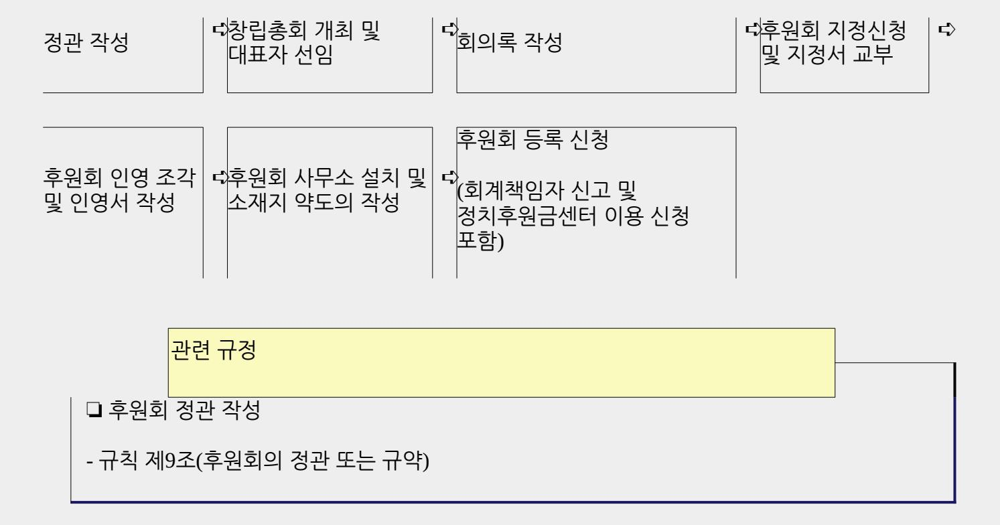
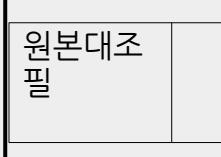
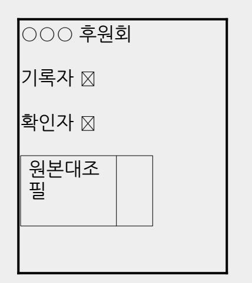

<!-- page: 1 -->

- ▸ 선거구 사무를 관할하는 선거관리위원회 …… 관할 선거관리위원회
- ▸ 선거관리위원회 ……………………………………………… 위원회
- ▸ 정치자금사무관리 규칙 ………………………………… 규칙
- ▸ 정치자금법 …………………………………………………………… 법

- 법규명 선거관리위원회명칭 등은 다음과 같이 줄여서 표기하였습니다 ․ .
- 선거관리위원회에 등록된 단체

- 「정치자금법」에 따라 (예비)후보자의 정치활동에 필요한 자금을 지원하기 위한 단체로서 관할

▸ 후원회

- 제9회 전국동시지방선거에서 「공직선거법」에 따라 관할 선거관리위원회에 예비후보자 또는 후보자로 등록된 사람

▸ (예비)후보자

본문에서 나오는 용어의 뜻은 다음과 같습니다.

 이 가이드북은 2026. 6. 3. 실시하는 제9회 전국동시지방선거에 대비하여 (예비)후보자를 대상으로 후원회 설립의 전 과정을 알기 쉽게 수록한 것입니다.

2026

제9회 전국동시지방선거 대비

제2장

정치후원금센터 이용신청 43

회계책임자 신고 35

<!-- page: 2 -->

후원회를 둔 지방의회의원의 후원회 지정 신고 32

후원회 등록 신청 29

후원회 사무소 설치 및 소재지 약도의 작성 26

후원회 지정신청 및 지정서의 교부 19

후원회 인영 조각 및 인영서의 작성 22

후원회결성 회의록의 작성 13

후원회 창립총회 개최 및 대표자의 선임 10

후원회 정관 작성 3

업무 흐름도 2

후원회 설립 절차

제1장

<!-- page: 3 -->

목 차

- 후원회 사무소 설치 및 소재지 약도의 작성
- 후원회 인영 조각 및 인영서의 작성
- 후원회 지정신청 및 지정서의 교부
- 후원회결성 회의록의 작성
- 후원회 창립총회 개최 및 대표자의 선임
- 후원회 정관 작성
- 업무 흐름도
- 01. 후원회 설립 절차
- 후원회 설립 가이드북

전자정치자금영수증 발급매뉴얼 102

각종 서식 모음 78

자주묻는 질문과 답변 74

부 록

제3장

- 후원회 변경등록·해산 66
- 정치자금영수증 발행 60
- 후원금 모금 57
- 후원회 회원 모집 52
- 예금계좌 변경신고 49
- 업무 흐름도 48

<!-- page: 4 -->

01 후원회 설립 절차

1. 업무 흐름도

회계책임자 신고 정치후원금센터 이용신청

후원회를 둔 지방의회의원의 후원회 지정 신고

후원회 등록 신청

❏ 후원회 지정

- 법 제6조(후원회지정권자)

- 규칙 제5조(후원회의 지정 및 지정철회)

❏ 후원회 명칭

- 규칙 제7조(후원회 등의 명칭)

- 규칙 [별표1] 후원회 명칭(약칭)

❏ 후원회 사무소 설치

- 법 제9조(후원회의 사무소 등)

❏ 후원회 등록 신청

- 법 제7조(후원회의 등록신청 등)

- 규칙 제6조(후원회의 등록신청 등)

❏ 회계책임자 선임신고

- 법 제34조(회계책임자의 선임신고 등), 제35조(회계책임자의 변경신고 등)

- 규칙 제32조(회계책임자의 선임신고 등), 제33조(회계책임자의 겸임), 제34조(예금계좌 등의 신고)

<!-- page: 5 -->

## 2. 후원회 정관 작성

가. 후원회지정권자인 (예비)후보자를 위해 후원회를 설립하고자 하는 사람은 후원회 설립의 첫 단계로서 후원회의 정관을 작성합니다.

나. 정관이란 후원회의 조직형태, 운영방법 등에 관한 기본적인 사항을 규정한 후원회의 내부 규칙을 말합니다.

다. 정관은 [작성예시]에 따른 표준정관을 참고하되 후원회 고유의 특징이 충분히 반영되도록 작성합니다.

라. 후원회의 정관은 규칙 제9조에 따른 사항을 반드시 포함하여 작성하여야 하며, 그 외의 사항은 자유롭게 구성합니다.

후원회 정관 필수 기재사항(규칙 제9조)

❏ 명칭ㆍ목적 및 소재지

❏ 회원의 가입과 탈퇴 등 신분에 관한 사항

❏ 후원금의 모금 및 기부에 관한 사항 ❏ 대표자ㆍ회계책임자의 선임 및 해임에 관한 사항 ❏ 대표자가 사고가 있을 때의 직무대리에 관한 사항 ❏ 해산에 관한 사항 ❏ 정관 또는 규약의 변경에 관한 사항 ❏ 후원회의 대의기관 또는 그 수임기관에 관한 사항 ❏ 후원회의 감사기관에 관한 사항 ❏ 그 밖의 후원회의 운영에 관한 사항

[작성예시] 후원회의 명칭 및 약칭은 예시(p.22)를 참고하여 정확하게 작성

○○○(예비)후보자○○○후원회 정관

20 년 월 일

○○○(예비)후보자○○○후원회

제1장 총 칙

제1조(명칭) 본 회의 명칭은 '○○○(예비)후보자○○○후원회', 약칭은 ○○○후원회(○○○선거)라 칭한다. (이하 "후원회"라 한다.)

제2조(목적) 본 후원회는 회원 또는 회원 이외의 자로부터 후원금을 모금하여 후원회지정권자 ○○○ 에게 기부하는 것을 목적으로 한다.

제3조(사무소 소재지) 본 후원회의 사무소는 ○○○구 시 군에 둔다 ‧ ‧ .

제2장 회 원

제4조(회원) 정치자금 기부제한 자와 정당의 당원이 될 수 없는 자를 제외한 모든 이는 자유의사에 의해 후원회의 회원이 될 수 있다.

제5조(가입과 탈퇴) ①회원이 되고자 하는 자는 후원회 소정의 가입원서를 제출하여야 한다.

②회원이 탈퇴하고자 할 때에는 탈퇴원서를 제출하여야 한다. 탈퇴는 탈퇴원서를 후원회에 제출함으로써 그 효력이 발생한다.

제6조(회원의 제명) ①회원으로서 후원회의 목적에 배치되는 행위 또는 명예나 위신에 손상을

가져오는 행위를 하였을 때에는 제명할 수 있다.

<!-- page: 6 -->

②회원의 제명은 운영위원회의 재적위원 과반수의 찬성으로 의결한다.

제3장 총 회

제7조(구성) 총회는 회원 전원으로 구성한다.

제8조(총회의 기능) ①총회는 후원회의 최고의결기구로서 다음 각호의 기능을 가진다.

1. 후원회의 기본운영에 관한 사항의 심의, 의결

2. 후원회 대표자의 선출 및 해임

3. 정관의 제정 및 개정

4. 사업보고의 승인

5. 후원회의 대의기관 또는 그 수임기관에 관한 사항

6. 후원회의 감사기관에 관한 사항

7. 기타 후원회와 관련된 중요사항의 심의, 의결

②총회의 소집이 어려울 때는 운영위원회가 그 기능을 대신할 수 있다.

③총회는 그 기능을 운영위원회에 위임하는 의결을 할 수 있다.

제9조(총회소집) 총회는 대표자가 필요하다고 인정할 때 또는 회원 3분의 1 이상의 요구가 있을 때 대표자가 이를 소집한다.

제10조(의결정족수) ①총회는 재적회원 과반수의 출석과 출석회원 과반수의 찬성으로 의결한다. 다만, 부득이한 사정이 있는 회원은 서면으로 권한을 위임할 수 있으며 이 경우에는 출석한 것으로 간주한다.

②가부동수인 때에는 대표자가 결정권을 가진다.

제4장 운영위원회

제11조(구성) ①총회의 수임기관으로 운영위원회를 둔다.

②운영위원회는 10인 이내의 위원으로 구성하되, 총회에서 선출한다.

<!-- page: 7 -->

③운영위원회에 위원장을 두되, 위원장은 후원회의 대표자가 맡는다.

제12조(기능) 운영위원회는 다음의 기능을 가진다.

1. 총회에서 위임된 사항의 심의, 의결

2. 총회에 부의할 사항의 심의

3. 예산 및 결산의 승인

4. 대표자 직무대리자의 선출 및 총무 선임

5. 업무보고의 승인

6. 회원의 제명 결의

7. 기타 중요한 사항의 심의, 의결

제13조(회의소집) ①위원장은 필요한 경우 운영위원회를 소집할 수 있다.

②재적 운영위원 3분의 1이상의 요구가 있을 때에는 위원장은 임시회를 소집하여야 한다.

제14조(의결정족수) ①운영위원회 의결정족수는 제10조의 규정을 준용한다.

②가부동수인 때에는 위원장이 결정권을 가진다.

제5장 임 원

제15조(대표자) ①후원회에 대표자(회장) 1인을 둔다.

②대표자는 총회에서 선출한다.

③대표자는 후원회를 대표하며 회의를 총괄한다.

④대표자의 궐위시 운영위원 중 최연장자가 그 직무를 대행한다.

제16조(총무) ①후원회의 운영을 위하여 총무를 둔다.

②총무는 운영위원회에서 지명하고 대표자를 도와 후원회사무를 총괄한다.

<!-- page: 8 -->

제17조(회계책임자) ①후원회의 회계책임자는 대표자가 선임 해임하며 총무를 겸임할 수 있다 ․ .

②회계책임자 사고 시에는 정치자금법 에 의한 회계사무보조자가 위임받은 회계지출만을 하여야 「 」 하며, 대표자는 지체없이 새로운 회계책임자를 선임하여야 한다.

제18조(감사) ①후원회의 회계 및 사업의 적정한 운영을 기하기 위하여 2인의 감사를 둔다.

②감사는 운영위원회에서 선출한다.

제6장 후원금 모금 및 기부

제19조(회비) 후원회의 회원은 연간 1만원 또는 그에 상당하는 가액 이상의 후원금을 납입하여야 한다.

제20조(후원금 모금 등) 후원회는 정치자금법 에 따라 회원 또는 회원이 아닌 자로부터 후원금을 「 」 모금할 수 있다.

제21조(모금의 제한) 본 후원회가 연간 모금할 수 있는 후원금은 정치자금법 상의 연간모금한도액을 「 」 초과할 수 없다.

제22조(기부) ①후원회는 지정권자에게 정치자금법 의 연간모금한도액 또는 그에 상당하는 「 」 가액까지 기부할 수 있다.

②본 후원회가 후원금을 모금한 때에는 지체없이 이를 지정권자에게 기부한다. 이 경우 모금에 직접 소요된 경비는 기부할 금액에서 공제할 수 있다.

제23조(해산) 후원회는 다음 사유가 생긴 때에는 해산된다.

1. 후원회지정권자가 지정을 철회한 경우

2. 후원회지정권자가 후원회를 둘 수 있는 자격을 상실한 경우

3. 총회에서 해산결의를 한 경우

4. 기타의 사유발생 시 후원회에 관한 법률이 정한 바에 따른다.

제24조(잔여재산 처분) 후원회가 해산된 경우 잔여재산은 정치자금법 제 「 」 21조에 따라 처분한다.

제8장 정관개정

제7장 해 산

제25조(개정) ①정관개정은 총회에서 재적회원 과반수의 찬성으로 의결한다.

②제1항에도 불구하고 제8조 제2항에 따라 운영위원회 회의를 통해 정관을 개정할 수 있다.

③제2항의 운영위원회 의결정족수는 제14조를 준용한다.

부 칙

제1조(시행일) 이 정관은 총회에서 의결된 날부터 시행한다.

제2조(위임사항) 후원회의 운영에 필요한 사항에 관하여는 운영위원회에서 내규로 정할 수 있다.

<!-- page: 9 -->

### 3. 후원회 창립총회 개최 및 대표자의 선임

가. 후원회를 결성하고자 하는 사람들이 자발적으로 모여 서로의 의사를 확인하고, 어느 정도 후원회를 설립하고자 하는 사람들의 집단이 형성되면 창립총회를 개최합니다.

나. 창립총회는 개회 → 국민의례 → 경과보고 → 임시의장 선출 → 안건처리(정관 채택, 대표자 등 선출) → 폐회의 순서로 진행하되 후원회 여건에 따라 달리 운영할 수 있습니다.

### 임시의장의 역할

❏ 임시의장은 후원회 대표자가 선출되기 전에 대표자의 역할을 대행하는 사람으로서 후원회 창립총회 시 대표자를 대신하여 후원회 정관의 채택, 후원회 대표자 선출 등의 역할을 합니다.

다. 창립총회 개최 후 선임된 대표자에게 [작성예시]와 같은 취임동의서를 제출 받습니다.

라. 후원회 대표자를 공동으로 선임하는 것은 가능합니다. 다만, 후원회 정관에 그와 관련한 내용이 기재되어 있어야 하며, 공동 대표자 각각의 취임동의서를 제출하여야 합니다.

후원회 창립총회 관련 질의회답

<!-- page: 10 -->

## ❏ 후원회 창립총회 현장에서 후원금품 모집

-「정치자금법」에 의한 후원회는 관할 선거관리위원회에 등록을 한 후부터 후원금품을 모집할 수 있으므로 관할 선거관리위원회에 등록하기 전에는 후원금품을 모집할 수 없음(2004. 11. 8. 회답).

[작성예시]

| 취 임 동 의 서                                |                  |                     |
|------------------------------------------|------------------|---------------------|
| 성 명①                                     | 김중앙(한자 : 金中央)    |                     |
| 주 소②                                     | 서울특별시 관악구 백제길    | 17                  |
| 생 년 월 일③                                 | 1965년 1월 1일      |                     |
| 전 화 번 호④                              | (자택) 02-555-6543 | (휴대폰) 010-1234-5678 |
| 본인은 ⑤ ○○○(예비)후보자○○○후원회의 대표자로 취임함을 동의합니다. |                  |                     |
| 20 년 월 일                                 |                  |                     |
| 성 명 김 중 앙 (서명 또는 날인) ⑥                |                  |                     |
| ⑦ ○○○(예비)후보자○○○후원회 귀중                    |                  |                     |
| 주. 이 서식은 동의자가 작성하여 당해 후원회에 제출함.          |                  |                     |

작 성 요 령

| ① | 후원회 대표자의 성명과 한자를 적습니다.               |
|---|--------------------------------------|
| ② | 후원회 대표자가 거주하는 곳의 도로명 주소를 적습니다.       |
|   | ※ 도로명 주소를 알지 못할 경우 구주소(지번주소) 가능      |
| ③ | 후원회 대표자의 생년월일을 적습니다.                 |
| ④ | 후원회 대표자의 자택과 휴대전화 번호를 적습니다.       |
|   | ※ 자택 번호가 없을 시 기재 생략 가능            |
| ⑤ | 약칭 사용 시 약칭으로 작성가능합니다.                |
| ⑥ | 후원회 대표자의 성명을 적고 개인 인장(도장)을 날인하거나 서명을 |

합니다.

⑦ 약칭 사용 시 약칭으로 작성가능합니다.

<!-- page: 11 -->

### 4. 후원회결성 회의록의 작성

가. 후원회 창립총회가 끝난 뒤 작성하는 결성회의록에는 창립총회 개최일시·장소, 안건처리 등 회의 진행 상황이 자세히 기록되어야 합니다.

나. 회의록에는 회의 진행 상황을 기록한 기록자와 회의록이 제대로 작성되었는지 확인한 확인자의 서명 또는 날인이 있어야 합니다.

다. 회의록 사본을 제출하는 때에는 후원회 관계자가 원본과 대조하여 다름이 없음을 확인한 후 회의록 각 페이지 원본대조필 날인란에 대표자의 직인(도장)을 날인 합니다.

| ❏ 개최일시, 장소, 안건처리 등 진행 상황 기재 여부      |        |
|-------------------------------------|--------|
| ❏ 후원회 등록신청사항(대표자 등)과 회의내용의 일치 여부 |        |
| ❏ 회의록 기록자와 확인자의 서명 또는 날인 여부         |        |
| ❏ 각 안건이 정관에서 정한 의결정족수 충족 여부         |        |
|                                     | 체크 포인트 |

[작성예시]

○○○(예비)후보자○○○후원회결성 회의록 일 시① : 2026년 2월 3일(화) 16:00~18:00 장 소② : 경기도 과천시 홍촌말로 44, 2층 201호 ○○○(예비)후보자○○○후원회 기록자③ 홍길동 확인자④ 나공명 원본대조 필

⑤

| 식 순 1. 개 회 (성원현황 등 포함) 2. 국민의례 3. 경과보고 4. 임시의장 선출 5. 후원회 정관 채택 6. 대표자(회장) 등 임원 선출 7. 기 타 8. 폐 회 원본대조 필 |
|-----------------------------------------------------------------------------------------------------------------------------------------|
|                                                                                                                                         |
|                                                                                                                                         |
|                                                                                                                                         |
|                                                                                                                                         |
|                                                                                                                                         |
|                                                                                                                                         |
|                                                                                                                                         |
|                                                                                                                                         |
|                                                                                                                                         |
|                                                                                                                                         |
|                                                                                                                                         |
|                                                                                                                                         |

<!-- page: 12 -->

#### ○○○(예비)후보자○○○후원회결성 회의록

1. 개 회

사회자 : 먼저 바쁘신데도 불구하고 ○○○(예비)후보자○○○후원회 결성식에 참석해 주신 여러분께 감사의 말씀을 드립니다. 재적회원 총 ○○명중 ○○명이 참석하여 성원되었음을 보고합니다. 그러면, 지금부터 ○○○(예비)후보자○○○후원회의 결성식을 시작하겠습니다.

2. 국민의례

사회자 : 국민의례가 있겠습니다. 모두 자리에서 일어서 전면의 국기를 향하여 주시기 바랍니다. 국기에 대하여 경례! 바로! 모두 자리에 앉아 주시기 바랍니다.

3. 경과보고

사회자 : 다음은 ○○○(예비)후보자○○○후원회 결성식을 개최하기까지의 진행경과를 후원회 준비위원인 ○○○께서 보고드리겠습니다.

○○○ : 경과를 보고드리겠습니다.

우리나라의 정치발전과 ○○시 도‧ (○○구·시·군)의 한단계 더 높은 도약을 위하여 (예비)후보자○○○

의 원활한 정치자금 조달을 위한 후원회를 설립하게 되었습니다.

○○○ : 지난 0월 0일 창립준비위원회를 구성하였고, 뜻을 같이하는 ○○분이 참여하여 오늘 후원회 결성식을 거행하게 되었습니다. 앞으로 후원회가 잘 될 수 있도록 많이 도와주시기 바랍니다. 고맙습니다.

4. 임시의장 선출

사회자 : 다음은 회의의 원만한 진행을 위하여 임시의장을 선출하도록 하겠습니다. 임시의장 선출 방식은 여러 가지가 있겠으나 신속한 회의 진행을 위해서 후원회 결성에 많은 노력을 하신 ○○○을 추천하겠습니다. 이의가 없으시면 박수로 동의하여 주시기 바랍니다.

참석자 : 전원 박수로 ○○○을 임시의장으로 선출

<!-- page: 13 -->

5. 후원회 정관 채택

임시의장 : 그러면 먼저 후원회 정관을 검토하도록 하겠습니다. 기 배부해드린 정관을 검토하고 오셨으리라 보고 정관 내용에 이의가 있거나 수정을 요하는 사항이 있으면 말씀해 주시기 바랍니다.

참 석 자 : (전원) 이의 없습니다.

임시의장 : 참석자 전원이 찬성하였으므로 ○○○(예비)후보자○○○후원회의 정관이 의결되었음을 선포합니다.

6. 대표자(회장) 등 임원 선출

임시의장 : 다음은 정관에 따라 본 후원회를 이끌어 나갈 대표자와 감사를 선출하고, 총회의 수임기관인 운영위원회를 구성할 운영위원들을 선출하도록 하겠습니다. 적임자를 추천하여 주시기 바랍니다.

○○○ : 대표자에는 지금까지 준비위원회를 구성하는 등 후원회설립을 위해 혼신의 힘을 다하신 ○○○ 을 추천하고, 감사에는 ○○○님과 ○○○님을 추천합니다. 그리고 ○○○, ○○○, ○○○을 운영위원으로 추천합니다.

임시의장 : ○○○님으로부터 추천이 있었습니다. 다른 의견을 가지신 분 있으면 말씀하여 주시기 바랍니다.

참 석 자 : (전원 손을 들면서) 동의합니다.

임시의장 : 참석자 전원이 찬성하여 의결정족수를 충족하므로⑥ 후원회 대표자에는 ○○○을, 감사에는 ○○○, ○○○을, 운영위원에는 ○○○, ○○○, ○○○이 선출되었음을 선포합니다.

임시의장 : 그러면, 후원회 대표자로 선출되신 ○○○님의 인사말을 듣도록 하겠습니다.

○○○ : 부족한 저를 대표로 뽑아 주셔서 감사드립니다. 앞으로 ○○○(예비)후보자○○○후원회의 후원금 모금 및 후원회 운영에 최선을 다할 것을 약속드립니다. 고맙습니다.

7. 폐 회

사회자 : 이상으로 ○○○(예비)후보자○○○후원회 결성식을 모두 마치겠습니다.

<!-- page: 14 -->

참석해 주신 여러분들께 진심으로 감사드립니다.

| 원본대조 필 |  |
|-----------|--|
|           |  |

|        | 작 성 요 령                                                          |  |
|--------|------------------------------------------------------------------|--|
| 공 통 | 약칭 사용 시 모든 명칭을 약칭으로 사용가능합니다.                                     |  |
| ①      | 후원회 창립총회를 한 일시를 적습니다. 예) 2026년 2월 3일(월) 16:00 ~ 18:00         |  |
| ②      | 후원회 창립총회를 한 장소를 적습니다. 예) 경기도 과천시 홍촌말로 44, 2층 201호          |  |
| ③      | 후원회결성 회의록을 기록한 사람을 적고 그 인장(도장)을 날인합니다.                           |  |
| ④      | 후원회결성 회의록이 제대로 작성되었는지 확인하고 대표자성명을 기재한 후 그 인장(도장)을 날인합니다.      |  |
| ⑤      | 회의록 원본과 다름이 없음을 대표자가 확인하여 대표자직인을 날인합니다.                          |  |
| ⑥      | 후원회 정관에서 정한 의결정족수(예 : 재적회원 과반수 출석, 출석회원 과반수 찬성)에 부합하는지 확인합니다. |  |

5. 후원회 지정신청 및 지정서의 교부

가. 후원회로서 외형과 실질을 갖춘 단체는 지정권자인 (예비)후보자에게 후원회로 지정하여 줄 것을 요청합니다.

나. 후원회지정권자인 (예비)후보자는 자신을 후원하려는 1개의 후원회를 지정할 수 있으며, 지정한 후원회에 후원회 지정서를 교부합니다.

다. 후원회 대표자는 후원회지정권자의 지정을 받은 날부터 14일 이내에 지정서를 첨부하여 관할 선거관리위원회에 후원회 등록신청을 하여야 합니다.

지방선거후원회지정권자(법 제6조)

| 문서번호      |    |                                             |            |                |
|-----------|----|---------------------------------------------|------------|----------------|

<!-- page: 15 -->

| 명칭(약칭)②   |    | (명칭) ○○○(예비)후보자○○○후원회 (약칭) ○○○후원회(○○○선거) |            |                |
| 사무소의 소재지③ |    | 경기도 과천시 홍촌말로 44, 2층 201호              | 전 화 번 호 | 02-000-0000    |
| 대표자④      | 성명 | 김중앙(한자 : 金中央)                               | 주민등록번호     | 710101-1234567 |
|           | 주소 | 서울특별시 송파구 백제고분로 ○○                          | 전 화 번 호 | 010-1234-5678  |

후원회 (지정) (․ 지정철회)서①

[규칙 별지 제3호 서식]

[작성예시]

- 100만원 이하의 과태료

❏ 후원회지정권자로부터 지정을 받은 날부터 14일 이내에 후원회 등록신청을 하지 않는 등 후원회 등록신청을 해태한 자

후원회 지정 관련 과태료(법 제51조)

예) 성북구의회의원(예비)후보자, 당진시의회의원(예비)후보자 ※ 비례 제외

❏ 지역구자치구·시·군의회의원(예비)후보자

예) 서울특별시의회의원(예비)후보자, 경기도의회의원(예비)후보자 ※ 비례 제외

❏ 지역구시·도의회의원(예비)후보자

예) 단양군수(예비)후보자, 속초시장(예비)후보자

❏ 자치구·시·군의장(예비)후보자

예) 충청남도교육감(예비)후보자, 대전광역시교육감(예비)후보자

❏ 시·도교육감(예비)후보자

예) 경상남도지사(예비)후보자, 광주광역시장(예비)후보자

❏ 시·도지사(예비)후보자

|                                                                                     | (○○동, ○○아파트) |  |  |
|-------------------------------------------------------------------------------------|--------------|--|--|
| (지정) (․ 지정철회)                                                                    | 20 년 월 일     |  |  |

<!-- page: 16 -->

| 연 월 일⑤                                                                              |              |  |  |
| 「정치자금법」 제6조ㆍ제7조제3항 및 「정치자금사무관리 규칙」 제5조에 따라 위와 같이 후원회를 (지정)ㆍ(지정철회)합니다.            |              |  |  |
| 20 년 월 일                                                                            |              |  |  |
| ○○○(예비)후보자○○○ 󰊱 ⑥                                                                |              |  |  |
| ○○○(예비)후보자○○○후원회 귀중 ⑦                                                               |              |  |  |
| 주 : 후원회 명칭에 약칭을 사용하는 경우 "명칭(약칭)"란에는 「정치자금사무관리 규칙」 제7조에 따른 후원회의 명칭과 약칭을 함께 기재합니다. |              |  |  |

|   | 작 성 요 령                                                                             |
|---|-------------------------------------------------------------------------------------|
| ① | 후원회 지정 혹은 지정철회 중 하나를 선택하여                                                           |
|   | "○" 표시를 합니다. 이하 같습니다.                                                               |
|   | 후원회의 명칭을 적습니다. 후원회 약칭을 사용하는 경우 후원회의 명칭과 약칭을 함께 기재합니다. |
| ② | 예) (명칭) 경기도과천시선거구도의회의원(예비)후보자홍길동후원회                                                 |
|   | (약칭) 홍길동후원회(경기도의원선거)                                                                |
| ③ | 후원회 사무소의 소재지를 도로명 주소로 적습니다.                                                         |
|   | ※ 도로명 주소를 알지 못할 경우 구주소(지번주소) 가능                                                     |
|   | 후원회 대표자의 성명, 주민등록번호, 주소, 전화번호를 적습니다.                                                |
| ④ | ※ 후원회 등록신청서에 기재된 내용과 동일하게 기재                                                        |
|   | ※ 전화번호는 대표자의 개인 휴대전화 번호 가능                                                       |
| ⑤ | 후원회지정권자가 후원회에 지정서를 교부한 연월일 또는 지정철회한 연월일을 적습니다.                                      |
| ⑥ | 후원회지정권자인 (예비)후보자의 인장(도장)을 날인합니다.                                                    |
| ⑦ | 약칭 사용 시 약칭으로 작성가능합니다                                                                |

예) (명칭) 금천구청장(예비)후보자홍길동후원회, 익산시장(예비)후보자홍길동후원회

❏ 자치구·시·군의장(예비)후보자후원회

(약칭) 홍길동후원회(경상북도교육감선거), 홍길동후원회(대구시교육감선거)

후보자홍길동후원회

<!-- page: 17 -->

예) (명칭) 경상북도교육감(예비)후보자홍길동후원회, 대구광역시교육감(예비)

❏ 시·도교육감(예비)후보자후원회

(약칭) 홍길동후원회(서울시장선거), 홍길동후원회(경기도지사선거)

예) (명칭) 서울특별시장(예비)후보자홍길동후원회, 경기도지사(예비)후보자홍길동후원회

❏ 시·도지사(예비)후보자후원회

후원회의 명칭 및 약칭 예시

※ 규칙 [별표]1 참고

| 선거명          | 명칭                         | 약칭                  |
|--------------|----------------------------|---------------------|
| 시·도지사선거      | ○○시장·도지사                   | ○○○후원회              |
|              | (예비)후보자○○○후원회              | (○○시ㆍ도지사선거)         |
| 교육감선거        | ○○시·도교육감                   | ○○○후원회              |
|              | (예비)후보자○○○후원회              | (○○시ㆍ도교육감선거)        |
|              | ○○구청장·시장·군수                | ○○○후원회              |
| 자치구·시·군의장선거  | (예비)후보자○○○후원회              | (○○ 구청장ㆍ시장ㆍ군수선거) |
| 지역구시·        | ○○시·도○○선거구                 | ○○○후원회              |
| 도의회의원선거      | 시·도의회의원(예비)후보자○○○후원회       | (○○시ㆍ도의원선거)         |
| 지역구자치구·시·군의회 | ○○구·시·군○○선거구               | ○○○후원회              |
| 의원선거         | 구·시·군의회의원(예비)후보자○○○ 후원회 | (○○구ㆍ시ㆍ군의원선거)       |

후원회의 명칭(약칭)

(약칭) 홍길동후원회(금천구청장선거), 홍길동후원회(익산시장선거)

❏ 지역구시·도의회의원(예비)후보자후원회

예) (명칭) 대구광역시북구제1선거구시의회의원(예비)후보자홍길동후원회, 충청북도제천시제1 선거구도의회의원(예비)후보자홍길동후원회

(약칭) 홍길동후원회(대구시의원선거), 홍길동후원회(충청북도의원선거)

❏ 지역구자치구·시·군의회의원(예비)후보자후원회

예) (명칭) 이천시가선거구시의회의원(예비)후보자홍길동후원회, 용산구가선거구

구의회의원(예비)후보자홍길동후원회

(약칭) 홍길동후원회(이천시의원선거), 홍길동후원회(용산구의원선거)

<!-- page: 18 -->

후원회 인영(도장)

가. 후원회의 인영(도장)인 회인과 대표자 직인은 [작성예시]를 참고하여 제작하며 알아보기 쉽게 깨끗하고, 뚜렷하게 붉은색으로 날인합니다.

※ 인영을 제작하기 전 관할 선거관리위원회에 정확한 명칭을 확인함.

나. 인영은 위조될 수 없도록 조각하며 인영의 규격에 대한 제한사항은 없습니다.

[작성예시]

[규칙 별지 제4호 서식 별지]

| 인 영 서     |                                                                                |
|-----------|--------------------------------------------------------------------------------|
| 명칭 또는 약칭① | (명칭) ○○○(예비)후보자○○○후원회 (약칭) ○○○후원회(○○○선거)                                    |
| 회 인②      | 명칭 사용 시 약칭 사용 시 ○○○(예비) 후보자 ○○○ 후원회인 ○○○ 후원회 (○○○선거) 인 |

|   | 작 성 요 령                               |  |  |
|---|---------------------------------------|--|--|
|   | 후원회의 명칭 또는 약칭을 적습니다.                  |  |  |
| ① | 예) (명칭) 경기도과천시선거구도의회의원(예비)후보자홍길동후원회   |  |  |
|   | (약칭) 홍길동후원회(경기도의원선거)                  |  |  |
|   | 후원회 명의의 인영은 위조될 수 없도록 조각한 후 찍습니다.     |  |  |
| ② | 예) (명칭) 경기도과천시선거구도의회의원(예비)후보자홍길동후원회   |  |  |
|   | (약칭) 홍길동후원회(경기도의원선거)인                 |  |  |
| ③ | 후원회 대표자 명의의 인영은 위조될 수 없도록 조각한 후 찍습니다. |  |  |

4. "비고"란에는 등록(신고) 또는 변경등록(신고)의 사유와 일자 등을 담당공무원이 기재합니다.

3. 인영은 알아보기 쉽게 깨끗하고, 뚜렷하게 붉은색으로 날인합니다.

<!-- page: 19 -->

2. "명칭 또는 약칭"란에는 인영에 표시할 「정치자금사무관리 규칙」 제7조의 규정에 따른 명칭 또는 약칭 중 하나를 정해 기재합니다.

주 1. 후원회의 등록시 또는 이미 등록된 회인과 대표자 직인의 변경등록시 사용합니다.

|         | ※ 인영에 표시된 문자: (명칭) ○○○(예비)후보자○○○후원회인    |  |  |  |
|---------|-----------------------------------------|--|--|--|
|         | (약칭) ○○○후원회(○○○선거)인                     |  |  |  |
|         | 명칭 사용 시 약칭 사용 시                         |  |  |  |
| 대표자 직인③ | ○○○(예비)                                 |  |  |  |
|         | 후보자 ○○○                                 |  |  |  |
|         | 후원회대표자 인                             |  |  |  |
|         | ○○○ 후원회                              |  |  |  |
|         | (○○○선거)                                 |  |  |  |
|         | 대표자인                                    |  |  |  |
|         | ※ 인영에 표시된 문자: (명칭) ○○○(예비)후보자○○○후원회대표자인 |  |  |  |
|         | (약칭) ○○○후원회(○○○선거)대표자인                  |  |  |  |
| 비 고     |                                         |  |  |  |

후보자홍길동후원회대표자인

예) (명칭) 경기도과천시선거구도의회의원(예비)

(약칭) 홍길동후원회(경기도의원선거)대표자인

7. 후원회 사무소 설치 및 소재지 약도의 작성

가. 후원회는 사무소 1개를 설치할 수 있습니다.

나. 후원회의 사무소에 두는 유급사무직원의 수는 2인을 초과할 수 없습니다.

<!-- page: 20 -->

다. 지방선거에 있어 후원회 사무소 소재지에 대하여 「정치자금법」에 제한하는 규정은 없습니다.

라. 후원회 소재지의 약도는 인터넷 포털사이트 지도 등을 그림파일로 저장하여 붙여넣는 방식으로 작성합니다.

| 후원회 사무소 관련 과태료(법 제51조)                        |
|-----------------------------------------------|
| ❏ 후원회 사무소에 둘 수 있는 유급사무직원의 수를 초과한 경우(2인 초과) |
| - 300만원 이하의 과태료                               |

후원회 사무소 관련 질의회답

❏ 후원회사무소 간판의 규격 등

- 「공직선거법」상 후원회사무소 간판의 규격 및 후원회지정권자의 사진 게재를 제한하고 있지 아니함(2023. 12. 11. 회답).

[작성예시]

| 후원회 사무소 소재지 약도 |                       |
|----------------|-----------------------|
| 명칭 또는 약칭①      | (명칭) ○○○(예비)후보자○○○후원회 |

<!-- page: 21 -->

③ 후원회 사무소의 전화번호를 적습니다.

※ 도로명 주소를 알지 못할 경우 구주소(지번주소) 가능

② 후원회 사무소의 도로명 주소를 적습니다.

(약칭) 홍길동후원회(경기도의원선거)

① 예) (명칭) 경기도과천시선거구도의회의원(예비)후보자홍길동후원회

후원회의 명칭 또는 약칭을 적습니다.

작 성 요 령

|  |  | 후원회의 명칭 또는 약칭을 적습니다. |
|--|--|----------------------|

| 작 성 요 령 |  |
|---------|--|
|---------|--|

| ㅎ의히이 | 며치 | 뜨 | 야치으 | 저스니다 |  |
|------|----|---|-----|------|--|

<!-- page: 22 -->

|             | (약칭) ○○○후원회(○○○선거)          |
|-------------|-----------------------------|
| 사무소주소②      | 경기도 과천시 홍촌말로 44, 2층 201호 |
| 전 화 번 호③ | 02-000-0000                 |
| [약 도]④      |                             |
|             |                             |
|             |                             |
|             |                             |
|             |                             |
|             |                             |

※ 전화번호는 개인 휴대전화번호 가능

④ 후원회 사무소의 약도를 인터넷 포털사이트 지도 등을 그림파일로 저장하여 붙여넣는 방식으로 작성합니다.

8. 후원회 등록 신청

가. 후원회 대표자는 (예비)후보자인 후원회지정권자의 지정을 받은 날부터 14일 이내에 그 지정서를 첨부하여 관할 선거관리위원회에 후원회의 등록을 신청하여야 합니다.

| 후원회 등록신청서 제출                                |  |
|---------------------------------------------|--|
| ❏ 시·도지사(예비)후보자후원회 : 관할시·도위원회                |  |
| ❏ 교육감(예비)후보자후원회 : 관할시·도위원회                  |  |
| ❏ 자치구·시·군의장(예비)후보자후원회 : 관할구·시·군위원회          |  |
| ❏ 지역구시·도의회의원(예비)후보자후원회 : 관할구·시·군위원회         |  |
| ❏ 지역구자치구·시·군의회의원(예비)후보자후원회 : 관할구·시· 군위원회 |  |

체크 포인트

<!-- page: 23 -->

❏ 후원회 정관 내용이 법과 규칙에 위반되는지 여부

❏ 후원회 등록신청 내용과 구비서류와의 일치 여부

❏ 후원회 명칭 또는 약칭과 인영내용의 일치 여부

나. 다음의 경우에는 후원회 등록신청이 수리되지 않습니다.

- 후원회 등록신청에 있어서 후원회 성립요건에 중대한 흠이 있어 처음부터 보정·보완을 할 수 없는 경우

- 구비서류 미비 등으로 관할 선거관리위원회로부터 2회 이상 보정·보완 요구를 받았지만 정해진 기한까지 보정·보완을 하지 아니한 경우

후원회 등록 관련 과태료(법 제51조)

| [규칙 별지 제4호 서식]                                                                                                      |    |                                             |             |                |  |
|---------------------------------------------------------------------------------------------------------------------|----|---------------------------------------------|-------------|----------------|--|
| 후원회 등록신청서                                                                                                           |    |                                             |             |                |  |
| 문서번호                                                                                                                |    |                                             |             |                |  |
| 명 칭(약칭)①                                                                                                            |    | (명칭) ○○○(예비)후보자○○○후원회 (약칭) ○○○후원회(○○○선거) |             |                |  |
| 사무소의 소재지②                                                                                                           |    | 경기도 과천시 홍촌말로 44,                            |             |                |  |
|                                                                                                                     |    | 2층 201호                                  | 전 화 번 호③ | 02-000-0000    |  |
|                                                                                                                     | 성명 | 김중앙(한자 : 金中央)                               | 주민등록번호      | 710101-1234567 |  |
| 대표자④                                                                                                                | 주소 | 서울특별시 송파구 백제고분로 ○○                       | 전 화 번 호  | 010-1234-5678  |  |
|                                                                                                                     |    | (○○동, ○○아파트)                                |             |                |  |
| 정관 또는 규약                                                                                                            |    | 붙임 1                                        |             |                |  |
| 회인 및 대표자 직인의 인영                                                                                                  |    | 붙임 3                                        |             |                |  |
| 후원회를 위와 같이 결성하였기에 정치자금법 제 7조제1항 및 정치자금사무관리 규칙 제 6조제1 「 」 「 」 항에 따라 후원회의 등록을 신청합니다. |    |                                             |             |                |  |
| 20 년 월 월                                                                                                            |    |                                             |             |                |  |
| ○○○(예비)후보자○○○후원회 대표자 직인 ⑤                                                                                     |    |                                             |             |                |  |
| ○○선거관리위원회 귀중 ⑥                                                                                                      |    |                                             |             |                |  |
| ※ 구비서류                                                                                                              |    |                                             |             |                |  |
| 1. 정관 또는 규약 1부.                                                                                                     |    |                                             |             |                |  |
| 2. 대표자의 취임동의서 1부.                                                                                                   |    |                                             |             |                |  |
| 3. 인영서<별지> 1부.                                                                                                      |    |                                             |             |                |  |

[작성예시]

<!-- page: 24 -->

- 100만원 이하의 과태료

❏ 후원회 등록신청을 허위로 한 자

4. 후원회지정서 1부.

5. 후원회결성 회의록 사본 1부.

6. 사무소의 소재지 약도 1부.

주 1. 후원회 명칭에 약칭을 사용하는 경우 "명칭(약칭)"란에는 「정치자금사무관리 규칙」 제7조에 따른 후원회의 명칭과 약칭을 함께 기재합니다.

2. 회의록은 기록자 확인자의 서명 날인이 있어야 하며 ・ ・ , 사본을 제출하는 때에는 "원본대조필"표시와 담당자의 날인이 있어야 합니다.

|   | 작 성 요 령                                                                             |
|---|-------------------------------------------------------------------------------------|
| ① | 후원회의 명칭을 적습니다. 후원회 약칭을 사용하는 경우 후원회의 명칭과 약칭을 함께 기재합니다. |
|   | 예) (명칭) 경기도과천시선거구도의회의원(예비)후보자홍길동후원회                                                 |
|   | (약칭) 홍길동후원회(경기도의원선거)                                                                |
| ② | 후원회 사무소의 도로명 주소를 적습니다.                                                              |
|   | ※ 도로명 주소를 알지 못할 경우 구주소(지번주소) 가능                                                     |
| ③ | 후원회 사무소의 전화번호를 적습니다. ※ 전화번호는 개인 휴대전화번호 가능                                        |
|   | 대표자의 성명(한자 포함), 주민등록번호, 주소, 전화번호를 적습니다.                                             |
| ④ | ※ 전화번호는 개인 휴대전화번호 가능                                                                |
| ⑤ | 후원회 대표자의 신고한 인영(직인)을 찍습니다.                                                          |
|   | 약칭 사용 시 약칭명으로 작성가능합니다.                                                              |
| ⑥ | (예비)후보자로 등록한 관할 선거관리위원회에 제출합니다.                                                     |
|   |                                                                                     |

9. 후원회를 둔 지방의회의원의 후원회 지정 신고

<!-- page: 25 -->

가. 후원회를 둔 지방의회의원은 그 지방의회의원후원회를 해당 지방자치단체장(예비)후보자후원회로 지정할 수 있습니다.

나. 지방자치단체장(예비)후보자후원회 대표자는 후원회지정권자의 지정을 받은 날부터 14일 이내에 지정서를 첨부하여 관할 선거관리위원회에 후원회 등록신청을 하여야 합니다.

후원회를 둔 지방의회의원의 후원회 지정(법 제7조제3항) ❏ 후원회를 둔 시·도의회의원이 해당 시·도지사선거(예비)후보자로 등록 예) 후원회를 둔 경상남도의회의원 -> 경상남도지사(예비)후보자 등록 후원회를 둔 광주광역시의원 -> 광주광역시장(예비)후보자 등록 ❏ 후원회를 둔 구·시·군의원이 해당 자치구·시·군의장선거(예비)후보자로 등록 예) 후원회를 둔 단양군의회의원 -> 단양군수(예비)후보자 등록 후원회를 둔 속초시의회의원 -> 속초시장(예비)후보자 등록

후원회 지정 관련 과태료(법 제51조)

❏ 후원회지정권자로부터 지정을 받은 날부터 14일 이내에 후원회 등록신청을 하지 않는 등 후원회 등록신청을 해태한 자

- 100만원 이하의 과태료

업무TIP

❏ 후원회를 둔 지방의회의원이 해당 지방자치단체장(예비)후보자후원회를 두고자 하는 경우, 지방의회의원후원회를 지정신고 하거나, 별도의 지방자치단체장(예비)후보자후원회를 둘 수 있습니다.

❏ 지정신고 하는 경우 신고서류는 지정신고서, 지정서, 인영서입니다.

[작성예시]

[규칙 별지 제7호 서식]

| 지방자치단체장후보자등 후원회 지정신고서                                                |       |
|----------------------------------------------------------------------|-------|
| 문서번호                                                                 |       |
| 지정권자①                                                                |       |
| 지정내역②                                                                |       |
| 지정연월일③                                                               | 년 월 일 |
| 위와 같이 지정하였기에 「정치자금법」 제7조제3항 및 「정치자금사무관리 규칙」 제10조제1항에 따라 이를 신고합니다. |       |

<!-- page: 26 -->

### 년 월 일

○○○(예비)후보자○○○후원회 대표자 직인

④

○○선거관리위원회 귀중⑤

※ 구비서류

1. 후원회지정서 1부 ⑥

2. 인영서 1부 ⑦

3. 경선후보자등록 확인서류(대통령선거경선후보자 당대표경선후보자등의 후원회에 한함 ․ ) 1부

주 1. 지정권자는 후원회를 둔 국회의원 대통 ․ 령예비후보자·지방의회의원을 말합니다.

2. 지정내역란은 다음과 같이 기재한다.

가. "○○시·도의회의원○○○후원회를 (○○시 도지사예비후보자○○○ ․ ) (○○ ․ 시 도지사후보자○○○ ․ ) 후원회로 지정"

나. "○○구 시 군의회의원○○○후원회를 ․ ․ (○○구청장 시장 군수예비후보자○○○ ․ ․ ) (○○ ․ 구청장 시장 ․ ․ 군수후보자○○○)후원회로 지정"

3. "인영서"는 별지 제4호서식의 <별지>에 의합니다.

## 작 성 요 령

① 지정권자인 지방의회의원명을 적습니다.

예) 경기도의회의원홍길동, 과천시의회의원홍길동

지정내역을 적습니다.

② 예) 경기도의회의원홍길동후원회를 경기도지사(예비)후보자홍길동후원회로 지정, 과천시의회의원홍길동후원회를 과천시장(예비)후보자홍길동후원회로 지정

③ 후원회지정권자가 후원회에 지정서를 교부한 연월일을 적습니다.

④ 후원회 대표자의 신고한 인영(직인)을 찍습니다.

약칭 사용 시 약칭명으로 작성가능합니다.

⑤ 지방자치단체장(예비)후보자로 등록한 관할 선거관리위원회에 제출합니다.

⑥ p20 참고 ※ 단 후원회지정권자는 지방자치단체장(예비)후보자입니다.

⑦ p24 참고

10. 회계책임자 신고

가. 후원회 대표자는 후원회 등록신청서 제출 시 후원회 회계책임자 신고서를 함께 제출하여야 합니다.

업무TIP ❏ 지방의회의원후원회를 지방자치단체장(예비)후보자후원회로 지정신고한 경우에도 회계책임자를 신고하여야 합니다.

※ 규칙 제33조1호가목에 따라 같은 사람이 2 이상의 후원회를 두는 경우 지방의회의원후원회 회계책임자와, 지방자치단체장(예비)후보자후원회 회계책임자 겸임 가능

나. '회계책임자'란 정치자금의 수입·지출업무에 관한 권한과 책임을 가진 사람으로 후원회 대표자는 공직선거의 선거운동을 할 수 있는 사람 중 1인을 관할 선거관리위원회에 신고하여야 합니다.

다. 회계책임자 신고 시에는 회계책임자의 취임동의서와 정치자금 수입·지출용 예금통장 사본을 구비하여야 합니다.

업무TIP

❏ 예금통장 사본을 첨부하여 회계책임자 신고를 하는 경우 별도의 예금계좌 개설신고는 생략합니다.

❏ 지방의회의원후원회를 지방자치단체장(예비)후보자후원회로 지정신고 한 경우에도 별도의 예금계좌를 신고하여야 합니다.

라. 회계책임자는 1명을 선임하여야 하며, 누구든지 둘 이상의 회계책임자가 될 수 없습니다.

회계책임자 겸임 불가(법 제34조, 규칙 제33조)

<!-- page: 27 -->

❏ (예비)후보자 회계책임자와 후원회 회계책임자

❏ 후원회 대표자와 후원회 회계책임자

단, 후원회를 둔 지방의회의원이 해당지방자치단체의 장으로 입후보하여 지방자치단체장후보자후원회를 둔경우, 그 회계책임자는 겸임가능

마. 최초 회계책임자 선임 신고 시 예금계좌는 회계책임자의 명의로 신고하되 수입용 계좌의 경우 1개 이상, 지출용 계좌는 반드시 1개만 사용합니다.

예금계좌 개설요령

❏ 1개의 통장을 수입·지출 겸용으로 사용 가능

회계책임자 관련 벌칙 및 과태료(법 제47조, 제51조)

❏ 회계책임자 신고 시 정치자금의 수입·지출을 위한 예금계좌를 신고하지 않은 자

- 2년 이하의 징역 또는 400만원 이하의 벌금

❏ 회계책임자 변경 시 재산 및 정치자금의 잔액 또는 회계장부 등을 인계·인수하지 않은 자

- 2년 이하의 징역 또는 400만원 이하의 벌금

❏ 회계책임자 변경 시 재산 및 정치자금의 잔액 또는 회계장부 등을 인계·인수를 지체한 자

- 200만원 이하의 과태료

❏ 회계책임자 선임·겸임·변경신고를 해태한 자

- 100만원 이하의 과태료

<!-- page: 28 -->

# 회계책임자 관련 사항

❏ 선임권자의 회계책임자 겸임

-「정치자금법」제34조제3항에 따라 공직선거의 후보자·예비후보자 또는 선거사무장이나 선거연락소장이 회계책임자를 겸임하는 경우를 제외하고 선임권자는 회계책임자를 겸임할 수 없음(2010. 4. 8. 회답).

- 지방의회의원은 회계책임자를 겸임할 수 있음(법 제34조제3항).

※ 다만, 지방의회의원은 본인이 후원회지정권자인 후원회의 회계책임자로 선임될 수는 없음

[작성예시 1]

[규칙 별지 제27호 서식]

회계책임자 (선임)・(겸임)・(변경)신고서①

| 문서번호                                                                                              |     |                                  |                  |        |             |                |
|---------------------------------------------------------------------------------------------------|-----|----------------------------------|------------------|--------|-------------|----------------|
| 회계책임자②                                                                                            | 성 명 | 김 공 명(한자 : 金 公 明)          |                  | 주민등록번호 |             | 900101-1234567 |
|                                                                                                   | 주 소 | 경기도 여주시 ○○로 ○○                   |                  | 전화번호   |             | 010-1234-5678  |
| (선임)・(겸임)・(변경)연월일③                                                                                |     | 20 년 월 일                         |                  |        |             |                |
| 겸임하는 회계책임자의 신분                                                                                    |     |                                  |                  |        |             |                |
| 정치자금 예금계좌                                                                                         |     | 예금주                              | 금융기관명            |        | 계좌번호        | 비 고            |
| 수 입 용                                                                                             |     | ○○○                              | ○○은행             |        | ○○○-○○      |                |
|                                                                                                   |     |                                  |                  |        |             |                |

<!-- page: 29 -->

| 지 출 용④                                                                                            |     | ○○○                              | ○○은행             |        | ○○○-○○      |                |
| 정치자금법 「 」 1항의 규정에 의하여 위와 같이 회계책임자를 (선임)・(겸임)・(변경)신고합니다. 년 월 일 ○○○(예비)후보자○○○후원회 대표자 |     | ⑤(제34조제1항)・(제34조제3항)・(제35조제1항) 및 |                  | 「      | 정치자금사무관리 규칙 | 32조제 제 」 |
| ⑥                                                                                                 |     | 직인                               |                  |        |             |                |
| ○○선거관리위원회 귀중 ⑦                                                                                    |     |                                  |                  |        |             |                |
| ※ 구비서류                                                                                            |     |                                  |                  |        |             |                |
| 1. 회계책임자의 취임동의서 1부.                                                                               |     |                                  |                  |        |             |                |
| 2. 정치자금 수입 ・                                                                                   |     | 지출용 예금통장 사본 각                    | 1부(예금계좌 개설 신고시). |        |             |                |
| 3. 정치자금의 수입과 지출 인계                                                                                |     | 인수서 1부(변경신고시). ・           |                  |        |             |                |
| 주 1. 정치자금 수입용 예금계좌는 그 수에 제한이 없으며, 정치자금 지출용 예금계좌는 1개만 신고하여야 합니다.                                |     |                                  |                  |        |             |                |
| 2. 신고인은 회계책임자의 선임권자인 후원회대표자, 지방의회의원이 됩니다.                                                         |     |                                  |                  |        |             |                |

작 성 요 령

① 회계책임자 선임 방식에 따라 선임, 겸임, 변경 중 하나를 선택하여 "○" 표시를 합니다. 이하 같습니다.

② 회계책임자의 성명, 주민등록번호, 주소, 전화번호를 적습니다.

① 회계책임자의 성명과 한자를 적습니다.

작 성 요 령

| 생 년 월 일③                             | 1990년 1월 1일      |                                          |  |  |  |  |
|--------------------------------------|------------------|------------------------------------------|--|--|--|--|
| 전 화 번 호④                          | (자택) 02-123-4567 | (휴대폰) 010-1234-5678                      |  |  |  |  |
|                                      |                  | 본인은 ○○○(예비)후보자○○○후원회의 회계책임자로 취임함을 동의합니다. |  |  |  |  |
| 년 월 일                                |                  |                                          |  |  |  |  |
| 성 명 김 공 명 (서명 또는 날인)                 |                  |                                          |  |  |  |  |
| ○○○(예비)후보자○○○후원회 대표자 귀 하          |                  |                                          |  |  |  |  |
| ⑤                                    |                  |                                          |  |  |  |  |
| 주. 이 서식은 동의자가 작성하여 당해 후원회 대표자에게 제출함. |                  |                                          |  |  |  |  |
|                                      |                  |                                          |  |  |  |  |

[작성예시 2]

취 임 동 의 서

⑦ (예비)후보자후원회 등록신청서를 제출한 관할선거관리위원회명을 기재합니다.

⑥ 후원회 대표자의 신고한 인영(직인)을 찍습니다.

성 명① 김공명(한자 : 金公明)

주 소② 경기도 여주시 ○○로 ○○

※ 1개의 계좌로 수입 및 지출 겸용 가능

<!-- page: 30 -->

· 선임 - 제34조 제1항 선택

⑤

· 겸임 - 제34조 제3항 선택

· 변경 - 제35조 제1항 선택

④ 지출용 계좌는 반드시 1개만 사용합니다.

③ 회계책임자를 실제로 선임·겸임·변경한 연월일을 적습니다.

※ 회계책임자는 선거운동을 할 수 있는 사람 중에서 선임

입회자 ○○○(예비)후보자○○○후원회 대표자 ○○○ 직인

인수자 현 회계책임자 한 라 산 (인)

인계자 전 회계책임자 김 공 명 (인)

년 월 일

회계책임자가 변경되었기에 정치자금법 제 「 」 35조제2항 및 정치자금사무관리 규칙 제 「 」 32조제3항의 규정에 의하여 정치자금의 수입과 지출에 관하여 위와 같이 인계 인수합니다 ․ .

| ‧ 정치자금의 수입과 지출 인계 인수서 |          |                 |            |                |  |
|-----------------------------|----------|-----------------|------------|----------------|--|
| 인 계 자                       | 성명       | 김공명             | 주민등록번호     | 900101-1234567 |  |
| (전 회계책임자)                   | 주소       | 경기도 여주시 ○○로 ○○  | 전 화 번 호 | 010-1234-5678  |  |

<!-- page: 31 -->

| 인 수 자                       | 성명       | 한라산             | 주민등록번호     | 710101-1234567 |  |
| (현 회계책임자)                   | 주소       | 충청북도 단양군 ○○로 ○○ | 전 화 번 호 | 010-2345-6789  |  |
| 인계 인수내 역 ・         | 별지 참조    |                 |            |                |  |
| 인계 인수연월일 ・            | 20 년 월 일 |                 |            |                |  |

[규칙 별지 제28호 서식]

[작성예시 3] - 회계책임자 변경 시 작성

② 회계책임자가 거주하는 곳의 도로명 주소를 적습니다. ※ 도로명 주소를 알지 못할 경우 구주소(지번주소) 가능 ③ 회계책임자의 생년월일을 적습니다. ④ 회계책임자의 자택과 휴대전화 번호를 적습니다. ※ 자택 번호가 없을 시 기재 생략 가능 ⑤ 약칭 사용 시 약칭으로 작성 가능합니다.

주 1.인계 인수서는 회계책임자를 변경한 때 ․ 마다 3부를 작성하여 인계 인수자가 각각 ․ 1부씩 보관하고, 나머지 1부는 회계책임자가 변경신고시 첨부하여야 합니다.

2."인계 인수내 ․ 역"란에는 재산, 정치자금의 사용잔액, 회계장부, 예금통장 신용 ․ 카드, 후원회인 그 ⋅ 대표자 직인, 구입 지급 ‧ 품의서, 지출결의서, 영수증 등 지출증빙서류 및 정치자금영수증(원부포함) 그 밖의 관계 서류 등으로 하되, 그 내용이 많을 경우 별지로 작성할 수 있습니다.

3. "입회자"란에는 선임권자가 서명 날인합니다 ⋅ .

인 계 인 수 내 ‧ 역

|                                    |     |                       | 수량 |           |            |
|------------------------------------|-----|-----------------------|----|-----------|------------|
| 구 분                                |     |                       |    | 금 액(원)    | 비 고        |
| ․ 정치자금 수입 지출보고서 출력 물         |     |                       |    |           |            |
| 정치자금 수입 지출부 출력 ․ 물 1 1 |     |                       |    |           |            |
| 정치자금 회계관리 프로그램 백업파일             |     |                       |    |           |            |
| 영수증 등 지출증빙서류                       |     |                       | 50 |           | 증빙서류 총매수기재 |
|                                    | 수입용 | OO은행, (123-45-678901) | 1  | 5,000,000 | 통장잔액 기재    |
| 신 고 된 예금계좌                         |     |                       |    |           |            |
|                                    | 지출용 | OO은행, (123-45-678901) |    |           |            |
| 체크카드(OO은행, 9410-3210-0000-0000)    |     |                       | 1  |           |            |

<!-- page: 32 -->

| 책상                                 |     |                       | 4  | 50,000    |            |
| 의자                                 |     |                       | 2  | 20,000    |            |
| 컴퓨터                                |     |                       | 1  | 500,000   |            |
| ⋮                                  |     |                       | ⋮  | ⋮         |            |

※ 인계 인수 사항을 ․ 빠짐없이 기재함.

11. 정치후원금센터 이용신청

가. 후원회 등록신청서 제출 시 전자 정치자금영수증 발행을 위한 정치후원금센터 이용신청서를 함께 제출합니다.

정치후원금센터란?

❏ 정치후원금센터 개요

- 정치후원금센터는 후원금의 모금 및 전자 정치자금영수증 발급을 위하여 중앙위원회에서 운영 중인 웹사이트

❏ 특징 및 장점

- 전자 정치자금영수증 발급 가능

- 후원인이 정치자금영수증 분실 시 재발급 용이

※ 지방의원후원회는 정치후원금센터를 통한 기부(전자결제)는 할 수 없으며, 전자 정치자금영수증 발급업무만 가능

❏ 접속주소

- 후원회 : 후원회관리자사이트(https://support.give.go.kr:442)

▸ 후원금 모금내역 입력·수정, 영수증 출력, 회계보고용 파일 추출 가능

- 후원인 : 정치후원금센터 홈페이지(https://www.give.go.kr)

▸ 후원회 연락처·주소 등 검색, 전자 정치자금영수증 직접 출력 가능

나. 정치후원금센터 이용신청서는 [작성예시]를 참고하여 작성하고 후원회 대표자의 직인이 날인되어야 합니다.

<!-- page: 33 -->

다. 신청서는 관할 선거관리위원회를 경유하여 중앙위원회 정당과에 제출합니다.

라. 후원회 관리자사이트(http://support.give.go.kr:442)의 계정정보(아이디, 비밀번호)는 중앙위원회에서 메일, 문자메시지 등을 통하여 회계책임자에게 인계합니다.

전자 정치자금영수증 발급방법

❏ 1단계 : 정치후원금센터 후원회 관리자사이트(http://support.give.go.kr:442)에 접속합니다.

❏ 2단계 : 후원금 모금내역을 등록합니다.

▸ 메 뉴 : [후원금관리] - [후원금등록] - [일괄등록/수기등록]

▸ 방 법 : 수기등록(1건) 또는 일괄등록(100건)

※ 정치후원금센터에 후원금을 등록한 경우 전자정치자금영수증을 발급한 것으로 간주함.

※ 후원인은 본인인증을 거쳐서 정치후원금센터에서 본인의 정치자금영수증을 출력할 수 있음.

※ 후원인이 정치후원금센터를 통하여 정치자금영수증을 출력할 수 없을 경우후원회에 교부요청하여야 함. 요청을 받은 후원회는 정치자금영수증을 출력, 우편 등으로 교부하여야 함.

| 구 분   |            |       | 내 용                                                                           | 비 고 |
|-------|------------|-------|-------------------------------------------------------------------------------|-----|
| 후원회명  |            |       | ○○○(예비)후보자○○○후원회                                                              |     |
| 정 당 명 |            |       | 소속 정당명 또는 무소속                                                                 |     |
| 선거구명  |            |       | 시·도지사 : ◌◌시 도‧                                                                |     |

<!-- page: 34 -->

|       |            |       | 자치구 시 군의장 ‧ ‧ : ◌◌구 시 군 ‧ ‧                                    |     |
|       |            |       | 지역구시 도의회의원 ‧ : ◌◌시 도의회의원 ‧ ◌◌구 시 군제1선거구 ‧ ‧                 |     |
|       |            |       | 지역구구 시 군의회의원 ‧ ‧ : ◌◌구 시 군의회의원 ‧ ‧ ◌◌구 시 ‧ ‧ 군가선거구 |     |
|       | 대표자        | 성 명   | 홍길동                                                                           |     |
|       |            | 생년월일  | 1950. 3. 1.                                                                   |     |
|       |            | 휴대폰번호 |                                                                               |     |
|       | 회 계 책임자 | 성 명   | 김유신                                                                           |     |
| 후 원 회 |            | 생년월일  | 1970. 5. 1.                                                                   |     |
|       |            | 이메일   |                                                                               |     |
|       |            | 휴대폰번호 |                                                                               |     |
|       | 사무실        | 주 소   |                                                                               |     |
|       |            | 전화번호  |                                                                               | 공개용 |
|       | 은 행 명      |       | 은행명                                                                           |     |
| 기 부 금 | 예금주명       |       | 예금주명                                                                          |     |
| 수령계좌  |            |       | 선관위에 신고된 후원회                                                                  |     |
|       | 계좌번호       |       | 수입용 예금계좌 중 1개 선택                                                              |     |

정치후원금센터 사이트 이용신청서

[작성예시]

'[부록3] 정치자금영수증 전자발급 안내매뉴얼' 참조

중앙선거관리위원회가 운영하는 정치후원금센터 사이트 이용을 위와 같이 신청합니다.

20 년 월 일

○○○(예비)후보자○○○후원회 대표자 직인

중앙선거관리위원회는 「개인정보보호법」 등 관련 법령상의 개인정보보호 규정을 준수하여 후원인 개인정보의 수집·보유 및 처리를 수행하고 있으며, 관련된 자세한 사항은 정치후원금센터 개인정보처리방침 안내 페이지에서 확인하실 수 있습니다.

개인정보 수집·이용 동의서

<!-- page: 35 -->

중앙선거관리위원회는「개인정보보호법」제15조제1항제1호에 따라 정치후원금센터 사이트 이용 신청 시 아래와 같이 개인정보를 수집 이용하고자 ‧ 귀하의 동의를 얻고자 합니다.

▶ 개인정보 수집 이용 내 ‧ 역

| ․ 수집 이용 목적                   | 수집 항목                                                                                                            | 보유 및 이용기간 |
|---------------------------------|------------------------------------------------------------------------------------------------------------------|--------------|
| 후원회관계자 (대표자, 회계책임자) 정보 관리 | 후원회명, 신청자(성명, 생년월일), 대표자(성명, 생년월일, 휴대폰번호), 회계책임자(성명, 생년월일, 휴대폰번호, 이메일), 아이디, 비밀번호, 기부금수령계좌(은행명, 예금주, 계좌번호) | 10년          |

※ 위의 개인정보 수집·이용에 대한 동의를 거부할 권리가 있으나, 개인정보 수집 동의 거부 시에는 정치후원

금센터 사이트 이용 서비스가 제한될 수 있습니다.

☞ 위와 같이 개인정보를 수집·이용하는데 동의하십니까? ∨ 동의 □ 미동의

20 년 월 일

회계책임자 성명 김유신 인

대표자 성명 홍길동 인

후원회 설립 가이드북

02. 후원회 설립 이후 절차

<!-- page: 36 -->

(필요시)

후원회 변경등록·해산

| 예금계좌 | ➪후원회 회원 모집 | ➪후원금 모금 | 정치자금영수증 ➪ | ➪ |
|------|------------|---------|--------------|---|
| 변경신고 |            |         | 발행           |   |

1. 업무 흐름도

02 후원회 설립 이후 절차

- 후원회 변경등록·해산

<!-- page: 37 -->

- 정치자금영수증 발행
- 후원금 모금
- 후원회 회원 모집
- 예금계좌 변경신고
- 업무 흐름도

❏ 예금계좌 변경신고

- 규칙 제34조(예금계좌 등의 신고)

❏ 후원회 회원 모집

- 법 제8조(후원회의 회원)

- 규칙 제12조(후원회의 회원명부)

❏ 후원금 모금

- 법 제10조(후원금의 모금·기부), 제11조(후원인의 기부한도 등),

제12조(후원회의 모금·기부한도), 제14조(후원금 모금방법)

- 규칙 제15조(후원인의 후원금 기부방법 등)

❏ 정치자금영수증 발행

- 법 제17조(정치자금영수증)

- 규칙 제21조(정치자금영수증)

❏ 후원회 변경등록·해산

- 법 제7조(후원회의 등록신청 등), 제19조(후원회의 해산 등)

<!-- page: 38 -->

- 규칙 제11조(후원회의 변경등록신청 등), 제22조(후원회 해산신고의 처리)

2. 예금계좌 변경신고

있습니다.

가. 최초 신고한 회계책임자 명의의 정치자금 수입·지출계좌를 후원회 명의로 변경신고 합니다.

후원회 명의 통장으로 변경이유 ❏ 후원인이 세액공제 증빙자료로 금융거래 입금증을 사용하기 위해서는 후원회 명의로 개설된 정치자금 예금계좌이어야 합니다. ❏ 회계책임자 변경시 회계책임자 명의의 정치자금 예금계좌를 변경해야 하는 번거로움이

나. 후원회 등록증 수령 후 세무서에서 고유번호증을 발급받아 은행에서 후원회 명의 계좌를 새로 개설한 후 관할 선거관리위원회에 후원회 명의 계좌로 예금계좌를 변경신고 합니다.

후원회 명의 예금계좌 변경신고 절차

○○○(예비)후보자○○○후원회 대표자 직인

20 년 월 일

「정치자금법」 제34조제4항제1호 및 「정치자금사무관리 규칙」 제34조제1항의 규정에 의하여 위와 같이 정치자금의 수입·지출용 예금계좌를 (신고)·(변경신고)합니다.

|      | 예금계좌 (신고)·(변경신고)서① |        |       |               |    |
|------|--------------------|--------|-------|---------------|----|
| 문서번호 |                    |        |       |               |    |
| 구분   |                    | 예금주    | 금융기관명 | 계좌번호          | 비고 |
|      | 수입용                | ○○○    | ○○은행  | 123-45-000911 |    |
|      |                    |        |       |               |    |
| 변경전  |                    |        |       |               |    |
|      |                    |        |       |               |    |
|      |                    |        |       |               |    |
|      | 지출용                | ○○○    | ○○은행  | 123-45-000911 |    |
|      | 수입용                | ○○○후원회 | ○○은행  | 234-12-112244 |    |
|      |                    |        |       |               |    |
| 변경후  |                    |        |       |               |    |
|      |                    |        |       |               |    |
|      |                    |        |       |               |    |
|      | 지출용                | ○○○후원회 | ○○은행  | 234-12-112244 |    |

[작성예시]

<!-- page: 39 -->

[규칙 별지 제29호 서식]

※ 후원회등록증에 기재된 명의로 고유번호증이 발급되며, 발급된 고유번호증으로 금융기관에서 단체명의 계좌개설 가능

※ 고유번호증 발급은 세무서 업무로 해당 세무서에 확인 후 발급

❏ 회계책임자 명의 예금계좌 개설(금융기관) → 후원회등록신청시 예금계좌 신고(선관위) → 후원회등록증 수령(선관위) → 고유번호증 발급(세무서) → 후원회명의 예금계좌 개설 (금융기관) → 예금계좌 변경신고(관할선관위)

②

○○선거관리위원회 귀중 ③

※ 구비서류 : 예금통장 사본 각 1부

 1. 정치자금 수입용 예금계좌는 그 수에 제한이 없으며, 정치자금 지출용 예금계좌는 1개만 신고하여야 합니다.

2. 신고인은 후원회대표자, 공직선거의 후보자 및 예비후보자가 됩니다.

3. 예금계좌 신고시에는 "변경후" 란은 작성하지 아니합니다.

작 성 요 령 ① 예금계좌 신고 혹은 변경신고 중 하나를 선택하여 "○" 표시를 합니다. 이하 같습니다. ※ 예금계좌 신고 - 기존의 정치자금 계좌에서 추가 ※ 예금계좌 변경 - 기존의 정치자금 계좌를 변경 ② 후원회 대표자의 신고한 인영(직인)을 찍습니다. ③ 후원회 회계책임자를 신고한 관할선거관리위원회명을 기재합니다.

3. 후원회 회원 모집

가. 후원회는 후원회 회원을 모집할 수 있으며, 후원회 회원이 되거나 후원회를 탈퇴하고자 하는 사람은 정관에 정한 절차에 따라 후원회에 가입원서나 탈퇴원서를 제출하여야 합니다.

<!-- page: 40 -->

나. 개인은 자유의사로 하나 또는 둘 이상 후원회의 회원이 될 수 있습니다.

| 후원회 회원이 될 수 없는 사람(법 제8조)              |  |
|---------------------------------------|--|
| ❏ 16세 미만 국민                        |  |
| ❏ 외국인                                 |  |
| ❏ 국내·외의 법인 또는 단체                      |  |
| ❏ 정당의 당원이 될 수 없는 다음과 같은 사람(정당법 제22조제1 |  |

항)

- 「국가공무원법」제2조 또는 「지방공무원법」제2조에 규정된 공무원

- 사립학교의 교원

- 법령에 따라 공무원의 신분을 가진 사람

- 「공직선거법」제18조제1항에 따른 선거권이 없는 사람

후원회 회원이 될 수 있는 공무원 및 교원(정당법 제22조) ❏ 대통령, 국무총리, 국무위원 ❏ 국회의원, 지방의회의원, 선거에 의하여 취임하는 지방자치단체의 장 ❏ 국회 부의장의 수석비서관·비서관·비서·행정보조요원 ❏ 국회 상임위원회·예산결산특별위원회·윤리특별위원회 위원장의 행정보조요원 ❏ 국회의원의 보좌관·비서관·비서 ❏ 국회 교섭단체대표의원의 행정비서관, 국회 교섭단체의 정책연구위원· 행정보조요원 ❏ 「고등교육법」제14조제1항·제2항에 따른 총장·학장·교수·부교수·조교수·강사인 교원

다. 후원회는 회원이 제출한 가입원서 및 탈퇴원서에 따라 회원명부에 정리 관리하여야 합니다 ․ .

라. 후원회 운영 중 회원명부·가입원서·탈퇴원서 등 후원회 회원의 가입과 탈퇴에 관련된 서류는 상시 보관하여야 합니다.

마. 후원회의 회원은 연간 1만원 또는 그에 상당하는 가액 이상의 후원금을 기부하여야 합니다.

| 후원회 회원 관련 벌칙(법 제48조, 제51조)                |
|-------------------------------------------|
| ❏ 회원명부를 비치하지 아니하거나 허위로 작성한자               |
| - 200만원 이하의 벌금                            |

<!-- page: 41 -->

| ❏ 후원회 회원이 될 수 없는 자를 회원으로 가입하게 하거나 가입한자 |
| - 100만원 이하의 과태료                           |

① 후원회 가입 혹은 탈퇴 중 하나를 선택하여"○" 표시를

작 성 요 령

2.회원의 가입 탈퇴 등 변동이 있는 때에는 회원명부에 ․ 즉시 그 사항을 기재하여야 함.

주 1.회원명부에 기재하여야 하는 사항(성명, 생년월일, 주소, 직업 및 전화번호) 외에는 후원회에서 임의로 서식을 작성할 수 있음.

○○○(예비)후보자○○○후원회 귀중

성 명 ○ ○ ○

(가입) (․ 탈퇴)연월일 : 년 월 일

본인은 ○○○(예비)후보자○○○후원회에 (가입) (․ 탈퇴)하고자 이에 (가입) (․ 탈퇴)원서를 제출합니다.

| 성 명          | ○ ○ ○ (한자 : ) | 생년월일        |         | 1977. 2. 13. |  |  |
|--------------|---------------|-------------|---------|--------------|--|--|
| 주 소          | ○○시 ○○구 ○○로 1 |             |         |              |  |  |
| 직 업 (근무처) | 회사원(○○상사)     |             |         |              |  |  |
| 연 락 처        | 자 택           | 02-123-5678 | 휴대폰     | 010-123-4567 |  |  |
|              | 직 장           | 02-237-5698 | E-mail  |              |  |  |
|              | 납부방법          | ⍌ 예금계좌입금    |         |              |  |  |
| 회비약정         |               | □ 기타( )     |         |              |  |  |
|              | 납부금액          | □ 금100,000원 | □ 기타( ) |              |  |  |
|              |               |             |         |              |  |  |

[작성예시1]

후원회 (가입) ( ․ 탈퇴)원서①

- 후원회의 회원모집은 정치자금법 제 「 」 15조 및 정치자금사무관리 규칙 제 「 」 19조의 규정에 따라야 할 것이므로 후원회로 등록하기 전에 예비회원을 모집할 수는 없을 것임(2010. 3. 23. 회답).

❏ 후원회 등록 전 예비회원 모집

후원회 회원 관련 질의회답

<!-- page: 42 -->

#### 합니다.

[작성예시2]

후 원 회 회 원 명 부

| 번호 | 성 명 | 생년월일     | 주 소             | 직 업  | 전화번호     | 가 입        | 탈 퇴        | 비고 |
|----|-----|----------|-----------------|------|----------|------------|------------|----|
|    |     |          |                 |      |          | 연월일        | 연월일        |    |
| 1  | ○○○ | 69.12.12 | ○○시 ○○구 ○○로 111 | 자영업  | 123-4567 | '26. 3. 2. |            |    |
| 2  | ○○○ | 89.10.29 | ○○시 ○○구 ○○로 11  | 학생   | 345-2478 | '26. 3. 2. |            |    |
| 3  | ○○○ | 56.01.27 | ○○도 ○○시 ○○로 1   | 자영업  | 503-1700 | '26. 3. 2. |            |    |
| 4  | ○○○ | 71.09.11 | ○○도 ○○시 ○○로 52  | 회사원  | 512-1237 | '26. 3. 2. | '26. 4. 2. |    |
| 5  | ○○○ | 62.12.17 | ○○시 ○○구 ○○로 79  | 지방의원 | 123-1219 | '26. 3. 2. |            |    |
| 6  |     |          |                 |      |          |            |            |    |
| 7  |     |          |                 |      |          |            |            |    |
| 8  |     |          |                 |      |          |            |            |    |
| 9  |     |          |                 |      |          |            |            |    |
| 10 |     |          |                 |      |          |            |            |    |
| 11 |     |          |                 |      |          |            |            |    |
| 12 |     |          |                 |      |          |            |            |    |
| 13 |     |          |                 |      |          |            |            |    |

주 : 회원의 가입 탈퇴 등 변동이 있는 때에는 회원명부에 ․ 즉시 그 사항을 기재하여야 함.

# 4. 후원금 모금

가. 후원회는 계좌이체·현금 등을 이용하여 후원금을 모금할 수 있습니다.

※ 집회에 의한 방법으로는 모금할 수 없음.

후원인의 정치후원금 기부(법 제11조)

❏ 후원인은 연간 모든 후원금을 합쳐서 2천만원을 초과하여 기부할 수 없으며, 후원회 지정권자가 예비후보자에서 후보자가 된 경우 후원인은 합하여 500만원까지 기부할 수 있습니다.

※ 지방자치단체장후원회는 5백만원, 시·도의회의원선거후원회는 2백만원,

자치구·시·군의회의원선거후원회는 1백만원입니다.

나. 후원회가 연간 모금 기부할 수 있는 한도액은 지방자치단체장선거 선거비용제한액의 ‧ 100분의 50, 시·도의회의원선거후원회는 5천만원, 자치구·시·군의회의원선거후원회는 3천만원입니다.

다. 제9회 전국동시지방선거에 지역구 후보자로 등록한 지방의회의원후원회는 연간 모금‧ 기부한도액의 2배를 모금 기부할 수 있습니다 ‧ .

다. 회계책임자는 모금액이 모금한도에 근접한 때에는 수시로 예금계좌를 확인하여 계좌를 폐쇄하는 등 적절한 조치를 취하여야 합니다.

<!-- page: 43 -->

#### 업무TIP

❏ 1회 10만원 이하, 연간 120만원 이하의 후원금은 익명으로 기부할 수 있습니다.

❏ 후원회의 회계책임자는 익명기부한도액을 초과하거나 타인의 명의 또는 가명으로 후원금을 기부받은 경우 그 초과분 또는 타인의 명의나 가명으로 기부받은 금액은 국고에 귀속시켜야 합니다.

후원회 모금 관련 벌칙(법 제45조, 제47조, 제48조)

❏ 연간 기부한도액(2천만원)을 넘거나 하나의 후원회에 기부한도액(시‧ 도의회의원선거후원회는 2백만원, 자치구 시 군의회의원선거후원회는 ‧ ‧ 1백만원)을 넘어서 기부한 자

- 5년 이하의 징역 또는 1천만원 이하의 벌금

❏ 후원회의 모금·기부한도(시 도의회의원선거후원회는 ‧ 5천만원, 자치구 시‧ ‧ 군의회의원선거후원회는 3천만원)를 위반하여 후원금을 모금한 자

- 5년 이하의 징역 또는 1천만원 이하의 벌금

❏ 「정치자금법」의 규정을 위반하여 후원금을 모금하거나 후원금 모금을 고지·광고한 자

- 5년 이하의 징역 또는 1천만원 이하의 벌금

❏ 후원회로부터 모금을 위임받은 자가 정당한 사유 없이 정치자금영수증 원부, 기부자의 인적사항 또는 후원금을 인계하지 아니한 자

- 2년 이하의 징역 또는 400만원 이하의 벌금

❏ 타인의 명의나 가명으로 정치자금을 기부한 자

- 200만원 이하의 벌금

<!-- page: 44 -->

## 후원회 모금 관련 질의회답

❏ 후원회 회원이 아닌 자의 후원금 기부

- 후원회의 회원이 아닌 자도 정치자금법 제 「 」 6조의2(후원인의 기부한도등)의 규정에 의거 기부한도를 초과하지 아니하는 범위 안에서 후원회에 금품을 기부할 수 있음(2002. 6. 3. 회답).

❏ 신용카드 조회기(단말기)를 이용한 후원금 모금

- 이동시 가지고 다닐 수 있는 신용카드 체크기(단말기)를 이용하여 정치자금을 모금할 수 있음. 다만, 정당이나 후보자(후보자가 되고자 하는 자를 포함한다)를 지지·추천하거나 집회에 의한 모금 등 「공직선거법」 또는 정치자금법 에 위반되는 방법으로 모금해서는 「 」 안 됨(2005. 10. 19. 회답).

❏ 모바일블로그를 이용한 정치자금 모금

- 「 」 정치자금법 제7조에 따라 등록된 후원회는 모바일 블로그를 이용하여 소액결제를 하는 방법으로 후원금을 모금할 수 있으며, 이 경우 후원인에게는 후원인이 결제한 금액이 기재된 정치자금영수증을 교부하고 통신사 등에 지급된 수수료는 후원금 모금경비로 처리하여야 함 (2006. 11. 22. 회답).

❏ 페이팔(Paypal) 서비스를 이용한 후원금 모금

- 「외국환거래법」등 다른 법률에 위반되는지 여부는 별론으로 하고 「정치자금법」상 제한되지 아니함. 다만, 「정치자금법」제31조(기부의 제한)에 따라 외국인, 국내·외의 법인 또는 단체는 기부할 수 없으며, 누구든지 국내·외의 법인 또는 단체와 관련된 자금으로 기부할 수 없음(2019. 9. 27. 회답).

❏ 텀블벅을 이용한 후원금 모금

- 후원회가 크라우드펀딩 사이트인 텀블벅 홈페이지를 이용하여 직접 후원금을 모금하는 방식이라면 「정치자금법」에 위반되지 아니할 것임(2019. 3. 26. 회답).

❏ 후원회홈페이지에서 모금액현황 공개 이벤트

- 후원회홈페이지에서 이미지화된 가상공간을 상징적으로 분양하는 방식의 모금액현황 공개 이벤트를 하는 것은 무방함(2010. 5. 7. 회답).

## 5. 정치자금영수증 발행

정치자금영수증 교부

가. 후원회는 후원인으로부터 후원금을 기부받은 날부터 30일까지 정치자금영수증을 발행하여 후원인에게 교부하여야 합니다.

<!-- page: 45 -->

### 유의사항

❏ 정치자금사무관리규칙 제15조에 따라 후원인이 후원회에 후원금을 기부하는 때에 성명· 생년월일·주소·직업 및 전화번호를 후원회에 알려야합니다.

❏ 후원회는 정치후원금센터를 통한 전자 정치자금영수증이나 중앙선거관리위원회가 제작하는 (종이)정치자금영수증을 발행·교부할 수 있으며, 별도의 영수증 발급프로그램은 사용이 불가합니다.

나. 후원회는 후원인이 영수증 수령을 원하지 않거나 인적사항을 확인할 수 없는 등 부득이한 사유가 있는 경우 영수증을 발행하여 후원회에 보관하여야 합니다.

업무TIP ❏ 전자 정치자금영수증의 경우, 정치후원금센터에 후원금 내역을 등록하는 것으로도 충분하고 별도 출력하여 보관하지 않아도 됩니다. ❏ 후원인이 영수증 수령을 원하지 않거나 후원인 정보를 알 수 없거나 후원인이 연간 1만원 이하의 후원금을 기부한 경우에도 후원회는 정치후원금센터에 후원금 내역을 모두 등록하여야 합니다. ❏ 후원회가 후원인의 인적사항을 뒤늦게 파악한 경우, 기존에 발행한 전자 정치자금영수증 내역을 수정하여 후원인에게 전달할 수 있습니다.

정치자금영수증 교부 방법

❏ 후원인이 정치후원금센터를 통해 본인인증 후 출력

❏ 후원인 본인 출력이 불가할 경우 후원회에 요청. 요청 받은 후원회는 문자메시지·E-mail· 카카오톡 등 이용 발송(PDF 혹은 그림파일로 변환하여 발송)

다. 후원회는 수입용 예금계좌에 입금된 후원금에 대한 정치자금영수증 발행을 위하여 해당 금융기관에 입금의뢰인의 성명과 연락처를 알려줄 것을 서면으로 요청할 수 있습니다.

[작성예시1]

[별지 제21호의2서식]

후원금 입금의뢰인 성명 및 연락처 통보 요청서

후원회명①

후원금 입금의뢰인 성명 및 연락처 회보서

[별지 제21호의3서식]

[작성예시2]

|   | 예) ○○○(예비)후보자○○○후원회                              |
|---|--------------------------------------------------|
| ② | 신고된 수입용 예금계좌의 계좌번호를 적습니다.                        |
| ③ | 후원금 입금의뢰인 성명 및 연락처 회보서를 작성합니다. |
| ④ | 후원회 대표자의 신고한 인영(직인)을 찍습니다.                       |

<!-- page: 46 -->

작 성 요 령

후원회의 명칭을 적습니다.

①

주 "입금계좌" 란에는 「정치자금법」 제34조제4항에 따라 관할 선거관리위원회에 신고된 정치자금의 수입을 위한 예금계좌의 계좌번호를 기재합니다.

○○○○ 귀중

(금융기관명)

○○○(예비)후보자○○○후원회 대표자④ 직인

붙임 : 후원금 입금의뢰인 성명 및 연락처 회보서 1부.③

입금계좌② 예금주명

요청근거 「정치자금법」 제17조제13항 요청사유 「정치자금법」 제17조에 따른 정치자금영수증 발행 요청내용 붙임 회보서에 기재된 입금내역에 대한 입금의뢰인의 성명과 연락처 「정치자금법」 제17조제13항 및 「정치자금사무관리 규칙」 제21조제10항에 따라 위와 같이 후원금 입금의뢰인의 연락처를 알려줄 것을 요청하오니 회보하여 주시기 바랍니다. 년 월 일

| 입금내역                                                       |     |      |     | 회보내역 |     |    |
|------------------------------------------------------------|-----|------|-----|------|-----|----|
| 연번                                                         | 입금일 | 입금명의 | 입금액 | 성명   | 연락처 | 비고 |
|                                                            |     |      |     |      |     |    |
|                                                            |     |      |     |      |     |    |
|                                                            |     |      |     |      |     |    |
|                                                            |     |      |     |      |     |    |
|                                                            |     |      |     |      |     |    |
| 「정치자금법」 제17조제13항 및 「정치자금사무관리 규칙」 제21조제10항에 따라 위와 같이 회보합니다. |     |      |     |      |     |    |

년 월 일

(금융기관) ○○○○대표자 직인

| 직 | 인 |
|---|---|
|   |   |

○○후원회 귀중

주 1. "입금내역"은 후원회가 인적사항 통보를 요청하는 때에 작성합니다.

<!-- page: 47 -->

2. "입금일"란에는 신고된 정치자금계좌에 후원금이 입금된 일자를 기재합니다.

3. "입금명의"란에는 예금통장에 표시된 후원금 입금의뢰인의 성명 등의 내용을 그대로 기재합니다.

4. "회보내역"은 금융기관이 작성합니다.

5. "성명"란에는 후원금 입금의뢰인의 실명을, "연락처"란에는 전화번호(휴대전화의 전화번호를 포함한다)를 기재합니다.

후원금의 세액공제

가. 후원인은 본인이 기부한 정치후원금에 대하여 세액공제를 받을 수 있습니다.

정치후원금 세액공제(법 제59조)

❏ 10만원까지는 전액 세액공제가 가능하며 10만원을 초과한 금액에 대해서는 해당 금액의 100 분의 15(해당 금액이 3천만원을 초과하는 경우 그 초과분에 대해서는 100분의 25)에 해당하는 금액을 종합소득산출세액에서 공제합니다.

❏ 또한「지방세특례제한법」에 따라 그 공제금액의 100분의 10에 해당하는 금액을 해당 과세연도의 개인지방소득세 산출세액에서 추가로 공제합니다.

❏ 다만, 익명기부의 경우에는 세액공제를 받을 수 없습니다.

나. 후원회는 후원회 명의의 계좌를 통해 발급받은 공동인증서 또는 후원회 기관 아이디를 이용한 홈택스 기부금단체 등록을 통해 연말정산간소화서비스에 후원금 내역을 직접 등록하여 후원인에게 편의를 제공할 수 있습니다.

연말정산간소화서비스 등록방법

❏ 후원금 내역 등록[국세청홈택스(]

· [국세청 홈택스 로그인(후원회명의 계좌 공동인증서로그인, 후원회 아이디․비밀번호)] - [장려금 연말정산 기부금 ․ ․ ]-[연말정산간소화] - [영수증 발급처 자료제출] – [자료제출하기 선택]

※ 정치후원금센터에 후원금 내역을 등록하는 것으로 연말정산간소화서비스에 등재되지 않습니다.

※ 후원회의 연말간소화서비스 등록을 위해서는 후원인의 주민등록번호가 필요합니다.

※ 연말정산간소화서비스 등록 문의는 국세청 홈택스( 126→ → → ) ☎ ① ⑤ ②

❏ 기부금 단체 등록[국세청홈택스(]

· [홈택스] - [장려금 연말정산 기부금 ․ ․ ] - [전자기부금영수증] - [(기부금단체용)전자기부금 영수증 발급권한 신청] - [세무서 담당자 승인]

· [홈택스] - [기부금 단체 아이디 또는 공인인증서 로그인] - [장려금 연말정산 기부금 ․ ․ ] - [전자기부금영수증]-[전자기부금영수증 개별발급 또는 일괄발급]

정치자금영수증 관련 벌칙 및 과태료(법 제46조, 제47조, 제51조)

❏ 정치자금영수증을 허위로 작성하여 교부하거나 위조·변조하여 사용한자

- 3년 이하의 징역 또는 600만원 이하의 벌금

❏ 후원금을 기부받은 날부터 30일까지 정치자금영수증을 발행 또는 교부하지 아니한 자

- 2년 이하의 징역 또는 400만원 이하의 벌금

❏ 정치자금영수증 발행·교부를 해태한자

- 300만원 이하의 과태료

<!-- page: 48 -->

가. 후원회 대표자는 후원회 등록신청 내용 중에서 변경이 생긴 때에는 14일 이내에 변경등록을 신청하여야 합니다.

변경등록 대상

❏ 명칭, 소재지, 정관 또는 규약, 대표자의 성명·주민등록번호·주소, 회인 및 그 대표자 직인의 인영

<!-- page: 49 -->

### 변경등록신청 중 회의록을 첨부해야하는 경우

❏ 정관의 개정

❏ 대표자의 변경

나. 예비후보자가 후보자로 등록할 경우 별도로 변경등록 신청을 할 필요가 없으며 예비후보자의 후원회는 후보자의 후원회로 간주합니다.

다. 후원회는 후원회 지정권자인 (예비)후보자가 후원회를 둘 수 있는 자격을 상실(예 : 후보자 사퇴, 사망, 등록무효, 선거의 종료 등)하거나 지정권자가 후원회의 지정을 철회한 때 또는 정관에서 정한 해산사유가 발생한 때 해산합니다.

후원회 해산신고를 안해도 되는 경우

❏ (예비)후보자의 사퇴, 사망, 등록무효, 선거의 종료 등 신분상실로 인하여 해산되는 경우

라. 후원회의 해산신고는 해산된 사실을 단순히 알리는 것이므로 후원회가 사실상 해산되는 날 이후부터는 후원회의 해산신고가 없더라도 후원인으로부터 후원금을 모금하는 등의 활동은 일체 할 수 없습니다.

마. 후원회는 선거가 종료하거나 선거기간개시일 전 30일 이후(4. 21. 이후)에 후원회가 해산할 경우 선거일 후 20일(6. 23.)을 기준으로 선거일 후 30일(7. 3.)까지 회계보고를 하여야 합니다. 다만, 후원회가 선거기간개시일 전 30일(4. 21.까지) 전에 해산할 경우 그 사유가 발생한 날부터 14일 이내에 회계보고를 하여야 합니다.

※ 회계보고서의 작성방법은 「제9회 전국동시지방선거 정치자금 회계실무」참조

후원회 변경등록·해산 관련 과태료(법 제51조) ❏ 후원회 변경등록 신청·해산 신고를 해태한 자 - 100만원 이하의 과태료 ❏ 후원회 변경등록 신청을 허위로 한 자 - 100만원 이하의 과태료

<!-- page: 50 -->

# [작성예시 1]

[규칙 별지 제8호 서식]

| 후원회 변경            | <del>경</del> 등록신 | 청서                                          |             |                 |           |      |
|-------------------|------------------|---------------------------------------------|-------------|-----------------|-----------|------|
| 문서번호              |                  |                                             |             |                 |           |      |
| 구분                |                  | 변경내용                                        |             |                 | 변경일자      | 변경사유 |
| 명칭(약칭)①           |                  | (명칭) ○○○(예비)후보자○○○후원회 (약칭) ○○○후원회(○○○선거) |             |                 |           |      |
| 사무소의 소재지②         |                  | 서울특별시 〇〇시 〇〇로 〇〇                         | 전 화 번 호     | 02-000- 0000 | 2026.4.3. | 이사   |
| 대표자               | 성 명              | (한자:)                                       | 주민등록번호      |                 |           |      |
|                   | 주소               |                                             | 전 화 번 호     |                 |           |      |
| 정관 또는 -           | 규약               |                                             |             |                 |           |      |
| 회인 및 대표           | 표자               |                                             |             |                 |           |      |
| 직인의 인영            | 3                |                                             |             |                 |           |      |
|                   |                  | 조제4항 및 「정치자금사무관리 신청을 합니다.                | 븨 규칙」 제11조제 | 1항의 규정이         | ㅔ따라 위와    | 같이   |
| 20 년 월 일          |                  |                                             |             |                 |           |      |
| ००० <b>(예비)</b> : | 후보자C             | ○○후원회 대표자 직인                                |             |                 |           |      |
| 3                 |                  |                                             |             |                 |           |      |
| ○○선거관             | 리위원회             | 회 귀중                                        |             |                 |           |      |
| ※ 구비서루            | F (4)            |                                             |             |                 |           |      |
| 1. 정관 또는          | = 규약 1           | .부.                                         |             |                 |           |      |
| 2. 대표자의           | 취임동              | 의서 1부.                                      |             |                 |           |      |
| 3. 인영서 1          | 부.               |                                             |             |                 |           |      |
| 4. 회의록 시          | · 본 1부.          |                                             |             |                 |           |      |
| 5. 사무소 소          | 노재지 으            | 탻도 1부.                                      |             |                 |           |      |

주 1. "변경내용"란에는 기등록사항 중 변경이 있는 사항만 기재하고, 구비서류는 변경내용에 해당될 경우에 한합니다.

2. 후원회 명칭에 약칭을 사용하는 경우 "명칭(약칭)"란에는 「정치자금사무관리 규칙」 제7조에 따른 후원회의 명칭과 약칭을 함께 기재합니다.

<!-- page: 51 -->

3. 인영서는 별지 제4호서식의 <별지>에 따라 작성합니다.

4. 회의록 사본은 「정치자금법」 또는 정관(규약)의 규정에 의한 대의기관이나 수임기관의 의결에 따라 후원회 등록사항을 변경하는 경우에 첨부합니다.

5. 회의록에는 기록자·확인자의 서명·날인이 있어야 하며, 사본을 제출하는 때에는 "원본대조필"표시와 담당자의 날인이 있어야 합니다.

작 성 요 령 ① 후원회의 명칭 또는 약칭을 적습니다. 예) (명칭) ○○○(예비)후보자○○○후원회 (약칭) ○○○후원회(○○○선거) ※ 후원회의 명칭 또는 약칭은 변경사항이 없더라도 적습니다. ② 기존 등록된 후원회 정보에서 변경된 부분만 적습니다. ※ 변경이 되지 않은 부분은 기재 생략 ③ 후원회 대표자의 신고한 인영(직인)을 찍습니다. ④ 변경이 된 사항에 대한 서류만 구비합니다. ※ 회의록 첨부 필요 - 대표자 변경, 정관 변경

[작성예시 2]

[규칙 별지 제22호 서식]

| 후원회 해산신고서 |                                             |
|-----------|---------------------------------------------|
| 문서번호      |                                             |
| 명 칭(약 칭)① | (명칭) ○○○(예비)후보자○○○후원회 (약칭) ○○○후원회(○○○선거) |
| 해 산 사 유②  | 후원회 정관에 따른 자진 해산 /                          |

|                                                                                                                        | 후원회 지정철회에 따른 해산 |  |  |
|------------------------------------------------------------------------------------------------------------------------|-----------------|--|--|
| 해 산 연 월 일③                                                                                                             | 20              |  |  |
| 후원회를 위와 같이 해산하였기에 정치자금법 제 19조제3항 본문 및 정치자금사무관리 규칙 제 22 「 」 「 」 조제1항의 규정에 따라 이를 신고합니다. |                 |  |  |
| 20 년 월 일                                                                                                               |                 |  |  |
| ○○○(예비)후보자○○○후원회 대표자 직인 ④                                                                                        |                 |  |  |
| ○○선거관리위원회 귀중                                                                                                           |                 |  |  |
| ※ 구비서류⑤                                                                                                                |                 |  |  |
| 1. 해산에 관한 회의록 사본 1부(자진해산 시에만 첨부).                                                                                      |                 |  |  |
| 2. 후원회 지정철회서 1부(후원회 지정철회에 따른 해산 시에만 첨부).                                                                               |                 |  |  |

작 성 요 령

후원회의 명칭 또는 약칭을 적습니다.

① 예) (명칭) 경기도과천시선거구도의회의원(예비)후보자홍길동후원회

(약칭) 홍길동후원회(경기도의원선거)

후원회 해산 사유를 적습니다.

<!-- page: 52 -->

② ※ (예비)후보자의 사퇴, 사망, 등록무효, 선거의 종료 등

신분상실로 인한 해산일 경우 해산 신고 불필요

③ 해산 연월일을 적습니다. 해산일부터 14일 이내에 신고하여야 합니다.

④ 후원회 대표자의 신고한 인영(직인)을 찍습니다.

⑤ 후원회 정관에 따른 자진 해산 시에는 관련 회의록 사본을 첨부하고 후원회지정권자의 지정철회에 따른 해산 시에는 후원회 지정철회서를 첨부합니다.

⇨ 다만, 후원회 정관에 후원회 공동대표 선임과 관련한 내용이 기재되어 있어야 합니다.

⇨ 후원회 대표자를 공동으로 선임하는 것은 가능합니다.

나. 후원회 공동대표자 선임 가능 여부

※ 관할선거구위원회에서 직접 변경 및 공고절차 이행

⇨ 지방선거에서 예비후보자가 후보자로 등록되었을 시 후원회 변경등록은 별도로 신청하지 않아도 됩니다.

가. 예비후보자에서 후보자로 등록 시 후원회 변경등록 신청 여부

후원회 (변경)등록

자주묻는 질문과 답변

[부록 1]

전자정치자금영수증 발급 매뉴얼

각종 서식 모음

<!-- page: 53 -->

자주묻는 질문과 답변

03. 부 록

후원회 설립 가이드북

※ 후원회 대표자 공동선임 시 취임동의서는 각각 받아야 합니다.

다. 선거 종료 후 후원회 해산 신고 여부

⇨ 지방선거의 경우 선거 종료 등 후원회 지정권자의 자격상실 시 별도로 후원회 해산 신고를 하지 않습니다.

⇨ 다만, 후원회 지정권자가 후원회의 지정을 철회하거나 후원회 정관 등에 따라 후원회가 자진 해산하는 경우에는 관할선거관리위원회에 해산 신고를 해산일로부터 14일 이내에 하여야 합니다.

라. (예비)후보자 선거사무소와 (예비)후보자 후원회사무소의 공동설치 가능 여부

<!-- page: 54 -->

⇨ (예비)후보자 선거사무소와 (예비)후보자 후원회사무소를 같은 장소에 공간을 구획하여 설치하는 것은 제한되지 않습니다.

⇨ 다만, 약정에 의하여 경비를 공동부담하고 「정치자금법」의 절차에 따라 회계처리 하여야 합니다.

마. 후원회 회원이 될 수 없는 자도 후원회 대표자가 될 수 있는지, 후원회 대표자는 반드시 후원회 회원이어야 하는지 여부

⇨ 「정치자금법」상 제한규정은 없습니다.

※ 후원회 대표자 선임에 관한 사항은 해당 후원회의 정관 또는 규약에서 정하는 바에 따라 후원회가 결정해야 합니다.

바. 후원회 사무소 소재지 변경으로 정관 개정 시 회의록 첨부 여부

⇨ 정관에 기재된 사무소 소재지가 변경된 경우 개정사항에 해당하므로 회의록을 첨부합니다.

※ 단, 후원회 정관에 사무소 소재지는 상세주소를 기재하지 않고 '○○구 시 군'만 기재 ‧ ‧ 가능합니다.

사. 후원회 약칭을 꼭 사용해야 하는지 여부

⇨ 약칭 사용이 필수는 아닙니다.

회계책임자 선임(변경)·계좌 변경

가. 회계책임자 변경 시 신고기한

⇨ 후원회 회계책임자의 경우 변경일로부터 14일 이내에 관할 선거관리위원회에 신고하여야 합니다

. ⇨ 다만, 공직선거 예비후보자·후보자, 선거연락소의 회계책임자의 경우에는 변경 후 지체없이 관할선거구위원회에 신고하여야 합니다.

<!-- page: 55 -->

나. 후원회 회계책임자 선임 시 계좌 명의

⇨ 최초 후원회 회계책임자 선임 시 계좌 명의는 회계책임자의 명의로 개설하여 신고합니다.

⇨ 후원회 등록 완료 후 세무서에서 고유번호증을 발급 후 은행에서 후원회 명의의 통장을 개설하여 관할 선거관리위원회에 계좌변경 신고를 합니다.

다. 후원회 예금계좌 최초 개설 시 후원회 대표자 명의로 개설 가능 여부

⇨ 회계책임자에 의해 모든 수입 지출 처리가 되어야 하 ‧ 므로(법 제36조) 회계책임자 명의로 계좌가 개설되어야 하나, 회계책임자 명의 계좌 개설이 곤란한 경우 예외적으로 후원회 대표자 명의로 개설하고 후원회 등록 이후에 후원회 명의로 변경 가능합니다.

정치후원금센터 및 정치자금영수증 관련

가. 전자 정치자금영수증 발급시 금액 제한 여부

⇨ 무정액영수증 1종으로 출력되며, 후원 한도 내 금액 제한은 없습니다.

※ 후원인은 하나의 후원회에 기부한도액(시 도의회의원선거후원회는 ‧ 2백만원, 자치구 시‧ ‧ 군의회의원선거후원회는 1백만원)안에서 기부할 수 있습니다.

나. 전자 정치자금영수증 발급 시 분할발급 또는 일괄발급 가능 여부

⇨ 1건의 후원내역에 대해 영수증을 분할하여 발급하거나 또는 다수의 후원내역에 대해 영수증을 일괄하여 발급하는 것은 불가능하며, 영수증 발급은 입금된 내역을 기준으로만 가능합니다.

다. 후원인 정치자금영수증 분실의 경우

⇨ 전자 정치자금영수증의 경우, 정치후원금센터를 통해 후원회가 재출력하여 전달하거나 후원인이 직접 출력할 수 있습니다.

⇨ 다만, 종이 정치자금영수증의 경우 재발급이 불가능하고, 동일 후원금에 대해 전자 정치자금영수증으로 다시 발행할 수 없습니다.

※ 종이 정치자금영수증 분실시 후원인이 세액공제 혜택을 받기 어려우므로 가급적 전자 정치자금영수증 사용을 권장합니다.

<!-- page: 56 -->

### 라. 후원인 정보를 알 수 없는 경우 정치후원금센터 등록 방법

#### ⇨ [익명후원금] 기능 활용

- 후원금등록(수기등록) 시 [익명후원금] 버튼을 누르면, 필수 입력 정보인 성명, 생년월일, 주소, 연락처 등이 임의의 정보로 입력됨.

- 후원금액ᐧ기부(입금)일자를 입력한 후 [기부금 데이터검증] 버튼 클릭

- 데이터검증 완료 후 후원금 내역 최종 등록

※ 추후 후원인의 인적사항이 파악되는 경우 해당 후원 건을 검색하여 정보 수정

[부록 2]

| 각종 서식 모음                              |  |
|---------------------------------------|--|
|                                       |  |
| 1. 후원회 등록신청서                          |  |
| 2. 후원회 표준정관                           |  |
| 3. 취임동의서(대표자)                         |  |
| 4. 인영서                                |  |
| 5. 후원회 (지정) (․ 지정철회)서              |  |
| 6. 지방자치단체장후보자등후원회 지정신고서               |  |
| 7. ○○○후원회결성 회의록                       |  |
| 8. 후원회 사무소 소재지 약도                     |  |
| 9. 후원금 입금의뢰인 성명 및 연락처 통보 요청서          |  |
| 10. 후원금 입금의뢰인 성명 및 연락처 회보서            |  |
| 11. 후원회 (변경등록신청) (‧ 변경신고)서         |  |
| 12. 후원회 해산신고서                         |  |
| 13. 회계책임자 (선임) (․ 겸임) (․ 변경)신고서 |  |
| 14. 취임동의서(회계책임자)                      |  |
| 15. 정치자금의 수입과 지출 인계 ‧ 인수서       |  |
| 16. 예금계좌 (신고)·(변경신고)서                 |  |
| 17. 정치후원금센터 사이트 이용신청서                 |  |
|                                       |  |

<!-- page: 57 -->

### [붙임 1]

[규칙 별지 제4호 서식]

| 후원회 등록신청서                                                                            |                      |              |                               |
|--------------------------------------------------------------------------------------|----------------------|--------------|-------------------------------|
| 문서번호                                                                                 |                      |              |                               |
| 명칭(약칭)                                                                               |                      |              |                               |
| 사무소의 소재지                                                                             |                      |              | 전 화 번 호                    |
| 대표자                                                                                  | 성명                   | (한자 : )      | 주민등록번호                        |
|                                                                                      | 주소                   |              | 전 화 번 호                    |
| 정관 또는 규약                                                                             |                      |              |                               |
| 회인 및 대표자 직인의 인영                                                                      |                      |              |                               |
| 후원회를 위와 같이 결성하였기에 항에 따라 후원회의 등록을 신청합니다.                                           | 정치자금법 제 「 」 | 7조제1항 및 「 | 정치자금사무관리 규칙 제 6조제1 」 |
| 20 년 월 일                                                                             |                      |              |                               |
| ○○후원회 대표자 직인                                                                         |                      |              |                               |
| ○○선거관리위원회 귀중                                                                         |                      |              |                               |
| ※ 구비서류                                                                               |                      |              |                               |
| 1. 정관 또는 규약 1부.                                                                      |                      |              |                               |
| 2. 대표자의 취임동의서 1부.                                                                    |                      |              |                               |
| 3. 인영서<별지> 1부.                                                                       |                      |              |                               |
| 4. 후원회지정서 1부.                                                                        |                      |              |                               |
| 5. 후원회결성 회의록 사본 1부.                                                                  |                      |              |                               |
| 6. 사무소의 소재지 약도 1부.                                                                   |                      |              |                               |
| 주 1. 후원회 명칭에 약칭을 사용하는 경우 "명칭(약칭)"란에는 「정치자금사무관리 규칙」 제7조에 따른 후원회의 명칭과 약칭을 함께 기재합니다. |                      |              |                               |
| 2. 회의록은 기록자·확인자의 서명·날인이 있어야 하며, 사본을 제출하는 때에는 "원본대조필" 표시와 담당자의 날인이 있어야 합니다.        |                      |              |                               |

[붙임 2]

○○후원회 정관

20 년 월 일

○○후원회

<!-- page: 58 -->

#### 제1장 총 칙

제1조(명칭) 본 회의 명칭은 ' 후원회', 약칭은 ' '후원회라 칭한다. (이하 "후원회"라 한다.)

제2조(목적) 본 후원회는 회원 또는 회원 이외의 자로부터 후원금을 모금하여 후원회지정권자 에게 기부하는 것을 목적으로 한다.

제3조(사무소 소재지) 본 후원회의 사무소는 에 둔다.

제2장 회 원

제4조(회원) 정치자금 기부제한 자와 정당의 당원이 될 수 없는 자를 제외한 모든 이는 자유의사에 의해 후원회의 회원이 될 수 있다.

제5조(가입과 탈퇴) ①회원이 되고자 하는 자는 후원회 소정의 가입원서를 제출하여야 한다.

②회원이 탈퇴하고자 할 때에는 탈퇴원서를 제출하여야 한다. 탈퇴는 탈퇴원서를 후원회에 제출함으로써 그 효력이 발생한다.

제6조(회원의 제명) ①회원으로서 후원회의 목적에 배치되는 행위 또는 명예나 위신에 손상을 가져오는 행위를 하였을 때에는 제명할 수 있다.

②회원의 제명은 운영위원회의 재적위원 과반수의 찬성으로 의결한다.

제3장 총 회

제7조(구성) 총회는 회원 전원으로 구성한다.

제8조(총회의 기능) ①총회는 후원회의 최고의결기구로서 다음 각호의 기능을 가진다.

1. 후원회의 기본운영에 관한 사항의 심의, 의결

2. 후원회 대표자의 선출 및 해임

3. 정관의 제정 및 개정

<!-- page: 59 -->

4. 사업보고의 승인

5. 후원회의 대의기관 또는 그 수임기관에 관한 사항

6. 후원회의 감사기관에 관한 사항

7. 기타 후원회와 관련된 중요사항의 심의, 의결

②총회의 소집이 어려울 때는 운영위원회가 그 기능을 대신할 수 있다.

③총회는 그 기능을 운영위원회에 위임하는 의결을 할 수 있다.

제9조(총회소집) 총회는 대표자가 필요하다고 인정할 때 또는 회원 3분의 1 이상의 요구가 있을 때 대표자가 이를 소집한다.

제10조(의결정족수) ①총회는 재적회원 과반수의 출석과 출석회원 과반수의 찬성으로 의결한다. 다만, 부득이한 사정이 있는 회원은 서면으로 권한을 위임할 수 있으며 이 경우에는 출석한 것으로 간주한다.

②가부동수인 때에는 대표자가 결정권을 가진다.

제4장 운영위원회

제11조(구성) ①총회의 수임기관으로 운영위원회를 둔다.

②운영위원회는 10인 이내의 위원으로 구성하되, 총회에서 선출한다.

③운영위원회에 위원장을 두되, 위원장은 후원회의 대표자가 맡는다.

제12조(기능) 운영위원회는 다음의 기능을 가진다.

1. 총회에서 위임된 사항의 심의, 의결

2. 총회에 부의할 사항의 심의

3. 예산 및 결산의 승인

4. 대표자 직무대리자의 선출 및 총무 선임

5. 업무보고의 승인

<!-- page: 60 -->

6. 회원의 제명 결의

7. 기타 중요한 사항의 심의, 의결

제13조(회의소집) ①위원장은 필요한 경우 운영위원회를 소집할 수 있다.

②재적 운영위원 3분의 1이상의 요구가 있을 때에는 위원장은 임시회를 소집하여야 한다.

제14조(의결정족수) ①운영위원회 의결정족수는 제10조의 규정을 준용한다.

②가부동수인 때에는 위원장이 결정권을 가진다.

제5장 임 원

제15조(대표자) ①후원회에 대표자(회장) 1인을 둔다.

②대표자는 총회에서 선출한다.

③대표자는 후원회를 대표하며 회의를 총괄한다.

④대표자의 궐위시 운영위원 중 최연장자가 그 직무를 대행한다.

제16조(총무) ①후원회의 운영을 위하여 총무를 둔다.

②총무는 운영위원회에서 지명하고 대표자를 도와 후원회사무를 총괄한다.

제17조(회계책임자) ①후원회의 회계책임자는 대표자가 선임·해임하며 총무를 겸임할 수 있다.

②회계책임자 사고 시에는 정치자금법 에 의한 회계사무보조자가 위임받은 회계지출만을 하여야 「 」 하며, 대표자는 지체없이 새로운 회계책임자를 선임하여야 한다.

제18조(감사) ①후원회의 회계 및 사업의 적정한 운영을 기하기 위하여 2인의 감사를 둔다.

②감사는 운영위원회에서 선출한다.

제6장 후원금 모금 및 기부

제19조(회비) 후원회의 회원은 연간 1만원 또는 그에 상당하는 가액 이상의 후원금을 납입하여야 한다.

<!-- page: 61 -->

제20조(후원금 모금 등) 후원회는 정치자금법 의 규정에 따라 회원 또는 회원이 아닌 자로부터 「 」 후원금을 모금할 수 있다.

제21조(모금의 제한) 본 후원회가 연간 모금할 수 있는 후원금은 정치자금법 상의 연간모금한도액을 「 」 초과할 수 없다.

제22조(기부) ①후원회는 지정권자에게 정치자금법 의 연간모금한도액 또는 그에 상당하는 「 」 가액까지 기부할 수 있다.

②본 후원회가 후원금을 모금한 때에는 지체없이 이를 지정권자에게 기부한다. 이 경우 모금에 직접 소요된 경비는 기부할 금액에서 공제할 수 있다.

제7장 해 산

제23조(해산) 후원회는 다음 사유가 생긴 때에는 해산된다.

1. 후원회지정권자가 지정을 철회한 경우

2. 후원회지정권자가 후원회를 둘 수 있는 자격을 상실한 경우

3. 총회에서 해산결의를 한 경우

4. 기타의 사유발생 시 후원회에 관한 법률이 정한 바에 따른다.

제24조(잔여재산 처분) 후원회가 해산된 경우 잔여재산은 정치자금법 제 「 」 21조에 의하여 처분한다.

제8장 정관개정

<!-- page: 62 -->

제25조(개정) 정관개정은 총회에서 재적회원 과반수의 찬성으로 의결한다.

부 칙

주 1. 후원회의 등록(신고)시 또는 이미 등록(신고)된 회인과 대표자 직인의 변경등록(신고)시 사용합니다.

| 명칭 또는 약칭 |               |
|----------|---------------|
| 회 인      | ※ 인영에 표시된 문자: |
| 대표자 직인   | ※ 인영에 표시된 문자: |
| 비 고      |               |

[규칙 별지 제4호 서식 별지] 인 영 서

[붙임 4]

취 임 동 의 서 성 명 (한 자 : ) 주 소 생 년 월 일 전 화 번 호 (자택) (휴대폰) 본인은 후원회의 대표자로 취임함을 동의합니다. 20 년 월 일 성 명 (서명 또는 날인) ○○후원회 귀중 주. 이 서식은 동의자가 작성하여 당해 후원회에 제출함.

[붙임 3]

제2조(위임사항) 후원회의 운영에 필요한 사항에 관하여는 운영위원회에서 내규로 정할 수 있다.

제1조(시행일) 이 정관은 총회에서 의결된 날부터 시행한다.

2. "명칭 또는 약칭"란에는 인영에 표시할 「정치자금사무관리 규칙」 제7조의 규정에 따른 명칭 또는 약칭 중 하나를 정해 기재합니다.

3. 인영은 알아보기 쉽게 깨끗하고, 뚜렷하게 붉은색으로 날인합니다.

4. "비고"란에는 등록(신고) 또는 변경등록(신고)의 사유와 일자 등을 담당공무원이 기재합니다.

[붙임 5]

[규칙 별지 제3호 서식]

| 후원회 (지정) (․ 지정철회)서                                                               |    |          |            |  |
|-------------------------------------------------------------------------------------|----|----------|------------|--|
| 문서번호                                                                                |    |          |            |  |
| 명칭(약칭)                                                                              |    |          |            |  |

<!-- page: 63 -->

| 사무소의 소재지                                                                            |    |          | 전 화 번 호 |  |
| 대표자                                                                                 | 성명 |          | 주민등록번호     |  |
|                                                                                     | 주소 |          | 전 화 번 호 |  |
| (지정) (․ 지정철회)                                                                    |    | 20 년 월 일 |            |  |
| 연 월 일                                                                               |    |          |            |  |
| 「정치자금법」 제6조ㆍ제7조제3항 및 「정치자금사무관리 규칙」 제5조에 따라 위와 같이 후원회를 (지정)ㆍ(지정철회)합니다.            |    |          |            |  |
| 20 년 월 일                                                                            |    |          |            |  |
| ○○○ ○○○(예비)후보자○○○ (인)                                                         |    |          |            |  |
|                                                                                     |    |          |            |  |
| ○○후원회 귀중                                                                            |    |          |            |  |
| 주 : 후원회 명칭에 약칭을 사용하는 경우 "명칭(약칭)"란에는 「정치자금사무관리 규칙」 제7조에 따른 후원회의 명칭과 약칭을 함께 기재합니다. |    |          |            |  |
|                                                                                     |    |          |            |  |

[붙임 6]

[규칙 별지 제7호 서식]

지방자치단체장후보자등후원회 지정신고서 문서번호 지정권자

| 지정내역                                                                                                                                                      |                                                 |  |
|-----------------------------------------------------------------------------------------------------------------------------------------------------------|-------------------------------------------------|--|
| 지정연월일                                                                                                                                                     | 년 월 일                                           |  |
| 위와 같이 지정하였기에 「정치자금법」 제7조제3항 및 「정치자금사무관리 규칙」 제10조제1항에 따라 이를 신고합니다.                                                                                      |                                                 |  |
| 년 월 일                                                                                                                                                     |                                                 |  |
| ○○○(예비)후보자○○○ ○○○ (인)                                                                                                                               |                                                 |  |
|                                                                                                                                                           |                                                 |  |
| ○○선거관리위원회 귀중                                                                                                                                              |                                                 |  |
| ※ 구비서류                                                                                                                                                    |                                                 |  |
| 1. 후원회지정서 1부                                                                                                                                              |                                                 |  |
| 2. 인영서 1부                                                                                                                                                 |                                                 |  |
| 3. 경선후보자등록 확인서류(대통령선거경선후보자 당대표경선후보자등의 후원회에 한함 ․ ) 1부                                                                                                |                                                 |  |
| ․ 주 1. 지정권자는 후원회를 둔 국회의원 대통 령예비후보자·지방의회의원을 말합니다.                                                                                                    |                                                 |  |
| 2. 지정내역란은 다음과 같이 기재한다.                                                                                                                                    |                                                 |  |
| 가. "국회의원○○○후원회를 (대통령예비후보자○○○) (․ 대통령후보자○○○) (○○ ․ ․ 당대통령선거경선후보자○○○) (○○ 당대표경선후보자○○○) (○○ 후원회로 지정"                                       | ․ 당○○○경선후보자○○○)                              |  |
| 나. "대통령예비후보자○○○후원회를 ○○당대통령선거경선후보자○○○후원회로 지정"                                                                                                              |                                                 |  |
| ․ 다. "○○시·도의회의원○○○후원회를 (○○당대통령선거경선후보자○○○) (○○ ․ ․ ․ ○○○) (○○ 당○○○경선후보자○○○) (○○ 시 도지사예비후보자○○○ ․ ) (○○ ○○○)후원회로 지정"           | 당대표경선후보자 시 도지사후보자 ․                       |  |
| 라. "○○구 시 군의회의원○○○후원회를 ․ ․ (○○당대통령선거경선후보자○○○) (○○ ․ ․ ․ ․ ○○○) (○○ 당○○○경선후보자○○○) (○○ 구청장 시장 군수예비후보자○○○ 군수후보자○○○)후원회로 지정" | ․ 당대표경선후보자 ․ ․ ․ ) (○○ 구청장 시장 |  |
| 3. "인영서"는 별지 제4호서식의 <별지>에 의합니다.                                                                                                                           |                                                 |  |

[붙임 7]

○○○후원회결성 회의록

일 시 :

장 소 :

<!-- page: 64 -->

| 1. 개 회             |  |
|--------------------|--|
| (성원현황 등 포함)        |  |
| 2. 국민의례            |  |
| 3. 경과보고            |  |
| ○ …                |  |
| ○ …                |  |
| 4. 임시의장 선출         |  |
| ○ …                |  |
| ○ …                |  |
| 5. 후원회 정관 채택       |  |
| ○ …                |  |
| ○ …                |  |
| 6. 대표자(회장) 등 임원 선출 |  |
| ○ …                |  |
| ○ …                |  |
| 7. 기 타             |  |
| ○ …                |  |
| ○ …                |  |
| 8. 폐 회             |  |
| 원본대조 필          |  |

<!-- page: 65 -->

| ○○○○ 귀중 |
|---------|
|---------|

년 월 일

붙임 : 후원금 입금의뢰인 성명 및 연락처 회보서 1부.

○○후원회 대표자 직인

후원금 입금의뢰인 성명 및 연락처 통보 요청서

「정치자금법」 제17조제13항 및 「정치자금사무관리 규칙」 제21조제10항에 따라 위와 같이 후원금 입금의뢰인의 연락처를 알려줄 것을 요청하오니 회보하여 주시기 바랍니다.

요청사유 「정치자금법」 제17조에 따른 정치자금영수증 발행 요청내용 붙임 회보서에 기재된 입금내역에 대한 입금의뢰인의 성명과 연락처

| 후원회명 |                  |      |  |
|------|------------------|------|--|
| 입금계좌 |                  | 예금주명 |  |
| 요청근거 | 「정치자금법」 제17조제13항 |      |  |
|      |                  |      |  |

[규칙 별지 제21호의2서식]

<!-- page: 66 -->

[붙임 9]

후원회 사무소 소재지 약도 명칭 또는 약칭 사무소주소 전 화 번 호 [약 도]

[붙임 8]

(금융기관명)

주 "입금계좌" 란에는 「정치자금법」 제34조제4항에 따라 관할 선거관리위원회에 신고된 정치자금의 수입을 위한 예금계좌의 계좌번호를 기재합니다.

[붙임 10]

[규칙 별지 제21호의3서식]

| 후원금 입금의뢰인 성명 및 연락처 회보서                                                |     |      |      |    |     |    |  |
|-----------------------------------------------------------------------|-----|------|------|----|-----|----|--|
| 입금내역                                                                  |     |      | 회보내역 |    |     |    |  |
| 연번                                                                    | 입금일 | 입금명의 | 입금액  | 성명 | 연락처 | 비고 |  |
|                                                                       |     |      |      |    |     |    |  |
|                                                                       |     |      |      |    |     |    |  |
|                                                                       |     |      |      |    |     |    |  |
|                                                                       |     |      |      |    |     |    |  |
| 「정치자금법」 제17조제13항 및 「정치자금사무관리 규칙」 제21조제10항에 따라 위와 같이 회보합니다.            |     |      |      |    |     |    |  |
| 년 월 일                                                                 |     |      |      |    |     |    |  |
| (금융기관) ○○○○대표자                                                        |     |      | 직인   |    |     |    |  |
| ○○후원회 귀중                                                              |     |      |      |    |     |    |  |
| 주 1. "입금내역"은 후원회가 인적사항 통보를 요청하는 때에 작성합니다.                             |     |      |      |    |     |    |  |
| 2. "입금일"란에는 신고된 정치자금계좌에 후원금이 입금된 일자를 기재합니다.                           |     |      |      |    |     |    |  |
| 3. "입금명의"란에는 예금통장에 표시된 후원금 입금의뢰인의 성명 등의 내용을 그대로 기재합니다.                |     |      |      |    |     |    |  |
| 4. "회보내역"은 금융기관이 작성합니다.                                               |     |      |      |    |     |    |  |
| 5. "성명"란에는 후원금 입금의뢰인의 실명을, "연락처"란에는 전화번호(휴대전화의 전화번호를 포함한다)를 기재합니다. |     |      |      |    |     |    |  |

<!-- page: 67 -->

### 후원회 (변경등록신청) (‧ 변경신고)서

문서번호

| 구분                                                                                 |          | 변 경 내 용          |                       | 변경일자                 | 변경사유 |  |
|------------------------------------------------------------------------------------|----------|------------------|-----------------------|----------------------|------|--|
| 명칭(약칭)                                                                             |          |                  |                       |                      |      |  |
| 사무소의 소재지                                                                           |          |                  | 전 화 번 호            |                      |      |  |
| 대표자                                                                                | 성 명      | (한자: )           | 주민등록번호                |                      |      |  |
|                                                                                    | 주 소      |                  | 전 화 번 호            |                      |      |  |
| 정관 또는 규약                                                                           |          |                  |                       |                      |      |  |
| 회인 및 대표자                                                                           |          |                  |                       |                      |      |  |
| 직인의 인영                                                                             |          |                  |                       |                      |      |  |
| 정치자금법 「 」 후원회의 (변경등록신청을) (⋅                                               | 제7조제4항 및 | 「 변경신고를) 합니다. | 정치자금사무관리 규칙 제 」 | 11조제1항의 규정에 따라 위와 같이 |      |  |
| 20 년 월 일                                                                           |          |                  |                       |                      |      |  |
| ○○후원회 대표자 직인                                                                       |          |                  |                       |                      |      |  |
| ○○선거관리위원회 귀중                                                                       |          |                  |                       |                      |      |  |
| ※ 구비서류                                                                             |          |                  |                       |                      |      |  |
| 1. 정관 또는 규약 1부.                                                                    |          |                  |                       |                      |      |  |
| 2. 대표자의 취임동의서 1부.                                                                  |          |                  |                       |                      |      |  |
| 3. 인영서 1부.                                                                         |          |                  |                       |                      |      |  |
| 4. 회의록 사본 1부.                                                                      |          |                  |                       |                      |      |  |
| 5. 사무소 소재지 약도 1부.                                                                  |          |                  |                       |                      |      |  |
| 1. "변경내용"란에는 기등록사항 중 변경이 있는 사항만 기재하고, 구비서류는 변경내용에 해당될 경우에 한합니다.                 |          |                  |                       |                      |      |  |
| 2. 후원회 명칭에 약칭을 사용하는 경우 "명칭(약칭)"란에는 「정치자금사무관리 규칙」 제7조에 따른 후원회의 명칭과 약칭을 함께 기재합니다. |          |                  |                       |                      |      |  |

회계책임자 (선임)・(겸임)・(변경)신고서

[규칙 별지 제27호 서식]

[붙임 13]

| 후원회 해산신고서                                                                                              |              |
|--------------------------------------------------------------------------------------------------------|--------------|
| 문서번호                                                                                                   |              |
| 명 칭(약칭)                                                                                                |              |

<!-- page: 68 -->

| 해 산 사 유                                                                                                |              |
| 해 산 연 월 일                                                                                              |              |
| 후원회를 위와 같이 해산하였기에 정치자금법 제 19조제3항 본문 및 정치자금사무관리 규칙 「 」 「 조제1항의 규정에 따라 이를 신고합니다. | 제 22 」 |
| 20 년 월 일                                                                                               |              |
| ○○후원회 대표자 직인                                                                                        |              |
| ○○선거관리위원회 귀중                                                                                           |              |
| ※ 구비서류                                                                                                 |              |
| 1. 해산에 관한 회의록 사본 1부(자진해산시)                                                                             |              |
| 2. 후원회 지정철회서 1부(후원회 지정철회에 따른 해산시)                                                                      |              |

[붙임 12]

[규칙 별지 제22호 서식]

5. 회의록에는 기록자·확인자의 서명·날인이 있어야 하며, 사본을 제출하는 때에는 "원본대조필" 표시와

4. 회의록 사본은 정치자금법 또는 정관 「 」 (규약)에 따른 대의기관이나 수임기관의 의결에 따라 후원회 등록사항을

변경하는 경우에 첨부합니다.

담당자의 날인이 있어야 합니다.

3. 인영서는 별지 제4호서식의 <별지>에 의합니다.

| 문서번호                                                                                                                                                |     |          |  |        |      |     |
|-----------------------------------------------------------------------------------------------------------------------------------------------------|-----|----------|--|--------|------|-----|
| 회계책임자                                                                                                                                               | 성 명 | (한자 : )  |  | 주민등록번호 |      |     |

<!-- page: 69 -->

|                                                                                                                                                     | 주 소 |          |  | 전화번호   |      |     |
| (선임)・(겸임)・(변경)연월일                                                                                                                                   |     | 20 년 월 일 |  |        |      |     |
| 겸임하는 회계책임자의 신분                                                                                                                                      |     |          |  |        |      |     |
| 정치자금 예금계좌                                                                                                                                           |     | 예금주      |  | 금융기관명  | 계좌번호 | 비 고 |
| 수 입 용                                                                                                                                               |     |          |  |        |      |     |
| 지 출 용                                                                                                                                               |     |          |  |        |      |     |
| (제34조제1항) (․ 제34조제3항) (․ 정치자금법 제35조제1항) 및 정치자금사무관리 규칙 제 32조제1 「 」 「 」 항의 규정에 의하여 위와 같이 회계책임자를 (선임)・(겸임)・(변경)신고합니다. |     |          |  |        |      |     |
| 20 년 월 일                                                                                                                                            |     |          |  |        |      |     |
| ○○후원회 대표자 직인                                                                                                                                     |     |          |  |        |      |     |
| ○○선거관리위원회 귀중                                                                                                                                        |     |          |  |        |      |     |
| ※ 구비서류                                                                                                                                              |     |          |  |        |      |     |
| 1. 회계책임자의 취임동의서 1부.                                                                                                                                 |     |          |  |        |      |     |
| 2. 정치자금 수입 지출용 예금통장 사본 각 1부(예금계좌 개설 신고시). ・                                                                                                |     |          |  |        |      |     |
| 3. 정치자금의 수입과 지출 인계 1부(변경신고시). 인수서 ・                                                                                                        |     |          |  |        |      |     |

주 1. 정치자금 수입용 예금계좌는 그 수에 제한이 없으며, 정치자금 지출용 예금계좌는 1개만 신고하여야 합니다.

2. 신고인은 회계책임자의 선임권자인 후원회대표자, 지방의회의원이 됩니다.

[붙임 14]

취 임 동 의 서

성 명 (한 자 : )

#### 입회자 ○○후원회 대표자 직인

인수자 현 회계책임자 (인)

인계자 전 회계책임자 (인)

년 월 일

회계책임자가 변경되었기에 정치자금법 제 「 」 35조제2항 및 정치자금사무관리 규칙 제 「 」 32조제3항의 규정에 의하여 정치자금의 수입과 지출에 관하여 위와 같이 인계 인수합니다 ․ .

<!-- page: 70 -->

| 인 계 자               | 성명       | 주민등록번호     |
|---------------------|----------|------------|
| (전 회계책임자)           | 주소       | 전 화 번 호 |
| 인 수 자               | 성명       | 주민등록번호     |
| (현 회계책임자)           | 주소       | 전 화 번 호 |
| 인계 인수내 역 ・ | 별지 참조    |            |
| 인계 인수연월일 ・    | 20 년 월 일 |            |

[규칙 별지 제28호 서식]

[붙임 15] - 회계책임자 변경 시 작성

정치자금의 수입과 지출 인계 인수서 ‧

| 주 소                                  |      |       |
|--------------------------------------|------|-------|
| 생 년 월 일                              |      |       |
| 전 화 번 호                           | (자택) | (휴대폰) |
| 본인은 의 회계책임자로 취임함을 동의합니다.             |      |       |
| 20 년 월 일                             |      |       |
| 성 명 (서명 또는 날인)                       |      |       |
| ○○후원회 대표자 귀하                      |      |       |
| 주. 이 서식은 동의자가 작성하여 당해 후원회 대표자에게 제출함. |      |       |

주 1.인계 인수서는 회계책임자를 변경한 때 ․ 마다 3부를 작성하여 인계 인수자가 각각 ․ 1부씩 보관하고, 나머지 1부는 회계책임자가 변경신고시 첨부하여야 합니다.

2."인계 인수내 ․ 역"란에는 재산, 정치자금의 사용잔액, 회계장부, 예금통장 신용 ․ 카드, 후원회인 그 ‧ 대표자 직인, 구입 지급 ‧ 품의서, 지출결의서, 영수증 등 지출증빙서류 및 정치자금영수증(원부포함) 그 밖의 관계 서류 등으로 하되, 그 내용이 많을 경우 별지로 작성할 수 있습니다.

3. "입회자"란에는 선임권자가 서명 날인합니다 ․ .

<!-- page: 71 -->

인 계 인 수 내 ‧ 역

| 구 분 | 수량 |  | 금 액(원) | 비 고 |
|-----|----|--|--------|-----|
|     |    |  |        |     |
|     |    |  |        |     |
|     |    |  |        |     |
|     |    |  |        |     |
|     |    |  |        |     |
|     |    |  |        |     |
|     |    |  |        |     |
|     |    |  |        |     |
|     |    |  |        |     |
|     |    |  |        |     |
|     |    |  |        |     |
|     |    |  |        |     |
|     |    |  |        |     |
|     |    |  |        |     |
|     |    |  |        |     |
|     |    |  |        |     |

※ 인계 인수 사항을 ․ 빠짐없이 기재함.

[붙임 16]

[규칙 별지 제29호 서식]

| 예금계좌 (신고)·(변경신고)서 |     |     |       |      |    |  |  |
|-------------------|-----|-----|-------|------|----|--|--|
| 문서번호              |     |     |       |      |    |  |  |
| 구분                |     | 예금주 | 금융기관명 | 계좌번호 | 비고 |  |  |
|                   |     |     |       |      |    |  |  |
|                   |     |     |       |      |    |  |  |
| 변경전               | 수입용 |     |       |      |    |  |  |
|                   |     |     |       |      |    |  |  |
|                   |     |     |       |      |    |  |  |
|                   | 지출용 |     |       |      |    |  |  |

<!-- page: 72 -->

| 변경후                                                              | 수입용                                |  |                                                           |  |  |  |  |
|------------------------------------------------------------------|------------------------------------|--|-----------------------------------------------------------|--|--|--|--|
|                                                                  | 지출용                                |  |                                                           |  |  |  |  |
|                                                                  | 정치자금의 수입·지출용 예금계좌를 (신고)·(변경신고)합니다. |  | 「정치자금법」 제34조제4항제1호 및 「정치자금사무관리 규칙」 제34조제1항의 규정에 의하여 위와 같이 |  |  |  |  |
| 20 년 월 일                                                         |                                    |  |                                                           |  |  |  |  |
| 직인 ○○후원회 대표자                                                  |                                    |  |                                                           |  |  |  |  |
| ○○선거관리위원회 귀중                                                     |                                    |  |                                                           |  |  |  |  |
| ※ 구비서류                                                           | : 예금통장 사본 각 1부                     |  |                                                           |  |  |  |  |
| 1. 정치자금 수입용 예금계좌는 그 수에 제한이 없으며, 정치자금 지출용 예금계좌는 1개만 신고하여야 합니다. |                                    |  |                                                           |  |  |  |  |
| 2. 신고인은 후원회대표자, 지방의회의원이 됩니다.                                     |                                    |  |                                                           |  |  |  |  |
| 3. 예금계좌 신고시에는 "변경후" 란은 작성하지 아니합니다.                               |                                    |  |                                                           |  |  |  |  |

[붙임 17]

정치후원금센터 사이트 이용신청서

| 구 분   |     |      | 내 용 | 비 고 |
|-------|-----|------|-----|-----|
| 후원회명  |     |      |     |     |
| 정 당 명 |     |      |     |     |
| 선거구명  |     |      |     |     |
| 후 원 회 | 대표자 | 성 명  |     |     |
|       |     | 생년월일 |     |     |

| ▶ 개인정보 수집 이용 내 ‧ 역        |                                                                                                                  |              |  |  |
|---------------------------------|------------------------------------------------------------------------------------------------------------------|--------------|--|--|
| 수집 이용 목적 ․                   | 수집 항목                                                                                                            | 보유 및 이용기간 |  |  |

<!-- page: 73 -->

| 후원회관계자 (대표자, 회계책임자) 정보 관리 | 후원회명, 신청자(성명, 생년월일), 대표자(성명, 생년월일, 휴대폰번호), 회계책임자(성명, 생년월일, 휴대폰번호, 이메일), 아이디, 비밀번호, 기부금수령계좌(은행명, 예금주, 계좌번호) | 10년          |  |  |

중앙선거관리위원회는「개인정보보호법」제15조제1항제1호에 따라 정치후원금센터 사이트 이용

신청 시 아래와 같이 개인정보를 수집 이용하고자 ‧ 귀하의 동의를 얻고자 합니다.

개인정보 수집·이용 동의서

중앙선거관리위원회는 「개인정보보호법」 등 관련 법령상의 개인정보보호 규정을 준수하여 후원인 개인정보의 수집·보유 및 처리를 수행하고 있으며, 관련된 자세한 사항은 정치후원금센터 개인정보처리방침 안내 페이지에서 확인하실 수 있습니다.

○○후원회 대표자 직인

20 년 월 일

중앙선거관리위원회가 운영하는 정치후원금센터 사이트 이용을 위와 같이 신청합니다.

|       |       | 휴대폰번호 |     |
|-------|-------|-------|-----|
|       |       | 성 명   |     |
|       | 회 계   | 생년월일  |     |
|       | 책임자   | 이메일   |     |
|       |       | 휴대폰번호 |     |
|       | 사무실   | 주 소   |     |
|       |       | 전화번호  | 공개용 |
| 기 부 금 | 은 행 명 |       |     |
| 수령계좌  | 예금주명  |       |     |
|       | 계좌번호  |       |     |

※ 위의 개인정보 수집·이용에 대한 동의를 거부할 권리가 있으나, 개인정보 수집 동의 거부 시에는 정치후원

금센터 사이트 이용 서비스가 제한될 수 있습니다.

☞ 위와 같이 개인정보를 수집·이용하는데 동의하십니까? □ 동의 □ 미동의

<!-- page: 74 -->

20 년 월 일

회계책임자 성명 인

<!-- page: 75 -->

대표자 성명 인