<!-- page: 1 -->

# 정치자금회계관리 프로그램 사용자 매뉴얼 (예비)후보자 및 그 후원회용

<!-- page: 2 -->

# 목 차

\*\*\*

| ☑ Ⅰ. 회계관리 프로그램 설치 244    |
|--------------------------|
| 1. 다운로드 및 설치방법           |
| 🜍 Ⅱ. 회계관리 프로그램 사용하기      |
| 1. 사용기관 등록               |
| 2. 전체메뉴 및 기능             |
| 🜍 Ⅲ. 프로그램을 이용한 회계관리      |
| 1. 수입·지출처 관리             |
| 2. 수입내역 관리               |
| 3. 지출내역 관리               |
| 4. 수입·지출내역 일괄등록          |
| 5. 재산내역 관리               |
| 6. 보고서 및 수입·지출부          |
| ⑧ Ⅳ. 프로그램 자료 백업 및 복구 294 |
| 1. 자료 백업 방법              |
| 2. 자료 복구 방법              |
|                          |

<!-- page: 3 -->

#### 프로그램 사용시 유의사항

본 프로그램은 입력한 자료들이 인터넷을 통해 별도의 서버에 저장되지 않습니다. 프로그램 내 [종료]버튼을 통한 종료 시 자동백업 되지만, [로그아웃/로그인] 버튼을 통한 종료 시 자동백업 되지 않으므로 자료관리에 유의하시기 바랍니다.

※ 자세한 백업방법은 「IV. 프로그램 자료백업 및 복구」를 참고바랍니다.

● 프로그램을 설치하는 경우「Ⅰ.1.나.설치방법」으로 이동
 ● 기존 프로그램에 새로이 사용자를 추가하려는 경우「 Ⅱ.1.사용기관 등록 」으로

이동하여 사용기관 등록

<!-- page: 4 -->

<!-- page: 5 -->

# 1. 다운로드 및 설치방법

#### 가. 다운로드 방법

(1) 중앙선관위 홈페이지(www.nec.go.kr) 접속, 상단의 자료공간 클릭

(2) [자료공간] 화면의 검색란에 [정치자금회계관리] 검색 후 [신규 사용자 설치용] 정치자금회계관리 프로그램 게시글 선택

| 3 | [신규 사용자용] 『정치자금회계관리 프로그램(ver.2.6.1)』                         | 20     | 2025-07-04 |  |
|---|--------------------------------------------------------------|--------|------------|--|
| 2 | [기존 사용자용] 정치자금회계관리 프로그램 '주소검색' 기능 패치파일 게시 안내                 | 6      | 2025-07-01 |  |
| 1 | [ver.2.5.3 사용자 및 신규사용자용] 정치자금회계관리 프로그램ver. 2.6.0             |        | 2024-09-25 |  |
| 0 | [ver 2.0.0 ~ ver 2.5.2. 사용자 패치버전] 『정치자금회계관리 프로그램』(ver2.5.3)  |        | 2022-05-29 |  |
| 9 | [신규 사용자 설치용] 『정치자금회계관리 프로그램』(ver2.5.3)                       |        | 2022-05-29 |  |
| 8 | [ver 2.0.0 ~ ver 2.5.0. 사용자 패치버전]『정치자금회계관리 프로그램』(ver2.5.1)   | 20     | 2020-06-01 |  |
| 7 | [신규 사용자 설치용]『정치자금회계관리 프로그램』(ver2.5.1)                        | 20)    | 2020-06-01 |  |
| 6 | 『정치자금회계관리 프로그램』 사용자 매뉴얼                                      | 지 빠른보기 | 2017-11-24 |  |
| 5 | [ver 2.0.0 ~ ver 2.3.0. 사용자 패치버전]『정치자금회계관리 프로그램』(ver2.4.0)   | 人 빠른보기 | 2017-08-30 |  |
| 4 | 정치자금회계관리 프로그램 기능개선 버전(ver 2.2.2 2016-04-14)                  | -      | 2016-04-14 |  |
| 3 | 정치자금회계관리 프로그램 기능개선 버전(ver 2.1.0. 2016-01-15)입니다. 🖬 2016-01-1 |        |            |  |
| 2 | 정치자금회계관리 프로그램 자료백업 및 복구 방법 안내                                | ▶ 빠른보기 | 2014-06-11 |  |
| 1 | 정치자금회계관리프로그램 사용자설명서                                          | ▶ 빠른보기 | 2008-08-25 |  |
|   |                                                              |        |            |  |

(3) 해당 게시글의 첨부파일 ① 클릭

|         | [신규                                   | 사용자용] 『정치자금                           | 금회계관리 프로             | 르그램(ver.2.6 | 5.1) <b>」</b> |  |
|---------|---------------------------------------|---------------------------------------|----------------------|-------------|---------------|--|
| 작성자     | 정치자금조사과                               | 등록일 2025-07-                          | 04                   |             |               |  |
| 최근 우정/  | 사업본부의 openAl                          | 이 서비스 URL이 변경도                        | 1 <b>0</b>           |             |               |  |
| 「정치자금   | 회계관리 프로그램                             | (ver. 2.6.0)」의 '주소검색                  | 백(우편번호 검색)'          | '시 오류가 발생   | 한 바.          |  |
|         |                                       | 정치자금회계관리 프로                           |                      |             |               |  |
|         |                                       |                                       |                      |             |               |  |
|         |                                       |                                       |                      |             |               |  |
| * 신규 사용 | 응자 : Install_v2.6.1                   | 다운로드 후 설치(Patch                       | 1_v2.6.0 다운로드        | . 불필요)      |               |  |
|         | _                                     | 다운로드 후 설치(Patch 다운로드 후 설치(Insta    | -                    |             | 겁 필수)         |  |
|         | _                                     | 다운로드 후 설치(Insta                       | - III_v2.6.1 설치 시 |             | 겁 필수)         |  |
|         | 용자 : Patch_v2.6.0                     | 다운로드 후 설치(Insta                       | - III_v2.6.1 설치 시 |             | 업 필수)         |  |
| * 기존 사용 | 응자 : Patch_v2.6.0 PFund2_Install_v | 다운로드 후 설치(Insta                       | - III_v2.6.1 설치 시 |             | 업 필수)         |  |
| * 기존 사용 | 용자 : Patch_v2.6.0 PFund2_Install_v | 다운로드 후 설치(Insta 2.6.1_20250701.zip |  비_v2.6.1 설치 시 :  |             | 겁 필수)         |  |

(4) '다운로드'폴더 ① 클릭

<!-- page: 6 -->

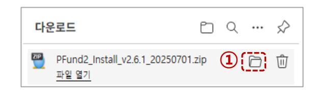

#### (5) '다운로드'폴더 내 압축파일 압축풀

| 7 🖕 다운로드                                |                                       |                                  |                   |         |          |
|-----------------------------------------|---------------------------------------|----------------------------------|-------------------|---------|----------|
| 파일 홈 공유 보기                              |                                       |                                  |                   |         |          |
| ★ 같 같 : : : : : : : : : : : : : : : : : | · · · · · · · · · · · · · · · · · · · | ┃ 집 새 항목 ▼ 1 빠른 연결 새 폴더 |                   |         |          |
| 클립보드                                    | 구성                                    | 새로 만들기                           | 열기                | 선택      |          |
| 🖓 📙 👻                                   |                                       |                                  |                   |         |          |
| ← → × ↑ 🖊 > 내 PC > 다운로드                 |                                       |                                  |                   |         |          |
| 📌 즐겨찾기                                  | 이름                                    | 수                                | 정한 날짜             | : 형유    | 17       |
| 바탕 화면                                   | ★ ∨ 오늘 (1)                            | ,                                |                   |         |          |
| ↓ 다운로드                                  | * PFund2_Install_v2.6.1_20            | 0250701 20                       | )25-09-08 오전 9:42 | 응용 프로그램 | 35,035KB |

<!-- page: 7 -->

#### 나. 설치방법

#### (1) install 파일 실행

#### (마우스 우측클릭 →'관리자 권한으로 실행'선택, 완료 시까지 Next 클릭)

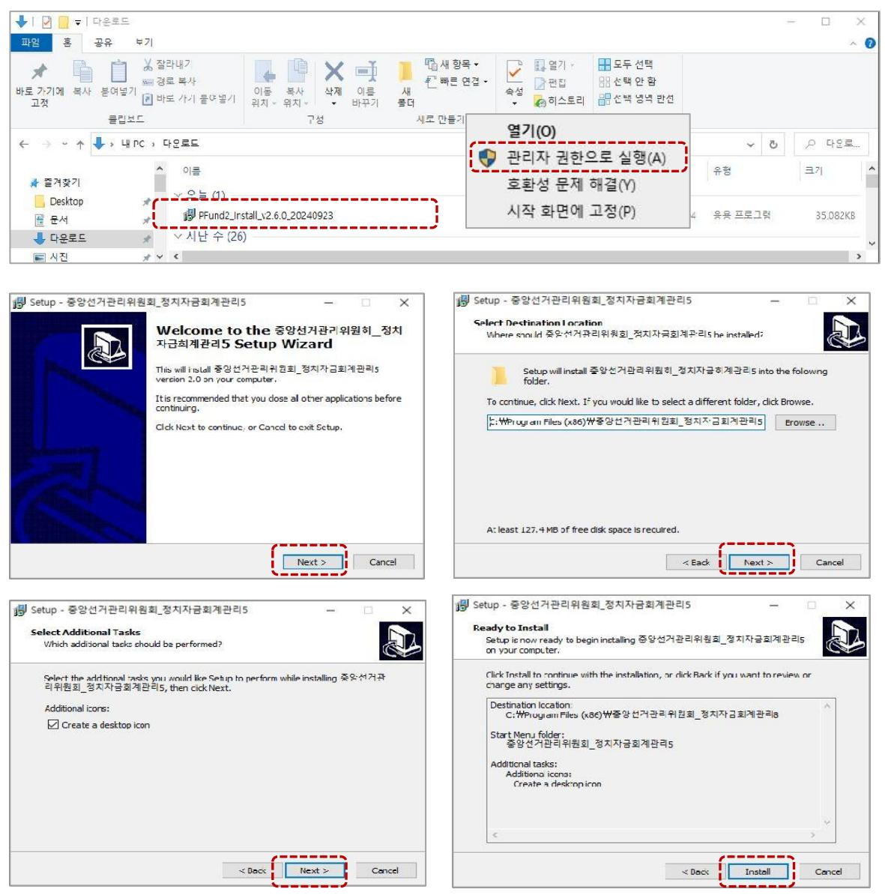

#### (2) 설치가 완료되면 아래와 같은 실행 아이콘 생성

<!-- page: 8 -->

# II. 회계관리 프로그램 사용하기

<!-- page: 9 -->

# 1. 사용기관 등록 (1)

가. 사용기관을 등록하여야만 본 프로그램의 사용이 가능합니다.

나. 바탕화면의 🔀 아이콘을 더블클릭하면 아래의 화면이 나타납니다.

|   | <b>::</b> 사용자 인증 |               |              |       |
|---|------------------|---------------|--------------|-------|
| 1 | 사용기관명            | 사용기관구분        | 사용자ID        | 회계책임자 |
| L |                  | 아 이 디 비밀변호 | 로그인          |       |
|   |                  | 사용기관등록        | 밀번호 찾기 📗 종 료 |       |

다. [사용기관등록] 탭을 클릭하여 해당 (예비)후보자, 후원회 관련사항을 입력합니다.
 [신규입력]부터 순서대로 클릭하여 작성하며, [저장] 후 [종료]를 클릭합니다.
 사용자 인증 화면에 사용기관명이 표출되면 비밀번호를 입력한 후 로그인 합니다.

| 🏦 🕷 사용기관 관리                                                       | l                        |       | (1) (1) ○   신규입력 (금) 저장 (군) 석제 (★) 취소 (입) 종료                                                   |
|-------------------------------------------------------------------|--------------------------|-------|---------------------------------------------------------------------------------------------------|
| 고분                                                                | 기관명                      | 전화번호  | 사용기관 구분 (예비)후보자 2 · 사용기관명 백두산 3 생년휠일 1975-07-07 4 등록일자 2026-02-25 ~                         |
| [필수 기재 ② ▼클릭하여 ③ (예비)후보지 후보자후원3                          | 며 사용기관 ㅏ성명 또는         | -     | 선거사무(연락)소장명 선거사무(연락)소장명 주소 인터넷에 연결된 컴퓨터의 경우 우편번호 검색 가능 관찰번호 관찰위원회명 공명시선거관리위원회 6 |
| <ul> <li>④ 생년월일 또</li> <li>⑤ 회계책임자</li> <li>⑥ 관할위원회!</li> </ul>   | 성명 기재 명 기재            | 번호 기재 | 사용자 ID nec1390 비밀번호 ●●●●● 주1) 비밀번호 : 최소 4자 이상 비밀번호확인 ●●●●                                   |
| <ul> <li>⑦ ID, 비밀번호</li> <li>⑧ 이전 회계기간</li> <li>당해 회계기</li> </ul> | <u> '</u> : <u>별도 수정</u> |       | 비밀번호확인질문 비밀번호확인답변 이전 회계기간 2025-01-01 				~ 2025-12-31                                       |

<!-- page: 10 -->

# 1. 사용기관 등록 (2)

- 가. 기존의 백업파일이 있는 사용자의 경우
- ◎ 백업파일만 가지고 있는 경우 프로그램을 다시 설치하여야 합니다.

◎ 프로그램을 실행하려면 아래 그림과 같이 사용자 인증을 하여야 하므로, [사용 기관

등록] 클릭한 후, 가상의 인물·기관(인적사항 등 임의작성)으로 [사용기관등록]하 여  $\bigcirc$ [IV-2 자료 복구 방법」을 참고하여 자료를 복구합니다.

◎ 복구가 완료되면 기존의 사용기관과 사용자ID가 표출되며, 기존의 비밀번호 입 력

후 사용이 가능합니다.

나. 사용기관이 등록된 컴퓨터에서 다른 사용기관을 추가하고자 하는 경우

- ◎ 프로그램이 설치되어 있는 정당선거사무소 등 컴퓨터에서 (예비)후보자, 후원회 등
- 다른 사용기관을 추가로 등록하고자 하는 경우 사용합니다. ◎ 아래의 [사용기관등록]을 클릭한 후 앞페이지를 참고하여 사용기관을 등록합니다. 이 때, 반드시 [신규입력]을 먼저 클릭한 후 기재하시기 바랍니다.

| : 사용자 | 인증 #          |              |       |
|-------|---------------|--------------|-------|
| 사용기관명 | 사용기관구분        | 사용자ID        | 회계책임자 |
|       |               |              |       |
|       |               |              |       |
|       |               |              |       |
| ••    | ●아이디 ●비밀번호 | 로그인          |       |
|       | 사용기관등록 비      | 밀번호 찾기 📃 종 료 |       |

<!-- page: 11 -->

# 2. 전체메뉴 및 기능 [(예비)후보자용]

전체메뉴는 아래와 같으며 주로 사용하는 메뉴의 기능은 다음과 같습니다.

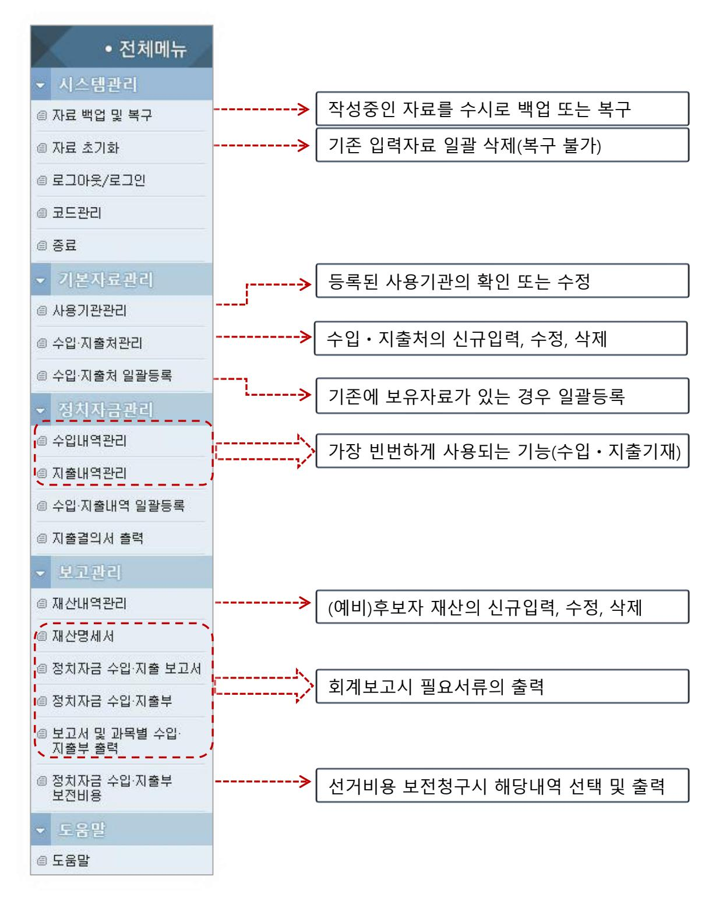

<!-- page: 12 -->

# 2. 전체메뉴 및 기능 [후원회용]

전체메뉴는 아래와 같으며 주로 사용하는 메뉴의 기능은 다음과 같습니다.

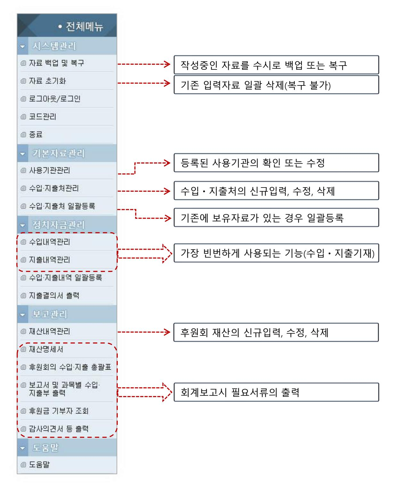

<!-- page: 13 -->

<!-- page: 14 -->

# 1. 수입・지출처 관리

#### 가. 수입・지출처 등록

#### ● 해당화면의 주요기능

- ★ 이 화면에서 수입・지출처를 새로 등록하고 수입・지출 상대방의 이력 (주소, 전화번호 변경 등)을 관리할 수 있습니다.
- ★ 일종의 주소록 기능과 유사하며, 수입・지출 내역 작성시 필수 기재사항인
   거래상대방을 수입・지출처로 한번만 등록하면 수입・지출내역 작성시
   간편하게 불러내어 작성할 수 있습니다.
- ★ 수입・지출처의 경우, 수입내역 및 지출내역 관리 화면에서 수입・지출
   내역 입력시마다 별도로 등록할 수 있습니다. (수입・지출내역 관리 참조)

#### ● 아래의 ① 또는 ②를 클릭하여 해당화면으로 이동

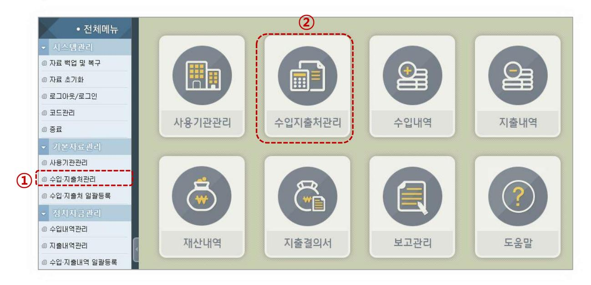

<!-- page: 15 -->

#### ● 수입・지출처 등록화면

| 변호 | 구 분     | 수입/지출대상자            | 년월일/사업자변     | 직업(업종)             | 수입지출처 구분 전체 🗸 🔍                                  |
|----|---------|---------------------|--------------|--------------------|--------------------------------------------------|
| 1  | 개인      | 금강산                 | 1966-02-02   |                    | 【성명(명칭) 【 옥                                   |
| 2  | (예비)후보자 | 백두산                 | 1975-07-07   |                    | 생년월일 Q 예) 123-45-67890                           |
| З  | 사업자     | 생수집                 | 355-56-55555 |                    |                                                  |
| 4  | 개인      | 소백산                 | 1975-07-08   |                    |                                                  |
| 5  | 개인      | 익명                  |              |                    | 지역(시도) ~                                         |
|    |         |                     |              |                    | 주 소 ☑ 국내 □ 혜묘 × 주소이하는 아래의 수정버튼을 우편번호 제 차비호 |
|    |         |                     |              | k                  | 우편번호 ····································        |
|    |         |                     |              | <i>€</i> 해당 아이콘 | 우편번호 ····································        |
|    |         | 년결된 컴퓨터 립게 우편번 3 |              |                    | 우편번호 ····································        |

#### 🔍 수입・지출처 등록순서

| ① 신규입력 | 메뉴 접속시 기본적으로 신규자료 입력 기능 제공 * <mark>기존 내역이 선택되어 있을 때 새로운 자료를 입력하려면 ① 신규입력</mark> 버튼을 클릭하여 입력 |
|--------|---------------------------------------------------------------------------------------------------|
| ② 내용입력 | 수입・지출처 기재사항을 차례대로 선택 및 입력한다.                                                                      |
| ③ 저 장  | 수입・지출처를 저장하면 조회화면과 같이 수입・지출처로 등록된다.                                                               |

#### 🔍 기타 기능

✓ 조회 : 제목줄 항목별 클릭을 통해 오름차순/내림차순으로 정렬조회 가능
 ✓ 삭제 : 조회화면에서 선택된 수입 • 지출처 항목 삭제
 \* 단, 수입 또는 지출내역이 등록되어 있는 수입 • 지출처는 삭제 불가
 ✓ 엑셀 : 수입 • 지출처 내역을 엑셀 파일로 다운로드 가능
 ✓ 종료 : 최초의 메인 화면으로 전환

<!-- page: 16 -->

#### 나. 수입・지출처 수정

 POINT

 ★ 수정하고자 하는 수입・지출처를 선택 후 명칭, 사업자번호, 주소 및 전화 번호 등을 수정한 후 [저장] 버튼을 클릭하면 수정등록됩니다.

 ♪ 수입, 지출내역이 등록된 수입・지출처를 수정할 경우 수정된 내용으로 변경됨.

0

|    |         |          |              |          |                                       |      | 2        | )      |         |                       |             |
|----|---------|----------|--------------|----------|---------------------------------------|------|----------|--------|---------|-----------------------|-------------|
|    | K 수입 지  | 출처 관리    |              |          |                                       | 신규입  | 력 🔡      | 저 장 [  | 에 삭제    | 🗙   취소  📉             | 엑 셀  😣   종료 |
| 번호 | 구 분     | 수입/지출대상자 | 년월일/사업자번     | 직업(업종)   | ~ 수입지출처                            | 히 구분 | 개인       |        | ~ Q     | (1)                   | ]           |
| 1  | 개인      | 금강산      | 1966-02-02   |          | 성명(명                                  | 5 칭) | 금강산      |        | Q       |                       |             |
| 2  | (예비)후보자 | 백두산      | 1975-07-07   |          | 생년월                                   | 일    | 1966-02- | -02    |         | - OL) YYYY-MM      | 1-DD        |
| 3  | 사업자     | 생수집      | 355-56-55555 |          | 직업(6                                  |      |          |        | 스이      |                       |             |
| 4  | 개인      | 소백산      | 1975-07-08   |          |                                       |      | L        |        |         | • 지출처 등               |             |
| 5  | 개인      | 익명       |              |          | 지역(人                                  | 도)   |          |        | 수성      | 사항 기재                 | 양폭          |
|    |         |          |              |          | 주                                     | 소    | ☑ 국내     | ] 해외   | ※ 중소밓   | 하는 마래의 수경 수정 바랍니다. | 정버튼을        |
|    |         |          |              |          | 우 편 번                                 | 호    | 13809    | Q      | 1-0+    |                       |             |
|    |         |          |              |          | <b>`</b>                              |      | 경기도 교    | 과전지 홍혼 | 말로 집 중  | 양동, 중양전거관             | 리위원회)       |
|    | - E     |          |              |          |                                       |      |          |        | ۲       |                       |             |
|    |         | 조호       | 화면           |          | 전 화 번                                 | 호    | 02-1111  | 수정확인   |         | ×                     |             |
|    |         |          |              |          | 팩 스 번                                 | ! 호  |          |        |         |                       |             |
|    |         |          |              |          | Ы                                     | 고    |          | 수정하/   | 시겠습니까?  |                       |             |
|    |         |          |              |          |                                       |      |          |        |         |                       | (4)         |
|    |         |          |              |          | 5                                     |      |          |        | 예(Y)    | 아니죠(N)                | 수정 🔂 삭제     |
|    | _       |          |              |          | · · · · · · · · · · · · · · · · · · · |      |          |        |         | <b>Z</b>              |             |
|    |         | 소거나하/포   | * 피휘비누       | ~ 이러 취명  | 일자                                    |      | 편번호      |        | 소       | 상세주소                  | 전화변호        |
|    |         | 수정사항(주-  | 꼬, 신와면오      | .) 이덕 와면 | 2025-09-0                             | 01   | 13809    | 경기도 과친 | 현시 홍촌말로 |                       |             |
|    |         |          |              |          |                                       |      |          |        |         |                       | '           |

#### 🔍 성명, 명칭, 생년월일 또는 사업자번호 수정방법

조회 화면에서 수정하고자 하는 수입・지출처를 선택(파란색으로 변함)한다.
 ① 항목에서 수정사항을 입력하고 ② [저장]을 누르면 ③ 수정확인 메시지에 따라 수정을 완료한다.

#### 🄍 주소 또는 전화번호 수정방법

조회 화면에서 수정하고자 하는 수입·지출처를 선택(파란색으로 변함)한다.
 ④ [수정]을 클릭한다.
 ③ 항목에서 수정사항(주소, 전화번호)을 입력하고 ② [저장] 후 ③ 수정확인 메시지에 따라 수정을 완료한다.
 최종 등록정보는 ⑤ 이력 관리 화면에서 확인할 수 있다.

<!-- page: 17 -->

#### 다. 수입・지출처 일괄등록(1)

#### POINT

# ★ 수입・지출처를 엑셀 파일로 관리하여 프로그램에 등록하거나, 사용기관이 2개 이상인 경우 기존 사용기관의 수입・지출처를 다른 사용기관에도 함께 사용할 경우 일괄등록 기능을 활용할 수 있습니다.

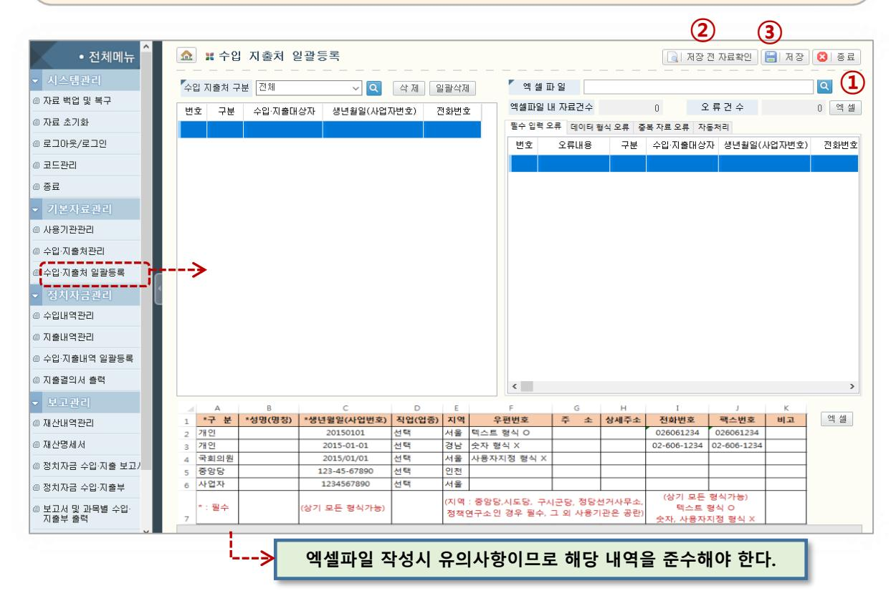

#### 🔍 수입・지출처 일괄등록 순서

| ① 엑셀파일 찾기          | 돋보기를 활용하여 수입 및 지출처 목록(엑셀) 파일을 선택한다.                                                                              |
|--------------------|------------------------------------------------------------------------------------------------------------------|
| ② 저장 전 자료 확인 클릭 | 엑셀파일로 작성된 자료에 오류가 있는지 점검한다. => 오류 자료가 있는 경우 [저장] 불가 => 오류 내용은 [엑셀] 파일로 다운로드 가능 => 오류수정 후 ①의 순서로 돌아가서 진행 |
| ③ 저 장              | [저장]시 신규 수입・지출처 자료가 등록되고, 기 등록된 수입・지출처 자료는 엑셀파일 내용으로 수정된다.                                                    |

다. 수입・지출처 일괄등록(2)

|                                 | 구분 전체     | ~ Q                                                                 | 삭 제 일                                       | 일괄삭제                             |                                           |            | -         | 엑 셀 파 일                               |                                                          |                 |            |            | ٩        |
|---------------------------------|-----------|---------------------------------------------------------------------|---------------------------------------------|----------------------------------|-------------------------------------------|------------|-----------|---------------------------------------|----------------------------------------------------------|-----------------|------------|------------|----------|
| 호 구분                            | 수입·지출대상:  | 자 생년월일(사업자                                                          | 자변호) 전                                      | 연화변호                             | ž                                         |            | 엑실        | 셸파일 내 자료건                             | 수                                                        | 0               | 오 류        | 건 수        | 0 엑실     |
| 101010101010                    |           |                                                                     |                                             |                                  |                                           |            | 필수        | ≻입력오류 데o                              | 터 형식 오류                                                  | 중복 자료 오         | 으류 자동치     | 12         |          |
|                                 |           |                                                                     |                                             |                                  | mand                                      |            | 번         | !호 오류내                                | 용 구분                                                     | 수입·지            | 출대상자       | 생년월일(사업자번  | (호) 전화번: |
|                                 |           |                                                                     |                                             |                                  |                                           |            |           |                                       |                                                          |                 |            |            |          |
|                                 |           |                                                                     |                                             |                                  |                                           |            |           |                                       |                                                          |                 |            |            |          |
|                                 |           |                                                                     |                                             |                                  |                                           |            |           |                                       |                                                          |                 |            |            | Ý        |
|                                 |           |                                                                     |                                             |                                  |                                           |            |           |                                       |                                                          |                 | 0 =        |            | 네피이      |
|                                 |           |                                                                     |                                             |                                  |                                           |            |           |                                       |                                                          |                 | 오두         | 내용을 엑      |          |
|                                 |           |                                                                     |                                             |                                  |                                           |            |           |                                       |                                                          |                 |            | 다운로드       | Ξ        |
|                                 |           |                                                                     |                                             |                                  |                                           |            |           |                                       |                                                          |                 | _          |            |          |
|                                 |           |                                                                     |                                             |                                  |                                           |            |           |                                       |                                                          |                 |            |            |          |
|                                 |           |                                                                     |                                             |                                  |                                           |            |           |                                       |                                                          |                 |            |            |          |
|                                 |           |                                                                     |                                             |                                  |                                           |            |           |                                       |                                                          |                 |            |            |          |
|                                 |           |                                                                     |                                             |                                  |                                           |            |           |                                       |                                                          |                 |            |            |          |
|                                 |           |                                                                     |                                             |                                  |                                           |            |           |                                       |                                                          |                 |            |            |          |
|                                 |           |                                                                     |                                             |                                  |                                           |            |           |                                       |                                                          |                 |            |            |          |
|                                 |           |                                                                     |                                             |                                  |                                           |            |           |                                       |                                                          |                 |            |            |          |
|                                 |           |                                                                     |                                             |                                  |                                           |            |           |                                       |                                                          |                 |            |            |          |
|                                 |           |                                                                     |                                             |                                  |                                           |            | K         |                                       |                                                          |                 |            |            |          |
| A                               | в         | c                                                                   | D                                           | E                                | F                                         | G          | H         | I                                     | - 1                                                      | К               |            | _          |          |
| A *구 분                       |           |                                                                     | D 직업(업종)                                 |                                  |                                           | G 주 소   |           |                                       | ) 팩스번호                                                | к <b>и</b> л |            |            |          |
|                                 |           |                                                                     |                                             |                                  |                                           |            | н         | I                                     |                                                          |                 | <u></u>    | 3          |          |
| *구 분                            |           | 생년월일(사업번호)                                                          | 직업(업종)                                      | 지역                               | 우편번호                                      |            | н         | 전화번호                                  | <b>팩스번호</b> 026061234                                 | 비고              | <u>ि</u> थ | <u>]</u> 3 | ;        |
| *구 분 개인 개인 국회의원        | *성명(명칭) * | 생년월일(사업번호) 20150101                                              | <b>직업(업종)</b> 선택                         | <b>지역</b> 서울 경남 서울      | <b>우편번호</b> 텍스트 형식 O                   |            | н         | I 전화번호 026061234                | <b>팩스번호</b> 026061234                                 | 비고              | ्वि        | 3          |          |
| *구 분 개인 개인 국회의원 중앙당 | *성명(명칭) * | 생년월일(사업번호) 20150101 2015-01-01                                | <mark>직업(업종)</mark> 선택 선택 선택 선택 | 지역 서울 경남 서울 인천       | 우편번호           텍스트 형식 O           숫자 형식 X |            | н         | I 전화번호 026061234                | <b>팩스번호</b> 026061234                                 | 비고              | <u></u>    | 3          |          |
| *구 분 개인 개인 국회의원        | *성명(명칭) * | ·생년월일(사업번호) 20150101 2015-01-01 2015/01/01                 | <b>직업(업종)</b> 선택 선택 선택             | <b>지역</b> 서울 경남 서울      | 우편번호           텍스트 형식 O           숫자 형식 X |            | н         | I 전화번호 026061234 02-606-1234 | 팩스번호 026061234 02-606-1234                         | 비고              | ्व         | <u>]</u> 3 |          |
| *구 분 개인 개인 국회의원 중앙당 | *성명(명칭) * | ·생년월일(사업번호) 20150101 2015-01-01 2015/01/01 123-45-67890 | <mark>직업(업종)</mark> 선택 선택 선택 선택 | 지역 서울 경남 서울 인천 서울 | 우편번호           텍스트 형식 O           숫자 형식 X | <u>주 소</u> | H 상세주소 | I 전화번호 026061234                | <b>팩스번호</b> 026061234 02-606-1234 형식가뇽) 형식 0 | 비고              | ्व      | 3          |          |

수입·지출처 조회자료를 한 건 [삭제] 또는 조회한 모든 자료를 [일괄삭제] 가능함.
 ※ 수입내역 혹은 지출내역이 등록된 수입·지출처는 삭제 불가
 오류 내용을 [엑셀] 파일로 다운로드 가능함.

※ [저장 전 자료확인] 후 오류 내용이 한 건이라도 있는 경우 일괄등록 불가
③ [엑셀] 클릭하면 일괄등록 양식의 엑셀파일 다운로드 가능함.

<!-- page: 18 -->

#### Tip!

**사용기관을 2개 이상 사용하는 경우**, 새로운 사용기관 등록 후 수입·지출처 자료는 기존 사용기관의 자료를 엑셀 다운로드하여 일괄등록하면 편리합니다.

| 1 | A  | В                 | С           | D            | E 수입 | F 및 지 | G  출처 목록 | н द       | I    | J           | K       | L    | 수입・지출처 관리에서 엑셀 파일로 다운로드한 자료(좌측) 중 제목과 번호(노란 부분)을 |
|---|----|-------------------|-------------|--------------|---------|----------|-------------|--------------|------|-------------|---------|------|--------------------------------------------------------|
| 3 |    |                   |             |              |         |          |             |              |      | 수입          | 입 지출처 구 | 분:전체 | 8 세국의 신오(오신 무준)을 지운 후, 수입・지출처 일괄                    |
| 4 | 번호 | 구 분               | 성명(명칭)      | 생년월일(사업번호)   | 직업(업종)  | 지역       | 우편번호        | 주 소          | 상세주소 | 전화번호        | 팩스번호    | HД   | 등록(1)과 같이 일괄등록합니다.                                     |
| 5 | 1  | <mark>1</mark> 기타 | (사)한국 o o o | 203-82-99999 | 사단법인    | 서울       |             | 서울시 영등포구 영등포 | 5    | 02-313-0000 |         |      | 중국(1)과 같이 걸릴중국입니다.                                     |
| 6 | 2  | <mark>2</mark> 개인 | (사)한국지역ㅇㅇㅇ  |              |         | 서울       |             |              |      |             |         |      |                                                        |

<!-- page: 19 -->

# 2. 수입내역 관리

#### 가. 화면 및 기능개관(1)

★ 메뉴 접속 시 기본적으로 '신규자료 입력 기능'이 제공됩니다.
 ★ 아래의 화면에서 수입내역 조회 및 신규 수입내역 입력이 가능합니다.

🔍 아래의 ① 또는 ②를 클릭하여 해당화면으로 이동

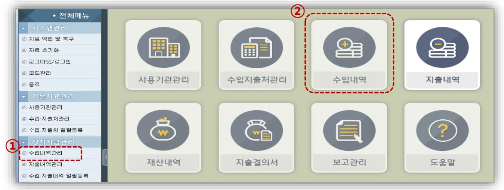

🔍 화면 개관

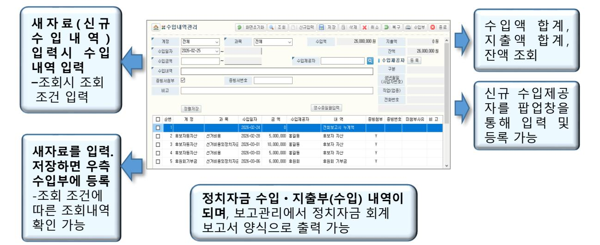

<!-- page: 20 -->

#### 가. 화면 및 기능개관(2)

|            |      | 1내역관리 :     | ○ 約日点71約 |         | () 신규입력 [ 등   |       | (7월 🗙 학소 🗍          | 21 M 7 1 (C) |                | 8월대역역쇄  | 0:8   |
|------------|------|-------------|----------|---------|---------------|-------|---------------------|--------------|----------------|---------|-------|
| 7          | 12   | 수업          | ~ 1      | 234     | 기명후원급         | × 3   | 수압액                 | 6,100.000 H  | 지율역            |         | 0 55  |
| <b>4</b> 2 | 1일자  | 2025-02-25  | ~ -      |         |               |       |                     |              | 간벽             | 6,100.0 | 000 H |
| -42        | 124  |             | ~        |         |               | 수업체공자 |                     | a)           | · 수업제공자        | 長周      |       |
| -02        | 1111 | 기명후원급       |          |         | -             |       |                     |              | 구분             |         |       |
| 중병사령부      |      |             |          |         |               |       |                     |              |                |         |       |
| н          | 12   |             |          |         |               |       |                     |              |                |         |       |
|            |      |             |          |         |               | 8     | )                   |              | 직업(업종) 간화변호 |         |       |
|            | 6    | 登録方登        |          | 일자별합산   |               |       | 수증일괄입력              |              | ueua.          |         |       |
| 6          | 순변   | 계장          | 25 목     | 수업일     | 자 금역          | 수업제공자 | 비역                  | 840          | (부 중빙변호        | 미성부사유   | 비고    |
|            | 1    | 4 <b>2</b>  | 기명호원급    | 2025-02 | -27 2.000,000 | 한감산   | 기명후황급               |              |                |         |       |
|            | 2    | 4 <b>2</b>  | 기명호원급    | 2026-02 | -28 1,000,000 | 백두산   | 기명후원금               | Y            |                |         | 1     |
|            | 3    | \$ <b>2</b> | 기명후원급    | 2025-03 | -02 1,000,000 | 금장산   | 기염후환급               | ۷            |                |         |       |
|            | 4    | 4 <b>2</b>  | 기명후원급    | 2026-03 | -04 1,500,000 | 소백산   | 기명孝왕급               | Y            |                |         |       |
|            |      |             |          |         |               |       | 100.000.000.000.000 |              |                |         |       |
|            | 5    | 수업          | 기명후원급    | 2026-03 | -06 500,000   | 80    | 기명후황금               | Y            |                |         |       |

#### 🔍 주요기능

| ① 화면초기화 | 최초 입력 내용이 없는 조회 화면으로 되돌아가는 기능이다. |
|---------|----------------------------------|
| ② 조회    | 조회 조건에 따라 조회가 가능하다.              |
| ③ 신규입력  | 신규 수입내역 입력 화면으로 전환된다.            |
| ④ 저장    | 신규 수입내역 및 수정 내용을 저장한다.           |

● 알아두면 편리한 기능 비교 지출내역 관리는 [영수증 일괄생성], [영수증 일괄삭제 기능]이 있다.

| ⑤ 다중선택        | 다중선택 check시 각 수입 내역 항목 선택이 가능하다.                       |
|---------------|--------------------------------------------------------|
| ⑥ 정렬          | 항목별 제목줄 클릭을 통해 오름차순 또는 내림차순으로 정렬 하여 수입내역을 조회할 수 있다. |
| ⑦ 정렬저장        | 수입내역 순서를 조정하고 저장하는 기능이다.                               |
| ⑧ 영수증일괄입력(저장) | 영수증 증빙번호를 개별 또는 일괄 수기로 입력할 수 있다.                       |

#### 🔍 그 외 기능

| ⑨ 복구  | 수정・삭제한 자료를 이전 상태로 되돌리는 기능이다. |
|-------|------------------------------|
| ⑩ 수입부 | 계정・과목별 수입부 내역을 출력하는 기능이다.    |

● 후원회 추가메뉴

| √ 후원내역엑셀 | 기명후원금 과목 조회 시 후원금센터 업로드용 엑셀파일 다운로드 |
|----------|------------------------------------|
|----------|------------------------------------|

<!-- page: 21 -->

#### 나. 신규내역 등록(1)

| 7          | 계정                     | P           | 拿원회기부금              | 24                | 1                                        | 선거비용외정치자;                                                 | v                          | 수압맥                   |                                       | 26,000.000 8 | 지율액                |              |       | 0                 | 8      |
|------------|------------------------|-------------|---------------------|-------------------|------------------------------------------|-----------------------------------------------------------|----------------------------|-----------------------|---------------------------------------|--------------|--------------------|--------------|-------|-------------------|--------|
| 48         | 김일자                    | 2           | 2026-03-25          | ~ ~               |                                          |                                                           |                            |                       |                                       |              | 잔액                 |              |       | 25,000,000        | 8      |
| <b>4</b> 8 | 입금액                    | Ī           |                     | 500,000 ~         |                                          |                                                           | ~ 수입제공기                    | λł                    |                                       | ٩            | 수입제공자              | 長県           | /     |                   |        |
| 48         | 김내역                    | Ĩ           |                     |                   | _                                        |                                                           | <b>`</b>                   |                       |                                       |              | 구분                 |              |       |                   |        |
| 홍성         | 시험부                    | E           | 3                   | 중병사               | 변호                                       |                                                           |                            |                       |                                       |              | 생년활일 (사업자변호)    |              |       |                   |        |
| н          | u z II                 | -           |                     |                   |                                          |                                                           |                            |                       |                                       |              | Contraction of the |              |       |                   |        |
|            | 21.32                  | 1           | 정철저장                |                   |                                          |                                                           | 1                          |                       | 입지출처 검 !분 전체                       | 색            | 수입지출처명             |              |       | <mark>(</mark> 조회 | ✔  선택  |
| _          | 21.44                  |             |                     |                   |                                          |                                                           |                            |                       |                                       | 색         | 수입지출처명             |              |       |                   | ✔ / 선택 |
| 0          | 순변                     |             | 정했저장 계 정         | 과의                | 수업일)                                     | State Sind                                                | 수업제공자                      |                       | 분 전체 구분                            | 색            | 수입지출처명             | 활일(사업자번호) 직업 | 1(업종) | 전화번호              | ✔ 선택   |
| 0          | 순변 1                |             | 계 정                 |                   | 2026-02                                  | -24 0                                                     | 수업체공자                      | 영수( -                 | · 분 전체 구분 사업자                   | 색         | 수입지출처명             | 월일(사업자번호) 직원 | (입종)  |                   | ✓ 선택   |
| 0          | 순변 1 2           | <b>非</b> 보: | 계 정 자동자산         | 선거비용              | 2026-02 2026-02                       | -24 0 -28 5,000,000                                    | 수업제공자 홍립동               | 명수해                   | 분     전체       구분     사업자       개인    | 색         | 수입지출처명             | 활일(사업자변호) 직업 | 성(업종) |                   | ✓ 선택   |
| 0          | 순변 1 2           | <b>非</b> 보: | 계 정                 | 선거비용              | 2026-02 2026-02                       | -24 0 -28 5,000,000                                    | 수업제공자 홍립동               | 영수( -                 | 분 전체 구분 <u>사업자</u> 개인 사업자 | 색         | 수입지출처명             | 할일(사업자변호) 직원 | 3(입종) |                   | ✓ 선택   |
|            | 순변 1 2           | 拿보: 후보   | 계 정 자동자산         | 선거비용              | 2026-02 2026-02                       | -24 0 -28 5,000,000 -01 10,000,000                  | 수업제공자 홍길동 홈길동        | 20 ↔ 1 2 3 4 | · 분 전체 구분 사업자 개인 개인 개인 | 색         | 수입지출처명             | 월일(사업자번호) 직원 | 3(입중) |                   | ✓ 선택   |
|            | 순변 1 2 1 4 | 非보:         | 계 정 자동자산 자동자산 | 선거비용 선거비용외정치자급 | 2026-02 2026-02 2026-03 2026-03 | -24 0 -28 5,000,000 -01 10,000,000 -03 5,000,000 | 수업제공자 홍길동 홍길동 홍길동 | 명수해                   | 분 전체 구분 <u>사업자</u> 개인 사업자 | 색         | 수입지출처명             | 월일(사업자번호) 직원 | 3(입종) |                   | ✓ 선택   |

# ● 신규 수입내역 등록 순서

|                                      | 기본적으로 신규입력기능 화면을 제공하므로, 기존자료 수정 및 조회 중                                  |  |  |  |  |
|--------------------------------------|-------------------------------------------------------------------------|--|--|--|--|
| ① 신규입력                               | 새로운 자료를 입력하려면 ① <u>[신규입력]버튼을 클릭하여</u> 신규 내역을                            |  |  |  |  |
|                                      | 등록한다.                                                                   |  |  |  |  |
| <ul><li>② 수입내용</li><li>입 력</li></ul> | 정치자금 회계보고시 필수 기재사항으로 차례대로 선택 및 입력한다. ※ ✔ 수입제공자 입력 방법. ☞ Ⅲ.2.나.Tip 참조 |  |  |  |  |
| ③ 저 장                                | 신규 및 수정 수입내역을 저장한다.                                                     |  |  |  |  |

#### 🔵 주요기능

| √ 화면초      | 드기화 | 각 항목에 입력한 값을 지운 상태, 즉 기존의 조회 기능 화면으로 되돌리는 기능이다. |  |  |  |  |
|------------|-----|----------------------------------------------------|--|--|--|--|
| <b>√</b> 조 | 회   | 조회하고자 하는 조건을 ②에 입력 후 수입내역을 조회 및 검색하는 기능이다.      |  |  |  |  |

<!-- page: 22 -->

#### 나. 신규내역 등록(2)

|       | 후원회기부금                      | 3 24      | 4 <u></u> <u></u> <u></u> <u></u> <u></u> <u></u> <u></u> <u></u> <u></u> <u></u> <u></u> <u></u> <u></u> <u></u> <u></u> <u></u> <u></u> <u></u> <u></u> | 비용외정치자님    | - 42               | 3              | 26,000.000 월                   | 刀雷骂             |                          |          | 0 8              | 1 7 |
|-------|-----------------------------|-----------|-----------------------------------------------------------------------------------------------------------------------------------------------------------|------------|--------------------|----------------|--------------------------------|-----------------|--------------------------|----------|------------------|-----|
| 수업업자  | 2026-03-25                  |           |                                                                                                                                                           |            |                    |                |                                | 간역              |                          |          | 26,000,000 8     | L   |
| 수입금액  | 500,000 ~                   |           |                                                                                                                                                           |            | 수업제공자 🔍 🛛 수업제공     |                |                                | 수입제공자           | ₹ <b>X</b> 등록 <b>V</b>   |          |                  |     |
| 수업내역  |                             |           |                                                                                                                                                           |            | a contra contra di |                |                                | 구분              |                          |          |                  |     |
| 중행시험부 | Ø                           | 중병사       | 변호                                                                                                                                                        |            | 1                  |                | -                              | 생년월일 (사업지변호) |                          |          |                  |     |
| 비고    |                             |           | 14-16-16-16-16-16-16-16-16-16-16-16-16-16-                                                                                                                |            |                    |                |                                | 전연(연종)          | Ŵ.                       |          |                  |     |
| wi an |                             |           |                                                                                                                                                           |            |                    | 🛃 수입 지출처 관리    |                                |                 |                          |          | -                | C   |
|       | (name)                      |           |                                                                                                                                                           |            | 영수                 | 14 수입 지촐처      | 관리                             |                 | 🗋 신규입력 😸                 | 제장 🗄 삭제  | 🗙 취소 💐 백쇄        | 8   |
|       | 정렬저장                        |           |                                                                                                                                                           |            | 84                 | 변호 구분 1 사업자 | 수입/지출대상자 견원임/사 00광고 112-12- |                 | 수입지출처 구분 전체 성명(명령)    | ् व व |                  |     |
| □ 순변  | 계 정                         | 과 위       | 수업일자                                                                                                                                                      | 금역         | 수업제공자              | 1 70 60 70     | 082 1010                       |                 | 영명(영정) 사업자변호          |          | (N) 123-45-67890 |     |
| 0 1   |                             |           | 2026-02-24                                                                                                                                                | 0          |                    |                |                                |                 | 직업 (업종)                  |          |                  |     |
| 2     | 拿보자등자산                      | 선거비용      | 2026-02-28                                                                                                                                                | 5,000,000  | 홍길동                |                |                                |                 | 지역(시도) 주 소 <b>고국내</b> | V        |                  |     |
|       | #보자동자산                      | 선거네동외정치자물 | 2026-03-01                                                                                                                                                | 10.000.000 | 225                |                |                                |                 |                          | Q        |                  |     |
| 0 4   | 拿보자동자산                      | 선거비용      | 2026-03-03                                                                                                                                                | 5,000,000  | 홍글동                |                |                                |                 |                          |          |                  |     |
| 5     | 拿원회기부금                      | 선거비용외정치자들 | 2026-03-06                                                                                                                                                | 6,000,000  | 車원회                |                |                                |                 | 전화변호                     |          |                  |     |
|       | (1873) (1876) (1876) (1876) | 1072220   |                                                                                                                                                           |            | 1947.000           |                |                                |                 | 팩스번호"                    |          |                  |     |

Tip!

#### < 수입제공자 입력 방법 >

- · 기존에 등록되어 있는 수입제공자 : 🭳 버튼을 클릭하여 검색, 선택 후 사용합니다.
- \* 후원회의 경우 후원금 반환 시 기존 등록되어 있는 수입제공자를 반드시 조회하여 선택
  - 생년월일 등 인적사항을 후원금 기부 시의 수입제공자 정보와 다르게 입력한 경우 동명이인으로 처리되어 반환내역이 반영되지 않습니다.

<!-- page: 23 -->

- · 신규 수입제공자 : [수입제공자 등록]을 통하여 팝업창(수입·지출처 관리 화면)을 통하여 수입제공자를 등록할 수 있습니다.
  - ☞ Ⅲ.1.가.[수입・지출처 등록] 참조

<!-- page: 24 -->

#### 나. 신규내역 등록(3)

🔍 (예비)후보자 화면 예시

|    | 계정 김일자 |            | 2H          |            | 비용외정치자;   | · ·   | 수입액       | 6,000,000 원 | 刀會역            |       | 0       |
|----|-----------|------------|-------------|------------|-----------|-------|-----------|-------------|----------------|-------|---------|
|    |           | 2000-06-65 |             | -31 ~      |           |       |           |             | 전역             |       | 000,000 |
|    | 김공백       |            | ~           |            | 1         | 수입제공자 |           |             |                | 3 84  |         |
|    | CLER      |            |             |            |           | -     |           |             | 구분             |       |         |
| 중병 | 서 협부      | · Ø        | <b>중병</b> 서 | 10 g       |           |       |           | 6           | 성년월일 사업시변호) |       |         |
| 1  | 1D        |            |             |            |           |       |           |             | 학업(업종)         |       |         |
| ·  |           |            |             |            |           |       |           |             | 견파면호           |       |         |
|    |           | 장물저장       |             | [] 홍병      | 서미철부      | 8     | 수중일광입력    |             |                |       |         |
|    | 순변        | 계정         | 과 비         | 수업일자       | 금역        | 수업체공자 | 내역        | 중빙첩부        | 중빙변호           | 미첩부사유 | 비고      |
|    | 1         |            |             | 2026-02-24 | 0         |       | 전회보고사 누계역 |             |                |       |         |
|    | 2         | 후원회기부금     | 선거비용외정치자를   | 2026-03-06 | 6,000,000 | 章원회   | 章원회 기부금   | Y           |                |       |         |
|    |           |            |             |            |           |       |           |             |                |       |         |
|    |           |            |             |            |           |       |           |             |                |       |         |
|    |           |            |             |            |           |       |           |             |                |       |         |
|    |           |            |             |            |           |       |           |             |                |       |         |

#### 🔍 계정 및 과목

| 사용기관        | 계 정                                | 과 목                                      |
|-------------|------------------------------------|------------------------------------------|
| (예비) 후보자 | 후보자등자산, 후원회기부금, 보조금, 보조금외지원금 | 각 계정마다 <b>선거비용, 선거비용외정치자금</b> 과목으로 구분 |

각 계정별, 과목별로 수입 및 지출이 이루어지며, 지출액이 수입액보다 많을
 수 없으

# 에이무로 필요시 과목간 수입액을 조정 및 수정합니다.

#### (예비)후보자

①의 수입내역 기재사항(계정, 과목, 수입일자, 수입금액, 수입내역, 수입제공자 등)
모두 수정가능합니다. 후보자자산(계정)-선거비용(과목) 지출액(500만원)이 수입액
(400만원)보다 많은 경우, 같은 계정의 선거비용외정치자금(과목)의 수입액
(100만원)을 감하고, 선거비용(과목)에 그 금액(100만원)만큼 더하는 방법으로
수입액을 조정 및 수정합니다.

#### 나. 신규내역 등록(3)

#### 🌒 후원회 화면 예시

|   | <u>@</u>         | <b>።</b> ት የ | 입내역관리      | 👂   화면초기화 | 🔍   조회 🛛   | 이 신규입력    | 🔡 । स रु 📋 । य | 학제 🔀 취소    | ▶ 복구 🝙      | 수입부 🔳          | 후원내역엑 | 셀 😢 흥      | 종료 |
|---|------------------|--------------|------------|-----------|------------|-----------|----------------|------------|-------------|----------------|-------|------------|----|
| 1 | $\left[ \right]$ | 계정           | 수입         | ₽         | 목 기명       | 후원금       | ✓ 수            | 입액         | 6,100,000 원 | 지출액            |       | 0 원        | ^  |
| 1 | 수업               | 입일자          | 2026-02-26 | ~~        |            |           |                |            |             | 잔액             | 6,    | ,100,000 원 |    |
| 1 | 수업               | 입금액          |            | ~         |            |           | 수입제공자          |            | <u>२</u> ।  | 수입제공지          | 등록    |            |    |
| 1 | 수업               | 입내역          | 기명후원금      |           |            |           |                |            |             | 구분             |       |            |    |
|   | 증빙               | 서첨부          |            | 증빙/       | 서번호        |           |                |            | (           | 생년월일 사업자변호) |       |            |    |
|   | Ŀ                | 비고           |            |           |            |           |                |            |             | 직업(업종)         |       |            |    |
|   |                  |              |            |           |            |           |                |            |             | 전화번호           |       |            |    |
|   |                  |              | 정렬저장       | 🗌 일자법     | 별합산        |           | 영식             | ►증일괄입력  |             |                |       |            |    |
|   |                  | 순번           | 계정         | 과 목       | 수입일자       | 금 액       | 수입제공자          | 내역         | 증빙첨부        | 증빙변호           | 미첨부사유 | 비고         |    |
|   |                  | 1            | 수입         | 기명후원금     | 2026-02-27 | 2,000,000 | 한라산            | 기명후원금      | Y           |                |       |            |    |
|   |                  | 2            | 수입         | 기명후원금     | 2026-02-28 | 1,000,000 | 백두산            | 기명후원금      | Y           |                |       |            |    |
|   |                  | 3            | 수입         | 기명후원금     | 2026-03-02 | 1,000,000 | 금강산            | 기명후원금      | Y           |                |       |            |    |
|   |                  | 4            | 수입         | 기명후원금     | 2026-03-04 | 1,500,000 | 소백산            | 기명후원금      | Y           |                |       |            |    |
|   |                  | 5            | 수입         | 기명후원금     | 2026-03-06 | 500,000   | 남산             | 기명후원금      | Y           |                |       |            |    |
|   |                  | 6            | 수입         | 기명후원금     | 2026-03-07 | 100,000   | 서오릉            | 기명후원금      | Ŷ           |                |       |            |    |

#### 🔵 계정 및 과목

| 사용기관 | 계 정 | 과 목                          |
|------|-----|------------------------------|
| 후원회  | 수입  | 전년도이월, 기명후원금, 익명후원금, 그 밖의 수입 |

#### Tip!

# 후원금 반환 시 처리방법 (예시. 법인명의 후원금 200만원 반환 시) 수입에서 감액(-200만원) 처리, [내역]은 '후원금 반환(후원한 일자)' 등 입력

| <u></u>  | <mark>: 수</mark> 입 | 입내역관리 📑    | 👂   화면초기화   | 🔍   조회 🗋   | 신규입력       | 저장    | 🗟   삭제 | 🗙   취소         | ▶ 복구   | (二) 수업 | 일부 🗐 🗐       | 후원내역엑셀 | 🔕   종료 |
|----------|--------------------|------------|-------------|------------|------------|-------|--------|----------------|--------|--------|--------------|--------|--------|
|          | 계정                 | 수입         | ~           | 과목 기명      | 병후원금       | ~     | 확인     |                |        |        |              |        | ×      |
| <b>^</b> | 입일자                | 2025-05-02 | ~~          |            |            |       |        |                |        |        |              |        |        |
| <u>ې</u> | 입금액                | -          | 2,000,000 ~ |            |            | 수입기   |        | 도 후원금(         |        |        |              |        | 00020  |
| <b>^</b> | 입내역                | 후원금반환(5    | 5, 2, 00건설) |            |            |       |        | 후원금은 1장하시겠: |        | 3비에서 7 | 시술 저리        | 하시기 바립 | [니다.   |
| 증병       | 서첨부                |            | 증병          | 빙서변호 🗌     |            |       |        |                |        |        |              |        |        |
| Ì        | 비고                 |            |             |            |            |       |        |                |        |        | Olloc        |        | 10.45  |
|          |                    |            |             |            |            |       |        |                |        |        | <b>여</b> (Y) |        | -[요(N) |
|          |                    | 정렬저장       | []일;        | 자별합산 🗌 증병  | 빙서미첨부      | l     | 848    | 일괄입력           |        |        |              |        |        |
|          | 순번                 | 계정         | 과 목         | 수입일자       | 금 액        | 수입제공) | 자      | 내역             |        | 증빙첨부   | 증빙번호         | 미첨부사유  | 비고     |
|          | 1                  | 수입         | 기명후원금       | 2025-05-01 | 5,000,000  | 수락산   | Ģ      | 기명후원금          |        | N      |              |        |        |
|          | 2                  | 수입         | 기명후원금       | 2025-05-02 | 2,000,000  | 00건설  | J      | 기명후원금          |        | Y      |              |        | ·····  |
|          | 3                  | 수입         | 기명후원금       | 2025-05-02 | -2,000,000 | 00건설  | -      | 章원금반환(5        | 2 00거석 | Γ V    |              |        |        |

다. 등록사항 수정・정렬・삭제(1)

|   |             |     |            |           |            |           |                | 3            |             |     |                |       |          |    |
|---|-------------|-----|------------|-----------|------------|-----------|----------------|--------------|-------------|-----|----------------|-------|----------|----|
| 4 | <u>a</u> ): | 《수입 | 내역관리       | 1         | 🗩   화면초기호  | 화 🔍 🔍 호회  | ] 🗈   신규입력 ]   | 🔡   저장 🗍 🗎 식 | :제 🛛 🗙 🛛 취  | 소   | ▶ 복구           | 🛋 수입부 |          | 종료 |
|   | Ţ           | 계정  | 후원회기부금     | ~ ZH      | 록 선거       | 비용외정치자    | ✓ 4 | 입액           | 7,000,000 원 | 4   | 지출액            |       | 0        | 0원 |
| ٢ | 수업          | 입일자 | 2026-03-21 | ~ ~       |            |           |                |              |             |     | 잔액             | 7.    | ,000,000 | )원 |
| ۲ | 수업          | 입금액 |            | ~         |            | 2         | 수입제공자          |              | ۹           | I 4 | = 입제공지         | 등록    |          |    |
| r | 수업          | 입내역 |            |           |            |           |                |              |             |     | 구분             |       |          |    |
|   | 증빙          | 서첨부 |            | 증빙서       | 번호         |           |                |              |             | ()  | 생년월일 J업자번호) |       |          |    |
|   | Ł           | 비고  |            |           |            |           |                |              |             | ~   | 직업(업종)         |       |          |    |
|   |             |     |            |           |            |           |                |              |             |     | 전화번호           |       |          |    |
|   |             |     | 정렬저장       |           |            |           | 영수             | 수증일괄입력       |             |     |                |       |          |    |
|   |             | 순변  | 계 정        | 과 목       | 수입일자       | 금 액       | 수입제공자          | 내역           | 증병          | 심부  | 증빙번호           | 미첨부사유 | 비고       |    |
|   |             | 1   |            |           | 2026-02-24 | 0         |                | 전회보고시 누계역    | <u>щ</u>    |     |                |       |          |    |
|   |             | 2 : | 후원회기부금     | 선거비용외정치자금 | 2026-03-06 | 6,000,000 | 후원회            | 후원회 기부금      |             | Y   |                |       |          |    |
|   |             | 3 : | 후원회기부금     | 선거비용외정치자들 | 2026-03-19 | 500,000   | 후원회            | 후원회 기부금      |             | Y   |                |       |          |    |
| Ð |             | 4   | 후원회기부금     | 선거비용외정치자금 | 2026-03-21 | 500,000   | 후원회            | 후원회 기부금      |             | Y   |                |       |          |    |

<!-- page: 25 -->

#### 🔵 등록사항 수정 방법

| ① 선택 | 조회된 화면에서 수정할 수입내역 항목을 선택(파란색으로 변함)한다.                  |
|------|--------------------------------------------------------|
| ② 수정 | 선택한 수입내역 항목에서 내역을 수정한다.                                |
| ③ 저장 | [저장] 버튼을 클릭한다. => 조회 화면에서 최종적으로 수정된 수입내역을 확인할 수 있다. |

#### Tip!

★ ②의 수입내역 기재사항(계정, 과목, 수입일자, 수입금액, 수입내역, 수입제공자 등)
 모두 수정 가능합니다.

<!-- page: 26 -->

#### 다. 등록사항 수정・정렬・삭제(2)

| 71       | 20                       | 수업                            | ~ 1                            | 과목 전체                                          |                                            | ~                                 | 수입액                                       | 6,100.000 원 | 지술액          |       | 0 원         |
|----------|--------------------------|-------------------------------|--------------------------------|------------------------------------------------|--------------------------------------------|-----------------------------------|-------------------------------------------|-------------|--------------|-------|-------------|
| ÷211     | 일자                       | 2026-02-26                    | ~ ~ 2026-                      | -03-31 🚽                                       |                                            |                                   |                                           |             | 잔역           |       | 6,100,000 8 |
| 수입       | 금역을                      |                               | -                              |                                                |                                            | 수업제공자                             |                                           | Q           | · 수입제공7      | 1 5 M |             |
| 수입니      | LH P                     |                               | 1925                           |                                                |                                            |                                   |                                           |             | 구분           |       |             |
| 중병서      | 성부                       | Ø                             | 81                             | 빙서변호                                           |                                            |                                   |                                           | 1           | (人名法国名)      | i l   |             |
| BI3      | ī                        | 6                             |                                |                                                |                                            |                                   | ~                                         |             | 직업(업종)       |       |             |
|          |                          |                               |                                |                                                |                                            |                                   |                                           |             |              |       |             |
|          |                          | <u> </u>                      |                                |                                                |                                            | C                                 | (3)                                       |             | 건화변호         |       |             |
| <u></u>  |                          | (2) 정별제장                   | <b>8</b>                       | 자별합산 🗌 중병                                      | 시미성부                                       | 2                                 | (3) 3수중일광입력                            |             | 견화변호         |       |             |
| <u> </u> | e11                      | ()                            | ্রার নির্মা                 | 자별합산 🗌 중병 수압일자                              | I서미성부 금 액                               | 2 수업제공자                        |                                           | 중방송         |              | 미청부사위 | < 비고        |
| 0        |                          | 정렬제장                          |                                |                                                | 금액                                         |                                   | : 수중일광입력                               | 중병 ( Y   | #부 중빙번호      | 미청부사위 | \$ 비고       |
|          |                          | 정열저장 계 정 2입             | 과 역                            | 수업일자                                           | 금액                                         | 수업제공자 한라산                      | 1수중일광입력 내 역                            |             | 성부 증빙번호      | 미청부사위 | १ म य       |
|          | 14                       | 정물제장 계 정 2입 2입       | 과 목 기명후원금                   | 수업일자 2026-02-27                             | 금 액 2.000.000                           | 수업제공자 한라산 백두산               | 1수증일광입력 내 역 기명후원금                   | Ŷ           | 성부 중빙번호 √ | 미첨부사위 | ៖ មា ឆ      |
|          | 1 4 2 4 3 4        | 정물제장 계 정 2입 2입       | 과 목 기명후원금 기명후원금          | 수입일74 2026-02-27 2026-02-28              | 금 액 2.000,000 1,000,000              | 수입제공자 한라산 벽두산 금강산        | 1수증일광입력 내 역 기명후원금 기명후원금          | Y Y      | 성부 중빙번호 √ | 미정부사위 | ÷ 비고        |
|          | 1 4 2 4 3 4 4 4 | 정물저장 계 정 21 21 21 | 과 목 기명후원금 기명후원금 기명후원금 | 수입일자 2026-02-27 2026-02-28 2026-03-02 | 금 액 2.000,000 1,000,000 1,000,000 | 수입제공자 한라산 벽두산 금강산 소백산 | 1수증일광입적 내 역 기명후원금 기명후원금 기명후원금 | Y Y      | 성부 중빙번호 √ | 미청부사위 | \$ 비고       |

#### ● 알아두면 편리한 기능

| ① 다중선택    | □를 check하면 각 수입내역의 콤보박스를 선택할 수 있다. <mark>활용예시</mark> 여러 개 선택하여 한꺼번에 삭제할 수 있다.                                                                                           |
|-----------|----------------------------------------------------------------------------------------------------------------------------------------------------------------------------|
| ② 정렬저장    | 같은 수입일자 내 자료의 순서를 변경하는 기능이다. ★순서를 변경한 후 반드시 [정렬 저장]을 클릭해야만 변경된 순서대로 수입내역이 확정된다. ☞ Tip 참조 활용예시 같은 일자 내 통장 계좌거래 내역 순서와 동일하게 맞추기 위하여 수입내역 순서를 조정하고자 할 때 활용할 수 있다. |
| ③ 영수증일괄입력 | 필요시 영수증일괄입력 버튼을 통해 수입내역 조회 항목의 ✔ 증빙번호 란을 직접 편집하여 수기로 하나 또는 여러 개를 입력하고 저장할 수 있다. ☞ Tip 참조                                                                             |

#### Tip!

- 수입내역 항목순서 변경 방법 (② 정렬저장 관련)
- 옮기고자 하는 수입내역 항목을 선택하여 드래그 앤 드롭(파란색으로 선택된 수입 항목을 계속 누른 채로 원하는 위치로 옮김)하여 위치를 변경한 후 [정렬 저장] 클릭
- ♀ 영수증 일괄입력(저장) 방법(③ 영수증일괄입력 관련)
- [영수증일괄입력] 버튼 클릭 => 해당 수입 건 선택(파란색 표시됨)
   → 파란색 부분의 증빙번호 칸을 클릭하여 수기로 각각 입력
   → [영수증일괄입력 저장] 버튼 클릭

<!-- page: 27 -->

# 라. 기타 기능(필요시 사용권장)

| 🏡 🗶 수입     | 입내역관리      | 2          | ❷│화면초기호    | · 🔍   조 회  | 🖻   신규입 | 역 📒                 | 저장   (    | 🗓   삭제          | 💢   취급          | 2 [ 2] 복        | 7          |          | -입부   | 🙁   종료   | 됴 |
|------------|------------|------------|------------|------------|---------|---------------------|-----------|-----------------|-----------------|-----------------|------------|----------|-------|----------|---|
| 계정         | 전체         | ~ 과        | 목 전체       |            | ~       | 수입역                 | 꺽         | 26,0            | 100,000 원       | 지출역             | ų          |          |       | 0원       |   |
| 수입일자       | 2026-02-25 | ~ 2025-09- | -02 ~      |            |         |                     |           |                 |                 | 잔액              |            |          | 26,00 | 00,000 원 |   |
| 수입금액       |            | ~          |            |            | 🚽 수입제공  | 공자 🗌                |           |                 | Q               | 수입제             | 공지         | · 등 🗄    | RH    |          |   |
| 수입내역       |            |            |            |            |         |                     |           |                 |                 | 구분              |            |          |       |          |   |
| 증빙서첨부      |            | 증빙사        | 번호         |            |         |                     |           |                 |                 | 생년월 (사업자년    | 일 번호)   |          |       |          |   |
| 비고         |            | 직업(업종)     |            |            |         |                     |           |                 |                 |                 |            |          |       |          |   |
|            |            |            |            |            |         |                     |           |                 |                 | 전화번             | ż 🗸        |          |       |          |   |
|            | 정렬저장       |            | 🗌 증빙       | 서미첨부       |         |                     |           | (0  H           | )후보자의           | 수 입 복           | 루 (총       | ) 골)     |       |          |   |
| 🗆 순번       | 계 정        | 과 목        | 수입일자       | 금 액        | 수입제공지   | (a                  | )         |                 |                 |                 |            |          |       | (금액당     |   |
|            | 후보자등자산     | 선거비용       | 2026-02-28 | 5,000,000  | 홍긜동     |                     | 2         | 적               |                 | 8               |            |          |       |          | 1 |
| 2 2        | 후보자등자산     | 선거비용외정치자들  | 2026-03-01 | 10,000,000 | 홍길동     | 면월일                 | 4 9       | 성 명 (법인·단체명) | 생년월일 (사업자변호) | 주 소 (사무소소재지) | 직업 (입중) | 건화변호     | 금액    | 누계       |   |
| □ 3        | 후보자등자산     | 선거비용       | 2026-03-03 | 5,000,000  | 홍길동     | 2028-02-04          | 전화보고사 누계역 |                 |                 |                 |            |          |       | 0        | 0 |
| <b>□</b> 4 | 후원회기부금     | 선거비용외정치자들  | 2026-03-06 | 6,000,000  | 후원회     | 8 J                 |           |                 |                 |                 |            |          |       |          | 0 |
|            |            |            |            |            |         | 영 첨부분 수 중 생각분 | <u> </u>  |                 |                 |                 |            | <u> </u> |       | 0        |   |
|            |            |            |            |            |         | 8 845               | <u> </u>  |                 |                 |                 |            |          |       | ×        |   |

🌒 기타 기능

|       | 수정・삭제한 자료를 수정・삭제하기 이전 상태로 되돌릴 수 있는 기능이다.                                                                                                  |
|-------|----------------------------------------------------------------------------------------------------------------------------------------------|
| ① 복구  | <ul> <li>복구 대상         <ul> <li>가능 대상 : 단 건 수정 및 삭제, 다중 삭제, 영수증일괄입력 처리 건</li> <li>불가 대상 : 자료초기화에서 삭제한 자료, 수입・지출내역</li> </ul> </li> </ul> |
|       | 일괄등록에서 삭제한 자료 비교 지출내역 관리는 영수증 일괄생성,제거 처리 : 복구 불가 이 유의사항 로그인하는 동안 수정·삭제한 자료에 대해 복구가 가능하다.                                            |
| ② 수입부 | 전체 또는 각 계정별로 조회된 수입내역에 대한 수입부를 @팝업창 을 통해 <mark>출력</mark> 또는 엑셀파일로 다운로드할 수 있다.                                                             |

<!-- page: 28 -->

# 2. 지출내역 관리

#### 가. 화면 및 기능개관(1)

★ 메뉴 접속 시 기본적으로 '신규자료 입력 기능'이 제공됩니다. ★ 아래의 화면에서 지출내역 조회 및 신규 지출내역 입력이 가능합니다.

🔍 아래의 ① 또는 ②를 클릭하여 해당화면으로 이동

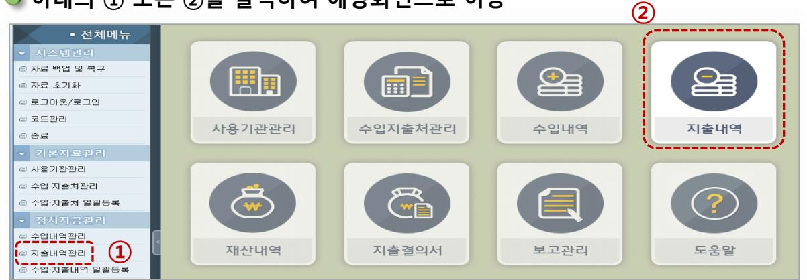

🔍 화면 개관

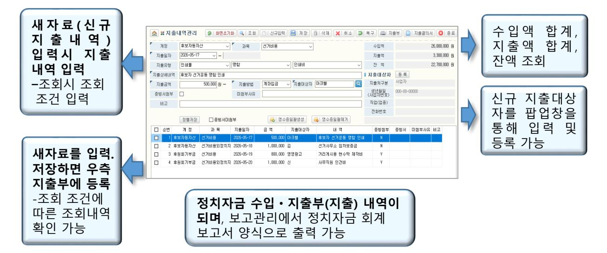

<!-- page: 29 -->

# 가. 화면 및 기능개관(2)

|         |            | 1           | 2          | 3         | 4       |                  | 9               | 10       | (1)   |              |
|---------|------------|-------------|------------|-----------|---------|------------------|-----------------|----------|-------|--------------|
| 🏡 ដ 지출니 | 내역관리       | 👂   화면초기회   | 화 🔍   조 회  | 🕒   신규입력  | 제장      | 🗒   삭제  🗙   취소 🌘 | 복구 🖾 🛪          | 출부 🛛 💽   | 지출결의/ | 4 😢   a e    |
| 계정      | 후보자등자성     | <u> </u>    | 과목         | 선거비용      | ~       |                  | 수입액             |          |       | 26,000,000 원 |
| 지출일자    | 2026-05-17 | ~ ~         |            |           |         |                  | 지출액             |          |       | 3,300,000 윤  |
| 지출유형    | 인쇄물        | ~           | 명함         |           | ~ 인쇄비   | ~                | 잔 액             |          |       | 22,700,000 원 |
| 지출상세내역  | 후보자 선거     | 운동 명함 인쇄    |            |           |         |                  | ▌지출대상자          | 등록       |       |              |
| 지출금액    |            | 500,000 원 ~ | 지출방법       | 계좌입금      | ✓ 지출대상자 | 마크벨 🔍            | 지출처구분           | 사업자      |       |              |
| 증방서첨부   |            |             | 미첨부사유      |           |         |                  | 생년월일 (사업자번호) | 000-00-0 | 0000  |              |
| 비고      |            |             |            |           | ~       |                  | 직업(업종)          |          |       |              |
|         | (7         | D D         |            | ·         | 8       |                  | 전화번호            |          |       |              |
| 6 (     | 정렬저장       | - 증빙서미철     | l부         | 🔜 영수      | 증일괄생성   | 🚜   영수증일괄제거      |                 |          |       |              |
| - 순번    | 계정         | 과 목         | 지출일자       | 금 액       | 지출대상자   | 내역               | 증빙첨부            | 증빙서      | 미첨부사유 | 비고           |
|         | 코자등자산      | 선거비용        | 2026-05-17 | 500,000   | 아크벨     | 후보자 선거운동 명합 인쇄   | N               |          |       |              |
| □ 2 후!  | 보자등자산      | 선거비용외정치지    | 2026-05-18 | 1,000,000 | 김       | 선거사무소 임차보증금      | N               |          |       |              |
| 3 후:    | 원회기부금      | 선거비용        | 2026-05-19 | 800,000   | 영영광고    | 거리게시용 현수막 제작비    | Y               |          |       |              |
| 4 후:    | 원회기부금      | 선거비용외정치지    | 2026-05-20 | 1,000,000 | 신       | 사무직원 인건비         | Y               |          |       |              |
|         |            |             |            |           |         |                  |                 |          |       |              |

#### 🔍 주요기능

| ① 화면초기화      | 최초 입력 내용이 없는 조회 화면으로 되돌아가는 기능이다. |
|--------------|----------------------------------|
| ② 조 <b>회</b> | 조회 조건에 따라 조회가 가능하다.              |
| ③ 신규입력       | 신규 지출내역 입력 화면으로 전환된다.            |
| ④ 저장         | 신규 지출내역 및 수정 내용을 저장한다.           |

#### ● 알아두면 편리한 기능

| ⑤ 다중선택              | □를 check시 각 지출 내역 항목 선택이 가능하다.                        |
|---------------------|-------------------------------------------------------|
| ⑥ 정렬                | 항목별 제목줄 클릭을 통해 오름차순 또는 내림차순으로 정렬하여 지출내역을 조회할 수 있다. |
| ⑦ 정렬저장              | 지출내역 순서를 조정하고 저장하는 기능이다.                              |
| ⑧ 영수증일괄생성 및 일괄제거 | 영수증 증빙번호를 일괄 생성 및 제거할 수 있다.                           |

#### 🔍 그 외 기능

| 9 복구    | 수정・삭제한 자료를 이전 상태로 되돌리는 기능이다.      |
|---------|-----------------------------------|
| ⑩ 지출부   | 전체 또는 계정 • 과목별 지출부 내역을 출력하는 기능이다. |
| ⑪ 지출결의서 | 하나 또는 여러 지출 건의 지출결의서를 출력할 수 있다.   |

<!-- page: 30 -->

#### 나. 신규내역 등록(1)

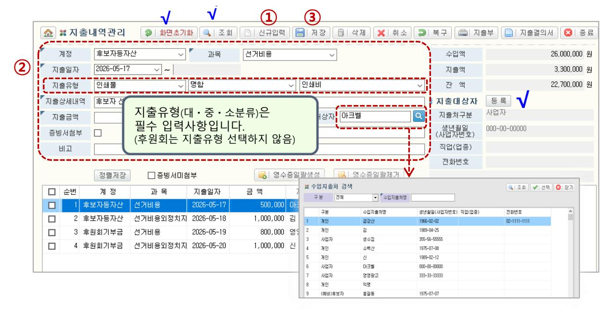

#### 🔍 신규 지출내역 등록 순서

| ① 신규입력        | 기본적으로 신규입력기능 화면을 제공하므로, 기존자료 수정 및 조회 중 새로운 자료를 입력하려면 ① <u>[신규입력]버튼을 클릭하여</u> 신규 내역을 등록한다. |
|---------------|-------------------------------------------------------------------------------------------------|
| ② 지출내용 입 력 | 정치자금 회계보고시 필수 기재사항으로 차례대로 선택 및 입력한다. ※ ✔ 지출대상자 입력 방법. ☞ Ⅲ.3.나.Tip 참조                         |
| ③ 저 장         | 신규 및 수정 지출내역을 저장하고 지출내역에 등록한다.                                                                  |

#### 🌒 주요기능

| √ 화면초기     | 기화 | 각 항목에 입력한 값을 지운 상태, 즉 기존의 조회 기능 화면으로 되돌리는 기능이다. |
|------------|----|----------------------------------------------------|
| √ <u>⊼</u> | 회  | 조회하고자 하는 조건을 ②에 입력 후 지출내역을 조회 및 검색하는 기능이다.      |

<!-- page: 31 -->

#### 나. 신규내역 등록(2)

|    | 계정   | 지출         | ~                      | 과목         |           | ~       |               |                      |                   |                                      | 수입액                     |                     |          | 6,100,0                               | 30 원 |
|----|------|------------|------------------------|------------|-----------|---------|---------------|----------------------|-------------------|--------------------------------------|-------------------------|---------------------|----------|---------------------------------------|------|
| Т  | [출일자 | 2026-02-26 | i v <mark>~</mark> 202 | 6-06-24    | ~         |         |               |                      |                   |                                      | 지출액                     |                     |          | 1,008,5                               | 50 원 |
| Т  | 출유형  |            | ~                      |            |           | ~       |               |                      |                   | ~                                    | 잔 액                     |                     |          | 5,091,4                               | 40 원 |
| 지결 | 돌상세내 | 역          |                        |            |           |         |               |                      |                   |                                      | 지출대상                    | 자 등                 | 록        |                                       |      |
| Т  | 출금액  |            | 원 ~                    | 지출방법       |           | ✓ 지출대상자 |               |                      |                   | ٩                                    | 지출처구분                   | -                   |          |                                       |      |
| 증  | 빙서첨벽 | ≠ ☑        |                        | 증빙서번호      |           | l       |               |                      |                   |                                      | 생년월일 (사업자번호 직업(업종 | V                   |          |                                       |      |
|    | 비고   |            |                        |            |           | Г       | 🚼 수입 지        | 高利 2121              |                   |                                      | 40(08                   | /                   |          |                                       | - 0  |
|    |      | 정렬저장       | □ 증빙서미;                | 철부         | 🛃 영수      | - 증일괄생성 | <b>#</b> 수    | 입 지출치                | 1 관리 수입/지출대상자  |                                      | 자번 직업(업종)               | D   신규임 수입지용치 구분 |          | 8 4 M X 4 A M                         |      |
|    | 순번   | 계 정        | 과 목                    | 지출일자       | 금 액       | 지출대상자   | 변호            | 개인                   | 금강산               | 1989-04-1                            | 15                      | 성명(명칭)              | 24       | ୍ <u>ସ</u> ସ                       |      |
|    | 1    | 지출         | 기부금                    | 2026-05-13 | 1,000,000 |         | 2 3 4         | 개인 사업자 개인      | 남산 동협은행 백투산 | 1968-05-1 121-21-212 1969-04-2 | 212                     | 사업자변호 직 업 (업 중)  |          | 01) 129-45-670                        | 990  |
|    |      | 지출         | 후원금모금경비                | 2026-05-14 | 6,190     |         | 5             | 개인 개인             | 서오릏 소백산        | 1950-11-1 1969-03-1               |                         | 지역(시도) 주 소       | ☑국내 □해외  | ····································· | 비운을  |
|    |      | 지출         | 그밖의경비                  | 2026-06-01 |           | 농협은행    | 7             | 사업자 개인            | 안산선부동우체국 악명    | 555-55-555                           | 55                      | 우편변호                | <u>م</u> | ·⊤도선 후 수영 바랍니다.                       |      |
|    | 4    | 지출         | 그밖의경비                  | 2026-06-02 | 1,870     | 토스페이먼츠  | 9 10 11 | 사업자 개인 (예비)휴보지 | 토스페이면츠 한라산     | 323-23-232 1989-04-2 1989-04-2 | 5                       | 진 화 변 호 팩 스 변 호  |          |                                       |      |
|    |      |            |                        |            |           |         |               |                      |                   |                                      |                         | 81 J                |          |                                       |      |

Tip!

#### < 지출대상자 입력 방법 >

- · 기존에 등록되어 있는 지출대상자 : 🍳 버튼을 클릭하여 검색, 선택
- · 신규 지출대상자 : 지출때상자 등록 을 통하여 팝업창(수입·지출처 관리 화면)을 통하여 지출대상자를 등록할 수 있다. ☞ Ⅲ.1.가.[수입·지출처 등록] 참조

<!-- page: 32 -->

#### 나. 신규내역 등록(3)

#### 🔍 (예비)후보자 화면 예시

| 7   | 배정  | 후보자등자      | 산 ~         | 과목              | 선거비용      | ~       |                | 수입액             |          |       | 26,000,000 |
|-----|-----|------------|-------------|-----------------|-----------|---------|----------------|-----------------|----------|-------|------------|
| 지물  | 출일자 | 2026-05-17 | ~ ~         |                 |           |         |                | 지출액             |          |       | 3,300,000  |
| 지물  | 출유형 | 인쇄물 다      | 분류 ~        | 명함 중 | 분류        | ~ 인쇄비   | 소분류 ~          | 잔 액             |          |       | 22,700,000 |
| [출상 | 강세대 |            | 운동 명합 인쇄    |                 |           |         |                | ▌지출대상자          | 등 록      |       |            |
| 지물  | 출금액 |            | 500,000 원 ~ | 지 출방법           | 계좌입금      | ✓ 지출대상자 | 마크벨 Q          | 지출처구분           | 사업자      |       |            |
| 증빙  | 서첨부 | <u>.</u>   |             | 미첨부사유           |           |         |                | 생년월일 (사업자번호) | 000-00-0 | 00000 |            |
| Ŀ   | 비고  |            |             |                 |           |         |                | 직업(업종)          |          |       |            |
|     |     |            |             |                 |           |         |                | 전화번호            |          |       |            |
|     |     | 정렬저장       | □ 증방서미철     | 부               | 🔜 영수      | 증일괄생성   | 🜏 영수증일괄제거      |                 |          |       |            |
|     | 순번  | 계정         | 과 목         | 지출일자            | 금 액       | 지출대상자   | 내역             | 증빙첨부            | 증빙서      | 미첨부사유 | 비고         |
|     | 1   | 후보자등자산     | 선거비용        | 2026-05-17      | 500,000   | 아크벨     | 후보자 선거운동 명함 인쇄 | I N             |          |       |            |
|     | 2   | 후보자등자산     | 선거비용외정치지    | 2026-05-18      | 1,000,000 | 김       | 선거사무소 임차보증금    | N               |          |       |            |
|     | 3   | 후원회기부금     | 선거비용        | 2026-05-19      | 800,000   | 영영광고    | 거리게시용 현수막 제작비  | Y               |          |       |            |
|     | 4   | 후원회기부금     | 선거비용외정치지    | 2026-05-20      | 1,000,000 | 신       | 사무직원 인건비       | Y               |          |       |            |

● 계정 및 과목
 [계정] 후보자등자산, 후원회기부금, 보조금, 보조금외지원금
 [과목] 선거비용, 선거비용외정치자금
 ※ 선거비용, 선거비용외정치자금 구분은 지출유형(대,중,소) 통해 확인
 제정 과목 대분류 중분류 소분류
 후보자등자산 / 선거비용 / 인쇄물 / 선거벽보 / 기획・도안료
 후원회기부금 / 선거비용외 / 선거사무소 / 개소식관련 / 다과비 정치자금

Tip!

- 계정별, 과목별로 수입 및 지출이 이뤄지며, 지출액이 수입액보다 많을 수 없습니다.
   세부 구분내용은 정치자금 회계실무 및 선거비용 보전안내서 참조
- ★ 선거비용 및 선거비용외정치자금의 구분은 정치자금 회계보고 및 선거비용 보전 시 매우 중요한 사항이므로 정확히 확인하고 기재해야 합니다.

<!-- page: 33 -->

#### 나. 신규내역 등록(3)

#### 후원회 화면 예시

|      |      |          |       |               |            | <b>`</b>  |          |               |    |                |             |       |           |
|------|------|----------|-------|---------------|------------|-----------|----------|---------------|----|----------------|-------------|-------|-----------|
| 7    | 배정   | 지출       |       | ~             | 과목         | 기부금       | ~        |               |    | 수입액            |             |       | 6,100,000 |
| 지물   | 출일자  | 2026-    | 05-13 | ~ ~           |            |           |          |               |    | 지출액            |             |       | 1,008,560 |
| 지물   | 출유형  | )        | Τ     | 출유형의          | 각 탭은       | - 선택하기    | 지 않습니다   | <b>.</b>      |    | 잔 액            |             |       | 5,091,440 |
| [[출ሪ | 알세대? | 역 기부금    |       |               |            |           |          |               | X  | 출대상지           | 등록          |       |           |
| 지물   | 출금액  |          |       | 1,000,000 원 ~ | 지출방법       | 계좌입금      | ✓ 지출대상자  | 홍길동 🔍         | 7  | [출처구분          | (예비)후       | 보자    |           |
| 증빙   | 서첨부  | <u>.</u> |       |               | 증빙서번호      | 7 -13     |          |               | () | 생년월일 (업자번호) | 1989-04-    | -25   |           |
| Ŀ    | 비고   |          |       |               |            |           |          |               | Z  | 직업(업종)         |             |       |           |
|      |      |          |       |               |            |           |          |               | j. | 전화변호           |             |       |           |
|      |      | 정렬       | 저장    | □ 증빙서미침       | 봄부         | 🔜 영수      | 증일괄생성    | 👌 영수증일괄제거     |    |                |             |       |           |
|      | 순번   | সা ?     | 3     | 과 목           | 지출일자       | 금 액       | 지출대상자    | 내역            |    | 증빙첨부           | 증빙서         | 미첨부사유 | 비고        |
|      | 1    | 지출       |       | 기부금           | 2026-05-13 | 1,000,000 | 홍길동      | 기부금           |    | Y              | 71-13       |       |           |
|      | 2    | 지출       |       | 후원금모금경비       | 2026-05-14 | 6,190     | 안산선부동우체국 | 영수증 발송비용      |    | ٧              | 모-7         |       |           |
|      | 3    | 지출       |       | 그밖의경비         | 2026-06-01 | 500       | 농협은행     | 6/10 급여이체 수수료 |    | ۷              | <b>⊐-</b> 2 |       |           |
|      | 4    | 지출       |       | 그밖의경비         | 2026-06-02 | 1,870     | 토스페이먼츠   | 토스페이먼츠 수수료    |    | γ              | コ-12        |       |           |

#### 🔍 계정 및 과목

|     | [계정] 지출                                   |
|-----|-------------------------------------------|
| 후원회 | [과목] 기부금, 후원금모금경비, 인건비, 사무소설치운영비, 그 밖의 경비 |
|     | ※ 후원회의 경우, 지출유형(대.중.소)은 선택하지 않는다.         |

<!-- page: 34 -->

#### 다. 등록사항 수정・정렬・삭제(1)

| _  |               |               |                    |                   |            |                        | 3       |                 |               |                |              |              |              |
|----|---------------|---------------|--------------------|-------------------|------------|------------------------|---------|-----------------|---------------|----------------|--------------|--------------|--------------|
|    |               | <b>::</b> 지 콜 | 불내역관리              | 👂   화면초기:         | 화 🔍   조 회  | 🖹   신규입력               | 제장      | 🗒   삭제 🔀   취소 🗌 | <b>〕</b> │ 복· | 7 🛋 🛪          | 출부           | ) 지출결의시      | 네 😢   종료     |
| ſ  | 5             | 계정            | 후보자등자산 🗸 고목 선거비용 🗸 |                   |            |                        |         | 1               | 수입액           |                |              | 26,000,000 원 |              |
| ľ  | 지:            | 출일자           | 2026-05-17         | ~ ~               |            |                        |         |                 |               | 지출액            |              |              | 3,300,000 සි |
| l  | 지출유형 인쇄물 🗸    |               | 명함                 | < ♡ 인쇄비 ~         |            |                        | 2       | 잔 액             |               |                | 22,700,000 원 |              |              |
| 1  | 지출(           | 상세내역          | 후보자 선거             | 운동 명함 인쇄          |            | 2)                     |         |                 | I T           | 출대상자           | 등 록          |              |              |
| ľ  | 지             | 출금액           |                    | 500,000 원 ~       | 지 출방법      | 계좌입금                   | ∼ 지출대상지 | · 아크벨           | 1             | 지출처구분          | 사업자          |              |              |
|    | 증빙서첨부 [ 비고 |               |                    |                   | 미첨부사유      |                        |         |                 | ] 0           | 생년월일 나업자번호) | 000-00-0     | 00000        |              |
| İ  |               |               |                    |                   |            |                        |         |                 |               | 직업(업종)         |              |              |              |
|    |               |               |                    |                   |            |                        |         |                 | 1             | 전화번호           |              |              |              |
|    |               |               | 정렬저장               | □ 증빙서미칠           | ļ부         | 🔜 영수                   | 증일괄생성   | 🔜 영수증일괄제거       |               |                |              |              |              |
|    |               | 순변            | 계정                 | 과 목               | 지출일자       | 금 액                    | 지출대상자   | 내역              |               | 증빙첨부           | 증빙서          | 미첨부사유        | 비고           |
| 1) |               | 1             | 후보자등자산             | 선거비용              | 2026-05-17 | 500,000                | 아크벨     | 후보자 선거운동 명함 9   | 반쇄            | N              |              |              |              |
|    |               | 2             | 후보자등자산             | 선거비용외정치지          | 2026-05-18 | 1,000,000              | 김       | 선거사무소 임차보증금     |               | N              |              |              |              |
|    |               | ] 3 후원회기부금    |                    | · 선거비용 2026-05-19 |            | 800,000 영영광고 거리게시용 현수택 |         | 거리게시용 현수막 제직    | н             | Y              |              |              |              |
|    |               | 4             | 후원회기부금             | 선거비용외정치지          | 2026-05-20 | 1,000,000              | 신       | 사무직원 인건비        |               | Y              |              |              |              |
|    |               |               |                    |                   |            |                        |         |                 |               |                |              |              |              |

#### ● 등록사항 수정 방법

| ① 선택 | 조회된 화면에서 수정할 지출내역 항목을 선택(파란색으로 변함)한다.                  |
|------|--------------------------------------------------------|
| ② 수정 | 선택한 지출내역 항목에서 내역을 수정한다.                                |
| ③ 저장 | [저장] 버튼을 클릭한다. => 조회 화면에서 최종적으로 수정된 지출내역을 확인할 수 있다. |

Tip!

★ ②의 지출내역 기재사항(계정, 과목, 지출일자, 지출유형, 지출금액, 지출대상자 등)
 모두 수정이 가능합니다.

다. 등록사항 수정・정렬・삭제(2)

|    | 계정      | 지출         | ~              | 과목         | 기부금       | ~        |               | 수입액             |          |       | 6,100,000 |
|----|---------|------------|----------------|------------|-----------|----------|---------------|-----------------|----------|-------|-----------|
| 7  | 지출일자    | 2026-05-13 | ~ <del>~</del> |            |           |          |               | 지출액             |          |       | 1,008,560 |
| 7  | 지출유형    |            | ~              |            |           | ~        | ~             | 잔 액             |          |       | 5,091,440 |
| 지물 | 출상세내역   | 기부금        |                |            |           |          |               | ┃ 지출대상자         | 등록       |       |           |
| 7  | 지출금액    |            | 1,000,000 원 ~  | 지 출방법      | 계좌입금      | ✓ 지출대상자  | 홍길동 🔍         | 지출처구분           | (예비)후    | 보자    |           |
| 6  | 빙서첨부    |            |                | 증빙서변호      | 7 -13     |          |               | 생년월일 (사업자번호) | 1989-04- | -25   |           |
|    | 비고      |            |                |            |           |          |               | 직업(업종)          |          |       |           |
|    |         | 2          |                |            | (;        | 3)       |               | 전화변호            |          |       |           |
|    |         | 정렬저장       | □ 증빙서미쳠        | 부          | 🔜 영수      | 증일괄생성 🔤  | 영수증일괄제거       |                 |          |       |           |
|    | ] 순번    | 계 정        | 과 목            | 지출일자       | 금 액       | 지출대상자    | 내 역           | 증빙첨부            | 증빙서      | 미첨부사유 | 비고        |
|    | ] 1 지(  | ŝ          | 기부금            | 2026-05-13 | 1,000,000 | 홍길동      | 기부금           | Y               | 7[-13    |       |           |
|    | ] 2 지 : | ž          | 후원금모금경비        | 2026-05-14 | 6,190     | 안산선부동우체국 | 영수증 발송비용      | Y               | 모-7      |       |           |
|    | ] 3 지 : | ž          | 그밖의경비          | 2026-06-01 | 500       | 농협은행     | 6/10 급여이체 수수료 | Y               | ⊐-2      |       |           |
|    | 4 지 :   | 室          | 그밖의경비          | 2026-06-02 | 1,870     | 토스페이먼츠   | 토스페이먼츠 수수료    | Y               | ユ-12     |       |           |

<!-- page: 35 -->

#### ● 알아두면 편리한 기능

| ① 다중선택               | □를 check하면 각 지출내역의 콤보박스를 선택할 수 있다. <mark>활용예시</mark> 각 지출내역을 여러 개 선택하여 내역 항목을 한꺼번에 삭제할 수 있다.                                                                        |
|----------------------|---------------------------------------------------------------------------------------------------------------------------------------------------------------------------|
| ② 정렬저장               | 같은 지출일자 내 자료의 순서를 변경하는 기능이다. ★ 순서를 변경한 후 반드시 정렬 저장을 클릭해야만 변경된 순서 대로 지출내역이 확정된다. ☞ Tip 참조 활용예시 같은 일자의 통장 계좌거래 내역 순서와 동일하게 맞추기 위하여 지출내역 순서를 조정하고자 할 때 활용할 수 있다. |
| ③ 영수증 일괄생성 및 일괄제거 | 증빙서첨부를 (Y)로 체크한 지출내역 항목에 대하여 해당 버튼을 클릭만 하면 영수증 번호를 자동생성하여 일괄 부여 또는 일괄 삭제할 수 있다.                                                                                     |

# Tip!

지출내역 항목순서 변경 방법 (② 정렬저장 관련)
 옮기고자 하는 지출내역 항목을 선택하여 드래그 앤 드롭(파란색으로 선택된 지출 항목을 계속 누른 채로 원하는 위치로 옮김)하여 위치를 변경한 후 [정렬저장] 클릭

<!-- page: 36 -->

#### 라. 기타기능

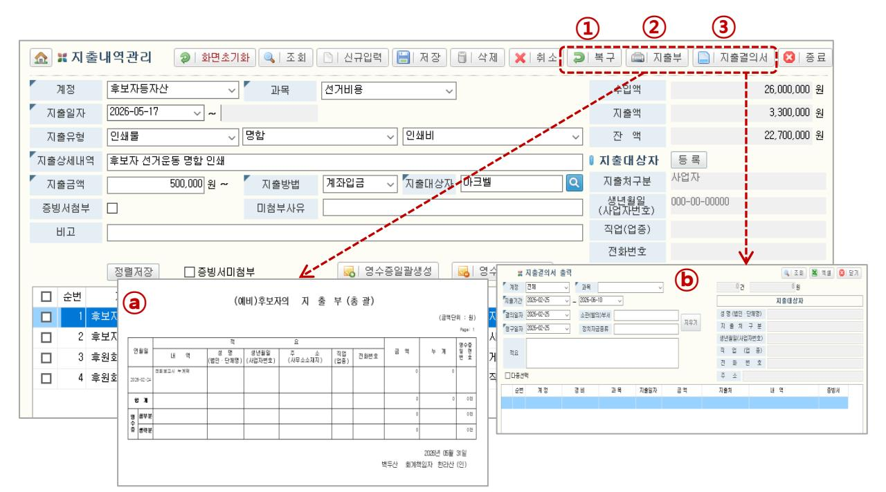

#### 🔵 기타 기능

| ① 복구     | 수정 · 삭제한 자료를 수정 · 삭제하기 이전의 상태로 되돌릴 수 있는 기능이다. ● 복구 대상 - 가능 대상 : 단 건 수정 및 삭제, 다중 삭제 건 - 불가 대상 : <b>영수증일괄생성 또는 제거 처리</b> , 자료초기화 화면에서 삭제한 자료, 수입 · 지출내역 일괄등록 에서 삭제한 자료 ■ 유의사항 로그인하는 동안 수정 · 삭제한 자료에 대해 복구가 가능하다. |
|----------|----------------------------------------------------------------------------------------------------------------------------------------------------------------------------------------------------------------------------------------|
| ② 지출부    | 전체 또는 각 계정·과목별로 조회된 지출내역에 대한 지출부를 ⑧팝업창을 통해 <b>출력</b> 또는 <b>엑셀파일로 다운로드</b> 할 수 있다.                                                                                                                                                   |
| ③지출결의서출력 | 지출결의서를 ⑤팝업창을 통해 <b>엑셀 형태로 출력</b> 할 수 있다.                                                                                                                                                                                               |

<!-- page: 37 -->

# 4. 수입·지출내역 일괄등록

#### 가. 수입 • 지출내역 일괄등록 개관

#### ● 해당화면의 주요기능

★ 수입・지출내역을 엑셀 파일로 관리하는 경우, 엑셀 파일을 업로드하여 정치
 자금 회계관리 프로그램에 해당 내역을 일괄등록할 수 있는 기능입니다.

★ 수입 및 지출건이 발생할 때마다 회계관리 프로그램(수입・지출내역 관리)을 통하여 수입・지출내역을 작성,관리하는 것을 권장하며, 위 사항에 해당하는 경우 등에 한하여 사용하시기 바랍니다.

#### 🤍 아래의 ①을 클릭하여 해당화면으로 이동

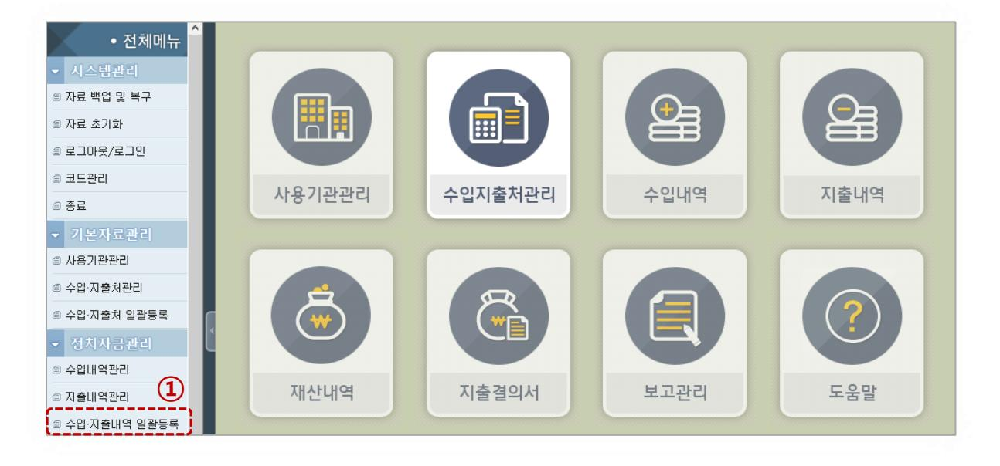

<!-- page: 38 -->

#### 나. 수입・지출내역 일괄등록(1)

|         |                        |        |            |                                              |        |                   | (         | (2)        |        | _(3 | )          |                 |              |      |                     |
|---------|------------------------|--------|------------|----------------------------------------------|--------|-------------------|-----------|------------|--------|-----|------------|-----------------|--------------|------|---------------------|
| <u></u> | 【 수입 지출 ]   | 내역     | 일괄등록       | 2                                            |        |                   |           | 는 전 자료     | 료확인    |     |            | 🗑   삭제          | 🐻 일괄         | 삭제   | 🔀   종료              |
| 일괄등     | 록일자 2026-              | 02-25  | ~ 2        | 2026-06-05 🗸                                 | ۹      |                   |           | 자          | 료      |     |            | 2               | <u>4</u>     |      | 원                   |
| 수 입     | 내 역 지 출                | 놀 LH 1 | 역 정치희      | 후원금 센터 후원금 :                                 | 자료 (수업 | 길)                |           |            |        |     |            |                 |              |      |                     |
| 변호      | 일괄등록일                  | 계정     | 4 <u>1</u> | 과목 수입일:                                      | 자      | 내 역 수 1           | 입제공자      | 생년종        | 월일(사업  | 자변호 | )          | 주 소             |              | 직업(업 | 종) 전                |
|         |                        |        |            |                                              |        |                   |           |            |        |     |            | . —             |              |      | <b>_</b> . <b>_</b> |
|         |                        |        |            |                                              |        |                   |           |            |        |     |            |                 |              |      |                     |
|         |                        |        |            |                                              |        |                   |           |            |        |     |            |                 |              |      |                     |
|         |                        |        |            |                                              |        |                   |           |            |        |     |            |                 |              |      |                     |
|         |                        |        |            |                                              |        |                   |           |            |        |     |            |                 |              |      |                     |
|         |                        |        |            |                                              |        |                   |           |            |        |     |            |                 |              |      |                     |
|         |                        |        |            |                                              |        |                   |           |            |        |     |            |                 |              |      |                     |
|         |                        |        |            |                                              |        |                   |           |            |        |     |            |                 |              |      |                     |
|         |                        |        |            |                                              |        |                   |           |            |        |     |            |                 |              |      |                     |
|         |                        |        |            |                                              |        |                   |           |            |        |     |            |                 |              |      |                     |
|         |                        |        |            |                                              |        |                   |           |            |        |     |            |                 |              |      |                     |
|         |                        |        |            |                                              |        |                   |           |            |        |     |            |                 |              |      |                     |
| ۲       |                        |        |            |                                              |        | $\square$         |           |            |        |     |            |                 |              |      | >                   |
|         | 파일                     |        |            |                                              |        |                   | 넥셀파일 내    | ホミス        | 비스     |     | 0          | 오 류 건 수         |              | 0    | 엑 셀                 |
|         |                        |        |            |                                              |        | <u> </u>          | -еще п    | 지표인        |        |     | U          | ㅗ ㅠ 긴 ㅜ         |              | U    | 72                  |
| 필수 입    | 력 오류 데이터               | 형식 오   | 류 자동처      | 21                                           |        |                   |           |            |        |     |            |                 |              |      |                     |
| 번호      | 구 분                    |        | 수업제공7      | 다 생년월일(사업                                    | (자번호)  |                   | 내역        |            |        |     |            |                 | 오류내용         |      |                     |
|         |                        |        |            |                                              |        |                   |           |            |        |     |            |                 |              |      |                     |
|         |                        |        |            |                                              |        |                   |           |            |        |     |            |                 |              |      |                     |
|         |                        |        |            |                                              |        |                   |           |            |        |     |            |                 |              |      |                     |
|         |                        |        |            |                                              |        |                   |           |            |        |     |            |                 |              |      |                     |
|         |                        |        |            |                                              |        |                   |           |            |        |     |            |                 |              |      |                     |
|         |                        |        |            |                                              |        |                   |           |            |        |     |            |                 |              |      |                     |
| A       | вс                     | D      | E          | F                                            | G      | н                 | I         | J          | К      | L   | М          | N               | 0            | P    | 엑 셀                 |
| *계정 *고  | 바목 *수입일자               | *내역    | *수입제공자     | 생년월일(사업자번호)                                  | 우편번호   | 주소                | 상세주소      | 직업 (업종) | 전화번호   | *금액 | *증빙서 첨부 | 영수증번호/ 미첨부사유 | *수입지출치 구분 | 비고   |                     |
|         | 20150101               |        | 홍길동        |                                              |        | 00시 00구 00동 123-1 |           |            |        |     | Y          |                 |              |      |                     |
|         | 2015-01-01             |        | 00후원회      | 123-45-67890                                 |        |                   |           |            |        |     | N          |                 |              |      |                     |
|         | 2015/01/01             |        | A사업체       | 1234567890                                   |        |                   |           | 1 7        |        |     |            |                 |              | 1 1  |                     |
|         |                        |        |            | A REAL PROPERTY AND AND AND A REAL PROPERTY. |        |                   |           |            |        |     |            |                 |              |      |                     |
| * : 필수  | (년월일 : 상기 형식 모두 가능) |        |            | (사업자번호 : 상기 형식 모두 가능)                     | (기 등록  | 된 수입제공자는 주소, 직    | 업(업종), 전회 | 가번호 생      | ·략 가능) |     |            |                 |              | +    |                     |

#### ● 수입・지출처 일괄등록순서 ★ 수입내역, 지출내역 각 탭을 이용

| ① [엑셀] 파일 찾기       | 돋보기 클릭 후, 작성된 수입 및 지출처 목록(엑셀) 파일 선택                                                                                                  |
|--------------------|--------------------------------------------------------------------------------------------------------------------------------------|
| ② [저장전 자료확인] 클릭 | ①의 엑셀파일이 오류가 있는지 점검 => 오류 자료 있는 경우 [저장] 불가 => 오류 내용은 [엑셀] 파일로 다운로드 가능 => 오류수정 후 ① <b>의 순서로 돌아가서 진행</b> ★ 오류가 없어야 일괄등록 가능 |
| ③ 저 장              | 일괄 등록 완료됨                                                                                                                            |

# Tip!

수입・지출내역을 일괄등록하는 경우, 수입지출처는 자동 등록되나요? => 네, 수입・지출내역을 일괄등록하는 경우 수입지출처도 같이 일괄등록되므로 수입・지출처를 별도 등록할 필요가 없습니다.

나. 수입・지출내역 일괄등록(2)

|                       | 일자 2026-                                                         | 00.0F |                                             |                                                                   |                                |              |                            |                 |             |      |                       |             |            |          |           |   |
|-----------------------|------------------------------------------------------------------|-------|---------------------------------------------|-------------------------------------------------------------------|--------------------------------|--------------|----------------------------|-----------------|-------------|------|-----------------------|-------------|------------|----------|-----------|---|
| 괄등록                   |                                                                  |       |                                             |                                                                   | ۹                              |              |                            | 자               | 료           |      |                       | 2           | 1          |          |           |   |
|                       |                                                                  | 을 내 역 |                                             | ◎원금 센터 후원금 :                                                      |                                |              |                            |                 |             |      |                       |             |            | 1        |           | _ |
| Ξ,                    | 일괄등록일                                                            | 계정    | I                                           | 바목 수입일:                                                           | 자                              | 내역 수'        | 입제공자                       | 생년율             | 일일(사업7      | 자번호) |                       | 주 소         |            | 직업(      | 업종)       |   |
|                       |                                                                  |       |                                             |                                                                   |                                |              |                            |                 |             |      |                       |             |            |          |           |   |
|                       |                                                                  |       |                                             |                                                                   |                                |              |                            |                 |             |      |                       |             |            |          |           |   |
|                       |                                                                  |       |                                             |                                                                   |                                |              |                            |                 |             |      |                       |             |            |          |           |   |
|                       |                                                                  |       |                                             |                                                                   |                                |              |                            |                 |             |      |                       |             |            |          |           |   |
|                       |                                                                  |       |                                             |                                                                   |                                |              |                            |                 |             |      |                       | 오류내         | 용을         | 에셀       | 파일        |   |
|                       |                                                                  |       |                                             |                                                                   |                                |              |                            |                 |             |      |                       |             | 다운로        |          | 16        |   |
|                       |                                                                  |       |                                             |                                                                   |                                |              |                            |                 |             |      |                       |             | 16.4       |          | _         |   |
|                       |                                                                  |       |                                             |                                                                   |                                |              |                            |                 |             |      |                       |             |            |          | ∧         |   |
|                       |                                                                  |       |                                             |                                                                   |                                |              |                            |                 |             |      |                       |             |            | (4       | , i       |   |
|                       |                                                                  |       |                                             |                                                                   |                                |              |                            |                 |             |      |                       |             |            | <u> </u> | <u></u>   |   |
|                       |                                                                  |       |                                             |                                                                   |                                | Q            | 빅셀파일 나                     | ער בוד ו        |             |      |                       |             |            |          | ) 엑       | 선 |
| 빅셀 표                  | F일                                                               |       |                                             |                                                                   |                                | <u> </u>     | ~ 걸파 걸 나                   | 1 사료건           | Ŷ           | 0    | ) 오                   | 류건수         |            | (        | ت_ ا      | - |
|                       | 1일 오류 데이터                                                     | 형식 오  | 류 자동처i                                      | 리                                                                 |                                |              |                            | 1 사료건           | <del></del> | (    | ) 오                   | :류건수        |            | (        |           | - |
|                       |                                                                  | 형식 오  | 류 자동처i 수입제공7                             |                                                                   | [자번호]                          |              | 내역                         | 1 사료건           | ÷           | 0    | ) 오                   |             | 오류내용       |          |           | - |
| 2 입력                  | 오류 데이터                                                           | 형식 오  |                                             |                                                                   | 1자번호)                          |              |                            | 1 /1 52 2       | ÷           |      | ) 오                |             | 오류내용       |          |           |   |
| ት 입력 호             | 오류 데이터 구분                                                     |       | 수입제공7                                       | 자 생년월일(사업                                                         |                                | , <b>,</b> , | 내역                         |                 |             | (    | ) Ŷ                   |             | 오류내용       |          |           |   |
| ት 입력 호             | 오류 데이터 구분                                                     |       | 수입제공7                                       | 자 생년월일(사업                                                         |                                | 내역을 준수히      | 내역                         |                 |             |      | ) 오                   |             | 오류내용       |          |           |   |
| ት 입력 호             | 오류 데이터 구분                                                     |       | 수입제공7                                       | 자 생년월일(사업 사항이므로 :                                              |                                | , <b>,</b> , | 내역                         |                 |             |      | ) Ŷ                   |             | 오류내용       |          |           |   |
| 을 입력 호 <b>엑</b> | 오류 데이터 구분 셀파일 즈                                            | 낙성시   | 수입제공기   유의기                              | 자 생년월일(사업                                                         | 해당                             | 내역을 준수히      | 배역 <b>  야 합</b>         |                 |             |      |                       |             |            |          | (5        | ) |
| 수 입력 호 <b>엑</b> | 오류 데이터 구분 <b>셀파일 조</b>                                     | 삼성시   | 수입제공7 유의/                                | 자 생년월일(사업 나항이므로 :                                              | 해당 I                           | 내역을 준수히      | 내 역 <b>H야 합</b>         | 니다.             | ĸ           | L    | M 중빙서 19           | N 경수증번호/ | 0 *수입지출 | P        | <b>(5</b> | ) |
| 을 입력 호 <b>엑</b> | 오류 데이터 구분 셀파일 즈                                            | 삼성시   | 수입제공7 유의/                                | 자 생년월일(사업 사항이므로 :                                              | 해당                             | 내역을 준수히      | 배역 <b>  야 합</b>         | 니다.             | ĸ           | L    | M 중빙서 (5           | N           | 0          | P        | <b>(5</b> | ) |
| 수 입력 호 <b>엑</b> | 오류 데이터 구분 셀파일 조 c *수입일자                              | 삼성시   | 수입제공7 유의/ E 수입제공자                  | 자 생년월일(사업 나항이므로 :                                              | 해당 I                           | 내역을 준수히      | 내 역 <b>H야 합</b>         | 니다.             | ĸ           | L    | M 증빙서 5 첨부      | N 경수증번호/ | 0 *수입지출 | P        | <b>(5</b> | ) |
| 수 입력 호 <b>엑</b> | 오류 데이터 구분 <b>셀파일 조</b> *수입입자 2015/0101 2015/01/01 | 삼성시   | 수입제공7 유의/ E *수입제공자 홍길동          | 자 생년월일(사업 나항이므로 7 생년월일(사업자번호) 123-45-67890 1234567890 | 해당 I                           | 내역을 준수히      | 내 역 <b>H야 합</b>         | 니다.             | ĸ           | L    | M 증빙서 5 첨부 Y | N 경수증번호/ | 0 *수입지출 | P        | <b>(5</b> | ) |
| 수 입력 호 <b>엑</b> | 오류 데이터 구분 <b>셀파일 조</b> *수입일자 2015-01-01              | 삼성시   | 수입제공7 유의/ E *수입제공자 홍길동 00후원회 | 자 생년횔일(사업 나항이므로 ( 생년물일(사업자번호) 123-45-67890               | <mark>해당  </mark> G 우편번호 | 내역을 준수히      | 내 역 <b>H야 합</b> 생세주소 | J 직업 (업종) | к 전화번호   | L    | M 증빙서 5 첨부 Y | N 경수증번호/ | 0 *수입지출 | P        | <b>(5</b> | ) |

<!-- page: 39 -->

#### 🔍 기능 더 알아보기

- ① [돋보기] : 일괄등록일자를 입력하고 돋보기를 클릭하면 일괄등록한 자료 조회 가능
- ② [삭제] : 수입 또는 지출내역 탭 화면에서 자료선택 후 [삭제] 가능
- ③ [일괄삭제] : [일괄삭제]를 클릭하면 조회목록 내 모든 자료를 삭제한다.
- ④ [엑셀] : 오류 내용을 [엑셀] 파일로 다운로드하여 확인할 수 있다.
- ⑤ [엑셀] : 일괄등록 양식의 엑셀파일 다운로드가 가능하다 . ☞ Tip 참조

| <b>말</b> 붙여 | 1 1 1271 11 11 11 11 11 11 11 11 11 11 11 11 1                                      | 잘라내기 복사 ▼ 서식 복사 | 맑은 고딕 가 <u>가                                  </u> | •      | - 11 - 1 - <u></u> → - <u>7</u> - |            | _     |       | 문 텍스트 로 병합하 |                   |         | 일반 <b>달</b> - %     | • €.0           | .00 →.0 | 로건부 서식 ▼ | 표 표 계 서식 • |                         | 나쁨 메모         |    |
|----------------|-------------------------------------------------------------------------------------------|-----------------------|-------------------------------------------------------|--------|--------------------------------------|------------|-------|-------|----------------|-------------------|---------|------------------------|-----------------|------------|-------------|------------------|-------------------------|------------------|----|
|                | 클립보모                                                                                      | =                     | ra                                                    | 글      | 꼴                                    | r <u>s</u> |       |       | 맞춤             |                   | G.      | 표시                     | 형식              | ra i       |             |                  |                         |                  |    |
| A1             | <ul> <li>▼ : × ✓ ▲</li> <li>* 지출내역 일괄등록시 정당사용자(창준위, 시도당, 정책연구소 포함)에 한해 '경비' 필수</li> </ul> |                       |                                                       |        |                                      |            |       |       |                |                   |         |                        |                 |            |             |                  |                         |                  |    |
|                | Α                                                                                         | В                     | С                                                     | D      | E                                    |            | F     |       | G              | н                 | - I     | J                      |                 | K          | L           | м                | Ν                       | 0                | Р  |
| 1              | * 지출                                                                                      | 내역 일                  | 괄등록시 정                                                | 당사용    | 자(창준위, 시드                            | 도당, 정책(    | 친구소 : | 포함)에  | 한해 '경비'        | '필수               |         |                        |                 |            |             |                  |                         |                  |    |
| 2              | * 수입                                                                                      | 지출처-                  | 구분 : 사업지                                              | 타, 개인, | 후원회, 중앙당                             | 랑, 시도당,    | 정책연   | 구소, 정 | 당선거사두          | 2 소, 국 | 회의원, (0 | 셰비)후보                  | .자, 기티          | 타 중        | 입력          |                  |                         |                  |    |
| 3              | * 금액                                                                                      | : 숫자                  | 형식으로 입                                                | 력(예:1  | 0000 O, 만원 >                         | X, 10000원  | X)    |       |                |                   |         |                        |                 |            |             |                  |                         |                  |    |
| 4              | * 수입                                                                                      | (지출)일                 | 일자 및 생년                                               | 월일 : 8 | 자리로 입력                               |            |       |       |                |                   |         |                        |                 |            |             |                  |                         |                  |    |

<!-- page: 40 -->

|                | *계정                                                                                       | *과목                   | *수입일자                                                 | *내역    | *수입제공자                               | 생년월일       | (사업지  | 아번호)  | 우편번호           | 주 소               | - 상세주:  | 소 직업 (업종 | ) 전화 | 번호         | *금액         | *증빙서 첨부       | 영수증번 호/ 미첨부사 유 | *수입지 출처 구분 | 비고 |

Tip!

일괄등록 양식에 담긴 추가 유의사항을 참고하시기 바랍니다. ※ 업로드 시 해당 유의사항을 삭제하지 마세요.(삭제할 경우 업로드시 오류 발생)

<!-- page: 41 -->

# 5. 재산내역 관리

#### 가.개 관

#### 🌒 해당화면의 주요기능

- ★ 재산내역에는 토지, 건물, 주식 또는 유가증권, 비품, 현금 및 예금, 그 밖의 재산으로 구분됩니다.
- ★ 재산명세서는 회계보고서 작성시 보고사항으로 재산명세서 화면에서 별도 출력하거나 보고서 및 과목별 수입・지출부에서 일괄출력 가능합니다.

#### ● 아래의 ①을 클릭하여 해당화면으로 이동

메인화면의 [재산내역] 아이콘을 클릭하면 [재산내역 관리]로 연결된다.

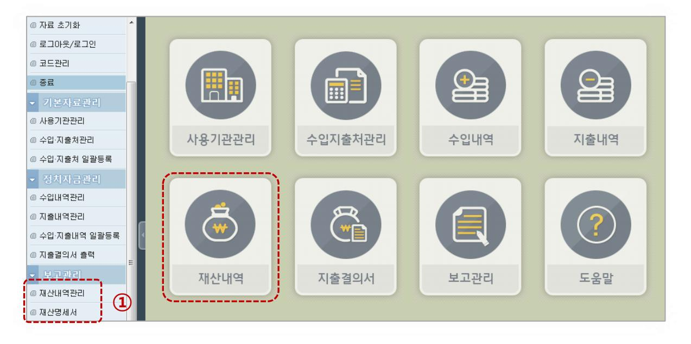

<!-- page: 42 -->

#### 나. 재산내역 관리

#### POINT

★ 신규 재산내역 등록시에는 반드시 신규입력을 클릭하여 새자료를 입력합니다.
 ★ 재산 내역에는 토지, 건물, 주식 또는 유가증권, 비품, 현금 및 예금, 그 밖의 재산이 있습니다. (아래 화면 참조)

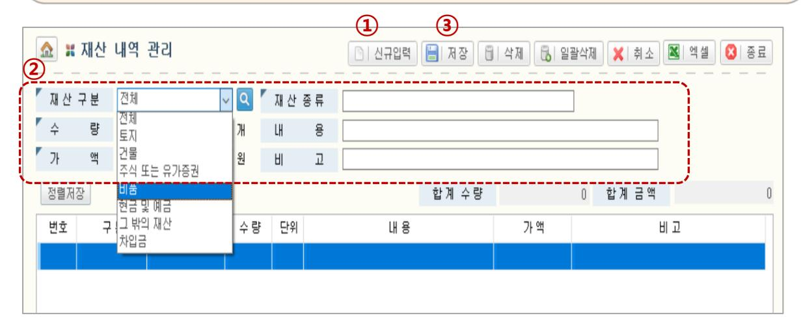

#### ● 재산내역 입력방법(① → ② → ③)

| ① 신규입력 | 기본적으로 신규입력기능 화면을 제공하므로, 기존자료 수정 및 조회 중 [신규입력]을 클릭하면 신규입력 화면으로 전환되어 신규 재 산 등록 가능 |
|--------|---------------------------------------------------------------------------------------|
| ② 항목작성 | 재산 내역 항목을 선택하여 작성                                                                     |
| ③ 저 장  | [저장]을 클릭하면 재산내역에 등록                                                                   |

#### Q&A

재산내역 등록 시 차입·변제한 금액은 어떻게 입력해야 하나요?

- → 1. [재산구분] 탭에서 [차입금]을 선택합니다.
  - 2. 차입 시는 프로그램에서 자동적으로 (-) 처리되어 재산명세서 등에 반영되므로, (+) 금액을 입력하고 비고에 차입일자, 차입내용, 금액을 기재합니다. (예시 : 2026.1.1. 자산 차입, 1,000,000원)
  - 3. 변제 시는 (-) 금액을 입력하고 비고에 변제일자, 변제내용, 금액을 기재합니다. (예시 : 2026.5.1. 자산 변제, -500,000원)

<!-- page: 43 -->

#### 다. 재산명세서

#### POINT

★ 전체 재산내역을 확인할 수 있고, 개별 재산내역 탭을 선택하여 재산의 상세내역을 확인할 수 있습니다.

★ 전체 재산내역이나 개별 세부재산내역을 출력할 수 있습니다.

|                                       |                  |        |         |            |         |      | 2       |         |            |        |                     |  |
|---------------------------------------|------------------|--------|---------|------------|---------|------|---------|---------|------------|--------|---------------------|--|
| \$                                    | 🖹 🐹 재산 명세서       |        |         |            |         |      | 👜 재산명세서 | 해출력 💿 세 | 부내역출력      | 🔀   엑셀 | <mark>(</mark> 왕) 종 |  |
| •                                     | 기준연월일 2026-06-23 |        | 작성면월일   | 2026-06-29 | ~       |      |         |         |            |        |                     |  |
| C                                     | 전 체 토 지 건        |        | 또는 유가증권 |            | 현금 및 예금 | 그 밖의 | 재산      |         |            |        |                     |  |
| ۲                                     | 구 분              | 종      | 류       | 수 량        |         | LH   | 8       | 가       | 액          | Ы      | 고                   |  |
|                                       | ET               |        |         |            |         |      |         |         |            |        |                     |  |
|                                       | 토지               | 소      | 계       |            |         |      |         |         |            |        |                     |  |
| Ē                                     | 구 분              | 종      | 류       | 수 량        |         | 내    | 용       | 가       | 액          | ы      | 고                   |  |
|                                       | ם גר             |        |         |            |         |      |         |         |            |        |                     |  |
|                                       | 건물               | 소      | 계       |            |         |      |         |         |            |        |                     |  |
| Ē                                     | 구 분              | 종      | 류       | 수 량        |         | 내    | 용       | 가       | 액          | Ы      | 고                   |  |
|                                       | 주식 또는            |        |         |            |         |      |         |         |            |        |                     |  |
|                                       | 유가증권             | 소      | 계       |            |         |      |         |         |            |        |                     |  |
| F                                     | 구 분              | 종      | 류       | 수 량        |         | 내    | 용       | 21      | 액          | Ы      | 고                   |  |
|                                       |                  |        |         |            |         |      |         |         |            |        |                     |  |
|                                       | 비품               | 소      | 계       |            |         |      |         |         |            |        |                     |  |
| ī                                     | 구 분              | 종      | 류       | 수 량        |         | 내    | 용       | 71      | 액          | Ы      | 고                   |  |
|                                       |                  | ମା     | 2       | 1.78       |         |      |         |         | 22,700,000 |        |                     |  |
|                                       | 현금 및 예금          | 소      | 계       | 178        |         |      |         |         | 22,700,000 |        |                     |  |
| Ē                                     | 구 분              | 종      | 류       | 수 량        |         | 내    | 용       | 가       | 액          | Ы      | 고                   |  |
|                                       |                  |        |         |            |         |      |         |         |            |        |                     |  |
|                                       | 그 밖의 재산          | 소      | 계       |            |         |      |         |         |            |        |                     |  |
| · · · · · · · · · · · · · · · · · · · |                  |        |         |            |         |      |         |         |            |        |                     |  |
| <u>_</u>                              | X 재산 명세서         |        |         |            |         |      | 👜 재산명세서 | 출력 💼 세브 | _          | ■      |                     |  |
| ש                                     | 기준연월일 2026-06-23 |        |         | 2026-06-29 |         |      |         |         | 2          |        |                     |  |
| ζ                                     | 전 체 토 지 건        | 물 주식 5 | 또는 유가증권 | 비 품        | 현금 및 예금 | 그 밖의 | 재산      |         |            |        |                     |  |
|                                       | 자 료              |        | 1 건     | 수 량        |         |      | 1 78    | 합 계     |            | 22.700 | 1.000 원             |  |
|                                       | 번호 종류            | 수 량    | 단위      |            | 내용      |      | 가액      |         | Ы          | 고      |                     |  |
|                                       |                  |        |         |            |         |      |         |         |            |        |                     |  |

● 재산명세서 출력방법(① → ②)

① 탭 선택 전체 재산내역 또는 개별재산내역 탭을 선택

세부내역 출력

전체 내역에서 재산명세서 출력 또는 개별재산내역 탭에서

② 출 력

<!-- page: 44 -->

# 6. 보고서 및 수입・지출부 [(예비)후보자용]

가. 개관(1)

#### ● 해당 화면의 주요기능

★ 정치자금 회계보고서 보고사항을 한번에 일괄출력할 수 있고, 필요에 따라 정치자금 수입・지출의 계정 및 과목별 또는 보고사항별(수입・지출부 등)로 개별 출력도 가능합니다.

★ 미리보기 기능이 기본적으로 제공됩니다.

#### ● 아래의 ①을 클릭하여 해당화면으로 이동

메인화면의 [보고관리] 아이콘을 클릭하면 [보고서 및 과목별 수입·지출부 출력] 으로 연결됩니다.

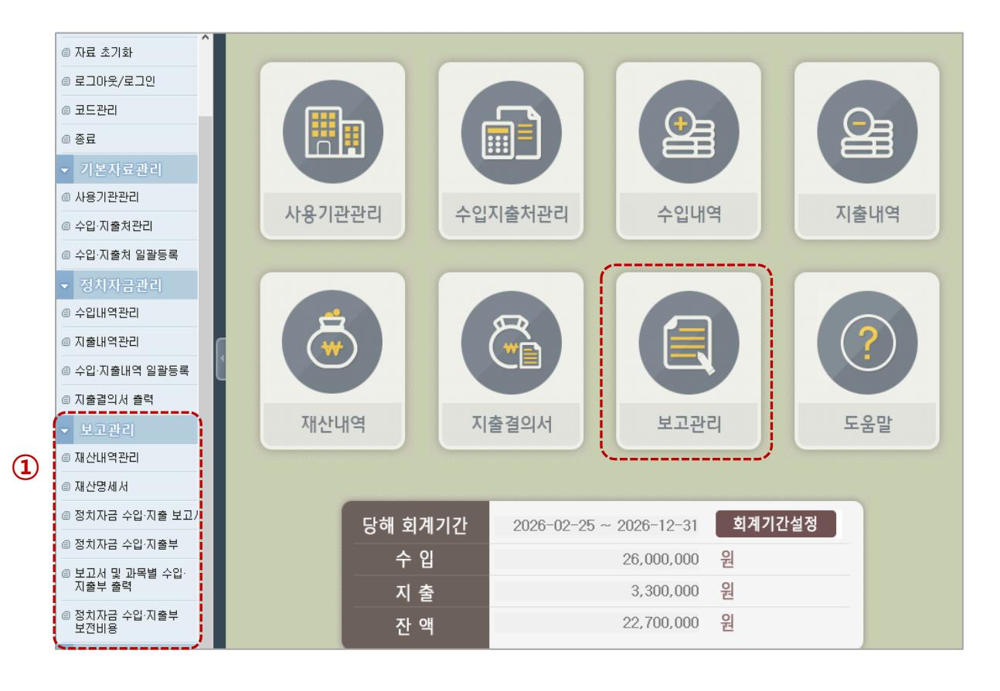

<!-- page: 45 -->

#### 가. 개관(2)

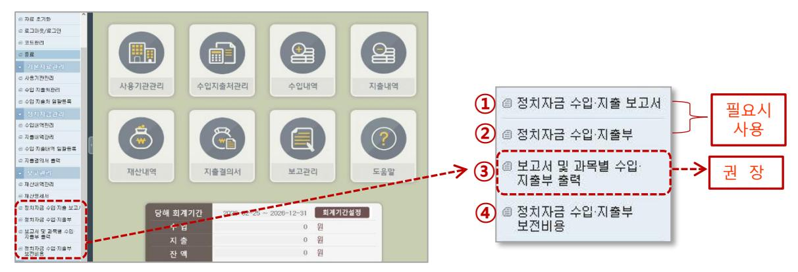

#### 🔍 메뉴 개요 설명

| ① 정치자금 수입・지출보고서       | 정치자금 수입・지출보고서를 별도 확인 및 출력 가능                                         |
|--------------------------|----------------------------------------------------------------------|
| ② 정치자금 수입・지출부         | 정치자금 수입지출부를 계정・과목별로 별도 확인 및 출력 가능                                    |
| ③ 보고서 및 과목별 수입・지출부 출력 | 정치자금 수입・지출 보고사항을 일괄 출력 및 계정・과목별 또는 표지별 개별 출력 가능 <mark>(권장)</mark> |
| ④ 정치자금 수입 • 지출부 보전비용  | 선거비용 보전청구 명세서 편집 및 출력                                                |

#### Tip!

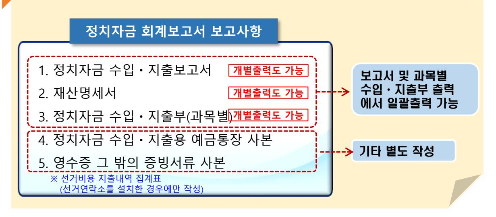

<!-- page: 46 -->

#### 나. 보고서 및 과목별 수입・지출부 출력

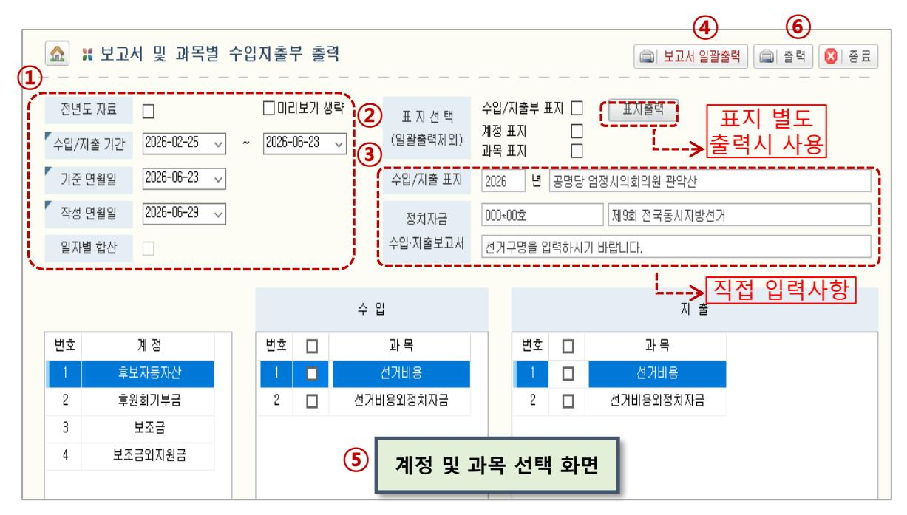

#### 🔵 일괄출력 방법

| ① 수입/지출 기간 등 | 회계보고기간 확인               |
|--------------|-------------------------|
| ② 표지선택       | 별도 안내가 없는 경우, 모두 체크     |
| ③ 수기 작성사항 기재 | 표지 및 보고서에 들어갈 사항을 직접 입력 |
| ④ [보고서 일괄출력] | 정치자금 수입・지출 보고사항 일괄 출력   |

#### 🔵 개별출력 방법

| 표지별 출력      | 위 ②의 콤보박스를 선택하여 [표지출력]을 클릭한다.                                    |  |  |  |  |
|-------------|------------------------------------------------------------------|--|--|--|--|
| 계정 및 과목별 출력 | 위 ⑤의 계정 및 과목 선택 화면에서 계정을 선택하고 과목명 체크(콤보)박스를 선택하여 ⑥ [출력]하면 된다. |  |  |  |  |

<!-- page: 47 -->

#### 다. 정치자금 수입・지출보고서 / 정치자금 수입・지출부

| ) 정치자금                                                                           | 수입・지                   | 출보고서 즬       | 출력 (①→          | ②→③)               | 1                | 3 (        | 4  |
|----------------------------------------------------------------------------------|------------------------|--------------|-----------------|--------------------|------------------|------------|----|
| ▲ :: 정치자금 수입지출보고서     ▲ 조회     ▲ 출력     ⊠ 액셀     ◎ 종료                            |                        |              |                 |                    |                  | 엑셀 🔯 종료    |    |
| 전 년 도 자료 □ 기 관 2026-02-25 · ~ 2026-06-23 · 작성 연월일 2026-06-23 · 별도 수정 없음 |                        |              |                 |                    |                  |            |    |
| <b>(체</b> : 구                                                                 | <mark>크안함)</mark> 분 | 정 치 자 수 입 |                 | ~ 입 · 지 지 출     |                  | 잔 액        | 비고 |
| 자                                                                                | 산                      | 20,000,000   | 선거비용 500,000 | 선거비용외 1,000,000 | 소 계 1,500,000 | 18,500,000 |    |
| 후 원 회 기                                                                          | 후원 회 기 부 금             |              | 800,000         | 1,000,000          | 1,800,000        | 4,200,000  |    |
| 정당의 지원금                                                                          | 보조금                    | 0            | 0               | 0                  | 0                | 0          |    |
|                                                                                  | 보조금외                   | 0            | 0               | 0                  | 0                | 0          |    |
| 합                                                                                | সা                     | 26,000,000   | 1,300,000       | 2,000,000          | 3,300,000        | 22,700,000 |    |

#### ● 정치자금 수입・지출부 출력 (①→②→③)

| <u>a</u> : | : 정기  | 디자금 수입  | 별 <b>5</b> 입지출부 ( | 티수정 없을 체크안함) | <b></b>    |           | 1 () 조회 (= | 3     4       출력     ▶ 엑셀 | <mark>(전</mark> ) 종료 |
|------------|-------|------------|-------------------------|-----------------|------------|-----------|---------------|---------------------------|----------------------|
| 전년         | !도 자료 | I          |                         | ·····           |            |           |               |                           |                      |
| 71         | Z     | 반 2026-02  | 2-25 ~ ~ 2026-06-2      | 3 🗸             | ঁ শা ব     | 전체        |               | 계정 및                      | ! 과목을                |
| 작성         | 병 연월을 | 2026-06    | <u>}-29 ↓</u>           |                 | 과 목        |           | 2             |                           | 한다.                  |
| 번호         | 전송    | 년월일        | 내 역                     | 수            | 입 액        |           | 출 액           | 잔 액                       |                      |
|            |       |            |                         | 금회              | 누계         | 금회        | 누계            |                           | 성명/법인/단              |
| 1          | •     | 2026-02-28 | 후보자 자산                  | 5,000,000       | 5,000,000  |           | 0             | 5,000,000                 | 홍길동                  |
| 2          | ☑     | 2026-03-01 | 후보자 자산                  | 10,000,000      | 15,000,000 |           | 0             | 15,000,000                | 홍길동                  |
| 3          | ~     | 2026-03-03 | 후보자 자산                  | 5,000,000       | 20,000,000 |           | 0             | 20,000,000                | 홍길동                  |
| 4          | ~     | 2026-03-06 | 후원회기부금 6,000,000        |                 | 26,000,000 |           | 0             | 26,000,000                | 후원회                  |
| 5          | ~     | 2026-05-17 | 인쇄물-명함-인쇄비-후보7          |                 | 26,000,000 | 500,000   | 500,000       | 25,500,000                | 아크벨                  |
| 6          | ~     | 2026-05-18 | 선거사무소-임차보증금-선           |                 | 26,000,000 | 1,000,000 | 1,500,000     | 24,500,000                | 김                    |
| 7          | ~     | 2026-05-19 | 거리게시용현수막-거리게/           |                 | 26,000,000 | 800,000   | 2,300,000     | 23,700,000                | 영영광고                 |
| 8          | •     | 2026-05-20 | 선거사무소-인건비-사무직           |                 | 26,000,000 | 1,000,000 | 3,300,000     | 22,700,000                | 신                    |

#### 🔵 기능 더 알아보기

[조회] : 조회 조건에 따라 조회 가능하다.
 ③ [출력] : 수입・지출보고서(수입・지출부)를 출력한다.
 ④ [엑셀] : 수입・지출보고서(수입・지출부)를 엑셀 다운로드 가능하다.

라. 정치자금 수입 • 지출부 출력(보전비용)

<!-- page: 48 -->

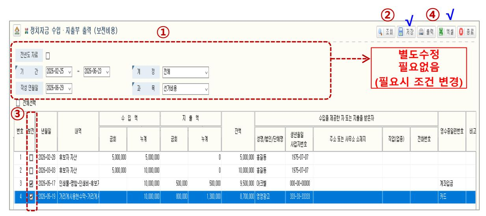

#### 

🔵 기능 더 알아보기

√ [저장]

√ [엑셀]

| ) 선거비용 보전청구 명세서 출력 방법 |                                                     |  |  |  |  |
|-----------------------|-----------------------------------------------------|--|--|--|--|
| ① 조회조건 입력             | 별도 수정이 필요 없으며, 필요 시에 조건 변경하여 사용                     |  |  |  |  |
| ② [조회]                | 기본 설정 조건에서 조회하면 총괄(전체)계정의 선거비용 과목 지출내역이 조회화면에 표출 |  |  |  |  |
| ③ [보전]                | 보전 대상인 경우 콤보박스 체크 또는 전체선택한 후 콤보박스 해제             |  |  |  |  |
| ④ [출력]                | 미리보기가 가능하며, 보전청구 명세서 출력 가능                          |  |  |  |  |

보전여부를 체크한 후 [저장]을 클릭하면 해당 화면을 종료하거나

로그아웃한 이후에도 보전여부를 체크한 사항이 저장됨

보전청구 명세서를 엑셀파일로 다운로드 가능

<!-- page: 49 -->

# 6. 보고서 및 수입・지출부 [후원회용]

가. 개관(1)

#### ● 해당 화면의 주요기능

★ 정치자금 회계보고서 보고사항을 한번에 일괄출력할 수 있고, 필요에 따라 정치자금 수입·지출의 계정 및 과목별 또는 보고사항별(후원회의 수입·지출 총괄표, 정치자금 수입·지출부, 후원금 기부자명단, 감사의견서 등)로 개별 출력도 가능합니다.

★ 미리보기 기능이 기본적으로 제공됩니다.

#### ● 아래의 ①을 클릭하여 해당화면으로 이동

메인화면의 [보고관리] 아이콘을 클릭하면 [보고서 및 과목별 수입·지출부 출력] 으로 연결됩니다.

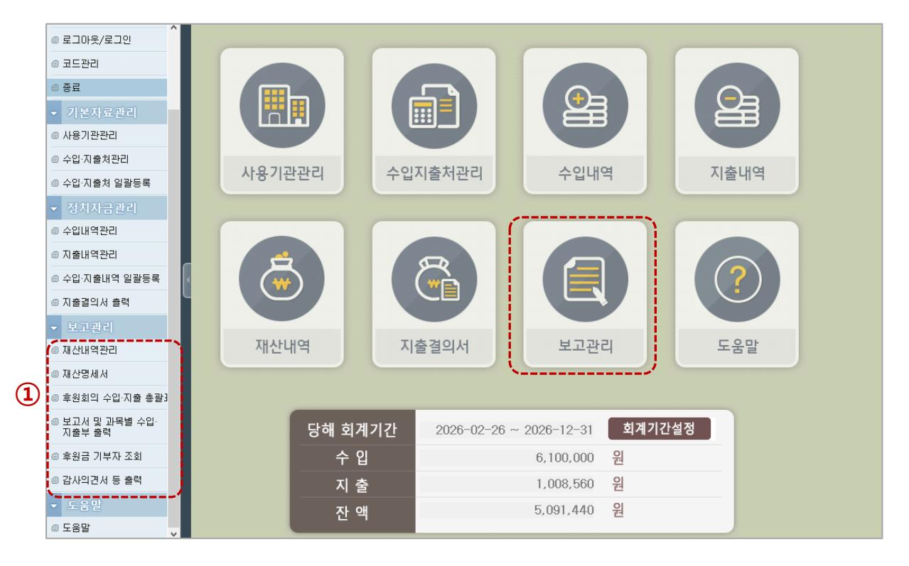

<!-- page: 50 -->

#### 가. 개관(2)

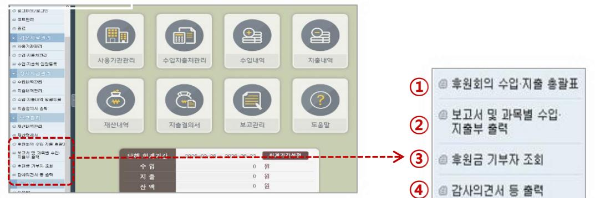

#### 🔍 메뉴 개요 설명

| ① 후원회의 수입・지출총괄표                                | 수입・지출총괄표를 별도 출력시 사용                                                 |  |  |
|---------------------------------------------------|---------------------------------------------------------------------|--|--|
| <ol> <li>2 보고서 및 과목별</li> <li>수입・지출부출력</li> </ol> | 정치자금 수입지출 보고사항을 일괄 출력 및 계정・과목별 또는 표지별 개별 출력 가능 <mark>(권장)</mark> |  |  |
| ③ 후원금 기부자 조회                                      | 1회 30만원 초과 기부자, 연간 300만원 초과 기부자 명단을 별도 출력시 사용                    |  |  |
| ④ 감사의견서 등 출력                                      | ②의 일괄출력시 함께 출력되지 않으므로 별도 출력해야 함.                                    |  |  |

Tip!

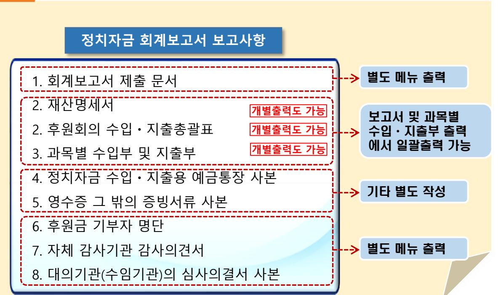

<!-- page: 51 -->

#### 나. 보고서 및 과목별 수입・지출부 출력

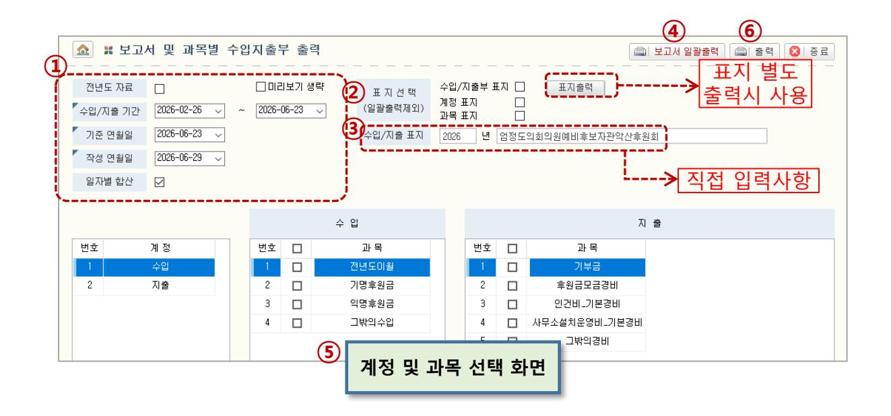

#### 🔵 일괄출력 방법

| ① 수입/지출 기간 등 | 회계보고기간 확인               |  |
|--------------|-------------------------|--|
| ② 표지선택       | 별도 안내가 없는 경우, 모두 체크     |  |
| ③ 수기 작성사항 기재 | 표지 및 보고서에 들어갈 사항을 직접 입력 |  |
| ④ [보고서 일괄출력] | 정치자금 수입・지출 보고사항 일괄 출력   |  |

#### 🔵 개별출력 방법

| 표지별 출력      | 위 ②의 콤보박스를 선택하여 [표지출력]을 클릭한다.                                    |  |
|-------------|------------------------------------------------------------------|--|
| 계정 및 과목별 출력 | 위 ⑤의 계정 및 과목 선택 화면에서 계정을 선택하고 과목명 체크(콤보)박스를 선택하여 ⑥ [출력]하면 된다. |  |

<!-- page: 52 -->

#### 다. 수입 • 지출 총괄표

| 년도 자료 🔹 간 201 | 26-02-26 🗸 ~ [2026 | -06-23 V 작성 | : 연월일 [2026-06-29 ] > |   |   |  |
|------------------|--------------------|-------------|-----------------------|---|---|--|
| 구 분              | 과                  | 목           | 금 액                   | 비 | 고 |  |
|                  | 전회보고시 누계액          |             | 0                     |   |   |  |
| 수                |                    | 기 명         | 6,100,000             |   |   |  |
| -                | 후원 금               | 의 명         | 0                     |   |   |  |
| 입                |                    | 소 계         | 6,100,000             |   |   |  |
|                  | 그 밖의 수입            |             | 0                     |   |   |  |
|                  | 합                  | 계           | 6,100,000             |   |   |  |
|                  | 기                  | 부 금         | 1,000,000             |   |   |  |
|                  | 후원;                | 글 모금경비      | 6,190                 |   |   |  |
| 지 출              | 기 본 경 비         | 인 건 비       | 0                     |   |   |  |
|                  |                    | 사무소설치·운영비   | 0                     |   |   |  |
|                  |                    | 소 계         | 0                     |   |   |  |
|                  | 그 밖의 경비            |             | 2.370                 |   |   |  |
|                  | 함 계                |             | 1,008,560             |   |   |  |
| 2                | 잔                  | 액           | 5,091,440             |   |   |  |

(3)

ି ମା ହ

① [조회] : 조회 조건에 따라 조회 가능하다.(회계보고 기간 확인) ② [출력] : 수입·지출총괄표를 출력한다.

③ [엑셀] : 수입·지출총괄표를 엑셀 다운로드 가능하다.

#### 라. 후원금 기부자 조회

(1) (2) 🏡 ដ 후원금 기부자 명단조회 🔍 조회 💼 출력 💽 엑셀 國 국세청자료 😫 종료 【 구 분 「 후 원 기 간 | 2026-02-26 ↓ ~ | 2026-06-23 ↓ 보고연월일 2026-06-29 ~ 연간 300만원 초과 기부자 전년도 자료 🔲 반 환 자 료 반 환 금 기 부 자 Q 반환자료저장 자 료 5 건 10,500,000 원 변호 반환 ㅎ원잌자 금액 비면역 성 명 생년월일 주 소 직 업 전화변호 קוו 5,000,000 1980-12-11 서울특별시 영등포 2026-02-26 [명후원금 송악산 1989-04-20 서울특별시 영등포구 의사당 2026-02-27 1.000.000 기명후원금 2026-03-02 1,000,000 기명후원금 3 오름산 1988-04-11 서울특별시 영등포구 의사( 4 지리산 1989-04-12 서울특별시 영등포구 의사5 2026-03-04 3.000.000 기명후원금 5 오름산 1988-04-11 서울특별시 영등포구 의사; 2026-03-10 500.000 기명후원금

① [조회] : 조회 조건(1회 30만원, 연간 300만원 등)에 따라 조회 가능하다.

② [출력] : 후원금 기부자 명단을 출력한다.

③ [엑셀] : 후원금 기부자 명단을 엑셀 다운로드 가능하다.

#### Tip!

기명후원금 자료 중 후원금 반환으로 1회 30만원, 연간 300만원 초과 기부자에 해당하지 않게 된 경우 목록에서 초과기부 건(+금액)과 반환 건(-금액)을 반환 □ 체크 후 [반환자료 저장]하여 초과 기부자에서 제외합니다([출력]을 통해 확인 가능)

<!-- page: 53 -->

#### 마. 감사의견서 등 출력

#### ● 감사의견서

| 🎰 🗰 감사의견서 등 출력 🕅 액셀 😢 종료                                                                           |
|----------------------------------------------------------------------------------------------------|
| 감사의견서 집계보고서 제출문서                                                                                   |
| 감 사 의 견 서                                                                                          |
| 「정치자금법」 제41조제1항에 따라 실시한 [2026년 [02]월 [26]일 부터 [2026]년 [6]월 [23]일 까지의 회계처리내역에 대한 감사의견은 다음과 같습니다. |
| 다 음                                                                                                |
| 가.감사기간: 2026년 6월 24일 ~ 2026년 6월 25일                                                                |
| 나. 감사대상 ② 재산상황                                                                                  |
| ⊙ 정치자금의 수입과 지출에 관한 내역 및 결산내역                                                                       |
| 2. 감사의견 : 「정치자금법」및 「정치자금사무관리 규칙」과 일반적으로 인정된 회계원칙에 따라 적정하게 처리함                                      |
| 3. 특기사항 : 없음                                                                                       |

#### ● 심사의결서

| ≿ ⊯ 감사의견서 등 졸력                     | 🔚 저장 🖾 출력 📕 액셀 🔽 종료   |
|------------------------------------|-----------------------|
| 감사의견서 실사의렵서 회계보고서 제출문서             |                       |
| 【】 재산 및 수입·지 출상:                   | 황 등의 심사 의결서           |
| 1. 의결주문                            |                       |
| 「정치자금법」 제41조 제1항에 따라 재산상황, 정치자금의 = | 수입·지출내역 및 결산내역(내역별첨)을 |
| 심사하고 다음과 같이 확정ㆍ의결한다.               |                       |
|                                    |                       |
| 가. 정치자금의 수입·지출기간 : 2026년 02월 26일 ~ | 2026년 6월 23일          |
| 나.재 산: 5,091,440 원                 |                       |
| 다. 정치자금의 수입·지출내역                   |                       |
| ● 수 입 :6,100,000 원                 |                       |
| ⊙ 지 출: 1,008,560 원                 |                       |
| ● 잔 액 : 5,091,440 원                |                       |
| 2026 년 06 월 26 일                   | 2                     |
| :긴동 3                              | 후원회 예산결산위원회           |
|                                    | :운영위원 성명:절약산 (인)      |
|                                    | :운영위원 성명:지리산 (인)      |
|                                    | : 운영위원 성명: 북한산 (인)    |
| 직 위                                | :운영위원 성명:계룡산 (인)      |
| 직 위                                | : 운영위원 성명: 아차산 (인)    |

#### ● 회계보고서 제출문서

| # 감사의견서 등 촐력                                              | 📄 저장 👝 출력 🔀 엑셀 😣 종 |
|-----------------------------------------------------------|--------------------|
| 사의견서 실사의결서 회계보고서 제출문서                                     |                    |
| 엄정도의회의원후보자홍길동 후원회                                         |                    |
| 문서번호 회계 2026 -                                            |                    |
| 시행일자 2026.06.29                                           |                    |
| 수 신 공명시 위원장                                               |                    |
| 제 목 엄정도의회의원후보자홍길동 후원회 회계보고서 제출                            |                    |
|                                                           |                    |
| 「정치자금법」제40조에 따라 후원회의 정치자금 수입ㆍ지출내역 을                       | 불임과 같이 제출합니다.      |
| 2. 수입지술 총괄표 1부. 3. 과목별 수입부 1부. 4. 과목별 지출부 1부.       |                    |
| 5. 과목별 영수증 그 밖의 증빙서류 사본 각 1부. 6. 1회 30만원 초과 기부자 명단 1부. |                    |
| 6. 1회 30년원 포파 가구자 8년 1구. 7. 정치자금 수입·지출 예금통장 사본 각 1부.   |                    |
| 8. 자체 감사기관의 감사의견서 1부.                                     |                    |
| 9.[대의기관(또는 수입기관) 의 십사의곁서 사본 1부.                           |                    |
|                                                           |                    |
|                                                           |                    |
| 엄정도의회의원후보자홍길동 후원회 대표자                                     | 계룡산 (인)            |
|                                                           |                    |

<!-- page: 54 -->

<!-- page: 55 -->

# 1. 자료 백업 방법

◎ 프로그램 종료([종료] 및 우측 [X] 클릭) 시 백업화면으로 전환되므로, 필요에 따라 프로그램이 저장된 작업경로에 백업할 수 있습니다.

※ 인터넷을 통해 저장되는 것이 아니므로 반드시 사용자가 사용PC의 백업여부를 확인해야 합니다.

가. 프로그램을 이용한 백업방법

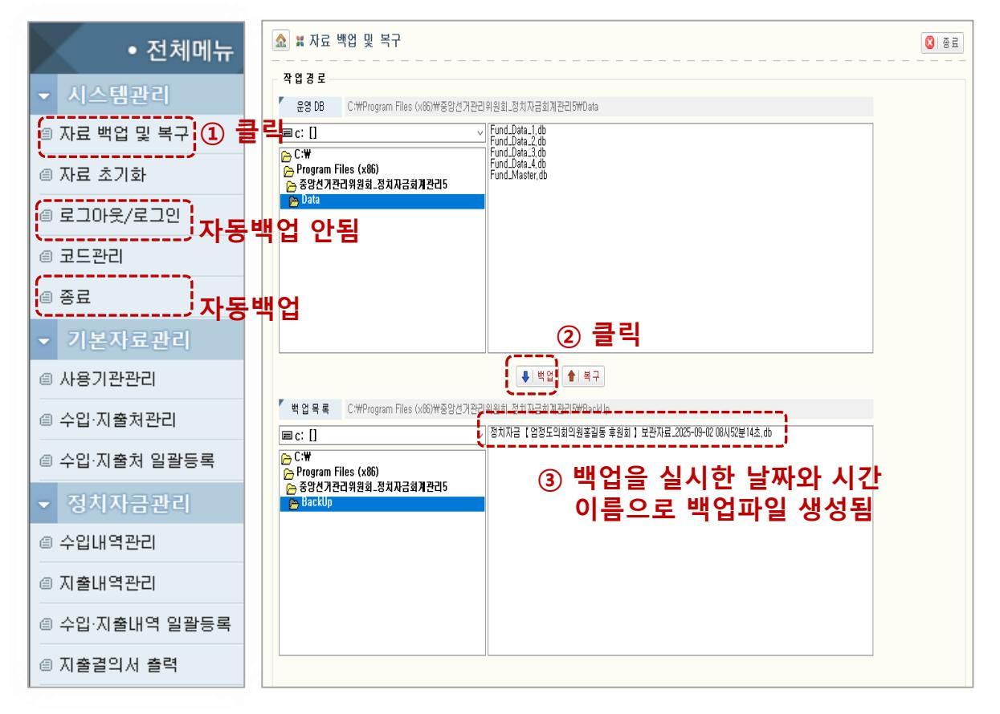

Tip!

- 1. 백업이 이뤄진 경우, 해당 날짜 및 시간별로 파일이 생성됩니다.
- 후보자, 후원회, 정당선거사무소 등 2개 이상의 사용자로 프로그램을 사용하는 경우에는 반드시 각각의 아이디를 확인하여 백업 및 복원에 유의해야 합니다.
   (로그아웃할 경우 자동백업되지 않음)

<!-- page: 56 -->

#### 나. 해당 폴더 또는 파일 복사를 통한 백업방법

회계관리 프로그램과 해당 자료가 포함되어 있는 폴더 전체를 복사하여 별도 저장매체에 저장한 후 필요시 다른 컴퓨터 등에서 사용하는 방법입니다.
 ※ 중앙선거관리위원회\_정치자금회계관리5(또는 중앙선거관리위원회\_정치자금회계 관리'숫자')-"Backup" 폴더에 별도로 백업된 자료가 있어야 합니다.

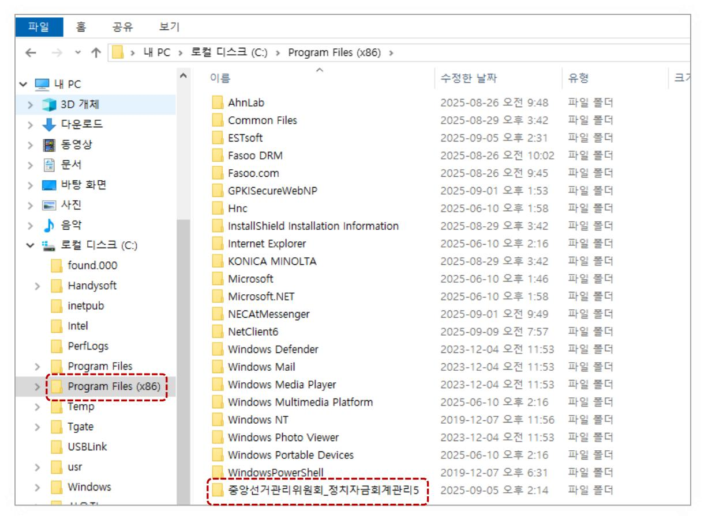

- 1. 윈도우 탐색기 또는 내컴퓨터를 실행하여 C드라이브에서 Program Files[또는 Program Files(x86)]를 클릭
- 해당 폴더에서 "중앙선거관리위원회\_정치자금회계관리5(또는 중앙선거관리위원 회\_정치자금회계관리'숫자')" 폴더를 선택
- 3. 복사하여 별도의 USB저장장치에 저장해두거나, 압축한 후 개인 이메일로 송부
   ※ USB저장장치를 사용할 경우 훼손 및 분실 등 관리에 유의하시기 바랍니다.

<!-- page: 57 -->

# 2. 자료 복구 방법

- 가. 프로그램을 이용한 복구방법
- ◎ 프로그램을 통해 백업을 한 경우에만 사용이 가능하며, 여러 차례 백업한 자료가 있는 경우 원하는 시점의 백업파일을 선택하여 복구하면 됩니다.

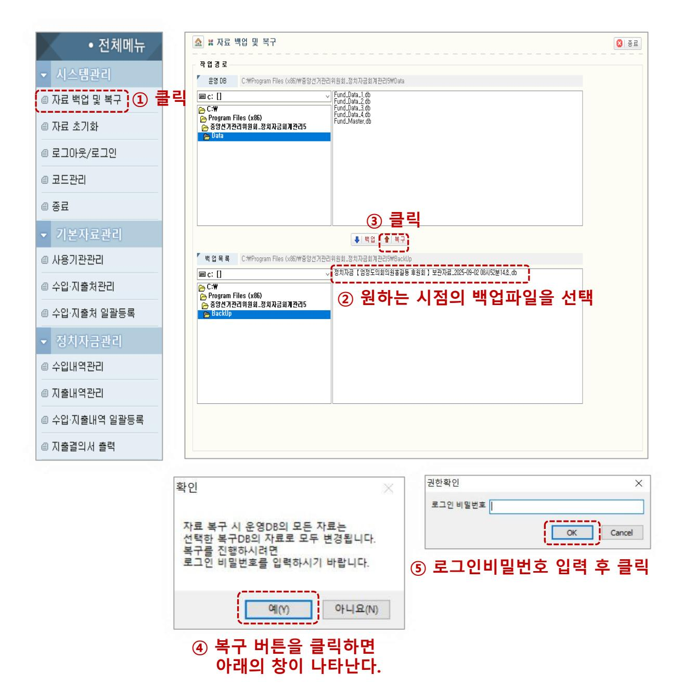

<!-- page: 58 -->

#### 나. 별도 저장된 파일 또는 폴더 이용 복구방법

- (1) 사전에 저장한"중앙선거관리위원회\_정치자금회계관리5(또는 중앙선거관리 위원회\_정치자금회계관리'숫자')"폴더를 C드라이브 Program Files(x86) 폴더 내에 복사합니다.
- (2) 기존에 회계관리 프로그램이 있는 경우 복사할 때에는"덮어쓰기"를 선택하여 복사하시면 됩니다.
- (3) "C:\#Program Files[또는 Program Files(x86)] \#중앙선거관리위원회\_
   정치자금회계관리5(또는 중앙선거관리위원회\_정치자금회계관리'숫자')"의
   폴더 내에 있는"PFund2"를 실행하여 회계관리프로그램을 사용할 수 있습니다.
- (4) 폴더 내의 자료는 아래 그림과 같습니다.

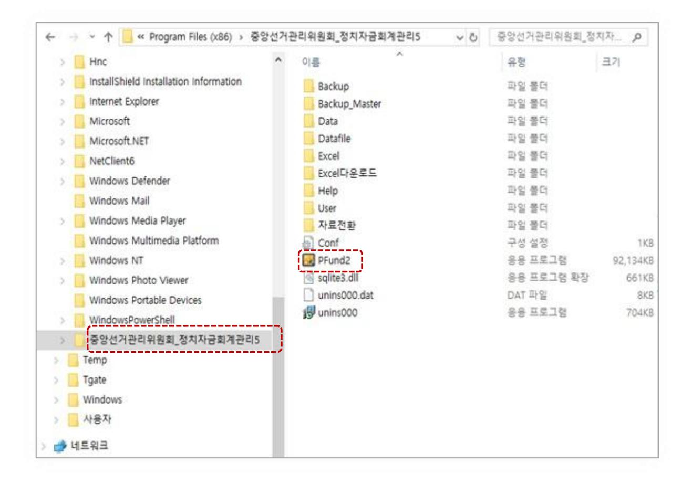